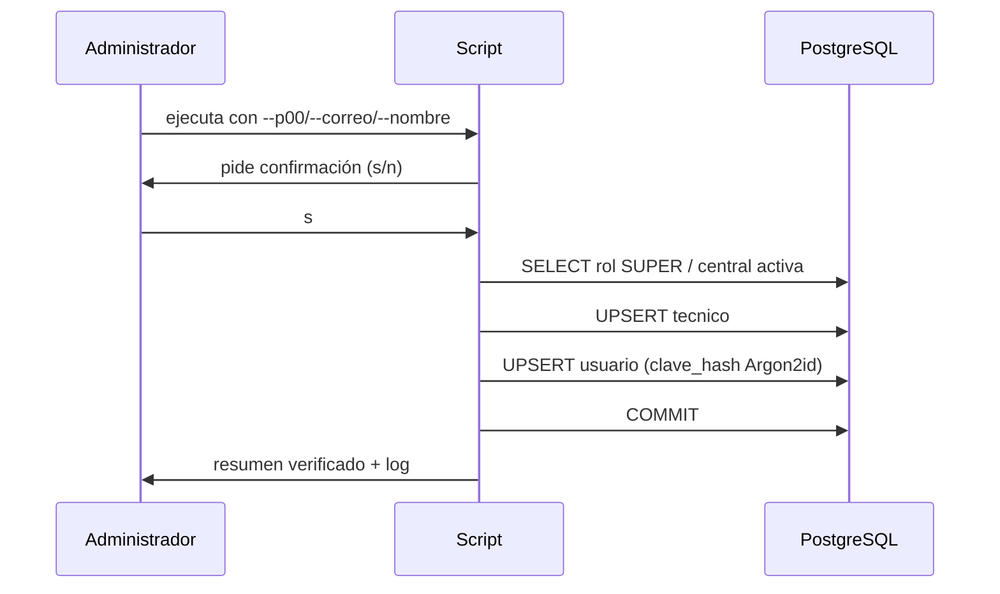
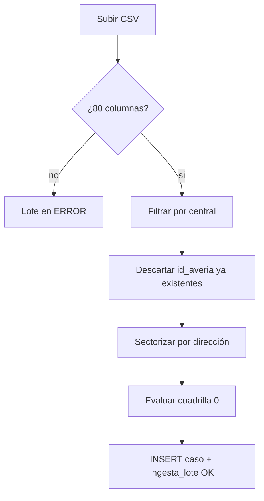

# Casos de uso de inyección — GGTO

> `@InyectaDatos` · procesos de carga de datos operativos sobre PostgreSQL.
> Los casos de uso funcionales del sistema están en la Fase 2; estos son los
> **operativos**, los que ejecuta un administrador de datos.

---

## CU-INY-01 — Crear/actualizar el Super Usuario

**Actor:** Administrador de datos · **Precondición:** base accesible y rol `SUPER` en el catálogo
**Flujo principal:**
1. Exportar las variables `DB_*` y `GGTO_SUPER_CLAVE`.
2. Ejecutar `scripts/inyectar_super_usuario.py` con `--p00`, `--correo` y `--nombre`.
3. El script confirma, resuelve el rol `SUPER` y la central, y hace *upsert* de `tecnico` y `usuario`.
4. Hashea la clave con Argon2id y hace `COMMIT`.
5. Verifica y registra el resultado en el log.

**Alternativos:** P00 inexistente → crea; P00 existente → actualiza (idempotente); sin central → aborta con código 4; rol inexistente → lo crea solo si es `SUPER`.

---

## CU-INY-02 — Crear técnicos y sus accesos

**Actor:** Supervisor · **Precondición:** central y rol `TECNICO` existentes
**Flujo:** `POST /api/v1/tecnicos` → el trabajador hace `POST /api/v1/auth/setup` y recibe sus 12 palabras.
**Alternativo:** P00 duplicado → `409`.

---

## CU-INY-03 — Cargar el archivo diario de averías

**Actor:** Supervisor · **Precondición:** central configurada y sectores creados
**Flujo:** `POST /api/v1/ingesta` con el CSV → el sistema filtra por central, deduplica por `id_averia`, sectoriza y resuelve la cuadrilla 0; registra el `ingesta_lote`.
**Alternativo:** repetir el mismo archivo → `0` nuevos y todos duplicados.

---

## CU-INY-04 — Sembrar un escenario de prueba completo

**Actor:** Administrador de datos · **Precondición:** base vacía
**Flujo:** central → sectores con direcciones → técnicos → flota → cuadrillas → ingesta del CSV.
**Alternativo:** borrar el escenario con `DELETE` en orden inverso (respetando claves foráneas).

---

## CU-INY-05 — Restablecer el acceso de un usuario

**Actor:** Usuario o supervisor · **Precondición:** el usuario tiene sus 12 palabras
**Flujo:** `POST /api/v1/auth/unlock` (3 palabras) o `POST /api/v1/auth/reset-password`.
**Alternativo:** palabras perdidas → el administrador re-ejecuta la inyección del usuario con una clave nueva.
