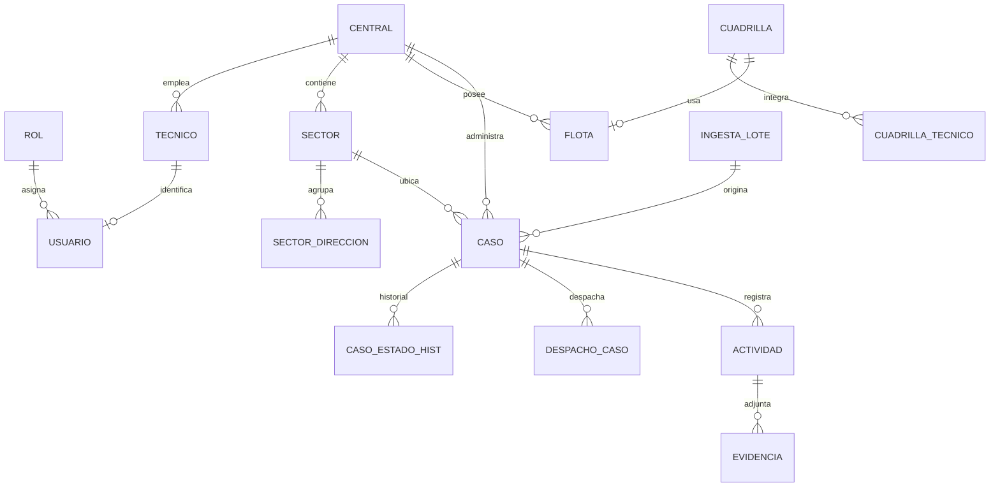
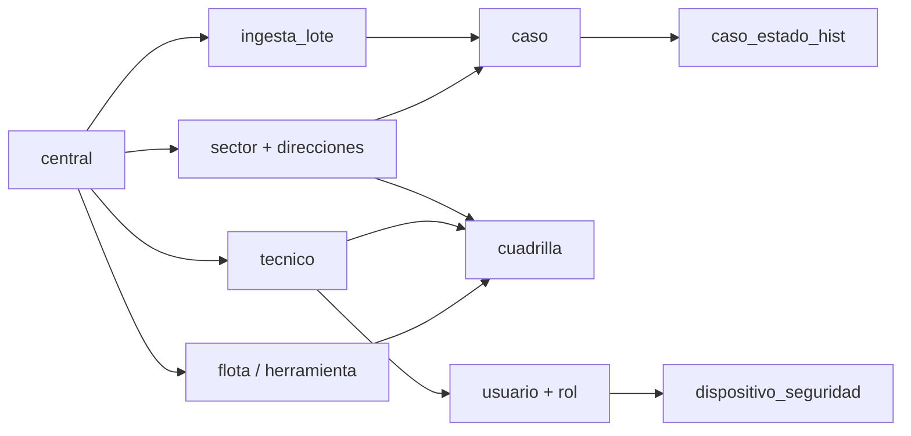

# Estructura de datos para operaciones — GGTO

> Documento de `@InyectaDatos` (adaptado: el proyecto **no usa blockchain/Anvil**;
> el sistema de persistencia real es **PostgreSQL**). Reutiliza
> `RepoTecnico/diccionario_datos.md` y `RepoTecnico/db/schema.sql`.

| Campo | Valor |
|---|---|
| Proyecto | GGTO — CANTV Central Francisco Salias (Área 4) |
| Base de datos | PostgreSQL 15.18 · base `ggtov2` (instancia `truekeate-db-dev`) |
| Usuario de datos | `ggtov2_app` |
| Migas de datos | `RepoTecnico/db/schema.sql` (DDL) · `RepoTecnico/diccionario_datos.md` |
| Roles | `SUPER`, `ADMIN`, `SUPERVISOR`, `TECNICO` |

---

## 1. Entidades que un operador puede poblar

| Entidad | Tabla | Origen habitual | Notas |
|---|---|---|---|
| Central | `central` | Configuración | Sembrada: `2324X` FRANCISCO SALIAS |
| Sector y direcciones | `sector`, `sector_direccion` | Configuración | Base de la sectorización por dirección |
| Técnicos | `tecnico` | Configuración (RF-02) | `p00` único; se replica en `usuario` |
| Usuarios y roles | `usuario`, `rol` | Configuración / inyección | `clave_hash` **Argon2id** (irreversible) |
| Dispositivo y palabras | `dispositivo_seguridad` | Primer inicio (RF-20) | 12 hashes; 3 para recuperación |
| Flota | `flota` | Configuración (RF-03) | `can` y `placa` únicos |
| Herramientas | `herramienta` | Configuración | `codigo` único |
| Cuadrillas | `cuadrilla`, `cuadrilla_tecnico`, `cuadrilla_herramienta` | Configuración (RF-04) | Cuadrilla 0 = `es_supervisor` |
| Casos | `caso` | Ingesta CSV (RF-01) o alta manual (RF-32) | `id_averia` único global; manuales usan `REF-…` |
| Lotes de ingesta | `ingesta_lote` | Ingesta | Trazabilidad de cada carga |
| Bitácora de estados | `caso_estado_hist` | Cambios de estado | RNF-12 |
| Catálogos | `causa`, `catalogo_metodo` | Configuración | Métodos de cierre/enrutado |
| Parámetros | `configuracion` | Configuración | Frases de cuadrilla 0, horarios, etc. |

## 2. Relaciones principales

## 3. Orden de carga (integridad referencial)

> **Regla:** primero la central y los catálogos; después técnicos y usuarios; luego flota,
> sectores y cuadrillas; y solo entonces los casos.

## 4. Procesos que generan registros

| Proceso | Genera | Frecuencia |
|---|---|---|
| Ingesta diaria del CSV | `ingesta_lote`, `caso` | Diaria |
| Alta manual en PANEL | `caso`, `caso_estado_hist` | Eventual |
| Edición / cambio de estado | `caso_estado_hist` | Por cambio |
| Configuración | `central`, `sector`, `tecnico`, `flota`, `cuadrilla` | Eventual |
| Primer inicio de la app | `dispositivo_seguridad` | Por usuario |
| Despacho (Ciclo 5) | `despacho`, `despacho_caso` | Diaria |
| Gestión técnica (Ciclo 8) | `actividad`, `evidencia` | Por visita |

## 5. Credenciales de los registros

- **Las claves de usuario NO son legibles**: `usuario.clave_hash` es Argon2id.
  La inyección debe fijar la clave **en claro en el momento de crear el registro**
  (el script la hashea) o dejar que el usuario use `POST /api/v1/auth/setup`.
- Las **12 palabras de seguridad** se guardan como hashes en
  `dispositivo_seguridad.palabras_hash` y solo se muestran una vez, al generarlas.
- Los secretos de infraestructura viven en **Secret Manager** (ver
  `RepoTecnico/credenciales/CREDENCIALES-GGTO.md`, ignorado por git).
