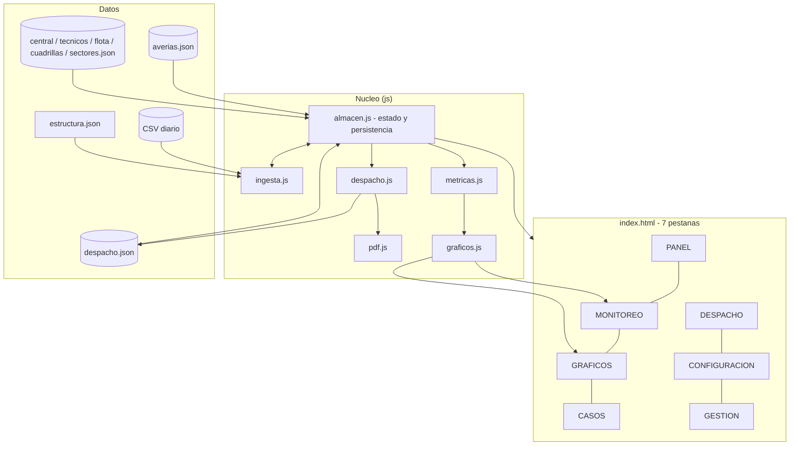

# Propuesta — Página HTML de Gestión de Averías (Central Francisco Salias, Área 4)

- **Versión:** v1 (borrador de concepto)
- **Fecha:** 2026-02-19
- **Fuente única analizada:** `RepoTecnico/PAGINA-GGTO-INICIAL.md` (64 líneas)
- **Alcance de este documento:** extracción de requerimientos, modelo de datos, arquitectura
  propuesta, plan de ciclos, riesgos y preguntas de cierre. **No** es todavía el SRS ni el
  plan de desarrollo definitivo.

---

## 1. Resumen ejecutivo

El objetivo (fuente, líneas 1-2) es una **página HTML autónoma** que concentre la gestión
operativa de las averías de la central **Francisco Salias (Área 4)**, con cinco
capacidades clave:

1. Conformar el **despacho diario** a las cuadrillas declaradas.
2. Crear **sectores de averías concentradas** (agrupación por cercanía de direcciones).
3. **Seguimiento a casos especiales**.
4. Generar el **reporte de trabajo diario** y el **reporte de gestión semanal**.
5. **Alimentarse diariamente** de un archivo `.csv` que se emite cada día y mantener su
   estado en archivos JSON (`averias.json`, `despacho.json`, `estructura.json`).

La propuesta técnica es una **aplicación web de una sola página (SPA estática)**, sin
servidor de aplicación obligatorio, construida en HTML + CSS + JavaScript vanilla, con
persistencia en los JSON del repositorio y lectura/escritura local vía **File System
Access API** (o, en su defecto, descarga del JSON actualizado). El motor de datos se
organiza en 7 pestañas, archivos de configuración y 2 procedimientos automatizables
(ingesta y despacho).

---

## 2. Lectura del documento fuente (trazabilidad literal)

| Sección fuente | Líneas | Qué establece |
|---|---|---|
| `[OBJETIVO]` | 1-2 | Página HTML de gestión de casos (reportes de avería) para la central Francisco Salias (área 4): despacho diario, sectores concentrados, seguimiento de casos especiales, reporte diario y semanal; datos actualizados desde un `.csv` diario. |
| `[DETALLE]` | 6-19 | 7 pestañas funcionales: PANEL (0), MONITOREO (0.1), GRAFICOS (0.2), CASOS (1), DESPACHO (2), CONFIGURACION (3 con 3.1 CENTRAL, 3.2 TECNICOS, 3.3 FLOTA, 3.4 CUADRILLA), GESTION (4). |
| `[PROCEDIMIENTOS] / [1. INGESTA]` | 29-38 | Proceso manual de 6 pasos: filtrar por datos de la central, extraer según `estructura.json`, descartar duplicados por `id_averia`, marcar `status = GESTION` según palabras clave, completar `sector` por dirección, insertar con `ingreso`, `clase = REP`, `nivel = COM`. |
| `[2. DESPACHO]` | 40-45 | Distribución por cuadrilla agrupando sectores próximos; cada cuadrilla recibe citados del día, ≥1 reparación de referidos y ≥1 de empresas; construcción solo a una cuadrilla (la que tenga reparaciones en ese sector); genera PDF por cuadrilla en carta horizontal. |
| `[GENERALIDADES]` | 47-52 | Tabla resumen con columnas fijas; flotante con el detalle completo y cierre de caso; agrupación por abiertos/cerrados, cuadrilla, tipo, clase y estatus; toda modificación persiste en `averias.json`. |
| `[ESTRUCTURAS]` | 54-58 | Definición de columnas de `averias.json` (30+ columnas), `despacho.json` (12 columnas) y `estructura.json` (19 columnas). |

---

## 3. Requerimientos extraídos

### 3.1 Requerimientos funcionales (RF)

| ID | Requerimiento | Fuente |
|---|---|---|
| RF-01 | Navegación por pestañas: PANEL, MONITOREO, GRAFICOS, CASOS, DESPACHO, CONFIGURACION, GESTION. | L6-19 |
| RF-02 | PANEL — búsqueda por `id_averia` o `telefono` (botón) que devuelve la ficha básica del caso desde `averias.json`. | L8 |
| RF-03 | PANEL — actualización de `status` (PEND/CERRADO/GESTION), `resolucion` (IVR/COS/COLA), `fechaResolucion` (DD/MM/AAAA), `observaciones` y `sacas` (SI/NO) por `id_averia` o `telefono`. | L8 |
| RF-04 | PANEL — alta de casos nuevos con datos mínimos (Fecha, Tipo, Actividad, Contacto, Nombre, Dirección, Información, Agente, etc.). | L8 |
| RF-05 | MONITOREO — 6 zonas con gráfico + tabla descriptiva: Gestión Diario, Gestión Semanal (curva lunes–sábado), Casos Globales (pendiente vs resuelto), Reparación (total pendiente por tipo), Construcción (pendiente por tipo), Cuadrilla (asignados vs cerrados vs gestionados por día). | L9 |
| RF-06 | GRAFICOS — mismas 6 zonas que MONITOREO con gráficos dedicados: barras (diario, globales, construcción, cuadrilla), curva (semanal), torta (reparación). | L10 |
| RF-07 | CASOS — registro principal de casos y su resolución, con clasificación Construcción/Reparación × Residencial/Empresa/Referidos. | L12 |
| RF-08 | DESPACHO — distribuir el universo de averías entre cuadrillas agrupando por dirección (sectores cercanos). | L13, L40-45 |
| RF-09 | DESPACHO — reglas de reparto: citados del día, ≥1 reparación de referidos y ≥1 de empresas por cuadrilla; construcción a una sola cuadrilla (con reparaciones en ese sector). | L42 |
| RF-10 | DESPACHO — generar los PDF del despacho diario, uno por cuadrilla, ajustados al área máxima imprimible de una hoja carta horizontal (con paginación). | L45 |
| RF-11 | CONFIGURACION/CENTRAL — datos operativos de la central (región, estado geográfico, capital, municipio, parroquia, estado operativo, distrito, área, central, nombre central) como filtro base de la matriz CSV. | L15 |
| RF-12 | CONFIGURACION/TECNICOS — padrón de trabajadores (Nombre, Cédula, P00, Teléfono, Correo, Especialidad, Status). | L16 |
| RF-13 | CONFIGURACION/FLOTA — padrón de vehículos (CAN00, Tipo, Marca, Modelo, Placa, Combustible, Status, Estado Cauchos, Estado Fluidos, Estado General). | L17 |
| RF-14 | CONFIGURACION/CUADRILLA — padrón de cuadrillas (campos por definir). | L18 |
| RF-15 | GESTION — bandeja de casos a consultar telefónicamente para clasificarlos correctamente antes del trabajo de calle. | L19 |
| RF-16 | INGESTA — cargar el CSV diario, filtrar por los datos de la central, extraer columnas según `estructura.json`, descartar duplicados por `id_averia`. | L31-35 |
| RF-17 | INGESTA — marcar `status = GESTION` en los casos que **no** contengan las palabras clave de fibra (LOSS ROJO, FALLA FIBRA, Fibra Dañada) en `ultimo_comentario`, `problema_reporte`, `informacion_1` o `informacion_2`; los que **sí** las contienen quedan en `status = PEND`. Las claves son editables en CONFIGURACION y la búsqueda es normalizada. | L36; D-11 |
| RF-18 | INGESTA — completar `sector` agrupando por `direccion` según los sectores declarados; si la dirección no tiene sector, solicitarlo al usuario. | L37 |
| RF-19 | INGESTA — insertar nuevos casos en `averias.json` con `ingreso = fecha de ingesta`, `clase = REP`, `nivel = COM`. | L38 |
| RF-20 | DESPACHO — extraer `id_averia, telefono, persona_reporta, contacto, nombre, direccion, fat, plan, serial` agrupando por `Reparador Principal`. | L44 |
| RF-21 | GENERALIDADES — tabla con columnas resumen: `nivel, clase, sector, id_averia, nombre, direccion, plan`. | L49 |
| RF-22 | GENERALIDADES — flotante con toda la información restante del caso y botón **CERRAR CASO** que captura los datos de resolución. | L50 |
| RF-23 | GENERALIDADES — agrupación de datos por abiertos/cerrados, cuadrilla, tipo, clase y estatus; incluye la edición manual de `clase` y `nivel` del caso. | L51; D-06 |
| RF-24 | GENERALIDADES — persistir en `averias.json` cada modificación de un caso. | L52 |
| RF-25 | Reportes — reporte de trabajo diario y reporte de gestión semanal (formato de salida por definir). | L2 |
| RF-26 | Seguimiento de casos especiales y de averías concentradas por sector. | L2, L13 |
| RF-27 | CONFIGURACION — gestionar la lista editable de palabras clave de clasificación y su modo de búsqueda (`claves_clasificacion.json`). | D-11 |

### 3.2 Requerimientos no funcionales (RNF)

| ID | Requerimiento | Justificación |
|---|---|---|
| RNF-01 | Usabilidad: operación guiada por botones, sin comandos; un operador debe poder hacer ingesta + despacho en una sesión corta. | L6, L31 ("el procedimiento que se ejecuta manualmente") |
| RNF-02 | Desempeño: manejo fluido de la tabla con el universo diario de averías del área (paginación o virtualización). | L13, L31 |
| RNF-03 | Portabilidad: página autónoma que abre en cualquier PC con navegador moderno, sin dependencias de servidor. | L1 |
| RNF-04 | Integridad: nunca duplicar casos por `id_averia` ni perder modificaciones al recargar. | L35, L52 |
| RNF-05 | Impresión: el PDF de despacho debe caber exactamente en carta horizontal por cuadrilla. | L45 |
| RNF-06 | Trazabilidad temporal: fechas en DD/MM/AAAA y semana operativa lunes–sábado. | L8, L9 |
| RNF-07 | Idioma y nomenclatura: interfaz en español, respetando los términos del dominio (PEND, CERRADO, GESTION, IVR, COS, COLA, sacas). | L8, L56 |

### 3.3 Restricciones / requisitos técnicos (RT)

| ID | Restricción | Fuente |
|---|---|---|
| RT-01 | Los datos de verdad viven en archivos: `averias.json`, `despacho.json`, `estructura.json`. | L54-58 |
| RT-02 | La fuente externa es un `.csv` diario con información operativa, administrativa, técnica y complementaria. | L31 |
| RT-03 | El filtro de la matriz CSV usa los campos operativos de CONFIGURACION/CENTRAL. | L33 |
| RT-04 | Los JSON deben respetar exactamente los nombres y el orden de columnas declarados. | L56-58 |
| RT-05 | `despacho.json` es un subconjunto reducido de columnas respecto de `averias.json`. | L57 |
| RT-06 | Restricción de navegador: desde `file://` no se puede leer ni escribir JSON del disco de forma transparente; se requiere un servidor local mínimo o la File System Access API / descarga de archivo. | Inferido |
| RT-07 | Sin acceso a internet garantizado en la central: las librerías (gráficos, PDF, CSV) deben quedar locales en el proyecto. | Inferido |

---

## 4. Modelo de datos propuesto

### 4.1 `averias.json` (entidad central — caso/avería)

| Grupo | Campos | Observaciones |
|---|---|---|
| Identificación | `id_averia`, `telefono`, `ingreso` | Clave natural `id_averia` (dedupe, RF-16). |
| Clasificación | `nivel` (REF/COM), `clase` (REP/CNS), `sector`, `Reparador Principal` | `nivel` = referido/común (residencial); `clase` = REP reparación / CNS construcción. |
| Abonado / contacto | `persona_reporta`, `contacto`, `nombre`, `direccion` | Base del agrupamiento por sector y del despacho. |
| Diagnóstico | `ultimo_comentario`, `problema_reporte`, `informacion_1`, `informacion_2`, `codigos_sin_gestion_en_VENAPP` | La `informacion` duplicada en el fuente (L56) se resuelve como dos columnas distintas: `informacion_1` e `informacion_2` (D-10). |
| Red / planta externa | `olt`, `plan`, `slot`, `puerto`, `fat`, `serial`, `ups`, `extra` | Necesarios para el trabajo de calle y el PDF de despacho. `extra` confirmado como dato de red / planta externa (D-04). |
| Gestión | `status` (PEND/CERRADO/GESTION), `resolucion` (IVR/COS/COLA), `fechaResolucion`, `observaciones`, `sacas` (SI/NO) | Campos que actualizan RF-03 y RF-22. |

### 4.2 `despacho.json`
`nivel, clase, id_averia, telefono, persona_reporta, contacto, ultimo_comentario, nombre,
direccion, plan, fat, serial` (L57). **No incluye** `sector`, `olt`, `slot`, `puerto`, `ups`
ni los campos de cierre: es una vista de trabajo de campo, no un maestro.

### 4.3 `estructura.json`
Contrato de extracción del CSV: `id_averia, telefono, persona_reporta, contacto,
ultimo_comentario, problema_reporte, informacion_1, informacion_2, nombre, direccion, olt, plan,
slot, puerto, fat, serial, extra, ups, codigos_sin_gestion_en_VENAPP` (L58). Es la
**especificación de mapeo columna-CSV → columna-JSON**.

### 4.4 Archivos de configuración (propuestos, derivados de la pestaña CONFIGURACION)

| Archivo propuesto | Contenido | Origen |
|---|---|---|
| `central.json` | región, estado geográfico, capital, municipio, parroquia, estado operativo, distrito, área, central, nombre central | L15 |
| `tecnicos.json` | nombre, cédula, P00, teléfono, correo, especialidad, status | L16 |
| `flota.json` | CAN00, tipo, marca, modelo, placa, combustible, status, estado cauchos, estado fluidos, estado general | L17 |
| `cuadrillas.json` | id, nombre, técnicos[] (N, desde `tecnicos.json`), vehículo (1, desde `flota.json`), turno, sectores[], status | L18; D-07 |
| `sectores.json` | id de sector, nombre, reglas de direcciones (calles/urbanizaciones), cuadrilla sugerida | L18, L37; RF-18 |
| `claves_clasificacion.json` | lista editable de palabras clave que marcan los casos que van a PEND (por defecto LOSS ROJO, FALLA FIBRA, FIBRA DAÑADA) y su modo de búsqueda | L36; D-11 |

**Relaciones:** `averias.sector` → `sectores.id`; `averias."Reparador Principal"` →
`cuadrillas.id` (o `tecnicos.nombre`); `despacho` = proyección de `averias` asignada a una
cuadrilla y fecha; `flota` 1—1 `cuadrillas`; `tecnicos` N—1 `cuadrillas`.

---

## 5. Arquitectura propuesta de la página



### 5.1 Estructura de archivos propuesta

```
GGTO-v1/
|- index.html
|- css/
|  \- estilos.css
|- js/
|  |- app.js            # arranque, enrutado de pestanas, estado global
|  |- almacen.js        # abrir/leer/escribir JSON (File System Access API + fallback)
|  |- ingesta.js        # RF-16 a RF-19
|  |- despacho.js       # RF-08, RF-09, RF-20
|  |- pdf.js            # RF-10 (jsPDF + autoTable, paginacion carta horizontal)
|  |- metricas.js       # agregaciones del MONITOREO
|  |- graficos.js       # Chart.js (barras, curva, torta)
|  |- casos.js          # tabla maestra + flotante + cierre de caso
|  |- panel.js          # RF-02 a RF-04
|  |- gestion.js        # RF-15
|  |- configuracion.js  # RF-11 a RF-14 + importacion CSV de padrones
|  \- reportes.js       # RF-25 (exportacion diaria/semanal)
|- datos/               # JSON de trabajo (los del fuente + los de configuracion)
\- lib/                 # papaparse, chart.js, jspdf + autotable (local, sin CDN -> RT-07)
```

### 5.2 Estrategia de persistencia (RT-06)

| Opción | Cómo funciona | Veredicto |
|---|---|---|
| A. Servidor local mínimo (`python -m http.server` o `npx serve`) + File System Access API | La página lee y **escribe** `averias.json` / `despacho.json` en disco con permiso del usuario. Conserva el modelo "archivo como base de datos". | **Recomendada** |
| B. Solo descarga | Al guardar, se descarga un `averias.json` actualizado que el operador reemplaza a mano. | Fallback (más propenso al error humano) |
| C. Backend propio (Node/Python + SQLite) | Migra a base de datos y elimina los JSON. | Solo si crece el alcance o hay varios operadores concurrentes |

---

## 6. Propuesta de interfaz por pestaña

| Pestaña | Bloques propuestos |
|---|---|
| **PANEL** | 3 tarjetas: `Buscar caso` (input + botón + ficha), `Actualizar gestión` (status, resolución, fecha, observaciones, sacas + botón Guardar), `Nuevo caso` (formulario corto + Agregar). |
| **MONITOREO** | Grilla 2x3: cada zona = gráfico + tabla descriptiva. Cabecera con fecha de corte y botón `Exportar`. |
| **GRAFICOS** | Misma grilla, solo gráficos a mayor tamaño: barras (Diario, Globales, Construcción, Cuadrilla), curva (Semanal), torta (Reparación). |
| **CASOS** | Filtros (abiertos/cerrados, cuadrilla, tipo, clase, estatus, sector) + tabla resumen (RF-21) + flotante de detalle agrupado por secciones (red, diagnóstico, abonado, gestión) con **CERRAR CASO** (RF-22). |
| **DESPACHO** | Botón `Generar despacho` → asignación editable por cuadrilla, validación de reglas (≥1 referido, ≥1 empresa, construcción única) y botón `PDF por cuadrilla`. |
| **CONFIGURACION** | Subpestañas CENTRAL / TECNICOS / FLOTA / CUADRILLA / SECTORES, con alta-edición-baja e importación CSV. |
| **GESTION** | Cola telefónica: casos en `status = GESTION`, ordenados por antigüedad y sector, con guion de preguntas y reclasificación rápida (COM/REF, REP/CNS). |

---

## 7. Reglas de negocio a implementar (extraídas)

1. **RN-01 (Ingesta):** un caso es nuevo si su `id_averia` no existe en `averias.json`.
2. **RN-02 (Ingesta):** `ingreso` = fecha de la ingesta; `clase` = REP; `nivel` = COM por defecto. La corrección a `CNS` (construcción) o a `REF` (referido) es **manual**, desde CASOS o GESTION (D-06).
3. **RN-03 (Ingesta):** si `ultimo_comentario` / `problema_reporte` / `informacion` **no** contiene
   "LOSS ROJO", "FALLA FIBRA" ni "Fibra Dañada" → `status = GESTION` (requiere verificación
   telefónica). Los casos que **sí** contienen esas frases quedan en `status = PEND`. Las palabras clave son una lista editable en CONFIGURACION (LOSS ROJO, FALLA FIBRA, FIBRA DAÑADA) y la búsqueda es normalizada (mayúsculas, sin tildes, variantes LOSS/LOS y DAÑADA/DANADA), de modo que absorbe los errores de tipeo del CSV (D-11).
4. **RN-04 (Sectores):** toda dirección debe quedar asociada a un sector; si no hay coincidencia,
   el sistema debe **solicitar** la incorporación del sector (L37).
5. **RN-05 (Despacho):** por cuadrilla → citados del día + ≥1 reparación de referidos + ≥1 de empresas.
6. **RN-06 (Despacho):** la construcción se asigna a **una sola** cuadrilla, la que tenga
   reparaciones en ese sector.
7. **RN-07 (Persistencia):** toda edición de un caso se refleja en `averias.json` de inmediato.
8. **RN-08 (Semana operativa):** lunes a sábado.

---

## 8. Plan de desarrollo por ciclos (hitos verticales, cada uno usable)

| Ciclo | Entrega | Requerimientos |
|---|---|---|
| C1 | Esqueleto + pestañas + CONFIGURACION (central, técnicos, flota, cuadrillas, sectores) + tabla CASOS + flotante + persistencia JSON. | RF-01, RF-07, RF-11 a RF-14, RF-21 a RF-24, RT-01/04/06 |
| C2 | INGESTA del CSV: carga, filtro por central, mapeo por `estructura.json`, dedupe, RN-03, asignación de sector con avisos. | RF-16 a RF-19 |
| C3 | PANEL (búsqueda, actualización de gestión, alta de casos) + pestaña GESTION telefónica. | RF-02 a RF-04, RF-15 |
| C4 | DESPACHO: agrupación por sector, reglas RN-05/RN-06, edición manual y PDF por cuadrilla. | RF-08 a RF-10, RF-20 |
| C5 | MONITOREO + GRAFICOS (6 zonas con métricas y Chart.js). | RF-05, RF-06 |
| C6 | Reportes: trabajo diario y gestión semanal exportables + seguimiento de casos especiales y averías concentradas. | RF-25, RF-26 |
| C7 | Pruebas funcionales con datos reales de una semana, ajuste de impresión y entrega + manual de usuario. | RNF-01 a RNF-07 |

---

## 9. Riesgos, supuestos y ambigüedades detectadas

### 9.1 Ambigüedades / inconsistencias del fuente (a resolver antes de codificar)

| ID | Hallazgo | Línea |
|---|---|---|
| A-01 | **Resuelto (D-09):** el maestro es `averias.json`; la mención a `averia.json` (L35) se corrige como error de tipeo. | 8, 35, 52 |
| A-02 | **Resuelto (D-10):** son dos columnas distintas del CSV; se guardan como `informacion_1` e `informacion_2` en `averias.json` y en `estructura.json`. | 56, 58 |
| A-03 | **Resuelto (D-07):** ficha de cuadrilla = `id, nombre, técnicos[], vehículo, turno, sectores[], status`, con técnicos y vehículo referenciados desde los padrones TECNICOS y FLOTA. | 18 |
| A-04 | `sector` se describe como `1/2/3` (numérico) pero también como "sectores declarados" configurables. Falta el catálogo y la regla dirección→sector. | 37, 56 |
| A-05 | "casos **citados** del día" (L42): no queda claro si son casos agendados, citas de abonado o reincidencias. | 42 |
| A-06 | **Resuelto (D-11):** la detección usa lista editable + normalización, lo que absorbe los typos del CSV («LOSS/LOS ROJO», «Fibra Danada»); los typos de interfaz («Recidencial», «Combistible») se corrigen en las etiquetas de la página. | 36, 56, 10, 17 |
| A-07 | **Resuelto (D-05):** los casos que **sí** contienen LOSS ROJO / FALLA FIBRA / Fibra Dañada quedan en `status = PEND`; los que no las contienen pasan a `status = GESTION`. Falta confirmar la `clase` de los casos con fibra (A-13). | 36 |
| A-08 | Formato de los reportes diario y semanal (PDF, XLSX, pantalla) sin especificar. | 2 |
| A-09 | "Casos especiales" (L2) no definidos: ¿reincidentes, empresariales, VIP, escalados? | 2 |
| A-10 | Regla de desempate si **varias** cuadrillas tienen reparaciones en el mismo sector de la construcción. | 42 |
| A-11 | `P00` (L16) sin significado explícito (¿código de nómina?); `ups` sin descripción. `extra` **resuelto (D-04):** es dato de Red / planta externa. | 16, 56 |
| A-12 | **Resuelto (D-08):** los encabezados del CSV diario son los declarados en `estructura.json` y los campos de CENTRAL existen como columnas; la ingesta se implementa genérica sobre ese contrato. | 31-34 |
| A-13 | **Resuelto (D-06):** todo caso ingerido entra con `clase = REP`; si corresponde a construcción/fibra, el operador la cambia a `CNS` manualmente en CASOS o GESTION. | 36, 38 |
| A-14 | `despacho.json` (L57) no incluye `sector` ni la cuadrilla (`Reparador Principal`) necesarios para agrupar el despacho (L44). ¿Se amplía el archivo o el agrupamiento solo se calcula en memoria? | 44, 57 |

### 9.2 Supuestos de trabajo

- El CSV llega con encabezados identificables y `estructura.json` actúa como mapa de columnas.
- Un solo operador usa la página a la vez (sin concurrencia).
- Existe un único archivo diario vigente por central/área.
- Las librerías de gráficos, PDF y CSV se almacenan localmente (sin CDN).

---

## 10. Preguntas de cierre (bloque 1 de 3)

1. **Ejecución y persistencia:** ¿se autoriza ejecutar la página con un servidor local mínimo
   (necesario para escribir `averias.json` en disco con File System Access API), o se prefiere
   que cada guardado descargue el JSON actualizado para reemplazarlo a mano?
2. **Alcance de la primera entrega:** ¿se construye el MVP (CONFIGURACION + CASOS + INGESTA +
   PANEL) y se dejan DESPACHO / MONITOREO / GRAFICOS para ciclos posteriores, o se quiere la
   página completa de una sola vez?
3. **Sectores y cuadrillas:** ¿cómo se define un sector operativamente (lista de calles y
   urbanizaciones, rangos de direcciones, o centro + radio) y qué campos debe tener la ficha
   de cuadrilla (nº de técnicos, vehículo, turno)?

---

## 10.1 Decisiones tomadas (respuestas al bloque 1)

| ID | Decisión | Impacto en el diseño |
|---|---|---|
| D-01 | **Persistencia:** servidor local mínimo + File System Access API. La página lee y escribe `averias.json` / `despacho.json` en disco con permiso del usuario. | Se adopta la Opción A de §5.2. Requiere un lanzador (`.bat`/`.ps1`) que levante el servidor local y abra el navegador. La Opción B queda solo como exportación manual de respaldo. |
| D-02 | **Alcance:** MVP primero = CONFIGURACION + CASOS + INGESTA + PANEL. | El primer entregable son los ciclos C1–C3. DESPACHO (C4), MONITOREO/GRAFICOS (C5), reportes (C6) y pruebas/entrega (C7) quedan como ciclos posteriores. La tabla maestra de CASOS y el flotante de cierre (RF-21 a RF-24) son obligatorios en el MVP. |
| D-03 | **Sectores:** lista de calles y urbanizaciones por sector. | `sectores.json` se define como `{ id, nombre, vias: [ "calle/urbanizacion", ... ], cuadrilla_sugerida }` y el emparejamiento dirección→sector es por coincidencia de texto normalizado (mayúsculas, sin tildes, tolerante a abreviaturas tipo "Av.", "Cll.", "Urb."). Los casos sin coincidencia se encolan para asignación manual (RN-04). |
| D-04 | **Columna `extra`:** pertenece a **Red / planta externa** de `averias.json` (no a diagnóstico). | Se reubica en §4.1 y deja de ser ambigüedad. |
| D-05 | **RN-03 completo:** los casos con "LOSS ROJO", "FALLA FIBRA" o "Fibra Dañada" quedan en `status = PEND`; los que no las contienen pasan a `status = GESTION`. | Cierra A-07. La `clase` de esos casos se definió después en D-06. |
| D-06 | **Clase al ingerir:** todo caso nuevo entra `clase = REP`; la corrección a `CNS` es manual (CASOS o GESTION). | Cierra A-13. Exige que CASOS y la bandeja GESTION permitan editar `clase` y `nivel`. |
| D-07 | **Ficha de cuadrilla:** `id, nombre, técnicos[], vehículo, turno, sectores[], status`. | Cierra A-03 y habilita el padrón CUADRILLA del ciclo C1; `técnicos` y `vehículo` se referencian desde TECNICOS y FLOTA. |
| D-08 | **Ingesta genérica:** los encabezados del CSV diario coinciden con `estructura.json` y con las columnas de CENTRAL. | Cierra A-12; la ingesta se implementa sobre el contrato declarado, sin mapeador en pantalla. |
| D-09 | **Nombre del maestro:** `averias.json` (plural). La mención a `averia.json` de L35 es un error de tipeo. | Cierra A-01; define la ruta única del archivo que la página debe abrir y escribir. |
| D-10 | **`informacion` duplicada:** son dos columnas distintas del CSV; se guardan como `informacion_1` e `informacion_2`. | Cierra A-02; se refleja en `averias.json`, en `estructura.json` y en la regla RN-03. |
| D-11 | **Palabras clave RN-03:** lista editable en CONFIGURACION (`claves_clasificacion.json`) con búsqueda normalizada (mayúsculas, sin tildes, variantes LOSS/LOS y DAÑADA/DANADA). | Cierra A-06; el operador puede añadir términos sin tocar el código y los typos del CSV no rompen la clasificación. |

Estas decisiones cierran la pregunta 1-3 del bloque 1 y la parte de catálogo de A-04.
Pendientes abiertas: A-04 (catálogo y numeración de sectores), A-05 («casos citados del día»), A-08 (formato de los reportes diario y semanal), A-09 (definición de «casos especiales»), A-10 (desempate de cuadrilla para construcción), A-11 (campos `P00` y `ups`) y A-14 (composición de `despacho.json`). Ninguna bloquea los ciclos C1–C3 del MVP; A-14 afecta al ciclo C4.

---

## 11. Criterios de aceptación de esta propuesta

- [ ] Los 27 RF, 7 RNF y 7 RT extraídos son reconocidos por el usuario como fieles al fuente.
- [ ] Está claro el modelo de datos (maestro `averias.json` + vista `despacho.json` + contrato `estructura.json` + configuración).
- [ ] El usuario aprueba la arquitectura (SPA estática con librerías locales) y la estrategia de persistencia.
- [ ] El plan de ciclos (C1–C7) es aceptado o reordenado.
- [ ] Las ambigüedades (A-01 a A-13) quedan resueltas o explícitamente diferidas con supuesto.
- [ ] Respuestas a los bloques 1-3 recibidas (11 decisiones D-01 a D-11; 7 ambigüedades cerradas: A-01, A-02, A-03, A-06, A-07, A-12, A-13).

> Al aprobarse esta propuesta se generarían los artefactos de Fase 1 del proyecto:
> `RepoTecnico/requerimientos.md`, `RepoTecnico/diccionario_datos.md`,
> `RepoTecnico/entornos_globales.md` y `RepoTecnico/estado_proyecto.md`, y se continuaría con
> los bloques de preguntas 2 y 3 antes de pasar a la Fase 2 (auditoría y casos de uso).
