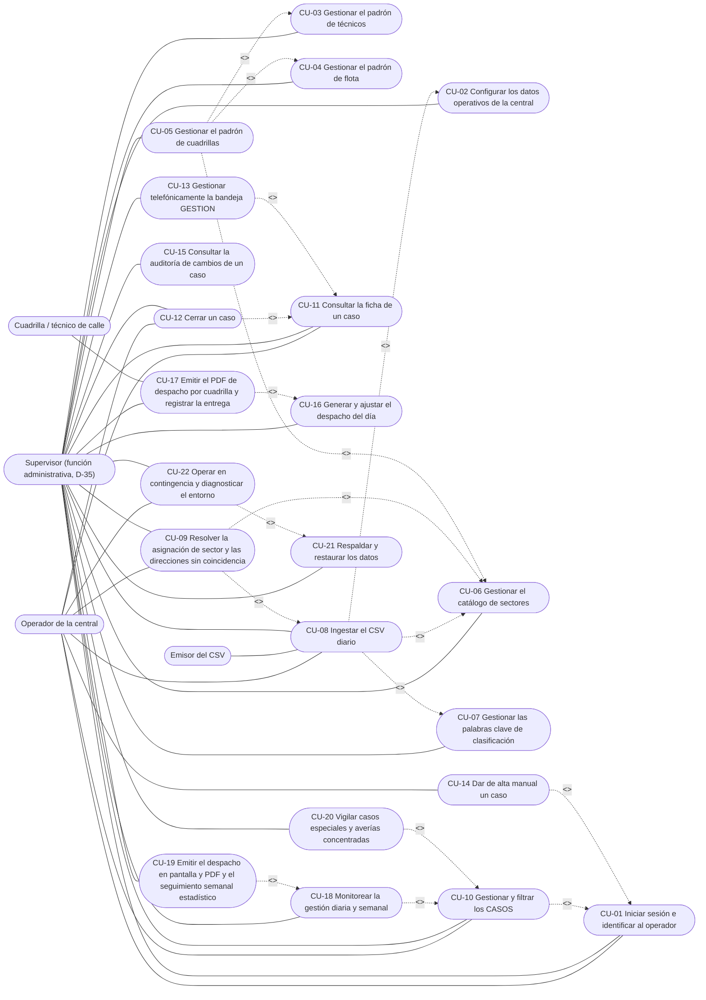
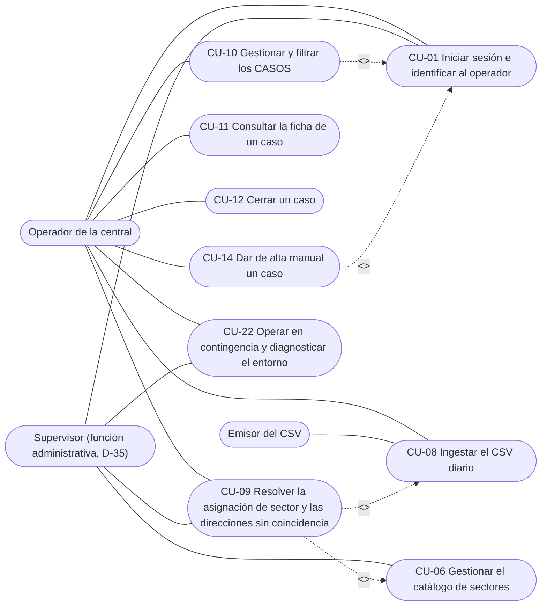
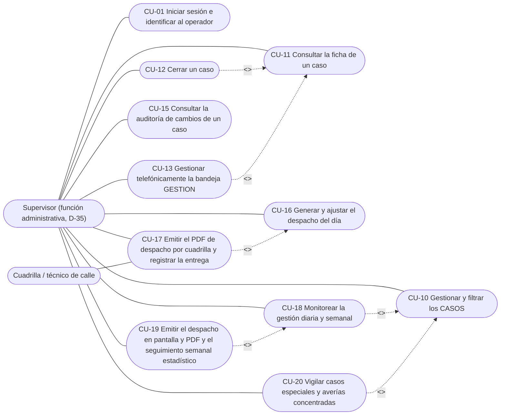
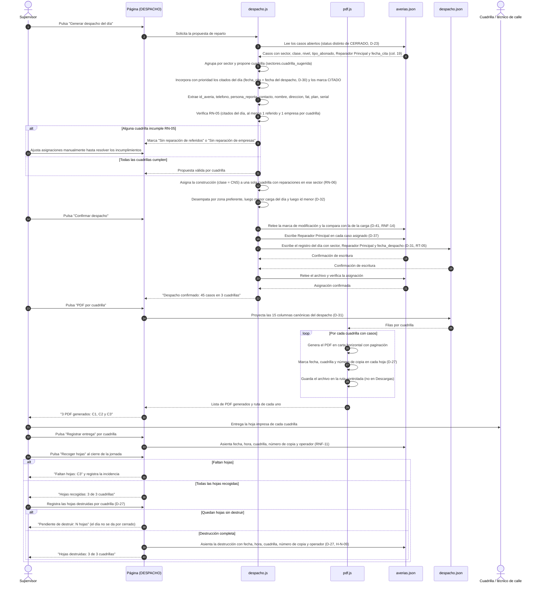
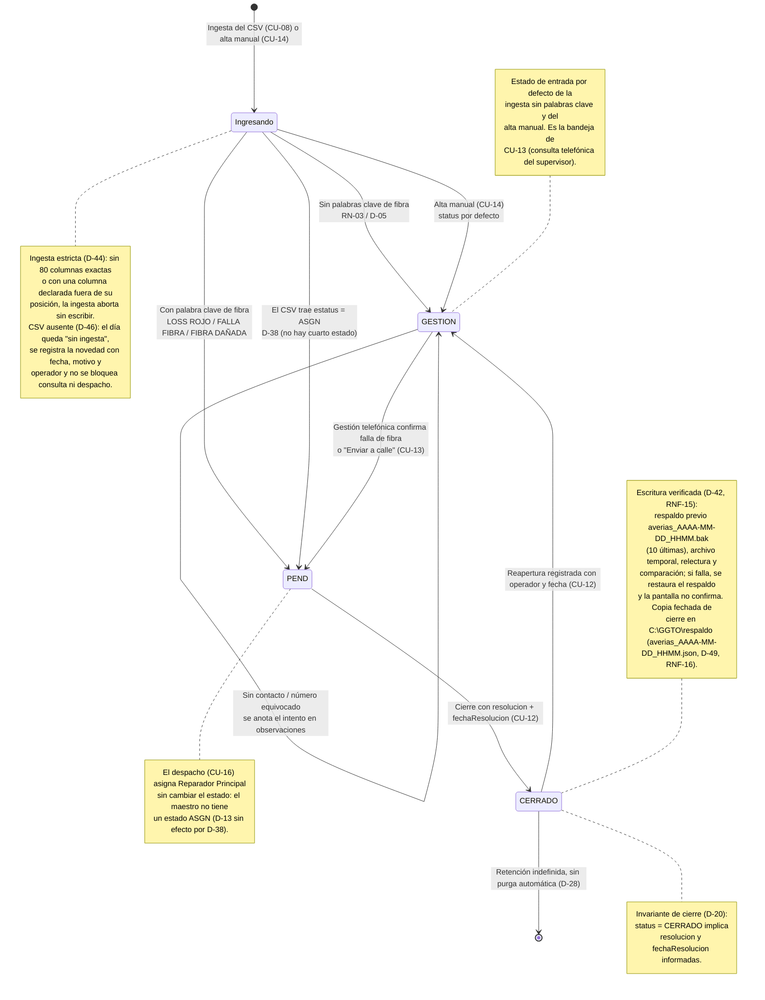

# Diagramas de Casos de Uso — Página HTML de Gestión de Averías (GGTO-v1)

- **Proyecto:** GGTO-v1 — Página HTML de gestión de averías de la central telefónica **Francisco Salias (Área 4)**, CANTV, Venezuela.
- **Fase:** 2 (Auditoría y casos de uso) — documento vivo.
- **Fecha de emisión:** 13/09/2026. **Revisión:** 15/09/2026, segunda pasada (cierre de la reauditoría de los casos de uso). Se incorporan **D-42** (escritura verificada con respaldo previo), **D-46** (CSV ausente / «sin ingesta»), **D-45 y D-50** (expiración de sesión de 8 horas y «sin sesión no se ve nada»: nueva secuencia de CU-01 en §3.1 y guarda de renderizado en todo el documento), **D-53** (las columnas 53 y 80 del CSV no se persisten: el rastro de origen es la col. 20), **D-55** (solo dos roles: operador y supervisor; el actor «auditoría / control interno» **se retira**), **D-56** (historial inmutable `historial.jsonl` *append-only*: el bloque §3.2 incorpora el *append* del cierre y de la reapertura) **D-57 y D-58** (los intentos fallidos de sesión y las acciones denegadas por rol se anotan en el **log de la aplicación** de 5 MB × 5 archivos, sin datos personales, §1.20 de `casos_uso.md`), **D-59** (el **emisor del CSV** solo participa en **CU-08**: se retira su relación con CU-09) y **H-33** (`CU05 include CU06` añadido al bloque canónico §1). Se corrigen además el nombre de la copia fechada (`averias_AAAA-MM-DD_HHMM.json`, H-N-08), la destrucción de las hojas impresas (D-27, H-N-09) y el rótulo «escritura atómica» (H-N-18).
- **Documento hermano:** `RepoTecnico/casos_uso.md` (22 casos de uso CU-01 a CU-22, con Gherkin, EARS y trazabilidad inversa a los 29 RF).
- **Fuentes:** `RepoTecnico/requerimientos.md`, `RepoTecnico/PROPUESTA-PAGINA-GGTO.md`, `RepoTecnico/diccionario_datos.md`, `RepoTecnico/entornos_globales.md`, `RepoTecnico/auditoria_fase1.md`, `RepoTecnico/estado_proyecto.md`, `RepoTecnico/casos_uso/auditoria_casos_uso.md`.
- **Notación:** los diagramas de casos de uso se expresan como *flowchart* de Mermaid (no existe un tipo UML nativo de casos de uso en Mermaid): los rectángulos con esquinas redondeadas son los **actores**, las elipses son los **casos de uso** y las flechas discontinuas etiquetadas `"<<include>>"` y `"<<extend>>"` son las relaciones UML. Los nombres de actores y de casos de uso son idénticos a los de `casos_uso.md`.
- **Convención única de dirección de las relaciones (H-06):** **el caso de uso que usa al otro lo incluye** (`A include B` = A invoca a B) y **el caso de uso que añade comportamiento al otro lo extiende** (`A extend B` = A añade comportamiento a B). Esta convención se aplica de forma idéntica en los **8 bloques**: §1 (vista completa), §2.1, §2.2, §2.3, §3.1, §3.2, §3.3 y §4. El bloque **§1 es la vista canónica**: toda relación de los bloques por actor debe aparecer en §1 y en la misma dirección.
- **Roles (D-35, D-55):** el rol «administrador» está absorbido por el **supervisor**; en los diagramas, el nodo `SUP` representa al **supervisor (función administrativa)**. **Solo existen dos roles —operador y supervisor— (D-55):** el «jefe de central» y el actor «auditoría / control interno» **no son roles del sistema**, sus funciones (consumo de cifras, consulta de la auditoría de cambios de CU-15 y control documental del despacho de CU-17) las ejerce el **supervisor**, y ningún diagrama dibuja un nodo de auditoría. La bandeja GESTION (CU-13) es exclusiva del supervisor (D-35, RNF-12). La sesión exige `P00` **y** contraseña (D-29, D-39).
- **Concurrencia (D-41, RNF-14):** no hay bloqueo de archivo. Todo guardado **relee** el archivo y compara su marca de modificación (`fecha_modificacion`) con la capturada al cargarlo; **si difieren, impide el guardado** y exige que el usuario elija entre *Recargar* o *Sobrescribir*, indicando quién y cuándo modificó por última vez (`usuario_modificacion` y `fecha_modificacion`). Los bloques §3.1, §3.2 y §3.3 muestran ese aviso de conflicto en su rama alternativa.
- **Estados del caso (D-38):** el maestro conserva **tres** estados —`PEND`, `GESTION` y `CERRADO`—; el `estatus = ASGN` del CSV se ingiere como **`PEND`** y **no** existe un cuarto estado en el maestro (queda sin efecto D-13).
- **Escritura verificada (D-42, RNF-15):** los bloques §3.1 y §3.2 muestran la secuencia completa del guardado del maestro —copia previa `averias_AAAA-MM-DD_HHMM.bak` (se conservan las **10** últimas), escritura en un **archivo temporal**, **relectura y comparación** del contenido y, solo entonces, confirmación en pantalla—; si algo falla, el respaldo se restaura y la pantalla **no** confirma.
- **CSV ausente (D-46):** el bloque §3.1 incorpora la rama «CSV ausente / sin ingesta»: la página marca el día, permite registrar la novedad (fecha, motivo y operador) en `datos/incidencias.log`, mantiene el maestro del día anterior y **no bloquea** la consulta ni el despacho.
- **Nada se ve sin sesión (D-50) y la sesión dura 8 horas (D-45):** antes de una identificación válida la página **no renderiza ningún dato** (tabla, conteos, fichas, gráficos o campos del maestro): solo se ve el diálogo de acceso. Al expirar las **8 horas** o al cerrar la sesión o la pestaña, la pantalla vuelve al diálogo y **oculta de inmediato** lo mostrado. El bloque **§3.1** incorpora la secuencia de acceso y expiración de **CU-01**, y todos los bloques por actor y de secuencia respetan la guarda (H-N-19). **El modo descarga de CU-22 exige la misma sesión válida** (H-N-02).
- **Rastro de origen (D-52, D-53, D-54):** al ingerir, el sistema conserva **solo la col. 20** (`ultimo_usuario`), que **inicializa `usuario_modificacion`**, y `fecha_modificacion` = **fecha de ingesta**; las columnas **53 (`usuario_acciona`) y 80 (`Fecha Hora Asignacion`) no se persisten** (D-53) y la **col. 18 (`fecha_compromiso`) tampoco** (D-54).
- **Historial inmutable (D-56):** cada cambio de un caso (`status`, `clase`, `nivel`, `tipo_abonado`, `sector`, `Reparador Principal`, cierre, `sacas`, `observaciones`) **añade** una línea a `C:\GGTO\datos\historial.jsonl` (JSON Lines, ***append-only***: nada se borra ni se sobrescribe) con `fecha_hora`, `operador` (`P00`), `id_averia`, `campo`, `valor_anterior`, `valor_nuevo` y `accion` (`edicion`/`cierre`/`reapertura`/`asignacion`/`ingesta`). El bloque **§3.2** muestra ese *append* en la secuencia del cierre; la lectura del historial alimenta la consulta de auditoría de **CU-15** y el respaldo lo copia junto con el maestro, **nunca recortado** (CU-21).
- **Los 8 bloques Mermaid de este documento:** §1 vista completa (bloque 1), §2.1 operador (bloque 2), §2.2 supervisor (bloque 3), §2.3 supervisor — función administrativa (bloque 4), §3.1 secuencia de la ingesta (bloque 5), §3.2 secuencia del cierre (bloque 6), §3.3 secuencia del despacho y su PDF (bloque 7) y §4 ciclo de vida del caso (bloque 8).

---

## 1. Diagrama de casos de uso — vista completa (bloque canónico)

**Título:** GGTO-v1 — Mapa de casos de uso por actor.
**Cubre:** CU-01 a CU-22 (`casos_uso.md`).
**Mermaid (flowchart equivalente al diagrama UML de casos de uso):**



---

## 2. Diagramas de casos de uso por actor

### 2.1 Operador de la central

**Título:** GGTO-v1 — Casos de uso del operador de la central.
**Cubre:** CU-01, CU-08, CU-09, CU-10, CU-11, CU-12, CU-14, CU-22.
**Restricción de rol (D-35, RNF-12):** el operador **solo consulta y cierra los casos de su propia cuadrilla** (`Reparador Principal` = `id` de su cuadrilla, D-37); **no** accede a la bandeja GESTION, a los padrones, a los sectores (salvo el sector mínimo de la cola), a las palabras clave, al despacho ni al respaldo. **La bandeja GESTION ya no aparece en este bloque: es exclusiva del supervisor** (CU-13). El **emisor del CSV** (`EMI`) es actor secundario **solo de CU-08** y **no participa en CU-09** (D-59): la titularidad de la cola de direcciones sin sector es del **supervisor** (rol elevado, D-35), y el operador conserva únicamente la creación del **sector mínimo** desde la cola (excepción de la matriz de §2.1 de `casos_uso.md`).



### 2.2 Supervisor

**Título:** GGTO-v1 — Casos de uso del supervisor.
**Cubre:** CU-01, CU-10, CU-11, CU-12, CU-13, CU-15, CU-16, CU-17, CU-18, CU-19, CU-20.
**Restricción de rol (D-35, D-55, RNF-12):** el supervisor puede **todo**, incluidas la bandeja GESTION (CU-13), la consulta y el cierre de cualquier caso, los padrones, el despacho, el respaldo, la restauración, la consulta de la auditoría de cambios (CU-15) y el control documental del despacho (CU-17). **No existe ningún otro rol** (el «jefe de central» y la «auditoría / control interno» quedan retirados del modelo por D-55).



### 2.3 Supervisor — función administrativa (absorbe el antiguo rol administrador, D-35)

**Título:** GGTO-v1 — Casos de uso de la función administrativa del supervisor.
**Cubre:** CU-01 a CU-07, CU-21, CU-22.
**Nota (D-35):** el rol «administrador» quedó absorbido por el supervisor; **no** se dibuja un actor administrador separado. Los padrones, los sectores, las palabras clave, la configuración de la central y el respaldo son funciones del supervisor.


---

## 3. Diagramas de secuencia

### 3.1 Secuencia — Ingesta del CSV diario

**Título:** GGTO-v1 — Secuencia de la ingesta diaria del CSV (RF-16 a RF-19, RF-27; RN-01 a RN-04; D-12, D-21, D-26, D-38, D-42, D-44, D-46; RNF-15).
**Cubre:** **CU-08** (flujo principal y alternativos 2a, 2b, 2c, 2d, 5b, 5c, 5d, 5a, 6a, 12a, 12b, 12c), con participación de **CU-02**, **CU-06** y **CU-07**.

```mermaid
sequenceDiagram
    autonumber
    actor OP as Operador de la central (o supervisor)
    participant UI as Página (app/index.html)
    participant ING as ingesta.js
    participant CFG as Configuración (C:\GGTO\datos)
    participant MAE as averias.json

    Note over UI,OP: Sin sesión válida la página no renderiza ningún dato: solo el diálogo de acceso (D-50)
    OP->>UI: Escribe P00 + contraseña y pulsa "Iniciar sesión" (CU-01, D-29, D-39)
    alt Credencial inválida o cambio obligatorio de contraseña
        UI-->>OP: "P00 o contraseña incorrectos" / "Debe cambiar la contraseña antes de operar" (D-39)
    else Sesión válida (8 horas, D-45)
        UI-->>OP: Habilita las 7 pestañas según la matriz de permisos (D-35, RNF-12)
    end
    OP->>UI: Pulsa "Cargar CSV diario" y elige el archivo
    UI->>ING: Inicia la ingesta con el archivo elegido
    ING->>CFG: Lee estructura.json, central.json, sectores.json y claves_clasificacion.json
    CFG-->>ING: Contrato posicional de 80 columnas + filtro de central + sectores + claves
    ING->>ING: Valida 80 columnas exactas, coincidencia posicional de cada columna declarada en estructura.json, separador ";" y al menos 1 registro de datos
    alt CSV ausente / sin ingesta (D-46)
        OP->>UI: No encuentra el archivo detalle_averias_gpon DD_MM_AAAA.csv
        UI-->>OP: Marca el día como "sin ingesta" y muestra la fecha del último archivo ingerido
        UI->>CFG: Registra la novedad (fecha, motivo y operador) en datos/incidencias.log
        Note over UI,CFG: El maestro del día anterior queda intacto y la consulta y el despacho siguen disponibles (D-46)
    else Contrato inválido o archivo de solo encabezado
        ING-->>UI: "Contrato de ingesta inválido" o "El archivo no contiene registros de datos"
        UI-->>OP: Aborta sin escribir el maestro y sin disparar el respaldo (D-21, D-44, H-14)
    else Contrato válido con datos
        ING->>ING: Filtra por las columnas 1-10 contra central.json
        Note over ING: Muestra 12/09/2026: 51 de Francisco Salias, 5 descartados por central
        ING->>MAE: Lee los id_averia existentes
        MAE-->>ING: Conjunto de ids presentes
        ING->>ING: Rechaza id_averia vacío y con prefijo MAN-, informándolo con su número de fila (H-09)
        ING->>ING: Dentro del lote, conserva solo la primera aparición de cada id_averia (H-09)
        ING->>ING: Descarta duplicados contra el maestro (RN-01)
        loop Por cada caso nuevo
            ING->>ING: Extrae informacion_1, informacion_2, estatus, unidad_negocio y ups
            ING->>ING: Rastro de origen: usuario_modificacion = ultimo_usuario (col. 20) y fecha_modificacion = fecha de ingesta (D-52, D-53); las col. 53 y 80 NO se persisten (D-53) y la col. 18 tampoco (D-54)
            alt estatus del CSV = ASGN
                ING->>ING: status = PEND (D-38; el maestro no tiene cuarto estado)
            else Sin ASGN y con palabra clave de fibra
                ING->>ING: status = PEND (D-05, D-26)
            else Sin ASGN y sin palabra clave
                ING->>ING: status = GESTION (D-05, D-26)
            end
            ING->>ING: tipo_abonado = EMP si unidad_negocio = CANTV EMPRESAS o ups = NRES (D-17)
            ING->>ING: Recorta fecha_reporte a DD/MM/AAAA y conserva fecha_reporte_original (D-21)
            ING->>CFG: Empareja direccion contra las vias de sectores.json
            alt Dirección sin coincidencia
                CFG-->>ING: Sin sector
                ING->>ING: Encola el caso para CU-09 (RN-04)
            else Dirección con coincidencia
                CFG-->>ING: id de sector
            end
            ING->>ING: ingreso = fecha de ingesta, clase = REP, nivel = COM (RN-02)
        end
        ING-->>UI: Resumen: 51 nuevos, 5 por central, 0 duplicados, 7 sin sector, N rechazadas
        UI-->>OP: Muestra el resumen y pide confirmación
        OP->>UI: Confirma la ingesta
        UI->>MAE: Relee la marca de modificación y la compara con la de la carga (D-41, RNF-14)
        alt La marca de modificación cambió
            MAE-->>UI: fecha_modificacion distinta + usuario_modificacion
            UI-->>OP: "Conflicto: el archivo fue modificado por <usuario> el <fecha>. Recargue o sobrescriba"
            Note over UI,MAE: No se escribe ningún caso hasta que el operador decida (D-41)
        else La marca coincide
            UI->>MAE: Copia previa a averias_AAAA-MM-DD_HHMM.bak, conservando las 10 últimas (D-42, RNF-15)
            MAE-->>UI: Respaldo previo verificado y disponible
            UI->>MAE: Escribe los casos nuevos en un archivo temporal (D-42)
            MAE-->>UI: Temporal escrito
            UI->>MAE: Relee el temporal y lo compara con el contenido escrito (51 registros, texto idéntico)
            MAE-->>UI: Comparación correcta: se reemplaza el maestro
            alt La relectura o la comparación fallan
                UI->>MAE: Restaura el respaldo averias_AAAA-MM-DD_HHMM.bak
                MAE-->>UI: Maestro restaurado al estado anterior
                UI-->>OP: "No se pudo verificar la escritura: se restauró el maestro del DD/MM/AAAA HH:MM" (no confirma la ingesta)
            else Verificación correcta
                UI->>MAE: Relee el archivo y verifica el conteo
                MAE-->>UI: 51 id_averia presentes
                UI-->>OP: "Ingesta completada: 51 casos nuevos (14 PEND + 37 GESTION)"
            end
        end
    end
    opt Sesión expirada (8 horas, D-45) o pestaña cerrada
        UI-->>OP: Vuelve al diálogo de acceso y OCULTA todo dato mostrado (tabla, conteos, fichas y campos del maestro)
        Note over UI,MAE: Sin identificación válida no se lee ni se escribe el maestro (D-50, RNF-08); lo ya guardado no se pierde (D-45)
    end
```

### 3.2 Secuencia — Cierre de un caso

**Título:** GGTO-v1 — Secuencia del cierre bloqueante de un caso (RF-03, RF-22, RF-24; D-20, D-35, D-37, D-39, D-42, D-56; RN-07; RNF-09, RNF-15).
**Cubre:** **CU-12** (flujo principal y alternativos 2a, 2b, 5a a 5d, 7a, 7b), con **CU-11** y **CU-15**.

```mermaid
sequenceDiagram
    autonumber
    actor OP as Operador de la central (o supervisor)
    participant UI as Página (PANEL / CASOS)
    participant CAS as casos.js
    participant ALM as almacen.js
    participant MAE as averias.json
    participant HIS as historial.jsonl

    OP->>UI: Busca el caso por id_averia o telefono y pulsa "Buscar"
    UI->>ALM: Solicita el caso
    ALM->>MAE: Lee el maestro con File System Access API
    MAE-->>ALM: Registro del caso (o varios si el teléfono coincide con más de uno)
    ALM-->>UI: Caso o lista de coincidencias
    UI-->>OP: Ficha básica y botón "Ver detalle"
    OP->>UI: Pulsa "Ver detalle" y abre el flotante
    OP->>UI: Pulsa "Cerrar caso"
    alt El caso no es de la cuadrilla del operador
        CAS-->>UI: Deniega la acción (D-35, RNF-12)
        UI-->>OP: "Acción no permitida para su rol: el caso no está asignado a su cuadrilla"
    else El caso es de su cuadrilla o la sesión es del supervisor
        UI-->>OP: Habilita resolucion (IVR/COS/COLA), fechaResolucion, observaciones y sacas (SI/NO)
        OP->>UI: Informa resolucion = COS, fechaResolucion = 13/09/2026, observaciones y sacas = NO
        OP->>UI: Pulsa "Confirmar cierre"
        UI->>CAS: Valida el cierre
        alt Falta resolucion o fechaResolucion
            CAS-->>UI: Error "Indique la resolución (IVR, COS o COLA)"
            UI-->>OP: Mantiene el botón deshabilitado y no escribe (D-20)
        else Enum o formato de fecha inválidos
            CAS-->>UI: Error "Fecha inválida: use DD/MM/AAAA" o "Sacas debe ser SI o NO"
            UI-->>OP: No escribe el archivo (RNF-10)
        else Datos válidos y sin conflicto de concurrencia
            CAS->>ALM: Relee la marca de modificación y la compara con la de la carga (D-41, RNF-14)
            ALM->>MAE: Copia previa a averias_AAAA-MM-DD_HHMM.bak, conservando las 10 últimas (D-42, RNF-15)
            MAE-->>ALM: Respaldo previo verificado y disponible
            ALM->>MAE: Escribe en un archivo temporal status = CERRADO, resolucion, fechaResolucion, observaciones, sacas
            ALM->>MAE: Escribe usuario_modificacion y fecha_modificacion en el temporal (D-16)
            MAE-->>ALM: Temporal escrito
            ALM->>MAE: Relee el temporal y lo compara con el contenido escrito (mismos registros y mismo texto)
            alt La relectura o la comparación fallan
                ALM->>MAE: Restaura el respaldo averias_AAAA-MM-DD_HHMM.bak
                MAE-->>ALM: Maestro restaurado al estado anterior
                ALM-->>UI: Escritura no verificada
                UI-->>OP: "No se pudo verificar la escritura del cierre: se restauró el maestro del DD/MM/AAAA HH:MM"
            else Verificación correcta
                MAE-->>ALM: status = CERRADO confirmado en el maestro
                ALM->>HIS: Append a historial.jsonl: una línea por campo cambiado con fecha_hora, operador (P00), id_averia, campo, valor_anterior, valor_nuevo y accion = cierre (D-56, RNF-09)
                HIS-->>ALM: Línea(s) añadida(s); el archivo solo crece y ninguna línea anterior se modifica ni se borra
                ALM-->>UI: Cierre confirmado
                UI-->>OP: "Caso 2026-00123 cerrado con resolución COS"
                Note over UI,HIS: El caso ya no cuenta como abierto (D-23); la secuencia de cambios queda en historial.jsonl para CU-15
            end
        end
    end
    opt El caso ya estaba CERRADO
        UI-->>OP: Muestra el cierre vigente y ofrece "Reabrir caso"
        OP->>UI: Confirma la reapertura
        UI->>MAE: status = GESTION + nota de reapertura en observaciones
        UI->>HIS: Append a historial.jsonl con accion = reapertura (valor_anterior = CERRADO, valor_nuevo = GESTION) (D-56)
    end
    opt Sesión expirada (8 horas, D-45) o pestaña cerrada
        UI-->>OP: Vuelve al diálogo de acceso y OCULTA la ficha y la tabla (D-50, RNF-08)
        Note over UI,MAE: Sin identificación válida no se modifica el maestro; lo ya guardado se conserva (D-45)
    end
    opt Otra sesión modificó el maestro desde la carga
        UI->>MAE: Relee fecha_modificacion y usuario_modificacion
        UI-->>OP: "Conflicto: el archivo fue modificado por 12345 el 13/09/2026 10:05. Recargue o sobrescriba"
        Note over UI,MAE: El cierre no se escribe hasta que el operador elija recargar o sobrescribir (D-41, RNF-14)
    end
```

### 3.3 Secuencia — Generación del despacho y su PDF por cuadrilla

**Título:** GGTO-v1 — Secuencia del despacho diario y del PDF por cuadrilla (RF-08 a RF-10, RF-20; RN-05, RN-06; D-27, D-30, D-31, D-32, D-37; RNF-05, RNF-11).
**Cubre:** **CU-16** y **CU-17** (flujos principales y alternativos 4a, 4b, 6a, 9b, 3b, 7a, 8a, 8b).



---

## 4. Diagrama de estados — ciclo de vida del caso

**Título:** GGTO-v1 — Ciclo de vida del caso (PEND / GESTION / CERRADO).
**Cubre:** reglas de estado aplicadas por **CU-08** (ingesta y clasificación), **CU-12** (cierre y reapertura), **CU-13** (gestión telefónica y «Enviar a calle»), **CU-14** (alta manual) y **CU-16** (despacho). Estados y transiciones según **D-05, D-06, D-20, D-21, D-23, D-38, D-42 (escritura verificada), D-45 (sesión de 8 horas), D-46 (CSV ausente), D-49 (copia fechada **con hora** de cierre) y D-50 (sin sesión no se ve nada)**; las guardas descartadas se detallan al final de esta sección.
**Cambio aplicado (H-07):** se **eliminó** la transición `PEND → GESTION` que la versión anterior atribuía a **CU-10**. Verificado contra los 22 casos de uso: CU-10 solo permite editar `clase`, `nivel` y `tipo_abonado`, su postcondición se limita a esas columnas y ninguno de sus criterios cambia el `status`; la vuelta a GESTION **no** existe como comportamiento de ningún caso de uso. Se **eliminó** también el cuarto estado `ASGN`: por **D-38** el `ASGN` del CSV entra como `PEND`. Se **eliminó** la transición `ASGN → PEND` («se retira la asignación de cuadrilla»), que tampoco implementaba ningún caso de uso.



**Transiciones y guardas pendientes de decisión del usuario (H-07, H-10).** El ciclo de vida queda **cerrado** en cuanto a los estados vigentes (PEND, GESTION, CERRADO), pero **dos guardas siguen sin dueño funcional** y **no** se dibujan como transiciones hasta que se decidan:

1. **`GESTION → ASGN`** («la gestión telefónica decide la asignación»): **eliminada** por D-38. «Enviar a calle» (CU-13) deja el caso en `PEND` y la asignación de cuadrilla la hace el despacho (CU-16) sin cambiar el estado.
2. **`PEND → GESTION`** («reclasificación manual a gestión telefónica»): **eliminada** por H-07. Si el usuario decide que debe existir, debe añadirse primero a un caso de uso con su validación de enum y su auditoría (por ejemplo CU-10 editando `status`, o CU-13), y solo entonces volver a dibujarse aquí.
3. **`ASGN → PEND`** («se retira la asignación de cuadrilla»): **eliminada** por D-38 y porque ningún caso de uso la implementa. Retirar una asignación es hoy una edición de `Reparador Principal` en CU-16 sin cambio de estado.
4. **Concurrencia:** **decidida** por D-41 y RNF-14 (sin bloqueo; relectura de la marca de modificación y decisión obligatoria entre recargar o sobrescribir). La **escritura verificada con respaldo previo** (no «atómica»: D-42 solo especifica copia previa `.bak`, archivo temporal, relectura comparada y restauración) y el versionado del maestro quedaron decididos por **D-42** y RNF-15 (respaldo previo `.bak` con las 10 últimas, archivo temporal, relectura y comparación, y restauración si algo falla), y el **respaldo** por **D-49** y RNF-16; el diagrama no dibuja ninguna guarda sin dueño funcional y **no queda ningún punto `&lt;PENDIENTE&gt;`** en esta sección.

---

## 5. Correspondencia entre diagramas y casos de uso

| Bloque | Diagrama | Tipo | Casos de uso representados |
|---|---|---|---|
| §1 | Vista completa (bloque canónico) | Casos de uso (UML en flowchart) | CU-01 a CU-22, con actores operador, supervisor (función administrativa, D-35, D-55), cuadrilla y emisor del CSV —actor **solo de CU-08** (D-59)— (**el actor «auditoría / control interno» se retira por D-55**) |
| §2.1 | Operador de la central | Casos de uso por actor | CU-01, CU-08, CU-09, CU-10, CU-11, CU-12, CU-14, CU-22 (con el **supervisor** como titular de la cola de CU-09, D-59, y el emisor del CSV solo en CU-08) |
| §2.2 | Supervisor | Casos de uso por actor | CU-01, CU-10, CU-11, CU-12, CU-13, CU-15, CU-16, CU-17, CU-18, CU-19, CU-20 |
| §2.3 | Supervisor — función administrativa | Casos de uso por actor | CU-01 a CU-07, CU-21, CU-22 |
| §3.1 | Acceso/sesión e ingesta del CSV | Secuencia | **CU-01** (acceso, credencial inválida, cambio obligatorio y expiración de las 8 horas: D-45 y D-50) y **CU-08** (principal), con CU-02, CU-06 y CU-07; incluye la rama «CSV ausente / sin ingesta» (D-46) y el guardado verificado con respaldo previo, temporal, relectura y comparación (D-42, RNF-15), además de la rama de conflicto de concurrencia (D-41) |
| §3.2 | Cierre de un caso | Secuencia | CU-12 (principal), CU-11, CU-15; incluye el guardado verificado con respaldo previo, temporal, relectura y comparación (D-42, RNF-15), el **append a `historial.jsonl`** del cierre y de la reapertura (D-56, RNF-09), la rama de conflicto de concurrencia (D-41) y la guarda de expiración de sesión (D-45, D-50) |
| §3.3 | Despacho y PDF | Secuencia | CU-16 y CU-17 (principales), CU-05 (padrón de cuadrillas); relectura de la marca antes de confirmar (D-41) y control documental completo —entrega, recogida **y destrucción** de las hojas— (D-27) |
| §4 | Ciclo de vida del caso | Estados | CU-08, CU-12, CU-13, CU-14, CU-16 |

**Verificación de coherencia (H-06, H-07, H-33, H-34, H-N-19, H-N-23):**

1. **Dirección única de las relaciones.** El bloque canónico §1 declara hoy **17 relaciones**: `CU10 include CU01`, `CU14 include CU01`, `CU08 include CU02`, `CU08 include CU06`, `CU08 include CU07`, `CU09 include CU06`, `CU12 include CU11`, `CU13 include CU11`, `CU17 include CU16`, `CU18 include CU10`, `CU20 include CU10`, `CU19 include CU18`, `CU05 include CU03`, `CU05 include CU04`, **`CU05 include CU06`** (añadida por H-33: ya existía en §2.3 y está respaldada por `casos_uso.md`, CU-05 → CU-06), `CU22 include CU21` y `CU09 extend CU08`. **No todas se repiten en los bloques por actor**, porque el bloque §1 es la vista completa del sistema: quedan fuera de los bloques por actor `CU08 include CU02/CU06/CU07` (la ingesta incluye configuración y catálogos sin dibujarlos como actores independientes) y `CU05 include CU06` (que sí aparece en §2.3); el inventario de esta lista es el correcto y ya no promete una repetición universal (H-N-23).
2. **Nodo duplicado eliminado.** Desaparece el nodo `CU06_EXT` del bloque §2.1: CU-06 aparece una sola vez por bloque y con su nombre completo («Gestionar el catálogo de sectores»), idéntico al de `casos_uso.md` (H-06).
3. **Nombres idénticos a `casos_uso.md`**, incluidas las cuatro etiquetas antes abreviadas: CU-09 «Resolver la asignación de sector **y las direcciones sin coincidencia**», CU-15 «Consultar la auditoría de cambios **de un caso**», CU-17 «Emitir el PDF **de despacho** por cuadrilla y registrar la entrega» y CU-19 «Emitir el despacho en pantalla y PDF **y el seguimiento semanal estadístico**».
4. **Etiquetas de relación normalizadas.** Todas usan `|"<<include>>"|` o `|"<<extend>>"|`; se corrigieron las tres etiquetas con comilla simple faltante (`<<extend>>|`) del bloque §1 (H-33).
5. **Bloques numerados.** Los 8 bloques Mermaid quedan identificados en el encabezado y referenciados con la misma numeración en esta tabla (H-34).
6. **Estados.** El diagrama §4 declara tres estados y ninguna transición sin dueño funcional (H-07, D-38).
7. **Concurrencia.** Los bloques §3.1, §3.2 y §3.3 muestran la relectura de la marca de modificación y el aviso de conflicto con usuario y fecha/hora, coherentes con D-41 y RNF-14; ninguno dibuja un bloqueo de archivo que el sistema no implemente.
8. **Escritura verificada (D-42, RNF-15) y CSV ausente (D-46).** El bloque §3.1 incorpora, en su rama de escritura, la copia previa `.bak` con retención de **10** versiones, la escritura en archivo temporal, la relectura comparada y la restauración del respaldo ante fallo; y en su primera rama el caso «CSV ausente / sin ingesta» con el registro de la novedad en `datos/incidencias.log`. El bloque §3.2 aplica la misma secuencia de D-42 al cierre, con su rama de restauración. Se evita el rótulo «escritura atómica», que D-42 no promete (H-N-18).
9. **Sesión y visibilidad (D-45, D-50).** El bloque §3.1 abre con la secuencia de **CU-01** (acceso con `P00` + contraseña, credencial inválida, cambio obligatorio y sesión válida de 8 horas) y cierra con la guarda de **expiración**; el bloque §3.2 incorpora la misma guarda para el cierre. Ningún bloque dibuja datos renderizados sin sesión válida y el **modo descarga de CU-22 exige la misma sesión** (H-N-02, H-N-19).
10. **Roles (D-55).** Ningún bloque dibuja el nodo `AUD`: el actor «auditoría / control interno» se retira del modelo y la consulta de la auditoría de cambios (CU-15) y el control documental del despacho (CU-17) quedan como acciones del supervisor (`SUP`). Los únicos actores dibujados son el operador, el supervisor, la cuadrilla y el **emisor del CSV**, este último **solo relacionado con CU-08** (D-59): ningún bloque lo une a CU-09.
11. **Rastro de origen (D-52, D-53, D-54).** El bloque §3.1 declara expresamente que `usuario_modificacion` se inicializa con la **col. 20** y `fecha_modificacion` con la **fecha de ingesta**, y que las columnas **53 y 80** (y la **18**) **no se persisten**.
12. **Control documental (D-27).** El bloque §3.3 cubre la entrega, la recogida **y la destrucción registrada** de las hojas impresas, con su rama de hojas pendientes de destruir (H-N-09).
13. **Respaldos.** La copia de cierre se dibuja con el nombre **`averias_AAAA-MM-DD_HHMM.json`** (fecha **y hora**), de modo que dos respaldos del mismo día no colisionan (H-N-08) y **junto con `historial.jsonl`, que se copia íntegro y nunca se recorta** (D-56, CU-21). Los 8 bloques Mermaid se revisaron y son sintácticamente válidos.
14. **Historial inmutable (D-56).** El bloque **§3.2** muestra el *append* a `historial.jsonl` (una línea por campo cambiado, con `accion = cierre` y, en la reapertura, `accion = reapertura`) y el participante `historial.jsonl`; **ningún** bloque dibuja una operación de edición o de borrado sobre ese archivo, coherente con el carácter *append-only* de D-56 y con la consulta de auditoría de CU-15.
