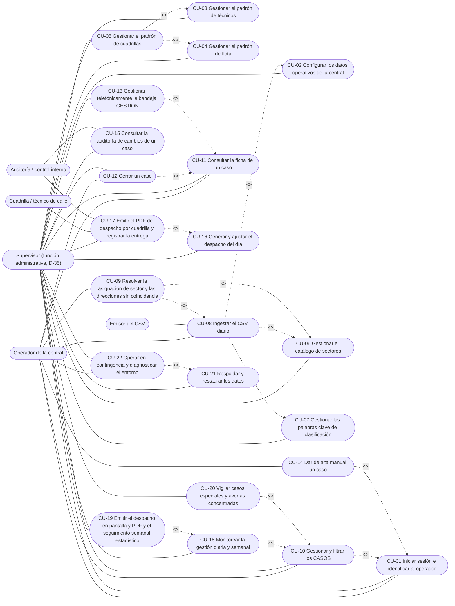
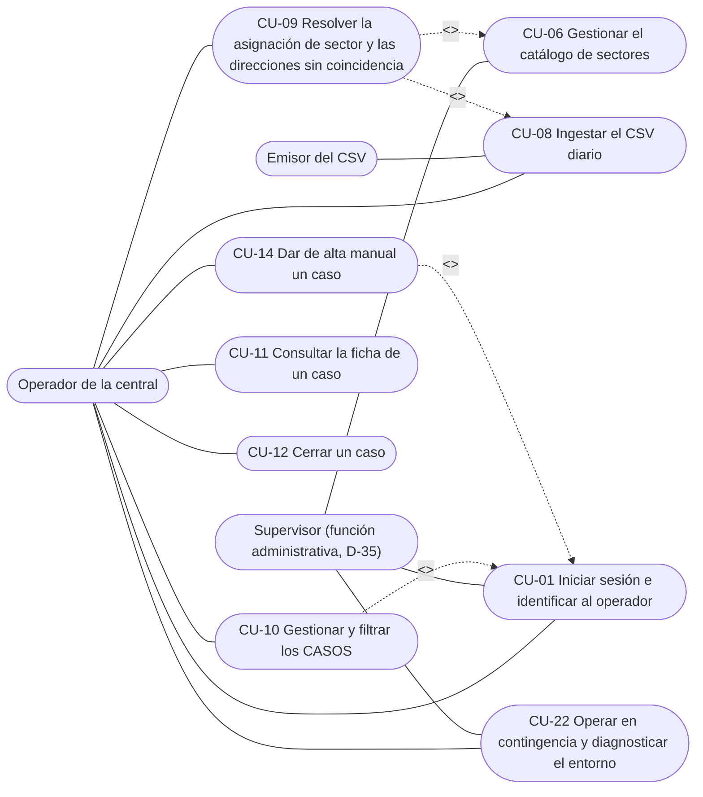
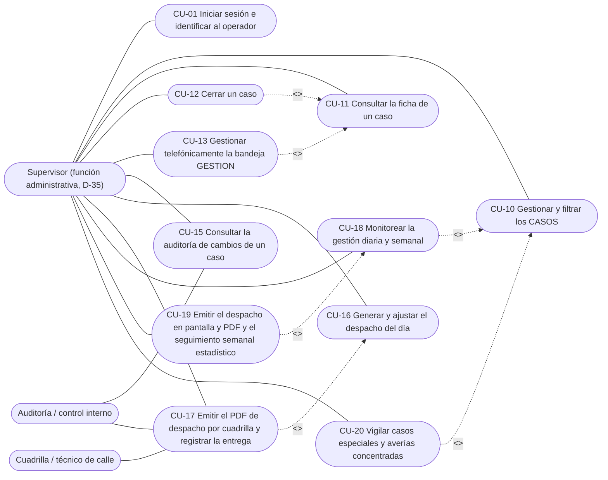
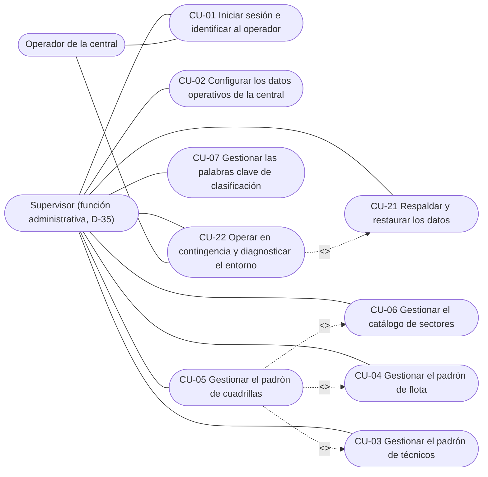
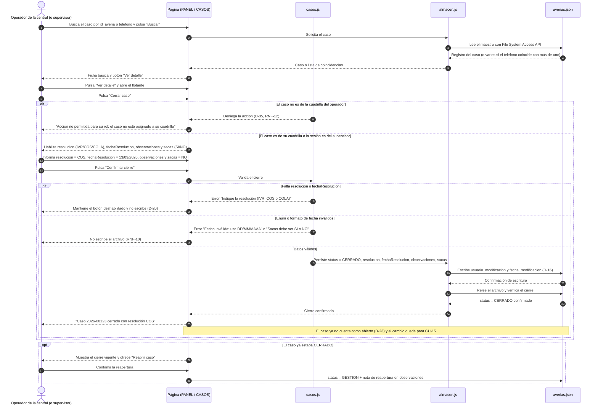
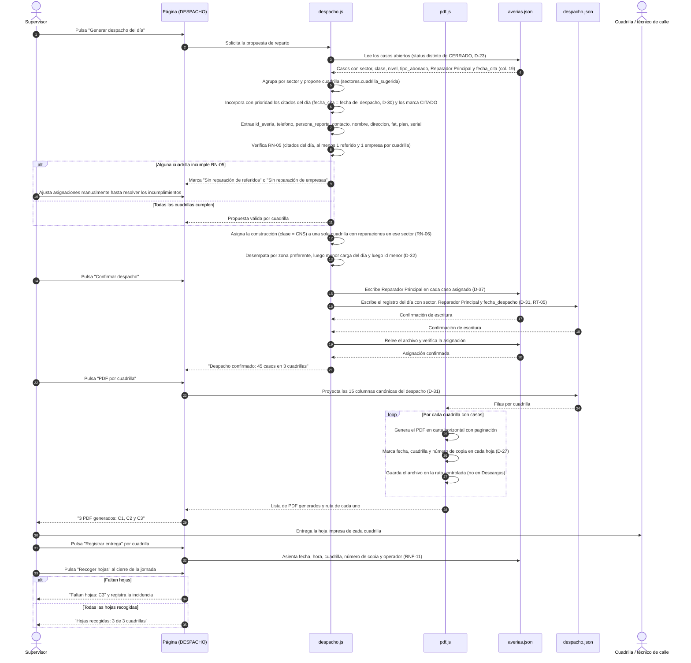
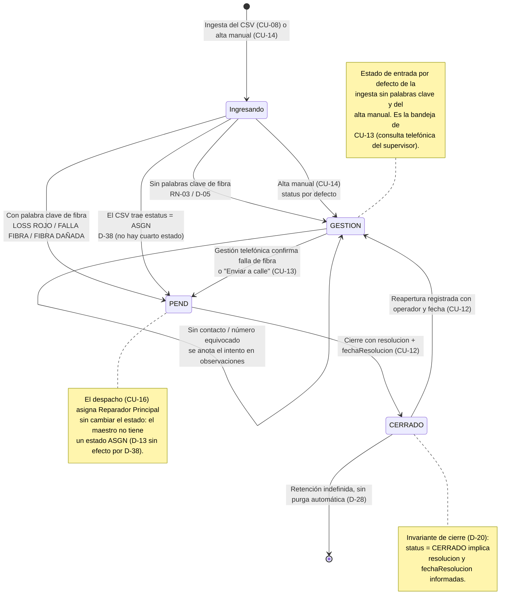

# Diagramas de Casos de Uso — Página HTML de Gestión de Averías (GGTO-v1)

- **Proyecto:** GGTO-v1 — Página HTML de gestión de averías de la central telefónica **Francisco Salias (Área 4)**, CANTV, Venezuela.
- **Fase:** 2 (Auditoría y casos de uso) — documento vivo.
- **Fecha de emisión:** 13/09/2026. **Revisión:** 14/09/2026 (corrección de H-06, H-07, H-33 y H-34 y aplicación de D-35, D-38 y D-39).
- **Documento hermano:** `RepoTecnico/casos_uso.md` (22 casos de uso CU-01 a CU-22, con Gherkin, EARS y trazabilidad inversa a los 29 RF).
- **Fuentes:** `RepoTecnico/requerimientos.md`, `RepoTecnico/PROPUESTA-PAGINA-GGTO.md`, `RepoTecnico/diccionario_datos.md`, `RepoTecnico/entornos_globales.md`, `RepoTecnico/auditoria_fase1.md`, `RepoTecnico/estado_proyecto.md`, `RepoTecnico/casos_uso/auditoria_casos_uso.md`.
- **Notación:** los diagramas de casos de uso se expresan como *flowchart* de Mermaid (no existe un tipo UML nativo de casos de uso en Mermaid): los rectángulos con esquinas redondeadas son los **actores**, las elipses son los **casos de uso** y las flechas discontinuas etiquetadas `"<<include>>"` y `"<<extend>>"` son las relaciones UML. Los nombres de actores y de casos de uso son idénticos a los de `casos_uso.md`.
- **Convención única de dirección de las relaciones (H-06):** **el caso de uso que usa al otro lo incluye** (`A include B` = A invoca a B) y **el caso de uso que añade comportamiento al otro lo extiende** (`A extend B` = A añade comportamiento a B). Esta convención se aplica de forma idéntica en los **8 bloques**: §1 (vista completa), §2.1, §2.2, §2.3, §3.1, §3.2, §3.3 y §4. El bloque **§1 es la vista canónica**: toda relación de los bloques por actor debe aparecer en §1 y en la misma dirección.
- **Roles (D-35):** el rol «administrador» está absorbido por el **supervisor**; en los diagramas, el nodo `SUP` representa al **supervisor (función administrativa)**. La bandeja GESTION (CU-13) es exclusiva del supervisor (D-35, RNF-12). La sesión exige `P00` **y** contraseña (D-29, D-39).
- **Estados del caso (D-38):** el maestro conserva **tres** estados —`PEND`, `GESTION` y `CERRADO`—; el `estatus = ASGN` del CSV se ingiere como **`PEND`** y **no** existe un cuarto estado en el maestro (queda sin efecto D-13).
- **Los 8 bloques Mermaid de este documento:** §1 vista completa (bloque 1), §2.1 operador (bloque 2), §2.2 supervisor (bloque 3), §2.3 supervisor — función administrativa (bloque 4), §3.1 secuencia de la ingesta (bloque 5), §3.2 secuencia del cierre (bloque 6), §3.3 secuencia del despacho y su PDF (bloque 7) y §4 ciclo de vida del caso (bloque 8).

---

## 1. Diagrama de casos de uso — vista completa (bloque canónico)

**Título:** GGTO-v1 — Mapa de casos de uso por actor.
**Cubre:** CU-01 a CU-22 (`casos_uso.md`).
**Mermaid (flowchart equivalente al diagrama UML de casos de uso):**



---

## 2. Diagramas de casos de uso por actor

### 2.1 Operador de la central

**Título:** GGTO-v1 — Casos de uso del operador de la central.
**Cubre:** CU-01, CU-08, CU-09, CU-10, CU-11, CU-12, CU-14, CU-22.
**Restricción de rol (D-35, RNF-12):** el operador **solo consulta y cierra los casos de su propia cuadrilla** (`Reparador Principal` = `id` de su cuadrilla, D-37); **no** accede a la bandeja GESTION, a los padrones, a los sectores (salvo el sector mínimo de la cola), a las palabras clave, al despacho ni al respaldo. **La bandeja GESTION ya no aparece en este bloque: es exclusiva del supervisor** (CU-13).



### 2.2 Supervisor

**Título:** GGTO-v1 — Casos de uso del supervisor.
**Cubre:** CU-01, CU-10, CU-11, CU-12, CU-13, CU-15, CU-16, CU-17, CU-18, CU-19, CU-20.
**Restricción de rol (D-35, RNF-12):** el supervisor puede **todo**, incluidas la bandeja GESTION (CU-13), la consulta y el cierre de cualquier caso, los padrones, el despacho, el respaldo y la restauración.



### 2.3 Supervisor — función administrativa (absorbe el antiguo rol administrador, D-35)

**Título:** GGTO-v1 — Casos de uso de la función administrativa del supervisor.
**Cubre:** CU-01 a CU-07, CU-21, CU-22.
**Nota (D-35):** el rol «administrador» quedó absorbido por el supervisor; **no** se dibuja un actor administrador separado. Los padrones, los sectores, las palabras clave, la configuración de la central y el respaldo son funciones del supervisor.



---

## 3. Diagramas de secuencia

### 3.1 Secuencia — Ingesta del CSV diario

**Título:** GGTO-v1 — Secuencia de la ingesta diaria del CSV (RF-16 a RF-19, RF-27; RN-01 a RN-04; D-12, D-21, D-26, D-38).
**Cubre:** **CU-08** (flujo principal y alternativos 2a, 2d, 5b, 5c, 5d, 5a, 6a, 12a, 12b), con participación de **CU-02**, **CU-06** y **CU-07**.

```mermaid
sequenceDiagram
    autonumber
    actor OP as Operador de la central (o supervisor)
    participant UI as Página (app/index.html)
    participant ING as ingesta.js
    participant CFG as Configuración (C:\GGTO\datos)
    participant MAE as averias.json

    OP->>UI: Pulsa "Cargar CSV diario" y elige el archivo
    UI->>ING: Inicia la ingesta con el archivo elegido
    ING->>CFG: Lee estructura.json, central.json, sectores.json y claves_clasificacion.json
    CFG-->>ING: Contrato posicional de 80 columnas + filtro de central + sectores + claves
    ING->>ING: Valida 80 columnas, orden posicional, separador ";" y al menos 1 registro de datos
    alt Contrato inválido o archivo de solo encabezado
        ING-->>UI: "Contrato de ingesta inválido" o "El archivo no contiene registros de datos"
        UI-->>OP: Aborta sin escribir el maestro y sin disparar el respaldo (D-21, H-14)
    else Contrato válido con datos
        ING->>ING: Filtra por las columnas 1-10 contra central.json
        Note over ING: Muestra 12/09/2026: 51 de Francisco Salias, 5 descartados por central
        ING->>MAE: Lee los id_averia existentes
        MAE-->>ING: Conjunto de ids presentes
        ING->>ING: Rechaza id_averia vacío y con prefijo MAN-, informándolo con su número de fila (H-09)
        ING->>ING: Dentro del lote, conserva solo la primera aparición de cada id_averia (H-09)
        ING->>ING: Descarta duplicados contra el maestro (RN-01)
        loop Por cada caso nuevo
            ING->>ING: Extrae informacion_1, informacion_2, estatus, unidad_negocio y ups
            ING->>ING: Conserva el rastro de origen: ultimo_usuario (col. 20), usuario_acciona (col. 53) y Fecha Hora Asignacion (col. 80)
            alt estatus del CSV = ASGN
                ING->>ING: status = PEND (D-38; el maestro no tiene cuarto estado)
            else Sin ASGN y con palabra clave de fibra
                ING->>ING: status = PEND (D-05, D-26)
            else Sin ASGN y sin palabra clave
                ING->>ING: status = GESTION (D-05, D-26)
            end
            ING->>ING: tipo_abonado = EMP si unidad_negocio = CANTV EMPRESAS o ups = NRES (D-17)
            ING->>ING: Recorta fecha_reporte a DD/MM/AAAA y conserva fecha_reporte_original (D-21)
            ING->>CFG: Empareja direccion contra las vias de sectores.json
            alt Dirección sin coincidencia
                CFG-->>ING: Sin sector
                ING->>ING: Encola el caso para CU-09 (RN-04)
            else Dirección con coincidencia
                CFG-->>ING: id de sector
            end
            ING->>ING: ingreso = fecha de ingesta, clase = REP, nivel = COM (RN-02)
        end
        ING-->>UI: Resumen: 51 nuevos, 5 por central, 0 duplicados, 7 sin sector, N rechazadas
        UI-->>OP: Muestra el resumen y pide confirmación
        OP->>UI: Confirma la ingesta
        UI->>MAE: Escribe los casos nuevos (respaldo previo, CU-21)
        MAE-->>UI: Confirmación de escritura
        UI->>MAE: Relee el archivo y verifica el conteo
        MAE-->>UI: 51 id_averia presentes
        UI-->>OP: "Ingesta completada: 51 casos nuevos (14 PEND + 37 GESTION)"
    end
```

### 3.2 Secuencia — Cierre de un caso

**Título:** GGTO-v1 — Secuencia del cierre bloqueante de un caso (RF-03, RF-22, RF-24; D-20, D-35, D-37, D-39; RN-07).
**Cubre:** **CU-12** (flujo principal y alternativos 2a, 2b, 5a a 5d, 7a), con **CU-11** y **CU-15**.



### 3.3 Secuencia — Generación del despacho y su PDF por cuadrilla

**Título:** GGTO-v1 — Secuencia del despacho diario y del PDF por cuadrilla (RF-08 a RF-10, RF-20; RN-05, RN-06; D-27, D-30, D-31, D-32, D-37; RNF-05, RNF-11).
**Cubre:** **CU-16** y **CU-17** (flujos principales y alternativos 4a, 4b, 6a, 9b, 3b, 7a, 8a).



---

## 4. Diagrama de estados — ciclo de vida del caso

**Título:** GGTO-v1 — Ciclo de vida del caso (PEND / GESTION / CERRADO).
**Cubre:** reglas de estado aplicadas por **CU-08** (ingesta y clasificación), **CU-12** (cierre y reapertura), **CU-13** (gestión telefónica y «Enviar a calle»), **CU-14** (alta manual) y **CU-16** (despacho). Estados y transiciones según **D-05, D-06, D-20, D-21, D-23, D-38** y, cuando se decidan, las guardas pendientes señaladas al final de esta sección.
**Cambio aplicado (H-07):** se **eliminó** la transición `PEND → GESTION` que la versión anterior atribuía a **CU-10**. Verificado contra los 22 casos de uso: CU-10 solo permite editar `clase`, `nivel` y `tipo_abonado`, su postcondición se limita a esas columnas y ninguno de sus criterios cambia el `status`; la vuelta a GESTION **no** existe como comportamiento de ningún caso de uso. Se **eliminó** también el cuarto estado `ASGN`: por **D-38** el `ASGN` del CSV entra como `PEND`. Se **eliminó** la transición `ASGN → PEND` («se retira la asignación de cuadrilla»), que tampoco implementaba ningún caso de uso.



**Transiciones y guardas pendientes de decisión del usuario (H-07, H-10).** El ciclo de vida queda **cerrado** en cuanto a los estados vigentes (PEND, GESTION, CERRADO), pero **dos guardas siguen sin dueño funcional** y **no** se dibujan como transiciones hasta que se decidan:

1. **`GESTION → ASGN`** («la gestión telefónica decide la asignación»): **eliminada** por D-38. «Enviar a calle» (CU-13) deja el caso en `PEND` y la asignación de cuadrilla la hace el despacho (CU-16) sin cambiar el estado.
2. **`PEND → GESTION`** («reclasificación manual a gestión telefónica»): **eliminada** por H-07. Si el usuario decide que debe existir, debe añadirse primero a un caso de uso con su validación de enum y su auditoría (por ejemplo CU-10 editando `status`, o CU-13), y solo entonces volver a dibujarse aquí.
3. **`ASGN → PEND`** («se retira la asignación de cuadrilla»): **eliminada** por D-38 y porque ningún caso de uso la implementa. Retirar una asignación es hoy una edición de `Reparador Principal` en CU-16 sin cambio de estado.
4. **Concurrencia y escritura atómica** del maestro: `&lt;PENDIENTE&gt;` de decisión del usuario (H-10, H-11); el diagrama no dibuja ninguna guarda que el sistema no pueda ejecutar.

---

## 5. Correspondencia entre diagramas y casos de uso

| Bloque | Diagrama | Tipo | Casos de uso representados |
|---|---|---|---|
| §1 | Vista completa (bloque canónico) | Casos de uso (UML en flowchart) | CU-01 a CU-22, con actores operador, supervisor (función administrativa, D-35), cuadrilla, emisor del CSV y auditoría |
| §2.1 | Operador de la central | Casos de uso por actor | CU-01, CU-08, CU-09, CU-10, CU-11, CU-12, CU-14, CU-22 |
| §2.2 | Supervisor | Casos de uso por actor | CU-01, CU-10, CU-11, CU-12, CU-13, CU-15, CU-16, CU-17, CU-18, CU-19, CU-20 |
| §2.3 | Supervisor — función administrativa | Casos de uso por actor | CU-01 a CU-07, CU-21, CU-22 |
| §3.1 | Ingesta del CSV | Secuencia | CU-08 (principal), CU-02, CU-06, CU-07 |
| §3.2 | Cierre de un caso | Secuencia | CU-12 (principal), CU-11, CU-15 |
| §3.3 | Despacho y PDF | Secuencia | CU-16 y CU-17 (principales), CU-05 (padrón de cuadrillas) |
| §4 | Ciclo de vida del caso | Estados | CU-08, CU-12, CU-13, CU-14, CU-16 |

**Verificación de coherencia (H-06, H-07, H-33, H-34):**

1. **Dirección única de las relaciones.** Las 16 relaciones del bloque canónico §1 se repiten con la misma dirección en los bloques por actor: `CU10 include CU01`, `CU14 include CU01`, `CU08 include CU02`, `CU08 include CU06`, `CU08 include CU07`, `CU09 include CU06`, `CU12 include CU11`, `CU13 include CU11`, `CU17 include CU16`, `CU18 include CU10`, `CU20 include CU10`, `CU19 include CU18`, `CU05 include CU03`, `CU05 include CU04`, `CU22 include CU21` y `CU09 extend CU08`.
2. **Nodo duplicado eliminado.** Desaparece el nodo `CU06_EXT` del bloque §2.1: CU-06 aparece una sola vez por bloque y con su nombre completo («Gestionar el catálogo de sectores»), idéntico al de `casos_uso.md` (H-06).
3. **Nombres idénticos a `casos_uso.md`**, incluidas las cuatro etiquetas antes abreviadas: CU-09 «Resolver la asignación de sector **y las direcciones sin coincidencia**», CU-15 «Consultar la auditoría de cambios **de un caso**», CU-17 «Emitir el PDF **de despacho** por cuadrilla y registrar la entrega» y CU-19 «Emitir el despacho en pantalla y PDF **y el seguimiento semanal estadístico**».
4. **Etiquetas de relación normalizadas.** Todas usan `|"<<include>>"|` o `|"<<extend>>"|`; se corrigieron las tres etiquetas con comilla simple faltante (`<<extend>>|`) del bloque §1 (H-33).
5. **Bloques numerados.** Los 8 bloques Mermaid quedan identificados en el encabezado y referenciados con la misma numeración en esta tabla (H-34).
6. **Estados.** El diagrama §4 declara tres estados y ninguna transición sin dueño funcional (H-07, D-38).
