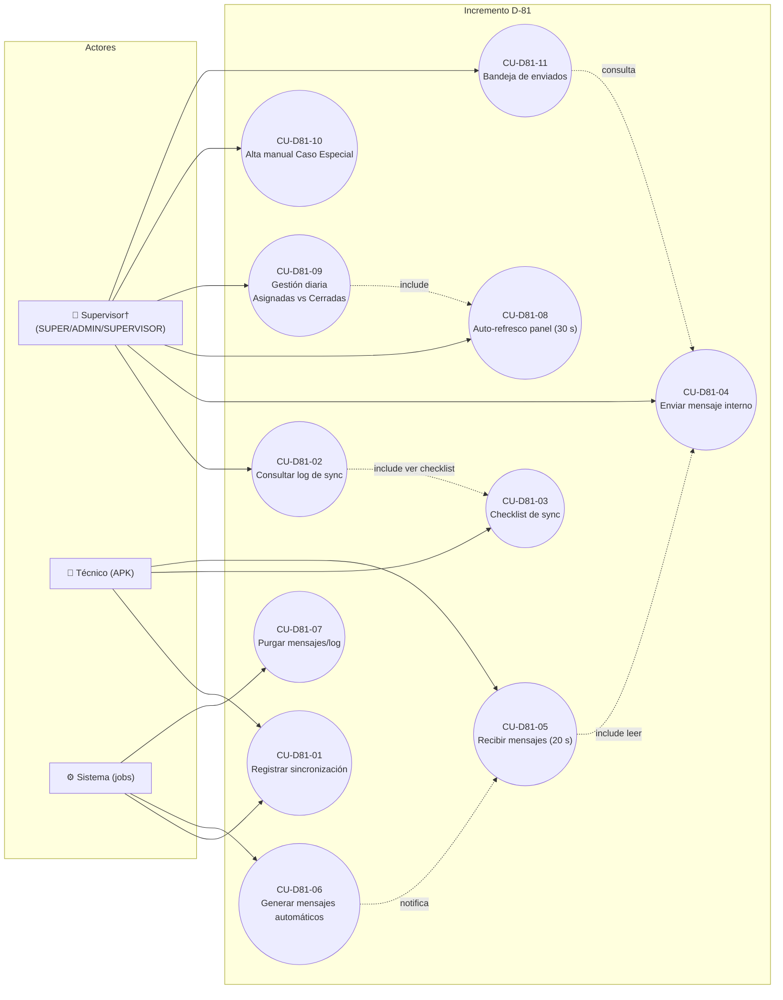
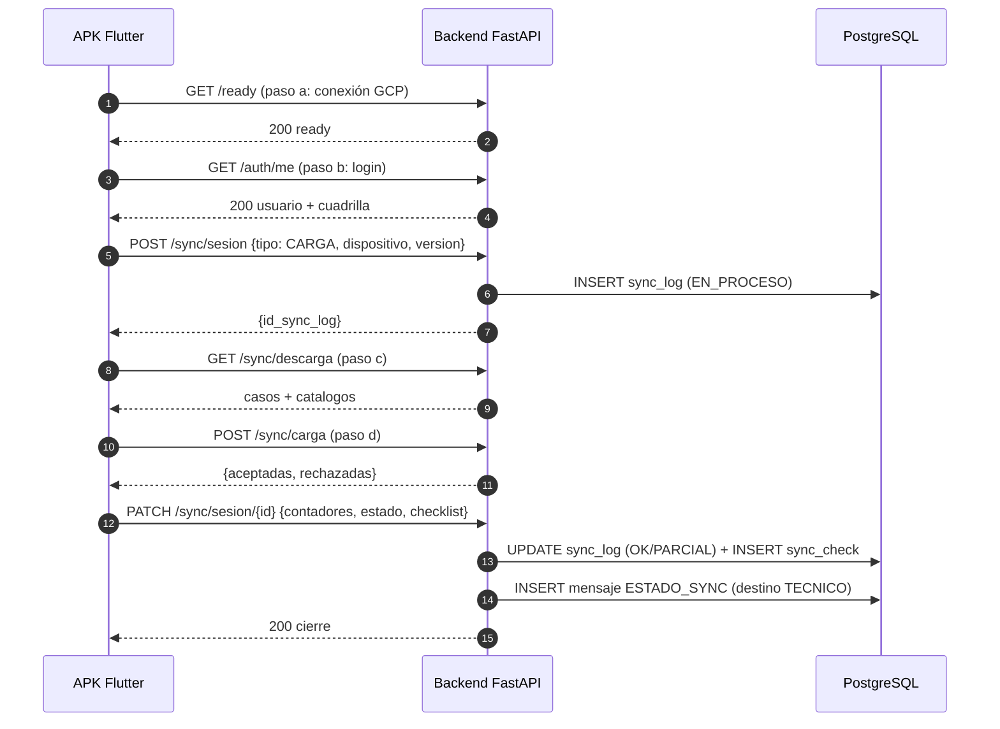
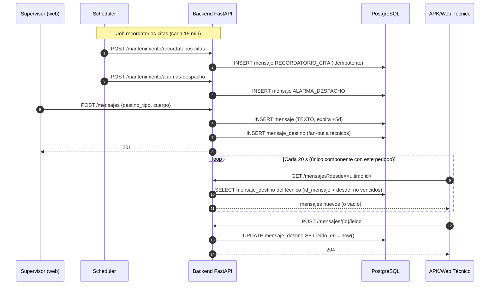
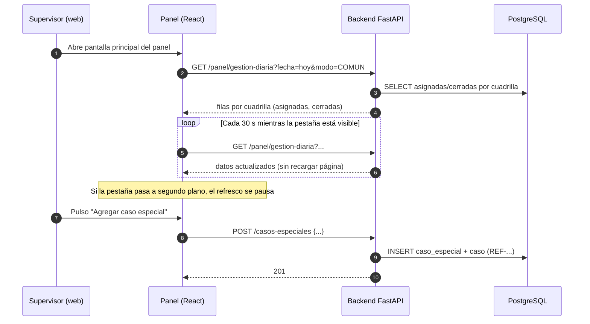
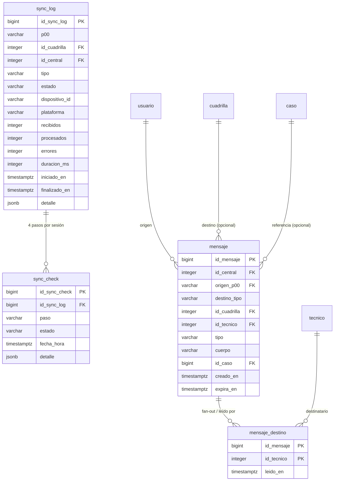

# Diagramas — Incremento D-81 (Mermaid)

> Coherentes con [`casos_uso_D81.md`](casos_uso_D81.md) y [`documento_tecnico_D81.md`](../documento_tecnico_D81.md):
> mismos actores y mismos nombres de caso de uso.

---

## 1. Diagrama de casos de uso (actores ↔ casos)

---

## 2. Secuencia — Sincronización + checklist + log (CU-D81-01, CU-D81-03)

---

## 3. Secuencia — Mensajería: enviar + sondeo 20 s (CU-D81-04, CU-D81-05, CU-D81-06)

---

## 4. Secuencia — Panel con auto-refresco 30 s (CU-D81-08, CU-D81-09)

---

## 5. Modelo Entidad-Relación del incremento

