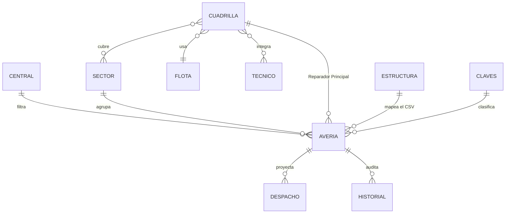

# Diccionario de Datos — GGTO (Central Francisco Salias, Área 4)

- **Proyecto:** GGTO-v1
- **Fase:** 1 (Concepto) — documento vivo
- **Versión:** v1
- **Fecha:** 2026-09-12
- **Fuente:** `RepoTecnico/PAGINA-GGTO-INICIAL.md`, sección `[ESTRUCTURAS]` (L54-58) y decisiones D-01 a D-56.

> Tipos: `T` texto, `F` fecha `DD/MM/AAAA`, `E` enumerado, `N` numérico, `B` booleano (`SI`/`NO`),
> `L` lista. `PK` = clave primaria, `FK` = clave foránea, `OBL` = obligatorio.

---

## 1. `averias.json` — maestro de casos

Archivo único con el universo de averías gestionadas. Persistencia directa en disco (D-01), en **disco local fuera de la carpeta sincronizada** (D-19);
toda edición se refleja aquí (RF-24 / RN-07). Se conserva el orden de columnas del fuente (RT-04).

| # | Campo | Tipo | OBL | Dominio / formato | Origen | Notas |
|---|---|---|---|---|---|---|
| 1 | `ingreso` | F | Sí | DD/MM/AAAA | Ingesta | Fecha en que el caso entró (RN-02). |
| 2 | `nivel` | E | Sí | `REF` / `COM` | Ingesta / manual | `COM` por defecto; `REF` para referidos. |
| 3 | `clase` | E | Sí | `REP` / `CNS` | Ingesta / manual | `REP` por defecto; `CNS` se corrige a mano (D-06). |
| 4 | `sector` | T (FK) | Sí | id de `sectores.json` | Ingesta / manual | Se completa por coincidencia de dirección (RF-18, RN-04). |
| 5 | `Reparador Principal` | T (FK) | No | id o nombre de cuadrilla | Despacho | Agrupa el despacho (RF-20). |
| 6 | `id_averia` | T | Sí | PK, texto | CSV | Clave de deduplicación (RN-01). |
| 7 | `telefono` | T | Sí | dígitos | CSV | Clave alterna de búsqueda (RF-02). |
| 8 | `persona_reporta` | T | No | — | CSV | Quien reporta la avería. |
| 9 | `contacto` | T | No | — | CSV | Teléfono/contacto adicional. |
| 10 | `ultimo_comentario` | T | No | — | CSV | Campo de diagnóstico; se busca aquí las palabras clave (RN-03). |
| 11 | `problema_reporte` | T | No | — | CSV | Campo de diagnóstico; se busca aquí las palabras clave (RN-03). |
| 12 | `informacion_1` | T | No | — | CSV | Primera columna `informacion` del CSV (D-10). |
| 13 | `informacion_2` | T | No | — | CSV | Segunda columna `informacion` del CSV (D-10). |
| 14 | `nombre` | T | No | — | CSV | Nombre del abonado. |
| 15 | `direccion` | T | Sí | texto libre | CSV | Base del agrupamiento por sector y del despacho. |
| 16 | `olt` | T | No | — | CSV | Red / planta externa. |
| 17 | `plan` | T | No | — | CSV | Plan contratado. |
| 18 | `slot` | T | No | — | CSV | Red / planta externa. |
| 19 | `puerto` | T | No | — | CSV | Red / planta externa. |
| 20 | `fat` | T | No | — | CSV | Caja de acceso de fibra. |
| 21 | `serial` | T | No | — | CSV | Serial del equipo/ONT. |
| 22 | `extra` | T | No | — | CSV | Red / planta externa (D-04). |
| 23 | `ups` | T | No | — | CSV | Red / planta externa — significado por precisar (A-11). |
| 24 | `codigos_sin_gestion_en_VENAPP` | T | No | — | CSV | Códigos de casos sin gestión en VENAPP. |
| 25 | `status` | E | Sí | `PEND` / `CERRADO` / `GESTION` | Ingesta / manual | `PEND` con palabras clave de fibra; `GESTION` sin ellas (D-05); el `estatus = ASGN` del CSV se ingiere como `PEND` (D-38). |
| 26 | `resolucion` | E | No | `IVR` / `COS` / `COLA` | Manual | Se completa al cerrar el caso (RF-03, RF-22). |
| 27 | `fechaResolucion` | F | No | DD/MM/AAAA | Manual | Fecha de cierre. |
| 28 | `observaciones` | T | No | texto libre | Manual | Notas de gestión. |
| 29 | `sacas` | B | No | `SI` / `NO` | Manual | Indicador de cierre. |
| 30 | `tipo_abonado` | E | No | `RES` / `EMP` | Ingesta / manual | Derivado de `unidad_negocio` (col. 61) y `ups` (col. 62) del CSV (D-17, RF-28). |
| 31 | `usuario_modificacion` | T | No | P00 o usuario | Manual | Auditoría: quién hizo el último cambio (D-16, RNF-09). |
| 32 | `fecha_modificacion` | T | No | DD/MM/AAAA hh:mm | Manual | Auditoría: cuándo se hizo el último cambio (D-16). |
| 33 | `fecha_reporte` | F | No | DD/MM/AAAA | CSV (col. 15) | Fecha del reporte, recortada de la marca de tiempo (D-21). |
| 34 | `fecha_reporte_original` | T | No | texto del CSV | CSV | Valor completo con hora (`17/07/2026 11:38:20 a.m.`) conservado para trazabilidad (D-21). |
| 35 | `fecha_cita` | F | No | DD/MM/AAAA | CSV (col. 19) | Cita agendada con el abonado; si coincide con el día del despacho el caso es «citado» (D-30). |
| 36 | `fecha_asignacion` | F | No | DD/MM/AAAA | Despacho | Fecha de la última asignación de cuadrilla; alimenta la métrica «asignados por día» del MONITOREO (D-48). |

**Reglas de integridad**
- `id_averia` es único; la ingesta descarta cualquier caso ya presente (RN-01, RNF-04).
- `status = CERRADO` implica `resolucion` y `fechaResolucion` informadas (regla de cierre).
- `sector` debe existir en `sectores.json`; si no, el caso queda en la cola de asignación (RN-04).
- `Reparador Principal`, cuando está informado, debe corresponder a una cuadrilla declarada (A-14).

---

## 2. `despacho.json` — vista de trabajo de campo

Subconjunto de columnas de `averias.json` (RT-05). Se usa para generar los PDF del despacho diario.

| # | Campo | Tipo | OBL | Dominio / formato | Notas |
|---|---|---|---|---|---|
| 1 | `nivel` | E | Sí | `REF` / `COM` | Copiado del maestro. |
| 2 | `clase` | E | Sí | `REP` / `CNS` | Copiado del maestro. |
| 3 | `id_averia` | T | Sí | PK | Trazabilidad con el maestro. |
| 4 | `telefono` | T | No | — | — |
| 5 | `persona_reporta` | T | No | — | — |
| 6 | `contacto` | T | No | — | — |
| 7 | `ultimo_comentario` | T | No | — | Se imprime en la hoja de la cuadrilla. |
| 8 | `nombre` | T | No | — | — |
| 9 | `direccion` | T | Sí | texto libre | — |
| 10 | `plan` | T | No | — | — |
| 11 | `fat` | T | No | — | — |
| 12 | `serial` | T | No | — | — |
| 13 | `sector` | T (FK) | Sí | id de `sectores.json` | Añadido por D-31 para poder agrupar el despacho por sector. |
| 14 | `Reparador Principal` | T (FK) | No | id de `cuadrillas.json` | Añadido por D-31: es la cuadrilla asignada. |
| 15 | `fecha_despacho` | F | Sí | DD/MM/AAAA | Añadido por D-31: día del despacho que representa el archivo. |

**Resuelto (D-31):** `despacho.json` conserva las 12 columnas del fuente y añade `sector`, `Reparador Principal` y `fecha_despacho`, de modo que cada archivo queda como registro del despacho de ese día (quién recibió qué, en qué sector y cuándo). Es la base del registro de entrega del PDF (RNF-11).

---

## 3. `estructura.json` — contrato de extracción del CSV

Especificación del mapeo columna-CSV → campo-JSON que usa la ingesta (RF-16). **Corrección tras verificar el CSV real (ver Anexo A):** el mapeo no puede ser por nombre —hay encabezados repetidos— sino por **posición** (índice de columna), y según **D-12** solo se declaran las columnas necesarias, no las 80. No contiene
datos, solo la lista de columnas esperadas y su correspondencia.

| # | Campo (JSON) | Tipo | Columna esperada en el CSV | Notas |
|---|---|---|---|---|
| 1 | `id_averia` | T | `id_averia` | PK. |
| 2 | `telefono` | T | `telefono` | — |
| 3 | `persona_reporta` | T | `persona_reporta` | — |
| 4 | `contacto` | T | `contacto` | — |
| 5 | `ultimo_comentario` | T | `ultimo_comentario` | Palabras clave RN-03. |
| 6 | `problema_reporte` | T | `problema_reporte` | Palabras clave RN-03. |
| 7 | `informacion_1` | T | primera columna `informacion` | D-10. |
| 8 | `informacion_2` | T | segunda columna `informacion` | D-10. |
| 9 | `nombre` | T | `nombre` | — |
| 10 | `direccion` | T | `direccion` | Base de asignación de sector. |
| 11 | `olt` | T | `olt` | — |
| 12 | `plan` | T | `plan` | — |
| 13 | `slot` | T | `slot` | — |
| 14 | `puerto` | T | `puerto` | — |
| 15 | `fat` | T | `fat` | — |
| 16 | `serial` | T | `serial` | — |
| 17 | `extra` | T | `extra` | Red / planta externa. |
| 18 | `ups` | T | `ups` | Red / planta externa. |
| 19 | `codigos_sin_gestion_en_VENAPP` | T | `codigos_sin_gestion_en_VENAPP` | — |

Las columnas de clasificación del CSV (región, estado geográfico, capital, municipio, parroquia,
estado operativo, distrito, área, central, nombre central) no se copian al maestro: se usan solo
como filtro contra `central.json` (RT-03).

---

## 4. `historial.jsonl` — registro inmutable de cambios (D-56, RNF-09)

Archivo **JSON Lines** (*JSONL*: una línea = un objeto JSON completo, sin comas entre líneas ni
corchetes envolventes), ubicado en `C:\GGTO\datos\historial.jsonl`. Cada cambio de un caso
(`status`, `clase`, `nivel`, `tipo_abonado`, `sector`, `Reparador Principal`, cierre, `sacas` y
`observaciones`) **añade** una línea; el maestro sigue guardando además el **último** cambio en
`usuario_modificacion` y `fecha_modificacion` (D-16, D-56).

**Es *append-only*:** no se edita ni se borra; **crece con cada cambio** y solo se añade al final.
Su lectura es la que alimenta la **consulta de auditoría de CU-15** (`casos.js`), que muestra por
caso la secuencia de cambios. Cierra los hallazgos **H-08** y **H-10** y completa el **RNF-09**.

| # | Campo | Tipo | OBL | Dominio / formato | Origen | Notas |
|---|---|---|---|---|---|---|
| 1 | `fecha_hora` | T | Sí | `DD/MM/AAAA hh:mm` (texto, RNF-06) | Aplicación | Momento del cambio; se escribe con la misma marca que `fecha_modificacion` del maestro. |
| 2 | `operador` | T | Sí | `P00` de la sesión | Aplicación (D-29) | Quien hizo el cambio; nunca se guarda la contraseña. |
| 3 | `id_averia` | T (FK) | Sí | PK de `averias.json` | Aplicación | Clave del caso afectado. |
| 4 | `campo` | T | Sí | nombre del campo del maestro | Aplicación | `status`, `clase`, `nivel`, `tipo_abonado`, `sector`, `Reparador Principal`, `sacas`, `observaciones`, `resolucion`, `fechaResolucion`. |
| 5 | `valor_anterior` | T | No | texto del valor previo | Aplicación | Vacío cuando el cambio es una **ingesta** o un alta (no había valor previo). |
| 6 | `valor_nuevo` | T | Sí | texto del valor nuevo | Aplicación | Valor que queda en el maestro. |
| 7 | `accion` | E | Sí | `edicion` / `cierre` / `reapertura` / `asignacion` / `ingesta` | Aplicación | Clasifica el cambio (D-56). |

**Ejemplo de línea** (una sola línea física, sin salto interno):

```json
{"fecha_hora":"13/09/2026 10:05","operador":"12345","id_averia":"2026-00123","campo":"status","valor_anterior":"PEND","valor_nuevo":"CERRADO","accion":"cierre"}
```

**Reglas de integridad**
- **No se edita ni se borra ninguna línea**: no hay operación de actualización ni de baja sobre
  este archivo (append-only, D-56); la aplicación solo escribe añadiendo al final.
- Cada línea es un JSON válido e independiente (JSONL); una línea corrupta no invalida las
  anteriores ni impide seguir añadiendo.
- Todo cambio del maestro genera al menos una línea; un cierre genera las líneas de los campos
  modificados con `accion = cierre` y una reapertura con `accion = reapertura` (D-56).
- El archivo se respalda junto con el maestro y **nunca se recorta** (§7 de `entornos_globales.md`).
- Codificación UTF-8 sin BOM, igual que el resto de los archivos de trabajo (§6).

---

## 5. Archivos de configuración

### 5.1 `central.json` — datos operativos de la central (RF-11, L15)

| Campo | Tipo | Dominio / ejemplo | Notas |
|---|---|---|---|
| `region` | T | — | Filtro de la matriz CSV. |
| `estado_geografico` | T | — | Filtro. |
| `capital_estado` | T | — | Filtro. |
| `municipio` | T | — | Filtro. |
| `parroquia` | T | — | Filtro. |
| `estado_operativo` | T | — | Filtro. |
| `distrito` | T | — | Filtro. |
| `area` | T | `4` | Área operativa. |
| `central` | T | — | Código de la central. |
| `nombre_central` | T | `Francisco Salias` | Nombre de la central (L1). |

### 5.2 `tecnicos.json` — padrón de trabajadores (RF-12, L16)

| Campo | Tipo | OBL | Notas |
|---|---|---|---|
| `nombre` | T | Sí | — |
| `cedula` | T | Sí | Identificación. |
| `P00` | T | Sí | Código de empleado, único; identifica la sesión del operador (D-29). |
| `clave_hash` | T | Sí | Hash de la contraseña (SHA-256 con sal) — nunca en claro (D-39). |
| `clave_sal` | T | Sí | Sal aleatoria por técnico para el hash (D-39). |
| `clave_fecha_cambio` | F | Sí | Fecha del último cambio de contraseña; a los 90 días se exige cambiarla (D-39). |
| `clave_cambio_obligatorio` | B | Sí | `SI` cuando el supervisor restablece la contraseña: el técnico debe cambiarla en el siguiente ingreso (RF-12, D-39). |
| `telefono` | T | No | — |
| `correo` | T | No | — |
| `especialidad` | T | No | — |
| `status` | E | Sí | Activo / inactivo. Un técnico inactivo no puede iniciar sesión. |

### 5.3 `flota.json` — padrón de vehículos (RF-13, L17)

| Campo | Tipo | OBL | Notas |
|---|---|---|---|
| `CAN00` | T | Sí | Identificador / código de la unidad. |
| `tipo` | T | No | — |
| `marca` | T | No | — |
| `modelo` | T | No | — |
| `placa` | T | Sí | — |
| `combustible` | T | No | Corrige el typo «Combistible» del fuente. |
| `status` | E | Sí | Operativo / en mantenimiento / fuera de servicio. |
| `estado_cauchos` | T | No | — |
| `estado_fluidos` | T | No | — |
| `estado_general` | T | No | — |

### 5.4 `cuadrillas.json` — padrón de cuadrillas (RF-14, D-07)

| Campo | Tipo | OBL | Notas |
|---|---|---|---|
| `id` | T | Sí | PK; es el valor que toma `Reparador Principal`. |
| `nombre` | T | Sí | Denominación de la cuadrilla. |
| `tecnicos` | L | Sí | FK a `tecnicos.json` (uno o más). |
| `vehiculo` | T | No | FK a `flota.json` (`CAN00`). |
| `turno` | T | No | Turno de trabajo. |
| `sectores` | L | No | FK a `sectores.json`; zonas preferentes. |
| `status` | E | Sí | Activa / inactiva. |

### 5.5 `sectores.json` — catálogo de sectores (D-03)

| Campo | Tipo | OBL | Notas |
|---|---|---|---|
| `id` | T | Sí | PK; se guarda en `averias.sector` (numeración por precisar, A-04). |
| `nombre` | T | Sí | Nombre operativo del sector. |
| `vias` | L | Sí | Calles, urbanizaciones o puntos de referencia que lo componen. |
| `cuadrilla_sugerida` | T | No | FK a `cuadrillas.json`; sugerencia para el despacho. |

### 5.6 `claves_clasificacion.json` — palabras clave de clasificación (D-11, RN-03)

| Campo | Tipo | OBL | Notas |
|---|---|---|---|
| `claves` | L | Sí | Por defecto: `LOSS ROJO`, `FALLA FIBRA`, `FIBRA DAÑADA`. |
| `normalizacion` | E | Sí | `estricta` (texto literal) / `normalizada` (mayúsculas, sin tildes, variantes LOSS/LOS y DAÑADA/DANADA). Por defecto `normalizada`. |
| `campos_evaluados` | L | Sí | `ultimo_comentario`, `problema_reporte`, `informacion_1`, `informacion_2`. |

---

## 6. Relaciones entre entidades



| Relación | Cardinalidad | Regla |
|---|---|---|
| `central.json` → averías | 1 a N | Filtro de ingesta (RT-03). |
| `sectores.json` → `averias.sector` | 1 a N | Obligatoria; sin coincidencia se encola para asignación (RN-04). |
| `cuadrillas.json` → `averias."Reparador Principal"` | 1 a N | Definida por el despacho (RF-20). |
| `cuadrillas.tecnicos` → `tecnicos.json` | N a N | Un técnico puede integrar una cuadrilla por jornada. |
| `cuadrillas.vehiculo` → `flota.json` | 1 a 1 | Un vehículo por cuadrilla. |
| `averias.json` → `despacho.json` | 1 a N | Proyección de columnas para el trabajo de campo (RT-05). |
| `averias.json` → `historial.jsonl` | 1 a N | Cada cambio de un caso **añade** una línea con `id_averia`, campo, valor anterior y valor nuevo; el archivo es *append-only* y no se edita ni se borra (D-56, RNF-09). |
| `estructura.json` → ingesta | 1 a 1 | Contrato de columnas del CSV diario (D-08). |
| `claves_clasificacion.json` → `status` | 1 a 1 | Determina PEND vs. GESTION (D-05, D-11). |

---

## 7. Reglas de formato y normalización

| Tema | Regla |
|---|---|
| Fechas | `DD/MM/AAAA` en todos los archivos y en la interfaz (RNF-06). |
| Semana operativa | Lunes a sábado (RN-08). |
| Texto | Se conserva tal como llega del CSV; los typos de interfaz se corrigen solo en las etiquetas (A-06). |
| Comparación de direcciones | Mayúsculas, sin tildes, tolerante a abreviaturas ("Av.", "Cll.", "Urb."), según D-03. |
| Deduplicación | Por `id_averia`, comparación exacta de texto (RN-01). |
| Codificación de archivos | UTF-8 sin BOM para todos los JSON y para el CSV de entrada; también para `historial.jsonl`, una línea JSON por cambio (D-56). |
| Nomenclatura de campos | Se respeta la del fuente, incluidos `Reparador Principal` (con espacio), `fechaResolucion` (camelCase) y `codigos_sin_gestion_en_VENAPP`. |

---

## 8. Anexo A — CSV diario real (`detalle_averias_gpon DD_MM_AAAA.csv`)

Muestra analizada: `detalle_averias_gpon 12_09_2026.csv` (56 registros, 3 centrales).

| Característica | Valor verificado |
|---|---|
| Separador | `;` (punto y coma) |
| Codificación | UTF-8 (acentos correctos) |
| Encabezado | Una sola fila, **80 columnas** |
| Fechas | `DD/MM/AAAA hh:mm:ss a.m./p.m.` (con hora) |
| Encabezados repetidos | `informacion` ×2 (col. 31-32), `nombre` ×2 (col. 33 y 76), `descripcion` ×3 (col. 52, 57, 59) |
| Centrales presentes | `FRANCISCO SALIAS` 51, `LAS MERCEDES CPA` 4, `EL HATILLO` 1 |
| Filtro de central | `area` = `AREA 4`, `central` = `2324X`, `nombre central` = `FRANCISCO SALIAS` |
| `estatus` | `PEND` 53, `ASGN` 3 |
| `ups` | `RES` 55, `NRES` 1 |
| `unidad_negocio` | `CANTV RESIDENCIAL` 55, `CANTV EMPRESAS` 1 |
| Palabras clave de fibra (RN-03) | 17 registros las contienen / 39 no |

**Las 80 columnas del CSV, en orden**

| # | Columna | # | Columna | # | Columna | # | Columna |
|---|---|---|---|---|---|---|---|
| 1 | region | 21 | ultimo_comentario | 41 | puerto | 61 | unidad_negocio |
| 2 | estado geografico | 22 | results | 42 | ont_id | 62 | ups |
| 3 | capital estado geografico | 23 | asignado_a | 43 | fat | 63 | codigos_gestionados_en_VENAPP |
| 4 | municipio | 24 | cuadrilla | 44 | serial | 64 | codigos_sin_gestion_en_VENAPP |
| 5 | parroquia | 25 | fecha_despacho | 45 | cvlan | 65 | Reparador Principal |
| 6 | estado operativo | 26 | ciudad | 46 | extra | 66 | Ayudante 1 |
| 7 | distrito | 27 | estatus | 47 | area_trabajo | 67 | Ayudante 2 |
| 8 | area | 28 | problema_reporte | 48 | dias transcurrido desde la apertura | 68 | Ayudante 3 |
| 9 | central | 29 | servicio_off_on | 49 | area_resolutoria | 69 | Ayudante 4 |
| 10 | nombre central | 30 | cliente_notificado | 50 | tipo_servicio | 70 | Ayudante 5 |
| 11 | id_averia | 31 | informacion (1) | 51 | tipo_problema | 71 | Ayudante 6 |
| 12 | tipo_reporte | 32 | informacion (2) | 52 | descripcion (1) | 72 | Ayudante 7 |
| 13 | dac | 33 | nombre (abonado) | 53 | usuario_acciona | 73 | Ayudante 8 |
| 14 | telefono | 34 | direccion | 54 | fecha_acciona | 74 | Ayudante 9 |
| 15 | fecha_reporte | 35 | fecha_instalacion | 55 | dias transcurrido en area resolutoria | 75 | Flota (CAN) |
| 16 | persona_reporta | 36 | olt | 56 | codigo_causa | 76 | Nombre (técnico) |
| 17 | contacto | 37 | ip | 57 | descripcion (2) | 77 | Apellido |
| 18 | fecha_compromiso | 38 | tarjeta | 58 | Subcodigo_causa | 78 | Telefono Oficina |
| 19 | fecha_cita | 39 | plan | 59 | descripcion (3) | 79 | Telefono Movil |
| 20 | ultimo_usuario | 40 | slot | 60 | con_serv_aba | 80 | Fecha Hora Asignacion |

**Columnas que alimentan el maestro propuesto** (subconjunto declarado según D-12): 1-10 (filtro de
central), 11 (`id_averia`), 14 (`telefono`), 15 (`fecha_reporte` y su original), 16, 17, 19
(`fecha_cita`), 20 (`ultimo_usuario` → inicializa `usuario_modificacion`), 21, 27 (`estatus` →
`status`), 28, 31-34, 36, 39-46, 61 (`unidad_negocio`) y 62 (`ups`) para `tipo_abonado`, 64 y 65
(`Reparador Principal`).

**No se copian al maestro:** la col. 18 (`fecha_compromiso`, D-54 — ningún requisito la usa; los
«citados» salen de `fecha_cita`), la col. 53 (`usuario_acciona`) y la col. 80
(`Fecha Hora Asignacion`), ambas descartadas por D-53. El resto queda disponible para el detalle
del caso o para el despacho (columnas 65-80).

---

## 9. Estado del diccionario

**Sin pendientes de decisión:** las ambigüedades que figuraban aquí quedaron cerradas — A-04 (D-25: el
sector es una entidad con `id` y `nombre`; el `id` es texto único, D-52), A-11 (D-17 y D-29: `ups` es el
tipo de abonado y `P00` el código de empleado), A-12 (D-12: mapa posicional), A-14 (D-31: `despacho.json`
ampliado), A-15 (D-13, revisada por D-38: `ASGN` entra como `PEND`) y A-16 (D-21: fechas recortadas con
el original conservado), y A-17 (D-14: se descartan los datos de `alta_manual.csv`). Además, **D-53** y **D-54** fijan que las columnas 18, 53 y 80 del CSV **no se persisten**.

**Pendientes técnicos de implementación (no de decisión):**

- Fijar las versiones exactas de las librerías de `lib/` al iniciar C1.
- Confirmar en el CSV real si trae columnas no declaradas en `estructura.json` (se ignorarían).

**Ya resuelto (no es pendiente):** el **historial inmutable de cambios** queda decidido por
**D-56**: `historial.jsonl` es *append-only*, con los 7 campos de §4, y cierra H-08 y H-10 y completa
RNF-09. El maestro conserva el último cambio y el historial conserva todos los anteriores.