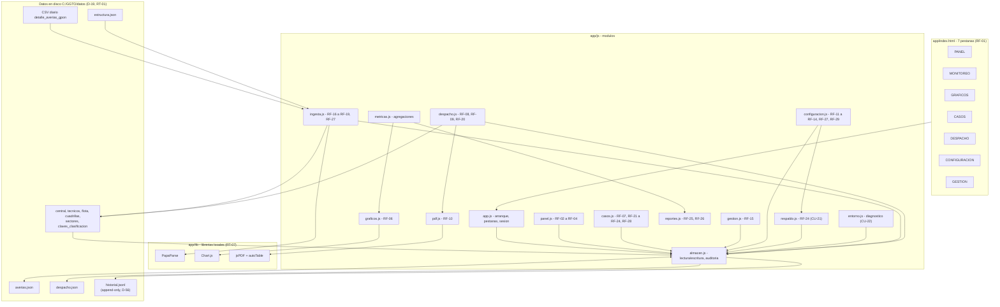
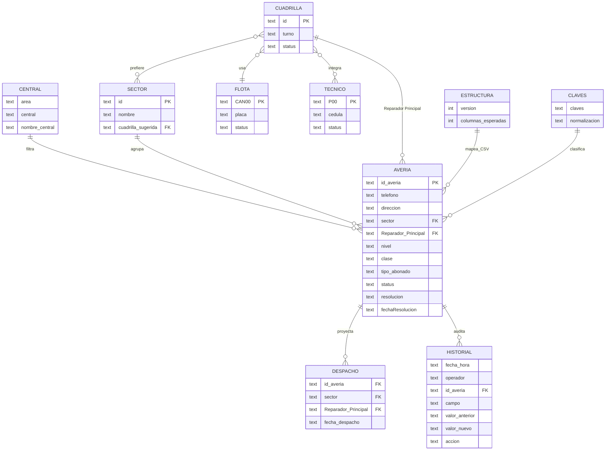
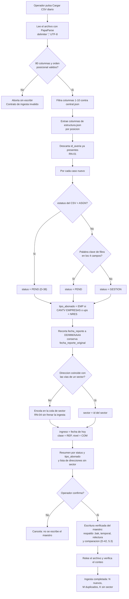
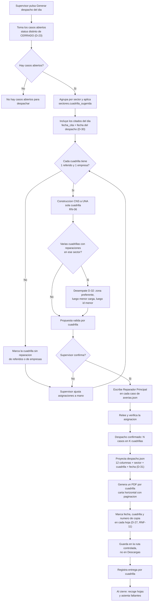
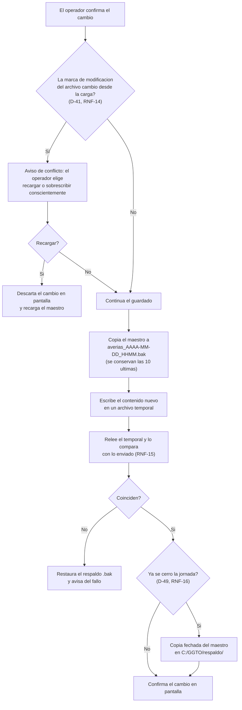
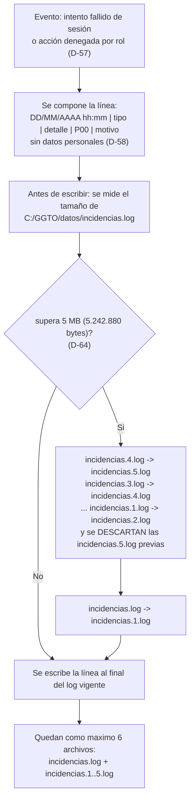

# Documento Técnico — GGTO-v1 (Página HTML de Gestión de Averías)

- **Proyecto:** GGTO-v1 — Central telefónica Francisco Salias (Área 4), CANTV, Venezuela.
- **Documento:** arquitectura y especificación técnica.
- **Fase:** 2 (Auditoría y casos de uso) — documento vivo.
- **Versión:** v1.
- **Fecha:** 13/09/2026 (revisión de cierre de auditoría: **D-53**, **D-54**, **D-56** y **D-61 a D-64** incorporadas; A-01, el destino de la col. 18, el historial inmutable —H-10—, el campo `rol` del padrón, el arranque en frío, el formato de la credencial y la rotación del log de accesos quedan cerrados).
- **Ubicación del proyecto:** `C:\GGTO\proyecto` (clon local de GitHub, D-51); Google Drive queda fuera del flujo (§7.1).
- **Fuentes normativas (leídas completas, no modificadas):** `RepoTecnico/requerimientos.md` (29 RF, **16 RNF**, 11 RT, 8 RN, **D-01 a D-64**), `RepoTecnico/PROPUESTA-PAGINA-GGTO.md`, `RepoTecnico/diccionario_datos.md`, `RepoTecnico/entornos_globales.md`, `RepoTecnico/casos_uso.md` (**CU-01 a CU-22; revisión del 15/09/2026**, con **D-42 a D-50**, **RNF-15** y **RNF-16** aplicados), `RepoTecnico/casos_uso/diagramas.md`, `RepoTecnico/estado_proyecto.md` y `RepoTecnico/auditoria_fase1.md` (29 hallazgos H-01 a H-29).
- **Nota de sincronización con `casos_uso.md`:** este documento se redactó contra la **revisión del 15/09/2026** de `casos_uso.md` (rango de decisiones de ese documento: **D-01 a D-64**). Son **posteriores** a esa revisión las decisiones **D-51** (mudanza a `C:\GGTO\proyecto`), **D-52** (`sectores.id` como texto único e inicialización del rastro de auditoría), **D-53/D-54** (destino de las columnas 53/80 y de la col. 18 del CSV en la ingesta), **D-56** (historial inmutable `historial.jsonl`, con H-10 cerrado y RNF-09 completo; §4.4) y **D-61 a D-64** (campo `rol` del padrón —§4.5—, arranque en frío del primer supervisor —§3.4—, formato de la credencial SHA-256 —§4.5— y rotación del log de accesos `incidencias.log` —§4.5.1 y §5.4—), ya incorporadas aquí y en `requerimientos.md`. De la revisión del 15/09/2026 proviene además el requisito derivado **S-RNF-02b** (umbral de desempeño de la ingesta; §6.3 y §8.3, pendiente técnico n.º 4). Por último, **RF-26 figura como «Parcial»** en la base normativa (`casos_uso.md` §5, fila RF-26): su dueño funcional está cubierto, pero el conteo de averías concentradas queda sujeto al corte de la semana (pendiente técnico n.º 3 de §8.3, con valor por defecto declarado).
- **Alcance de este documento:** especificar la arquitectura, los contratos de datos, los procedimientos y la trazabilidad del sistema. **No** fija precios, calendario ni asignación de personas. Las afirmaciones se apoyan en los documentos citados; lo aún no implementado se marca como **pendiente técnico** con su ID (§8.3).

---

## 1. Visión general y alcance

### 1.1 Qué resuelve la página

La página concentra la gestión operativa de los reportes de avería de la central Francisco Salias (área 4), alimentándose del `.csv` diario que emite el origen corporativo (L31):

| Capacidad | Resultado operativo | Requisitos |
|---|---|---|
| Conformar el **despacho diario** | Cada cuadrilla declarada recibe su hoja de trabajo del día | RF-08, RF-09, RF-10, RF-20 |
| **Agrupar averías concentradas** por sector | Sectores con 3 o más casos abiertos en la semana operativa | RF-26, RF-29, D-25 |
| **Seguimiento de casos especiales** | Empresariales (`tipo_abonado = EMP`) y referidos (`nivel = REF`) abiertos | RF-26, D-33 |
| **Reporte de trabajo diario** y **gestión semanal** | Despacho en pantalla + PDF; seguimiento semanal estadístico | RF-25, D-34 |
| **Ingesta diaria del CSV** | Casos nuevos de la central clasificados, con sector y estado | RF-16 a RF-19 |

### 1.2 Alcance del MVP (ciclos C1–C3)

El MVP es la decisión **D-02**: CONFIGURACION + CASOS + INGESTA + PANEL. Se sirve desde un servidor local en loopback con File System Access API (D-01, D-15).

| Ciclo | Entrega | Requisitos | Criterio de terminado |
|---|---|---|---|
| C1 | Armazón de 7 pestañas, CONFIGURACION completa, tabla CASOS + flotante de cierre, persistencia JSON | RF-01, RF-07 (tabla), RF-11 a RF-14, RF-21 a RF-24, RF-29 | La página abre en `http://localhost:8787`, la sesión se valida contra el `P00` y el hash con sal de `tecnicos.json` (D-39) y un cambio de caso queda escrito y releído en `averias.json` |
| C2 | INGESTA del CSV: carga, filtro por central, mapeo posicional, dedupe, clasificación, sector | RF-16 a RF-19, RF-27 | El CSV del 12/09/2026 inserta 51 casos de Francisco Salias (14 `PEND` + 37 `GESTION`, D-38), descarta 5 por central y una segunda ingesta informa 0 nuevos |
| C3 | PANEL (búsqueda, actualización, alta manual) + GESTION telefónica + reclasificación | RF-02 a RF-04, RF-07 (clasificación), RF-15, RF-23, RF-28 | Un operador busca por `id_averia`, cierra un caso con resolución y fecha, da de alta un caso `MAN-` y vacía la bandeja GESTION |

### 1.3 Ciclos posteriores (C4–C7)

| Ciclo | Entrega | Requisitos |
|---|---|---|
| C4 | DESPACHO: agrupación por sector, reglas RN-05/RN-06, edición y PDF por cuadrilla | RF-08 a RF-10, RF-20 |
| C5 | MONITOREO + GRAFICOS (6 zonas) | RF-05, RF-06 |
| C6 | Reportes diario y semanal + casos especiales y averías concentradas | RF-25, RF-26 |
| C7 | Pruebas funcionales con datos reales, ajuste de impresión, entrega y manual | RNF-01 a RNF-07 |

### 1.4 Qué queda fuera

| Fuera de alcance | Motivo / fuente |
|---|---|
| `CONTROL_DESPACHO_GGTO-v1.xlsm` como proceso vigente | No se analizó; la página lo reemplaza funcionalmente (referencia del repositorio) |
| Migración de los datos de `alta_manual.csv` | D-14: se descartan; los casos se cargan manualmente |
| Backend con base de datos o multiusuario concurrente | D-01, D-02 y el supuesto de un solo operador por sesión |
| GCP / servicio en la nube | Ejecución local en la central (GCP descartado) |
| Exportación a XLSX | D-34: el seguimiento semanal es estadístico y sin Excel |
| Cifrado del tráfico (TLS/HTTPS) | No previsto: HTTP en loopback; riesgo aceptado y declarado (§3.5). La credencial es `P00` + contraseña (D-39, RNF-08) |
| Historial completo de valores anteriores de cada campo | **Ya no está fuera de alcance (D-56):** el historial inmutable vive en `C:\GGTO\datos\historial.jsonl` (*append-only*, 7 campos) y cierra H-10; el maestro sigue conservando además el último cambio (§4.4) |

---

## 2. Arquitectura propuesta

### 2.1 Estilo arquitectónico

**SPA estática**: HTML5 + CSS3 + JavaScript (ES2020), **sin framework** (RNF-03). Sin paso de compilación: los archivos se editan y se sirven tal cual. El estado vive en memoria (`almacen.js`) y la verdad vive en los JSON del disco (RT-01), leídos y escritos con File System Access API (D-01, RT-06). Las librerías son locales (RT-07): la central puede no tener internet.

### 2.2 Estructura de archivos

```
C:\GGTO\proyecto\            # raiz del proyecto: clon local, fuera de Google Drive (D-51)
|- servir-ggto.ps1           # lanzador: servidor local en loopback + navegador
|- app/                      # UNICO subdirectorio publicado por HTTP (D-15)
|  |- index.html
|  |- css/estilos.css
|  |- js/                    # los 14 modulos de la aplicacion (incluye respaldo.js y entorno.js, C7)
|  \- lib/                   # librerias locales (sin CDN)
\- RepoTecnico/              # documentacion: FUERA del alcance HTTP

C:\GGTO\datos\               # JSON de trabajo + historial + log: FUERA del alcance HTTP y fuera de Drive (D-19)
                             # averias.json, despacho.json, estructura.json, los 6 de configuracion,
                             # historial.jsonl (append-only, D-56) e incidencias.log
                             # (log de accesos con rotacion 5 MB x 5 archivos, D-64)
C:\GGTO\respaldo\            # copia fechada del maestro y de historial.jsonl al cierre de la jornada (D-49)
```

> **Nota de coherencia:** `entornos_globales.md` §1.1 dibuja `index.html`, `css/`, `js/` y `lib/` en la raíz y, a la vez, exige `--directory app`. Para que el lanzador funcione, esos cuatro elementos deben vivir dentro de `app/` (así lo indica la nota de seguridad del propio documento). Este documento adopta la variante `app/`.

### 2.3 Módulos y responsabilidades

Son **14 módulos** (`app.js`, `almacen.js`, `ingesta.js`, `despacho.js`, `pdf.js`, `metricas.js`, `graficos.js`, `casos.js`, `panel.js`, `gestion.js`, `configuracion.js`, `reportes.js`, `respaldo.js` y `entorno.js`). La tabla tiene **14 filas**, una por módulo: **`respaldo.js`** (CU-21) y **`entorno.js`** (CU-22) dejaron de ser responsabilidades compartidas de `almacen.js` + `app.js` al implementarse los bloques RESPALDO y ENTORNO del ciclo **C7**. El diagrama de componentes de §2.4 dibuja **14 nodos**, uno por módulo.

| Módulo | Responsabilidad principal | RF que implementa |
|---|---|---|
| `app.js` | Arranque, enrutado de las 7 pestañas (RF-01), estado global, **sesión e identificación del operador** (D-29, credencial `P00` + contraseña D-39, resolución del **rol** leído de `tecnicos.json` D-61, expiración D-45) y **bloqueo total sin sesión válida** (D-50); **alta del primer supervisor cuando el padrón está vacío** (arranque en frío, D-62); **registro de accesos en `datos/incidencias.log`** con la rotación D-64; accesibilidad de la interfaz (RNF-13); detección de `file://`, versión y log de aplicación | RF-01; RNF-03, RNF-07, RNF-08, RNF-13 |
| `almacen.js` | Abrir, leer, escribir y **releer** los JSON (File System Access API + modo descarga); catálogo de esquemas; deduplicación por `id_averia`; registro de auditoría (`usuario_modificacion`, `fecha_modificacion`) y **escritura *append* del historial inmutable `historial.jsonl`** (una línea JSON por campo cambiado, D-56); **rotación del log de accesos `incidencias.log` a 5 MB × 5 archivos** antes de cada escritura del log (**D-64**); **escritura verificada con respaldo previo `.bak`, temporal, relectura y comparación** (D-42) y **detección de conflicto al guardar** (D-41); **primitivas de la copia de cierre en `C:\GGTO\respaldo\` y de la restauración verificada** (D-49), sobre las que trabaja `respaldo.js` | RF-24; RNF-04, RNF-09, RNF-10, RNF-14, RNF-15, RNF-16; RT-01, RT-04, RT-06, RT-10 |
| `ingesta.js` | Carga del CSV con PapaParse (`delimiter: ';'`), validación bloqueante de las 80 columnas, filtro de central, extracción por `estructura.json`, dedupe, clasificación RN-03 y sector (RN-04) | RF-16 a RF-19, RF-27; RNF-02, RNF-04, RNF-06, RNF-10; RT-02, RT-03, RT-07, RT-08 |
| `despacho.js` | Agrupación por sector y `Reparador Principal`, reglas RN-05/RN-06, desempate D-32, edición manual y persistencia en el maestro | RF-08, RF-09, RF-20; RNF-01, RNF-05 (proyección impresa en carta horizontal), RNF-10, RNF-11; RT-05 |
| `pdf.js` | PDF del despacho por cuadrilla en carta horizontal con paginación, marca de fecha/cuadrilla/copia (jsPDF + autoTable) y registro de entrega y recogida; **se guarda en la ruta controlada `C:\GGTO\despachos`** (D-67), verificado por relectura y sin pisar las reemisiones del día | RF-10; RNF-05, RNF-11 |
| `metricas.js` | Agregaciones del MONITOREO y del seguimiento semanal (ingreso vs. reparadas, línea de pendiente, Sem 1 a Sem 36) | RF-05 (tablas), RF-25 |
| `graficos.js` | Gráficos de las 6 zonas con Chart.js: barras, barras + línea y torta | RF-05, RF-06 |
| `casos.js` | Tabla maestra (7 columnas resumen), agrupación y filtrado (abiertos/cerrados, cuadrilla, tipo, clase, nivel, estatus), edición en línea de `clase`/`nivel`/`tipo_abonado`, flotante de detalle y **cierre bloqueante**; **consulta de la auditoría de CU-15 leyendo `historial.jsonl`** (secuencia de cambios por caso: fecha/hora, operador, campo, valor anterior y valor nuevo, D-56); navegación y foco accesibles (RNF-13) | RF-07, RF-21 a RF-24, RF-28; RNF-01, RNF-02, RNF-07, RNF-09, RNF-10, RNF-13 |
| `panel.js` | Búsqueda por `id_averia` o `telefono`, actualización de gestión y alta manual con `id_averia` `MAN-` | RF-02, RF-03, RF-04, RF-28 |
| `gestion.js` | Bandeja telefónica de `status = GESTION`: cola por antigüedad y sector, guion de verificación y reclasificación | RF-15, RF-07 (clasificación), RF-28 |
| `configuracion.js` | Subpestañas CENTRAL, TECNICOS, FLOTA, CUADRILLA, SECTORES (CRUD), PALABRAS CLAVE y **RESPALDO** (que delega en `respaldo.js`), más la cola de asignación de sector | RF-11 a RF-14, RF-18 (cola), RF-27, RF-29 |
| `reportes.js` | Reporte de trabajo diario y de gestión semanal; vigilancia de casos especiales y averías concentradas | RF-25, RF-26 |
| `respaldo.js` | Bloque **RESPALDO** de CONFIGURACION: estado del último respaldo, **copia de cierre de los 10 archivos** (9 JSON + `historial.jsonl` íntegro) verificada por relectura, **restauración** con respaldo previo `.bak`, confirmación escrita cuando la copia pierde casos, detección de conflicto (D-41) y registro de las horas de inicio y fin para comprobar el **RTO de 1 hora** y el **RPO** del cierre anterior | RF-24; RNF-04, RNF-10, RNF-12, RNF-14, RNF-15, RNF-16; RT-10 |
| `entorno.js` | Bloque **ENTORNO** de CONFIGURACION: diagnóstico del puesto (navegador y versión, soporte de la API de archivos, origen de la página, modo de trabajo, rutas y versión), informe de los archivos de datos ausentes o ilegibles, resumen del registro `incidencias.log` con descarga del detalle y **verificación del cierre de la jornada** (última escritura confirmada, último respaldo e incidencias del día); solo lectura | RF-01 (CU-22); RNF-03, RNF-04, RNF-08, RNF-10, RNF-16; RT-06, RT-09 |

### 2.4 Diagrama de componentes



**Lectura de las relaciones.** Todas las aristas se leen en un solo sentido: `X --> Y` significa «X usa Y» cuando Y es un módulo o una librería, y «X escribe/lee Y» cuando Y es un archivo de datos. Los módulos que **consumen** padrones o catálogos tienen su arista hacia `CONF` (`ING --> CONF` lee `central.json`, `sectores.json`, `claves_clasificacion.json` y `estructura.json`; `DSP --> CONF` lee `sectores.json` y `cuadrillas.json`), y `CONF --> ALM` es la vía de acceso al disco. Las **dos** relaciones del maestro son la bidireccional `ALM <--> AVE` (el maestro se lee y se escribe, RT-01) y la unidireccional `ALM --> HIS`: el historial **solo se escribe añadiendo al final y se lee para la auditoría de CU-15** (nunca se reescribe, D-56); el resto de las aristas son unidireccionales.

### 2.5 Librerías locales y ausencia de CDN

| Librería | Archivo en `app/lib/` | Uso | Requisito |
|---|---|---|---|
| PapaParse | `papaparse.min.js` | Parseo del CSV con `;`, comillas y BOM | RF-16, RT-08 |
| Chart.js | `chart.umd.min.js` | Barras, barras + línea y torta de MONITOREO y GRAFICOS | RF-06 |
| jsPDF | `jspdf.umd.min.js` | Documento PDF del despacho | RF-10 |
| jsPDF-AutoTable | `jspdf.autotable.min.js` | Tabla paginada en carta horizontal | RF-10, RNF-05 |

**Por qué no hay CDN:** RT-07 — «sin internet garantizado en la central: las librerías (CSV, gráficos, PDF) se guardan localmente en `lib/`». Un CDN convertiría la indisponibilidad de red en una indisponibilidad del sistema. Consecuencia de diseño: **versiones fijadas** (se registran en `entornos_globales.md` al descargarlas en C1) y **cero peticiones salientes**; el criterio CU-01-6 lo verifica («ninguna dependencia se solicita por internet»).

---

## 3. Ejecución y seguridad

### 3.1 Lanzador `servir-ggto.ps1`

```powershell
# servir-ggto.ps1 - servidor local de la pagina GGTO (solo loopback, solo app/)
$puerto = 8787
$raiz   = Split-Path -Parent $MyInvocation.MyCommand.Definition
$app    = Join-Path $raiz "app"

Write-Host "Sirviendo $app en http://localhost:$puerto (solo loopback) ..."
Start-Process "http://localhost:$puerto/index.html"

# Opcion A: Python
python -m http.server $puerto --bind 127.0.0.1 --directory $app

# Opcion B (si no hay Python): Node.js
# npx --yes serve -l $puerto $app
```

| Control | Efecto | Requisito |
|---|---|---|
| `--bind 127.0.0.1` | El servidor **no escucha** en la red: solo el propio equipo | D-15, RT-09 |
| `--directory app` | Por HTTP se publica únicamente la aplicación; `datos/` y `RepoTecnico/` no son alcanzables | D-15, RT-09 |
| Apertura por `http://localhost:8787` | `localhost` es contexto seguro y habilita File System Access API; `file://` la bloquea | RT-06 |
| Detección de `file://` en la página | Bloquea la edición y muestra el aviso de abrir con el lanzador | CU-01 (1a) |

### 3.2 Persistencia con File System Access API

| Operación | API | Uso en la página |
|---|---|---|
| Abrir carpeta o archivo | `showDirectoryPicker` / `showOpenFilePicker` | Autorizar `C:\GGTO\datos` al iniciar sesión |
| Leer | `FileSystemFileHandle.getFile()` + `text()` | Cargar los **10 archivos de trabajo**: los 9 JSON (`averias.json`, `despacho.json`, `estructura.json` y los 6 archivos de configuración: `central`, `tecnicos`, `flota`, `cuadrillas`, `sectores`, `claves_clasificacion`) y el historial `historial.jsonl`, que se lee línea a línea (JSONL, D-56) |
| Escribir | `createWritable()` + `write()` + `close()` | Persistir cada cambio (RN-07) con respaldo previo `.bak` y archivo temporal (D-42, §5.3) |
| **Verificar** | Relectura inmediata del archivo escrito | Comparar con lo enviado antes de confirmar en pantalla (RNF-10, RNF-15) |
| **Detectar conflicto** | `FileSystemFileHandle.getFile()` + `lastModified` | Si el archivo cambió desde la carga, avisar y esperar decisión del operador (D-41, RNF-14) |
| Escritura del historial | `createWritable()` + `write()` en modo *append* sobre `historial.jsonl` | Cada cambio de un caso añade una línea JSON (D-56); el archivo no se edita ni se borra (§4.4) |
| Respaldo | Descarga del JSON + `<input type="file">`; copia fechada del maestro y del historial al cierre | Modo descarga para navegadores sin la API (Opción B de la propuesta) y copia diaria en `C:\GGTO\respaldo\` (D-49, RNF-16) |

Restricciones conocidas: Firefox y Safari no soportan la API → la página avisa «Modo consulta: este navegador no permite escribir los JSON» y habilita solo el modo descarga (RNF-03). Navegador requerido: Edge o Chrome Chromium ≥ 86.

### 3.3 Identificación del operador (`P00` + contraseña, D-39)

| Paso | Comportamiento | Requisito |
|---|---|---|
| 1 | La página muestra **solo el diálogo de acceso**: sin sesión válida no expone tabla, conteos ni gráficos | RNF-08, D-50 |
| 2 | El operador escribe su **`P00`** y su **contraseña** (8 caracteres o más) y pulsa *Iniciar sesión*. **Solo el `P00` es identificador válido: el campo `nombre` NO lo es** | D-16, **D-29**, D-39 |
| 3 | La página busca **coincidencia exacta del `P00`** en `tecnicos.json` con `status` activo y valida la contraseña contra el **hash con sal** (`clave_hash` + `clave_sal`), nunca en claro | RF-12, D-29, D-39 |
| 3b | Un intento fallido (`P00` inexistente, técnico inactivo, `nombre` escrito como identificador o contraseña que no corresponde al hash) se rechaza con un **mensaje genérico** que no revela cuál de los dos datos falló, y se **registra con operador, fecha y hora** | **RNF-09**, D-29, D-39 |
| 4 | Si `clave_fecha_cambio` supera los **90 días**, la sesión exige cambiarla antes de operar; el supervisor puede restablecerla | D-39 |
| 5 | La sesión muestra nombre, cédula y `P00`; toda edición queda auditada con ese `P00` y la fecha/hora (RNF-09), igual que los intentos de acceso fallidos del paso 3b | RNF-09 |
| 6 | La sesión dura la jornada (**8 horas**) y se cierra al cerrar la pestaña; al expirar se exige reingreso sin perder lo ya guardado | D-45 |
| 7 | Sin identificación válida no se permite editar; 3 intentos fallidos vuelven al diálogo con contador visible | RNF-08 |
| 8 | `tecnicos.json` ausente o inválido → «Padrón de técnicos no disponible» y bloqueo de edición | RNF-08 |

### 3.4 Matriz de permisos operador / supervisor (D-35, **D-61**, RNF-12)

El rol «administrador» queda **absorbido por el supervisor** (D-35); los casos de uso todavía lo listan como actor, y su actualización es un trabajo de Fase 2 en curso.

**De dónde sale el rol (D-61).** El rol de cada sesión **no se deduce del nombre ni del `P00`**: se lee del campo **`rol` de `tecnicos.json`**, cuyos dos únicos valores son **`Operador`** y **`Supervisor`**, con **`Operador` por defecto** —un registro sin `rol` (padrón heredado) se lee como operador y una sesión de operador nunca queda habilitada como supervisora por accidente—. El rol se resuelve al iniciar sesión (CU-01 paso 10) y, **junto con `status` (Activo/Inactivo)**, es lo que determina esta matriz (D-35, RNF-12). El supervisor **crea y edita ese campo** en CONFIGURACION → TECNICOS (CU-03, D-61).

**Arranque en frío (D-62).** Si `tecnicos.json` está **vacío**, no existe ninguna sesión posible y —por D-50— tampoco debería verse nada; pero ningún rol podría crear el primer padrón. La página resuelve ese único caso ofreciendo crear el **primer supervisor**: es el **único supuesto en que se crea un padrón sin sesión previa**, y el registro nace con `rol = Supervisor` y `clave_cambio_obligatorio = SI` (debe cambiar la contraseña en su primer ingreso). En cuanto el padrón tiene un supervisor, ese paso **desaparece** y toda alta de técnicos exige sesión de supervisor (CU-03).

| Capacidad | Operador | Supervisor |
|---|---|---|
| Consultar casos de **su** cuadrilla | Sí | Sí |
| Consultar casos de **otras** cuadrillas | No | Sí |
| Cerrar caso (`status = CERRADO`) | Solo de su cuadrilla | Todos |
| Editar `clase` / `nivel` / `tipo_abonado` | Solo de su cuadrilla | Todos |
| Bandeja GESTION (RF-15) | No | Sí |
| Ingesta del CSV (RF-16 a RF-19) | Sí | Sí |
| Alta manual de casos (RF-04) | Sí | Sí |
| Asignar o cambiar sector (RF-18) | Sí | Sí |
| Generar y ajustar el despacho (RF-08, RF-09, RF-20) | No | Sí |
| Emitir PDF del despacho y registrar entrega (RF-10) | No | Sí |
| Padrones CENTRAL / TECNICOS / FLOTA / CUADRILLA / SECTORES (RF-11 a RF-14, RF-29) | No | Sí |
| Palabras clave de clasificación (RF-27) | No | Sí |
| MONITOREO, GRAFICOS y reportes (RF-05, RF-06, RF-25, RF-26) | Solo lectura | Sí |
| Respaldo y restauración (D-36, D-49) | No | Sí |
| Restablecer la contraseña de un técnico (D-39) | No | Sí |
| Asignar o cambiar el campo `rol` de un técnico (`Operador`/`Supervisor`, D-61) | No | Sí |
| Crear el **primer supervisor** con el padrón vacío (arranque en frío, D-62) | — (no hay sesión) | Permitido a quien ejecuta el arranque; el registro nace como supervisor |

### 3.5 Qué impide cada control y qué **no** cubre

| Control | Impide | No cubre |
|---|---|---|
| `--bind 127.0.0.1` | Que otro equipo de la red alcance la página o descargue los JSON | Un usuario local del mismo PC o un proceso malicioso en la sesión |
| `--directory app` | Publicar `datos/averias.json` por HTTP (H-01) | La lectura directa del archivo por quien tenga acceso al disco |
| Credencial `P00` + contraseña (D-39, RNF-08, D-50) | Editar sin sesión válida; la contraseña (8+ caracteres) se valida contra el hash con sal (`clave_sal + ":" + contraseña` en SHA-256 hexadecimal de 64 caracteres, D-63) y caduca a los 90 días | **No hay TLS:** la credencial viaja sin cifrar en loopback. No protege contra el acceso directo al JSON ni al código |
| **Log de accesos `datos/incidencias.log` (D-57, D-58, D-64)** | Que un intento fallido o una acción denegada por rol pasen sin constancia: quedan fecha/hora, `P00` intentado y motivo, **sin datos personales**; el archivo rota a 5 MB × 5 archivos (§4.5.1) | No bloquea la cuenta (D-57) ni impide la suplantación; no es un control de seguridad, es trazabilidad |
| Matriz de permisos (D-35, RNF-12) | Que un operador cierre casos ajenos o toque padrones desde la interfaz | Manipulación directa del JSON o del código en el navegador |
| Edición local de `lib/` | Dependencia de internet | La integridad del propio código: no hay firma ni verificación de las librerías |
| Sin TLS | — | **Riesgo aceptado:** el tráfico es HTTP en loopback; no hay cifrado ni certificado |
| Detección de conflicto al guardar (D-41, RNF-14) | Que un guardado sobrescriba en silencio los cambios de otra ventana o puesto | No bloquea el archivo: dos puestos pueden escribir en secuencia; el aviso aparece al guardar |
| Escritura verificada y `.bak` (D-42, RNF-15) | Confirmar en pantalla un cambio que no quedó en disco | Una pérdida total del disco más allá de las 10 versiones `.bak` y del respaldo del cierre (D-49) |

---

## 4. Contratos de datos

### 4.1 `averias.json` — maestro de casos (36 campos)

Tipos: `T` texto, `F` fecha `DD/MM/AAAA`, `E` enumerado, `B` booleano (`SI`/`NO`), `L` lista. `PK` clave primaria, `FK` clave foránea, `OBL` obligatorio.

| # | Campo | Tipo | OBL | Dominio / formato | Origen | Notas |
|---|---|---|---|---|---|---|
| 1 | `ingreso` | F | Sí | DD/MM/AAAA | Ingesta | Fecha de entrada del caso (RN-02) |
| 2 | `nivel` | E | Sí | `REF` / `COM` | Ingesta / manual | `COM` por defecto; `REF` para referidos |
| 3 | `clase` | E | Sí | `REP` / `CNS` | Ingesta / manual | `REP` por defecto; `CNS` se corrige a mano (D-06) |
| 4 | `sector` | T (FK) | Sí | `sectores.id` (texto único, D-52) | Ingesta / manual | Por coincidencia de dirección (RF-18, RN-04) |
| 5 | `Reparador Principal` | T (FK) | No | `cuadrillas.id` | Despacho | Agrupa el despacho (RF-20, D-37) |
| 6 | `id_averia` | T | Sí | **PK**, texto (`MAN-` en alta manual) | CSV / manual | Clave de deduplicación (RN-01) |
| 7 | `telefono` | T | Sí | dígitos | CSV | Clave alterna de búsqueda (RF-02) |
| 8 | `persona_reporta` | T | No | — | CSV | Quien reporta |
| 9 | `contacto` | T | No | — | CSV | Contacto adicional |
| 10 | `ultimo_comentario` | T | No | — | CSV | Campo evaluado por RN-03 |
| 11 | `problema_reporte` | T | No | — | CSV | Campo evaluado por RN-03 |
| 12 | `informacion_1` | T | No | — | CSV (col. 31) | Primera `informacion` (D-10) |
| 13 | `informacion_2` | T | No | — | CSV (col. 32) | Segunda `informacion` (D-10) |
| 14 | `nombre` | T | No | — | CSV | Nombre del abonado |
| 15 | `direccion` | T | Sí | texto libre | CSV | Base del sector y del despacho |
| 16 | `olt` | T | No | — | CSV | Red / planta externa |
| 17 | `plan` | T | No | — | CSV | Plan contratado |
| 18 | `slot` | T | No | — | CSV | Red / planta externa |
| 19 | `puerto` | T | No | — | CSV | Red / planta externa |
| 20 | `fat` | T | No | — | CSV | Caja de acceso de fibra |
| 21 | `serial` | T | No | — | CSV | Serial del equipo / ONT |
| 22 | `extra` | T | No | — | CSV | Red / planta externa (D-04) |
| 23 | `ups` | T | No | `RES` / `NRES` (según muestra) | CSV | Planta externa; `NRES` marca `tipo_abonado = EMP` (D-17; A-11 cerrada) |
| 24 | `codigos_sin_gestion_en_VENAPP` | T | No | — | CSV | Casos sin gestión en VENAPP |
| 25 | `status` | E | Sí | `PEND` / `CERRADO` / `GESTION` | Ingesta / manual | `PEND` con palabras clave; `GESTION` sin ellas; el `estatus = ASGN` del CSV (col. 27) se ingiere como `PEND` (D-05, D-21, **D-38**) |
| 26 | `resolucion` | E | No | `IVR` / `COS` / `COLA` | Manual | Obligatoria al cerrar (D-20) |
| 27 | `fechaResolucion` | F | No | DD/MM/AAAA | Manual | Obligatoria al cerrar (D-20) |
| 28 | `observaciones` | T | No | texto libre (≤ 500) | Manual | Notas de gestión |
| 29 | `sacas` | B | No | `SI` / `NO` | Manual | Indicador de cierre |
| 30 | `tipo_abonado` | E | No | `RES` / `EMP` | Ingesta / manual | Desde `unidad_negocio` y `ups` (D-17, RF-28) |
| 31 | `usuario_modificacion` | T | No | `P00` o usuario | Manual (inicializado por la ingesta) | Auditoría del último cambio (D-16); se inicializa con la **col. 20** (`ultimo_usuario`) al ingerir (D-52, **D-53**: las col. 53 y 80 no se persisten) |
| 32 | `fecha_modificacion` | T | No | DD/MM/AAAA hh:mm | Manual (inicializado por la ingesta) | Auditoría del último cambio (D-16); se inicializa con la **fecha de ingesta** (D-52, **D-53**) |
| 33 | `fecha_reporte` | F | No | DD/MM/AAAA | CSV (col. 15) | Recortada de la marca de tiempo (D-21) |
| 34 | `fecha_reporte_original` | T | No | texto del CSV | CSV | Valor completo con hora (D-21) |
| 35 | `fecha_cita` | F | No | DD/MM/AAAA | CSV (col. 19) | Si coincide con el día del despacho, el caso es «citado» (D-30) |
| 36 | `fecha_asignacion` | F | No | DD/MM/AAAA | Despacho | **Añadido (D-48):** fecha de la última asignación de cuadrilla; alimenta la métrica «asignados por día» de la zona Cuadrilla (RF-05) |

**Reglas de integridad**

- `id_averia` es único; la ingesta descarta lo ya presente (RN-01, RNF-04).
- `status = CERRADO` **implica** `resolucion` y `fechaResolucion` informadas (D-20).
- `sector` debe existir en `sectores.json`; si no hay coincidencia, el caso queda en la cola visible (RN-04).
- `Reparador Principal`, si está informado, debe corresponder a una cuadrilla de `cuadrillas.json` (D-37).

### 4.2 `despacho.json` — registro del despacho del día

Conserva las **12 columnas del fuente** (L57) y añade 3 campos por D-31: **15 campos**.

| # | Campo | Tipo | OBL | Dominio | Notas |
|---|---|---|---|---|---|
| 1 | `nivel` | E | Sí | `REF` / `COM` | Copiado del maestro |
| 2 | `clase` | E | Sí | `REP` / `CNS` | Copiado del maestro |
| 3 | `id_averia` | T | Sí | PK | Trazabilidad con el maestro |
| 4 | `telefono` | T | No | — | — |
| 5 | `persona_reporta` | T | No | — | — |
| 6 | `contacto` | T | No | — | — |
| 7 | `ultimo_comentario` | T | No | — | Se imprime en la hoja de la cuadrilla |
| 8 | `nombre` | T | No | — | — |
| 9 | `direccion` | T | Sí | texto libre | — |
| 10 | `plan` | T | No | — | — |
| 11 | `fat` | T | No | — | — |
| 12 | `serial` | T | No | — | — |
| 13 | `sector` | T (FK) | Sí | `sectores.id` | **Añadido (D-31)** para agrupar el despacho |
| 14 | `Reparador Principal` | T (FK) | No | `cuadrillas.id` | **Añadido (D-31):** cuadrilla asignada |
| 15 | `fecha_despacho` | F | Sí | DD/MM/AAAA | **Añadido (D-31):** día que representa el archivo |

### 4.3 `estructura.json` — mapa posicional del CSV

El CSV real tiene **80 columnas**, separador `;`, UTF-8, con encabezados repetidos (`informacion` ×2 col. 31-32, `nombre` ×2 col. 33 y 76, `descripcion` ×3 col. 52, 57 y 59); por eso el contrato **no puede ser por nombre** y es **posicional** (D-12, D-21): declara solo las columnas necesarias, no las 80.

**Forma del archivo** (una entrada por campo; `tipo` usa `T`, `F`, `E`, `N`):

```json
{
  "version": 1,
  "columnas_esperadas": 80,
  "separador": ";",
  "codificacion": "UTF-8",
  "campos": [
    { "json": "id_averia", "columna": 11, "tipo": "T", "obligatorio": true },
    { "json": "informacion_1", "columna": 31, "tipo": "T", "obligatorio": false },
    { "json": "fecha_cita", "columna": 19, "tipo": "F", "obligatorio": false }
  ],
  "filtro_central": { "columnas": [1, 2, 3, 4, 5, 6, 7, 8, 9, 10] }
}
```

| # | Campo JSON | Col. CSV | Columna del CSV | Notas |
|---|---|---|---|---|
| 1 | `id_averia` | 11 | `id_averia` | PK |
| 2 | `telefono` | 14 | `telefono` | — |
| 3 | `persona_reporta` | 16 | `persona_reporta` | — |
| 4 | `contacto` | 17 | `contacto` | — |
| 5 | `ultimo_comentario` | 21 | `ultimo_comentario` | RN-03 |
| 6 | `problema_reporte` | 28 | `problema_reporte` | RN-03 |
| 7 | `informacion_1` | 31 | `informacion` (1.ª) | D-10 |
| 8 | `informacion_2` | 32 | `informacion` (2.ª) | D-10 |
| 9 | `nombre` | 33 | `nombre` (abonado) | — |
| 10 | `direccion` | 34 | `direccion` | Base del sector |
| 11 | `olt` | 36 | `olt` | — |
| 12 | `plan` | 39 | `plan` | — |
| 13 | `slot` | 40 | `slot` | — |
| 14 | `puerto` | 41 | `puerto` | — |
| 15 | `fat` | 43 | `fat` | — |
| 16 | `serial` | 44 | `serial` | — |
| 17 | `extra` | 46 | `extra` | Red / planta externa |
| 18 | `ups` | 62 | `ups` | Planta externa |
| 19 | `codigos_sin_gestion_en_VENAPP` | 64 | `codigos_sin_gestion_en_VENAPP` | — |

**Columnas del CSV, su uso y su destino en el maestro** (las que producen campo quedan además declaradas en `estructura.json`, tabla anterior)

| Uso | Columnas | Destino en el maestro | Regla |
|---|---|---|---|
| Filtro de central (RT-03) | 1-10 | **Ninguno** (no se persisten) | Se comparan contra `central.json` |
| Fecha del reporte (D-21) | 15 (`fecha_reporte`) | **`fecha_reporte`** (DD/MM/AAAA) + **`fecha_reporte_original`** (texto del CSV, con hora) | Sí produce los dos campos del maestro (D-21); no es una columna «sin destino» |
| **Fecha de compromiso (D-54)** | **18 (`fecha_compromiso`)** | **Ninguno: no se persiste** (**D-54**) | **Cerrada la pregunta B1 de la auditoría A-04:** ningún requisito la usa —los «citados» se determinan por `fecha_cita` (D-30)—; C2 no la declara en `estructura.json` ni la copia al maestro |
| Estatus de origen (D-21, D-38) | 27 (`estatus`) | **Ninguno** (solo decide `status`) | `ASGN` se ingiere como `PEND` y no entra a la bandeja GESTION (D-38) |
| Tipo de abonado (D-17) | 61 y 62 (`unidad_negocio`, `ups`) | **`tipo_abonado`** | `EMP` si `CANTV EMPRESAS` o `ups = NRES`; en el resto `RES` |
| Citados del día (D-30) | 19 (`fecha_cita`) | **`fecha_cita`** | Igual a la fecha del despacho |
| Rastro de origen (D-16, D-52, **D-53**) | 20 (`ultimo_usuario`) | **`usuario_modificacion`** | Único componente del rastro de origen: se inicializa con la **col. 20** y la **fecha de ingesta** en `fecha_modificacion` (D-52, **D-53**) |
| Rastro de origen descartado (**D-53**) | 53 (`usuario_acciona`) y 80 (`Fecha Hora Asignacion`) | **Ninguno: no se persisten** (**D-53**) | El rastro de origen se limita a la col. 20 (D-53); las columnas 53 y 80 **no se conservan** |

> **Nota de contrato:** `diccionario_datos.md` §3 enumera los 19 campos sin la columna del CSV, mientras §8 (Anexo A) fija las posiciones usadas por CU-08. La tabla anterior unifica ambas fuentes y describe, para cada columna del CSV, su uso y su destino real en el maestro; C2 debe registrar esas posiciones en `estructura.json` y la ingesta las valida de forma bloqueante (D-44). El destino de las columnas 53 y 80 queda cerrado por **D-53** (no se persisten: el rastro de origen es solo la col. 20) y el de la **col. 18** por **D-54** (no se persiste: ningún requisito la usa y los «citados» salen de `fecha_cita`, D-30); C2 **no** declara la col. 18 en `estructura.json` ni la copia al maestro.

### 4.4 `historial.jsonl` — registro inmutable de cambios (D-56, RNF-09)

Contrato del archivo **`C:\GGTO\datos\historial.jsonl`**: formato **JSON Lines** (una línea = un
objeto JSON completo, sin comas entre líneas ni corchetes envolventes), codificación UTF-8 sin BOM.
Cada cambio de un caso **añade** una línea (*append-only*): **nada se borra ni se sobrescribe**, el
archivo **crece con cada cambio** y el maestro sigue guardando además el último cambio
(`usuario_modificacion`, `fecha_modificacion`). Cierra **H-10** (el historial de valores anteriores que
`requerimientos.md` cita como «H-08, H-10») y completa **RNF-09**.

| # | Campo | Tipo | OBL | Dominio / formato | Origen | Notas |
|---|---|---|---|---|---|---|
| 1 | `fecha_hora` | T | Sí | `DD/MM/AAAA hh:mm` | Aplicación | Marca del cambio, igual que `fecha_modificacion` del maestro. |
| 2 | `operador` | T | Sí | `P00` de la sesión (D-29) | Sesión | Quien hizo el cambio; nunca se guarda la contraseña. |
| 3 | `id_averia` | T (FK) | Sí | PK de `averias.json` | Aplicación | Caso afectado. |
| 4 | `campo` | T | Sí | nombre del campo | Aplicación | Los campos de D-56: `status`, `clase`, `nivel`, `tipo_abonado`, `sector`, `Reparador Principal`, `sacas` y `observaciones`; el **cierre** añade además `resolucion` y `fechaResolucion` (los datos del cierre, D-20) y la **reapertura**, el `status` resultante. |
| 5 | `valor_anterior` | T | No | texto del valor previo | Aplicación | Vacío en la **ingesta** y en el alta (no había valor previo). |
| 6 | `valor_nuevo` | T | Sí | texto del valor nuevo | Aplicación | Valor que queda en el maestro. |
| 7 | `accion` | E | Sí | `edicion` / `cierre` / `reapertura` / `asignacion` / `ingesta` | Aplicación | Clasifica el cambio (D-56). |

**Ejemplo de línea** (una sola línea física):

```json
{"fecha_hora":"13/09/2026 10:05","operador":"12345","id_averia":"2026-00123","campo":"status","valor_anterior":"PEND","valor_nuevo":"CERRADO","accion":"cierre"}
```

**Escritura y uso por módulo**

| Aspecto | Módulo | Regla |
|---|---|---|
| **Escritura** | `almacen.js` | Al confirmar cualquier cambio del maestro (cierre, edición de `clase`/`nivel`/`tipo_abonado`, asignación de sector y de cuadrilla, alta manual, anotación de acciones e ingesta), **añade** una línea por campo cambiado con el `P00` de la sesión y la fecha/hora; la operación disponible es solo *append* |
| **Consulta** | `casos.js` | La auditoría de **CU-15** lee `historial.jsonl`, filtra por `id_averia` y muestra la secuencia de cambios (fecha/hora, operador, campo, valor anterior y valor nuevo, con la `accion`) |
| **Verificación** | `almacen.js` | La escritura del historial se verifica por relectura de la cola añadida; ante fallo se avisa, igual que en el guardado verificado de D-42 |
| **Respaldo** | `almacen.js` + `app.js` | El archivo se copia **junto con el maestro** en `C:\GGTO\respaldo\` (§7.4) y **nunca se recorta** (D-49, D-56) |
| **Retención e inmutabilidad** | — | Sin purga automática (D-28) y **sin operación de edición ni de baja**: el registro no se modifica una vez escrito (D-56) |

**Reglas de integridad**
- Toda línea es un JSON válido e independiente; una línea corrupta no invalida las anteriores ni
  impide seguir añadiendo.
- Un cierre genera las líneas de los campos modificados con `accion = cierre`; una reapertura, con
  `accion = reapertura`; el despacho, con `accion = asignacion`; la ingesta y el alta, con
  `accion = ingesta`.
- **Ninguna línea se sobrescribe**: no existe en la aplicación ninguna ruta de escritura que
  reemplace el contenido del archivo (RNF-09, D-56).

### 4.5 Archivos de configuración

**`central.json`** — datos operativos (RF-11, L15). Los 10 campos son obligatorios y alimentan el filtro del CSV (RT-03).

| Campo | Tipo | OBL | Dominio / ejemplo |
|---|---|---|---|
| `region` | T | Sí | Valor de la col. 1 |
| `estado_geografico` | T | Sí | Col. 2 |
| `capital_estado` | T | Sí | Col. 3 |
| `municipio` | T | Sí | Col. 4 |
| `parroquia` | T | Sí | Col. 5 |
| `estado_operativo` | T | Sí | Col. 6 |
| `distrito` | T | Sí | Col. 7 |
| `area` | T | Sí | `AREA 4` |
| `central` | T | Sí | `2324X` |
| `nombre_central` | T | Sí | `FRANCISCO SALIAS` |

**`tecnicos.json`** — padrón de trabajadores (RF-12, D-29, D-39, **D-61**). **12 campos.**

| Campo | Tipo | OBL | Dominio | Notas |
|---|---|---|---|---|
| `nombre` | T | Sí | — | Se muestra en la sesión |
| `cedula` | T | Sí | única | Identificación |
| `P00` | T | Sí | único y obligatorio | Código de empleado = credencial de sesión (D-29) |
| `clave_hash` | T | Sí | SHA-256 hexadecimal, **64 caracteres** | Hash de `clave_sal + ":" + contraseña` en UTF-8; **nunca en claro** (D-39, **D-63**) |
| `clave_sal` | T | Sí | aleatoria por técnico (16 bytes → 32 hex) | Sal del hash, propia de cada técnico (D-39, **D-63**) |
| `clave_fecha_cambio` | F | Sí | DD/MM/AAAA | Último cambio de contraseña; a los **90 días** se exige cambiarla (D-39) |
| `clave_cambio_obligatorio` | B | Sí | `SI` / `NO` | `SI` tras un alta, un restablecimiento del supervisor o el arranque en frío (**D-62**): obliga a cambiar la contraseña en el siguiente ingreso (D-39) |
| `telefono` | T | No | — | — |
| `correo` | T | No | — | — |
| `especialidad` | T | No | — | — |
| `status` | E | Sí | Activo / Inactivo | Solo activos en selectores y en el login |
| `rol` | E | Sí | `Operador` / `Supervisor` (**por defecto `Operador`**) | **D-61:** junto con `status` determina la matriz de permisos de §3.4 (D-35, RNF-12). Un registro sin `rol` se lee como `Operador` |

**Formato de la credencial (D-63).** `clave_hash` es el **SHA-256 en hexadecimal** —**64 caracteres**
en minúsculas— de la cadena **`clave_sal + ":" + contraseña`** codificada en **UTF-8**; `clave_sal` es
**aleatoria por técnico** y se regenera en cada alta, cambio o restablecimiento (D-39). La contraseña
tiene 8 caracteres como mínimo y **nunca** se guarda ni se muestra en claro; el hash se compara en
tiempo constante. La misma contraseña con sal distinta produce hashes distintos, de modo que el
archivo no permite deducir contraseñas repetidas.

**Arranque en frío (D-62).** Si `tecnicos.json` está **vacío**, la página ofrece crear el **primer
supervisor** (único caso en que se crea un padrón sin sesión): el registro nace con
`rol = Supervisor` y `clave_cambio_obligatorio = SI`. En cuanto existe un supervisor, ese paso
desaparece y toda alta exige sesión de supervisor (§3.4, CU-03).

**`flota.json`** — padrón de vehículos (RF-13, L17).

| Campo | Tipo | OBL | Dominio |
|---|---|---|---|
| `CAN00` | T | Sí | Identificador único |
| `tipo` | T | No | — |
| `marca` | T | No | — |
| `modelo` | T | No | — |
| `placa` | T | Sí | Única |
| `combustible` | T | No | Grafía corregida (A-06) |
| `status` | E | Sí | Operativo / En mantenimiento / Fuera de servicio |
| `estado_cauchos` | T | No | — |
| `estado_fluidos` | T | No | — |
| `estado_general` | T | No | — |

**`cuadrillas.json`** — padrón de cuadrillas (RF-14, D-07, D-37).

| Campo | Tipo | OBL | Dominio | Notas |
|---|---|---|---|---|
| `id` | T | Sí | PK, único | Es el valor de `Reparador Principal` (D-37) |
| `nombre` | T | Sí | — | — |
| `tecnicos` | L | Sí | FK a `tecnicos.json` | Al menos 1 activo |
| `vehiculo` | T | No | FK a `flota.json` (`CAN00`) | — |
| `turno` | T | No | — | — |
| `sectores` | L | No | FK a `sectores.json` | Zonas preferentes (usadas en D-32) |
| `status` | E | Sí | Activa / Inactiva | Las inactivas no reciben despacho |

**`sectores.json`** — catálogo de sectores (D-03, D-25, RF-29).

| Campo | Tipo | OBL | Dominio | Notas |
|---|---|---|---|---|
| `id` | T | Sí | PK, **texto único** | **D-52:** texto único asignado por el supervisor; es el valor de `averias.sector` |
| `nombre` | T | Sí | — | «Prados del Este», etc. |
| `vias` | L | Sí | calles / urbanizaciones | Emparejamiento normalizado (D-03) |
| `cuadrilla_sugerida` | T | No | FK a `cuadrillas.json` | Sugerencia de despacho |

**`claves_clasificacion.json`** — palabras clave de RN-03 (D-11, D-26, RF-27).

| Campo | Tipo | OBL | Dominio | Notas |
|---|---|---|---|---|
| `claves` | L | Sí | `LOSS ROJO`, `FALLA FIBRA`, `FIBRA DAÑADA` por defecto | Editables en CONFIGURACION |
| `normalizacion` | E | Sí | `estricta` / `normalizada` (por defecto) | `normalizada`: mayúsculas, sin tildes, espacios colapsados (D-26); `estricta`: comparación literal por subcadena, sin variantes (D-43) |
| `campos_evaluados` | L | Sí | `ultimo_comentario`, `problema_reporte`, `informacion_1`, `informacion_2` | Coincidencia por subcadena |
| `umbral_concentracion` | N | No | 3 por defecto, editable | Avería concentrada (D-25, RF-26) |

#### 4.5.1 `incidencias.log` — log de accesos con rotación (D-57, D-58, D-64)

Archivo de **texto plano**, una línea por evento, en `C:\GGTO\datos\incidencias.log`. Es el «log de la
aplicación» de D-57/D-58 y el destino que fija **D-64**: registra los **intentos fallidos de sesión** y
las **acciones denegadas por el rol**, con **fecha y hora, `P00` intentado y motivo**, **sin datos
personales** (ni contraseña, ni hash, ni datos del abonado). **No** es `historial.jsonl`: ese archivo
es *append-only* y **solo** registra cambios de campos de un caso (§4.4).

| Aspecto | Regla | Requisito |
|---|---|---|
| Contenido por línea | `DD/MM/AAAA hh:mm` + tipo de evento (`sesion` / `permiso` / `conflicto` / `bootstrap`) + detalle + `P00` intentado + motivo | D-57, **D-64** |
| Datos personales | **Ninguno**: solo `P00`, fecha/hora y motivo | D-58, **D-64** |
| Bloqueo de cuenta | **No** se bloquea por acumular intentos fallidos | D-57 |
| Destino | `C:\GGTO\datos\incidencias.log` (`datos/` sigue fuera del alcance HTTP, D-15/RT-09) | D-58, **D-64** |
| Rotación | **5 MB × 5 archivos** | D-58, **D-64** |
| Respaldo | No entra en la copia de cierre (que copia los 10 archivos de trabajo, §7.4); su retención es su propia rotación | D-49, D-58 |

**Nomenclatura y rotación (D-64).** El archivo vigente es `incidencias.log` y sus copias rotadas son
`incidencias.1.log` … `incidencias.5.log`. Cuando el vigente **supera 5 MB** (5 × 1024 × 1024 =
5.242.880 bytes), se renombra a `incidencias.1.log` y la cascada desplaza las copias existentes
(`incidencias.4.log` → `incidencias.5.log`, `incidencias.3.log` → `incidencias.4.log`, …, `incidencias.1.log`
→ `incidencias.2.log`), **descartando el `incidencias.5.log` anterior**, que es el más antiguo. Se
conservan por tanto **el log vigente más 5 copias**. La decisión del plan de rotación es **lógica
pura** (`nucleo.js`: `planRotacionLog`, `nombreIncidencias`, `indiceIncidencias`) y su aplicación al
disco vive en `almacen.js` (`rotarLogIncidencias`), que se invoca desde `app.js` **antes de cada
escritura** del log; el procedimiento operativo está en `entornos_globales.md` §4.2 y §5.

| Elemento | Valor | Notas |
|---|---|---|
| Archivo vigente | `incidencias.log` | Se escribe siempre en él |
| Copias rotadas | `incidencias.1.log` … `incidencias.5.log` | `1` es la rotación más reciente |
| Límite de tamaño | `LOG_MAX_BYTES` = **5 MB** (5.242.880 bytes) | Se rota cuando el vigente lo **supera** |
| Número de copias | `LOG_MAX_ARCHIVOS` = **5** | El más antiguo se descarta |
| Puntos de prueba | `LOG_MAX_BYTES` y `LOG_MAX_ARCHIVOS` en `nucleo.js` | El límite es parametrizable para probar la rotación sin escribir 5 MB reales (`pruebas/pruebas_c1b.mjs`) |

### 4.6 Diagrama entidad-relación



### 4.7 Contratos de operación

#### 4.7.1 Validación bloqueante del CSV (D-21, D-44)

| Validación | Regla | Si falla |
|---|---|---|
| Separador y codificación | La cabecera debe partirse en 80 campos con `;` | Aborta: «Verifique que el archivo use `;` y codificación UTF-8» |
| Número de columnas | Exactamente **80** | Aborta: «Contrato de ingesta inválido: se esperaban 80 columnas y se encontraron X» |
| Orden posicional | Cada columna declarada en `estructura.json` debe contener el dato esperado **en su posición** (D-44) | Aborta sin escribir el maestro y ofrece el detalle de la cabecera leída |
| Obligatorios legibles | `id_averia` (11), `telefono` (14), `direccion` (34) no vacíos | El registro se cuenta como incidencia y no se inserta |
| Fechas | `DD/MM/AAAA hh:mm:ss a.m./p.m.` | Se conserva el original, `fecha_reporte` queda vacía y se informa la incidencia |

La validación es **total o nada**: no se escribe nada en `averias.json` si el contrato no se cumple.

#### 4.7.2 Deduplicación por `id_averia` (RN-01, RNF-04)

| Paso | Regla |
|---|---|
| 1 | Se lee el conjunto de `id_averia` presentes en `averias.json` |
| 2 | Toda fila del CSV cuyo `id_averia` ya exista se **descarta** y no modifica el caso existente |
| 3 | El resumen informa: registros leídos, descartados por central, descartados por duplicado y nuevos |
| 4 | Reingerir el mismo CSV produce «0 casos nuevos» y el maestro queda idéntico |
| 5 | Los casos manuales (`MAN-`) no colisionan con el CSV; ante colisión se incrementa el consecutivo |

#### 4.7.3 Regla RN-03 con `ASGN` → `PEND` (D-05, D-21, D-26, D-38)

| Orden | Condición | `status` resultante |
|---|---|---|
| 1 | El `estatus` del CSV (col. 27) es `ASGN` | `PEND` — se ingiere como pendiente y **no** entra a la bandeja GESTION (D-38) |
| 2 | Sin `ASGN` y con coincidencia de palabras clave de fibra | `PEND` |
| 3 | Sin `ASGN` y sin coincidencia | `GESTION` |

La búsqueda es por **subcadena sobre texto normalizado** (mayúsculas, sin tildes, espacios colapsados) en los 4 campos; el modo `estricta` compara literalmente, sensible a mayúsculas, tildes y variantes (D-43). El cambio de claves o de modo exige **vista previa del impacto** (D-26). Si la lista de claves está vacía, todos los casos entrarían en `GESTION` y el sistema exige confirmación explícita.

#### 4.7.4 Cierre bloqueante (D-20, RNF-10)

| Validación | Regla |
|---|---|
| `resolucion` | Obligatoria; ∈ {IVR, COS, COLA} |
| `fechaResolucion` | Obligatoria; DD/MM/AAAA y fecha real (rechaza `31/02/2026`) |
| `sacas` | Si se informa, ∈ {SI, NO} |
| `observaciones` | Hasta 500 caracteres |
| Sector | Debe existir en `sectores.json` |
| Efecto | `status = CERRADO` exige los dos primeros; el botón queda inhabilitado si faltan |
| Auditoría | Se escribe `usuario_modificacion` (P00) y `fecha_modificacion`, y se **añaden** a `historial.jsonl` las líneas de los campos modificados con `accion = cierre` (D-56, §4.4) |
| Reapertura | Un caso cerrado se reabre a `GESTION` con nota «Reapertura DD/MM/AAAA hh:mm por <operador>» y su línea de historial con `accion = reapertura` (D-56) |

#### 4.7.5 Alta manual con `id_averia` `MAN-` (D-18, RF-04)

| Aspecto | Regla |
|---|---|
| Lista de campos | **Cerrada**: fecha del caso, teléfono, nombre, dirección, contacto, problema reportado, sector, clase, nivel, `tipo_abonado`, observaciones |
| Generación del id | `MAN-` + consecutivo (`MAN-0001`), tomando el mayor existente, verificando unicidad antes de escribir |
| Colisión | Se incrementa el consecutivo y se informa («El id MAN-0001 ya existía; se usó MAN-0002») |
| Valores por defecto | `ingreso` = fecha del día, `status = GESTION`, `clase = REP`, `nivel = COM` |
| Validaciones | Fecha DD/MM/AAAA real; teléfono 7-15 dígitos; nombre y dirección no vacíos; sector existente; enums válidos |
| Campos del fuente no incorporados | **Resuelto (D-47):** «Tipo», «Actividad» y «Agente» no se incorporan; el formulario se rige por la lista cerrada de D-18 |

---

## 5. Procedimientos

### 5.1 Ingesta diaria del CSV (CU-08)



**Puntos de control:** el archivo llega a diario desde el origen corporativo; si no llega, la página lo muestra como **«sin ingesta»**, permite registrar la novedad (fecha, motivo y operador) en `datos/incidencias.log` y **no bloquea** la consulta ni el despacho (D-46); el canal de escalamiento con el emisor sigue siendo un pendiente técnico (§8.3). Una segunda ingesta del mismo día debe informar 0 nuevos.

### 5.2 Generación del despacho con su PDF por cuadrilla (CU-16, CU-17)



**Reglas aplicadas:** RN-05 (citados del día + ≥1 reparación de referidos + ≥1 de empresas por cuadrilla) y RN-06 (la construcción se asigna a **una sola** cuadrilla, la que tenga reparaciones en ese sector). **Desempate D-32:** primero la cuadrilla que tenga ese sector como zona preferente en `cuadrillas.sectores`; si hay varias o ninguna, la de menor carga del día y, en empate, el `id` menor; el supervisor puede cambiarla y el cambio queda registrado.

La asignación se escribe de vuelta en `averias.json` (`Reparador Principal` = `cuadrillas.id`, D-37) y `despacho.json` queda como registro del despacho del día (D-31), base del control documental del PDF (RNF-11).

### 5.3 Escritura verificada del maestro (D-41, D-42)

Es el flujo obligatorio de **todo** guardado de `averias.json` (cierre de caso, edición de `clase`/`nivel`/`tipo_abonado`, alta manual, ingesta y despacho). Cada guardado confirmado **añade además** sus líneas al historial inmutable `historial.jsonl` (§4.4, D-56): *append* por campo cambiado, con operador y fecha/hora.



| Paso | Regla | Requisito |
|---|---|---|
| 1 | Comparar la marca de modificación del archivo con la de la carga; si difiere, **bloquear el guardado** hasta que el operador elija recargar o sobrescribir | D-41, RNF-14 |
| 2 | Copiar el maestro a `averias_AAAA-MM-DD_HHMM.bak` antes de escribir; conservar las **10 últimas** | D-42, RNF-15 |
| 3 | Escribir en un archivo temporal | D-42 |
| 4 | Releer el temporal y compararlo con lo enviado; solo entonces confirmar en pantalla | D-42, RNF-10, RNF-15 |
| 5 | Ante fallo, restaurar el respaldo `.bak` y avisar | D-42 |
| 6 | Al cierre de la jornada, ofrecer la copia fechada del maestro **y del historial** en `C:\GGTO\respaldo\` (RTO 1 h; RPO: cierre del día anterior) | D-49, D-56, RNF-16 |

### 5.4 Registro de accesos y rotación del log (D-57, D-58, **D-64**)

Todo **intento fallido de sesión** y toda **acción denegada por el rol** se anotan en
`C:\GGTO\datos\incidencias.log` con fecha y hora, `P00` intentado y motivo, **sin datos personales**
(D-58). La cuenta **no se bloquea** (D-57): el log es la única constancia. El archivo **rota por
tamaño** con la regla **5 MB × 5 archivos** (D-58, **D-64**).



| Paso | Regla | Requisito |
|---|---|---|
| 1 | Componer la línea con `DD/MM/AAAA hh:mm`, el tipo de evento, el detalle, el `P00` intentado y el motivo, **sin datos personales** | D-57, D-58, **D-64** |
| 2 | Medir el tamaño del log vigente **antes** de escribir | **D-64** |
| 3 | Si **no** supera 5 MB, añadir la línea al log vigente y terminar | **D-64** |
| 4 | Si **supera** 5 MB, aplicar la cascada de renombrados de mayor a menor y **descartar** el `incidencias.5.log` anterior | **D-64** |
| 5 | Renombrar `incidencias.log` a `incidencias.1.log` y escribir la línea nueva en un `incidencias.log` recién iniciado | **D-64** |
| 6 | Ante fallo de la rotación, **no** se interrumpe la operación: el log nunca bloquea la sesión ni el guardado (mismo criterio que D-46) | D-46, **D-64** |

**Trazabilidad del requisito:** D-58 (5 MB × 5 archivos, sin datos personales) y **D-64** (destino,
contenido y procedimiento de rotación) en `nucleo.js` + `almacen.js` + `app.js`; registro de la
decisión en `diccionario_datos.md` §5.7 y procedimiento operativo en `entornos_globales.md` §4.2.
La rotación se prueba con el límite parametrizado en `pruebas/pruebas_c1b.mjs`.

---

## 6. Trazabilidad: módulo → caso de uso → RF/RNF/RT

### 6.1 Matriz principal

| Módulo / componente | Casos de uso | RF | RNF / RT |
|---|---|---|---|
| `app.js` (armazón, pestañas, sesión, accesibilidad) | CU-01, CU-22 | RF-01 | RNF-03, RNF-07, RNF-08, **RNF-13**; RT-06, RT-07, RT-09 |
| `almacen.js` (persistencia, auditoría, historial inmutable, escritura verificada y respaldo) | CU-01, CU-07 a CU-14, CU-16, CU-21, CU-22 | RF-24 (+ soporte de RF-02 a RF-04, RF-11 a RF-14, RF-16 a RF-23, RF-27 a RF-29) | RNF-04, RNF-09, RNF-10, **RNF-14**, **RNF-15**, **RNF-16**; RT-01, RT-04, RT-06, RT-10 |
| `ingesta.js` | CU-07, CU-08, CU-09 | RF-16, RF-17, RF-18, RF-19, RF-27 | RNF-02 —que **incluye el umbral propio de la ingesta S-RNF-02b (`< 3 s`, CU-08 CA-14; §8.3, pendiente técnico n.º 4)**—, RNF-04, RNF-06, RNF-10; RT-02, RT-03, RT-07, RT-08 |
| `despacho.js` | **CU-16** (agrupación, reglas y proyección del despacho, sobre la que se emite el PDF), CU-17 | RF-08, RF-09, RF-20 | RNF-01, RNF-10, **RNF-05** (impresión en carta horizontal, CU-16), **RNF-11** (control documental del PDF, CU-16); RT-05 |
| `pdf.js` | CU-17 | RF-10 | RNF-05, RNF-11; RT-07 |
| `metricas.js` | CU-18, CU-19 | RF-05 (tablas), RF-25 | RNF-02, RNF-06 |
| `graficos.js` | CU-18 | RF-05, RF-06 | RNF-02; RT-07 |
| `casos.js` | CU-10, CU-11, CU-12, CU-15 | RF-07, RF-21, RF-22, RF-23, RF-28 | RNF-01, RNF-02, RNF-07, RNF-09, RNF-10, RNF-12, **RNF-13**; RT-04 |
| `panel.js` | CU-11, CU-12, CU-14 | RF-02, RF-03, RF-04, RF-28 | RNF-06, RNF-08, RNF-09, RNF-10, RNF-12 |
| `gestion.js` | CU-13 | RF-07 (clasificación), RF-15, RF-28 | RNF-01, RNF-09, RNF-10, RNF-12 |
| `configuracion.js` | CU-02, CU-03, CU-04, CU-05, CU-06, CU-07, CU-09 | RF-11, RF-12, RF-13, RF-14, RF-18 (cola), RF-27, RF-29 | RNF-04, RNF-08, RNF-09, RNF-10, RNF-12; RT-01, RT-03 |
| `reportes.js` | CU-19, CU-20 | RF-25, RF-26 | RNF-01, RNF-06, RNF-11 |
| `respaldo.js` (bloque RESPALDO de CONFIGURACION, C7) | CU-21 | RF-24 | RNF-04, RNF-10, RNF-12, **RNF-14**, **RNF-15**, **RNF-16**; RT-10 |
| `entorno.js` (bloque ENTORNO de CONFIGURACION, C7) | CU-22 | RF-01 (diagnóstico del entorno) | RNF-03, RNF-04, RNF-08, RNF-10, RNF-16; RT-06, RT-09 |

### 6.2 Cobertura de los 29 RF

| RF | Módulo responsable | CU |
|---|---|---|
| RF-01 | `app.js`, `entorno.js` (diagnóstico del entorno de CU-22) | CU-01, CU-22 |
| RF-02 | `panel.js` | CU-11 |
| RF-03 | `panel.js` | CU-12 |
| RF-04 | `panel.js` | CU-14 |
| RF-05 | `metricas.js`, `graficos.js` | CU-18 |
| RF-06 | `graficos.js` | CU-18 |
| RF-07 | `casos.js` (tabla), `gestion.js` (clasificación) | CU-10, CU-13 |
| RF-08 | `despacho.js` | CU-16 |
| RF-09 | `despacho.js` | CU-16 |
| RF-10 | `pdf.js` | CU-17 |
| RF-11 | `configuracion.js` | CU-02 |
| RF-12 | `configuracion.js` | CU-03 |
| RF-13 | `configuracion.js` | CU-04 |
| RF-14 | `configuracion.js` | CU-05 |
| RF-15 | `gestion.js` | CU-13 |
| RF-16 | `ingesta.js` | CU-08 |
| RF-17 | `ingesta.js` (+ vista previa en `configuracion.js`) | CU-07, CU-08 |
| RF-18 | `ingesta.js` + `configuracion.js` (cola) | CU-08, CU-09 |
| RF-19 | `ingesta.js` | CU-08 |
| RF-20 | `despacho.js` | CU-16, CU-17 |
| RF-21 | `casos.js` | CU-10 |
| RF-22 | `casos.js` | CU-11, CU-12 |
| RF-23 | `casos.js` | CU-10 |
| RF-24 | `almacen.js`, `respaldo.js` (copia de cierre y restauración, CU-21) | CU-10, CU-12, CU-13, CU-14, CU-21 |
| RF-25 | `reportes.js` + `metricas.js` | CU-19 |
| RF-26 | `reportes.js` + `configuracion.js` (umbral) | CU-20 |
| RF-27 | `configuracion.js` + `ingesta.js` | CU-07 |
| RF-28 | `casos.js`, `panel.js`, `gestion.js` | CU-10, CU-13 |
| RF-29 | `configuracion.js` | CU-06, CU-09 |

**Resultado: 29 de 29 RF tienen módulo responsable.** Ningún RF queda huérfano.

### 6.3 Cobertura de RNF y RT

| Grupo | Módulo(s) responsable(s) |
|---|---|
| RNF-01 (usabilidad) | `app.js`, `casos.js`, `panel.js`, `gestion.js`, `despacho.js`, `reportes.js` |
| RNF-02 (desempeño) | `almacen.js`, `casos.js`, `ingesta.js`, `metricas.js`, `graficos.js` |
| **S-RNF-02b** (derivado de RNF-02: umbral propio de la ingesta) | `ingesta.js` — leer, validar el contrato posicional, deduplicar e insertar la jornada en **menos de 3 s**, con el punto de medida de CU-08 CA-14 (`casos_uso.md` §5.1/§5.4; pendiente técnico n.º 4 de §8.3) |
| RNF-03 (portabilidad) | `app.js`, `entorno.js` (detecta navegador, origen y modo degradado), `servir-ggto.ps1` |
| RNF-04 (integridad) | `almacen.js`, `ingesta.js` |
| RNF-05 (impresión) | `pdf.js` (documento) + `despacho.js` (proyección y agrupación impresa): carta horizontal, CU-16 |
| RNF-06 (fechas y semana) | `ingesta.js`, `casos.js`, `metricas.js`, `panel.js` |
| RNF-07 (idioma y nomenclatura) | `app.js`, `casos.js`, `configuracion.js` |
| RNF-08 (control de acceso) | `app.js` (sesión, resolución del **rol** leído de `tecnicos.json` —D-61—, matriz de permisos y **alta del primer supervisor** —D-62—) |
| RNF-09 (auditoría) | `almacen.js` (escritura *append* en `historial.jsonl`), `casos.js` (consulta de la secuencia de cambios, CU-15); el **log de accesos** `incidencias.log` (intentos fallidos y denegaciones, **D-57/D-58/D-64**) es de `app.js` + `almacen.js` |
| RNF-10 (integridad de datos) | `almacen.js`, `casos.js`, `panel.js`, `configuracion.js`, `ingesta.js` |
| RNF-11 (control documental del despacho) | `pdf.js` (marca de fecha, cuadrilla y copia + registro de entrega), `despacho.js` (registro del día que se documenta), CU-16 |
| RNF-12 (permisos por rol) | `app.js` (sesión y matriz) — aplicado por todos los módulos que escriben |
| RNF-13 (accesibilidad) | `app.js` (armazón, foco y contraste), `casos.js` (tabla y flotante navegables por teclado) |
| RNF-14 (integridad ante concurrencia) | `almacen.js` (detección de conflicto al guardar) |
| RNF-15 (integridad de escritura) | `almacen.js` (`.bak`, temporal, relectura y comparación) |
| RNF-16 (respaldo) | `respaldo.js` (bloque RESPALDO: copia de cierre de los 10 archivos y restauración, CU-21) + `almacen.js` (primitiva de copia verificada) |
| RT-01, RT-04 | `almacen.js` (esquemas y orden de campos) |
| RT-02, RT-03, RT-08 | `ingesta.js` + `configuracion.js` (CENTRAL) |
| RT-05 | `despacho.js` |
| RT-06, RT-09 | `servir-ggto.ps1` + `app.js` |
| RT-07 | `app/lib/` (las 4 librerías locales) |
| RT-10 | `almacen.js` + `respaldo.js` (bloque RESPALDO) y procedimiento de respaldo (D-36, D-42, D-49) |
| RT-11 | **Fuera del alcance de los módulos:** ubicación del metadata de git (`C:\GGTO\proyecto\.git`; el directorio anterior `C:\GGTO\git\GGTO-v1.git` queda como respaldo del historial), tarea de entorno (§7) |

**Resultado: 16 de 16 RNF tienen módulo responsable**, y el derivado **S-RNF-02b** (umbral propio de la ingesta) queda asignado a `ingesta.js` con valor objetivo y punto de medida. **RNF-09 (auditoría)** queda cubierto por `almacen.js` (escritura *append* en `historial.jsonl`) y `casos.js` (consulta de la secuencia de cambios de CU-15), con lo que H-10 se cierra (D-56). RNF-13 (accesibilidad) queda en `app.js` y `casos.js`; RNF-14 y RNF-15 (concurrencia y escritura verificada) en `almacen.js`; RNF-16 (respaldo) en `respaldo.js` + `almacen.js`; y RNF-05 y RNF-11 (impresión y control documental) en `pdf.js` + `despacho.js`, ya alineados con §6.1.

---

## 7. Entornos y despliegue

### 7.1 Rutas

| Elemento | Ruta | Requisito |
|---|---|---|
| Raíz del proyecto (workspace) | `C:\GGTO\proyecto` (clon local de GitHub) | D-51 |
| Aplicación servida por HTTP | `C:\GGTO\proyecto\app` | D-15, RT-09 |
| Documentación técnica | `C:\GGTO\proyecto\RepoTecnico` | Fuera del alcance HTTP |
| Datos de trabajo (JSON + historial + log) | `C:\GGTO\datos` (incluye `historial.jsonl`, *append-only*, D-56, y `incidencias.log` con rotación 5 MB × 5 archivos, **D-64**) | D-19, RT-10 |
| Respaldo del maestro | `C:\GGTO\respaldo` (copia fechada al cierre; el supervisor la lleva a la red o a un pendrive) | D-49, RNF-16; D-36 (respaldo manual a demanda) |
| Metadata de git | `C:\GGTO\proyecto\.git` (el directorio anterior `C:\GGTO\git\GGTO-v1.git` queda como respaldo del historial) | D-22, D-51, RT-11 |
| CSV diario de entrada | raíz del proyecto: `C:\GGTO\proyecto\detalle_averias_gpon DD_MM_AAAA.csv` | RT-02, RT-08 |

> **Regla operativa (D-51, `entornos_globales.md` §9):** **no trabajar ni copiar archivos sobre `G:`**. Tras el incidente de cuota del 13/09/2026, el cliente del volumen de Google Drive rechaza toda escritura de 1 KB o más y dos archivos de documentación quedaron en 0 bytes al copiarlos. Google Drive **sale del flujo**: el proyecto vive en `C:\GGTO\proyecto`, los datos en `C:\GGTO\datos`, el respaldo en `C:\GGTO\respaldo` y la copia compartida son los repositorios GitHub/GitLab.

### 7.2 Repositorios y ramas

| Remoto | URL | Ramas |
|---|---|---|
| GitHub (`origin`) | https://github.com/anlucorporations/GGTO.git | `main` (estable), `GGTOv1-DSH` (desarrollo) |
| GitLab (`gitlab`) | https://gitlab.com/anlucorporations/ggto.git | `main` (estable), `GGTOv1-DSH` (desarrollo) |

Regla del proyecto: **no se hace push ni pull sin orden explícita del usuario.** El CSV, los PDF de despacho y el `.xlsm` se mantienen versionados (D-36, riesgo aceptado).

### 7.3 Puesto de trabajo

| Requisito | Detalle |
|---|---|
| Navegador | **Edge o Chrome** Chromium ≥ 86 (File System Access API). Firefox y Safari solo en modo descarga |
| Resolución | Mínima 1366 × 768; diseño para 1440 × 900 |
| Impresión | Impresora con papel carta; el PDF del despacho se genera horizontal |
| Software de apoyo | Python 3.7+ **o** Node.js, solo para el lanzador |
| Puerto | 8787 en loopback (`Get-NetTCPConnection -LocalPort 8787` para verificar) |
| GCP | **No aplica:** ejecución local en la central |

### 7.4 Procedimiento de respaldo (D-36, D-42, D-49)

| Paso | Acción | Responsable |
|---|---|---|
| 1 | Abrir el bloque RESPALDO y consultar la fecha del último respaldo y el tamaño de cada archivo | Supervisor |
| 2 | Pulsar *Respaldar ahora* | Supervisor |
| 3 | Copiar los **10 archivos de trabajo** de `C:\GGTO\datos` (`averias.json`, `despacho.json`, `estructura.json`, los 6 de configuración y el historial `historial.jsonl`) a una carpeta con la fecha del día en la ruta de respaldo | Página |
| 4 | Releer cada copia y compararla con el original; mostrar «Respaldo verificado: 10 archivos» | Página |
| 5 | Restauración: elegir carpeta, previsualizar los archivos a reemplazar y confirmar; el sistema respalda el estado actual antes de reemplazar | Supervisor |
| 6 | Al cierre de la jornada, la página **ofrece** la copia fechada del maestro en `C:\GGTO\respaldo\` (sin cifrado); el supervisor la lleva a la red o a un pendrive | Página / Supervisor |

Además de la copia a demanda (D-36), cada guardado conserva las **10 últimas versiones `.bak`** del maestro (D-42, §5.3). El **historial `historial.jsonl` se copia junto con el maestro** en el respaldo y **nunca se recorta** (D-49, D-56). El **log de accesos `incidencias.log`** (y sus copias rotadas) **no** entra en esta copia: su retención es su propia rotación de 5 MB × 5 archivos (D-58, **D-64**, §4.5.1). **Objetivos (D-49, RNF-16): RTO 1 hora y RPO = cierre del día anterior.** El respaldo va a disco local **sin cifrado** y se conserva el **riesgo aceptado** de pérdida entre cierres. Los datos nunca viven en Google Drive ni en la nube; **no se copia nada sobre `G:`** (D-51).

---

## 8. Riesgos técnicos y pendientes de implementación

### 8.1 Riesgos aceptados

| Riesgo | Impacto | Estado |
|---|---|---|
| **Sin TLS** (HTTP en loopback) | El tráfico no está cifrado —incluida la credencial de sesión de D-39—; quien opere el mismo equipo puede observarlo | Aceptado y declarado (D-15) |
| **Sin respaldo automático** | Una pérdida del archivo local se recupera desde las 10 versiones `.bak` o la copia fechada del cierre; lo ocurrido después del último cierre se pierde | **Ya no aplica como riesgo abierto (D-42 + D-49):** escritura verificada con `.bak` y copia al cierre en `C:\GGTO\respaldo\`, con **RTO 1 h** y **RPO del cierre del día anterior** (RNF-15, RNF-16) |
| **Datos personales en el PDF del despacho** | Nombre, dirección, teléfono y comentarios salen en papel sin control de destino si no se aplica D-27 | Mitigado parcialmente (D-27, H-12) |
| **Datos personales en el repositorio** (CSV, PDF, `.xlsm`) | Exposición en GitHub y GitLab con datos de abonados | Aceptado (D-36, H-13, P9) |
| **Retención indefinida** | Histórico sin purga automática; finalidad y responsable documentados, sin base legal verificada | Aceptado (D-28, H-13) |
| **Historial de cambios incompleto** | Solo se conserva el último cambio, no los valores anteriores | **Ya no aplica como riesgo abierto (D-56):** el historial inmutable `historial.jsonl` (*append-only*, §4.4) conserva campo, valor anterior y valor nuevo de cada cambio; H-10 queda cerrado |
| **Un solo operador a la vez** | Es un supuesto, no una restricción implementable: nada impide dos pestañas o dos puestos sobre el mismo archivo | Supuesto declarado (auditoría H-01); **mitigado parcialmente (D-41, RNF-14):** el guardado avisa del conflicto en vez de sobrescribir en silencio |

### 8.2 Riesgos de Google Drive (ya corregidos)

| Riesgo | Evidencia | Corrección |
|---|---|---|
| `.git` dentro de la unidad sincronizada | Google Drive inyectó 75 `desktop.ini` dentro de `.git` (incluido `.git\refs\desktop.ini`) y rompió `git fetch` con `fatal: bad object refs/desktop.ini` | **D-22:** el metadata vive fuera de la unidad sincronizada; sin pérdida de commits |
| `datos/` dentro de la unidad sincronizada | Escrituras fallidas con `EISDIR` / `SetFileSecurityW EIO`; el camino confiable (escribir en `%TEMP%` y copiar) no lo puede ejecutar el navegador | **D-19:** los JSON viven en `C:\GGTO\datos`, fuera de Drive; RT-10 |
| **Cuota de Drive llena (13/09/2026)** | El cliente de `G:` rechazó toda escritura de 1 KB o más y **dos archivos de documentación quedaron truncados a 0 bytes** al copiarlos; el contenido se recuperó de la copia de la entrega | **D-51:** el proyecto vive en `C:\GGTO\proyecto` y Google Drive **sale del flujo**; regla operativa: **no trabajar ni copiar archivos sobre `G:`** (`entornos_globales.md` §9). La copia compartida son los repositorios GitHub/GitLab |
| Documentación escrita sobre `G:` | Los editores que renombran archivos fallan en la unidad sincronizada | Práctica del proyecto: escribir en `%TEMP%` y copiar al destino; con D-51 la escritura ocurre en `C:\GGTO\proyecto` |

### 8.3 Pendientes técnicos de implementación antes de C4

**No hay decisiones de diseño pendientes:** las decisiones vigentes son **D-01 a D-64** y las ambigüedades están cerradas (A-01 con D-53, A-04 con D-25/D-54, A-05 con D-30, A-08 con D-34, A-09 con D-33, A-10 con D-32, A-11 con D-17/D-29, A-12 con D-12, A-14 con D-31, A-15 con D-13/D-38, A-16 y A-18 con D-21, A-17 con D-14). Los puntos que quedan son **técnicos**, se resuelven al implementar y ninguno exige una decisión nueva del usuario.

Los **4 pendientes técnicos** que siguen son los de implementación ya conocidos; el requisito derivado **S-RNF-02b** (umbral de rendimiento de la ingesta) pasa a ser el **n.º 4**, que `casos_uso.md` §5.1/§5.4 declara **pendiente técnico de calibración, no decisión del usuario**; su valor objetivo y su punto de medida ya quedan citados en §6.3 (`ingesta.js`) y en el criterio de terminado de **C2** (§9). El destino de las columnas del CSV que quedaba abierto —la **col. 18 `fecha_compromiso`**— quedó cerrado por **D-54** (no se persiste) y el **historial inmutable** —antes el n.º 2— quedó **decidido por D-56** (archivo `historial.jsonl` *append-only*, §4.4). **Ninguna decisión de usuario queda abierta en este documento.** El **n.º 2** (canal de escalamiento con el emisor del CSV) sigue abierto porque es un acuerdo de proceso, no una decisión técnica.

| # | Pendiente técnico | Referencia |
|---|---|---|
| 1 | Fijar las **versiones** exactas de las librerías de `app/lib/` (PapaParse, Chart.js, jsPDF/autoTable) al descargarlas en C1 y registrarlas en `entornos_globales.md` §2 | `entornos_globales.md` §2 y §11 |
| 2 | Definir el **canal y registro del escalamiento** con el emisor del CSV cuando el archivo del día no llega (hoy solo se registra la novedad en `datos/incidencias.log`, D-46, con la rotación de D-64) | H-15 / H-24 |
| 3 | Fijar el **corte semanal exacto** de la métrica de averías concentradas (3 o más casos abiertos del mismo sector en la semana operativa, con umbral editable). **Valor por defecto declarado (no es una decisión de usuario pendiente, es un parámetro con valor por defecto):** semana operativa de **lunes a sábado, corte al cierre del sábado** (RN-08, RN-03/RN-04), con el umbral editable en `claves_clasificacion.umbral_concentracion` (3 por defecto, editable en CONFIGURACION) y alineado con CU-20; lo confirma el supervisor al operar el bloque CONCENTRADAS / ESPECIALES | D-25, RF-26, RN-08, RNF-06; CU-20 |
| 4 | Fijar el **umbral de rendimiento propio de la ingesta** (criterio derivado **S-RNF-02b**): leer el CSV, validar el contrato posicional de 80 columnas, deduplicar e insertar la jornada en **menos de 3 s**, con punto de medida explícito (desde el clic en *Confirmar ingesta* hasta que el resumen aparece en pantalla, con 1.000 casos de maestro y 60 registros de CSV), alineado con D-24 y con RNF-02; es un **pendiente técnico de calibración en la implementación, no una decisión del usuario** | **`casos_uso.md` CU-08 CA-14 y §5.1/§5.4** (requisito derivado); RNF-02, D-24; §6.3 (`ingesta.js`) |

**Cerrados por implementación (evidencia en el código y las pruebas):** el **n.º 1** —las librerías locales quedaron fijadas: **Chart.js 4.4.7** y **jsPDF 2.5.2** en `app/lib/` (RT-07), y **PapaParse no se usa** porque la ingesta parsea el CSV posicionalmente en `ingesta_nucleo.js`—; el **n.º 3** —la convención de semanas la fija **D-66** y la implementa `metricas.js`—; y el **n.º 4** —el umbral **S-RNF-02b** está implementado y **verificado** en `pruebas/pruebas_c2.mjs` («la ingesta del día tarda menos de 3 s»)—. **Solo queda abierto el n.º 2.**

**Ya resueltos (no son pendientes):** el rol «administrador» —absorbido por el supervisor, D-35—; los campos «Tipo», «Actividad» y «Agente» del alta manual —no se incorporan, D-47—; el tipo y la numeración de `sectores.id` —texto único, D-52—; el destino de las columnas 53 y 80 del CSV —no se persisten, **D-53**— y la inicialización del rastro de auditoría con la col. 20 (D-52, D-53); el destino de la col. 18 `fecha_compromiso` —no se persiste, **D-54**—; el **historial inmutable de valores anteriores** —decidido por **D-56** e implementado en el contrato de `historial.jsonl` (§4.4), con lo que H-10 queda cerrado y RNF-09 completo—; el umbral bloqueante de la ingesta —80 columnas y coincidencia posicional, D-44—; la asignación formal del respaldo y la escritura verificada —RNF-15 y RNF-16, §6.3—; y la **ruta controlada de los PDF** —**D-67**, que además cierra la pregunta P8 de la auditoría de este documento—. La sustitución de las marcas `[SUPUESTO: A-xx]` en `casos_uso.md` sigue siendo una **tarea documental de Fase 2**, no una decisión técnica.

---

## 9. Plan de desarrollo vertical resumido

Cada ciclo es un **hito vertical usable**: al terminarlo, el sistema se puede operar para esa capacidad. El detalle fino se hará al iniciar C1.

| Ciclo | Alcance | Requisitos | Criterio de terminado |
|---|---|---|---|
| **C1** | Armazón de las 7 pestañas, sesión del operador (`P00` + contraseña con hash y sal, D-39), CONFIGURACION (CENTRAL, TECNICOS, FLOTA, CUADRILLA, SECTORES), tabla CASOS con las 7 columnas, flotante de detalle y cierre bloqueante, persistencia JSON con relectura, respaldo previo `.bak` y detección de conflicto | RF-01, RF-07 (tabla), RF-11 a RF-14, RF-21 a RF-24, RF-29 | La página abre en `http://localhost:8787`, la sesión se valida contra el hash de `tecnicos.json`, un `status`/`clase`/`nivel` editado queda escrito y releído en `averias.json`, el guardado deja `.bak` y `datos/` no responde por HTTP |
| **C2** | INGESTA del CSV: validación bloqueante de 80 columnas y de la coincidencia posicional (D-44), filtro de central, mapeo posicional, dedupe, clasificación RN-03 con `ASGN` → `PEND` (D-38), asignación de sector y cola de pendientes, palabras clave con vista previa | RF-16 a RF-19, RF-27; **RNF-02 (umbral propio de la ingesta, derivado S-RNF-02b)** | El CSV del 12/09/2026 inserta 51 casos de Francisco Salias (14 `PEND` + 37 `GESTION`) y descarta 5 por central; la segunda ingesta informa 0 nuevos; un archivo de 79 columnas se rechaza sin escribir; y con 1.000 casos de maestro y un CSV de 60 registros, **desde el clic en *Confirmar ingesta* hasta que el resumen aparece en pantalla transcurren menos de 3 s** (**S-RNF-02b confirmado como criterio de terminado de C2**, CU-08 CA-14; §6.3 y §8.3, pendiente técnico n.º 4) |
| **C3** | PANEL (búsqueda por `id_averia`/`telefono`, actualización de gestión, alta manual `MAN-`) + GESTION telefónica y reclasificación | RF-02 a RF-04, RF-07 (clasificación), RF-15, RF-23, RF-28 | Un operador busca, cierra con resolución y fecha, da de alta `MAN-0001` y vacía la bandeja GESTION; el cierre sin resolución queda bloqueado |
| **C4** | DESPACHO: agrupación por sector y cuadrilla, RN-05/RN-06, desempate D-32, edición manual, `despacho.json`, `fecha_asignacion` en el maestro (D-48) y PDF por cuadrilla con registro de entrega | RF-08 a RF-10, RF-20; **RNF-05 (impresión en carta horizontal)** | Se generan N PDF (uno por cuadrilla con casos) en carta horizontal, cada hoja con fecha, cuadrilla y número de copia, y `averias.json` releído muestra `Reparador Principal` y `fecha_asignacion`; **RNF-05 verificado de forma formal: el PDF de cada cuadrilla cabe en una hoja carta horizontal con el volumen máximo previsto por cuadrilla** (§6.1/§6.3, CU-17) |
| **C5** | MONITOREO + GRAFICOS: 6 zonas con gráfico y tabla, semana operativa lunes-sábado, selector Sem 1 a Sem 36 | RF-05, RF-06 | Las 6 zonas se dibujan en menos de 3 s con 1.000 casos y la semana muestra 6 puntos, sin domingo |
| **C6** | Reportes diario y semanal, casos especiales (EMP/REF abiertos) y averías concentradas con umbral editable | RF-25, RF-26 | El reporte diario y el semanal se emiten en pantalla y PDF, y la lista de concentradas coincide con el conteo de abiertos por sector |
| **C7** | Pruebas funcionales con datos reales de una semana, ajuste de impresión, entrega y manual de usuario | RNF-01 a RNF-07 (**incluida RNF-05**, ya verificada como criterio de terminado de C4) | Ingesta + despacho en una sesión corta sobre datos reales, con los umbrales de D-24 medidos y el PDF validado en carta horizontal |

---

## 10. Glosario técnico

| Término | Significado |
|---|---|
| **SPA estática** | Aplicación de una sola página HTML que no requiere compilación ni servidor de aplicación |
| **File System Access API** | API del navegador que permite leer y **escribir** archivos del disco con autorización del usuario |
| **Loopback** | Interfaz de red local (`127.0.0.1`): el servidor solo es alcanzable desde el propio equipo |
| **Contexto seguro** | Condición del navegador (`http://localhost` o HTTPS) que habilita APIs restringidas |
| **Contrato posicional** | Mapeo CSV→JSON por número de columna, no por nombre (necesario por los encabezados repetidos) |
| **Dedupe** | Descarte de registros cuyo `id_averia` ya existe en el maestro (RN-01) |
| **Bloqueante** | Validación que, si falla, impide toda la operación (ingesta estricta D-21, cierre D-20) |
| **RN-03** | Regla que decide `PEND` vs. `GESTION` según palabras clave de fibra; el `ASGN` del CSV se ingiere como `PEND` (D-38) |
| **Cuadrilla** | Equipo de calle identificado por `cuadrillas.id`, que es el valor de `Reparador Principal` (D-37) |
| **Sector** | Agrupación geográfica de averías por cercanía de direcciones (`sectores.json`) |
| **Avería concentrada** | 3 o más casos abiertos del mismo sector en la semana operativa, con umbral editable (D-25) |
| **Caso especial** | Cliente empresarial (`tipo_abonado = EMP`) o referido (`nivel = REF`) que sigue abierto (D-33) |
| **Citado del día** | Caso con `fecha_cita` igual a la fecha del despacho; entra en el reparto (D-30) |
| **Semana operativa** | Lunes a sábado (RN-08); el seguimiento semanal se agrupa por semana del año, Sem 1 a Sem 36 (D-34) |
| **Modo descarga** | Operación degradada en navegadores sin File System Access API: se descarga el JSON completo y se reemplaza a mano |
| **P00** | Código de empleado único de `tecnicos.json`; junto con la contraseña (hash + sal, D-39) es la credencial de la sesión (D-29) |
| **Escritura verificada** | Guardado que copia el maestro a `.bak`, escribe en un temporal, relee y compara antes de confirmar (D-42, RNF-15) |
| **Historial inmutable / JSONL** | Registro *append-only* `historial.jsonl` (una línea JSON por cambio, D-56): se añade al final y **nunca** se edita ni se borra; su lectura alimenta la auditoría de CU-15 |
| **RTO / RPO** | Objetivos de recuperación del respaldo: RTO 1 hora (tiempo para restaurar) y RPO el cierre del día anterior (pérdida máxima admitida) — D-49, RNF-16 |
| **Rol** | Campo `rol` de `tecnicos.json` con dos valores —`Operador` y `Supervisor`— y `Operador` por defecto; junto con `status` determina la matriz de permisos (D-61, D-35) |
| **Arranque en frío** | Primer arranque con `tecnicos.json` vacío: la página ofrece crear el **primer supervisor** (`rol = Supervisor`, `clave_cambio_obligatorio = SI`), único supuesto de alta de padrón sin sesión (D-62) |
| **Log de accesos / `incidencias.log`** | Archivo de texto en `C:\GGTO\datos` con los intentos fallidos de sesión y las acciones denegadas por rol (fecha/hora, `P00` intentado y motivo, **sin datos personales**); rota a **5 MB × 5 archivos** (D-57, D-58, D-64) |

---

## 11. Anexo — Decisiones D-01 a D-64

| ID | Decisión (una línea) |
|---|---|
| D-01 | Persistencia con servidor local mínimo + File System Access API: la página lee y escribe los JSON en disco |
| D-02 | Alcance: primero el MVP (CONFIGURACION + CASOS + INGESTA + PANEL) = ciclos C1–C3 |
| D-03 | Sectores = lista de calles/urbanizaciones, con emparejamiento por texto normalizado y cola de asignación manual |
| D-04 | La columna `extra` de `averias.json` pertenece a Red / planta externa |
| D-05 | RN-03: sin palabras clave de fibra → `GESTION`; con palabras clave → `PEND` |
| D-06 | Todo caso ingerido entra con `clase = REP`; la corrección a `CNS` o `REF` es manual |
| D-07 | Ficha de cuadrilla: `id, nombre, técnicos[], vehículo, turno, sectores[], status` |
| D-08 | **Sin efecto:** el contrato vigente del CSV es el mapa posicional de D-12 |
| D-09 | El maestro de casos se llama `averias.json` |
| D-10 | La `informacion` duplicada son dos columnas: `informacion_1` e `informacion_2` |
| D-11 | Palabras clave editables en CONFIGURACION con búsqueda normalizada |
| D-12 | `estructura.json` es un mapa posicional que declara solo las columnas necesarias |
| D-13 | **Sin efecto por D-38:** `ASGN` no es un cuarto estado del maestro; se ingiere como `PEND` |
| D-14 | Se descartan los datos de `alta_manual.csv`; los casos se cargan manualmente |
| D-15 | Servidor local solo en loopback (`--bind 127.0.0.1`) y sirviendo solo el subdirectorio de la aplicación |
| D-16 | El operador se identifica en cada sesión contra `tecnicos.json`; cada cambio registra quién y cuándo |
| D-17 | Campo `tipo_abonado` (`RES`/`EMP`) alimentado por `unidad_negocio` y `ups` del CSV |
| D-18 | Alta manual con lista cerrada de campos e `id_averia` automático `MAN-` + consecutivo |
| D-19 | `datos/` sale de Google Drive: los JSON viven en `C:\GGTO\datos` |
| D-20 | Cierre bloqueante (exige `resolucion` y `fechaResolucion`) y validación de obligatorios, enums y sector |
| D-21 | Ingesta estricta: validación bloqueante, fechas recortadas con original conservado y precedencia del `estatus` del CSV (revisado por D-38: `ASGN` entra como `PEND`) |
| D-22 | El directorio `.git` vive en disco local, fuera de Google Drive |
| D-23 | «Abierto» = `status` distinto de `CERRADO`; «tipo» = `clase` + `nivel` calculado en pantalla |
| D-24 | Umbrales de desempeño: 1.000 casos, filtrado y orden < 1,5 s, MONITOREO < 3 s |
| D-25 | CRUD de sectores en C1 y avería concentrada = 3 casos abiertos del mismo sector en la semana, con umbral editable |
| D-26 | Palabras clave por subcadena sobre texto normalizado, con vista previa del impacto |
| D-27 | Datos personales en el PDF: fecha, cuadrilla y número de copia; entrega registrada, hojas recogidas y destruidas, respaldos en ruta controlada |
| D-28 | Retención indefinida de casos, finalidad y responsable documentados, sin purga automática (riesgo legal aceptado) |
| D-29 | `P00` es el código de empleado único y obligatorio, y la credencial de la sesión |
| D-30 | «Citados del día» = casos con `fecha_cita` igual a la fecha del despacho; entran con prioridad y se marcan CITADO |
| D-31 | `despacho.json` se amplía con `sector`, `Reparador Principal` y `fecha_despacho` como registro del día |
| D-32 | Desempate de construcción: zona preferente → menor carga → `id` menor, con cambio manual registrado |
| D-33 | Casos especiales = clientes empresariales (`EMP`) y referidos (`REF`) que siguen abiertos |
| D-34 | Salida de reportes: despacho en pantalla y PDF; seguimiento semanal estadístico, Sem 1 a Sem 36, sin Excel |
| D-35 | Permisos: el operador solo consulta y cierra los casos de su cuadrilla; el supervisor puede todo |
| D-36 | Respaldo manual a demanda del supervisor, sin automatismo; el repositorio se mantiene como está |
| D-37 | Equivalencia de cuadrilla: `cuadrillas.id` es el valor de `Reparador Principal`, y el despacho se escribe de vuelta en el maestro |
| D-38 | `ASGN` se ingiere como `PEND`: el maestro conserva tres estados (51 de Francisco Salias → 18 PEND + 33 GESTION) y D-13 queda sin efecto |
| D-39 | Credencial de sesión: `P00` + contraseña de 8 caracteres o más, guardada como hash con sal en `tecnicos.json`, con cambio obligatorio cada 90 días |
| D-40 | Accesibilidad (RNF-13): teclado (Tab, Enter y flechas), foco visible, `label` por campo, contraste 4,5:1 y alternativa textual en los gráficos |
| D-41 | Concurrencia sin bloqueo: al guardar se compara la marca de modificación; si cambió, se avisa del conflicto y el operador decide recargar o sobrescribir (RNF-14) |
| D-42 | Escritura verificada: respaldo `.bak` previo (10 versiones), escritura en temporal, relectura y comparación; ante fallo se restaura el respaldo (RNF-15) |
| D-43 | Modo `estricta` de palabras clave: comparación literal por subcadena, sensible a mayúsculas y tildes, sin variantes; por defecto `normalizada` |
| D-44 | Umbral de la ingesta: aborta sin escribir si no hay 80 columnas o si una columna declarada no coincide en su posición |
| D-45 | Expiración de sesión: dura la jornada (8 horas) y se cierra al cerrar la pestaña; al expirar se exige reingreso sin perder lo guardado |
| D-46 | CSV ausente: se muestra «sin ingesta», se registra la novedad (fecha, motivo y operador) en `datos/incidencias.log` y no se bloquea la consulta ni el despacho |
| D-47 | El alta manual no incorpora los campos «Tipo», «Actividad» ni «Agente» del fuente; rige la lista cerrada de D-18 |
| D-48 | `fecha_asignacion` en el maestro: fecha de la última asignación de cuadrilla, origen de la métrica «asignados por día» de la zona Cuadrilla |
| D-49 | Respaldo: al cerrar la jornada se copia el maestro a `C:\GGTO\respaldo\` con la fecha en el nombre, sin cifrado; RTO 1 h y RPO del cierre del día anterior (RNF-16) |
| D-50 | Sin sesión válida no se muestra ningún dato: antes de identificarse solo aparece el diálogo de acceso |
| D-51 | El proyecto se muda a `C:\GGTO\proyecto`; Google Drive sale del flujo tras el incidente de cuota del 13/09/2026 (dos archivos truncados a 0 bytes) |
| D-52 | `sectores.id` es texto único; `usuario_modificacion`/`fecha_modificacion` se inicializan con la col. 20 del CSV y la fecha de ingesta; las columnas 53 y 80 del CSV no se persisten |
| D-53 | Las columnas 53 (`usuario_acciona`) y 80 (`Fecha Hora Asignacion`) **no se persisten** (A-01): el rastro de origen se limita a la col. 20 (`ultimo_usuario` → `usuario_modificacion`) y a la fecha de ingesta |
| D-54 | La col. 18 (`fecha_compromiso`) **no se persiste** (A-04): ningún requisito la usa y los «citados» se determinan por `fecha_cita` (D-30) |
| D-55 | Solo dos roles: operador y supervisor (el «jefe de central» y «auditoría» se retiran como actores) |
| D-56 | **Historial inmutable:** cada cambio de un caso (`status`, `clase`, `nivel`, `tipo_abonado`, `sector`, `Reparador Principal`, cierre, `sacas`, `observaciones`) se **añade** a `C:\GGTO\datos\historial.jsonl` (*append-only*, JSON Lines) con `fecha_hora`, `operador` (`P00`), `id_averia`, `campo`, `valor_anterior`, `valor_nuevo` y `accion` (`edicion`/`cierre`/`reapertura`/`asignacion`/`ingesta`); nada se borra ni se sobrescribe y el maestro conserva además el último cambio (§4.4); cierra H-10 y completa RNF-09 |
| D-57 | Los intentos fallidos de sesión se registran, sin bloquear la cuenta |
| D-58 | Se mantiene D-36 y se documenta la ficha de tratamiento de datos personales; log de 5 MB × 5 archivos |
| D-59 | El emisor del CSV solo participa en la ingesta; se retira su relación con CU-09 |
| D-60 | En CU-09 el operador propone el sector y el supervisor lo aprueba |
| D-61 | **Campo `rol` en `tecnicos.json`:** valores `Operador` y `Supervisor`, por defecto `Operador`; junto con `status` determina la matriz de permisos de D-35 (§3.4 y §4.5) |
| D-62 | **Arranque en frío:** si `tecnicos.json` está vacío, la página ofrece crear el **primer supervisor** —único caso en que se crea un padrón sin sesión—, que queda con `rol = Supervisor` y `clave_cambio_obligatorio = SI` (§3.4 y §4.5) |
| D-63 | **Formato de la credencial:** `clave_hash` es el **SHA-256 en hexadecimal (64 caracteres)** de `clave_sal + ":" + contraseña` codificada en **UTF-8**, y `clave_sal` es aleatoria por técnico (§4.5) |
| D-64 | **Log de accesos:** `C:\GGTO\datos\incidencias.log` registra los intentos fallidos y las acciones denegadas (fecha y hora, `P00` intentado y motivo), **sin datos personales**, con rotación de **5 MB × 5 archivos** (§4.5.1 y §5.4) |
| D-65 | **Claves por defecto ajustadas a los datos reales:** la lista incluye **«LOS ROJO»** y **«FALLA DE FIBRA»** (las formas que usa el CSV); con ese catálogo, el archivo del 12/09/2026 da **17 con claves / 34 sin claves → 18 PEND + 33 GESTION** (§4.6, §5.2) |
| D-66 | **Convención de semanas:** **Sem 1** es la semana que empieza el **primer lunes del año** y la semana operativa va de **lunes a sábado** (RN-08); con 2026, la **Sem 36** es la del 07/09 al 12/09 (§5.2, CU-18 a CU-20) |
| D-67 | **Ruta controlada de los PDF del despacho:** se guardan en **`C:\GGTO\despachos`** —carpeta autorizada aparte, como `datos` y `respaldo`—, con **verificación por relectura** (tamaño y suma de control), **nunca** en la carpeta de Descargas (D-27); las reemisiones del mismo día usan el sufijo `_rN` y **no pisan** la versión anterior (§3.5, §4.7, CU-17 flujo 6a). Cierra la pregunta **P8** de la auditoría de este documento |
| D-68 | **El control documental del despacho no se persiste:** la entrega, la recogida y la destrucción de las hojas por cuadrilla viven en la **sesión** y cada acción deja su **asiento en `datos/incidencias.log`**; **no se añade ningún archivo** a `datos/` (la copia de cierre de D-49 sigue siendo de 10 archivos) y el **soporte oficial del día es la hoja impresa y el `.xlsm`**. Al recargar, el control vuelve a empezar (§3.5, §4.7, CU-17 flujo 8c) |
| D-69 | **La dirección no es obligatoria en el contrato del CSV:** `estructura.json` la declaraba obligatoria, pero el archivo real trae 4 de 51 filas sin ella y CU-08 exige insertar las 51; esas filas entran y quedan en la cola de sectores (CU-09, RN-04). Sigue siendo obligatoria en el maestro (§4.3) |
| D-70 | **El bloque INGESTA (CU-08) vive en la pestaña PANEL:** no es una pestaña propia (las pestañas son 7, RF-01) y lo ejecutan operador y supervisor según la matriz de §2.1 |
