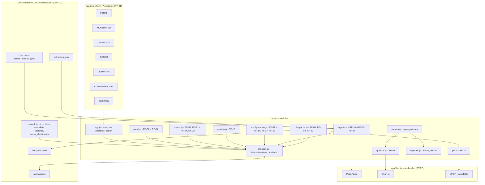
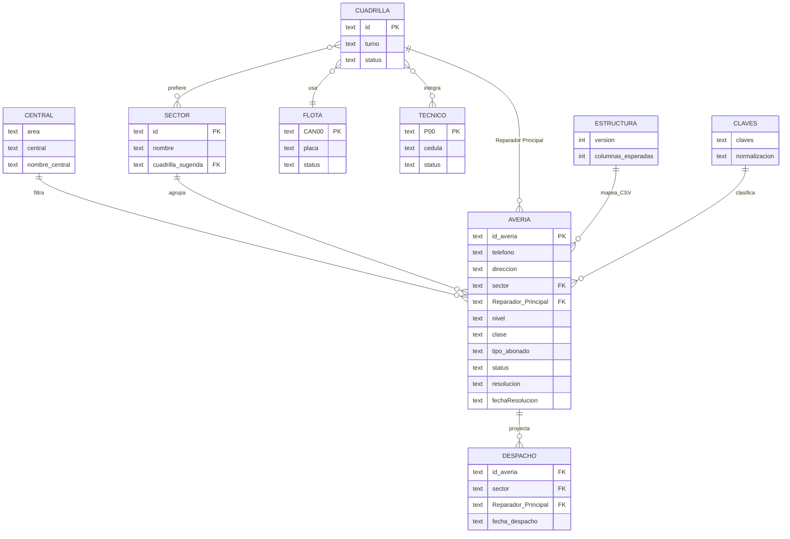
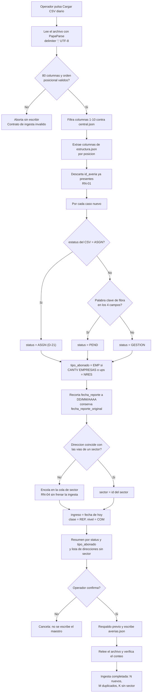
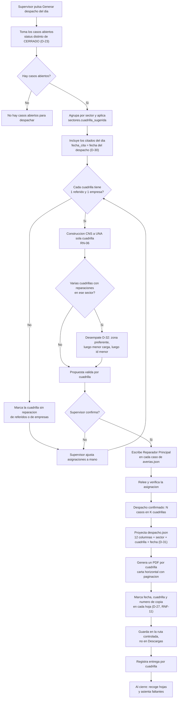

# Documento Técnico — GGTO-v1 (Página HTML de Gestión de Averías)

- **Proyecto:** GGTO-v1 — Central telefónica Francisco Salias (Área 4), CANTV, Venezuela.
- **Documento:** arquitectura y especificación técnica.
- **Fase:** 2 (Auditoría y casos de uso) — documento vivo.
- **Versión:** v1.
- **Fecha:** 13/09/2026.
- **Fuentes normativas (leídas completas, no modificadas):** `RepoTecnico/requerimientos.md` (29 RF, 12 RNF, 11 RT, 8 RN, D-01 a D-37), `RepoTecnico/PROPUESTA-PAGINA-GGTO.md`, `RepoTecnico/diccionario_datos.md`, `RepoTecnico/entornos_globales.md`, `RepoTecnico/casos_uso.md` (CU-01 a CU-22), `RepoTecnico/casos_uso/diagramas.md`, `RepoTecnico/estado_proyecto.md` y `RepoTecnico/auditoria_fase1.md` (29 hallazgos H-01 a H-29).
- **Alcance de este documento:** especificar la arquitectura, los contratos de datos, los procedimientos y la trazabilidad del sistema. **No** fija precios, calendario ni asignación de personas. Las afirmaciones se apoyan en los documentos citados; lo no decidido se marca **pendiente** con su ID.

---

## 1. Visión general y alcance

### 1.1 Qué resuelve la página

La página concentra la gestión operativa de los reportes de avería de la central Francisco Salias (área 4), alimentándose del `.csv` diario que emite el origen corporativo (L31):

| Capacidad | Resultado operativo | Requisitos |
|---|---|---|
| Conformar el **despacho diario** | Cada cuadrilla declarada recibe su hoja de trabajo del día | RF-08, RF-09, RF-10, RF-20 |
| **Agrupar averías concentradas** por sector | Sectores con 3 o más casos abiertos en la semana operativa | RF-26, RF-29, D-25 |
| **Seguimiento de casos especiales** | Empresariales (`tipo_abonado = EMP`) y referidos (`nivel = REF`) abiertos | RF-26, D-33 |
| **Reporte de trabajo diario** y **gestión semanal** | Despacho en pantalla + PDF; seguimiento semanal estadístico | RF-25, D-34 |
| **Ingesta diaria del CSV** | Casos nuevos de la central clasificados, con sector y estado | RF-16 a RF-19 |

### 1.2 Alcance del MVP (ciclos C1–C3)

El MVP es la decisión **D-02**: CONFIGURACION + CASOS + INGESTA + PANEL. Se sirve desde un servidor local en loopback con File System Access API (D-01, D-15).

| Ciclo | Entrega | Requisitos | Criterio de terminado |
|---|---|---|---|
| C1 | Armazón de 7 pestañas, CONFIGURACION completa, tabla CASOS + flotante de cierre, persistencia JSON | RF-01, RF-07 (tabla), RF-11 a RF-14, RF-21 a RF-24, RF-29 | La página abre en `http://localhost:8787`, la sesión se identifica contra `tecnicos.json` y un cambio de caso queda escrito y releído en `averias.json` |
| C2 | INGESTA del CSV: carga, filtro por central, mapeo posicional, dedupe, clasificación, sector | RF-16 a RF-19, RF-27 | El CSV del 12/09/2026 inserta 51 casos de Francisco Salias, descarta 5 por central y una segunda ingesta informa 0 nuevos |
| C3 | PANEL (búsqueda, actualización, alta manual) + GESTION telefónica + reclasificación | RF-02 a RF-04, RF-07 (clasificación), RF-15, RF-23, RF-28 | Un operador busca por `id_averia`, cierra un caso con resolución y fecha, da de alta un caso `MAN-` y vacía la bandeja GESTION |

### 1.3 Ciclos posteriores (C4–C7)

| Ciclo | Entrega | Requisitos |
|---|---|---|
| C4 | DESPACHO: agrupación por sector, reglas RN-05/RN-06, edición y PDF por cuadrilla | RF-08 a RF-10, RF-20 |
| C5 | MONITOREO + GRAFICOS (6 zonas) | RF-05, RF-06 |
| C6 | Reportes diario y semanal + casos especiales y averías concentradas | RF-25, RF-26 |
| C7 | Pruebas funcionales con datos reales, ajuste de impresión, entrega y manual | RNF-01 a RNF-07 |

### 1.4 Qué queda fuera

| Fuera de alcance | Motivo / fuente |
|---|---|
| `CONTROL_DESPACHO_GGTO-v1.xlsm` como proceso vigente | No se analizó; la página lo reemplaza funcionalmente (referencia del repositorio) |
| Migración de los datos de `alta_manual.csv` | D-14: se descartan; los casos se cargan manualmente |
| Backend con base de datos o multiusuario concurrente | D-01, D-02 y el supuesto de un solo operador por sesión |
| GCP / servicio en la nube | Ejecución local en la central (GCP descartado) |
| Exportación a XLSX | D-34: el seguimiento semanal es estadístico y sin Excel |
| Login con contraseña y TLS | No previsto: riesgo aceptado y declarado (§3.4) |
| Historial completo de valores anteriores de cada campo | **Pendiente (H-10):** el MVP conserva solo el último cambio |

---

## 2. Arquitectura propuesta

### 2.1 Estilo arquitectónico

**SPA estática**: HTML5 + CSS3 + JavaScript (ES2020), **sin framework** (RNF-03). Sin paso de compilación: los archivos se editan y se sirven tal cual. El estado vive en memoria (`almacen.js`) y la verdad vive en los JSON del disco (RT-01), leídos y escritos con File System Access API (D-01, RT-06). Las librerías son locales (RT-07): la central puede no tener internet.

### 2.2 Estructura de archivos

```
GGTO-v1/
|- servir-ggto.ps1           # lanzador: servidor local en loopback + navegador
|- app/                      # UNICO subdirectorio publicado por HTTP (D-15)
|  |- index.html
|  |- css/estilos.css
|  |- js/                    # los 13 modulos de la aplicacion
|  \- lib/                   # librerias locales (sin CDN)
|- datos/                    # JSON de trabajo: FUERA del alcance HTTP
|- RepoTecnico/              # documentacion: FUERA del alcance HTTP
\- datos_respaldo/           # respaldo manual (D-36)
```

> **Nota de coherencia:** `entornos_globales.md` §1.1 dibuja `index.html`, `css/`, `js/` y `lib/` en la raíz y, a la vez, exige `--directory app`. Para que el lanzador funcione, esos cuatro elementos deben vivir dentro de `app/` (así lo indica la nota de seguridad del propio documento). Este documento adopta la variante `app/`.

### 2.3 Módulos y responsabilidades

| Módulo | Responsabilidad principal | RF que implementa |
|---|---|---|
| `app.js` | Arranque, enrutado de las 7 pestañas (RF-01), estado global, **sesión e identificación del operador** (D-29), detección de `file://`, versión y log de aplicación | RF-01; RNF-03, RNF-08 |
| `almacen.js` | Abrir, leer, escribir y **releer** los JSON (File System Access API + modo descarga); catálogo de esquemas; deduplicación por `id_averia`; registro de auditoría (`usuario_modificacion`, `fecha_modificacion`) | RF-24; RNF-04, RNF-09, RNF-10; RT-01, RT-04, RT-06, RT-10 |
| `ingesta.js` | Carga del CSV con PapaParse (`delimiter: ';'`), validación bloqueante de las 80 columnas, filtro de central, extracción por `estructura.json`, dedupe, clasificación RN-03 y sector (RN-04) | RF-16 a RF-19, RF-27; RNF-02, RNF-04, RNF-06, RNF-10; RT-02, RT-03, RT-07, RT-08 |
| `despacho.js` | Agrupación por sector y `Reparador Principal`, reglas RN-05/RN-06, desempate D-32, edición manual y persistencia en el maestro | RF-08, RF-09, RF-20; RNF-01, RNF-10, RNF-11; RT-05 |
| `pdf.js` | PDF del despacho por cuadrilla en carta horizontal con paginación, marca de fecha/cuadrilla/copia (jsPDF + autoTable) y registro de entrega y recogida | RF-10; RNF-05, RNF-11 |
| `metricas.js` | Agregaciones del MONITOREO y del seguimiento semanal (ingreso vs. reparadas, línea de pendiente, Sem 1 a Sem 36) | RF-05 (tablas), RF-25 |
| `graficos.js` | Gráficos de las 6 zonas con Chart.js: barras, barras + línea y torta | RF-05, RF-06 |
| `casos.js` | Tabla maestra (7 columnas resumen), agrupación y filtrado (abiertos/cerrados, cuadrilla, tipo, clase, nivel, estatus), edición en línea de `clase`/`nivel`/`tipo_abonado`, flotante de detalle y **cierre bloqueante** | RF-07, RF-21 a RF-24, RF-28; RNF-01, RNF-02, RNF-07, RNF-09, RNF-10 |
| `panel.js` | Búsqueda por `id_averia` o `telefono`, actualización de gestión y alta manual con `id_averia` `MAN-` | RF-02, RF-03, RF-04, RF-28 |
| `gestion.js` | Bandeja telefónica de `status = GESTION`: cola por antigüedad y sector, guion de verificación y reclasificación | RF-15, RF-07 (clasificación), RF-28 |
| `configuracion.js` | Subpestañas CENTRAL, TECNICOS, FLOTA, CUADRILLA, SECTORES (CRUD) y PALABRAS CLAVE, más la cola de asignación de sector | RF-11 a RF-14, RF-18 (cola), RF-27, RF-29 |
| `reportes.js` | Reporte de trabajo diario y de gestión semanal; vigilancia de casos especiales y averías concentradas | RF-25, RF-26 |
| *(sin módulo propio)* | Respaldo y restauración manuales (D-36) y diagnóstico del entorno en modo descarga: hoy se apoyan en `almacen.js` + `app.js`; **pendiente (H-17):** no existe RF/RNF que los asigne formalmente a un módulo | — |

### 2.4 Diagrama de componentes



### 2.5 Librerías locales y ausencia de CDN

| Librería | Archivo en `app/lib/` | Uso | Requisito |
|---|---|---|---|
| PapaParse | `papaparse.min.js` | Parseo del CSV con `;`, comillas y BOM | RF-16, RT-08 |
| Chart.js | `chart.umd.min.js` | Barras, barras + línea y torta de MONITOREO y GRAFICOS | RF-06 |
| jsPDF | `jspdf.umd.min.js` | Documento PDF del despacho | RF-10 |
| jsPDF-AutoTable | `jspdf.autotable.min.js` | Tabla paginada en carta horizontal | RF-10, RNF-05 |

**Por qué no hay CDN:** RT-07 — «sin internet garantizado en la central: las librerías (CSV, gráficos, PDF) se guardan localmente en `lib/`». Un CDN convertiría la indisponibilidad de red en una indisponibilidad del sistema. Consecuencia de diseño: **versiones fijadas** (se registran en `entornos_globales.md` al descargarlas en C1) y **cero peticiones salientes**; el criterio CU-01-6 lo verifica («ninguna dependencia se solicita por internet»).

---

## 3. Ejecución y seguridad

### 3.1 Lanzador `servir-ggto.ps1`

```powershell
# servir-ggto.ps1 - servidor local de la pagina GGTO (solo loopback, solo app/)
$puerto = 8787
$raiz   = Split-Path -Parent $MyInvocation.MyCommand.Definition
$app    = Join-Path $raiz "app"

Write-Host "Sirviendo $app en http://localhost:$puerto (solo loopback) ..."
Start-Process "http://localhost:$puerto/index.html"

# Opcion A: Python
python -m http.server $puerto --bind 127.0.0.1 --directory $app

# Opcion B (si no hay Python): Node.js
# npx --yes serve -l $puerto $app
```

| Control | Efecto | Requisito |
|---|---|---|
| `--bind 127.0.0.1` | El servidor **no escucha** en la red: solo el propio equipo | D-15, RT-09 |
| `--directory app` | Por HTTP se publica únicamente la aplicación; `datos/` y `RepoTecnico/` no son alcanzables | D-15, RT-09 |
| Apertura por `http://localhost:8787` | `localhost` es contexto seguro y habilita File System Access API; `file://` la bloquea | RT-06 |
| Detección de `file://` en la página | Bloquea la edición y muestra el aviso de abrir con el lanzador | CU-01 (1a) |

### 3.2 Persistencia con File System Access API

| Operación | API | Uso en la página |
|---|---|---|
| Abrir carpeta o archivo | `showDirectoryPicker` / `showOpenFilePicker` | Autorizar `C:\GGTO\datos` al iniciar sesión |
| Leer | `FileSystemFileHandle.getFile()` + `text()` | Cargar `averias.json` y los 6 archivos de configuración |
| Escribir | `createWritable()` + `write()` + `close()` | Persistir cada cambio (RN-07) |
| **Verificar** | Relectura inmediata del archivo escrito | Comparar con lo enviado antes de confirmar en pantalla (RNF-10) |
| Respaldo | Descarga del JSON + `<input type="file">` | Modo descarga para navegadores sin la API (Opción B de la propuesta) |

Restricciones conocidas: Firefox y Safari no soportan la API → la página avisa «Modo consulta: este navegador no permite escribir los JSON» y habilita solo el modo descarga (RNF-03). Navegador requerido: Edge o Chrome Chromium ≥ 86.

### 3.3 Identificación del operador (`P00`)

| Paso | Comportamiento | Requisito |
|---|---|---|
| 1 | La página exige identificar al operador antes de habilitar la edición | RNF-08 |
| 2 | El operador escribe su **`P00` o usuario** y pulsa *Iniciar sesión* | D-16, D-29 |
| 3 | La página busca coincidencia exacta en `tecnicos.json` con `status` activo | RF-12, D-29 |
| 4 | La sesión muestra nombre, cédula y `P00`; toda edición queda auditada con ese `P00` y la fecha/hora | RNF-09 |
| 5 | Sin identificación válida no se permite editar; 3 intentos fallidos vuelven al diálogo con contador visible | RNF-08 |
| 6 | `tecnicos.json` ausente o inválido → «Padrón de técnicos no disponible» y bloqueo de edición | RNF-08 |

### 3.4 Matriz de permisos operador / supervisor (D-35, RNF-12)

El rol «administrador» queda **absorbido por el supervisor** (D-35); los casos de uso todavía lo listan como actor, y su actualización es un trabajo de Fase 2 en curso.

| Capacidad | Operador | Supervisor |
|---|---|---|
| Consultar casos de **su** cuadrilla | Sí | Sí |
| Consultar casos de **otras** cuadrillas | No | Sí |
| Cerrar caso (`status = CERRADO`) | Solo de su cuadrilla | Todos |
| Editar `clase` / `nivel` / `tipo_abonado` | Solo de su cuadrilla | Todos |
| Bandeja GESTION (RF-15) | No | Sí |
| Ingesta del CSV (RF-16 a RF-19) | Sí | Sí |
| Alta manual de casos (RF-04) | Sí | Sí |
| Asignar o cambiar sector (RF-18) | Sí | Sí |
| Generar y ajustar el despacho (RF-08, RF-09, RF-20) | No | Sí |
| Emitir PDF del despacho y registrar entrega (RF-10) | No | Sí |
| Padrones CENTRAL / TECNICOS / FLOTA / CUADRILLA / SECTORES (RF-11 a RF-14, RF-29) | No | Sí |
| Palabras clave de clasificación (RF-27) | No | Sí |
| MONITOREO, GRAFICOS y reportes (RF-05, RF-06, RF-25, RF-26) | Solo lectura | Sí |
| Respaldo y restauración (D-36) | No | Sí |

### 3.5 Qué impide cada control y qué **no** cubre

| Control | Impide | No cubre |
|---|---|---|
| `--bind 127.0.0.1` | Que otro equipo de la red alcance la página o descargue los JSON | Un usuario local del mismo PC o un proceso malicioso en la sesión |
| `--directory app` | Publicar `datos/averias.json` por HTTP (H-01) | La lectura directa del archivo por quien tenga acceso al disco |
| Identificación por `P00` | Editar sin operador identificado; da trazabilidad (RNF-09) | **No es autenticación:** no hay contraseña, el `P00` es público en el padrón |
| Matriz de permisos (D-35, RNF-12) | Que un operador cierre casos ajenos o toque padrones desde la interfaz | Manipulación directa del JSON o del código en el navegador |
| Edición local de `lib/` | Dependencia de internet | La integridad del propio código: no hay firma ni verificación de las librerías |
| Sin TLS | — | **Riesgo aceptado:** el tráfico es HTTP en loopback; no hay cifrado ni certificado |
| Sin login con contraseña | — | **Riesgo aceptado y declarado:** la identificación es de trazabilidad, no de seguridad de acceso |

---

## 4. Contratos de datos

### 4.1 `averias.json` — maestro de casos (35 campos)

Tipos: `T` texto, `F` fecha `DD/MM/AAAA`, `E` enumerado, `B` booleano (`SI`/`NO`), `L` lista. `PK` clave primaria, `FK` clave foránea, `OBL` obligatorio.

| # | Campo | Tipo | OBL | Dominio / formato | Origen | Notas |
|---|---|---|---|---|---|---|
| 1 | `ingreso` | F | Sí | DD/MM/AAAA | Ingesta | Fecha de entrada del caso (RN-02) |
| 2 | `nivel` | E | Sí | `REF` / `COM` | Ingesta / manual | `COM` por defecto; `REF` para referidos |
| 3 | `clase` | E | Sí | `REP` / `CNS` | Ingesta / manual | `REP` por defecto; `CNS` se corrige a mano (D-06) |
| 4 | `sector` | T (FK) | Sí | `sectores.id` | Ingesta / manual | Por coincidencia de dirección (RF-18, RN-04) |
| 5 | `Reparador Principal` | T (FK) | No | `cuadrillas.id` | Despacho | Agrupa el despacho (RF-20, D-37) |
| 6 | `id_averia` | T | Sí | **PK**, texto (`MAN-` en alta manual) | CSV / manual | Clave de deduplicación (RN-01) |
| 7 | `telefono` | T | Sí | dígitos | CSV | Clave alterna de búsqueda (RF-02) |
| 8 | `persona_reporta` | T | No | — | CSV | Quien reporta |
| 9 | `contacto` | T | No | — | CSV | Contacto adicional |
| 10 | `ultimo_comentario` | T | No | — | CSV | Campo evaluado por RN-03 |
| 11 | `problema_reporte` | T | No | — | CSV | Campo evaluado por RN-03 |
| 12 | `informacion_1` | T | No | — | CSV (col. 31) | Primera `informacion` (D-10) |
| 13 | `informacion_2` | T | No | — | CSV (col. 32) | Segunda `informacion` (D-10) |
| 14 | `nombre` | T | No | — | CSV | Nombre del abonado |
| 15 | `direccion` | T | Sí | texto libre | CSV | Base del sector y del despacho |
| 16 | `olt` | T | No | — | CSV | Red / planta externa |
| 17 | `plan` | T | No | — | CSV | Plan contratado |
| 18 | `slot` | T | No | — | CSV | Red / planta externa |
| 19 | `puerto` | T | No | — | CSV | Red / planta externa |
| 20 | `fat` | T | No | — | CSV | Caja de acceso de fibra |
| 21 | `serial` | T | No | — | CSV | Serial del equipo / ONT |
| 22 | `extra` | T | No | — | CSV | Red / planta externa (D-04) |
| 23 | `ups` | T | No | `RES` / `NRES` (según muestra) | CSV | Planta externa; significado por precisar (A-11) |
| 24 | `codigos_sin_gestion_en_VENAPP` | T | No | — | CSV | Casos sin gestión en VENAPP |
| 25 | `status` | E | Sí | `PEND` / `ASGN` / `CERRADO` / `GESTION` | Ingesta / manual | `PEND` con palabras clave; `GESTION` sin ellas; `ASGN` viene del CSV (D-05, D-13, D-21) |
| 26 | `resolucion` | E | No | `IVR` / `COS` / `COLA` | Manual | Obligatoria al cerrar (D-20) |
| 27 | `fechaResolucion` | F | No | DD/MM/AAAA | Manual | Obligatoria al cerrar (D-20) |
| 28 | `observaciones` | T | No | texto libre (≤ 500) | Manual | Notas de gestión |
| 29 | `sacas` | B | No | `SI` / `NO` | Manual | Indicador de cierre |
| 30 | `tipo_abonado` | E | No | `RES` / `EMP` | Ingesta / manual | Desde `unidad_negocio` y `ups` (D-17, RF-28) |
| 31 | `usuario_modificacion` | T | No | `P00` o usuario | Manual | Auditoría del último cambio (D-16) |
| 32 | `fecha_modificacion` | T | No | DD/MM/AAAA hh:mm | Manual | Auditoría del último cambio (D-16) |
| 33 | `fecha_reporte` | F | No | DD/MM/AAAA | CSV (col. 15) | Recortada de la marca de tiempo (D-21) |
| 34 | `fecha_reporte_original` | T | No | texto del CSV | CSV | Valor completo con hora (D-21) |
| 35 | `fecha_cita` | F | No | DD/MM/AAAA | CSV (col. 19) | Si coincide con el día del despacho, el caso es «citado» (D-30) |

**Reglas de integridad**

- `id_averia` es único; la ingesta descarta lo ya presente (RN-01, RNF-04).
- `status = CERRADO` **implica** `resolucion` y `fechaResolucion` informadas (D-20).
- `sector` debe existir en `sectores.json`; si no hay coincidencia, el caso queda en la cola visible (RN-04).
- `Reparador Principal`, si está informado, debe corresponder a una cuadrilla de `cuadrillas.json` (D-37).

### 4.2 `despacho.json` — registro del despacho del día

Conserva las **12 columnas del fuente** (L57) y añade 3 campos por D-31: **15 campos**.

| # | Campo | Tipo | OBL | Dominio | Notas |
|---|---|---|---|---|---|
| 1 | `nivel` | E | Sí | `REF` / `COM` | Copiado del maestro |
| 2 | `clase` | E | Sí | `REP` / `CNS` | Copiado del maestro |
| 3 | `id_averia` | T | Sí | PK | Trazabilidad con el maestro |
| 4 | `telefono` | T | No | — | — |
| 5 | `persona_reporta` | T | No | — | — |
| 6 | `contacto` | T | No | — | — |
| 7 | `ultimo_comentario` | T | No | — | Se imprime en la hoja de la cuadrilla |
| 8 | `nombre` | T | No | — | — |
| 9 | `direccion` | T | Sí | texto libre | — |
| 10 | `plan` | T | No | — | — |
| 11 | `fat` | T | No | — | — |
| 12 | `serial` | T | No | — | — |
| 13 | `sector` | T (FK) | Sí | `sectores.id` | **Añadido (D-31)** para agrupar el despacho |
| 14 | `Reparador Principal` | T (FK) | No | `cuadrillas.id` | **Añadido (D-31):** cuadrilla asignada |
| 15 | `fecha_despacho` | F | Sí | DD/MM/AAAA | **Añadido (D-31):** día que representa el archivo |

### 4.3 `estructura.json` — mapa posicional del CSV

El CSV real tiene **80 columnas**, separador `;`, UTF-8, con encabezados repetidos (`informacion` ×2 col. 31-32, `nombre` ×2 col. 33 y 76, `descripcion` ×3 col. 52, 57 y 59); por eso el contrato **no puede ser por nombre** y es **posicional** (D-12, D-21): declara solo las columnas necesarias, no las 80.

**Forma del archivo** (una entrada por campo; `tipo` usa `T`, `F`, `E`, `N`):

```json
{
  "version": 1,
  "columnas_esperadas": 80,
  "separador": ";",
  "codificacion": "UTF-8",
  "campos": [
    { "json": "id_averia", "columna": 11, "tipo": "T", "obligatorio": true },
    { "json": "informacion_1", "columna": 31, "tipo": "T", "obligatorio": false },
    { "json": "fecha_cita", "columna": 19, "tipo": "F", "obligatorio": false }
  ],
  "filtro_central": { "columnas": [1, 2, 3, 4, 5, 6, 7, 8, 9, 10] }
}
```

| # | Campo JSON | Col. CSV | Columna del CSV | Notas |
|---|---|---|---|---|
| 1 | `id_averia` | 11 | `id_averia` | PK |
| 2 | `telefono` | 14 | `telefono` | — |
| 3 | `persona_reporta` | 16 | `persona_reporta` | — |
| 4 | `contacto` | 17 | `contacto` | — |
| 5 | `ultimo_comentario` | 21 | `ultimo_comentario` | RN-03 |
| 6 | `problema_reporte` | 28 | `problema_reporte` | RN-03 |
| 7 | `informacion_1` | 31 | `informacion` (1.ª) | D-10 |
| 8 | `informacion_2` | 32 | `informacion` (2.ª) | D-10 |
| 9 | `nombre` | 33 | `nombre` (abonado) | — |
| 10 | `direccion` | 34 | `direccion` | Base del sector |
| 11 | `olt` | 36 | `olt` | — |
| 12 | `plan` | 39 | `plan` | — |
| 13 | `slot` | 40 | `slot` | — |
| 14 | `puerto` | 41 | `puerto` | — |
| 15 | `fat` | 43 | `fat` | — |
| 16 | `serial` | 44 | `serial` | — |
| 17 | `extra` | 46 | `extra` | Red / planta externa |
| 18 | `ups` | 62 | `ups` | Planta externa |
| 19 | `codigos_sin_gestion_en_VENAPP` | 64 | `codigos_sin_gestion_en_VENAPP` | — |

**Columnas del CSV que se usan sin copiarse al maestro**

| Uso | Columnas | Regla |
|---|---|---|
| Filtro de central (RT-03) | 1-10 | Se comparan contra `central.json`; no se persisten |
| Fecha del reporte (D-21) | 15 | → `fecha_reporte` (DD/MM/AAAA) + `fecha_reporte_original` |
| Estatus de origen (D-13, D-21) | 27 | `ASGN` prevalece sobre RN-03 |
| Tipo de abonado (D-17) | 61 y 62 (`unidad_negocio`, `ups`) | `EMP` si `CANTV EMPRESAS` o `ups = NRES` |
| Citados del día (D-30) | 19 | → `fecha_cita`; igual a la fecha del despacho |
| Rastro de origen (D-16, H-10) | 20, 53, 80 | **Pendiente:** sin columnas destino en `averias.json` |

> **Pendiente de contrato:** `diccionario_datos.md` §3 enumera los 19 campos sin la columna del CSV, mientras §7 (Anexo A) fija las posiciones usadas por CU-08. La tabla anterior unifica ambas fuentes; debe confirmarse al implementar C2 y registrarse en `estructura.json`.

### 4.4 Archivos de configuración

**`central.json`** — datos operativos (RF-11, L15). Los 10 campos son obligatorios y alimentan el filtro del CSV (RT-03).

| Campo | Tipo | OBL | Dominio / ejemplo |
|---|---|---|---|
| `region` | T | Sí | Valor de la col. 1 |
| `estado_geografico` | T | Sí | Col. 2 |
| `capital_estado` | T | Sí | Col. 3 |
| `municipio` | T | Sí | Col. 4 |
| `parroquia` | T | Sí | Col. 5 |
| `estado_operativo` | T | Sí | Col. 6 |
| `distrito` | T | Sí | Col. 7 |
| `area` | T | Sí | `AREA 4` |
| `central` | T | Sí | `2324X` |
| `nombre_central` | T | Sí | `FRANCISCO SALIAS` |

**`tecnicos.json`** — padrón de trabajadores (RF-12, D-29).

| Campo | Tipo | OBL | Dominio | Notas |
|---|---|---|---|---|
| `nombre` | T | Sí | — | Se muestra en la sesión |
| `cedula` | T | Sí | única | Identificación |
| `P00` | T | Sí | único y obligatorio | Código de empleado = credencial de sesión (D-29) |
| `telefono` | T | No | — | — |
| `correo` | T | No | — | — |
| `especialidad` | T | No | — | — |
| `status` | E | Sí | Activo / Inactivo | Solo activos en selectores y en el login |

**`flota.json`** — padrón de vehículos (RF-13, L17).

| Campo | Tipo | OBL | Dominio |
|---|---|---|---|
| `CAN00` | T | Sí | Identificador único |
| `tipo` | T | No | — |
| `marca` | T | No | — |
| `modelo` | T | No | — |
| `placa` | T | Sí | Única |
| `combustible` | T | No | Grafía corregida (A-06) |
| `status` | E | Sí | Operativo / En mantenimiento / Fuera de servicio |
| `estado_cauchos` | T | No | — |
| `estado_fluidos` | T | No | — |
| `estado_general` | T | No | — |

**`cuadrillas.json`** — padrón de cuadrillas (RF-14, D-07, D-37).

| Campo | Tipo | OBL | Dominio | Notas |
|---|---|---|---|---|
| `id` | T | Sí | PK, único | Es el valor de `Reparador Principal` (D-37) |
| `nombre` | T | Sí | — | — |
| `tecnicos` | L | Sí | FK a `tecnicos.json` | Al menos 1 activo |
| `vehiculo` | T | No | FK a `flota.json` (`CAN00`) | — |
| `turno` | T | No | — | — |
| `sectores` | L | No | FK a `sectores.json` | Zonas preferentes (usadas en D-32) |
| `status` | E | Sí | Activa / Inactiva | Las inactivas no reciben despacho |

**`sectores.json`** — catálogo de sectores (D-03, D-25, RF-29).

| Campo | Tipo | OBL | Dominio | Notas |
|---|---|---|---|---|
| `id` | T | Sí | PK, único | **Pendiente:** tipo y numeración definitivos (A-04; el catálogo se decidió en D-25, pero el diccionario §4.5 sigue marcándolo) |
| `nombre` | T | Sí | — | «Prados del Este», etc. |
| `vias` | L | Sí | calles / urbanizaciones | Emparejamiento normalizado (D-03) |
| `cuadrilla_sugerida` | T | No | FK a `cuadrillas.json` | Sugerencia de despacho |

**`claves_clasificacion.json`** — palabras clave de RN-03 (D-11, D-26, RF-27).

| Campo | Tipo | OBL | Dominio | Notas |
|---|---|---|---|---|
| `claves` | L | Sí | `LOSS ROJO`, `FALLA FIBRA`, `FIBRA DAÑADA` por defecto | Editables en CONFIGURACION |
| `normalizacion` | E | Sí | `estricta` / `normalizada` (por defecto) | Mayúsculas, sin tildes, espacios colapsados |
| `campos_evaluados` | L | Sí | `ultimo_comentario`, `problema_reporte`, `informacion_1`, `informacion_2` | Coincidencia por subcadena |
| `umbral_concentracion` | N | No | 3 por defecto, editable | Avería concentrada (D-25, RF-26) |

### 4.5 Diagrama entidad-relación


### 4.6 Contratos de operación

#### 4.6.1 Validación bloqueante del CSV (D-21)

| Validación | Regla | Si falla |
|---|---|---|
| Separador y codificación | La cabecera debe partirse en 80 campos con `;` | Aborta: «Verifique que el archivo use `;` y codificación UTF-8» |
| Número de columnas | Exactamente **80** | Aborta: «Contrato de ingesta inválido: se esperaban 80 columnas y se encontraron X» |
| Orden posicional | Cada columna declarada en `estructura.json` debe contener el dato esperado | Aborta sin escribir el maestro y ofrece el detalle de la cabecera leída |
| Obligatorios legibles | `id_averia` (11), `telefono` (14), `direccion` (34) no vacíos | El registro se cuenta como incidencia y no se inserta |
| Fechas | `DD/MM/AAAA hh:mm:ss a.m./p.m.` | Se conserva el original, `fecha_reporte` queda vacía y se informa la incidencia |

La validación es **total o nada**: no se escribe nada en `averias.json` si el contrato no se cumple.

#### 4.6.2 Deduplicación por `id_averia` (RN-01, RNF-04)

| Paso | Regla |
|---|---|
| 1 | Se lee el conjunto de `id_averia` presentes en `averias.json` |
| 2 | Toda fila del CSV cuyo `id_averia` ya exista se **descarta** y no modifica el caso existente |
| 3 | El resumen informa: registros leídos, descartados por central, descartados por duplicado y nuevos |
| 4 | Reingerir el mismo CSV produce «0 casos nuevos» y el maestro queda idéntico |
| 5 | Los casos manuales (`MAN-`) no colisionan con el CSV; ante colisión se incrementa el consecutivo |

#### 4.6.3 Regla RN-03 con `ASGN` prevalente (D-05, D-21, D-26)

| Orden | Condición | `status` resultante |
|---|---|---|
| 1 | El `estatus` del CSV (col. 27) es `ASGN` | `ASGN` — **prevalece** sobre la clasificación |
| 2 | Sin `ASGN` y con coincidencia de palabras clave de fibra | `PEND` |
| 3 | Sin `ASGN` y sin coincidencia | `GESTION` |

La búsqueda es por **subcadena sobre texto normalizado** (mayúsculas, sin tildes, espacios colapsados) en los 4 campos; el cambio de claves o de modo exige **vista previa del impacto** (D-26). Si la lista de claves está vacía, todos los casos entrarían en `GESTION` y el sistema exige confirmación explícita.

#### 4.6.4 Cierre bloqueante (D-20, RNF-10)

| Validación | Regla |
|---|---|
| `resolucion` | Obligatoria; ∈ {IVR, COS, COLA} |
| `fechaResolucion` | Obligatoria; DD/MM/AAAA y fecha real (rechaza `31/02/2026`) |
| `sacas` | Si se informa, ∈ {SI, NO} |
| `observaciones` | Hasta 500 caracteres |
| Sector | Debe existir en `sectores.json` |
| Efecto | `status = CERRADO` exige los dos primeros; el botón queda inhabilitado si faltan |
| Auditoría | Se escribe `usuario_modificacion` (P00) y `fecha_modificacion` |
| Reapertura | Un caso cerrado se reabre a `GESTION` con nota «Reapertura DD/MM/AAAA hh:mm por <operador>» |

#### 4.6.5 Alta manual con `id_averia` `MAN-` (D-18, RF-04)

| Aspecto | Regla |
|---|---|
| Lista de campos | **Cerrada**: fecha del caso, teléfono, nombre, dirección, contacto, problema reportado, sector, clase, nivel, `tipo_abonado`, observaciones |
| Generación del id | `MAN-` + consecutivo (`MAN-0001`), tomando el mayor existente, verificando unicidad antes de escribir |
| Colisión | Se incrementa el consecutivo y se informa («El id MAN-0001 ya existía; se usó MAN-0002») |
| Valores por defecto | `ingreso` = fecha del día, `status = GESTION`, `clase = REP`, `nivel = COM` |
| Validaciones | Fecha DD/MM/AAAA real; teléfono 7-15 dígitos; nombre y dirección no vacíos; sector existente; enums válidos |
| Campos del fuente no incorporados | **Pendiente (P6/H-02):** «Tipo», «Actividad» y «Agente» no están en la lista cerrada ni en el maestro |

---

## 5. Procedimientos

### 5.1 Ingesta diaria del CSV (CU-08)



**Puntos de control:** el archivo llega a diario desde el origen corporativo; si no llega, se mantiene el maestro del día anterior y la incidencia se registra fuera de la página (el procedimiento con el emisor sigue **pendiente**, H-15/H-24). Una segunda ingesta del mismo día debe informar 0 nuevos.

### 5.2 Generación del despacho con su PDF por cuadrilla (CU-16, CU-17)



**Reglas aplicadas:** RN-05 (citados del día + ≥1 reparación de referidos + ≥1 de empresas por cuadrilla) y RN-06 (la construcción se asigna a **una sola** cuadrilla, la que tenga reparaciones en ese sector). **Desempate D-32:** primero la cuadrilla que tenga ese sector como zona preferente en `cuadrillas.sectores`; si hay varias o ninguna, la de menor carga del día y, en empate, el `id` menor; el supervisor puede cambiarla y el cambio queda registrado.

La asignación se escribe de vuelta en `averias.json` (`Reparador Principal` = `cuadrillas.id`, D-37) y `despacho.json` queda como registro del despacho del día (D-31), base del control documental del PDF (RNF-11).

---

## 6. Trazabilidad: módulo → caso de uso → RF/RNF/RT

### 6.1 Matriz principal

| Módulo / componente | Casos de uso | RF | RNF / RT |
|---|---|---|---|
| `app.js` (armazón, pestañas, sesión) | CU-01, CU-22 | RF-01 | RNF-03, RNF-07, RNF-08; RT-06, RT-07, RT-09 |
| `almacen.js` (persistencia y auditoría) | CU-01, CU-07 a CU-14, CU-16, CU-21, CU-22 | RF-24 (+ soporte de RF-02 a RF-04, RF-11 a RF-14, RF-16 a RF-23, RF-27 a RF-29) | RNF-04, RNF-09, RNF-10; RT-01, RT-04, RT-06, RT-10 |
| `ingesta.js` | CU-07, CU-08, CU-09 | RF-16, RF-17, RF-18, RF-19, RF-27 | RNF-02, RNF-04, RNF-06, RNF-10; RT-02, RT-03, RT-07, RT-08 |
| `despacho.js` | CU-16, CU-17 | RF-08, RF-09, RF-20 | RNF-01, RNF-10, RNF-11; RT-05 |
| `pdf.js` | CU-17 | RF-10 | RNF-05, RNF-11; RT-07 |
| `metricas.js` | CU-18, CU-19 | RF-05 (tablas), RF-25 | RNF-02, RNF-06 |
| `graficos.js` | CU-18 | RF-05, RF-06 | RNF-02; RT-07 |
| `casos.js` | CU-10, CU-11, CU-12, CU-15 | RF-07, RF-21, RF-22, RF-23, RF-28 | RNF-01, RNF-02, RNF-07, RNF-09, RNF-10, RNF-12; RT-04 |
| `panel.js` | CU-11, CU-12, CU-14 | RF-02, RF-03, RF-04, RF-28 | RNF-06, RNF-08, RNF-09, RNF-10, RNF-12 |
| `gestion.js` | CU-13 | RF-07 (clasificación), RF-15, RF-28 | RNF-01, RNF-09, RNF-10, RNF-12 |
| `configuracion.js` | CU-02, CU-03, CU-04, CU-05, CU-06, CU-07, CU-09 | RF-11, RF-12, RF-13, RF-14, RF-18 (cola), RF-27, RF-29 | RNF-04, RNF-08, RNF-09, RNF-10, RNF-12; RT-01, RT-03 |
| `reportes.js` | CU-19, CU-20 | RF-25, RF-26 | RNF-01, RNF-06, RNF-11 |
| Respaldo / contingencia (sin módulo propio) | CU-21, CU-22 | **pendiente (H-17):** ningún RF los asigna | RNF-04, RNF-10; RT-10 |

### 6.2 Cobertura de los 29 RF

| RF | Módulo responsable | CU |
|---|---|---|
| RF-01 | `app.js` | CU-01, CU-22 |
| RF-02 | `panel.js` | CU-11 |
| RF-03 | `panel.js` | CU-12 |
| RF-04 | `panel.js` | CU-14 |
| RF-05 | `metricas.js`, `graficos.js` | CU-18 |
| RF-06 | `graficos.js` | CU-18 |
| RF-07 | `casos.js` (tabla), `gestion.js` (clasificación) | CU-10, CU-13 |
| RF-08 | `despacho.js` | CU-16 |
| RF-09 | `despacho.js` | CU-16 |
| RF-10 | `pdf.js` | CU-17 |
| RF-11 | `configuracion.js` | CU-02 |
| RF-12 | `configuracion.js` | CU-03 |
| RF-13 | `configuracion.js` | CU-04 |
| RF-14 | `configuracion.js` | CU-05 |
| RF-15 | `gestion.js` | CU-13 |
| RF-16 | `ingesta.js` | CU-08 |
| RF-17 | `ingesta.js` (+ vista previa en `configuracion.js`) | CU-07, CU-08 |
| RF-18 | `ingesta.js` + `configuracion.js` (cola) | CU-08, CU-09 |
| RF-19 | `ingesta.js` | CU-08 |
| RF-20 | `despacho.js` | CU-16, CU-17 |
| RF-21 | `casos.js` | CU-10 |
| RF-22 | `casos.js` | CU-11, CU-12 |
| RF-23 | `casos.js` | CU-10 |
| RF-24 | `almacen.js` | CU-10, CU-12, CU-13, CU-14 |
| RF-25 | `reportes.js` + `metricas.js` | CU-19 |
| RF-26 | `reportes.js` + `configuracion.js` (umbral) | CU-20 |
| RF-27 | `configuracion.js` + `ingesta.js` | CU-07 |
| RF-28 | `casos.js`, `panel.js`, `gestion.js` | CU-10, CU-13 |
| RF-29 | `configuracion.js` | CU-06, CU-09 |

**Resultado: 29 de 29 RF tienen módulo responsable.** Ningún RF queda huérfano.

### 6.3 Cobertura de RNF y RT

| Grupo | Módulo(s) responsable(s) |
|---|---|
| RNF-01 (usabilidad) | `app.js`, `casos.js`, `panel.js`, `gestion.js`, `despacho.js`, `reportes.js` |
| RNF-02 (desempeño) | `almacen.js`, `casos.js`, `ingesta.js`, `metricas.js`, `graficos.js` |
| RNF-03 (portabilidad) | `app.js`, `servir-ggto.ps1` |
| RNF-04 (integridad) | `almacen.js`, `ingesta.js` |
| RNF-05 (impresión) | `pdf.js` |
| RNF-06 (fechas y semana) | `ingesta.js`, `casos.js`, `metricas.js`, `panel.js` |
| RNF-07 (idioma y nomenclatura) | `app.js`, `casos.js`, `configuracion.js` |
| RNF-08 (control de acceso) | `app.js` |
| RNF-09 (auditoría) | `almacen.js` (escritura), `casos.js` (consulta) |
| RNF-10 (integridad de datos) | `almacen.js`, `casos.js`, `panel.js`, `configuracion.js`, `ingesta.js` |
| RNF-11 (control documental del despacho) | `pdf.js`, `despacho.js` |
| RNF-12 (permisos por rol) | `app.js` (sesión y matriz) — aplicado por todos los módulos que escriben |
| RT-01, RT-04 | `almacen.js` (esquemas y orden de campos) |
| RT-02, RT-03, RT-08 | `ingesta.js` + `configuracion.js` (CENTRAL) |
| RT-05 | `despacho.js` |
| RT-06, RT-09 | `servir-ggto.ps1` + `app.js` |
| RT-07 | `app/lib/` (las 4 librerías locales) |
| RT-10 | `almacen.js` + procedimiento de respaldo (D-36) |
| RT-11 | **Fuera del alcance de los módulos:** ubicación del metadata de git (`C:\GGTO\git\GGTO-v1.git`), tarea de entorno (§7) |

---

## 7. Entornos y despliegue

### 7.1 Rutas

| Elemento | Ruta | Requisito |
|---|---|---|
| Raíz del proyecto (workspace) | `G:\Mi unidad\CANTV PDE\GGTO-v1` | — |
| Aplicación servida por HTTP | `G:\Mi unidad\CANTV PDE\GGTO-v1\app` | D-15, RT-09 |
| Documentación técnica | `G:\Mi unidad\CANTV PDE\GGTO-v1\RepoTecnico` | Fuera del alcance HTTP |
| Datos de trabajo (JSON) | `C:\GGTO\datos` | D-19, RT-10 |
| Respaldo manual | `G:\Mi unidad\CANTV PDE\GGTO-v1\datos_respaldo` (o ruta de red) | D-36 |
| Metadata de git | `C:\GGTO\git\GGTO-v1.git` (con `.git` de tipo `gitdir:`) | D-22, RT-11 |
| CSV diario de entrada | raíz del proyecto: `detalle_averias_gpon DD_MM_AAAA.csv` | RT-02, RT-08 |

### 7.2 Repositorios y ramas

| Remoto | URL | Ramas |
|---|---|---|
| GitHub (`origin`) | https://github.com/anlucorporations/GGTO.git | `main` (estable), `GGTOv1-DSH` (desarrollo) |
| GitLab (`gitlab`) | https://gitlab.com/anlucorporations/ggto.git | `main` (estable), `GGTOv1-DSH` (desarrollo) |

Regla del proyecto: **no se hace push ni pull sin orden explícita del usuario.** El CSV, los PDF de despacho y el `.xlsm` se mantienen versionados (D-36, riesgo aceptado).

### 7.3 Puesto de trabajo

| Requisito | Detalle |
|---|---|
| Navegador | **Edge o Chrome** Chromium ≥ 86 (File System Access API). Firefox y Safari solo en modo descarga |
| Resolución | Mínima 1366 × 768; diseño para 1440 × 900 |
| Impresión | Impresora con papel carta; el PDF del despacho se genera horizontal |
| Software de apoyo | Python 3.7+ **o** Node.js, solo para el lanzador |
| Puerto | 8787 en loopback (`Get-NetTCPConnection -LocalPort 8787` para verificar) |
| GCP | **No aplica:** ejecución local en la central |

### 7.4 Procedimiento de respaldo manual (D-36)

| Paso | Acción | Responsable |
|---|---|---|
| 1 | Abrir el bloque RESPALDO y consultar la fecha del último respaldo y el tamaño de cada archivo | Supervisor |
| 2 | Pulsar *Respaldar ahora* | Supervisor |
| 3 | Copiar los 9 JSON de `C:\GGTO\datos` a una carpeta con la fecha del día en la ruta de respaldo | Página |
| 4 | Releer cada copia y compararla con el original; mostrar «Respaldo verificado: 9 archivos» | Página |
| 5 | Restauración: elegir carpeta, previsualizar los archivos a reemplazar y confirmar; el sistema respalda el estado actual antes de reemplazar | Supervisor |

El respaldo es **manual y a demanda del supervisor**: sin automatismo ni rotación (D-36). **Riesgo aceptado y declarado.** Los datos nunca viven en Google Drive ni en la nube.

---

## 8. Riesgos técnicos y decisiones de diseño pendientes

### 8.1 Riesgos aceptados

| Riesgo | Impacto | Estado |
|---|---|---|
| **Sin TLS** (HTTP en loopback) | El tráfico no está cifrado; quien opere el mismo equipo puede observarlo | Aceptado y declarado (D-15) |
| **Sin login con contraseña** | La identificación por `P00` es de trazabilidad, no de autenticación; no impide el uso por un tercero en el mismo PC | Aceptado y declarado (D-16, D-29) |
| **Sin respaldo automático** | Una pérdida del archivo local solo se recupera si el supervisor respaldó a mano | Aceptado (D-36, H-09, H-25) |
| **Datos personales en el PDF del despacho** | Nombre, dirección, teléfono y comentarios salen en papel sin control de destino si no se aplica D-27 | Mitigado parcialmente (D-27, H-12) |
| **Datos personales en el repositorio** (CSV, PDF, `.xlsm`) | Exposición en GitHub y GitLab con datos de abonados | Aceptado (D-36, H-13, P9) |
| **Retención indefinida** | Histórico sin purga automática; finalidad y responsable documentados, sin base legal verificada | Aceptado (D-28, H-13) |
| **Historial de cambios incompleto** | Solo se conserva el último cambio, no los valores anteriores | Aceptado en el MVP (**pendiente H-10**) |
| **Un solo operador a la vez** | Es un supuesto, no una restricción implementable: nada impide dos pestañas o dos puestos sobre el mismo archivo | Supuesto declarado (auditoría H-01) |

### 8.2 Riesgos de Google Drive (ya corregidos)

| Riesgo | Evidencia | Corrección |
|---|---|---|
| `.git` dentro de la unidad sincronizada | Google Drive inyectó 75 `desktop.ini` dentro de `.git` (incluido `.git\refs\desktop.ini`) y rompió `git fetch` con `fatal: bad object refs/desktop.ini` | **D-22:** el metadata vive en `C:\GGTO\git\GGTO-v1.git`, con `.git` de tipo `gitdir:`; sin pérdida de commits |
| `datos/` dentro de la unidad sincronizada | Escrituras fallidas con `EISDIR` / `SetFileSecurityW EIO`; el camino confiable (escribir en `%TEMP%` y copiar) no lo puede ejecutar el navegador | **D-19:** los JSON viven en `C:\GGTO\datos`, fuera de Drive; RT-10 |
| Documentación escrita sobre `G:` | Los editores que renombran archivos fallan en la unidad sincronizada | Práctica del proyecto: escribir en `%TEMP%` y copiar al destino (`entornos_globales.md` §9) |

### 8.3 Decisiones de diseño pendientes antes de C4

Los casos de uso se están actualizando con las decisiones **D-29 a D-37**; los puntos abiertos son:

| # | Pendiente | Referencia |
|---|---|---|
| 1 | Sustituir las marcas `[SUPUESTO: A-05/A-08/A-09/A-10/A-11/A-14]` de `casos_uso.md` por las decisiones vigentes (D-30, D-34, D-33, D-32, D-29, D-31) | `estado_proyecto.md` §10 |
| 2 | Incorporar el rol «administrador» como absorbido por el supervisor en los actores y matrices de los casos de uso | D-35 |
| 3 | Confirmar el **tipo y la numeración de `sectores.id`** | A-04 / diccionario §4.5 (el catálogo se decidió en D-25) |
| 4 | Fijar el **mapeo posicional definitivo** de `estatus` (27), `unidad_negocio` (61) y `ups` (62) en `estructura.json`, y crear las columnas de rastro de origen (20, 53, 80) o descartarlas | diccionario §3 vs. §7; H-10 |
| 5 | Decidir el destino de los campos «Tipo», «Actividad» y «Agente» del alta manual | P6 / H-02 |
| 6 | Definir el **criterio de cálculo de «asignados»** de la zona Cuadrilla (falta fecha de asignación) | H-28 |
| 7 | Implementar el **historial completo** de valores anteriores de los campos auditados | H-10 |
| 8 | Definir el procedimiento de escalamiento con el **emisor del CSV** cuando el archivo no llega | H-15 / H-24 |
| 9 | Asignar **RF/RNF explícitos** al respaldo y al arranque del servidor, hoy sin dueño formal | H-17 |
| 10 | Fijar las **versiones** de PapaParse, Chart.js y jsPDF/autoTable al descargarlas | `entornos_globales.md` §2 y §11 |
| 11 | Confirmar en el puesto real que Edge/Chrome están disponibles y se autoriza el servidor local en el 8787 | `entornos_globales.md` §11 |
| 12 | Auditoría de los casos de uso y del presente documento técnico (pasos 3 y 6 de la Fase 2) | `estado_proyecto.md` §10 |

---

## 9. Plan de desarrollo vertical resumido

Cada ciclo es un **hito vertical usable**: al terminarlo, el sistema se puede operar para esa capacidad. El detalle fino se hará al iniciar C1.

| Ciclo | Alcance | Requisitos | Criterio de terminado |
|---|---|---|---|
| **C1** | Armazón de las 7 pestañas, sesión del operador, CONFIGURACION (CENTRAL, TECNICOS, FLOTA, CUADRILLA, SECTORES), tabla CASOS con las 7 columnas, flotante de detalle y cierre bloqueante, persistencia JSON con relectura | RF-01, RF-07 (tabla), RF-11 a RF-14, RF-21 a RF-24, RF-29 | La página abre en `http://localhost:8787`, la sesión se identifica contra `tecnicos.json`, un `status`/`clase`/`nivel` editado queda escrito y releído en `averias.json`, y `datos/` no responde por HTTP |
| **C2** | INGESTA del CSV: validación bloqueante de 80 columnas, filtro de central, mapeo posicional, dedupe, clasificación RN-03 con `ASGN` prevalente, asignación de sector y cola de pendientes, palabras clave con vista previa | RF-16 a RF-19, RF-27 | El CSV del 12/09/2026 inserta 51 casos de Francisco Salias y descarta 5 por central; la segunda ingesta informa 0 nuevos; un archivo de 79 columnas se rechaza sin escribir |
| **C3** | PANEL (búsqueda por `id_averia`/`telefono`, actualización de gestión, alta manual `MAN-`) + GESTION telefónica y reclasificación | RF-02 a RF-04, RF-07 (clasificación), RF-15, RF-23, RF-28 | Un operador busca, cierra con resolución y fecha, da de alta `MAN-0001` y vacía la bandeja GESTION; el cierre sin resolución queda bloqueado |
| **C4** | DESPACHO: agrupación por sector y cuadrilla, RN-05/RN-06, desempate D-32, edición manual, `despacho.json` y PDF por cuadrilla con registro de entrega | RF-08 a RF-10, RF-20 | Se generan N PDF (uno por cuadrilla con casos) en carta horizontal, cada hoja con fecha, cuadrilla y número de copia, y `averias.json` releído muestra `Reparador Principal` |
| **C5** | MONITOREO + GRAFICOS: 6 zonas con gráfico y tabla, semana operativa lunes-sábado, selector Sem 1 a Sem 36 | RF-05, RF-06 | Las 6 zonas se dibujan en menos de 3 s con 1.000 casos y la semana muestra 6 puntos, sin domingo |
| **C6** | Reportes diario y semanal, casos especiales (EMP/REF abiertos) y averías concentradas con umbral editable | RF-25, RF-26 | El reporte diario y el semanal se emiten en pantalla y PDF, y la lista de concentradas coincide con el conteo de abiertos por sector |
| **C7** | Pruebas funcionales con datos reales de una semana, ajuste de impresión, entrega y manual de usuario | RNF-01 a RNF-07 | Ingesta + despacho en una sesión corta sobre datos reales, con los umbrales de D-24 medidos y el PDF validado en carta horizontal |

---

## 10. Glosario técnico

| Término | Significado |
|---|---|
| **SPA estática** | Aplicación de una sola página HTML que no requiere compilación ni servidor de aplicación |
| **File System Access API** | API del navegador que permite leer y **escribir** archivos del disco con autorización del usuario |
| **Loopback** | Interfaz de red local (`127.0.0.1`): el servidor solo es alcanzable desde el propio equipo |
| **Contexto seguro** | Condición del navegador (`http://localhost` o HTTPS) que habilita APIs restringidas |
| **Contrato posicional** | Mapeo CSV→JSON por número de columna, no por nombre (necesario por los encabezados repetidos) |
| **Dedupe** | Descarte de registros cuyo `id_averia` ya existe en el maestro (RN-01) |
| **Bloqueante** | Validación que, si falla, impide toda la operación (ingesta estricta D-21, cierre D-20) |
| **RN-03** | Regla que decide `PEND` vs. `GESTION` según palabras clave de fibra, con `ASGN` prevalente |
| **Cuadrilla** | Equipo de calle identificado por `cuadrillas.id`, que es el valor de `Reparador Principal` (D-37) |
| **Sector** | Agrupación geográfica de averías por cercanía de direcciones (`sectores.json`) |
| **Avería concentrada** | 3 o más casos abiertos del mismo sector en la semana operativa, con umbral editable (D-25) |
| **Caso especial** | Cliente empresarial (`tipo_abonado = EMP`) o referido (`nivel = REF`) que sigue abierto (D-33) |
| **Citado del día** | Caso con `fecha_cita` igual a la fecha del despacho; entra en el reparto (D-30) |
| **Semana operativa** | Lunes a sábado (RN-08); el seguimiento semanal se agrupa por semana del año, Sem 1 a Sem 36 (D-34) |
| **Modo descarga** | Operación degradada en navegadores sin File System Access API: se descarga el JSON completo y se reemplaza a mano |
| **P00** | Código de empleado único de `tecnicos.json`; es la credencial con la que se identifica la sesión (D-29) |

---

## 11. Anexo — Decisiones D-01 a D-37

| ID | Decisión (una línea) |
|---|---|
| D-01 | Persistencia con servidor local mínimo + File System Access API: la página lee y escribe los JSON en disco |
| D-02 | Alcance: primero el MVP (CONFIGURACION + CASOS + INGESTA + PANEL) = ciclos C1–C3 |
| D-03 | Sectores = lista de calles/urbanizaciones, con emparejamiento por texto normalizado y cola de asignación manual |
| D-04 | La columna `extra` de `averias.json` pertenece a Red / planta externa |
| D-05 | RN-03: sin palabras clave de fibra → `GESTION`; con palabras clave → `PEND` |
| D-06 | Todo caso ingerido entra con `clase = REP`; la corrección a `CNS` o `REF` es manual |
| D-07 | Ficha de cuadrilla: `id, nombre, técnicos[], vehículo, turno, sectores[], status` |
| D-08 | **Sin efecto:** el contrato vigente del CSV es el mapa posicional de D-12 |
| D-09 | El maestro de casos se llama `averias.json` |
| D-10 | La `informacion` duplicada son dos columnas: `informacion_1` e `informacion_2` |
| D-11 | Palabras clave editables en CONFIGURACION con búsqueda normalizada |
| D-12 | `estructura.json` es un mapa posicional que declara solo las columnas necesarias |
| D-13 | `ASGN` se incorpora como cuarto valor del estatus del maestro |
| D-14 | Se descartan los datos de `alta_manual.csv`; los casos se cargan manualmente |
| D-15 | Servidor local solo en loopback (`--bind 127.0.0.1`) y sirviendo solo el subdirectorio de la aplicación |
| D-16 | El operador se identifica en cada sesión contra `tecnicos.json`; cada cambio registra quién y cuándo |
| D-17 | Campo `tipo_abonado` (`RES`/`EMP`) alimentado por `unidad_negocio` y `ups` del CSV |
| D-18 | Alta manual con lista cerrada de campos e `id_averia` automático `MAN-` + consecutivo |
| D-19 | `datos/` sale de Google Drive: los JSON viven en `C:\GGTO\datos` |
| D-20 | Cierre bloqueante (exige `resolucion` y `fechaResolucion`) y validación de obligatorios, enums y sector |
| D-21 | Ingesta estricta: validación bloqueante, fechas recortadas con original conservado y `ASGN` con precedencia |
| D-22 | El directorio `.git` vive en disco local, fuera de Google Drive |
| D-23 | «Abierto» = `status` distinto de `CERRADO`; «tipo» = `clase` + `nivel` calculado en pantalla |
| D-24 | Umbrales de desempeño: 1.000 casos, filtrado y orden < 1,5 s, MONITOREO < 3 s |
| D-25 | CRUD de sectores en C1 y avería concentrada = 3 casos abiertos del mismo sector en la semana, con umbral editable |
| D-26 | Palabras clave por subcadena sobre texto normalizado, con vista previa del impacto |
| D-27 | Datos personales en el PDF: fecha, cuadrilla y número de copia; entrega registrada, hojas recogidas y destruidas, respaldos en ruta controlada |
| D-28 | Retención indefinida de casos, finalidad y responsable documentados, sin purga automática (riesgo legal aceptado) |
| D-29 | `P00` es el código de empleado único y obligatorio, y la credencial de la sesión |
| D-30 | «Citados del día» = casos con `fecha_cita` igual a la fecha del despacho; entran con prioridad y se marcan CITADO |
| D-31 | `despacho.json` se amplía con `sector`, `Reparador Principal` y `fecha_despacho` como registro del día |
| D-32 | Desempate de construcción: zona preferente → menor carga → `id` menor, con cambio manual registrado |
| D-33 | Casos especiales = clientes empresariales (`EMP`) y referidos (`REF`) que siguen abiertos |
| D-34 | Salida de reportes: despacho en pantalla y PDF; seguimiento semanal estadístico, Sem 1 a Sem 36, sin Excel |
| D-35 | Permisos: el operador solo consulta y cierra los casos de su cuadrilla; el supervisor puede todo |
| D-36 | Respaldo manual a demanda del supervisor, sin automatismo; el repositorio se mantiene como está |
| D-37 | Equivalencia de cuadrilla: `cuadrillas.id` es el valor de `Reparador Principal`, y el despacho se escribe de vuelta en el maestro |
