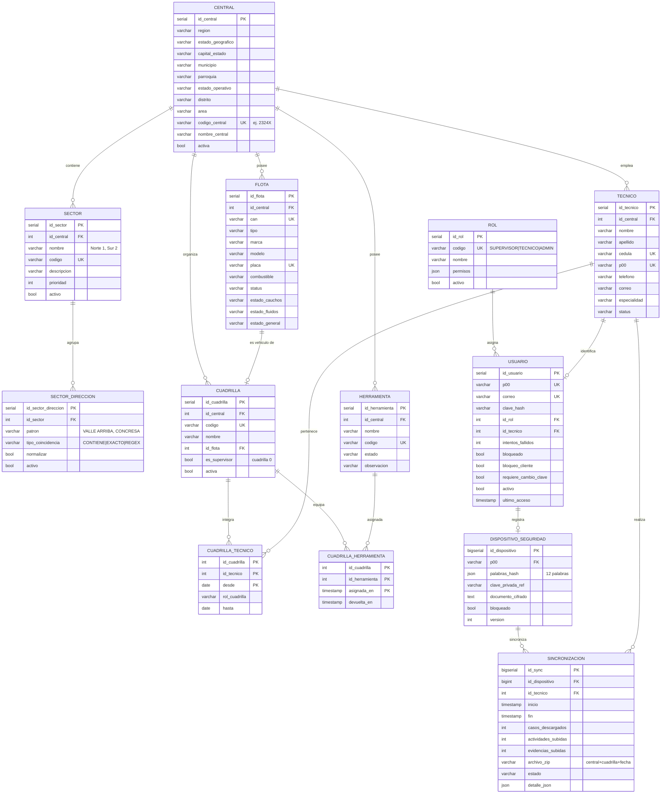
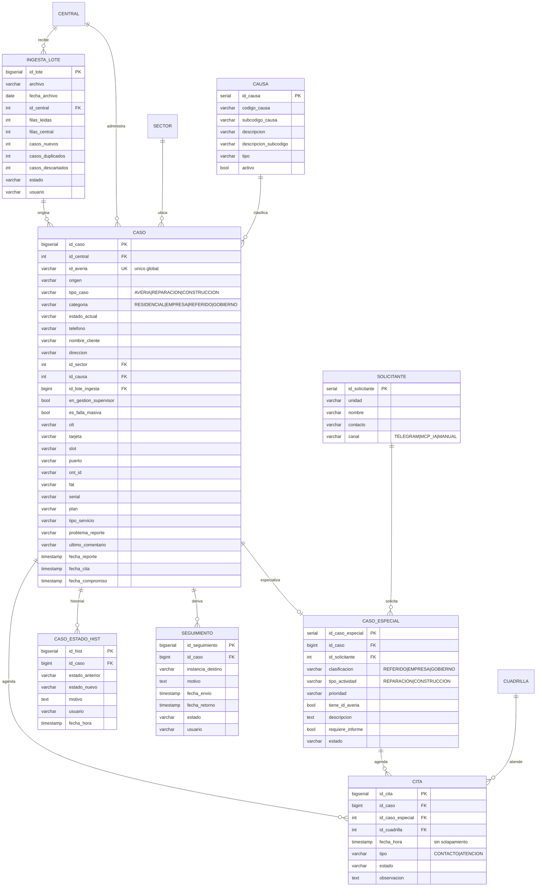
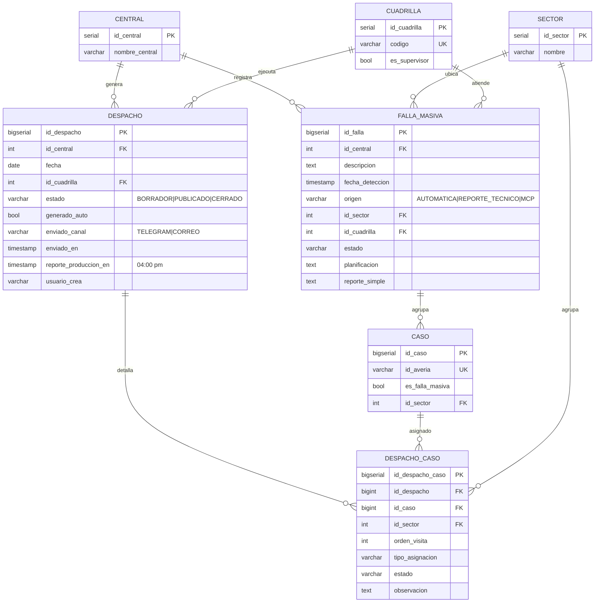
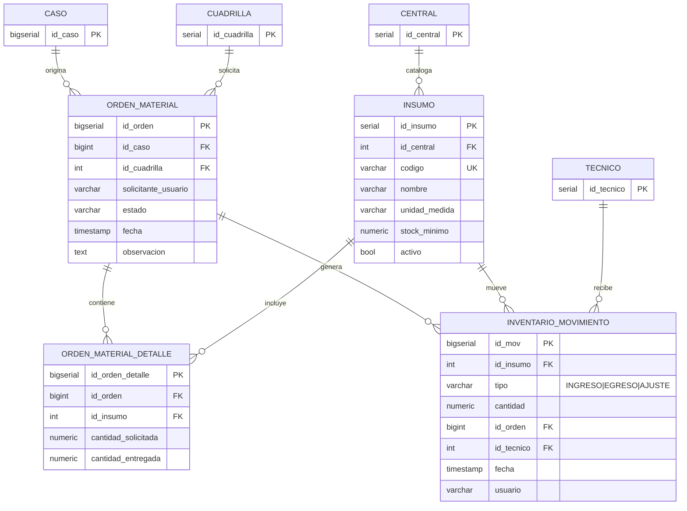
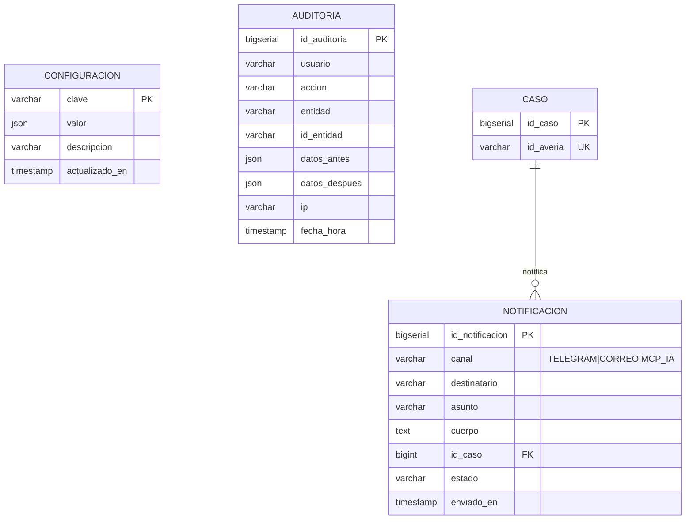

# Modelo Entidad-Relación — Base de Datos GGTO

| Campo | Valor |
|---|---|
| Proyecto | **GGTO** — Gestión de averías y puntos ópticos (CANTV · Francisco Salias / Área 4) |
| Motor | **PostgreSQL** |
| Script DDL | [`db/schema.sql`](db/schema.sql) — se edita a medida del desarrollo |
| Diccionario | [`diccionario_datos.md`](diccionario_datos.md) |
| Fase | Fase 1 — Concepto |
| Estado | Borrador v0.1 |

> Los diagramas usan **Mermaid** (`erDiagram`) y son renderizables en GitLab/GitHub/VS Code.
> Para editar: modificar el bloque y regenerar. El DDL se mantiene sincronizado con estos diagramas.

**Convenciones de tipos (Mermaid no admite paréntesis):**

| Mermaid | PostgreSQL real |
|---|---|
| `serial` / `bigserial` | `serial` / `bigserial` |
| `varchar` | `varchar(n)` según el diccionario |
| `timestamp` | `timestamptz` |
| `numeric` | `numeric(12,2)` / `numeric(10,7)` para GPS |
| `json` | `jsonb` |
| `bool` | `boolean` |

Claves: `PK` primaria · `FK` foránea · `UK` única.

---

## 1. Vista general de relaciones

```mermaid
erDiagram
    ROL            ||--o{ USUARIO : asigna
    TECNICO        ||--o| USUARIO : "da identidad a"
    CENTRAL        ||--o{ SECTOR : contiene
    CENTRAL        ||--o{ TECNICO : emplea
    CENTRAL        ||--o{ FLOTA : posee
    CENTRAL        ||--o{ HERRAMIENTA : posee
    CENTRAL        ||--o{ CUADRILLA : organiza
    CENTRAL        ||--o{ CASO : administra
    CENTRAL        ||--o{ INGESTA_LOTE : recibe
    CENTRAL        ||--o{ INSUMO : cataloga
    SECTOR         ||--o{ SECTOR_DIRECCION : agrupa
    CUADRILLA      ||--o{ CUADRILLA_TECNICO : integra
    CUADRILLA      ||--o{ CUADRILLA_HERRAMIENTA : equipa
    CUADRILLA      ||--o{ DESPACHO : ejecuta
    CUADRILLA      ||--o{ CITA : atiende
    FLOTA          ||--o| CUADRILLA : "es vehiculo de"
    SECTOR         ||--o{ CASO : ubica
    INGESTA_LOTE   ||--o{ CASO : origina
    CAUSA          ||--o{ CASO : clasifica
    CASO           ||--o{ CASO_ESTADO_HIST : historial
    CASO           ||--o{ ACTIVIDAD : registra
    CASO           ||--o{ EVIDENCIA : respalda
    CASO           ||--o{ DESPACHO_CASO : despacha
    CASO           ||--o{ SEGUIMIENTO : deriva
    CASO           ||--o{ CITA : agenda
    CASO           ||--o| CASO_ESPECIAL : especializa
    SOLICITANTE    ||--o{ CASO_ESPECIAL : solicita
    DESPACHO       ||--o{ DESPACHO_CASO : detalla
    ACTIVIDAD      ||--o{ EVIDENCIA : adjunta
    USUARIO        ||--o{ ACTIVIDAD : ejecuta
    USUARIO        ||--o| DISPOSITIVO_SEGURIDAD : registra
    DISPOSITIVO_SEGURIDAD ||--o{ SINCRONIZACION : sincroniza
    TECNICO        ||--o{ SINCRONIZACION : realiza
    ACTIVIDAD      ||--o{ INCIDENTE : reporta
    FLOTA          ||--o{ INCIDENTE : sufre
    HERRAMIENTA    ||--o{ INCIDENTE : sufre
    FALLA_MASIVA   ||--o{ CASO : agrupa
    ORDEN_MATERIAL ||--o{ ORDEN_MATERIAL_DETALLE : contiene
    ORDEN_MATERIAL ||--o{ INVENTARIO_MOVIMIENTO : genera
    INSUMO         ||--o{ ORDEN_MATERIAL_DETALLE : incluye
    INSUMO         ||--o{ INVENTARIO_MOVIMIENTO : mueve
    CATALOGO_METODO ||--o{ ACTIVIDAD : define
    CASO           ||--o{ NOTIFICACION : notifica
```

---

## 2. Núcleo organizacional y seguridad

---

## 3. Casos (averías y solicitudes)

---

## 4. Despacho y fallas masivas

---

## 5. Gestión técnica (app móvil)

```mermaid
erDiagram
    ACTIVIDAD {
        bigserial id_actividad PK
        bigint   id_caso FK
        int      id_usuario FK
        int      id_cuadrilla FK
        varchar  tipo "CONTACTO|CIERRE|ENRUTE|DIFERIDO|INCIDENTE|FALLA_MASIVA"
        varchar  resultado
        text     reporte_corto
        int      id_metodo FK
        int      id_causa FK
        timestamp fecha_hora
        numeric  latitud
        numeric  longitud
        bool     sincronizado
    }
    EVIDENCIA {
        bigserial id_evidencia PK
        bigint   id_actividad FK
        varchar  tipo "POTENCIA|NAVEGACION|DEMO"
        varchar  serial_imagen UK "caso+averia+tipo+fecha"
        varchar  ruta_local
        varchar  ruta_remota
        numeric  latitud
        numeric  longitud
        timestamp fecha_hora
        bool     origen_camara "false = galeria (invalido)"
    }
    INCIDENTE {
        bigserial id_incidente PK
        varchar  tipo "FLOTA|HERRAMIENTA"
        int      id_flota FK
        int      id_herramienta FK
        text     descripcion
        bigint   id_actividad FK
        varchar  estado
    }
    CATALOGO_METODO {
        serial   id_metodo PK
        varchar  dominio "CIERRE|ENRUTE|DIFERIDO|CONTACTO"
        varchar  codigo
        varchar  nombre
        bool     activo
    }
    CAUSA {
        serial   id_causa PK
        varchar  codigo_causa
        varchar  subcodigo_causa
    }
    CASO {
        bigserial id_caso PK
        varchar  id_averia UK
    }
    USUARIO {
        serial   id_usuario PK
        varchar  p00 UK
    }
    CUADRILLA {
        serial   id_cuadrilla PK
        varchar  codigo UK
    }
    FLOTA {
        serial   id_flota PK
        varchar  can UK
    }
    HERRAMIENTA {
        serial   id_herramienta PK
        varchar  codigo UK
    }

    CASO       ||--o{ ACTIVIDAD : registra
    USUARIO    ||--o{ ACTIVIDAD : ejecuta
    CUADRILLA  ||--o{ ACTIVIDAD : pertenece
    CATALOGO_METODO ||--o{ ACTIVIDAD : define
    CAUSA      ||--o{ ACTIVIDAD : justifica
    ACTIVIDAD  ||--o{ EVIDENCIA : adjunta
    ACTIVIDAD  ||--o{ INCIDENTE : reporta
    FLOTA      ||--o{ INCIDENTE : sufre
    HERRAMIENTA ||--o{ INCIDENTE : sufre
```

---

## 6. Insumos (v2)

---

## 7. Soporte y auditoría

---

## 8. Reglas de integridad destacadas

| Regla | Implementación |
|---|---|
| `id_averia` único **global** (P1.3) | `UNIQUE (id_averia)` en `caso`. |
| Sector por coincidencia de dirección (P1.2) | `sector_direccion.patron` + `caso.id_sector`; asignación en la capa de servicio. |
| Una cita no se solapa | Validación en servicio + índice `(id_cuadrilla, fecha_hora)`; `EXCLUDE` con `btree_gist` opcional. |
| Cuadrilla del supervisor = cuadrilla 0 | `cuadrilla.es_supervisor = true` (una por central). |
| Evidencia solo por cámara | `evidencia.origen_camara` debe ser `true`. |
| Despacho único por cuadrilla y día | `UNIQUE (fecha, id_cuadrilla)` en `despacho`. |
| Un caso una vez por despacho | `UNIQUE (id_despacho, id_caso)` en `despacho_caso`. |
| Cita requiere caso o caso especial | `CHECK (id_caso IS NOT NULL OR id_caso_especial IS NOT NULL)`. |
| Incidente requiere flota o herramienta | `CHECK (id_flota IS NOT NULL OR id_herramienta IS NOT NULL)`. |
| `actualizado_en` automático | Trigger `set_actualizado_en()` en las tablas editables. |

---

## 9. Cómo mantener este documento

1. Editar la tabla correspondiente en `db/schema.sql`.
2. Actualizar el bloque Mermaid afectado en este archivo.
3. Verificar que ambos representen las mismas entidades, campos y relaciones.
4. Registrar el cambio en `estado_proyecto.md`.
