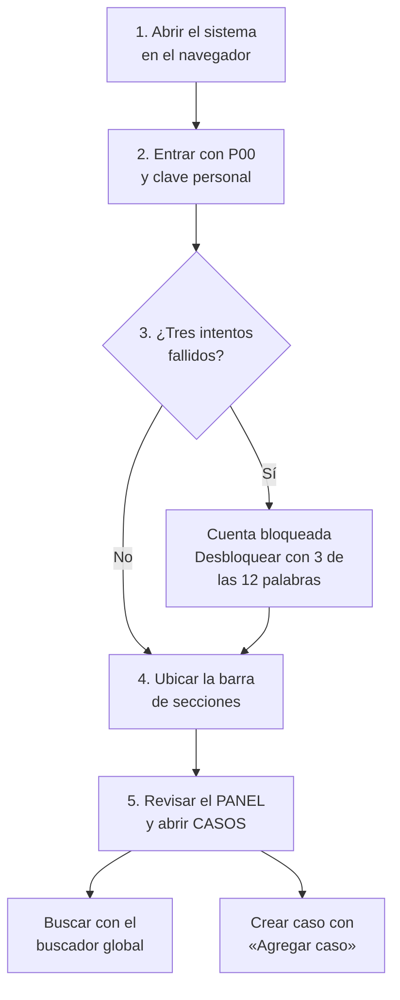
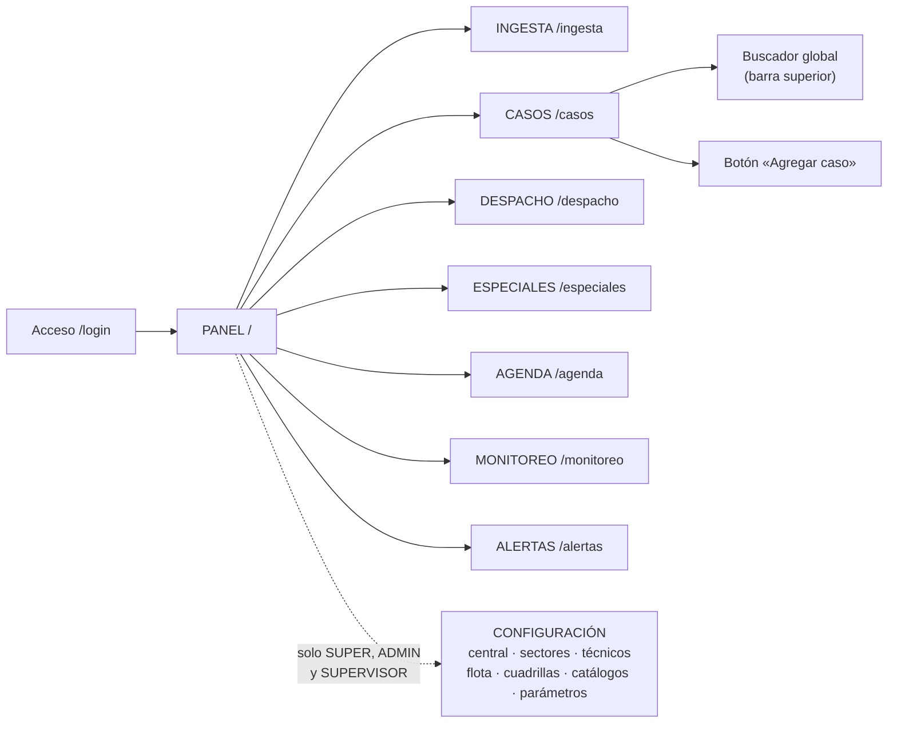
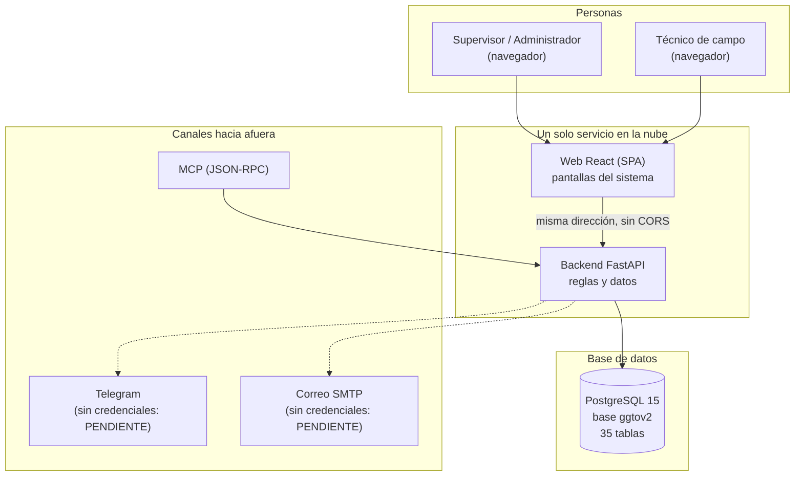
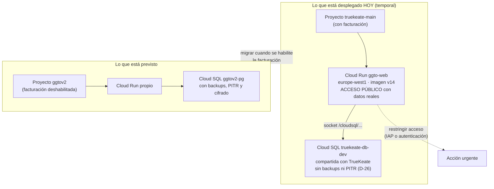

# Plataforma GGTO — Visión general y arquitectura

> Manual para todo público. Explica qué es **GGTO**, para qué sirve y cómo está armado por dentro,
> en lenguaje sencillo. GGTO es el *Sistema de administración de reportes de avería y construcción
> de puntos ópticos* de **CANTV C.A., Central Francisco Salias (Área 4)**. Este manual no promete
> funciones que todavía no existen: cuando algo está pendiente, lo dice con claridad.

## Empezar en 5 minutos

Si es tu primer día con GGTO, con estos cinco pasos ya puedes entrar y ubicarte.

1. **Abre el sistema.** En el navegador (Chrome, Edge o Firefox) entra a la dirección que te dio tu
   supervisor. Verás la pantalla de acceso.
2. **Escribe tu usuario y tu clave.** El usuario es tu **P00** (tu código de personal, por ejemplo
   `P00123`). La clave es la que te entregaron.
3. **Si te equivocas tres veces, la cuenta se bloquea.** No es un error: es una protección. Se
   desbloquea con **3 de tus 12 palabras de seguridad**.
4. **Mira la barra de arriba.** Ahí están las secciones: PANEL, INGESTA, CASOS, DESPACHO,
   ESPECIALES, AGENDA, MONITOREO, ALERTAS y —si tu rol lo permite— CONFIGURACIÓN. También hay un
   **buscador global**.
5. **Empieza por el PANEL.** Es la pantalla de resumen: te dice cuántos casos hay y en qué estado
   están. Desde ahí puedes saltar a CASOS y usar el botón **«Agregar caso»**.

<!-- GENERAR_IMAGEN: onboarding-tecnico.svg -->


## Visión general del sistema

### Propósito y alcance

GGTO administra todo el recorrido de un **reporte de avería GPON** y de una **solicitud de
construcción de puntos ópticos** de la Central Francisco Salias. Dicho de forma simple: entra el
reporte del día, se convierte en casos, se reparten entre cuadrillas, se les hace seguimiento y se
miden los resultados.

La primera versión cubre estas tareas:

- **Acceso seguro** con P00, clave, bloqueo y 12 palabras de seguridad.
- **CONFIGURACIÓN** de todo lo básico: centrales, sectores, técnicos, flota, cuadrillas, catálogos y
  parámetros.
- **INGESTA** del archivo diario de averías en formato CSV.
- **PANEL** y **CASOS** para ver y gestionar las averías.
- **DESPACHO** para repartir el trabajo del día.
- **ESPECIALES** y **AGENDA** para referidos, empresas, gobiernos y citas.
- **MONITOREO** y reportes con gráficos.
- **ALERTAS**, con los canales Telegram, correo y MCP.

El proyecto se apoya en un conjunto formal de requerimientos: **38 RF** (requisitos funcionales, es
decir, lo que el sistema hace), **25 RNF** (requisitos no funcionales: seguridad, rendimiento,
disponibilidad) y **14 RT** (requisitos técnicos).

| Dato | Valor |
|---|---|
| Nombre del producto | GGTO |
| Cliente | CANTV C.A. |
| Central de esta versión | Francisco Salias (Área 4) |
| Nombre técnico del servicio | GGTO API |
| Versión de la aplicación | 0.9.0 |
| Entorno por defecto | development (desarrollo) |
| Zona horaria | America/Caracas |

**Lo que NO existe todavía (no lo busques):**

- **La aplicación móvil Flutter no está desarrollada.** Estaba prevista para el Ciclo 8 y ese ciclo
  quedó pospuesto. No hay APK para instalar en teléfonos.
- **WhatsApp no existe en esta versión.** Se retiró de los requerimientos y quedó reservado para una
  versión futura (v3).
- **Telegram y el correo todavía no envían de verdad.** No tienen credenciales cargadas en
  producción. Los mensajes quedan guardados como **PENDIENTES** en la bandeja de salida del sistema
  (patrón *outbox*). Se enviarán cuando se carguen las credenciales.

### Actores y roles

Estas son las personas y sistemas que usan GGTO:

| ID | Actor | Por dónde entra |
|---|---|---|
| ACT-01 | Supervisor de la central | Web en computadora |
| ACT-02 | Técnico de campo | Web (y, a futuro, móvil y Telegram) |
| ACT-03 | Personal externo solicitante | Telegram o el canal de IA (MCP) |
| ACT-04 | Administrador del sistema | Web en computadora |
| ACT-05 | El propio sistema (automático) | Backend |
| ACT-06 | Integración de IA (WEB-MCP) | MCP sobre la web |

Los roles reales de esta versión son cuatro: **SUPER**, **ADMIN**, **SUPERVISOR** y **TECNICO**. Cada
rol puede leer unas cosas y escribir otras. La tabla completa de qué puede hacer cada rol está en el
manual de autenticación; lo importante aquí es saber que:

- El rol **SUPER** (Super Usuario) puede hacer **todo**, siempre, sin excepción. Es un permiso
  permanente pensado para el control total del sistema.
- Cuando alguien no tiene permiso, el sistema responde con un aviso claro: **401** si la clave o la
  sesión no sirven, y **423** si la cuenta está bloqueada.

Todavía están **pendientes de designar** dos responsables externos: la persona de CANTV que vela por
la protección de datos y el dueño del sistema que entrega el archivo CSV.

### Secciones de la plataforma

La plataforma tiene una pantalla de acceso y varias pantallas internas. Todas las internas piden
haber entrado con usuario y clave. Estas son las direcciones y lo que encontrarás en cada una:

| Dirección | Sección | Para qué sirve |
|---|---|---|
| `/login` | Acceso | Única pantalla pública: entrar al sistema |
| `/` | PANEL | Resumen del día: cuántos casos y cómo están |
| `/ingesta` | INGESTA | Cargar el archivo diario de averías |
| `/casos` | CASOS | Ver, buscar, crear y editar casos |
| `/despacho` | DESPACHO | Repartir el trabajo entre cuadrillas |
| `/especiales` | ESPECIALES | Empresas, referidos y gobiernos |
| `/agenda` | AGENDA | Citas de contacto y atención |
| `/monitoreo` | MONITOREO | Métricas y gráficos de gestión |
| `/alertas` | ALERTAS | Bandeja de notificaciones y fallas |
| `/central` | CONFIGURACIÓN · Central | Datos de la central |
| `/sectores` | CONFIGURACIÓN · Sectores | Zonas de trabajo y sus direcciones |
| `/tecnicos` | CONFIGURACIÓN · Técnicos | Personal técnico |
| `/flota` | CONFIGURACIÓN · Flota | Vehículos |
| `/cuadrillas` | CONFIGURACIÓN · Cuadrillas | Equipos de trabajo, sus integrantes y herramientas |
| `/catalogos` | CONFIGURACIÓN · Catálogos | Causas y métodos |
| `/parametros` | CONFIGURACIÓN · Parámetros | Valores ajustables del sistema |

Dos aclaraciones útiles:

1. **La sección CONFIGURACIÓN solo la ven algunos roles.** El menú de configuración aparece únicamente
   para SUPER, ADMIN y SUPERVISOR. Si entras como TECNICO, no verás ese menú; no es un fallo.
2. **Si escribes una dirección que no existe, el sistema te devuelve al PANEL.** No verás una
   pantalla de error.

Además de esas pantallas, hay módulos que "atraviesan" toda la plataforma sin tener su propio menú:
INGESTA, GESTIÓN AUTOMATIZADA, GESTIÓN TÉCNICA, ALERTAS, SEGURIDAD, INSUMOS (previsto para la
versión 2) y REPORTES.

<!-- GENERAR_IMAGEN: mapa-secciones-plataforma.svg -->


## Arquitectura de componentes

Dicho en palabras sencillas, GGTO tiene cuatro piezas grandes: un **motor** (el backend), una
**pantalla** (la web React), un **almacén** (la base de datos PostgreSQL) y unas **puertas hacia
afuera** (Telegram, correo y MCP). Veamos cada una.

<!-- GENERAR_IMAGEN: arquitectura-general.svg -->


### Backend FastAPI

El backend es el **motor** del sistema. Está hecho en **FastAPI**, una herramienta de Python para
construir servicios web. Su trabajo es recibir cada petición, revisar quién la hace, aplicar las
reglas y devolver la respuesta.

Al arrancar, el sistema anuncia su nombre y su versión usando los datos de configuración: título
`GGTO API`, versión `0.9.0`. Esas mismas reglas se reparten en **diez módulos de rutas**, cada uno
encargado de un tema:

| Módulo | Tema | Cantidad de operaciones |
|---|---|---|
| `routes_health` | Salud del servicio (`/health`, `/ready`) | 4 |
| `routes_auth` | Acceso y sesión | 4 |
| `routes_config` | CONFIGURACIÓN | 31 |
| `routes_ingesta` | INGESTA | 4 |
| `routes_casos` | PANEL y CASOS | 6 |
| `routes_despachos` | DESPACHO | 15 |
| `routes_especiales` | ESPECIALES, AGENDA y seguimiento | 14 |
| `routes_monitoreo` | MONITOREO y reportes | 9 |
| `routes_alertas` | ALERTAS, Telegram y MCP | 11 |

Un dato que conviene entender bien porque aparece en toda la documentación: el sistema habla de
**73 endpoints** (direcciones de la API). En realidad son **73 direcciones** que agrupan **103
operaciones**, porque una misma dirección puede atender varias acciones (por ejemplo, consultar y
crear). Cuando alguien diga "73 endpoints", se refiere a esas 73 direcciones.

### SPA React servida por el mismo contenedor

La parte visual es una **SPA** (*Single Page Application*): una aplicación web que se carga una vez y
luego cambia de pantalla sin recargar el navegador. Está hecha con React y se compila con Vite.

Lo importante para la operación es esto: **la web y el motor viven juntos, en el mismo servicio**.
No son dos servidores separados. Ventajas prácticas:

- Hay **una sola dirección** que recordar.
- No hay problemas de comunicación entre la web y el motor.
- Cuando recargas una pantalla interna (por ejemplo `/monitoreo`), sigue funcionando: el motor
  devuelve la página principal y React decide qué mostrar. A esto se le llama *deep links*.

Si algún día se despliega el motor sin la parte visual, el servicio funciona igual, pero como API
pura, sin pantallas.

### Base de datos PostgreSQL

El **almacén** de GGTO es una base de datos **PostgreSQL**. Guarda todo: usuarios, centrales,
técnicos, cuadrillas, casos, despachos, citas, notificaciones y más. En total son **35 tablas**.

Datos de conexión usuales (los valores reales se cargan por entorno y no se escriben en este
manual):

| Dato | Valor habitual |
|---|---|
| Servidor (`DB_HOST`) | `localhost` en desarrollo; en la nube, un socket de Cloud SQL |
| Puerto (`DB_PORT`) | `5432` |
| Nombre de la base (`DB_NAME`) | `ggtov2` |
| Usuario (`DB_USER`) | `ggtov2_app` |
| Clave (`DB_PASSWORD`) | Vacía por defecto; se inyecta por entorno |
| Seguridad de conexión (`DB_SSLMODE`) | `prefer` en desarrollo; `require` en la nube |
| Esquema (`DB_SCHEMA`) | Vacío = esquema normal; en pruebas se usa `ggto_test` o `ggto_e2e` |

Estado actual de la base en producción:

| Comprobación | Resultado |
|---|---|
| Instancia | `truekeate-db-dev` (PostgreSQL 15.18) |
| Base | `ggtov2` |
| Extensiones | `pgcrypto 1.3`, `pg_trgm 1.6` |
| Seguridad por filas (RLS) | Activa en `caso` y `despacho`, con 2 políticas |
| Disparadores `actualizado_en` | 14 |
| Índices de búsqueda por texto | 2 (dirección de caso y patrones de sector) |
| Datos iniciales | 3 roles, 1 central, 1 cuadrilla, 9 métodos, 13 parámetros, 0 causas |

El detalle de cada tabla está en los manuales de Diccionario de Datos y Diagrama Relacional.

### Canales externos (Telegram, correo SMTP, MCP)

Los canales de notificación de esta versión son **tres**: Telegram, correo (SMTP) y MCP.

El **MCP** es un canal técnico: un servidor JSON-RPC que permite que otras herramientas (por ejemplo,
un asistente de IA) consulten datos de GGTO de forma controlada.

**Lo que hoy funciona y lo que no:**

- **Telegram: no envía todavía.** No hay credenciales cargadas. Cada mensaje queda **PENDIENTE** en
  la bandeja de salida.
- **Correo: tampoco envía todavía.** Mismo motivo.
- **MCP: existe como servicio** y responde si se le presenta la clave correcta.
- **WhatsApp: no existe** en esta versión.

El sistema guarda todo lo que quiere notificar en una **bandeja de salida** (en inglés, *outbox*).
Cuando lleguen las credenciales, esa bandeja se procesa y los mensajes salen. Mientras tanto, nada se
pierde: se acumulan ordenadamente con su estado.

Los parámetros que gobiernan alertas y envíos se guardan en la tabla `configuracion`:

| Clave | Valor inicial | Para qué sirve |
|---|---|---|
| `fallas.activo` | `true` | Activa la detección de fallas masivas |
| `fallas.umbral_casos` | `5` | Cuántos casos juntos cuentan como falla |
| `fallas.ventana_horas` | `24` | Ventana de tiempo para agrupar |
| `fallas.campo_concentracion` | `olt` | Campo por el que se agrupa: `olt`, `fat` o `id_sector` |
| `despacho.destino_telegram` | vacío | Destino del despacho; si está vacío, queda PENDIENTE |
| `outbox.max_intentos` | `5` | Reintentos máximos de un envío |
| `telegram.webhook_secret` | vacío | Clave del webhook de Telegram |
| `mcp.api_key` | vacío | Clave del canal MCP |

La detección de fallas **no se duplica**: mientras una falla siga activa no se genera otra igual. Se
ejecuta automáticamente después de cada carga de CSV y también a mano, cuando se pide.

> **Nunca** se documentan los **valores** de los secretos (claves, tokens, contraseñas). Solo se
> documentan sus nombres: `SECRET_KEY`, `DB_PASSWORD`, `TELEGRAM_BOT_TOKEN`, `SMTP_HOST`,
> `SMTP_PASSWORD` y `MCP_API_KEY`.

## Flujo de una operacion tipica (peticion -> middleware -> router -> servicio -> BD)

Cuando haces clic en algo, tu petición recorre un camino fijo. Conocerlo ayuda a entender los
mensajes de error y a reportar problemas con precisión. Ejemplo: abrir la lista de CASOS.

1. **Entra la petición y se le pone una etiqueta.** El sistema le asigna un **X-Request-ID**: un
   código corto que identifica esa petición concreta. Si tu navegador ya traía uno, lo respeta.
2. **Se mide el tiempo.** El sistema anota la hora de inicio y, al terminar, calcula cuántos
   milisegundos tardó.
3. **Se revisan los permisos de origen (CORS).** Es el control de qué páginas pueden hablar con el
   sistema. Como la web vive en el mismo servicio, casi nunca da problemas.
4. **El router decide quién atiende.** Según la dirección y el método (consultar, crear, editar), el
   sistema elige el módulo correspondiente. Para la lista de casos, es el módulo de CASOS.
5. **Se comprueba el usuario.** El sistema lee tu token de sesión, busca tu usuario por el P00 y
   verifica dos cosas: que estés activo y que no estés bloqueado.
6. **Se validan los datos.** Si escribiste texto de búsqueda o filtros, se revisan antes de usarlos.
   Por ejemplo, el campo `q` busca en avería, teléfono, cliente o dirección.
7. **Se aplican las reglas de negocio.** Aquí viven la sectorización, los cálculos y las
   validaciones. Estas reglas están en la carpeta de servicios del sistema.
8. **Se consulta la base de datos.** Se piden los datos a PostgreSQL.
9. **Se arma la respuesta.** El sistema le agrega datos útiles calculados (por ejemplo, el nombre
   del sector y los iconos de estado) y valida el formato.
10. **Sale la respuesta.** Se devuelve con su etiqueta X-Request-ID y queda registrada una línea en
    el registro del sistema con el código y el tiempo.

Para las acciones que **escriben** (crear o editar) hay un paso extra antes de las reglas: la
**autorización**. Si tu rol no tiene permiso, recibirás un aviso en vez de un cambio.

Resumen visual del camino:

```
Tu navegador  →  Internet seguro  →  Etiqueta X-Request-ID
              →  Control de origen (CORS)
              →  Router del sistema  →  Verificación de usuario y permisos
              →  Reglas de negocio  →  Consulta a PostgreSQL
              →  Respuesta ordenada  →  Pantalla
```

## Despliegue en GCP

GCP es la nube de Google donde vive el sistema. Estas secciones explican dónde está alojado hoy y qué
riesgos hay que conocer.

### Proyecto ggtov2 y bloqueo de facturacion

El proyecto previsto para GGTO se llama **`ggtov2`**. El problema es que su **facturación está
deshabilitada**: se agotó el cupo de 5 proyectos y, sin facturación, no se pueden activar los
servicios necesarios (Cloud Run, Artifact Registry, Cloud Build, Secret Manager), ni crear recursos
propios.

**Plan cuando se habilite la facturación:**

1. Migrar el servicio al proyecto `ggtov2`.
2. Usar su propia base de datos `ggtov2-pg`.
3. Configurarla con copias de seguridad, recuperación a un punto en el tiempo (PITR) y conexión
   cifrada obligatoria (`ENCRYPTED_ONLY`).

Mientras eso no ocurra, el sistema vive en **otro proyecto**. Este es un dato central: cualquier
persona nueva debe saber que el despliegue actual es **temporal**.

### Servicio Cloud Run ggto-web en truekeate-main

El sistema está alojado temporalmente en el proyecto **`truekeate-main`**, que sí tiene facturación.

| Dato | Valor |
|---|---|
| Servicio | Cloud Run `ggto-web` |
| Región | `europe-west1` |
| Dirección principal | `https://ggto-web-593453426217.europe-west1.run.app` |
| Dirección alternativa | `https://ggto-web-m33mjctj4a-ew.a.run.app` |
| Cuenta de servicio | `ggto-web-sa@truekeate-main.iam.gserviceaccount.com` |
| Imagen (última documentada) | `.../truekeate-repo/ggto-web:v14` |
| Revisión (última documentada) | `ggto-web-00014-zqx` |

La imagen del sistema es **multi-etapa**: primero Node compila la parte visual y después Python la
sirve junto con el motor. La cuenta de servicio tiene permiso para conectarse a la base de datos y
para leer los secretos `ggtov2-db-password` y `ggto-secret-key`.

Historial de versiones desplegadas (es una **línea de tiempo histórica**; la versión vigente es la
que confirme el operador en la consola):

| Revisión | Imagen | Hito |
|---|---|---|
| `ggto-web-00002-rbl` | v2 | Ciclo 1 — núcleo y autenticación |
| `ggto-web-00003-6zb` | v3 | Ciclo 2 — CONFIGURACIÓN |
| `ggto-web-00004-cj9` | v4 | Ciclo 3 — INGESTA CSV |
| `ggto-web-00005-rxm` | v5 | Ciclo 4 — PANEL y CASOS |
| `ggto-web-00006-htl` | v6 | Super Usuario con acceso total |
| `ggto-web-00007-vsr` | v7 | Ciclo 5 — DESPACHO |
| `ggto-web-00008-vr5` | v8 | Ciclo 6 — ESPECIALES y AGENDA |
| `ggto-web-00009-fvc` | v9 | Ciclo 7 — MONITOREO y reportes |
| `ggto-web-00014-zqx` | v14 | Ciclo 9 — ALERTAS, Telegram y MCP |

> Entre la v9 y la v14 hubo hitos intermedios (por ejemplo, el rediseño de navegación de la decisión
> D-57). Para saber qué versión está activa **hoy**, consúltalo en la consola de Google: es un dato
> que cambia y no se puede dar por fijo en un manual.

Los **scripts** de instalación en la nube están en la carpeta `RepoTecnico/scripts/`. Se ejecutan en
orden, del `00` al `10`, y existe un orquestador que los coordina. El manual de scripts GCP los
explica uno por uno.

### Cloud SQL compartida truekeate-db-dev

La base de datos de GGTO **comparte servidor** con otro producto llamado TrueKeate. La instancia es
`truekeate-db-dev` (PostgreSQL 15.18), con la base `ggtov2` y el usuario `ggtov2_app`. Compartir
servidor tiene consecuencias, como se explica en los riesgos más abajo.

En la nube, la aplicación se conecta por un **socket** (una vía interna de comunicación). Por eso la
dirección del servidor no es una IP sino una ruta que empieza por `/cloudsql/`. La conexión
documentada es:

```dotenv
DB_HOST=/cloudsql/truekeate-main:southamerica-east1:truekeate-db-dev
DB_PORT=5432
DB_NAME=ggtov2
DB_USER=ggtov2_app
DB_PASSWORD=<desde Secret Manager: ggtov2-db-password>
DB_SSLMODE=require
```

**Modo de pruebas:** existe una variable llamada `DB_SCHEMA` que permite trabajar en un "cajón"
separado dentro de la misma base. Se usan dos:

- `ggto_test` → para las pruebas automáticas de Python (pytest).
- `ggto_e2e` → para las pruebas de navegador (Playwright).

Nunca se apunta a datos de producción durante las pruebas.

### Pendientes y riesgos (D-26, acceso publico con PII)

Hay dos riesgos abiertos que **toda persona que cargue datos debe conocer**.

**Riesgo D-26 — la instancia compartida no tiene copias de seguridad ni cifrado obligatorio.** Se
decidió *aceptar* este riesgo y no tocar la configuración, porque la instancia es compartida con
TrueKeate. El cierre previsto es migrar a `ggtov2-pg` con copias, PITR y cifrado cuando se habilite
la facturación. La decisión incluye una instrucción operativa explícita: **no cargar datos reales
hasta que se migre.** Esto incumple el requisito RNF-16 (copia de seguridad con recuperación en
menos de 24 horas y restauración en menos de 4 horas).

**Riesgo de acceso público con datos personales.** El servicio Cloud Run está abierto a **cualquier
persona** (`allUsers`) y contiene **datos personales reales** de suscriptores (hay 1 lote cargado con
**42 casos reales**). Esto **debe restringirse** antes de usar el sistema en producción. La
mitigación prevista es exigir autenticación para entrar (IAP o invocación autenticada) y evaluar el
traslado a una instancia con respaldo.

| Riesgo | Qué significa | Estado | Cómo se piensa resolver |
|---|---|---|---|
| D-26 | Sin copias de seguridad, PITR ni cifrado obligatorio | Aceptado por la Dirección | Migrar a `ggtov2-pg` al habilitar facturación |
| Acceso público | Cualquiera puede entrar y hay datos personales reales (42 casos) | Abierto | Restringir con IAP o exigir autenticación **antes** de producción |
| Facturación `ggtov2` | Facturación deshabilitada, sin servicios de despliegue | Bloqueado | Liberar cupo y migrar el servicio |
| Credenciales de canales | Telegram y correo sin credenciales | Diferido | Cargar secretos y procesar la bandeja de salida |
| Contrato de la interfaz CSV | El documento de la interfaz no está firmado | Pendiente de CANTV | Firma de la decisión D-41 |

**Todas las cifras y versiones de esta sección deben confirmarse en la consola de Google antes de
usarlas para una decisión.** Lo que no se pueda comprobar se reporta como *pendiente de confirmar*.

<!-- GENERAR_IMAGEN: despliegue-gcp.svg -->

