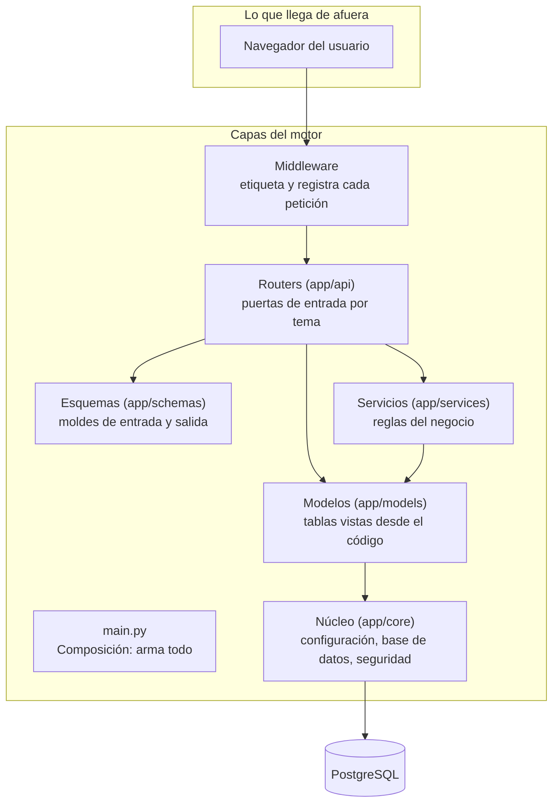
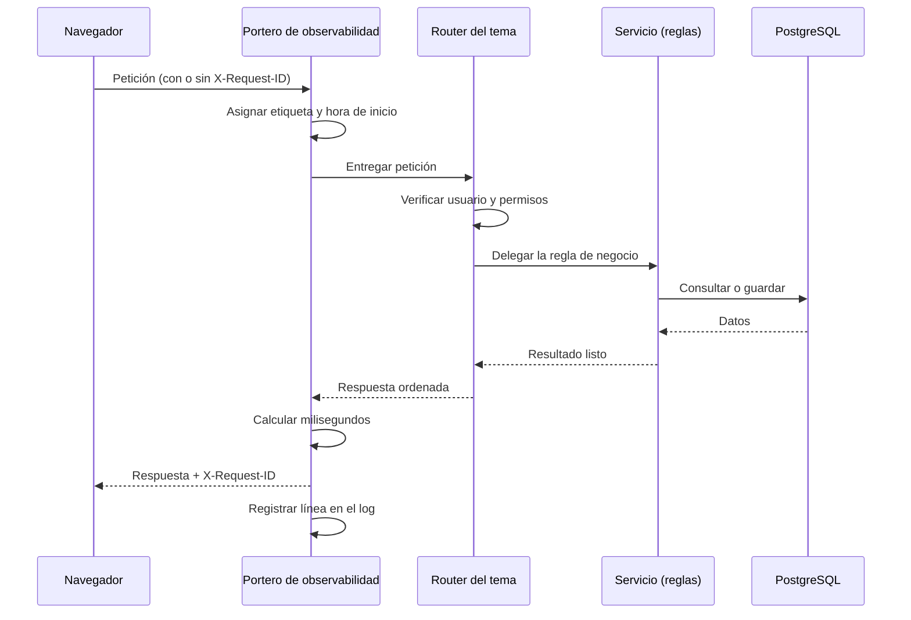

# Stack del backend GGTO

> Manual para todo público. Explica con palabras sencillas **con qué está hecho el motor de GGTO**,
> cómo está organizado por dentro y qué se puede configurar. El "backend" es la parte del sistema que
> no se ve: recibe las órdenes de la pantalla, aplica las reglas y guarda los datos.

## Empezar en 5 minutos

El motor del sistema no se maneja a mano: funciona solo cuando el servicio está encendido. Aun así,
estos cinco datos te ayudan a entenderlo y a conversar con el equipo técnico.

1. **El motor está hecho en Python.** La versión es **Python 3.12** y la herramienta web se llama
   **FastAPI**. No necesitas instalar nada para usarlo.
2. **La pantalla y el motor van juntos.** Se encienden y se apagan como un solo servicio, así que si
   ves la web, el motor está funcionando.
3. **Todo lo que ves viene de una base de datos PostgreSQL.** El motor solo pide y guarda datos; las
   reglas del negocio están escritas en el motor.
4. **El motor está ordenado en capas:** puertas de entrada (rutas), contratos de datos (esquemas),
   reglas (servicios), tablas (modelos) y piezas base (núcleo). Si algo falla, el equipo técnico
   revisa la capa que corresponde.
5. **Dos direcciones para revisar si está sano:** `/health` (¿está vivo?) y `/ready` (¿está listo
   para atender?). Ambas responden sin necesidad de usuario y clave.

## Stack del backend

### Python y FastAPI

El motor está escrito en **Python 3.12** y usa **FastAPI**. En el entorno donde se verificó el
sistema, las versiones eran:

| Pieza | Versión verificada |
|---|---|
| Python | 3.12.3 |
| FastAPI | 0.141.1 |
| Starlette (capa interna) | 1.7.0 |

FastAPI aporta tres cosas que el sistema aprovecha todo el tiempo:

1. **Entrega automática de datos.** Al atender una petición, el motor "inyecta" lo que hace falta: la
   conexión a la base de datos y el usuario que está haciendo la consulta.
2. **Revisión de formatos.** Antes de responder, valida que los datos tengan la forma correcta. Si no
   la tienen, avisa con un error claro.
3. **Documentación automática.** El sistema publica su propia documentación en la dirección `/docs`.

El servidor que mantiene el motor encendido (*Uvicorn*) escucha en el puerto **8000** durante el
desarrollo. En la nube, el comando exacto de arranque está **pendiente de confirmar** contra el
archivo de construcción del contenedor.

Un detalle importante sobre las versiones: el archivo `app/requirements.txt` **no fija versiones**;
solo lista los nombres de los paquetes. Las versiones de esta tabla provienen del entorno verificado,
no de una orden escrita en el repositorio. Por eso, al reinstalar desde cero, es posible que aparezcan
versiones distintas.

Paquetes principales y para qué sirve cada uno:

| Paquete | Para qué sirve |
|---|---|
| `fastapi` | Atender las peticiones web |
| `uvicorn[standard]` | Mantener el motor encendido |
| `sqlalchemy` | Hablar con la base de datos |
| `psycopg2-binary` | Conectar con PostgreSQL |
| `pydantic-settings` | Leer la configuración del entorno |
| `argon2-cffi` | Proteger claves y palabras (cifrado fuerte) |
| `PyJWT` | Crear y validar el pase de sesión (token) |
| `python-multipart` | Recibir archivos, como el CSV de INGESTA |

Herramientas de desarrollo: `pytest` (pruebas), `httpx` (cliente de pruebas), `ruff` (estilo de
código) y `mypy` (revisión de tipos). Las pruebas automáticas corren en GitHub Actions con Python
3.12 cuando alguien sube cambios a las ramas `GGTOv2-DSH-GCP` o `main`.

### SQLAlchemy 2.x y psycopg2

Para hablar con la base de datos, el motor usa **SQLAlchemy 2.1.1** (versión verificada) junto con
**psycopg2-binary 2.9.13**. SQLAlchemy es el "traductor" entre el código y las tablas.

El archivo que concentra esta conexión es `app/core/db.py`. Hace lo siguiente:

- Define la **base** común de todos los modelos (la plantilla de las tablas).
- Construye la **dirección de conexión** en tres modalidades: por socket interno de la nube, por red
  normal (TCP) o con un esquema alternativo para pruebas.
- Crea el **motor** con una configuración pensada para no caerse: revisa la conexión antes de usarla
  (`pool_pre_ping`) y mantiene hasta 5 conexiones normales más 5 de reserva.
- Entrega **una sesión por petición** y la cierra siempre al terminar. Así no quedan conexiones
  abiertas.

Los modelos (las tablas vistas desde el código) se agrupan por tema:

| Archivo | Qué contiene | Ciclo |
|---|---|---|
| `entities.py` | Central, Rol, Usuario, Técnico, Dispositivo de seguridad | Ciclo 1 |
| `config_entities.py` | Catálogos, causas, parámetros, cuadrillas, flota, sectores | Ciclo 2 |
| `caso_entities.py` | Caso, historial de estados, lote de ingesta | Ciclos 3-4 |
| `despacho_entities.py` | Despacho, casos del despacho, asignación diaria de sectores (`cuadrilla_sector_dia`), falla masiva, notificación | Ciclo 5 / D-66 |
| `especiales_entities.py` | Casos especiales, citas, seguimiento, solicitantes | Ciclo 6 |
| `insumos_entities.py` | Orden de material | Versión 2 |

El mapeo es **manual y explícito**: cada modelo declara con precisión el tipo y el tamaño de sus
columnas. No hay "magia" que adivine la estructura.

> Importante: en el estado actual, los cambios de estructura de la base **no** se aplican con la
> herramienta de migraciones Alembic. Se aplican con el script `RepoTecnico/db/schema.sql`. El uso de
> Alembic está **pendiente de confirmar**.

### Pydantic v2 y pydantic-settings

El motor usa **Pydantic 2.13.5** para definir la forma exacta de los datos que entran y salen, y
**pydantic-settings 2.15.0** para leer la configuración del entorno.

Los "esquemas" (los moldes de datos) están separados por tema:

| Archivo | Tema |
|---|---|
| `schemas/auth.py` | Acceso, token, usuario, desbloqueo |
| `schemas/config.py` | Central, sectores, técnicos, flota, cuadrillas, catálogos, parámetros |
| `schemas/ingesta.py` | Resumen y lote de INGESTA |
| `schemas/casos.py` | Caso, lista de casos, historial |
| `schemas/despacho.py` | Propuesta, despacho, reportes, notificaciones |
| `schemas/especiales.py` | Solicitantes, casos especiales, citas, seguimiento |
| `schemas/alertas.py` | Fallas masivas, notificaciones, métricas, MCP |

Cada esquema sigue un patrón de cuatro piezas: **base** (lo común), **create** (para crear),
**update** (para editar) y **out** (para mostrar). Por ejemplo, el esquema de Central declara once
campos con su longitud máxima, y el de creación lo reutiliza sin cambios.

La configuración del entorno funciona así: el sistema busca un archivo `.env`; si existe, lo lee, y
si no, usa valores por defecto. Las variables no declaradas se ignoran y los nombres no distinguen
mayúsculas de minúsculas. La configuración se lee **una sola vez** por proceso, para no repetir
trabajo.

### Uvicorn

**Uvicorn 0.54.0** es el servidor que mantiene el motor encendido y escuchando. En el contenedor de
la nube, la imagen se construye en dos etapas: primero se compila la parte visual con Node y después
Python la sirve. El comando exacto del contenedor (y cuántos procesos usa) está **pendiente de
confirmar** contra el archivo de construcción, que no forma parte de este manual.

En desarrollo, el reparto de puertos es:

- La web de desarrollo escucha en el puerto **5173**.
- El motor escucha en el puerto **8000**.
- Todo lo que empieza por `/api` se reenvía del 5173 al 8000 automáticamente.

Para comprobar que el motor arrancó bien, se consultan `/health` y `/ready`.

## Organizacion en capas

El motor está ordenado como una casa: cada cosa en su sitio. Estas son las "habitaciones".

<!-- GENERAR_IMAGEN: capas-backend.svg -->

### app/main.py (composicion)

`app/main.py` es el **armador** del sistema. No tiene reglas de negocio: solo arma las piezas en el
orden correcto. Sus tareas, en orden, son:

1. Configurar el registro de actividad (*logs*).
2. Leer la configuración.
3. Crear la aplicación web.
4. Registrar el middleware que etiqueta y mide cada petición.
5. Registrar el control de origen (CORS).
6. Conectar los nueve conjuntos de rutas.
7. Montar la parte visual **al final**, para no tapar las direcciones del motor.

El archivo tiene 105 líneas y no importa modelos ni servicios de negocio: solo rutas y configuración.

### Routers (app/api)

Los *routers* son las **puertas de entrada**. Cada uno atiende un tema. Están en la carpeta `app/api/`:

| Archivo | Tema | Operaciones |
|---|---|---|
| `routes_alertas.py` | ALERTAS, Telegram y MCP | 11 |
| `routes_auth.py` | Acceso y sesión | 5 |
| `routes_casos.py` | PANEL y CASOS | 6 |
| `routes_config.py` | CONFIGURACIÓN | 35 |
| `routes_despachos.py` | DESPACHO | 18 |
| `routes_especiales.py` | ESPECIALES, AGENDA y seguimiento | 14 |
| `routes_health.py` | Salud del servicio | 4 |
| `routes_ingesta.py` | INGESTA | 5 |
| `routes_monitoreo.py` | MONITOREO y reportes | 9 |
| `deps.py` | Piezas compartidas (verificar usuario) | — |

La regla de oro de un router es: **valida, autoriza, delega y responde**. No debería contener reglas
de negocio complicadas. Cuando hay una función auxiliar propia de ese tema, se deja en el mismo
archivo, con un nombre que empieza por guion bajo.

### Esquemas (app/schemas)

Los esquemas Pydantic son a la vez el **contrato** de la API y el **espejo** de la web: lo que el
motor declara, la pantalla lo espera igual. Por ejemplo, la interfaz de usuario de TypeScript declara
los mismos campos que devuelve el acceso: `p00`, `correo`, `rol`, `id_rol`, `id_central`, `nombre` y
`apellido`. La correspondencia se mantiene a mano, así que cuando se agrega un campo hay que
actualizar los dos lados.

### Servicios (app/services)

La carpeta `app/services/` guarda las **reglas del negocio**. Es la parte "pensante" del sistema:

| Módulo | Responsabilidad |
|---|---|
| `ingesta.py` | Leer y cargar el CSV diario (define las columnas) |
| `sectorizacion.py` | Decidir a qué sector pertenece una dirección |
| `cuadrilla0.py` | Aplicar el criterio de "cuadrilla 0" |
| `despacho.py` | Armar el despacho por sectores y la asignación diaria de cuadrillas |
| `fallas.py` | Detectar fallas masivas por concentración |
| `notificaciones.py` | Componer los mensajes y elegir el canal |
| `outbox.py` | Bandeja de salida con reintentos |
| `monitoreo.py` | Calcular métricas y reportes |
| `consultas.py` | Consultas auxiliares de CONFIGURACIÓN |

La convención es sencilla: cada servicio recibe la conexión a la base de datos como primer dato y
devuelve información lista para mostrar. No depende de FastAPI, así que se puede probar por separado.

### Modelos (app/models)

Los modelos son las **tablas vistas desde el código**. Se agrupan por tema y se reexportan en un solo
punto, para que las rutas siempre importen desde el mismo lugar. Así, si mañana se reorganizan los
archivos, nada se rompe.

### Nucleo (app/core)

La carpeta `app/core/` guarda las piezas de base. Tiene cuatro módulos:

| Módulo | Qué contiene |
|---|---|
| `config.py` | La configuración y su lectura |
| `db.py` | La conexión a PostgreSQL y la sesión por petición |
| `security.py` | Cifrado de claves, token de sesión y normalización de palabras |
| `words.py` | El diccionario de palabras de seguridad |

Regla importante de diseño: el núcleo **no depende** de las rutas ni de los servicios. La dependencia
va en un solo sentido, de afuera hacia adentro. Eso evita enredos.

## Middleware y observabilidad

Los *middleware* son "porteros" por los que pasa **toda** petición antes de llegar a su destino.

### ObservabilidadMiddleware y X-Request-ID (RNF-19) (app/main.py:49-68)

Este portero tiene un solo objetivo: **poder rastrear cualquier petición**. Para eso:

1. Toma la etiqueta `X-Request-ID` que venga; si no viene, genera una nueva de 12 caracteres.
2. Anota la hora de inicio.
3. Ejecuta la petición. Si algo falla, registra el error con la etiqueta, el método y la ruta, y
   deja que el error siga su curso.
4. Calcula cuántos milisegundos tardó.
5. Escribe la etiqueta en la respuesta.
6. Registra una línea con etiqueta, método, ruta, código de respuesta y milisegundos.

<!-- GENERAR_IMAGEN: flujo-peticion-backend.svg -->

Gracias a esto, cuando reportes un problema puedes dar la etiqueta X-Request-ID y el equipo técnico
encontrará exactamente qué pasó. El requisito RNF-19 pide justamente eso: registros con etiqueta de
petición y usuario en todas las operaciones, además de `/health`, `/ready`, métricas de negocio y
conservación de registros por al menos 30 días. Las métricas de negocio se consultan en
`GET /api/v1/metricas`.

### CORS (app/main.py:69-75)

CORS es el control de **qué páginas pueden hablar con el motor**. La configuración permite:

- Los orígenes de la lista `CORS_ORIGINS` (separados por comas).
- Enviar credenciales.
- Cualquier método y cualquier cabecera.

El valor por defecto es `*` (todos), lo que en la práctica significa "sin restricción".

> **Advertencia:** dejar `*` junto con credenciales no funciona bien en los navegadores. Como en este
> sistema la web y el motor viven juntos, lo recomendable es escribir la lista de orígenes reales. El
> valor efectivamente desplegado está **pendiente de confirmar**.

### Logging (app/main.py:32-34)

El registro de actividad se configura una sola vez, al encender el motor. Todos los mensajes quedan
etiquetados con el nombre `ggto`, lo que facilita filtrarlos en la consola de la nube.

| Elemento | Valor |
|---|---|
| Nivel | `INFO` |
| Formato | fecha y hora, nivel, nombre y mensaje |
| Nombre del registro | `ggto` |
| Datos de cada petición | etiqueta, método, ruta, código y milisegundos |

## Configuracion por entorno (app/core/config.py:8-47)

La configuración se declara en una clase y se lee una sola vez. Se agrupa en cuatro bloques:
Aplicación, Base de datos, Seguridad y CORS.

| Bloque | Variable | Valor por defecto | Qué significa |
|---|---|---|---|
| Aplicación | `app_name` | `GGTO API` | Nombre del servicio |
| Aplicación | `app_env` | `development` | Entorno actual |
| Aplicación | `app_version` | `0.9.0` | Versión |
| Aplicación | `app_timezone` | `America/Caracas` | Zona horaria |
| Base de datos | `db_host` | `localhost` | Servidor |
| Base de datos | `db_port` | `5432` | Puerto |
| Base de datos | `db_name` | `ggtov2` | Nombre de la base |
| Base de datos | `db_user` | `ggtov2_app` | Usuario |
| Base de datos | `db_password` | vacío | Clave (se inyecta por entorno) |
| Base de datos | `db_sslmode` | `prefer` | Cifrado de la conexión |
| Base de datos | `db_schema` | vacío | Esquema alternativo (pruebas) |
| Seguridad | `secret_key` | marcador | Clave de firma; **debe cambiarse** |
| Seguridad | `jwt_algorithm` | `HS256` | Algoritmo del pase de sesión |
| Seguridad | `access_token_minutes` | `480` | Duración de la sesión (8 horas) |
| Seguridad | `max_intentos` | `3` | Intentos antes del bloqueo |
| Seguridad | `palabras_seguridad` | `12` | Palabras que se generan |
| Seguridad | `palabras_requeridas` | `3` | Palabras para desbloquear |
| Seguridad | `rate_limit_intentos` | `10` | Intentos permitidos por ventana |
| Seguridad | `rate_limit_ventana_seg` | `60` | Duración de la ventana (segundos) |
| CORS | `cors_origins` | `*` | Orígenes permitidos |

Notas de operación:

1. **`secret_key`** trae un valor de ejemplo. En producción **debe** sustituirse. El valor real vive
   en el gestor de secretos; aquí solo se documenta su nombre.
2. Las reglas de acceso de RF-20 se reflejan aquí: **3 intentos**, **12 palabras** generadas y **3
   requeridas** para desbloquear.
3. El límite de intentos de RNF-22 es de **10 intentos cada 60 segundos** y se revisa al comenzar el
   acceso.
4. La sesión dura **480 minutos**, es decir, una jornada completa de 8 horas.
5. El archivo `.env` es opcional. Si no existe, se usan los valores por defecto.

## Montaje de la SPA y deep links (app/main.py:91-105)

La parte visual se monta **al final**, y hay una razón: si se montara antes, taparía las direcciones
del motor. Como se monta después, primero se atienden las rutas de la API y solo lo que no es API cae
en la web.

El mecanismo de *deep links* resuelve un problema cotidiano: si recargas la página estando en
`/monitoreo` o abres directamente `/casos/123`, el motor no encuentra ese archivo y entonces devuelve
la página principal de la aplicación. React se encarga de mostrar la pantalla correcta.

| Elemento | Valor |
|---|---|
| Clase especial | `SPAStaticFiles` |
| Cuándo devuelve la página principal | Cuando el archivo no existe (error 404) |
| Documento que devuelve | `index.html` |
| Carpeta de la web compilada | `app/web/dist` |
| Cuándo se monta | Solo si la carpeta existe |

Consecuencia práctica: **los enlaces internos se pueden compartir y recargar sin problema**. Y si el
servicio se despliega sin la carpeta de la web, funciona como API pura sin fallar al arrancar.
