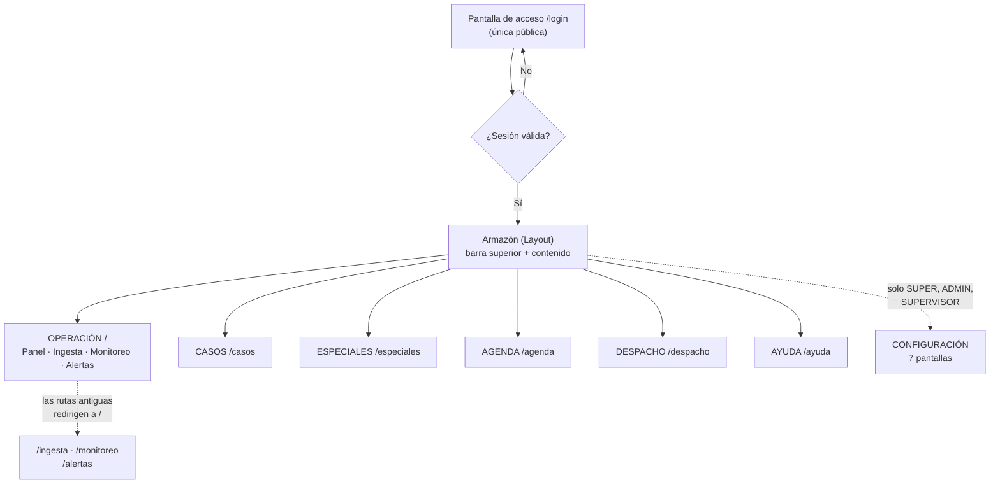
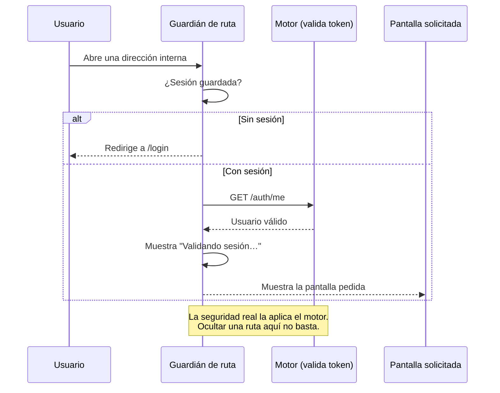

# Stack del frontend GGTO (SPA React)

> Manual para todo público. Explica con palabras sencillas **cómo está hecha la parte visual** de
> GGTO: las pantallas que ves en el navegador, cómo se protegen y cómo se construyen. No necesitas
> saber programar para leerlo.

## Empezar en 5 minutos

1. **La web se abre en el navegador.** No hay que instalar nada. Se entra por la dirección del
   sistema y aparece la pantalla de acceso.
2. **El sistema pide usuario y clave una sola vez.** Después de entrar, la sesión dura **8 horas**
   (una jornada). Si cierras el navegador o recargas, la sesión sigue viva mientras no expire.
3. **Todos los botones de la barra superior te llevan a una sección.** Son **seis** y están siempre
   visibles: **OPERACIÓN**, CASOS, ESPECIALES, AGENDA, DESPACHO y **AYUDA**. CONFIGURACIÓN aparece
   solo para SUPER, ADMIN y SUPERVISOR.
4. **OPERACIÓN reúne cuatro pantallas en una sola.** Es la primera sección y muestra, una debajo de
   otra: el **Panel** (resumen y búsqueda rápida), la **Ingesta** (carga de archivos), el **Monitoreo**
   (tablero y gráficos) y las **Alertas**. Arriba hay cuatro enlaces —Panel, Ingesta, Monitoreo y
   Alertas— para saltar directo a cada parte. Los enlaces antiguos `/ingesta`, `/monitoreo` y
   `/alertas` siguen funcionando: ahora te traen a OPERACIÓN.
5. **La barra se adapta a tu pantalla.** En una computadora (pantalla grande) ves **solo los nombres**
   de las secciones. En un teléfono o pantalla angosta (hasta 768 puntos de ancho) ves **solo los
   iconos**, para que todo quepa.
6. **Los formularios y las fichas se abren en una ventana flotante grande.** Cuando agregas o editas
   algo, o cuando abres el detalle de un registro, aparece una ventana que ocupa el **90 % de la
   pantalla**, con el título arriba y una **X** para cerrar. También puedes cerrarla con la tecla
   **Escape** o haciendo clic fuera de la ventana. Si el contenido es largo, la ventana tiene su
   propia barra de desplazamiento.
7. **La ficha rápida muestra la información en pestañas.** Cuando buscas un caso por su avería o su
   teléfono —desde el Panel o desde el buscador de la barra de arriba— se abre la **ficha rápida**:
   una ventana grande con el cuadro de búsqueda **al lado del título** y cuatro pestañas: **Actual**
   (asignación, último comentario y fecha de ingreso), **Estado** (estado, fechas y bitácora),
   **Contacto** (cliente, teléfono y dirección) y **Técnico** (reparador, ayudantes, cuadrilla, flota
   y datos técnicos).
8. **Los filtros de las tablas van en una sola fila.** Todos los filtros de un listado se alinean en
   una sola línea, a lo ancho de la tabla. Si en tu pantalla no caben, la fila se desplaza hacia los
   lados en lugar de partirse en varias líneas. En **CASOS** ya no existen el filtro **Origen** ni el
   rango de fechas («Reporte desde» y «Reporte hasta»): quedan Texto libre, Estado, Clase, Tipo y
   Cuadrilla 0.
9. **Las tablas son más anchas y muestran el total.** Cada listado ocupa el **90 % del ancho** de la
   pantalla y, al final, trae una franja con el **total de registros** que se están mostrando (por
   ejemplo, «Total: 12 casos»). Si todavía está cargando, dice «Cargando…».
10. **Si tu rol es TECNICO, el sistema se pone en modo solo lectura.** Verás un aviso permanente y el
    botón **«Agregar caso»** quedará deshabilitado. Puedes consultar, pero no modificar.
11. **Puedes compartir enlaces internos.** Si copias la dirección de una pantalla (por ejemplo
    `/casos`) y la abres en otra pestaña, funciona igual.

<!-- GENERAR_IMAGEN: mapa-pantallas-spa.svg -->


## Stack de la SPA

Una **SPA** (*Single Page Application*) es una web que se carga una vez y luego cambia de pantalla sin
recargar. La de GGTO está hecha con **React 18** y **TypeScript**.

### React 18 y TypeScript

React es la herramienta con la que se construyen las pantallas. TypeScript es la versión "con
controles" del lenguaje: obliga a declarar qué tipo de dato es cada cosa, y así se evitan muchos
errores antes de publicar.

Las dependencias de ejecución son solo tres:

| Paquete | Versión declarada | Para qué sirve |
|---|---|---|
| `react` | `^18.3.1` | Construir las pantallas |
| `react-dom` | `^18.3.1` | Mostrarlas en el navegador |
| `react-router-dom` | `^6.26.2` | Cambiar de pantalla sin recargar |

**No hay ninguna otra dependencia de ejecución.** En particular, **no se usa una biblioteca externa
de gráficos** (nada de Recharts ni Chart.js): los gráficos de MONITOREO se dibujan a mano con SVG,
que es un formato de dibujo que el navegador entiende de forma nativa.

Las herramientas de desarrollo (no van al usuario final) son: `@types/react`, `@types/react-dom`,
`@vitejs/plugin-react`, `typescript` y `vite`.

TypeScript está configurado en modo **estricto**. El informe de la Fase 4 registra que la revisión de
tipos no encontró hallazgos. El título de la pestaña del navegador es **GGTO — CANTV** y el idioma de
la página es español.

### Vite

**Vite 5** es la herramienta que arma y compila la web. Tiene dos modos:

1. **Modo desarrollo:** levanta la web en el puerto **5173** y reenvía automáticamente todo lo que
   empieza por `/api` al motor, que escucha en el puerto **8000**. Gracias a este reenvío, la web
   nunca necesita saber dónde está el motor.
2. **Modo construcción:** genera la versión final y la deja en la carpeta `dist`, que es exactamente
   la carpeta que el motor publica.

Los comandos disponibles son:

| Comando | Qué hace |
|---|---|
| `npm run dev` | Enciende la web en modo desarrollo (con reenvío a `/api`) |
| `npm run build` | Revisa los tipos y construye la versión final |
| `npm run preview` | Muestra una vista previa de la versión construida |

Un detalle importante: `build` **primero revisa los tipos**. Si hay un error, no se genera la versión
final. Es una barrera de calidad, no un defecto.

### react-router-dom

El enrutado es lo que decide **qué pantalla mostrar según la dirección**. GGTO usa `BrowserRouter`,
lo que significa que las direcciones son direcciones reales (`/casos`, `/despacho`). Por eso el motor
tiene que devolver la página principal cuando no encuentra el archivo: así React se encarga de mostrar
lo correcto.

El orden de armado del cliente es importante: primero el enrutador, después el proveedor de
autenticación y por último la aplicación. Si el orden se invirtiera, la protección de rutas no
funcionaría.

## Estructura del proyecto web

La web vive en la carpeta `app/web`. Estas son sus partes. La web tiene **18 pantallas** y su barra
superior reúne **6 secciones**: OPERACIÓN, CASOS, ESPECIALES, AGENDA, DESPACHO y AYUDA. OPERACIÓN
agrupa las cuatro pantallas de consulta (Panel, Ingesta, Monitoreo y Alertas). Las siete pantallas de
configuración se agrupan en el menú **CONFIGURACIÓN**.

### main.tsx y App.tsx

- **`main.tsx`** es el arranque: 16 líneas que encienden React, conectan el enrutador, conectan el
  sistema de sesión y cargan los estilos.
- **`App.tsx`** es el **mapa de rutas**: 49 líneas que dicen qué pantalla corresponde a cada
  dirección. No tiene reglas de negocio.

La estructura de rutas es anidada: hay un "guardián" que revisa la sesión y, si todo está bien,
muestra el armazón con la barra superior y la pantalla que pediste.

```
/login                    → pantalla de acceso (pública)
(todo lo demás)           → primero revisa la sesión
   /                      → OPERACIÓN (Panel · Ingesta · Monitoreo · Alertas)
   /casos  /especiales  /agenda  /despacho  /ayuda
   /ingesta  /monitoreo  /alertas   → redirigen a /
   /central  /sectores  /tecnicos  /flota  /cuadrillas
   /catalogos  /parametros
(dirección desconocida)   → vuelve a OPERACIÓN
```

### pages/

La carpeta `pages/` tiene **18 pantallas**, una por sección. Estas son, con su tamaño real en líneas
(útil para saber cuáles son las más complejas):

| Pantalla | Archivo | Líneas |
|---|---|---|
| Operación | `Operacion.tsx` | 49 |
| Panel | `Panel.tsx` | 116 |
| Login | `Login.tsx` | 202 |
| Ingesta | `Ingesta.tsx` | 484 |
| Casos | `Casos.tsx` | 931 |
| Despacho | `Despacho.tsx` | 1213 |
| Especiales | `Especiales.tsx` | 509 |
| Agenda | `Agenda.tsx` | 805 |
| Monitoreo | `Monitoreo.tsx` | 777 |
| Alertas | `Alertas.tsx` | 661 |
| Centrales | `Centrales.tsx` | 366 |
| Sectores | `Sectores.tsx` | 548 |
| Tecnicos | `Tecnicos.tsx` | 397 |
| Flota | `Flota.tsx` | 402 |
| Cuadrillas | `Cuadrillas.tsx` | 583 |
| Catalogos | `Catalogos.tsx` | 464 |
| Parametros | `Parametros.tsx` | 185 |
| Ayuda | `Ayuda.tsx` | 550 |

Todas siguen el mismo patrón: al abrirse piden sus datos al motor, muestran un aviso mientras cargan,
y si algo falla muestran un mensaje de error. El **PANEL** es el mejor ejemplo: muestra seis tarjetas
con los conteos de **tablas, centrales, roles, cuadrillas, causas y parámetros**, y tiene un buscador
rápido que abre la **ficha rápida** del caso sin cambiar de pantalla. **OPERACIÓN** es la pantalla que
las une: coloca el Panel, la Ingesta, el Monitoreo y las Alertas una debajo de otra.

### components/

La carpeta `components/` guarda las piezas que se repiten en varias pantallas:

| Componente | Qué hace |
|---|---|
| `Layout` | El armazón: barra superior, menús y espacio de contenido |
| `RutaProtegida` | El guardián de la sesión |
| `BuscadorGlobal` | Buscador de un solo campo, en la barra superior |
| `FichaRapida` | La ficha de un caso con buscador junto al título y pestañas |
| `ModalCaso` | La ventana del botón «Agregar caso» |
| `Modal` | La ventana flotante grande donde se abren los formularios y las fichas |
| `ProcesarDespacho` | El formulario flotante (90 % de la pantalla) para procesar el despacho y cambiar la asignación de sectores (D-66) |
| `GestionDirecciones` | La ventana para asignar a un sector las direcciones que llegaron sin sector y re-sectorizar los pendientes (D-66) |
| `PieTabla` | La franja al pie de cada tabla con el total de registros |
| `graficos` | Los cuatro tipos de gráfico dibujados en SVG |
| `Iconos` | El conjunto de iconos del sistema |
| `EstadoChips` | Las etiquetas de colores que indican el estado de un caso |
| `Mensaje` | Aviso de error o de información |
| `useCerrarDesplegable` | Cierra los menús al hacer clic fuera de ellos |

### api/

La carpeta `api/` tiene dos archivos grandes:

| Archivo | Líneas | Contenido |
|---|---|---|
| `client.ts` | 886 | Todas las llamadas al motor y el manejo de errores |
| `types.ts` | 988 | Los "moldes" de datos, escritos a mano |

Los tipos de `types.ts` son un **espejo** de lo que declara el motor. No se generan solos: cuando
alguien agrega un campo en el motor, debe agregarlo también aquí. Es un punto de atención conocido.

### auth/

La carpeta `auth/` contiene el sistema de sesión. Su archivo `AuthContext.tsx` (87 líneas) guarda:

- Quién es el usuario.
- Si está cargando.
- Si está autenticado.
- Si está en **modo solo lectura** (`TECNICO`).
- Las funciones para entrar y salir.

Al abrir el sistema, si hay una sesión guardada, se valida contra el motor con `GET /auth/me`. Si la
validación falla, se limpia la sesión y se vuelve al acceso.

## Enrutado y proteccion

### Rutas publicas y protegidas (app/web/src/App.tsx:22-46)

Hay **una sola dirección pública**: `/login`. Todas las demás exigen sesión válida.

| Tipo | Dirección | Pantalla |
|---|---|---|
| Pública | `/login` | Acceso |
| Protegida | `/` | OPERACIÓN |
| Redirección | `/ingesta` | Vuelve a OPERACIÓN |
| Redirección | `/monitoreo` | Vuelve a OPERACIÓN |
| Redirección | `/alertas` | Vuelve a OPERACIÓN |
| Protegida | `/casos` | CASOS |
| Protegida | `/despacho` | DESPACHO |
| Protegida | `/especiales` | ESPECIALES |
| Protegida | `/agenda` | AGENDA |
| Protegida | `/ayuda` | AYUDA |
| Protegida | `/central` | CONFIGURACIÓN · Central |
| Protegida | `/sectores` | CONFIGURACIÓN · Sectores |
| Protegida | `/tecnicos` | CONFIGURACIÓN · Técnicos |
| Protegida | `/flota` | CONFIGURACIÓN · Flota |
| Protegida | `/cuadrillas` | CONFIGURACIÓN · Cuadrillas |
| Protegida | `/catalogos` | CONFIGURACIÓN · Catálogos |
| Protegida | `/parametros` | CONFIGURACIÓN · Parámetros |
| Redirección | cualquier otra | Vuelve a OPERACIÓN |

**Aviso importante:** no existen pantallas separadas de SEGUIMIENTO, EMPRESAS, REFERIDOS ni GESTIÓN.
Esas vistas se atienden desde **ESPECIALES** y desde **CASOS**. No busques un menú que no existe.

<!-- GENERAR_IMAGEN: ruta-protegida.svg -->


### RutaProtegida

Es el **guardián**. Tiene tres salidas posibles:

1. **Mientras valida**, muestra un aviso: «Validando sesión…». Esta espera evita que la pantalla
   "parpadee" saltando al acceso y volviendo.
2. **Si no hay sesión**, te lleva a `/login`.
3. **Si la sesión es válida**, muestra la pantalla que pediste.

Es muy importante entender esto: **la protección de pantallas es solo la primera barrera**. La
seguridad de verdad la aplica el motor. Aunque alguien intentara forzar una dirección desde el
navegador, el motor le negaría la operación si su rol no alcanza. Por eso, ocultar un botón no es una
medida de seguridad por sí sola.

### Layout y barra superior (app/web/src/components/Layout.tsx)

El armazón de la aplicación (237 líneas) tiene tres partes:

1. **Barra superior (`topbar`)** con la marca GGTO — CANTV, el buscador global, el botón
   «Agregar caso», la navegación y el menú de usuario.
2. **Contenido (`main`)** con el aviso de solo lectura (cuando corresponde) y la pantalla actual.
3. **Ventanas flotantes**, que aparecen solo cuando se abren: la de alta de caso y la **ficha rápida**
   del buscador global.

Las secciones principales son **seis** y están en este orden: **OPERACIÓN, CASOS, ESPECIALES,
AGENDA, DESPACHO y AYUDA**.

**La barra cambia según el dispositivo.** En una computadora se ven **solo los nombres** de las
secciones. En una pantalla angosta (hasta 768 puntos de ancho, como un teléfono) se ven **solo los
iconos**: el texto se oculta y vuelve a aparecer el dibujo de cada sección. Así los seis accesos
caben sin apretarse.

El submenú **CONFIGURACIÓN** tiene siete entradas y se muestra solo si tu rol es SUPER, ADMIN o
SUPERVISOR.

El menú de usuario muestra tu inicial en un círculo, tu nombre (o tu P00) y tu rol. Si eres TECNICO,
aparece además la insignia **«solo lectura»**. Al abrirlo verás tu P00, tu correo, tu rol, tu central
y el botón para cerrar sesión.

| Elemento de la barra | Para qué sirve |
|---|---|
| Marca GGTO — CANTV | Vuelve a OPERACIÓN |
| Buscador global | Busca casos desde cualquier pantalla y abre la ficha rápida |
| Botón «Agregar caso» | Abre la ventana de alta (deshabilitado en solo lectura) |
| Navegación de secciones | Salta entre las seis secciones principales |
| Submenú CONFIGURACIÓN | Acceso a las siete pantallas de configuración |
| Menú de usuario | Datos de tu cuenta y cierre de sesión |

### OPERACIÓN: secciones fusionadas (UI 2)

Antes había cuatro accesos separados en la barra: PANEL, INGESTA, MONITOREO y ALERTAS. Ahora hay uno
solo, **OPERACIÓN**, que reúne las cuatro pantallas para no tener que saltar de una en una.

- Al entrar a OPERACIÓN (la dirección `/`) ves las cuatro partes **una debajo de otra**, en este
  orden: **Panel**, **Ingesta**, **Monitoreo** y **Alertas**.
- Arriba de todo hay una **barra de enlaces** —Panel, Ingesta, Monitoreo y Alertas— que te lleva
  directo a cada parte, sin desplazarte a mano.
- Las direcciones antiguas `/ingesta`, `/monitoreo` y `/alertas` **siguen existiendo**, pero ya no
  tienen pantalla propia: si alguien abre un enlace guardado, el sistema lo trae a OPERACIÓN. Así
  ningún enlace viejo se rompe.
- La ruta `/` (la portada) ahora muestra OPERACIÓN en lugar del antiguo Panel.
- La barra superior quedó con **seis secciones**: OPERACIÓN, CASOS, ESPECIALES, AGENDA, DESPACHO y
  AYUDA.

### Modales y tablas (requisito de UI D-64)

Una mejora reciente (registrada como **D-64**) cambió la forma de mostrar los formularios, las fichas
y las tablas. Se hizo para que trabajar sea más cómodo, sobre todo en pantallas pequeñas.

**Ventana flotante grande.** Cuando agregas o editas algo, o cuando abres el detalle de un registro,
no vas a una pantalla aparte: se abre una **ventana flotante** encima de lo que estabas viendo. Esa
ventana ocupa el **90 % de la pantalla** (el 90 % del ancho y el 90 % del alto). Arriba, a la
izquierda, está el **título** de lo que estás haciendo; arriba, a la derecha, hay una **X** para
cerrar. Si el contenido es largo, la ventana tiene su **propia barra de desplazamiento**, de modo que
el fondo no se mueve.

Puedes cerrar la ventana de **tres maneras**:

1. Pulsando la **X** de la esquina.
2. Pulsando la tecla **Escape**.
3. Haciendo **clic fuera** de la ventana, en la zona oscurecida.

Los formularios que solo sirven para **buscar o filtrar** no se abren así: siguen dentro de la misma
pantalla, porque no interrumpen lo que estás haciendo.

**Tablas más anchas y con total.** Cada tabla de listado ocupa ahora el **90 % del ancho** de la
pantalla (hasta un máximo del 100 %, para que nunca se salga de la ventana). Además, al final de cada
tabla hay una franja con el **total de registros** que se están mostrando, por ejemplo «Total: 12
casos» o «Total: 3 sectores». Si el listado todavía está cargando, esa franja dice «Cargando…». El
conteo respeta los filtros que tengas puestos: si filtras, el total baja.

### Filtros de tablas en una sola fila (UI 1)

Otra mejora reciente (registrada como **D-65**) ordenó los filtros de los listados. Ahora **todos los
filtros de una tabla van en una sola fila**, alineados y a lo ancho de la tabla. Si en tu pantalla no
caben, la fila se puede desplazar hacia los lados en lugar de partirse en varias líneas. Aplica a los
listados de CASOS, ESPECIALES, MONITOREO, la jornada de DESPACHO, la AGENDA y las pantallas de
CONFIGURACIÓN (Central, Técnicos, Flota, Sectores, Cuadrillas y Catálogos).

En **CASOS** se **quitaron** dos filtros: **Origen** y el **rango de fechas** («Reporte desde» y
«Reporte hasta»). Quedan estos cinco: **Texto libre, Estado, Clase, Tipo y Cuadrilla 0
(supervisor)**, con los botones **Filtrar** y **Limpiar**. El origen del caso no desapareció del
sistema: sigue viéndose en la ficha del caso, dentro de la pestaña **Estado**.

### Ficha rápida con pestañas (UI 3)

La misma mejora **D-65** trajo la **ficha rápida**: una ventana flotante grande que muestra la
información de un caso en **cuatro pestañas** y deja buscar otro caso sin cerrarla.

- El **cuadro de texto está al lado del título**, en la misma franja superior. Escribes la avería o
  el teléfono y pulsas **Buscar**; si el resultado es uno solo, la ficha se abre de inmediato, y si
  hay varios, aparecen en una lista para que elijas.
- Las pestañas y lo que muestran:
  - **Actual:** estado, asignación, fecha de ingreso, fecha de reporte, cuadrilla y último comentario.
  - **Estado:** estado actual, falla masiva, origen, fechas (reporte, compromiso y cita) y la
    **bitácora** completa de cambios de estado.
  - **Contacto:** nombre del cliente, teléfono, dirección, persona que reporta y ubicación (sector,
    municipio, parroquia y área).
  - **Técnico:** reparador principal, ayudantes, cuadrilla, flota y datos técnicos (OLT, plan, slot,
    puerto, FAT y serial).
- La ficha se abre de **dos maneras**: desde la **búsqueda rápida del Panel** (ya no te lleva a
  CASOS) y desde el **buscador global de la barra superior**, que también la abre sin cambiar de
  pantalla.

## Cliente HTTP y tipos

### app/web/src/api/client.ts

Este archivo (886 líneas) es la **única puerta de salida** de la web hacia el motor. Todas las
pantallas pasan por aquí. Sus tres decisiones de diseño son:

1. **Mismo origen:** la base de las llamadas es `/api/v1`, una ruta relativa.
2. **Pase de sesión (token):** se guarda en el navegador y se envía en cada llamada.
3. **Errores claros:** cualquier falla se convierte en un mensaje entendible, con su código.

Las funciones se agrupan por sección:

| Grupo | Ejemplos de funciones |
|---|---|
| Acceso | entrar, consultar mi usuario, desbloquear |
| Central | listar, crear, consultar, actualizar, desactivar |
| Sectores | listar, crear, agregar dirección, eliminar dirección |
| Técnicos y flota | listar y crear técnicos, listar y crear vehículos, retirar vehículo |
| Cuadrillas | listar, crear, agregar integrante, retirar integrante |
| Catálogos y parámetros | listar causas y métodos, listar y actualizar parámetros |
| INGESTA | simular carga, cargar archivo, listar lotes, ver detalle de lote |
| CASOS | listar, buscar, consultar, crear, actualizar, ver historial |
| DESPACHO | simular propuesta, generar, listar, imprimir, enviar |
| ESPECIALES y AGENDA | listar solicitantes, casos especiales, citas y seguimiento |

Un detalle técnico con efecto práctico: la **INGESTA** sube el archivo CSV con un formato especial
de carga de archivos. Por eso ese envío es distinto de los demás y se maneja aparte.

### app/web/src/api/types.ts

Este archivo (988 líneas) reúne las interfaces, es decir, los **moldes de datos** que la web espera
recibir. Los grupos verificados son:

| Grupo | Moldes |
|---|---|
| Acceso | Usuario, respuesta del token, posición de palabra, respuesta de desbloqueo |
| Central | Central y sus variantes de creación y edición |
| Sectores | tipos de coincidencia, dirección de sector, sector |

Dos convenciones útiles:

1. Los moldes de creación se derivan de los de lectura. Por ejemplo, "Central para crear" es igual a
   "Central" sin el identificador.
2. Los campos que pueden venir vacíos se escriben con `| null` y los opcionales con `?`, respetando
   la realidad de la base de datos.

Los valores cerrados (los que solo pueden ser uno de una lista) se escriben como listas de opciones.
Por ejemplo, el tipo de coincidencia de una dirección solo puede ser **CONTIENE**, **EXACTO** o
**REGEX**, que son justamente los que usa la sectorización.

## Graficos SVG propios

### app/web/src/components/graficos.tsx (barras, curva, torta)

Los gráficos de la pantalla **MONITOREO** se dibujan **a mano con SVG**, sin librerías externas. Son
cuatro:

| Gráfico | Qué muestra |
|---|---|
| Barras | Comparar valores entre categorías |
| Barras agrupadas | Comparar varias series por categoría |
| Líneas (curva) | Ver la evolución en el tiempo |
| Torta | Ver proporciones de un total |

Todos son **de solo lectura**: reciben datos ya calculados por el motor y los dibujan. El ancho de
dibujo es de 640 unidades, pero el gráfico se estira al ancho disponible de la pantalla.

La paleta de colores de las series es fija (azul, verde, mostaza, rojo, violeta y turquesa), lo que
mantiene la coherencia visual entre pantallas.

> La revisión formal de accesibilidad de estos gráficos (lectores de pantalla, contraste) está
> **pendiente de confirmar**. Hoy hay bases de accesibilidad en otras partes de la web, pero el
> informe AA de los gráficos todavía no está emitido.

## Constructor y salida (npm run build -> app/web/dist, servida por FastAPI)

El proceso de construcción tiene cinco etapas:

1. **Revisión de tipos.** Primero se ejecuta la revisión estricta. Si hay un error, se detiene todo.
2. **Empaquetado.** Vite compila y optimiza la aplicación.
3. **Salida.** El resultado queda en `app/web/dist`, con un `index.html` y una carpeta de recursos.
   Los nombres de los archivos incluyen un código derivado del contenido, por ejemplo
   `index-B48LMoIz.css` e `index-BGs0NhQL.js`.
4. **Publicación.** El motor monta esa carpeta como la página principal de la web.
5. **Contenedor.** La imagen de la nube se construye en dos etapas: una con Node (construye la web) y
   otra con Python (la sirve). El contenido exacto del archivo de construcción del contenedor está
   **pendiente de confirmar** y no forma parte de este manual.

Para trabajar en desarrollo: `npm run dev` en `app/web` (puerto 5173) con el motor en el puerto 8000.

| Comando | Efecto |
|---|---|
| `npm run dev` | Enciende la web de desarrollo con reenvío a `/api` |
| `npm run build` | Revisa tipos y genera `app/web/dist` |
| `npm run preview` | Muestra la versión construida antes de publicarla |

## Estado actual y pendientes (accesibilidad RNF-23, pruebas de UI: pendiente de confirmar)

Estado verificado y cosas por cerrar:

- **Pruebas de navegador:** existen pruebas E2E con Playwright que corren contra un esquema aislado
  (`ggto_e2e`). La Fase 4 cerró con **46 pruebas E2E en verde** junto con 169 pruebas de Python (215
  en total). Después llegó el ciclo de UI **D-64** y la cifra subió a **56 pruebas E2E** (5 nuevas
  que comprueban la barra por dispositivo y el 90 % real de la ventana y de la tabla). Con el ciclo
  **D-65** la cifra llegó a **60 pruebas E2E**: se sumaron 4 que comprueban los filtros de CASOS en
  una sola fila y sin Origen ni rango de fechas, la barra con OPERACIÓN, las cuatro partes de
  OPERACIÓN con sus enlaces antiguos redirigiendo, y la ficha rápida con el buscador junto al título
  y sus pestañas. El total del proyecto es de **229 pruebas en verde** (169 de Python + 60 de
  navegador). El detalle exacto de qué pantalla cubre cada prueba está **pendiente de confirmar**
  contra el informe de la Fase 4.
- **Accesibilidad (RNF-23):** el requisito pide cumplir **WCAG 2.1 AA**, verificado con herramientas
  automáticas (axe o Lighthouse) y revisión manual. Hoy hay buenas bases en el código (avisos para
  lectores de pantalla, etiquetas en enlaces y menús), pero **la auditoría formal y el registro de
  conformidad están pendientes de confirmar**.
- **Contraste y foco:** el contraste real de cada combinación de colores frente al mínimo de 4.5:1
  está **pendiente de confirmar** con una medición.
- **Sincronización de tipos:** los moldes de la web se mantienen a mano. No hay generación automática
  ni una verificación en la integración continua; el riesgo de desincronización está **pendiente de
  confirmar** en cuanto a su mitigación.
- **Integración continua:** el flujo verificado ejecuta las revisiones de Python y las pruebas de
  Python. La ejecución de la revisión de tipos de la web, de la construcción y de las pruebas de
  navegador dentro de ese flujo está **pendiente de confirmar**.
- **Aplicación móvil:** la app Flutter para Android **no está desarrollada** (Ciclo 8 diferido). Este
  manual no la documenta como existente. Cuando en este sistema se habla de "móvil", se refiere a que
  la web se adapta a pantallas pequeñas, no a una aplicación nativa.
- **WhatsApp:** no existe integración. Quedó diferida a la versión 3.
