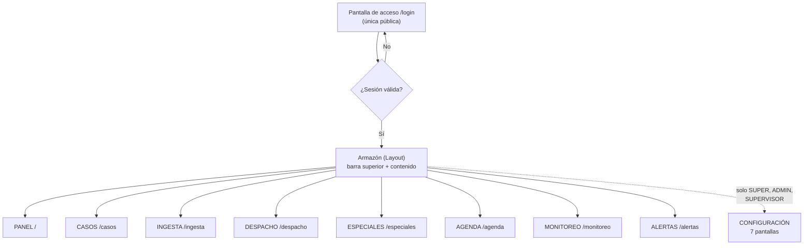
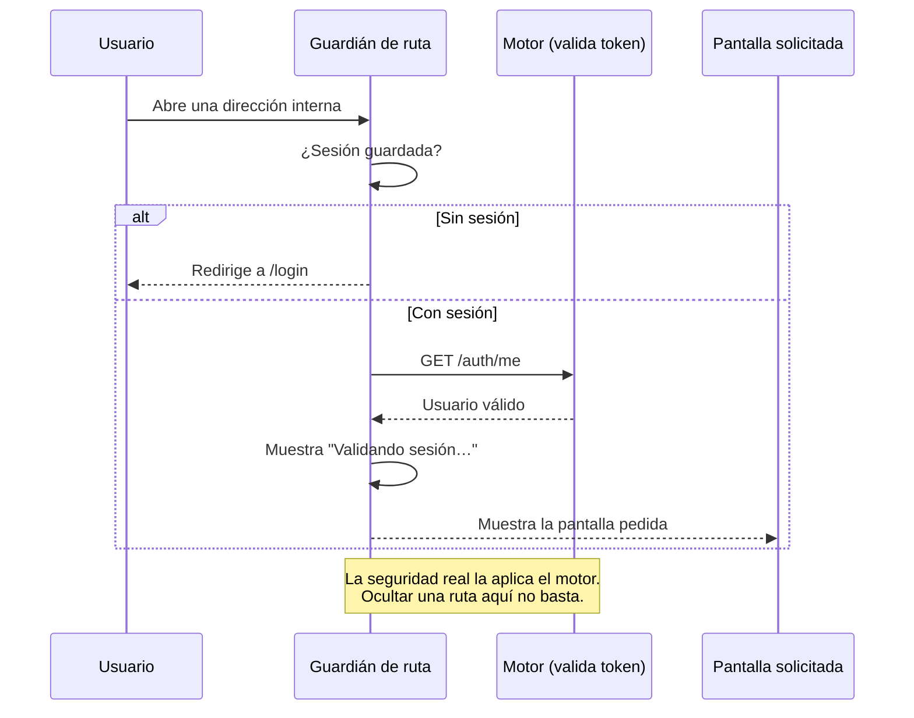

# Stack del frontend GGTO (SPA React)

> Manual para todo público. Explica con palabras sencillas **cómo está hecha la parte visual** de
> GGTO: las pantallas que ves en el navegador, cómo se protegen y cómo se construyen. No necesitas
> saber programar para leerlo.

## Empezar en 5 minutos

1. **La web se abre en el navegador.** No hay que instalar nada. Se entra por la dirección del
   sistema y aparece la pantalla de acceso.
2. **El sistema pide usuario y clave una sola vez.** Después de entrar, la sesión dura **8 horas**
   (una jornada). Si cierras el navegador o recargas, la sesión sigue viva mientras no expire.
3. **Todos los botones de la barra superior te llevan a una sección.** PANEL, CASOS, ESPECIALES,
   AGENDA, DESPACHO, INGESTA, MONITOREO y ALERTAS están siempre visibles. CONFIGURACIÓN aparece solo
   para SUPER, ADMIN y SUPERVISOR.
4. **Si tu rol es TECNICO, el sistema se pone en modo solo lectura.** Verás un aviso permanente y el
   botón **«Agregar caso»** quedará deshabilitado. Puedes consultar, pero no modificar.
5. **Puedes compartir enlaces internos.** Si copias la dirección de una pantalla (por ejemplo
   `/monitoreo`) y la abres en otra pestaña, funciona igual.

<!-- GENERAR_IMAGEN: mapa-pantallas-spa.svg -->


## Stack de la SPA

Una **SPA** (*Single Page Application*) es una web que se carga una vez y luego cambia de pantalla sin
recargar. La de GGTO está hecha con **React 18** y **TypeScript**.

### React 18 y TypeScript

React es la herramienta con la que se construyen las pantallas. TypeScript es la versión "con
controles" del lenguaje: obliga a declarar qué tipo de dato es cada cosa, y así se evitan muchos
errores antes de publicar.

Las dependencias de ejecución son solo tres:

| Paquete | Versión declarada | Para qué sirve |
|---|---|---|
| `react` | `^18.3.1` | Construir las pantallas |
| `react-dom` | `^18.3.1` | Mostrarlas en el navegador |
| `react-router-dom` | `^6.26.2` | Cambiar de pantalla sin recargar |

**No hay ninguna otra dependencia de ejecución.** En particular, **no se usa una biblioteca externa
de gráficos** (nada de Recharts ni Chart.js): los gráficos de MONITOREO se dibujan a mano con SVG,
que es un formato de dibujo que el navegador entiende de forma nativa.

Las herramientas de desarrollo (no van al usuario final) son: `@types/react`, `@types/react-dom`,
`@vitejs/plugin-react`, `typescript` y `vite`.

TypeScript está configurado en modo **estricto**. El informe de la Fase 4 registra que la revisión de
tipos no encontró hallazgos. El título de la pestaña del navegador es **GGTO — CANTV** y el idioma de
la página es español.

### Vite

**Vite 5** es la herramienta que arma y compila la web. Tiene dos modos:

1. **Modo desarrollo:** levanta la web en el puerto **5173** y reenvía automáticamente todo lo que
   empieza por `/api` al motor, que escucha en el puerto **8000**. Gracias a este reenvío, la web
   nunca necesita saber dónde está el motor.
2. **Modo construcción:** genera la versión final y la deja en la carpeta `dist`, que es exactamente
   la carpeta que el motor publica.

Los comandos disponibles son:

| Comando | Qué hace |
|---|---|
| `npm run dev` | Enciende la web en modo desarrollo (con reenvío a `/api`) |
| `npm run build` | Revisa los tipos y construye la versión final |
| `npm run preview` | Muestra una vista previa de la versión construida |

Un detalle importante: `build` **primero revisa los tipos**. Si hay un error, no se genera la versión
final. Es una barrera de calidad, no un defecto.

### react-router-dom

El enrutado es lo que decide **qué pantalla mostrar según la dirección**. GGTO usa `BrowserRouter`,
lo que significa que las direcciones son direcciones reales (`/casos`, `/monitoreo`). Por eso el motor
tiene que devolver la página principal cuando no encuentra el archivo: así React se encarga de mostrar
lo correcto.

El orden de armado del cliente es importante: primero el enrutador, después el proveedor de
autenticación y por último la aplicación. Si el orden se invirtiera, la protección de rutas no
funcionaría.

## Estructura del proyecto web

La web vive en la carpeta `app/web`. Estas son sus partes.

### main.tsx y App.tsx

- **`main.tsx`** es el arranque: 16 líneas que encienden React, conectan el enrutador, conectan el
  sistema de sesión y cargan los estilos.
- **`App.tsx`** es el **mapa de rutas**: 49 líneas que dicen qué pantalla corresponde a cada
  dirección. No tiene reglas de negocio.

La estructura de rutas es anidada: hay un "guardián" que revisa la sesión y, si todo está bien,
muestra el armazón con la barra superior y la pantalla que pediste.

```
/login                    → pantalla de acceso (pública)
(todo lo demás)           → primero revisa la sesión
   /                      → PANEL
   /ingesta  /casos  /despacho  /especiales  /agenda
   /monitoreo  /alertas
   /central  /sectores  /tecnicos  /flota  /cuadrillas
   /catalogos  /parametros
(dirección desconocida)   → vuelve al PANEL
```

### pages/

La carpeta `pages/` tiene **una pantalla por sección**. Estas son, con su tamaño aproximado en líneas
(útil para saber cuáles son las más complejas):

| Pantalla | Archivo | Líneas |
|---|---|---|
| Panel | `Panel.tsx` | 106 |
| Login | `Login.tsx` | 202 |
| Ingesta | `Ingesta.tsx` | 406 |
| Casos | `Casos.tsx` | 964 |
| Despacho | `Despacho.tsx` | 1165 |
| Especiales | `Especiales.tsx` | 508 |
| Agenda | `Agenda.tsx` | 814 |
| Monitoreo | `Monitoreo.tsx` | 764 |
| Alertas | `Alertas.tsx` | 677 |
| Centrales | `Centrales.tsx` | 336 |
| Sectores | `Sectores.tsx` | 520 |
| Tecnicos | `Tecnicos.tsx` | 366 |
| Flota | `Flota.tsx` | 372 |
| Cuadrillas | `Cuadrillas.tsx` | 555 |
| Catalogos | `Catalogos.tsx` | 390 |
| Parametros | `Parametros.tsx` | 177 |

Todas siguen el mismo patrón: al abrirse piden sus datos al motor, muestran un aviso mientras cargan,
y si algo falla muestran un mensaje de error. El **PANEL** es el mejor ejemplo: muestra seis tarjetas
con los conteos de **tablas, centrales, roles, cuadrillas, causas y parámetros**, y tiene un buscador
rápido que salta a CASOS con el texto ya escrito.

### components/

La carpeta `components/` guarda las piezas que se repiten en varias pantallas:

| Componente | Qué hace |
|---|---|
| `Layout` | El armazón: barra superior, menús y espacio de contenido |
| `RutaProtegida` | El guardián de la sesión |
| `BuscadorGlobal` | Buscador de un solo campo, en la barra superior |
| `ModalCaso` | La ventana del botón «Agregar caso» |
| `graficos` | Los cuatro tipos de gráfico dibujados en SVG |
| `Iconos` | El conjunto de iconos del sistema |
| `EstadoChips` | Las etiquetas de colores que indican el estado de un caso |
| `Mensaje` | Aviso de error o de información |
| `useCerrarDesplegable` | Cierra los menús al hacer clic fuera de ellos |

### api/

La carpeta `api/` tiene dos archivos grandes:

| Archivo | Líneas | Contenido |
|---|---|---|
| `client.ts` | 886 | Todas las llamadas al motor y el manejo de errores |
| `types.ts` | 988 | Los "moldes" de datos, escritos a mano |

Los tipos de `types.ts` son un **espejo** de lo que declara el motor. No se generan solos: cuando
alguien agrega un campo en el motor, debe agregarlo también aquí. Es un punto de atención conocido.

### auth/

La carpeta `auth/` contiene el sistema de sesión. Su archivo `AuthContext.tsx` (87 líneas) guarda:

- Quién es el usuario.
- Si está cargando.
- Si está autenticado.
- Si está en **modo solo lectura** (`TECNICO`).
- Las funciones para entrar y salir.

Al abrir el sistema, si hay una sesión guardada, se valida contra el motor con `GET /auth/me`. Si la
validación falla, se limpia la sesión y se vuelve al acceso.

## Enrutado y proteccion

### Rutas publicas y protegidas (app/web/src/App.tsx:22-48)

Hay **una sola dirección pública**: `/login`. Todas las demás exigen sesión válida.

| Tipo | Dirección | Pantalla |
|---|---|---|
| Pública | `/login` | Acceso |
| Protegida | `/` | PANEL |
| Protegida | `/ingesta` | INGESTA |
| Protegida | `/casos` | CASOS |
| Protegida | `/despacho` | DESPACHO |
| Protegida | `/especiales` | ESPECIALES |
| Protegida | `/agenda` | AGENDA |
| Protegida | `/monitoreo` | MONITOREO |
| Protegida | `/alertas` | ALERTAS |
| Protegida | `/central` | CONFIGURACIÓN · Central |
| Protegida | `/sectores` | CONFIGURACIÓN · Sectores |
| Protegida | `/tecnicos` | CONFIGURACIÓN · Técnicos |
| Protegida | `/flota` | CONFIGURACIÓN · Flota |
| Protegida | `/cuadrillas` | CONFIGURACIÓN · Cuadrillas |
| Protegida | `/catalogos` | CONFIGURACIÓN · Catálogos |
| Protegida | `/parametros` | CONFIGURACIÓN · Parámetros |
| Redirección | cualquier otra | Vuelve al PANEL |

**Aviso importante:** no existen pantallas separadas de SEGUIMIENTO, EMPRESAS, REFERIDOS ni GESTIÓN.
Esas vistas se atienden desde **ESPECIALES** y desde **CASOS**. No busques un menú que no existe.

<!-- GENERAR_IMAGEN: ruta-protegida.svg -->


### RutaProtegida

Es el **guardián**. Tiene tres salidas posibles:

1. **Mientras valida**, muestra un aviso: «Validando sesión…». Esta espera evita que la pantalla
   "parpadee" saltando al acceso y volviendo.
2. **Si no hay sesión**, te lleva a `/login`.
3. **Si la sesión es válida**, muestra la pantalla que pediste.

Es muy importante entender esto: **la protección de pantallas es solo la primera barrera**. La
seguridad de verdad la aplica el motor. Aunque alguien intentara forzar una dirección desde el
navegador, el motor le negaría la operación si su rol no alcanza. Por eso, ocultar un botón no es una
medida de seguridad por sí sola.

### Layout y barra superior (app/web/src/components/Layout.tsx)

El armazón de la aplicación (228 líneas) tiene tres partes:

1. **Barra superior (`topbar`)** con la marca GGTO — CANTV, el buscador global, el botón
   «Agregar caso», la navegación y el menú de usuario.
2. **Contenido (`main`)** con el aviso de solo lectura (cuando corresponde) y la pantalla actual.
3. **Ventana de alta de caso**, que aparece solo cuando se abre.

Las secciones principales son ocho y están en este orden: **PANEL, CASOS, ESPECIALES, AGENDA,
DESPACHO, INGESTA, MONITOREO y ALERTAS**.

El submenú **CONFIGURACIÓN** tiene siete entradas y se muestra solo si tu rol es SUPER, ADMIN o
SUPERVISOR.

El menú de usuario muestra tu inicial en un círculo, tu nombre (o tu P00) y tu rol. Si eres TECNICO,
aparece además la insignia **«solo lectura»**. Al abrirlo verás tu P00, tu correo, tu rol, tu central
y el botón para cerrar sesión.

| Elemento de la barra | Para qué sirve |
|---|---|
| Marca GGTO — CANTV | Vuelve al PANEL |
| Buscador global | Busca casos desde cualquier pantalla |
| Botón «Agregar caso» | Abre la ventana de alta (deshabilitado en solo lectura) |
| Navegación de secciones | Salta entre las ocho secciones principales |
| Submenú CONFIGURACIÓN | Acceso a las siete pantallas de configuración |
| Menú de usuario | Datos de tu cuenta y cierre de sesión |

## Cliente HTTP y tipos

### app/web/src/api/client.ts

Este archivo (886 líneas) es la **única puerta de salida** de la web hacia el motor. Todas las
pantallas pasan por aquí. Sus tres decisiones de diseño son:

1. **Mismo origen:** la base de las llamadas es `/api/v1`, una ruta relativa.
2. **Pase de sesión (token):** se guarda en el navegador y se envía en cada llamada.
3. **Errores claros:** cualquier falla se convierte en un mensaje entendible, con su código.

Las funciones se agrupan por sección:

| Grupo | Ejemplos de funciones |
|---|---|
| Acceso | entrar, consultar mi usuario, desbloquear |
| Central | listar, crear, consultar, actualizar, desactivar |
| Sectores | listar, crear, agregar dirección, eliminar dirección |
| Técnicos y flota | listar y crear técnicos, listar y crear vehículos, retirar vehículo |
| Cuadrillas | listar, crear, agregar integrante, retirar integrante |
| Catálogos y parámetros | listar causas y métodos, listar y actualizar parámetros |
| INGESTA | simular carga, cargar archivo, listar lotes, ver detalle de lote |
| CASOS | listar, buscar, consultar, crear, actualizar, ver historial |
| DESPACHO | simular propuesta, generar, listar, imprimir, enviar |
| ESPECIALES y AGENDA | listar solicitantes, casos especiales, citas y seguimiento |

Un detalle técnico con efecto práctico: la **INGESTA** sube el archivo CSV con un formato especial
de carga de archivos. Por eso ese envío es distinto de los demás y se maneja aparte.

### app/web/src/api/types.ts

Este archivo (988 líneas) reúne las interfaces, es decir, los **moldes de datos** que la web espera
recibir. Los grupos verificados son:

| Grupo | Moldes |
|---|---|
| Acceso | Usuario, respuesta del token, posición de palabra, respuesta de desbloqueo |
| Central | Central y sus variantes de creación y edición |
| Sectores | tipos de coincidencia, dirección de sector, sector |

Dos convenciones útiles:

1. Los moldes de creación se derivan de los de lectura. Por ejemplo, "Central para crear" es igual a
   "Central" sin el identificador.
2. Los campos que pueden venir vacíos se escriben con `| null` y los opcionales con `?`, respetando
   la realidad de la base de datos.

Los valores cerrados (los que solo pueden ser uno de una lista) se escriben como listas de opciones.
Por ejemplo, el tipo de coincidencia de una dirección solo puede ser **CONTIENE**, **EXACTO** o
**REGEX**, que son justamente los que usa la sectorización.

## Graficos SVG propios

### app/web/src/components/graficos.tsx (barras, curva, torta)

Los gráficos de la pantalla **MONITOREO** se dibujan **a mano con SVG**, sin librerías externas. Son
cuatro:

| Gráfico | Qué muestra |
|---|---|
| Barras | Comparar valores entre categorías |
| Barras agrupadas | Comparar varias series por categoría |
| Líneas (curva) | Ver la evolución en el tiempo |
| Torta | Ver proporciones de un total |

Todos son **de solo lectura**: reciben datos ya calculados por el motor y los dibujan. El ancho de
dibujo es de 640 unidades, pero el gráfico se estira al ancho disponible de la pantalla.

La paleta de colores de las series es fija (azul, verde, mostaza, rojo, violeta y turquesa), lo que
mantiene la coherencia visual entre pantallas.

> La revisión formal de accesibilidad de estos gráficos (lectores de pantalla, contraste) está
> **pendiente de confirmar**. Hoy hay bases de accesibilidad en otras partes de la web, pero el
> informe AA de los gráficos todavía no está emitido.

## Constructor y salida (npm run build -> app/web/dist, servida por FastAPI)

El proceso de construcción tiene cinco etapas:

1. **Revisión de tipos.** Primero se ejecuta la revisión estricta. Si hay un error, se detiene todo.
2. **Empaquetado.** Vite compila y optimiza la aplicación.
3. **Salida.** El resultado queda en `app/web/dist`, con un `index.html` y una carpeta de recursos.
   Los nombres de los archivos incluyen un código derivado del contenido, por ejemplo
   `index-B48LMoIz.css` e `index-BGs0NhQL.js`.
4. **Publicación.** El motor monta esa carpeta como la página principal de la web.
5. **Contenedor.** La imagen de la nube se construye en dos etapas: una con Node (construye la web) y
   otra con Python (la sirve). El contenido exacto del archivo de construcción del contenedor está
   **pendiente de confirmar** y no forma parte de este manual.

Para trabajar en desarrollo: `npm run dev` en `app/web` (puerto 5173) con el motor en el puerto 8000.

| Comando | Efecto |
|---|---|
| `npm run dev` | Enciende la web de desarrollo con reenvío a `/api` |
| `npm run build` | Revisa tipos y genera `app/web/dist` |
| `npm run preview` | Muestra la versión construida antes de publicarla |

## Estado actual y pendientes (accesibilidad RNF-23, pruebas de UI: pendiente de confirmar)

Estado verificado y cosas por cerrar:

- **Pruebas de navegador:** existen **46 pruebas E2E** con Playwright que corren contra un esquema
  aislado (`ggto_e2e`). Junto con las 169 pruebas de Python, suman **215 pruebas en verde**. El
  detalle exacto de qué pantalla cubre cada prueba está **pendiente de confirmar** contra el informe
  de la Fase 4.
- **Accesibilidad (RNF-23):** el requisito pide cumplir **WCAG 2.1 AA**, verificado con herramientas
  automáticas (axe o Lighthouse) y revisión manual. Hoy hay buenas bases en el código (avisos para
  lectores de pantalla, etiquetas en enlaces y menús), pero **la auditoría formal y el registro de
  conformidad están pendientes de confirmar**.
- **Contraste y foco:** el contraste real de cada combinación de colores frente al mínimo de 4.5:1
  está **pendiente de confirmar** con una medición.
- **Sincronización de tipos:** los moldes de la web se mantienen a mano. No hay generación automática
  ni una verificación en la integración continua; el riesgo de desincronización está **pendiente de
  confirmar** en cuanto a su mitigación.
- **Integración continua:** el flujo verificado ejecuta las revisiones de Python y las pruebas de
  Python. La ejecución de la revisión de tipos de la web, de la construcción y de las pruebas de
  navegador dentro de ese flujo está **pendiente de confirmar**.
- **Aplicación móvil:** la app Flutter para Android **no está desarrollada** (Ciclo 8 diferido). Este
  manual no la documenta como existente. Cuando en este sistema se habla de "móvil", se refiere a que
  la web se adapta a pantallas pequeñas, no a una aplicación nativa.
- **WhatsApp:** no existe integración. Quedó diferida a la versión 3.
