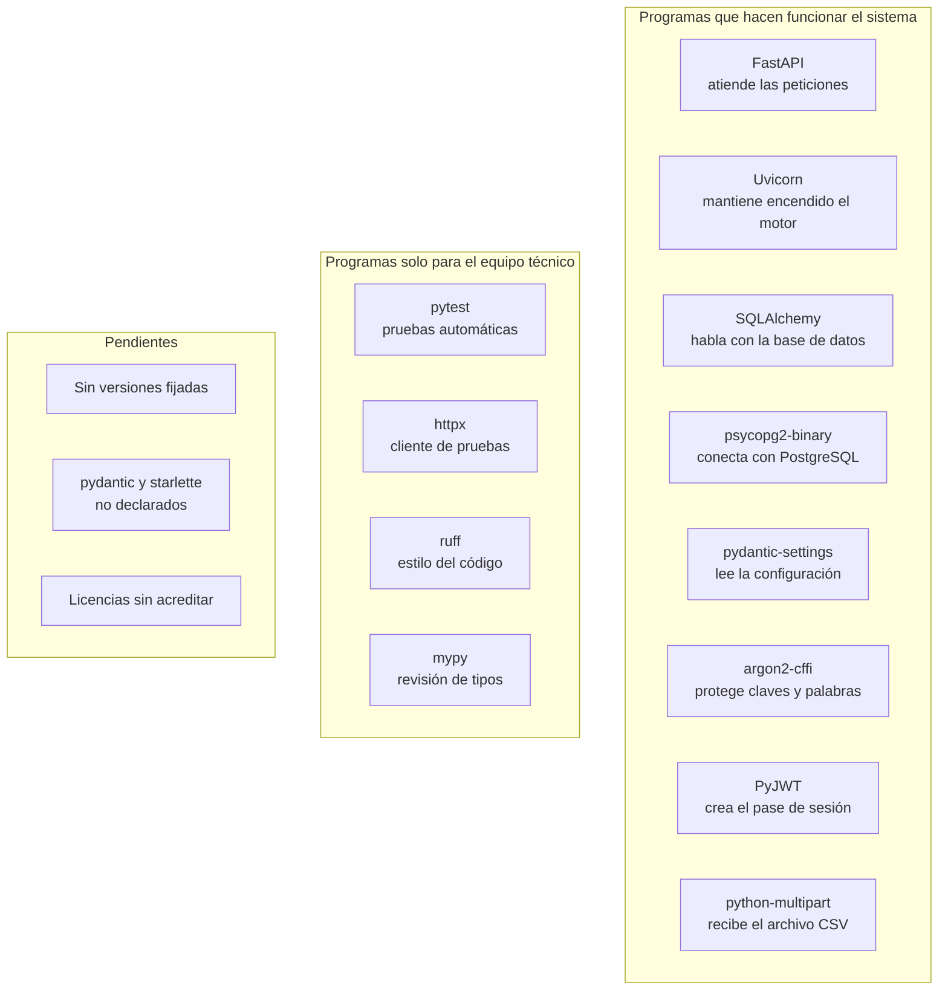

# Dependencias del backend GGTO

> Manual para todo público. Explica **qué piezas de software usa el motor de GGTO** y para qué sirve
> cada una. Una "dependencia" es un programa ya hecho que el sistema reutiliza en lugar de
> escribirlo desde cero. La mayoría de estos nombres solo interesan al equipo técnico, pero conviene
> conocerlos y saber **qué falta cerrar** antes de una entrega formal.

## Empezar en 5 minutos

1. **El motor necesita ocho programas base.** Están listados en un archivo de texto. Ese archivo
   **no dice qué versión** usar: solo los nombres.
2. **Las versiones que verás en este manual son las que se probaron**, no las que están escritas en
   el sistema. Es una diferencia importante: el sistema puede instalarse con versiones algo
   distintas.
3. **Falta fijar versiones.** Es el pendiente más relevante del tema y está explicado más abajo.
4. **Faltan dos programas por declarar.** El sistema usa `pydantic` y `starlette` directamente, pero
   no aparecen en la lista. Llegan "de rebote", como parte de otros paquetes.
5. **Las licencias están pendientes de confirmar.** No hay archivo de licencias en el proyecto. Para
   uso interno de CANTV no es urgente, pero **sí lo es si algún día se redistribuye** el software.

<!-- GENERAR_IMAGEN: dependencias-backend.svg -->

## Fuentes de dependencias

El motor declara sus dependencias en **dos archivos de texto** dentro de la carpeta `app/`:

1. `app/requirements.txt` → lo que hace falta para que el sistema funcione.
2. `app/requirements-dev.txt` → lo anterior más las herramientas de trabajo del equipo técnico.

No existe un archivo de "versiones exactas" (los llamados *lock*). El frontend sí tiene uno
(`package-lock.json`), pero el motor de Python no.

### app/requirements.txt

Este archivo tiene **ocho líneas sueltas, sin ninguna versión**. Es lo que se instala al construir el
contenedor del sistema.

| Programa | Para qué sirve |
|---|---|
| `fastapi` | Atender las peticiones web y validar datos |
| `uvicorn[standard]` | Mantener el motor encendido |
| `sqlalchemy` | Traducir entre el código y la base de datos |
| `psycopg2-binary` | Conectar con PostgreSQL |
| `pydantic-settings` | Leer la configuración del entorno |
| `argon2-cffi` | Proteger con cifrado fuerte las claves y las palabras |
| `PyJWT` | Crear y validar el pase de sesión |
| `python-multipart` | Recibir formularios y archivos, como el CSV de INGESTA |

El hecho de que **no digan la versión** es comprobable: no hay signos `==`, `~=` ni `>=` en ninguna
línea. Por eso el archivo, por sí solo, no alcanza para reconstruir exactamente el entorno que se
probó.

### app/requirements-dev.txt

Este archivo **hereda** el anterior y agrega cuatro herramientas:

| Programa | Para qué sirve |
|---|---|
| `-r requirements.txt` | Trae los ocho programas de arriba |
| `pytest` | Ejecutar las pruebas automáticas |
| `httpx` | Cliente que usan las pruebas para simular un navegador |
| `ruff` | Revisar el estilo del código |
| `mypy` | Revisar los tipos de datos |

Gracias a esa herencia, la integración continua instala **solo** este archivo y obtiene todo lo
necesario.

## Dependencias de ejecución

Las versiones que se indican a continuación son las **observadas en el entorno de verificación**
(Python 3.12.3). No están escritas en el repositorio.

### FastAPI

#### Versión y origen

**Versión observada: 0.141.1.** Se apoya en otras dos piezas: **Starlette 1.7.0** (la capa de
comunicación) y **Pydantic 2.13.5** (la validación de datos).

#### Uso en el proyecto

FastAPI es el **esqueleto del servicio**. Sobre él se construye toda la API. El sistema aprovecha
tres capacidades concretas:

1. **Entrega automática de datos:** los manejadores reciben la sesión de base de datos y el usuario
   autenticado sin pedirlos a mano.
2. **Contrato de salida:** cada operación declara la forma exacta de su respuesta.
3. **Documentación automática:** el propio servicio publica su documentación.

Los diez módulos de rutas usan FastAPI de forma directa, así que la dependencia atraviesa toda la
API. Si FastAPI cambia de forma incompatible, todo el sistema se ve afectado.

#### Licencia

**Pendiente de confirmar.** El proyecto no incluye archivo de licencias. Para uso interno no hay
problema, pero **antes de redistribuir** el software hay que hacer una revisión legal formal.

### Uvicorn

#### Versión y origen

**Versión observada: 0.54.0.** Se declara con el extra `standard`, que agrega mejoras de rendimiento.

#### Uso en el proyecto

Uvicorn es el **motor de arranque**: el proceso que mantiene el sistema encendido y escuchando. El
código no lo usa directamente; su papel es de proceso. Aparece en dos lugares:

1. **En producción:** es el comando principal del contenedor.
2. **En las pruebas de navegador:** el guion de pruebas lo enciende y espera a que `/health`
   responda antes de continuar.

En desarrollo, la web reenvía las llamadas al puerto 8000, donde escucha este servidor. El comando
local exacto está **pendiente de confirmar** en el manual de despliegue.

#### Licencia

**Pendiente de confirmar.**

### SQLAlchemy

#### Versión y origen

**Versión observada: 2.1.1.** Se declara sin restricción de versión.

#### Uso en el proyecto

SQLAlchemy es el **traductor** entre el código y las tablas. Permite escribir consultas en lenguaje
de programación en vez de escribir SQL a mano. El sistema lo usa en tres frentes:

1. **Modelos:** cada tabla está descrita con precisión (tipos, tamaños, si admite vacíos).
2. **Consultas:** los manejadores piden datos con `select`, `func` y `text`.
3. **Motor y sesión:** se crea una conexión que se revisa antes de usarse y se entrega una sesión
   por cada petición.

La dirección de conexión indica explícitamente el conector de PostgreSQL que se describe en el
apartado siguiente.

#### Licencia

**Pendiente de confirmar.** Se sabe que SQLAlchemy suele distribuirse con licencia MIT, pero el
proyecto no incluye el texto. Por eso aquí no se acredita.

### psycopg2-binary

#### Versión y origen

**Versión observada: 2.9.13.** La variante `-binary` trae las bibliotecas ya compiladas, lo que
simplifica la instalación en el contenedor del sistema.

#### Uso en el proyecto

No se usa directamente: se usa **a través de SQLAlchemy**. Las referencias reales están en la
construcción de la dirección de conexión y en las pruebas de configuración.

El sistema contempla dos formas de conexión:

- **Por socket interno de la nube** (la dirección empieza por `/`).
- **Por red normal (TCP)**, con host y puerto.

Además, el parámetro `sslmode` define el cifrado, y el esquema alternativo permite trabajar en
"cajones" separados (por ejemplo, en pruebas).

#### Licencia

**Pendiente de confirmar.** La distribución instalada menciona LGPL con excepciones, pero esa señal
no está en el repositorio.

### pydantic-settings

#### Versión y origen

**Versión observada: 2.15.0.**

#### Uso en el proyecto

Es la base de la **configuración**. Define cómo se leen las variables del entorno y del archivo
`.env` opcional, y sirve para tipar todos los parámetros: aplicación, base de datos, seguridad y
CORS.

Los valores sensibles —la clave de firma, la clave de la base de datos y las claves de los canales
de notificación— se leen del entorno. Este manual **no reproduce secretos**: solo nombra las claves.

#### Licencia

**Pendiente de confirmar.**

### argon2-cffi

#### Versión y origen

**Versión observada: 25.1.0.** Responde al requisito **RNF-22**, que exige el cifrado **Argon2id**
para proteger las claves.

#### Uso en el proyecto

Se usa en el módulo de seguridad para:

1. **Cifrar las claves** de los usuarios antes de guardarlas.
2. **Verificarlas** al entrar, sin revelar información si fallan.
3. **Cifrar el diccionario de 12 palabras** de seguridad.

La misma herramienta sirve para las claves y para las palabras. Una prueba automática confirma que
el resultado empieza por `$argon2id$`, lo que garantiza que se usa el algoritmo correcto.

#### Licencia

**Pendiente de confirmar.**

### PyJWT

#### Versión y origen

**Versión observada: 2.7.0.** El nombre con el que se usa en el código es `jwt`.

#### Uso en el proyecto

Cumple dos funciones:

1. **Emitir el pase de sesión (token)** al entrar, con tus datos básicos y una fecha de vencimiento.
2. **Validarlo** en cada operación. Si el token es inválido o venció, el sistema responde **401**
   con el mensaje «Credenciales inválidas o token expirado».

El algoritmo de firma es **HS256** y la vigencia es de **480 minutos** (8 horas). La clave de firma
vive en un secreto y **no se escribe en este manual**.

#### Licencia

**Pendiente de confirmar.**

### python-multipart

#### Versión y origen

**Versión observada: 0.0.32.** Es la pieza que permite recibir archivos y formularios.

#### Uso en el proyecto

Su uso está concentrado en **INGESTA**. Los dos puntos de entrada del CSV la necesitan:

1. **Simulación:** recibe el archivo y, opcionalmente, el identificador de la central.
2. **Carga real:** recibe la misma pareja de datos.

El contenido del archivo se lee completo y se conserva su nombre original. Si el archivo no trae
nombre, se guarda como `sin-nombre`. El contrato del archivo de origen se detalla en el documento de
interfaz del CSV.

#### Licencia

**Pendiente de confirmar.**

## Dependencias de desarrollo

### pytest

#### Versión y origen

**Versión observada: 9.1.1.** Su configuración vive en `pytest.ini`.

#### Uso en el proyecto

Toda la batería de pruebas está en `app/tests/`: un archivo de preparación (`conftest.py`) y catorce
módulos de pruebas, entre ellos los de acceso, casos, despacho, especiales, ingesta, monitoreo,
alertas, configuración, contratos, seguridad y sectorización.

El archivo de preparación define lo que se comparte entre pruebas: la limpieza de intentos, la sesión
de base de datos y el cliente de pruebas.

El resultado de la Fase 4 fue **169 de 169 pruebas en verde**.

#### Licencia

**Pendiente de confirmar.**

### httpx

#### Versión y origen

**Versión observada: 0.28.1.**

#### Uso en el proyecto

`httpx` **no se usa directamente** en el código del sistema. Está aquí porque la herramienta de
pruebas de FastAPI lo necesita por dentro para simular un navegador. Es una dependencia indirecta,
pero declarada a propósito.

#### Licencia

**Pendiente de confirmar.**

### ruff

#### Versión y origen

**Versión observada: 0.16.9.** Se configura en `pyproject.toml`.

#### Uso en el proyecto

Es el **revisor de estilo**: ordena las importaciones y detecta malas prácticas. El informe de la
Fase 4 lo reporta **sin hallazgos**. Se ejecuta con `ruff check app`.

#### Licencia

**Pendiente de confirmar.**

### mypy

#### Versión y origen

**Versión observada: 2.3.1.** Se configura en `pyproject.toml`.

#### Uso en el proyecto

Es el **revisor de tipos**: comprueba que los datos sean del tipo declarado. También aparece **sin
hallazgos** en el informe de la Fase 4. Se ejecuta con `mypy app`.

#### Licencia

**Pendiente de confirmar.**

## Riesgo de versiones no fijadas

### Reproducibilidad y RNF-24/RNF-25

Como el archivo de dependencias no fija versiones y no hay archivo de bloqueo, **dos instalaciones
hechas en fechas distintas pueden traer versiones diferentes** de FastAPI, SQLAlchemy, Pydantic o
Starlette. Esto choca con dos requisitos ya acordados:

| Requisito | Qué pide | Qué pasa hoy |
|---|---|---|
| **RNF-24** | Migraciones versionadas, integración continua con pruebas y revisores, cobertura mínima del 70 %, API versionada y entornos separados | Una actualización de una dependencia puede romper el sistema sin que nadie cambie una línea de código. La cobertura mínima del 70 % **no está configurada** (pendiente de confirmar) |
| **RNF-25** | Paridad entre desarrollo y producción, configuración solo por variables de entorno, imagen de contenedor reproducible | La frase "imagen reproducible" **no se cumple** mientras cada construcción instale versiones libres |

### Baseline verificado del entorno

Lo único comprobable hoy es el entorno donde se verificó el sistema (Python 3.12.3). Esta tabla es
**una fotografía**, no una garantía del repositorio: no está escrita en los archivos de
dependencias.

| Programa | Versión observada | ¿Está declarado? |
|---|---|---|
| fastapi | 0.141.1 | Sí, sin versión |
| starlette | 1.7.0 | No (llega de rebote) |
| uvicorn | 0.54.0 | Sí, sin versión |
| sqlalchemy | 2.1.1 | Sí, sin versión |
| psycopg2-binary | 2.9.13 | Sí, sin versión |
| pydantic-settings | 2.15.0 | Sí, sin versión |
| pydantic | 2.13.5 | No (llega de rebote) |
| argon2-cffi | 25.1.0 | Sí, sin versión |
| PyJWT | 2.7.0 | Sí, sin versión |
| python-multipart | 0.0.32 | Sí, sin versión |
| pytest | 9.1.1 | Sí, sin versión |
| httpx | 0.28.1 | Sí, sin versión |
| ruff | 0.16.9 | Sí, sin versión |
| mypy | 2.3.1 | Sí, sin versión |

### Dependencias transitivas usadas de forma directa

Dos piezas que el código usa **directamente** no están declaradas:

1. **pydantic.** Se usa en los siete módulos de esquemas. Llega como parte de FastAPI. Si FastAPI
   cambiara de versión mayor de Pydantic, el sistema podría romperse sin aviso.
2. **starlette.** Se usa en el armado del sistema (para el manejo de errores y el portero de
   observabilidad), pero no figura en la lista. Depende de la versión de FastAPI instalada.

### Alembic y la cobertura

El requisito RNF-24 pide dos cosas que **hoy no están resueltas**:

1. **Migraciones versionadas con Alembic.** Alembic es una herramienta para aplicar cambios de
   estructura a la base de datos de forma ordenada. **No aparece** en ningún archivo de
   dependencias. Su uso real está **pendiente de confirmar**.
2. **Cobertura mínima del 70 %.** No hay herramienta de cobertura ni configuración del umbral. Está
   **pendiente de confirmar**.

### Mitigaciones recomendadas

1. **Fijar las versiones** del *baseline* de la tabla, o generar un archivo de bloqueo con
   `pip freeze`.
2. **Declarar `pydantic` y `starlette`** en el archivo de dependencias, porque el código las usa
   directamente.
3. **Fijar la versión de Python** (hoy 3.12) en la imagen y en la integración continua. Esto ya se
   cumple y es coherente con RNF-25.
4. **Registrar los textos de las licencias** de todas las dependencias para cerrar la revisión legal.

## Herramientas de calidad y su invocación

### pyproject.toml

Este archivo contiene **solo configuración** de las herramientas de calidad; no declara ninguna
dependencia.

#### Ruff

- Longitud máxima de línea: **110** caracteres.
- Versión objetivo: **Python 3.12**.
- Se excluyen del análisis la web y los entornos virtuales.
- Reglas activadas: estilo, errores comunes, orden de importaciones, buenas prácticas, modernización
  del lenguaje y reglas propias de Ruff.
- Se ignora la regla `B008` porque FastAPI la usa de forma legítima.
- Las pruebas quedan exentas del límite de 110 columnas.

#### mypy

- Versión de Python: **3.12**.
- Se ignoran las importaciones que no traen información de tipos.
- Se avisa si hay directivas de omisión que ya no hacen falta.
- Se excluye la web del análisis.

### pytest.ini

La configuración de pruebas es mínima:

| Clave | Valor | Efecto |
|---|---|---|
| `testpaths` | `app/tests` | Solo se recogen pruebas de esa carpeta |
| `python_files` | `test_*.py` | Qué archivos son pruebas |
| `python_classes` | `Test*` | Qué clases son pruebas |
| `python_functions` | `test_*` | Qué funciones son pruebas |
| `addopts` | `-ra` | Muestra un resumen final, incluidas las pruebas omitidas |

### Invocación local y en integración continua

Los comandos verificados son:

| Herramienta | Comando |
|---|---|
| Ruff | `ruff check app` |
| mypy | `mypy app --ignore-missing-imports` |
| pytest | `pytest app/tests -q` |

En la integración continua se levanta una base PostgreSQL 15 de prueba y se ejecutan los pasos en
este orden: **estilo → tipos → pruebas**. Solo si los tres pasan, el cambio se da por bueno.

### Sistema de construcción

El motor **no se empaqueta** como una biblioteca: no hay una sección de construcción en
`pyproject.toml`. El sistema se ejecuta directamente desde la raíz con `uvicorn app.main:app`. El
empaquetado de la parte visual con Node se explica en el manual de dependencias del frontend.
