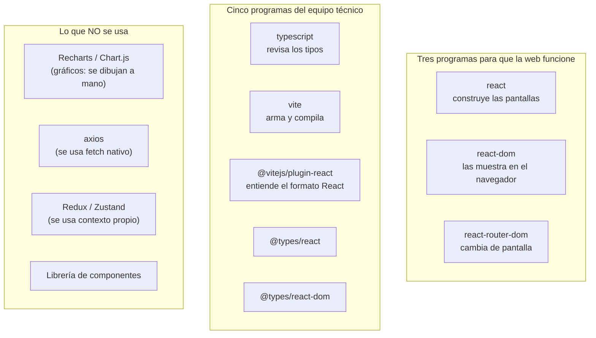

# Dependencias del frontend GGTO

> Manual para todo público. Explica **qué piezas de software usa la web de GGTO**. Una "dependencia"
> es un programa ya hecho que el sistema reutiliza. La web de GGTO tiene una virtud poco común:
> depende de muy pocas cosas, y eso la hace más segura y más fácil de mantener.

## Empezar en 5 minutos

1. **La web usa solo tres programas para funcionar:** React, React DOM y React Router. Nada más.
2. **Sí tiene un archivo de versiones exactas** (`package-lock.json`). Eso significa que la web se
   construye siempre igual, en cualquier computadora. Es una ventaja frente al motor, que todavía no
   lo tiene.
3. **Los gráficos de MONITOREO no usan ninguna librería externa.** Se dibujan a mano. Por eso no
   verás Recharts ni Chart.js en la lista, aunque documentos antiguos los mencionaran.
4. **Los tres comandos que existen son `dev`, `build` y `preview`.** El más importante es `build`:
   primero revisa errores y, solo si todo está bien, arma la versión final.
5. **Todas las licencias se pueden verificar.** React, React DOM, React Router y Vite son MIT;
   TypeScript es Apache-2.0. No hay licencias desconocidas en la web.

<!-- GENERAR_IMAGEN: dependencias-frontend.svg -->

## Fuentes

La web declara sus dependencias en **dos archivos que se complementan**:

1. `app/web/package.json` → la lista con rangos de versión.
2. `app/web/package-lock.json` → las versiones exactas que se instalaron.

A diferencia del motor, **sí existe el archivo de versiones exactas** y está guardado en el
repositorio. Eso permite saber con precisión qué se instaló.

### app/web/package.json

Este archivo describe el paquete de la web:

| Dato | Valor | Para qué sirve |
|---|---|---|
| Nombre | `ggto-web` | Nombre del paquete |
| Privado | Sí | Evita que se publique por accidente |
| Versión | `0.1.0` | Versión de la web, independiente del motor |
| Tipo de módulo | ES | Forma moderna de organizar el código |

Las versiones se declaran con el signo `^`, que significa "acepta mejoras dentro de la misma versión
mayor". Por ejemplo, `^18.3.1` acepta `18.4.x`, pero no `19.x`.

### app/web/package-lock.json

Este archivo es el que **fija las versiones exactas**. Es un documento grande: contiene **119
entradas de paquete**. Su valor práctico es doble:

1. **Fija la resolución exacta.** Las versiones de este manual salen de aquí, no del rango de
   `package.json`.
2. **Permite el comando `npm ci`**, que exige que ambos archivos estén sincronizados. Si alguien
   cambia uno y olvida el otro, la construcción falla. Esa es la garantía de que la web se arma
   siempre igual.

La carpeta de paquetes instalados y la de resultados están excluidas del repositorio, pero el
archivo de bloqueo **sí** se guarda. Esa es la práctica correcta.

## Dependencias de ejecución

La web declara **solo tres** dependencias de ejecución. No usa librería de estado global, ni cliente
HTTP, ni librería de componentes, ni librería de gráficos.

### react

#### Versión declarada y resuelta

- Declarada: `^18.3.1`.
- **Instalada realmente: 18.3.1.**

#### Uso en el proyecto

React es el **núcleo de la interfaz**. Con él se construyen las pantallas y se maneja su estado
interno (por ejemplo, si un dato está cargando o si hay un error). También aporta el modo estricto
de desarrollo, que ayuda a detectar problemas a tiempo.

#### Licencia

**MIT.** La licencia está escrita en el propio archivo de bloqueo, así que se puede verificar.

### react-dom

#### Versión declarada y resuelta

- Declarada: `^18.3.1`.
- **Instalada realmente: 18.3.1.**

#### Uso en el proyecto

Es la pieza que **muestra React en el navegador**. Se usa una sola vez, al arrancar la web: conecta
la aplicación con el contenedor `#root` de la página HTML.

#### Licencia

**MIT**, verificable en el archivo de bloqueo.

### react-router-dom

#### Versión declarada y resuelta

- Declarada: `^6.26.2`.
- **Instalada realmente: 6.30.6.**

El salto de 6.26.2 a 6.30.6 es normal: el signo `^` permite mejoras dentro de la misma versión
mayor. La versión que manda es la del archivo de bloqueo.

#### Uso en el proyecto

Es el **enrutador**: decide qué pantalla mostrar según la dirección. Sus usos principales son:

| Para qué | Dónde se usa |
|---|---|
| Tabla de rutas y redirección de direcciones desconocidas | Mapa de la aplicación |
| Guardián de sesión y anidamiento | Guardián de ruta |
| Barra superior y contenido interno | Armazón |
| Navegación desde el código | Acceso, PANEL, ESPECIALES y buscador |
| Lectura de la dirección y sus parámetros | CASOS |

El árbol de rutas tiene **una ruta pública** (`/login`) y **quince rutas protegidas** dentro del
guardián y del armazón: PANEL, INGESTA, CASOS, DESPACHO, ESPECIALES, AGENDA, MONITOREO, ALERTAS y las
siete pantallas de CONFIGURACIÓN. Cualquier dirección desconocida vuelve al PANEL.

#### Licencia

**MIT**, verificable en el archivo de bloqueo.

## Dependencias de desarrollo

Las dependencias de desarrollo son **cinco**: el compilador de TypeScript, la herramienta de
construcción, su complemento para React y los dos paquetes de tipos.

### typescript

#### Versión declarada y resuelta

- Declarada: `^5.6.3`.
- **Instalada realmente: 5.9.3.**

#### Uso en el proyecto

Es el **revisor de tipos**. Se ejecuta como primer paso de la construcción. Si encuentra un error,
la construcción se detiene. El informe de la Fase 4 lo registra **sin hallazgos**.

#### Licencia

**Apache-2.0.** Es la única dependencia directa del proyecto que no usa licencia MIT.

### vite

#### Versión declarada y resuelta

- Declarada: `^5.4.9`.
- **Instalada realmente: 5.4.21.**

#### Uso en el proyecto

Es el **servidor de desarrollo y el empaquetador**. En desarrollo enciende la web y reenvía las
llamadas al motor. Al construir, produce la carpeta que después se copia al contenedor de
producción.

#### Licencia

**MIT**, verificable en el archivo de bloqueo.

### @vitejs/plugin-react

#### Versión declarada y resuelta

- Declarada: `^4.3.2`.
- **Instalada realmente: 4.7.0.**

#### Uso en el proyecto

Es el complemento que permite a Vite **entender el formato de React** (los archivos con extensión
`.tsx`) y recargar la pantalla al instante mientras se programa. Sin él, Vite no compilaría la
aplicación.

#### Licencia

**MIT**, verificable en el archivo de bloqueo.

### @types/react y @types/react-dom

#### Versión declarada y resuelta

| Paquete | Declarada | Instalada realmente |
|---|---|---|
| `@types/react` | `^18.3.11` | **18.3.31** |
| `@types/react-dom` | `^18.3.1` | **18.3.7** |

#### Uso en el proyecto

Son los **diccionarios de tipos** de React. No se usan en el código: sirven para que el revisor de
tipos entienda los componentes de React. Su versión mayor debe acompañar a la de React; ambas
familias están en 18.

#### Licencia

**MIT**, verificable en el archivo de bloqueo.

## Scripts npm y su efecto

Existen exactamente **tres comandos**:

| Comando | Qué hace |
|---|---|
| `dev` | Enciende la web de desarrollo con recarga automática y reenvío a la API |
| `build` | Primero revisa tipos y, si todo está bien, arma la versión final en `dist/` |
| `preview` | Muestra localmente la versión ya construida |

### Detalle de cada script

#### dev

Enciende la web en el puerto **5173** y reenvía todo lo que empieza por `/api` al puerto **8000**,
donde está el motor. Es el modo de trabajo normal del equipo técnico: permite programar y ver los
cambios al instante.

#### build

El comando usa el operador "y luego" (`&&`): si la revisión de tipos falla, **no se llega a
construir**. La revisión de tipos no genera archivos; solo comprueba. El empaquetado real lo hace
Vite, que escribe el resultado en `dist/`. Este es el comando que ejecuta la primera etapa del
contenedor.

#### preview

Sirve localmente la carpeta `dist/`. Requiere que antes se haya construido. **No** reenvía las
llamadas a la API ni reemplaza al motor. Su uso en producción está **pendiente de confirmar**; el
despliegue real usa el motor sirviendo la carpeta tal como está.

## Configuración de TypeScript y Vite

### tsconfig.json

Este archivo define cómo se revisan los tipos. Los ajustes relevantes:

| Ajuste | Valor | Efecto |
|---|---|---|
| `target` | `ES2020` | Nivel de lenguaje JavaScript |
| `lib` | ES2020, DOM, DOM.Iterable | Tipos del navegador disponibles |
| `module` | `ESNext` | Módulos modernos |
| `skipLibCheck` | Sí | No revisa los archivos de tipos de terceros |
| `moduleResolution` | `bundler` | Resolución al estilo empaquetador |
| `allowImportingTsExtensions` | Sí | Permite importar con extensión |
| `resolveJsonModule` | Sí | Permite importar archivos JSON |
| `isolatedModules` | Sí | Exige módulos compilables por separado |
| `noEmit` | Sí | No genera archivos: solo valida |
| `jsx` | `react-jsx` | Transformación automática del formato React |
| `strict` | Sí | Activa todas las comprobaciones estrictas |
| `noFallthroughCasesInSwitch` | Sí | Prohíbe casos sin cierre en las decisiones múltiples |

El análisis cubre solo la carpeta del código fuente y usa un archivo aparte para la configuración de
Node.

#### Modo estricto

El modo estricto activa la familia completa de comprobaciones: obliga a declarar tipos, evita
errores con valores vacíos y valida las funciones. Se refuerza con la regla de no dejar casos
abiertos en las decisiones múltiples. El resultado verificado fue **sin hallazgos** en la Fase 4.

#### tsconfig.node.json

Configura por separado el archivo de Vite, que se ejecuta en Node (no en el navegador). Sus ajustes
son equivalentes y también en modo estricto.

### vite.config.ts

Este archivo tiene 20 líneas y tres bloques:

1. **Importaciones** de Vite y del complemento de React.
2. **Servidor de desarrollo:** puerto **5173** y reenvío de `/api` a `http://localhost:8000`.
3. **Construcción:** la salida queda en `dist`.

El puerto 8000 es una convención de desarrollo. En producción el puerto real es **8080**.

#### Paridad de versiones de Node

El contenedor compila con **Node 20**, mientras que la estación de verificación tiene **Node 22**.
El archivo de bloqueo garantiza los mismos paquetes en ambos entornos, pero **no la misma versión de
Node**. Esto es relevante para el requisito RNF-25 (paridad de entornos) y queda **pendiente de
confirmar** si el proyecto exige igualar las versiones mayores de Node.

## Ausencia de librería de gráficos externa

### Gráficos SVG propios

El proyecto **no usa Recharts ni ninguna otra librería de gráficos**. Los gráficos de MONITOREO se
dibujan a mano con SVG, dentro de un solo componente propio. Cuatro tipos:

| Gráfico | Qué muestra |
|---|---|
| Barras | Comparar valores entre categorías |
| Barras agrupadas | Comparar varias series por categoría |
| Líneas (curva) | Ver la evolución en el tiempo |
| Torta | Ver proporciones de un total |

El módulo define su propia paleta de seis colores y fija un ancho de dibujo de 640 unidades que se
estira al ancho disponible de la pantalla.

#### Componentes exportados

Los cuatro componentes de gráfico son barras simples, barras agrupadas, curva de líneas y torta.
Todos reciben **datos ya calculados** por el motor: solo se encargan de dibujar.

### Contraste con la previsión documental

Aquí hay una diferencia importante que conviene aclarar para que nadie busque algo que no existe:

- Documentos antiguos de decisión decían que la web usaría **Recharts**.
- La verificación del código muestra que **Recharts no está instalado ni declarado**.

La afirmación correcta es: **los gráficos son propios, dibujados en SVG, sin dependencia externa**.
No es una función que falta: es una decisión de implementación distinta de la prevista. Se registra
como una desviación entre lo previsto y lo real.

### Otras ausencias verificadas

1. **Cliente HTTP:** no hay `axios`. Se usa `fetch`, que ya viene en el navegador. El pase de sesión
   se guarda en el almacenamiento local del navegador.
2. **Estado global:** no hay Redux, Zustand ni MobX. El estado de la sesión se maneja con un
   contexto propio.
3. **Librería de componentes:** no hay ninguna. La apariencia se apoya en una hoja de estilos
   propia.

### Implicación para la cadena de suministro

Al no haber más dependencias de ejecución que React, React DOM y React Router, **el riesgo de la web
en producción es mínimo** y **todas las licencias de las dependencias directas se pueden
verificar**: MIT para React, React DOM, React Router DOM y Vite; Apache-2.0 para TypeScript.

Si algún día se incorpora una librería de gráficos, habría que actualizar los dos archivos de
dependencias y cerrar su licencia. Mientras eso no ocurra, el estado real es el descrito aquí.
