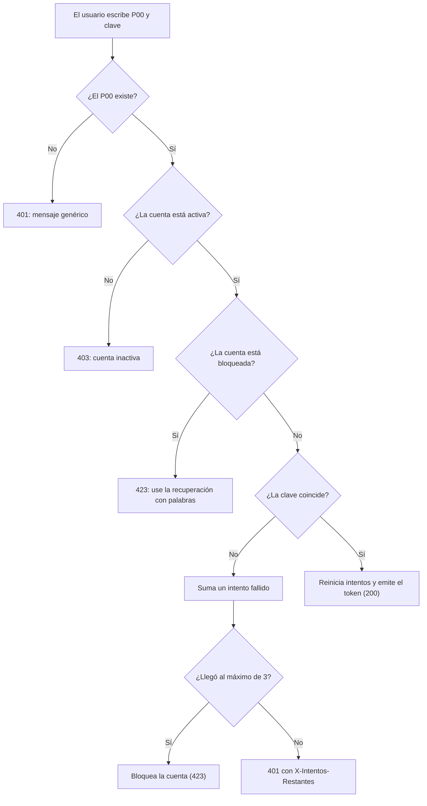
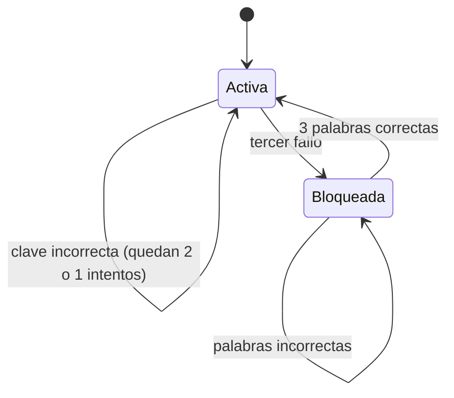
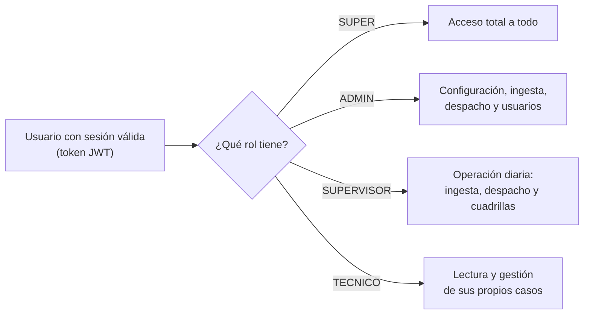

# Manual de implementación: autenticación y RBAC

> Este manual explica, con palabras sencillas, cómo GGTO reconoce a cada persona, cómo
> protege su clave y sus palabras de seguridad, qué ocurre cuando alguien se equivoca
> varias veces al escribir la clave y qué puede hacer cada tipo de usuario dentro del
> sistema. Está dirigido a técnicos de campo, supervisores y administradores de la
> Central Francisco Salias (Área 4) de CANTV. La aplicación móvil todavía no está
> desarrollada (el Ciclo 8 quedó pospuesto), por lo que por ahora el acceso se hace
> únicamente desde la interfaz web. Cuando algo aún no está cerrado, se indica con la
> frase **«pendiente de confirmar»**.
>
> **Ciclo D-67.** Este manual incorpora el alta del técnico desde la pantalla de acceso
> (enlace **«Primer acceso (obtener clave)»**), el estado de la cuenta en el listado de
> **TÉCNICOS** y la regeneración de las 12 palabras de seguridad por parte del
> **Super Usuario**.

## Empezar en 5 minutos

1. Abra GGTO en el navegador. Escriba su **P00** (el número que lo identifica como
   trabajador de CANTV) y su clave personal.
2. Presione «Iniciar sesión». Si los datos son correctos, entrará al sistema con el menú
   que corresponde a su rol.
3. Si es su **primer acceso**, pulse el enlace **«Primer acceso (obtener clave)»** que
   aparece debajo del formulario de acceso. Escriba su **P00** y pulse «Comprobar P00».
   El sistema le dirá si su supervisor ya lo dio de alta, si la cuenta ya está activa,
   si está bloqueada o si el P00 no existe.
4. Si el sistema le permite registrarse, fije su **correo** y su **clave** (mínimo 8
   caracteres, escrita dos veces). Al terminar, el sistema le mostrará
   **12 palabras de seguridad**.
5. Anote las 12 palabras en un lugar seguro: se muestran **una sola vez**. Con 3 de ellas
   podrá desbloquear su cuenta o restablecer la clave.
6. Si se equivoca 3 veces con la clave, la cuenta se bloquea. Use la opción de
   recuperación con 3 palabras de seguridad para volver a entrar.
7. Si pierde las 12 palabras, avise al **Super Usuario**: solo él ve el botón
   **«Palabras»** en el listado de técnicos y puede generar un juego **nuevo**.

| Aspecto | Pieza principal | Para qué sirve |
|---|---|---|
| Clave (contraseña) | Argon2id, un algoritmo de cifrado de claves | Guardar la clave convertida en un texto ilegible |
| Token de sesión | JWT firmado con HS256 | Recordar quién entró, sin guardar sesiones en el servidor |
| Palabras | Diccionario en español | Recuperar la cuenta |
| Primer acceso | Enlace «Primer acceso (obtener clave)» | Que el técnico cree su cuenta sin ayuda del supervisor |
| Estado de la cuenta | Distintivo de color en TÉCNICOS | Saber de un vistazo si el técnico ya tiene acceso |
| Auditoría | Tabla `auditoria` | Dejar registro del alta y de cada recuperación |
| Puntos de entrada | Direcciones web que empiezan con `/api/v1/auth` | Iniciar sesión y recuperar el acceso |
| Autorización | Reglas de FastAPI | Decidir qué puede hacer cada rol |
| Parámetros | Variables de entorno | Ajustar tiempos, intentos y límites |

## Visión general

GGTO no usa nombre de usuario ni correo para iniciar sesión: la credencial principal es el
**P00**, el identificador laboral del trabajador. El inicio de sesión se resuelve con
**P00 + clave** (requerimiento RF-20). El P00 es único en dos listas distintas: la de
técnicos y la de usuarios del sistema.

La autenticación **no guarda sesiones en el servidor**. El servidor valida las credenciales
una sola vez y entrega un **token** (una credencial temporal firmada). A partir de ahí, el
navegador envía ese token en cada petición. El modelo se apoya en tres tablas:

- `usuario`: guarda la credencial y el estado de la cuenta.
- `rol`: es el catálogo de roles disponibles.
- `dispositivo_seguridad`: guarda los hashes (las claves cifradas) de las palabras de
  recuperación.

> **Aclaratoria:** RBAC significa «control de acceso basado en roles». En otras palabras:
> cada persona recibe un rol y ese rol determina qué secciones puede ver y qué acciones
> puede ejecutar.

### Modelo P00 + clave

El inicio de sesión requiere dos datos: el P00 y la clave. El P00 también es la clave que
identifica al usuario dentro del token. La explicación de cómo viaja ese dato está en el
apartado siguiente.

#### El P00 como sujeto del token

El token lleva un campo llamado `sub` (de «subject», o sujeto) que se llena con el P00 del
usuario. En cada petición protegida, el sistema vuelve a buscar el usuario por ese P00 en
la base de datos. Por eso la sesión no confía solo en el token: el token identifica a la
persona y la base de datos confirma que la cuenta sigue existiendo, está activa y no está
bloqueada.

#### Primer inicio y recuperación

El flujo del ciclo D-67 combina cuatro momentos:

1. El **supervisor** registra el P00 en **CONFIGURACIÓN** (requerimiento RF-02). En ese
   momento el técnico todavía no tiene cuenta: en el listado aparece como **«Sin alta»**.
2. El **primer acceso** lo hace el propio técnico desde la pantalla de acceso. Primero
   consulta si su P00 está dado de alta, mediante
   `GET /api/v1/auth/primer-acceso`. Si el sistema le dice que puede registrarse, fija su
   correo, su clave y recibe las 12 palabras mediante `POST /api/v1/auth/setup`.
3. La **recuperación** se hace con 3 de esas 12 palabras, mediante
   `POST /api/v1/auth/unlock` (desbloquear) o `POST /api/v1/auth/reset-password`
   (cambiar la clave).
4. Si el técnico **pierde las 12 palabras**, el **Super Usuario** genera un juego nuevo
   con `POST /api/v1/auth/palabras/{p00}/regenerar`. Esa operación es exclusiva de `SUPER`.

La regla de oro de las palabras: el sistema guarda solo su **huella cifrada** (un *hash*).
Eso quiere decir que **nunca** puede volver a mostrarlas ni recuperarlas. Las palabras en
claro se ven **una sola vez**, en el momento en que se generan.

### Roles de la v1

La primera versión tiene cuatro roles: **SUPER**, **ADMIN**, **SUPERVISOR** y **TECNICO**.
Estos cuatro códigos se cargan automáticamente en la tabla `rol`; si ya existen, no se
duplican ni se sobreescriben.

| Código | Nombre | Para qué sirve |
|---|---|---|
| `SUPER` | Super Usuario | Acceso total a todas las secciones y funciones |
| `ADMIN` | Administrador | Configura el entorno, los usuarios y los catálogos |
| `SUPERVISOR` | Supervisor | Ingesta, despacho, cuadrillas, reportes y gestión |
| `TECNICO` | Técnico | Gestión de casos en campo |

#### Rol SUPER

El rol `SUPER` (Super Usuario) se creó para cubrir de forma permanente todas las secciones
y funciones, presentes y futuras (decisión D-50). En el sistema se reconoce con el código
`SUPER`. Su rasgo distintivo es que **no hace falta enumerarlo** en cada operación: siempre
tiene acceso total, incluso a funciones que se agreguen después.

#### Roles ADMIN, SUPERVISOR y TECNICO

Cada rol tiene un alcance distinto. La matriz completa de rol por módulo y por acción está
en el apartado «Matriz rol × módulo». Los rasgos verificables son:

- **Escribir en CONFIGURACIÓN** exige rol `ADMIN` o `SUPERVISOR`.
- La interfaz web marca la sesión como de **solo lectura** cuando el rol es `TECNICO`.
- Aun así, la autorización real la hace el servidor: una interfaz de solo lectura no
  sustituye al rechazo (`403`) del servidor.

Ejemplo práctico: un `TECNICO` puede ver el **PANEL**, buscar con el buscador global y
consultar **CASOS**, pero no puede usar el botón «Agregar caso» ni guardar cambios de
configuración.

#### Alcance por central

Cada usuario pertenece a **una central** (requerimiento RNF-21). Ese dato acota lo que
puede ver y tocar. El identificador de la central viaja además dentro del token y se
refuerza con **RLS** (Row Level Security, o «seguridad por fila»: una regla de la base de
datos que limita las filas visibles) en las tablas `caso` y `despacho`.

El rol `SUPER` no está exento de esa regla a nivel de base de datos. Su pase libre es a
nivel de las reglas de autorización de la aplicación, no a nivel de la base de datos.

## Alta y recuperación de técnicos (ciclo D-67)

Este ciclo agregó tres piezas pensadas para que el técnico no dependa de nadie para
entrar la primera vez y para que el Super Usuario pueda rescatarlo si pierde sus
palabras. Las tres se explican a continuación con el mismo lenguaje sencillo.

### Primer acceso del técnico

Antes, el supervisor debía crear el P00 y el técnico quedaba sin cuenta hasta que alguien
la creara. Ahora el propio técnico la crea. En la pantalla de acceso —debajo del
formulario de P00 y clave— hay un enlace que dice
**«Primer acceso (obtener clave)»**. Al pulsarlo, el técnico:

1. Escribe su **P00** y pulsa «Comprobar P00».
2. El sistema responde con uno de estos cinco estados:

| Lo que ve el técnico | Qué significa | Puede registrarse |
|---|---|---|
| «Su P00 está registrado y aún no tiene cuenta activada» | El supervisor ya lo dio de alta, pero todavía no tiene cuenta | **Sí** |
| «La cuenta ya está activada» | Ya tiene cuenta: debe iniciar sesión o recuperar la clave | No |
| «La cuenta está bloqueada» | Superó los intentos permitidos: debe usar 3 de sus 12 palabras | No |
| «El técnico está en estado …» | El técnico figura como inactivo, de vacaciones o suspendido | No |
| «Ese P00 no está registrado» | El supervisor todavía no lo ha creado | No |

3. Si el sistema lo deja registrarse, aparece un pequeño formulario con tres campos:
   **correo**, **clave** (mínimo 8 caracteres) y **confirmar clave**.
4. Al pulsar «Crear mi acceso y ver las 12 palabras», el sistema crea la cuenta, guarda
   la clave cifrada y muestra las **12 palabras de seguridad**.
5. El técnico debe anotarlas y pulsar «Ir al acceso» para volver a la pantalla de inicio
   de sesión. Las palabras **no se vuelven a mostrar**.

Reglas verificables de esta operación:

- La consulta previa es `GET /api/v1/auth/primer-acceso`. Es pública (no exige sesión)
  porque el técnico todavía no tiene cuenta, y tiene su propio límite de consultas para
  evitar abusos (30 consultas por minuto desde la misma dirección de red).
- El alta es `POST /api/v1/auth/setup`. Si el P00 no existe, responde `404`; si la clave
  y su confirmación no coinciden, responde `422`; y si la cuenta **ya estaba activada**,
  responde `409` con el mensaje de que inicie sesión o use sus palabras.
- Si el técnico está **inactivo** (por ejemplo, suspendido), el alta no procede y el
  sistema pide consultar con el supervisor.
- El correo se copia también a la ficha del técnico, para mantener los datos alineados.
- Cada alta queda registrada en la tabla `auditoria` con la acción
  `ALTA_PRIMER_ACCESO`.

### Estado de la cuenta en TÉCNICOS

El listado **CONFIGURACIÓN → Técnicos** tiene una columna nueva llamada **Cuenta**. Es un
distintivo de color (una etiqueta redondeada) que resume, de un vistazo, si el técnico ya
puede entrar. Sus cinco valores son:

| Distintivo | Color del distintivo | Cuándo aparece |
|---|---|---|
| **Sin alta** | Crema (ámbar) | El supervisor creó el P00, pero el técnico aún no activó su cuenta |
| **Activo** | Verde claro | La cuenta funciona y el técnico puede iniciar sesión |
| **Bloqueado** | Rojo claro | Superó los intentos de clave permitidos |
| **Cambio de clave** | Azul claro | La cuenta pide cambiar la clave antes de seguir |
| **Inactivo** | Gris | La cuenta o el técnico está desactivado |

El estado se calcula en el propio servidor y viaja en el campo `estado_cuenta` de cada
fila del listado de técnicos. La regla de decisión es sencilla: si no hay cuenta o no hay
palabras de seguridad, es **Sin alta**; después se revisa, en este orden, si está
bloqueada, si está inactiva, si exige cambio de clave y si el técnico está activo.

### Recuperación solo del Super Usuario

Si el técnico pierde sus 12 palabras, no puede desbloquear la cuenta ni cambiar la clave.
Para ese caso, el listado de técnicos tiene un botón llamado **«Palabras»**. Ese botón
**solo lo ve el Super Usuario**; ningún otro rol puede usarlo (la operación responde `403`
a cualquier rol distinto de `SUPER`).

Al pulsarlo, el sistema:

1. Genera **12 palabras nuevas** al azar.
2. Reemplaza las anteriores. Las palabras viejas **dejan de funcionar** en el acto.
3. Sube el número de versión del dispositivo de seguridad del técnico.
4. Quita el bloqueo de la cuenta y reinicia el contador de intentos fallidos.
5. Muestra las 12 palabras nuevas **una sola vez**, para que el Super Usuario se las
   entregue al técnico por un canal seguro.
6. Deja constancia en la tabla `auditoria` con la acción `REGENERAR_PALABRAS`, indicando
   quién lo pidió, para qué P00, la versión anterior de las palabras y la nueva.

Lo más importante de este apartado: **el sistema nunca puede mostrar las palabras
guardadas**. No es que no quiera: no puede. Guarda solo una **huella irreversible**
(*hash* con Argon2id) de cada palabra. Esa huella sirve para comprobar si la palabra
escrita es la correcta, pero no permite reconstruirla. Por eso la única forma de
«recuperar» unas palabras perdidas es generar un juego nuevo.

## Primitivas de seguridad

Las «primitivas de seguridad» son las piezas básicas con las que se construye la
protección: cómo se cifra la clave, cómo se arma el token, cómo se comparan las palabras y
de dónde salen esas palabras.

### Argon2id

La clave de cada usuario **nunca se guarda tal cual**. Se guarda convertida en un texto
ilegible mediante **Argon2id**, un algoritmo diseñado para que sea costoso adivinarla. Se
usa con los parámetros estándar de la librería `argon2-cffi` (requerimiento RNF-22). El
cifrador se crea una sola vez, así que todos los registros usan el mismo nivel de esfuerzo.

| Función | Qué recibe | Qué hace |
|---|---|---|
| `hash_password` | La clave en texto | Devuelve la clave cifrada con Argon2id |
| `verify_password` | La clave cifrada y la clave escrita | Dice si coinciden, sin lanzar errores |
| `needs_rehash` | La clave cifrada | Detecta si el cifrado quedó desactualizado |

`verify_password` atrapa todos los errores posibles y devuelve «no coincide» en cualquier
caso. Esto evita que un atacante deduzca información por el tipo de error. `needs_rehash`
devuelve «sí» cuando el texto cifrado es inválido, de modo que pueda regenerarse sin
fallar. La prueba automática confirma que el resultado empieza por `$argon2id$` y que dos
cifrados de la misma clave son distintos por el **sal** (un valor aleatorio que se añade a
cada cifrado).

> **Nota de alcance:** el requerimiento RNF-22 menciona también un *pepper* (un secreto
> extra que se suma antes de cifrar) y una política de complejidad, caducidad e historial
> de claves. En el código revisado solo están implementados el cifrado Argon2id y la
> validación de longitud mínima. El *pepper*, la caducidad y el historial de claves quedan
> **pendientes de confirmar**.

### JWT

El token de sesión se construye con la librería `jwt` (JSON Web Token), usando el
algoritmo configurado, `HS256` por defecto, y una clave secreta. La función que lo crea
devuelve dos cosas: el token y cuántos segundos dura.

| Campo | De dónde sale | Para qué sirve |
|---|---|---|
| `sub` | El P00 del usuario | Identifica a la persona |
| `rol` | El código del rol | Indica qué permisos tiene |
| `exp` | Momento actual más los minutos configurados | Fecha y hora de vencimiento |
| `iat` | Momento de emisión | Cuándo se creó |
| `jti` | Un valor aleatorio | Identificador único del token |
| extras | Por ejemplo, la central | Datos adicionales del usuario |

El sistema puede agregar campos extra sin cambiar la función; el inicio de sesión lo usa
para incluir la central. Al leer el token, si está vencido o es inválido se produce un
error que la autorización traduce en un `401` (no autorizado).

### Normalización de palabras

Antes de comparar una palabra de seguridad, el sistema la **normaliza**: la pasa a
minúsculas, quita los espacios de los extremos y elimina los acentos y la letra Ñ. Así,
«Árbol», «arbol» y «ARBOL » se consideran la misma palabra. La prueba automática lo
verifica con acentos y con la letra Ñ.

La normalización se usa tanto al **guardar** las palabras como al **verificarlas**. El
script que crea al Super Usuario reutiliza las mismas funciones para no divergir.

### Diccionario de palabras (`app/core/words.py`)

El diccionario es una lista de palabras sencillas en español, «sin tildes ni Ñ para
teclearlas fácil». La generación usa un generador aleatorio seguro, que garantiza palabras
únicas y difíciles de adivinar.

| Elemento | Valor real |
|---|---|
| Cantidad de palabras del diccionario | 110 palabras |
| Cantidad de palabras por dispositivo | 12 |
| Cantidad requerida para recuperar | 3 |
| Generador | Selección aleatoria segura (`secrets.SystemRandom().sample`) |

La función que genera las palabras valida que no se pidan más de las disponibles y lanza un
error si ocurre. La prueba automática comprueba que se generan 12 palabras, todas distintas
y en minúsculas. El primer inicio genera exactamente esas 12 palabras.

## Endpoints de autenticación

Un «endpoint» es una dirección web que el sistema atiende. Este grupo de direcciones usa el
prefijo `/api/v1/auth` y la etiqueta «autenticación». Son parte de las **79 direcciones**
publicadas en la documentación técnica del proyecto.

### POST /api/v1/auth/login

Es la operación de inicio de sesión. Recibe el P00 y la clave, y devuelve el token. La
secuencia real es:

1. Aplica un **límite de ritmo** por combinación de P00 e IP (dirección de red del equipo).
2. Busca al usuario por su P00. Si no existe, responde `401` con un mensaje genérico.
3. Si la cuenta está inactiva, responde `403`.
4. Si la cuenta está bloqueada, responde `423` e indica que use la recuperación.
5. Si la clave no coincide, suma un intento fallido. Al llegar al máximo, marca la cuenta
   como bloqueada. Responde `401` o `423` según el caso e incluye la cabecera
   `X-Intentos-Restantes` con los intentos que quedan.
6. Si la clave coincide, reinicia el contador de intentos, desbloquea la cuenta y emite el
   token.

<!-- GENERAR_IMAGEN: flujo-login-p00.svg -->

### GET /api/v1/auth/me

Devuelve los datos de la persona que está conectada. No recibe parámetros: depende por
completo de la cabecera de autorización. La respuesta incluye el código del rol y el nombre
del técnico asociado, si existe. Es la operación que la interfaz web usa para comprobar que
la sesión guardada sigue siendo válida.

### POST /api/v1/auth/setup

Es el **primer inicio**. Fija la clave del P00 y genera las 12 palabras. El P00 debe existir
previamente, creado por el supervisor (requerimiento RF-02). El comportamiento es:

- Si la clave y su confirmación no coinciden, responde `422`.
- Si el P00 no está registrado, responde `404`.
- Cifra las 12 palabras ya normalizadas.
- Actualiza la clave del usuario, su correo, sus intentos y sus banderas de estado.
- Crea o actualiza el dispositivo de seguridad, sube su número de versión y lo desbloquea.
- Sincroniza el correo del técnico asociado, si existe.
- Devuelve las palabras **en claro** para que el usuario las guarde. Es la única vez que se
  muestran.

### GET /api/v1/auth/primer-acceso

Es la consulta previa del enlace **«Primer acceso (obtener clave)»**. Recibe el P00 como
parámetro y no exige sesión, porque quien la usa todavía no tiene cuenta. Devuelve un
«estado» y un mensaje pensado para mostrarse tal cual al técnico:

| Estado | Significado |
|---|---|
| `INEXISTENTE` | El P00 no está registrado; debe hablar con su supervisor |
| `PENDIENTE` | El supervisor ya lo dio de alta y todavía no tiene cuenta: **puede registrarse** |
| `ACTIVO` | La cuenta ya está activada; debe iniciar sesión o recuperar la clave |
| `BLOQUEADO` | La cuenta está bloqueada; debe usar 3 de sus 12 palabras |
| `INACTIVO` | El técnico está suspendido, de vacaciones o inactivo; debe consultar al supervisor |

La respuesta incluye el nombre del técnico (si existe) y una marca
`puede_registrarse` que es verdadera solo en el estado `PENDIENTE`. La operación tiene su
propio límite: 30 consultas por minuto desde la misma dirección de red.

### POST /api/v1/auth/palabras/{p00}/regenerar

Es la recuperación de último recurso, **exclusiva del Super Usuario**. Genera 12 palabras
nuevas para el P00 indicado, reemplaza las anteriores (que dejan de funcionar),
desbloquea la cuenta, reinicia los intentos fallidos y devuelve las palabras nuevas
**una sola vez**. Si el P00 no tiene cuenta de acceso, responde `404`. Cada ejecución
queda registrada en `auditoria`.

### POST /api/v1/auth/unlock

Desbloquea una cuenta usando 3 de las 12 palabras. Si el P00 no existe, responde `404`. Si
las palabras no son correctas, responde `401`. Si todo está bien, quita el bloqueo, reinicia
el contador de intentos fallidos y desbloquea también el dispositivo de seguridad.

### POST /api/v1/auth/reset-password

Restablece la clave usando 3 de las 12 palabras. Reutiliza la misma verificación de palabras
y responde `404` o `401` en los mismos casos. Al validar, reemplaza la clave cifrada por la
nueva, desbloquea la cuenta y limpia la marca que obligaba a cambiar la clave.

### Esquemas Pydantic

Los «esquemas Pydantic» son los contratos de datos: definen qué campos se aceptan, cuáles
son obligatorios y qué límites tienen antes de que la operación llegue a la lógica de
negocio.

| Esquema | Restricciones reales |
|---|---|
| `LoginRequest` | El P00 tiene entre 3 y 20 caracteres; la clave, entre 4 y 128 |
| `UsuarioOut` | P00, correo, rol, identificador de rol, central, nombre y apellido |
| `TokenResponse` | Token, tipo `bearer`, segundos de vigencia y datos del usuario |
| `PalabraPosicion` | La posición va de 1 a 12; el valor, de 1 a 40 caracteres |
| `UnlockRequest` | Exactamente 3 palabras |
| `ResetPasswordRequest` | 3 palabras y una clave nueva de 8 a 128 caracteres |
| `SetupRequest` | Correo de 5 a 120 caracteres; clave y confirmación de 8 a 128 |
| `SetupResponse` | Las palabras y el aviso de guardarlas |
| `PrimerAccesoOut` | P00, si está registrado, el estado, si puede registrarse, el nombre y el mensaje |
| `RegenerarPalabrasRequest` | El P00 del técnico (de 3 a 20 caracteres) |
| `RegenerarPalabrasResponse` | Las 12 palabras nuevas y el aviso de entregarlas por un canal seguro |

> La cantidad exacta de 3 palabras se impone en el contrato. En cambio, el parámetro
> `palabras_requeridas` existe en la configuración pero **no se consulta** en la operación
> de recuperación. Se documenta el hecho: hoy el número está fijado por el contrato, no por
> el parámetro.

## Bloqueo y rate limiting

El **rate limiting** (límite de ritmo) es un freno que impide que alguien haga muchísimas
peticiones seguidas. El **bloqueo** es distinto: deja la cuenta fuera de servicio hasta que
se recupere con las palabras de seguridad.

### max_intentos, palabras_requeridas y rate limit

Estos parámetros se leen de variables de entorno (valores de configuración del servidor) y
quedan disponibles como ajustes del sistema.

| Parámetro | Valor por defecto | Para qué sirve |
|---|---|---|
| `access_token_minutes` | 480 (8 horas) | Cuánto dura el token |
| `max_intentos` | 3 | Intentos permitidos antes del bloqueo |
| `palabras_seguridad` | 12 | Palabras generadas por dispositivo |
| `palabras_requeridas` | 3 | Palabras exigidas para recuperar |
| `rate_limit_intentos` | 10 | Peticiones permitidas por ventana |
| `rate_limit_ventana_seg` | 60 | Tamaño de la ventana, en segundos |

El bloqueo efectivo se decide en el inicio de sesión: cada fallo suma un intento y, al
llegar a `max_intentos`, la cuenta queda bloqueada. Los intentos restantes viajan en la
cabecera `X-Intentos-Restantes`. La prueba automática comprueba que el primer fallo informa
2 intentos restantes y que el tercero responde `423` incluso si después se escribe la clave
correcta.

> En la tabla de configuración también existe la clave `seguridad.max_intentos` con valor 3.
> El código de autenticación revisado no lee ese valor de la base de datos: usa la
> configuración del servidor. La duplicación queda **pendiente de confirmar**, por si se
> desea un único origen del dato.

### Mecanismo del rate limiting

El limitador vive **en la memoria del proceso**, no está distribuido entre varios servidores.
Se apoya en un diccionario de marcas de tiempo. Una función descarta las marcas que quedaron
fuera de la ventana y responde `429` (demasiadas peticiones) al superar el máximo. La clave
del cajón es la combinación `P00|IP`, de modo que una ráfaga contra el mismo P00 desde la
misma dirección de red se frena sin afectar a los demás usuarios.

<!-- GENERAR_IMAGEN: bloqueo-intentos.svg -->

| Evento | Respuesta del sistema |
|---|---|
| Supera 10 intentos en 60 segundos | `429 Too Many Requests` |
| P00 inexistente | `401` genérico |
| Usuario inactivo | `403` |
| Usuario bloqueado | `423 Locked` |
| Clave incorrecta | `401` con `X-Intentos-Restantes` |
| Tercer fallo | `423` y cuenta bloqueada |

### Recuperación del bloqueo

El desbloqueo **no depende del paso del tiempo ni de un administrador**: se resuelve con las
palabras de seguridad. El sistema recorre las posiciones enviadas, calcula el índice
correspondiente, valida el rango y compara el cifrado guardado. Si alguna posición o palabra
falla, devuelve «no coincide». Las pruebas cubren el desbloqueo correcto, el rechazo con
palabras incorrectas y el restablecimiento de la clave.

Si el técnico **perdió sus 12 palabras**, el desbloqueo con palabras ya no es posible. En ese
caso, el **Super Usuario** genera un juego nuevo desde el botón «Palabras» del listado de
técnicos (ciclo D-67).

## Sesión y token

### Vigencia de 8 horas

El token dura **480 minutos** por defecto, es decir, una jornada de 8 horas. El vencimiento
se calcula sumando esos minutos al momento de emisión y también se informa en segundos. La
prueba automática inyecta 5 minutos y comprueba que el vencimiento da 300 segundos.

La duración es configurable por entorno. En el código revisado **no existe** un mecanismo
de rotación (cambio periódico) ni de revocación (anulación) de tokens distinto del bloqueo
de la cuenta: el identificador único del token se genera, pero no se guarda en ninguna tabla
de sesiones. La rotación y la revocación de sesión que menciona el requerimiento RNF-22
quedan **pendientes de confirmar**.

### X-Request-ID y observabilidad

Toda petición pasa por un componente de observabilidad. Ese componente lee la cabecera
`X-Request-ID` enviada por el cliente o genera un identificador propio, y lo reescribe en la
respuesta. También anota en la bitácora el método, la ruta, el código de estado y la duración
en milisegundos, y registra las excepciones con el mismo identificador. El componente se
agrega antes que la configuración de CORS (intercambio de datos entre sitios), de modo que la
cabecera está presente también en las respuestas de error.

### Expiración y cierre de sesión en la SPA

La **SPA** (Single Page Application, o «aplicación de una sola página») guarda el token y los
datos del usuario en el almacenamiento local del navegador, bajo las claves `ggto_token` y
`ggto_usuario`. En cada llamada, el cliente adjunta la cabecera de autorización con el token
si existe.

Al abrir la página, el proveedor de autenticación vuelve a validar el token consultando los
datos del usuario. Si la llamada falla, borra la sesión y deja al usuario sin identificar. El
inicio de sesión guarda el token y actualiza el estado; el cierre de sesión borra lo
guardado.

### Almacenamiento del token

| Elemento | Valor |
|---|---|
| Clave del token en el almacenamiento local | `ggto_token` |
| Clave del usuario en el almacenamiento local | `ggto_usuario` |
| Cabecera de autorización | `Bearer` |
| Operación de revalidación | `GET /api/v1/auth/me` |

> Guardar el token en el almacenamiento local es vulnerable a **XSS** (un ataque que inserta
> código malicioso en la página). El endurecimiento previsto en el requerimiento RNF-22
> incluye protección **CSRF/CORS** (frenos contra peticiones falsificadas desde otros
> sitios). Una revisión específica de XSS y CSRF sobre la interfaz web queda **pendiente de
> confirmar**.

## RBAC

El **RBAC** es el control de acceso basado en roles: cada persona tiene un rol y ese rol
decide qué puede ver y qué puede cambiar. El punto de partida es siempre una sesión válida;
después se comprueba el rol.

<!-- GENERAR_IMAGEN: rbac-roles.svg -->

### get_current_user

Es la regla base de autenticación. Usa un esquema de seguridad que permite responder con un
mensaje propio en vez del error automático. Su lógica es:

1. Si no hay credencial, responde `401` (credenciales inválidas).
2. Descifra el token y convierte cualquier error en `401`.
3. Extrae el P00. Si falta, responde `401`.
4. Busca al usuario por su P00. Si no existe o no está activo, responde `401`.
5. Si está bloqueado, responde `423`.

La respuesta de `401` incluye la cabecera `WWW-Authenticate: Bearer`. Esta regla se usa
directamente en operaciones de solo lectura, por ejemplo al listar las centrales.

### require_roles y bypass SUPER

`require_roles` es una **fábrica de reglas**: recibe los códigos de rol aceptados y devuelve
la función que hace la comprobación. Su decisión es:

- Si el usuario no tiene rol asociado, responde `403`.
- Si el código del rol es `SUPER` **o** está entre los roles indicados, permite el paso.
- En cualquier otro caso, responde `403` con «No tiene permisos para esta operación».

El **bypass** (pase libre) del Super Usuario no requiere enumerarlo en cada operación, tal
como exige la decisión D-50. El patrón típico es declarar una vez la regla de escritura para
`ADMIN` y `SUPERVISOR`, y aplicarla en cada operación que modifica datos.

La **regeneración de palabras** del ciclo D-67 es una excepción deliberada: declara como
único rol permitido `SUPER`. Por eso ni `ADMIN` ni `SUPERVISOR` pueden usarla, aunque sí
puedan dar de alta técnicos.

### Matriz rol × módulo

La matriz oficial de la primera versión cruza cada módulo con los cuatro roles. Se reproduce
de forma resumida, respetando el documento de requerimientos:

| Módulo o acción | SUPER | ADMIN | SUPERVISOR | TECNICO |
|---|---|---|---|---|
| CONFIGURACIÓN (central, sectores, catálogos, usuarios, flota, cuadrillas) | Completo | Completo | Lectura y edición operativa | — |
| INGESTA (cargar y procesar CSV) | Completo | Completo | Completo | — |
| PANEL (buscar, editar, alta manual) | Completo | Completo | Completo | Lectura de sus casos |
| CASOS / SEGUIMIENTO / EMPRESAS / REFERIDOS | Completo | Completo | Completo | Lectura y gestión de su cuadrilla |
| DESPACHO (armar, publicar, reporte de las 16:00) | Completo | Completo | Completo | Lectura de su despacho |
| GESTIÓN (cuadrilla 0) | Completo | Completo | Completo | — |
| MONITOREO / GRÁFICOS | Lectura | Lectura | Lectura | — |
| GESTIÓN TÉCNICA (contactar, atender, cerrar, enrutar, diferir, evidencias) | Completo | — | Lectura | Completo (solo sus casos y sin conexión) |
| ALERTAS (falla masiva, incidentes, solicitud de material) | Completo | Lectura | Lectura | Completo |
| INSUMOS (versión 2) | Completo | Completo | Completo | Solicitud |
| AUDITORÍA | Lectura | Lectura | — | — |
| ESTADO DE LA CUENTA (columna Cuenta) | Lectura | Lectura | Lectura | — |
| RECUPERACIÓN DE PALABRAS (botón «Palabras») | Completo | — | — | — |
| USUARIOS y accesos | Completo | Completo | Alta y baja de técnicos | — |

Cada usuario pertenece a una central y el alcance se refuerza con la seguridad por fila. La
columna `SUPER` es siempre acceso total porque ese rol no se enumera en las operaciones.

> **Sobre las notificaciones de ALERTAS:** los canales previstos son **Telegram, correo
> electrónico y MCP** (un canal de integración con otras herramientas). WhatsApp no existe en
> la versión 1. En producción, Telegram y el correo **todavía no tienen credenciales
> cargadas**, por lo que los envíos quedan **PENDIENTES en la bandeja de salida** (patrón
> *outbox*: primero se guarda el mensaje y luego se intenta enviar). Hoy no se puede afirmar
> que esas alertas ya notifiquen.

> El requerimiento RNF-22 exige **MFA obligatorio para ADMIN y SUPERVISOR** (segundo factor
> de autenticación, es decir, una comprobación adicional además de la clave). El código
> revisado implementa únicamente P00 + clave + 12 palabras; no se encontró un segundo factor.
> El MFA queda **pendiente de confirmar**.

### Aplicación en los routers

| Patrón | Significado | Ejemplo real |
|---|---|---|
| Sesión válida | Solo exige haber iniciado sesión | Listar centrales |
| Regla de escritura | Exige ADMIN o SUPERVISOR (o SUPER) | Crear o modificar datos de configuración |
| Fábrica de roles | Define qué roles pueden escribir | La regla que declara ADMIN y SUPERVISOR |

## Super Usuario

### Creación con `scripts/inyectar_super_usuario.py`

El Super Usuario se crea con un script (un programa de apoyo) explícito, que se puede
ejecutar varias veces sin duplicar datos y que pide confirmación. El script:

- Reutiliza exactamente las mismas funciones de cifrado y de palabras que la aplicación.
- Busca el rol `SUPER`. Si no existe en el catálogo, lo crea. El catálogo normalmente ya lo
  trae cargado.
- Busca la central indicada o, si no se indica, la primera que esté activa.
- Crea o actualiza la ficha del técnico y la cuenta de usuario, con la cuenta activa, sin
  bloqueo y con el contador de intentos en cero.
- Opcionalmente genera y guarda las 12 palabras de seguridad.
- Registra cada ejecución en un archivo de bitácora dentro de la carpeta de operaciones.
- Admite un modo de simulación, que deshace los cambios en lugar de confirmarlos, y una
  opción para omitir la confirmación interactiva.

### Manejo de la clave

La clave **nunca** se escribe en el archivo ni en la línea de comandos. Se lee de la variable
de entorno indicada o se solicita de forma oculta en pantalla. Se exige una longitud mínima
de 8 caracteres, salvo en el modo de simulación. En este manual solo se documenta el
**nombre** de la variable de entorno, nunca su valor.

### Palabras en dispositivo_seguridad

Las palabras se guardan únicamente como textos cifrados (hashes) en un campo de tipo JSONB
(un formato de datos que la base de datos guarda como objeto) dentro de la tabla
`dispositivo_seguridad`. El modelo incluye además una referencia a una clave privada, un
documento cifrado, la marca de bloqueo y el número de versión.

El script inserta o actualiza el registro e incrementa la versión. El primer acceso hace lo
mismo desde la aplicación y también incrementa la versión. Cuando el Super Usuario regenera
las palabras (D-67), reemplaza la lista completa de huellas, sube otra vez la versión y
desbloquea el dispositivo. En todos los casos, las palabras en claro se muestran **una sola
vez**.

### Verificación y bitácora

Después de confirmar los cambios, el script ejecuta una consulta de verificación que une las
tablas de usuario, rol y técnico, y registra el resultado. La existencia del rol y su efecto
fueron verificados en producción según la decisión D-50. El detalle de las credenciales
usadas no se reproduce aquí por tratarse de datos sensibles.

## Pruebas

El resultado global de la Fase 4 fue de **169 pruebas de `pytest` aprobadas de 169** y
**46 pruebas E2E de Playwright aprobadas de 46**, con `ruff`, `mypy` y `tsc` en modo estricto
sin hallazgos. Las pruebas que tocan base de datos usan la variable `DB_SCHEMA` para trabajar
en esquemas aislados: `ggto_test` para `pytest` y `ggto_e2e` para Playwright. Así no se
tocan los datos reales.

### `app/tests/test_auth.py`

Es la prueba de integración del Ciclo 1: inicio de sesión, bloqueo, recuperación y sesiones.
Requiere base de datos; si la variable de conexión de pruebas no está definida, las pruebas
de integración se omiten.

| Prueba | Qué verifica |
|---|---|
| `test_login_correcto` | Respuesta `200`, tipo `bearer` y rol `TECNICO` |
| `test_login_p00_inexistente` | Respuesta `401` |
| `test_rate_limit_bloquea_rafagas` | Que aparece `429` |
| `test_login_clave_incorrecta` | `401` y `X-Intentos-Restantes = 2` |
| `test_bloqueo_a_los_tres_intentos` | El tercer intento da `423` y el bloqueo persiste |
| `test_setup_genera_doce_palabras` | Se generan 12 palabras y luego se puede iniciar sesión |
| `test_setup_confirmacion_no_coincide` | Respuesta `422` |
| `test_desbloqueo_con_tres_palabras` | Respuesta `200` y cuenta desbloqueada |
| `test_desbloqueo_con_palabras_incorrectas` | Respuesta `401` |
| `test_me_requiere_token` | `401` sin token y `200` con token |
| `test_restablecer_clave_con_palabras` | La clave nueva queda operativa |
| `test_primer_acceso_p00_inexistente` | Un P00 sin registrar responde `INEXISTENTE` y no puede registrarse |
| `test_autoalta_del_tecnico` | El listado muestra «Sin alta», el técnico crea su cuenta, recibe 12 palabras y pasa a «Activo» |
| `test_estado_cuenta_bloqueado_tras_intentos` | Tras 3 fallos, la columna Cuenta muestra «Bloqueado» |
| `test_regenerar_palabras_solo_super_usuario` | ADMIN y TECNICO reciben `403`; el SUPER obtiene 12 palabras nuevas y queda registro en `auditoria` |

El informe de Fase 4 registra 11 pruebas en este archivo, más las **cuatro pruebas del ciclo
D-67** que se acaban de listar (15 en total en el archivo actual).

### `app/tests/test_security.py`

Son pruebas unitarias que **no requieren base de datos**: cifrado y verificación Argon2id,
salado, normalización de palabras, ida y vuelta del token, token inválido y generación de
palabras. El informe de Fase 4 registra 6 pruebas.

### RBAC de la SPA

En el navegador, el proveedor de autenticación expone tres datos: si la persona está
autenticada, si la sesión está cargando y si la sesión es de solo lectura. Este último se
calcula como «el rol es TECNICO».

Las páginas de CONFIGURACIÓN usan esa marca para ocultar formularios y botones de escritura;
por ejemplo, en Centrales, Sectores y Técnicos. El componente que protege las rutas privadas
muestra «Validando sesión…» mientras comprueba la sesión y, si no hay sesión, redirige al
inicio de sesión. Las pruebas del servidor verifican además que un `TECNICO` recibe `403` al
crear flota y `200` al leer centrales.

> La interfaz oculta los controles, pero la autorización real ocurre en la aplicación. Cada
> operación nueva debe declarar su regla de permisos; de lo contrario quedaría accesible para
> cualquier sesión válida.
