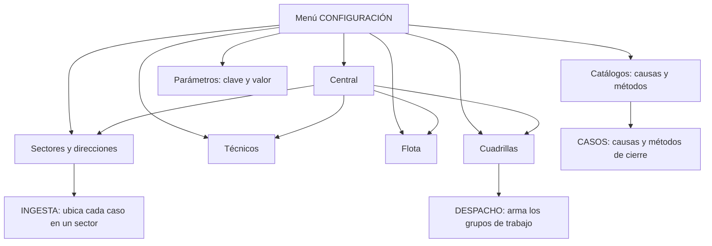

# Manual de implementación: módulo CONFIGURACIÓN

> Este manual explica, con palabras sencillas, cómo funciona el módulo **CONFIGURACIÓN** de
> GGTO: la sección donde se registran la central, los sectores, los técnicos, la flota, las
> cuadrillas, los catálogos y los parámetros del sistema. Está dirigido a supervisores y
> administradores de la Central Francisco Salias (Área 4) de CANTV, y también sirve de
> consulta para técnicos de campo. La aplicación móvil todavía no está desarrollada (el
> Ciclo 8 quedó pospuesto), así que la configuración se hace desde la interfaz web. Cuando
> algo no pudo comprobarse, se indica con la frase **«pendiente de confirmar»**.

## Empezar en 5 minutos

1. Entre a GGTO con su P00 y su clave. Abra la sección **CONFIGURACIÓN** desde el menú.
2. Si su rol es **Técnico**, verá las páginas en modo solo lectura: podrá consultar, pero no
   guardar cambios. Para escribir se necesita rol **Administrador** o **Supervisor**.
3. Empiece por lo básico: revise que la **central** exista y esté activa. Después cargue los
   **sectores** con sus direcciones (los patrones de texto que sirven para ubicar cada caso).
4. Continúe con los **técnicos**, la **flota** de vehículos y las **cuadrillas** (los grupos
   de trabajo con su vehículo y sus herramientas).
5. Al terminar, revise los **catálogos** (causas y métodos) y los **parámetros**. Casi todo
   se desactiva en lugar de borrarse: así no se pierde el historial.

## Visión general

### Alcance funcional (RF-02, RF-03, RF-04, RF-38)

El módulo CONFIGURACIÓN agrupa **CENTRAL**, **TÉCNICOS**, **FLOTA** y **CUADRILLA**. Además
atiende los requisitos de autorización por rol (RNF-21). Los requerimientos que cubre son:

| Identificador | Requerimiento |
|---|---|
| RF-02 | Crear perfiles y accesos de los trabajadores (alta, edición, roles y credenciales) |
| RF-03 | Gestionar las flotas (los vehículos de la central) |
| RF-04 | Gestionar las cuadrillas (trabajadores, flota y herramientas) |
| RF-38 | Configurar la central y los sectores de trabajo |

> **Aclaratoria sobre RF-05:** «Gestionar insumos» está marcado explícitamente «Para una
> 2.ª versión» y pertenece al módulo INSUMOS, no a CONFIGURACIÓN. Por eso este manual no
> describe operaciones de insumos: no forman parte del alcance implementado del módulo.

### Estructura del router y convenciones

Un **router** es el conjunto de direcciones web que atiende un módulo. El de configuración usa
el prefijo `/api/v1` y la etiqueta «configuración». Sobre esa base se definen tres reglas
comunes:

- **Escritura restringida:** solo `ADMIN` y `SUPERVISOR` pueden crear, modificar o desactivar.
- **Error 404 uniforme:** cuando un recurso no existe, se responde siempre con el mismo
  formato y con el nombre del recurso.
- **Error 409 uniforme:** cuando hay un choque de datos (por ejemplo, un código repetido), se
  deshace el intento y se responde con un mensaje claro.

<!-- GENERAR_IMAGEN: mapa-configuracion.svg -->

### RBAC de escritura

El RBAC es el control de acceso por roles. Cada operación de lectura exige una sesión válida;
cada operación de escritura exige rol `ADMIN` o `SUPERVISOR`. Se puede comprobar en cualquier
pareja de operaciones:

| Operación | Quién puede |
|---|---|
| Listar centrales | Cualquier usuario con sesión válida |
| Crear central | ADMIN o SUPERVISOR |
| Crear sector | ADMIN o SUPERVISOR |
| Crear técnico | ADMIN o SUPERVISOR |
| Crear cuadrilla | ADMIN o SUPERVISOR |
| Crear causa | ADMIN o SUPERVISOR |
| Actualizar parámetro | ADMIN o SUPERVISOR |

El detalle del mecanismo de roles está en el manual de autenticación y RBAC. En resumen: la
regla concede la operación a los roles enumerados y también al rol `SUPER`.

### Desactivación lógica (soft delete)

Ningún recurso se borra físicamente desde estas operaciones: se marca un estado. Esto se
llama **desactivación lógica** o *soft delete*. Así se conserva el historial y no se rompen
las relaciones con otros datos.

| Recurso | Qué pasa al «eliminar» |
|---|---|
| Central | Pasa a inactiva |
| Sector | Pasa a inactivo |
| Técnico | Pasa a estado «INACTIVO» |
| Flota | Pasa a «FUERA_SERVICIO» |
| Causa | Pasa a inactiva |

Las relaciones de cuadrilla sí se cierran por fecha: se registra la fecha de salida del
integrante. La única eliminación física del módulo es la de una dirección de sector.

## Endpoints por recurso

Un **endpoint** es una dirección web que el sistema atiende. Esta sección recorre las
operaciones de cada recurso.

### central

| Operación | Qué hace |
|---|---|
| `GET /api/v1/central` | Lista ordenada por identificador; permite ver solo las activas |
| `POST /api/v1/central` | Crea una central y responde `201` |
| `GET /api/v1/central/{id_central}` | Obtiene una central o responde `404` |
| `PATCH /api/v1/central/{id_central}` | Actualiza solo los campos enviados |
| `DELETE /api/v1/central/{id_central}` | Desactiva y responde `204` |

El listado aplica el filtro de «solo activas». La creación delega el choque de código
duplicado al mensaje «el código de central ya existe». La actualización parcial solo escribe
los campos que se envían.

### sectores y sector_direccion

| Operación | Qué hace |
|---|---|
| `GET /api/v1/sectores` | Ordena por prioridad y nombre; filtra por central y por activos |
| `POST /api/v1/sectores` | Crea el sector con sus direcciones; responde `201` |
| `GET /api/v1/sectores/{id_sector}` | Obtiene un sector o responde `404` |
| `PATCH /api/v1/sectores/{id_sector}` | Actualiza solo los campos enviados |
| `DELETE /api/v1/sectores/{id_sector}` | Desactiva y responde `204` |
| `POST /api/v1/sectores/{id_sector}/direcciones` | Agrega un patrón de dirección; responde `201` |
| `DELETE /api/v1/sectores/{id_sector}/direcciones/{id_direccion}` | Elimina el patrón; responde `204` |

La creación primero valida que la central exista y luego separa las direcciones del resto de
los campos. El modelo declara la relación de forma que el sector pueda devolver sus
direcciones. Al eliminar una dirección se verifica que pertenezca al sector indicado; si no,
responde `404`.

### tecnicos

| Operación | Qué hace |
|---|---|
| `GET /api/v1/tecnicos` | Ordena por nombre y apellido; filtra por central y estado |
| `POST /api/v1/tecnicos` | Valida la central y crea; responde `201` |
| `GET /api/v1/tecnicos/{id_tecnico}` | Obtiene un técnico o responde `404` |
| `PATCH /api/v1/tecnicos/{id_tecnico}` | Actualiza solo los campos enviados |
| `DELETE /api/v1/tecnicos/{id_tecnico}` | Pasa a «INACTIVO» y responde `204` |

El filtro de estado usa el nombre real de la columna (`status`). La creación valida la
central y avisa del choque de P00 o cédula duplicados.

### flota

| Operación | Qué hace |
|---|---|
| `GET /api/v1/flota` | Ordena por CAN; filtra por central |
| `POST /api/v1/flota` | Valida la central y crea; responde `201` |
| `GET /api/v1/flota/{id_flota}` | Obtiene un vehículo o responde `404` |
| `PATCH /api/v1/flota/{id_flota}` | Actualiza solo los campos enviados |
| `DELETE /api/v1/flota/{id_flota}` | Pasa a «FUERA_SERVICIO» y responde `204` |

El choque de CAN o placa duplicados se traduce en `409`. Los dos campos son únicos en el
esquema de la base de datos.

### cuadrillas (integrantes y herramientas)

| Operación | Qué hace |
|---|---|
| `GET /api/v1/cuadrillas` | Ordena por código; filtra por central y por activas |
| `POST /api/v1/cuadrillas` | Crea con integrantes y herramientas; responde `201` |
| `GET /api/v1/cuadrillas/{id_cuadrilla}` | Obtiene una cuadrilla o responde `404` |
| `PATCH /api/v1/cuadrillas/{id_cuadrilla}` | Actualiza solo los campos enviados |
| `POST /api/v1/cuadrillas/{id_cuadrilla}/integrantes` | Incorpora un técnico; responde `201` |
| `DELETE /api/v1/cuadrillas/{id_cuadrilla}/integrantes/{id_tecnico}` | Cierra la pertenencia; responde `204` |

La creación separa los integrantes y las herramientas del resto de los campos. Las filas de
integrantes se arman con fecha de inicio de hoy y las de herramientas con la fecha y hora de
asignación. Al incorporar un integrante se validan la cuadrilla y el técnico. El retiro busca
la fila **activa**, responde `404` si no existe y, si existe, fija la fecha de salida en hoy.

No hay operación para borrar una cuadrilla: se desactiva cambiando su marca de activa a
falso.

> Las rutas de direcciones de sector e integrantes de cuadrilla existen en el sistema con sus
> direcciones reales, aunque el inventario resumido de endpoints no las desglose. Se
> documentan aquí porque son parte verificable del contrato.

### catalogos (causas y metodos)

| Operación | Qué hace |
|---|---|
| `GET /api/v1/catalogos/causas` | Ordena por código y subcódigo; por defecto solo activos |
| `POST /api/v1/catalogos/causas` | Crea una causa; responde `201` |
| `DELETE /api/v1/catalogos/causas/{id_causa}` | Desactiva la causa; responde `204` |
| `GET /api/v1/catalogos/metodos` | Ordena por dominio y código; filtra por dominio |
| `POST /api/v1/catalogos/metodos` | Crea un método; responde `201` |

Las causas se filtran por activas cuando se pide «solo activos», que es el valor por defecto.
Los métodos se filtran por dominio. La carga inicial del esquema trae 9 métodos repartidos en
los dominios `CIERRE`, `ENRUTE`, `CONTACTO` y `DIFERIDO`. El catálogo de causas se puebla
desde la ingesta del CSV; la carga inicial del esquema no trae causas.

### configuracion (clave/valor)

| Operación | Qué hace |
|---|---|
| `GET /api/v1/configuracion` | Lista todos los parámetros ordenados por clave |
| `PUT /api/v1/configuracion/{clave}` | Actualiza el valor y, si se envía, la descripción |

El parámetro se busca por su clave. Si no existe, responde `404`. El valor es de tipo libre
(`Any` en el contrato), porque la columna es JSONB. La carga inicial del esquema trae 23
parámetros, entre ellos `ingesta.central_codigo`, `despacho.hora_reporte`,
`despacho.min_referidos`, `fallas.umbral_casos`, `outbox.max_intentos` y
`seguridad.max_intentos`.

> **Sobre los avisos pendientes:** el parámetro `outbox.max_intentos` controla cuántas veces
> se reintenta enviar un mensaje guardado en la **bandeja de salida** (*outbox*). Los canales
> previstos son **Telegram, correo electrónico y MCP** (un canal de integración con otras
> herramientas); WhatsApp no existe en la versión 1. En producción, Telegram y el correo
> **todavía no tienen credenciales cargadas**, así que los envíos quedan **PENDIENTES** en
> esa bandeja. Hoy no se puede afirmar que ya notifiquen.

## Esquemas de entrada/salida (`app/schemas/config.py`)

Los **esquemas** son los contratos de datos: definen qué campos se aceptan al crear o
actualizar y qué campos se devuelven al consultar.

### Central y sectores

| Esquema | Campos relevantes |
|---|---|
| `CentralBase` | Región, estado geográfico, municipio, parroquia, área, código, nombre y si está activa |
| `CentralCreate` | Hereda todos los campos de `CentralBase` |
| `CentralUpdate` | Todos los campos son opcionales (actualización parcial) |
| `CentralOut` | Agrega el identificador de la central |
| `SectorDireccionCreate` | Patrón, tipo de coincidencia (`CONTIENE`, `EXACTO` o `REGEX`), normalizar y activo |
| `SectorCreate` | Central, nombre, código, prioridad de 1 a 999 y lista de direcciones |
| `SectorOut` | Incluye la lista de direcciones del sector |

La prioridad del sector se declara entre 1 y 999. La salida de dirección de sector es la
única que expone su propio identificador y el del sector al que pertenece.

### Técnicos, flota y cuadrillas

| Esquema | Detalle |
|---|---|
| `STATUS_TECNICO` | Valores permitidos: `ACTIVO`, `INACTIVO`, `VACACIONES`, `SUSPENDIDO` |
| `TecnicoCreate` | Central, nombre, P00 y estado |
| `TecnicoUpdate` | No incluye el P00: no es editable |
| `STATUS_FLOTA` | Valores permitidos: `DISPONIBLE`, `EN_RUTA`, `MANTENIMIENTO`, `FUERA_SERVICIO` |
| `FlotaCreate` | CAN, tipo, marca, modelo, placa, combustible y estados |
| `ROL_CUADRILLA` | Valores permitidos: `REPARADOR_PRINCIPAL`, `AYUDANTE`, `SUPERVISOR` |
| `CuadrillaCreate` | Código, nombre, vehículo, integrantes y herramientas |
| `CuadrillaOut` | Incluye la lista de integrantes |

`TecnicoUpdate` no expone el P00, y la interfaz deshabilita ese campo al editar. La
actualización de cuadrilla tampoco permite cambiar la central ni los integrantes: solo el
código, el nombre, el vehículo, la marca de supervisora y la marca de activa.

### Catálogos y parámetros

| Esquema | Detalle |
|---|---|
| `CausaCreate` | Código, subcódigo, descripciones, tipo y activa |
| `MetodoCreate` | Dominio restringido a `CIERRE`, `ENRUTE`, `DIFERIDO` o `CONTACTO` |
| `ConfiguracionOut` | Clave, valor libre, descripción y fecha de actualización |
| `ConfiguracionUpdate` | El valor es obligatorio; la descripción es opcional |

La restricción del dominio en el contrato coincide con la validación de la tabla en la base
de datos.

## Modelos y tablas

Un **modelo** es la representación en el programa de una tabla de la base de datos.

### `app/models/config_entities.py`

Este archivo define los modelos que se mapean al esquema desplegado:

| Modelo | Tabla | Clave principal |
|---|---|---|
| `Sector` | `sector` | `id_sector` |
| `SectorDireccion` | `sector_direccion` | `id_sector_direccion` |
| `Flota` | `flota` | `id_flota` |
| `Herramienta` | `herramienta` | `id_herramienta` |
| `Cuadrilla` | `cuadrilla` | `id_cuadrilla` |
| `CuadrillaTecnico` | `cuadrilla_tecnico` | Compuesta por cuadrilla, técnico y fecha de inicio |
| `CuadrillaHerramienta` | `cuadrilla_herramienta` | Compuesta por cuadrilla, herramienta y fecha de asignación |
| `Causa` | `causa` | `id_causa` |
| `CatalogoMetodo` | `catalogo_metodo` | `id_metodo` |
| `Configuracion` | `configuracion` | `clave` |

### `app/models/entities.py`

Los modelos Central, Técnico y Usuario del Ciclo 1 viven en este otro archivo, junto con `Rol`
y `DispositivoSeguridad`. El router de configuración los importa junto con los del Ciclo 2.

### `RepoTecnico/db/schema.sql`

El archivo de definición de la base de datos crea las tablas del módulo con
`CREATE TABLE IF NOT EXISTS` (es decir, solo las crea si no existen):

| Tabla | Nota del esquema |
|---|---|
| `rol` | Catálogo de roles |
| `causa` | Única por código y subcódigo de causa |
| `catalogo_metodo` | Tiene validación de dominio |
| `configuracion` | El valor es JSONB |
| `central` | El código de central es único |
| `sector` | Único por central y código |
| `sector_direccion` | Único por sector y patrón |
| `tecnico` | El P00 y la cédula son únicos |
| `flota` | El CAN y la placa son únicos |
| `herramienta` | El código es único |
| `cuadrilla` | Única por central y código |
| `cuadrilla_tecnico` | Clave compuesta que incluye la fecha de inicio |
| `cuadrilla_herramienta` | Clave compuesta que incluye la fecha de asignación |

### Restricciones e índices

- **Una sola cuadrilla de supervisor por central:** un índice único parcial garantiza que no
  haya dos.
- **Roles de cuadrilla:** solo se permiten `REPARADOR_PRINCIPAL`, `AYUDANTE` y `SUPERVISOR`.
- **Estados válidos:** hay validaciones para el estado del técnico, el de la flota y el de la
  herramienta.
- **Marca de actualización automática:** las tablas de central, sector, técnico, usuario,
  flota, herramienta, cuadrilla y configuración actualizan su fecha de modificación solas
  antes de cada cambio.
- **Índice de búsqueda difusa:** el patrón de dirección de sector participa de la búsqueda
  aproximada con `pg_trgm`, una extensión de la base de datos que tolera errores de escritura.

## RBAC de escritura de configuración

### require_roles ADMIN/SUPERVISOR

La regla clave del módulo es que la escritura queda reservada a `ADMIN` y `SUPERVISOR`, y se
aplica en todas las operaciones de creación, modificación, actualización y desactivación. El
comentario del propio programa lo resume: «Escritura solo para ADMIN y SUPERVISOR (RNF-21);
lectura para cualquier usuario autenticado».

### Lectura autenticada

Las consultas exigen sesión válida pero no un rol concreto. Por ejemplo, listar centrales y
listar sectores solo requieren estar conectado. Esto coincide con la matriz de roles, que da
al `SUPERVISOR` lectura y edición operativa, y permite la lectura a otros perfiles en los
módulos de consulta.

### Bypass SUPER

El rol `SUPER` obtiene cualquier operación sin figurar en la lista de roles. La prueba de
integración `test_super_usuario_tiene_acceso_total` recorre la lectura de los ocho recursos
del módulo y la escritura en flota, causas y parámetros.

## Validez y errores (409/404/422)

Los números `404`, `409` y `422` son códigos de respuesta del servidor. En lenguaje llano:
«no encontrado», «conflicto con un dato existente» y «datos inválidos».

### 404 Not Found

| Caso | Detalle |
|---|---|
| Recurso inexistente | La búsqueda por identificador responde con el nombre del recurso |
| Central inexistente al crear sector, técnico, flota o cuadrilla | Se valida antes de crear |
| Dirección de otro sector | «La dirección no pertenece al sector» |
| Integrante no activo | «El técnico no está activo en la cuadrilla» |
| Parámetro inexistente | «Parámetro no encontrado» |

### 409 Conflict

El manejo uniforme de conflictos captura el choque de datos, deshace el intento y responde
`409`. Los mensajes concretos identifican la restricción:

| Operación | Mensaje |
|---|---|
| Crear central | «el código de central ya existe» |
| Crear sector | «el código de sector ya existe en la central» |
| Agregar dirección | «el patrón ya existe en el sector» |
| Crear técnico | «el P00 o la cédula ya existen» |
| Crear flota | «el CAN o la placa ya existen» |
| Crear cuadrilla | «el código de cuadrilla ya existe en la central» |
| Agregar integrante | «el técnico ya está en la cuadrilla desde esa fecha» |
| Crear causa | «la causa ya existe» |
| Crear método | «el método ya existe para ese dominio» |

### 422 Unprocessable Entity

Los `422` provienen de la validación del contrato de datos, antes de entrar a la lógica. Por
ejemplo: prioridad entre 1 y 999, tipo de coincidencia limitado a tres valores, estado de
flota limitado a cuatro valores y dominio de método limitado a cuatro valores.

### 201 y 204

Las creaciones responden `201 CREATED` (creado). Las operaciones de desactivación o retiro
responden `204 NO CONTENT` (sin contenido). El cliente web trata el `204` como una respuesta
sin cuerpo.

## Página web de configuración

### Rutas y navegación (`app/web/src/App.tsx`)

Las siete pantallas del módulo están dentro del grupo protegido: solo se ven con sesión
válida.

| Ruta | Pantalla |
|---|---|
| `/central` | Centrales |
| `/sectores` | Sectores |
| `/tecnicos` | Técnicos |
| `/flota` | Flota |
| `/cuadrillas` | Cuadrillas |
| `/catalogos` | Catálogos |
| `/parametros` | Parámetros |

Todas leen la marca de solo lectura del contexto de autenticación y, cuando está activa,
ocultan el panel de formulario y las columnas de acciones.

### Centrales.tsx

Formulario con región, estado geográfico, capital, municipio, parroquia, estado operativo,
distrito, área, código y nombre, más la casilla de activa. El envío distingue edición de
creación y valida en el navegador los campos obligatorios. La tabla muestra identificador,
código, nombre, región, estado, municipio, parroquia, área y si está activa. El botón
«Desactivar» pide confirmación.

### Sectores.tsx

Gestiona el sector y sus direcciones. Permite filtrar por central y por activos, validar la
prioridad entre 1 y 999 y adjuntar varias direcciones al crear, con su tipo de coincidencia,
la opción de normalizar y la marca de activa. Al editar un sector se cargan sus direcciones
actuales y se pueden agregar o quitar patrones uno a uno. Los tipos disponibles son
`CONTIENE`, `EXACTO` y `REGEX`.

### Tecnicos.tsx

Formulario con central, nombre, apellido, cédula, P00, teléfono, correo, especialidad y
estado. El P00 se deshabilita al editar. Los estados disponibles son `ACTIVO`, `INACTIVO`,
`VACACIONES` y `SUSPENDIDO`, con filtros por central y por estado.

### Flota.tsx

Formulario con central, CAN, tipo, marca, modelo, placa, combustible, estado y tres marcas de
mantenimiento (cauchos, fluidos y general). La acción destructiva no borra: pasa el vehículo
a «FUERA_SERVICIO» con confirmación, igual que hace el servidor.

### Cuadrillas.tsx

Formulario con central, código, nombre, vehículo de la flota de esa central, marca de
supervisora y marca de activa. Al crear, permite agregar integrantes con su rol y una lista de
identificadores de herramientas separados por coma. Al editar, lista los integrantes activos
y permite incorporar o retirar. Los roles son `REPARADOR_PRINCIPAL`, `AYUDANTE` y
`SUPERVISOR`. El selector de vehículos y técnicos se limita a la central elegida.

### Catalogos.tsx

Presenta dos paneles: causas y métodos. El de causas permite código, subcódigo, tipo,
descripción, descripción del subcódigo y activa, con desactivación confirmada. El de métodos
permite dominio, código, nombre y activo, con filtro por dominio. Los dominios son `CIERRE`,
`ENRUTE`, `DIFERIDO` y `CONTACTO`.

### Parametros.tsx

Edita el valor de cada parámetro como JSON (un formato de texto con llaves y comillas). El
formulario exige un JSON válido y muestra un error explícito si no lo es. La tabla muestra
clave, valor formateado, descripción y fecha de actualización. El valor se formatea con sangría
para que sea fácil de editar.

## Pruebas

El resultado global de la Fase 4 fue de **169 pruebas de `pytest` aprobadas de 169** y
**46 pruebas E2E de Playwright aprobadas de 46**, con `ruff`, `mypy` y `tsc` en modo estricto
sin hallazgos.

### `app/tests/test_config.py`

Son las pruebas de integración del Ciclo 2: configuración y RBAC. Usan datos de apoyo
compartidos (cliente de pruebas, token de administrador y sesión de base de datos).

| Prueba | Qué verifica |
|---|---|
| `test_sin_token_devuelve_401` | Consultar centrales sin token da `401` |
| `test_listar_central_incluye_la_sembrada` | Aparece la central `2324X` |
| `test_crear_y_actualizar_central` | `201`, duplicado `409` y actualización `200` |
| `test_crear_sector_con_direcciones` | 3 direcciones y patrón duplicado `409` |
| `test_crear_tecnico_y_duplicado` | P00 repetido da `409` |
| `test_crear_flota` | `201` y cambio de estado a `MANTENIMIENTO` |
| `test_crear_cuadrilla_con_integrantes` | `201` y retiro con `204` |
| `test_catalogos_causas` | `201` y causa listada |
| `test_configuracion_listar_y_actualizar` | Clave `despacho.min_referidos` y actualización |
| `test_rbac_tecnico_no_puede_crear` | Crear flota con token de TECNICO da `403` |
| `test_rbac_tecnico_puede_leer` | Consultar centrales con TECNICO da `200` |
| `test_super_usuario_tiene_acceso_total` | Lectura y escritura con SUPER |
| `test_super_usuario_aparece_en_me` | La consulta del usuario devuelve el rol `SUPER` |

El informe de Fase 4 registra 13 pruebas en este archivo.

### `app/tests/test_config_db.py`

Son pruebas unitarias, sin base de datos, de la construcción de la dirección de conexión.
Verifican la dirección de red sin esquema, la dirección con un esquema de búsqueda alternativo
y la dirección por el canal de socket de Cloud SQL. El informe de Fase 4 registra 3 pruebas.

### Aislamiento por esquema

El parámetro `DB_SCHEMA` agrega a la dirección de conexión una opción que fija el esquema de
búsqueda. Gracias a eso, las pruebas se ejecutan contra el esquema `ggto_test` sin tocar los
datos reales de `public`. El modo de pruebas usa esquemas aislados: `ggto_test` para `pytest`
y `ggto_e2e` para Playwright. El fallo F4-01 y su corrección se documentan en el informe de
Fase 4.

### CI

La **CI** (integración continua) es el proceso automático que revisa el código en cada
cambio. El flujo levanta PostgreSQL 15 como servicio y ejecuta `ruff` (revisión de estilo),
`mypy` (revisión de tipos) y `pytest app/tests -q`. Las pruebas de integración requieren la
variable de conexión de pruebas; si no está definida, se omiten.

> **Pendiente de seguridad operativa:** el servicio `ggto-web` desplegado en Cloud Run es
> **público** y contiene PII real (datos personales de suscriptores). Debe restringirse antes
> de operar en producción. Además, el riesgo **D-26** sigue aceptado: no hay respaldos ni
> recuperación a un punto en el tiempo (PITR) hasta migrar de instancia.
