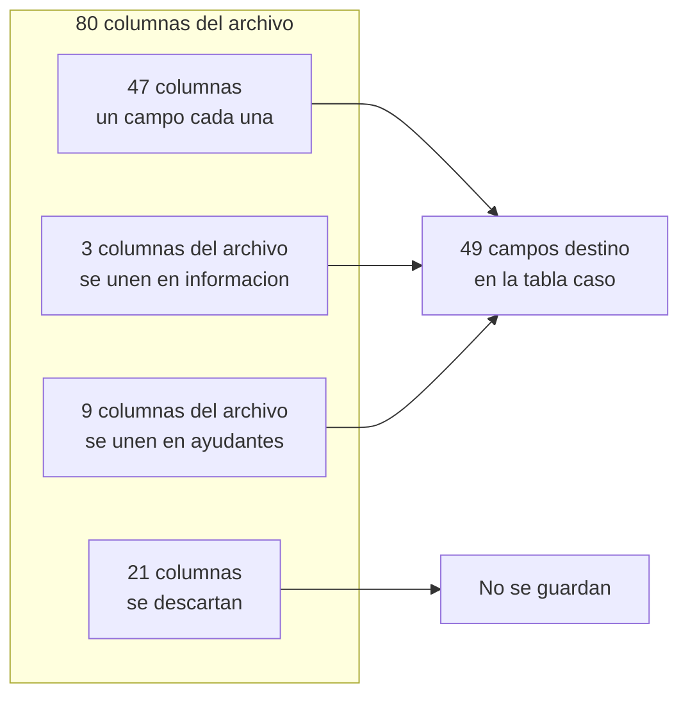
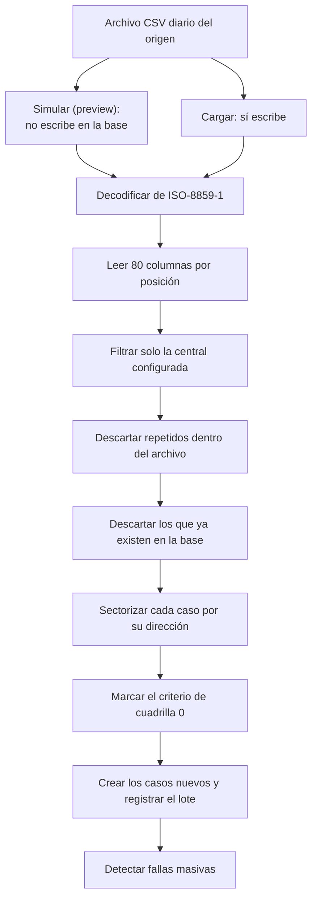

# Manual técnico — Ingesta del archivo diario de averías (CSV)

> Este manual explica, con palabras sencillas, cómo GGTO recibe el **archivo diario de
> averías** que envía el sistema de origen de CANTV, cómo lo limpia y lo revisa, cómo se
> queda solo con los casos de la central configurada, cómo evita repetidos y cómo crea los
> casos nuevos. Está dirigido a técnicos de campo, supervisores y administradores de la
> Central Francisco Salias (Área 4). La aplicación móvil todavía no está desarrollada (el
> Ciclo 8 quedó pospuesto): la carga se hace desde la interfaz web. Cuando algo no pudo
> comprobarse, se indica con la frase **«pendiente de confirmar»**.

## Empezar en 5 minutos

1. Abra la página **INGESTA** en GGTO. Necesita rol **Administrador** o **Supervisor**: el
   rol Técnico solo puede consultar el historial.
2. Pulse «Seleccionar archivo» y elija el CSV del día. Si quiere, escriba el identificador de
   la central; si lo deja vacío, se usa la central configurada.
3. Pulse **«Simular (preview)»**. Esa opción **no guarda nada**: solo muestra cuántas filas
   leyó, cuántas son de la central, cuántos casos son nuevos y cuántos repetidos.
4. Revise el resumen y los avisos. Si aparece el aviso de **direcciones que no pertenecen a
   ningún sector**, pulse **«Gestionar en SECTOR»**, elija a qué sector va cada dirección y el
   sistema **vuelve a sectorizar** los casos pendientes. Cuando todo esté bien, pulse
   **«Cargar archivo»** y confirme. El sistema crea los casos nuevos y deja un registro del lote
   en el historial.
5. Repita la carga con el mismo archivo no duplica nada: los casos ya existentes se cuentan
   como duplicados.

## Visión general (RF-01/RF-02, RT-05, D-04/D-27/D-41/D-66)

El módulo INGESTA recibe el archivo diario de averías GPON del sistema origen de CANTV, lo
depura, filtra los casos de la central configurada, evita duplicados y crea los casos nuevos.
Es la puerta de entrada principal del universo de casos de la plataforma.

| Elemento | Valor verificado |
|---|---|
| Requisito de carga del archivo | RF-01 |
| Requisito de perfiles y accesos (contexto) | RF-02 |
| Procesar solo los casos de la central | RF-21 |
| Insertar solo casos nuevos | RF-22 |
| Sectorizar por dirección | RF-23 |
| Criterio de cuadrilla 0 | RF-25 |
| Requisito técnico del analizador | RT-05 |
| Mapeo por posición de columna | Decisión D-04 |
| Depuración del CSV (21 columnas) | Decisión D-27 |
| Contrato de interfaz con el origen | Decisión D-41 |
| Aviso de direcciones sin sector y re-sectorización | Decisión D-66 |

El módulo usa el prefijo `/api/v1/ingesta` y la etiqueta «ingesta». Su descripción interna
enumera los requisitos que cubre: «RF-01, RF-21, RF-22, RF-23, RF-25, RF-29».

El ciclo **D-66** agregó dos capacidades a la ingesta:

1. Si una **dirección del archivo no pertenece a ningún sector**, el resumen lo **avisa** y
   muestra la cantidad de casos afectados.
2. El botón **«Gestionar en SECTOR»** permite **asignar esa dirección a un sector** y, al
   terminar, **volver a sectorizar** los casos que habían quedado pendientes, sin recargar el
   archivo.

La lógica de análisis y de escritura está separada de la capa web:

- El **analizador** (parser) y el filtro por central viven en un servicio aparte.
- El router del módulo se encarga de leer el archivo subido, armar el resumen, crear el lote
  e insertar los casos.
- Otro servicio resuelve el **sector** a partir de la dirección.
- Otro servicio marca los casos que van al **supervisor** (cuadrilla 0).
- Otro servicio detecta **fallas masivas** después de la carga.

### Roles y permisos del módulo

La escritura (simular y cargar) está restringida a `ADMIN` y `SUPERVISOR`. La consulta del
historial de lotes usa la sesión válida, por lo que cualquier usuario autenticado puede
leerla. El rol `TECNICO` queda en modo solo lectura para este módulo.

## Contrato del archivo origen

El contrato formal está en `RepoTecnico/interfaz_csv_origen.md` y su estado es **borrador
pendiente de firma por CANTV** (decisión D-41): «Estado: **Borrador para validación y firma
de CANTV**».

### Nombre y periodicidad

| Atributo | Valor |
|---|---|
| Nombre | `detalle_averias_gpon_<fecha>.csv` (la fecha cambia cada día) |
| Periodicidad | Diaria, en días hábiles |
| Hora de entrega | Antes de las 08:00, hora de Venezuela |
| Fin de línea | `CRLF` |
| Encabezado | Primera fila, obligatoria |
| Volumen de referencia | Hasta 20 000 filas por día (meta provisional D-33) |

El nombre del archivo es la referencia de trazabilidad de cada carga: se guarda en el lote con
recorte a 255 caracteres. Si el navegador no envía nombre, se usa el texto `sin-nombre`.

El canal de entrega definitivo (carpeta o depósito dedicado, o SFTP corporativo) está
**«por definir con CANTV»**, es decir, **pendiente de confirmar**. Guardar el archivo en Git
está **prohibido** por contener datos personales, y la lista de archivos excluidos de Git
ignora los que se llaman `detalle_averias_gpon*.csv`.

### Delimitador `;`

El delimitador es el punto y coma. En el programa se declara como constante (`DELIMITADOR`)
y se aplica al lector de CSV de la biblioteca estándar, tanto al leer el encabezado como al
leer las filas. El contrato lo fija igual.

### Codificación ISO-8859-1 → UTF-8

| Aspecto | Regla |
|---|---|
| Codificación del origen | ISO-8859-1 (también llamado latin-1 o cp1252), **no** UTF-8 |
| Constante del analizador | `CODIFICACION = "iso-8859-1"` |
| Texto con acentos | Puede traer `ñ` y tildes; hay que decodificar ISO-8859-1 antes de comparar |

La plataforma **no transforma** el archivo de origen: lo decodifica de ISO-8859-1 a texto
Unicode en memoria y lo guarda en columnas de texto de PostgreSQL. La codificación exacta del
servidor de base de datos (`server_encoding`) queda **pendiente de confirmar**. En todo caso,
el texto llega ya decodificado a la base y las comparaciones internas se hacen sobre texto
normalizado, no sobre bytes.

### 80 columnas por posición → 49 campos destino

La plataforma depende de la **posición** de las columnas, no de su nombre, porque el
encabezado trae rótulos duplicados: `informacion` aparece dos veces y `descripcion` tres
veces. El analizador espera 80 columnas y avisa si el encabezado no tiene ese número.

El mapeo completo tiene 49 entradas de la forma «campo de destino, posiciones de origen y
tipo de conversión». Los nombres de los campos de destino forman la lista blanca de columnas
que se van a insertar.

<!-- GENERAR_IMAGEN: transformacion-columnas.svg -->

#### Tipos de conversión

| Tipo | Comportamiento |
|---|---|
| `str` (texto) | Recorta los espacios; si queda vacío, guarda «sin valor» |
| `fecha` | Interpreta `dd/mm/aaaa hh:mm:ss a.m./p.m.` y sus variantes |
| `int` (número entero) | Convierte a número; si falla, guarda «sin valor» |
| `unir` | Junta varias columnas con el separador `" | "` |
| `lista` | Arma una lista JSON con los valores no vacíos |

Solo dos campos son multi-columna:

- **`informacion`**: unifica las columnas 31, 32 y 52 del archivo.
- **`ayudantes`**: toma las nueve columnas 66 a 74 del archivo y se guarda en una columna
  JSONB (un formato de datos que la base guarda como objeto).

#### Aritmética del mapeo

La suma de columnas es coherente con el contrato: 47 campos provienen de una sola columna,
`informacion` consume 3 columnas y `ayudantes` consume 9. Es decir, 47 + 3 + 9 = **59 columnas
usadas**, y 80 − 59 = **21 columnas descartadas**. La cobertura se verifica además con la
prueba `test_especificacion_cubre_49_campos`.

### 21 columnas descartadas

Las columnas que la plataforma ignora están enumeradas en el contrato y ratificadas por la
decisión D-27:

| # | Columna descartada (posición) | # | Columna descartada (posición) |
|---|---|---|---|
| 1 | `tipo_reporte` (12) | 12 | días transcurridos desde la apertura (48) |
| 2 | `dac` (13) | 13 | `area_resolutoria` (49) |
| 3 | `ultimo_usuario` (20) | 14 | `usuario_acciona` (53) |
| 4 | `fecha_despacho` (25) | 15 | `fecha_acciona` (54) |
| 5 | `ciudad` (26) | 16 | `codigo_causa` (56) |
| 6 | `servicio_off_on` (29) | 17 | `descripcion` (57) |
| 7 | `cliente_notificado` (30) | 18 | `Subcodigo_causa` (58) |
| 8 | `fecha_instalacion` (35) | 19 | `descripcion` (59) |
| 9 | `ip` (37) | 20 | `con_serv_aba` (60) |
| 10 | `tarjeta` (38) | 21 | `descripcion` unificada (52) |
| 11 | `ont_id` (42) | | |

> Nota: la columna 52 (`descripcion`) no se «descarta» en sentido estricto, sino que se
> **unifica** dentro de `informacion` junto con las columnas 31 y 32. La decisión D-27 también
> dejó de llenar el catálogo `causa` desde el CSV: ahora ese catálogo se administra desde
> **CONFIGURACIÓN**.

## Parser

El analizador (parser) es **puro**: no toca la base de datos. Devuelve las filas ya mapeadas y
los avisos. Gracias a eso se puede probar por separado y se usa igual en la simulación y en la
carga real.

### Decodificación estricta (nunca `errors='ignore'`)

La decodificación intenta leer el contenido como ISO-8859-1 y, si encuentra un error, lanza un
mensaje explícito en lugar de silenciar el problema. El contrato exige ese comportamiento:
«Codificación inesperada → Falla ruidosa, sin ingesta parcial».

En la práctica ISO-8859-1 cubre los 256 valores de byte, por lo que ese error casi nunca
ocurre. Lo importante para el mantenimiento es que **no** se usa la opción de ignorar errores:
un archivo mal codificado no pierde caracteres en silencio. Antes de procesar, se elimina un
posible BOM inicial (una marca invisible que algunos programas agregan al principio del
archivo).

### Fechas `dd/mm/aaaa hh:mm:ss a.m./p.m.`

El formato de fecha del origen es `dd/mm/aaaa hh:mm:ss a.m./p.m.`, con zona horaria
`America/Caracas` según el contrato. El analizador primero normaliza las variantes de
meridiano y luego prueba una lista de formatos:

1. La normalización de fecha cambia `a. m.`, `p. m.`, `a.m.`, `p.m.` y sus variantes sin
   punto por `AM` o `PM`, colapsa espacios y pasa todo a mayúsculas.
2. La interpretación recorre siete formatos: con y sin segundos, con y sin meridiano, solo
   fecha y el formato ISO `aaaa-mm-dd`.
3. Si ninguno coincide, devuelve «sin valor» sin lanzar error.

Las pruebas verifican `17/07/2026 11:38:20 a.m.`, `10/09/2026 12:00:13 p.m.`,
`22/08/2026 10:00:00 a. m.`, `01/01/2026` y `2026-01-01 08:00:00`, además de los casos vacíos
o inválidos.

> Detalle de implementación: la fecha se interpreta **sin zona horaria**. Las columnas del
> modelo sí aceptan zona horaria, de modo que la interpretación final depende de la zona de la
> sesión de PostgreSQL. La conversión exacta a `America/Caracas` queda **pendiente de
> confirmar**.

### Normalización de acentos y recorte defensivo

La función de normalización pasa el texto a mayúsculas, aplica normalización Unicode, elimina
los acentos y colapsa los espacios repetidos. Se usa para comparar el código de central y los
patrones de sector sin depender de tildes ni mayúsculas. La prueba
`test_normalizar_quita_acentos_y_mayusculas` fija el comportamiento esperado.

El recorte defensivo evita que un valor inesperadamente largo aborte la ingesta completa:

- Hay una tabla de **límites** con la longitud máxima de los campos de texto.
- Al convertir un texto, si supera el límite se recorta y se suma un aviso al contador de
  recortes.
- Los campos de tipo texto largo de PostgreSQL (por ejemplo, la dirección o el último
  comentario) no tienen límite y no se recortan. La prueba `test_campos_de_texto_no_se_recortan`
  lo verifica.

El analizador también descarta de forma defensiva:

- Filas completamente vacías.
- Filas cuyo número de celdas no es 80, contadas como malformadas.
- Filas sin `id_averia`, que no se pueden comparar para evitar duplicados.

Los avisos resultantes se acumulan en una lista que acompaña al resumen.

## Flujo de carga

El análisis se centraliza en una sola función interna, que devuelve el resumen, las filas
candidatas, la central, los patrones y la configuración. Las dos operaciones de escritura
comparten esa función, de modo que la simulación y la carga real aplican exactamente las
mismas reglas.

<!-- GENERAR_IMAGEN: flujo-ingesta-csv.svg -->

### Preview

La operación `POST /api/v1/ingesta/preview` lee el archivo, ejecuta el análisis y devuelve el
resumen **sin escribir en la base de datos**. También fija el nombre del archivo en el
resumen. La prueba `test_preview_no_guarda` comprueba que no se crea ningún caso y que no hay
identificador de lote.

### Carga y creación de `ingesta_lote`

La operación `POST /api/v1/ingesta` responde `201 Created`. La secuencia es:

1. Se analiza el archivo.
2. Se crea el **lote** con estado «PROCESANDO» y el P00 del usuario que carga.
3. Se pide a la base el identificador del lote antes de insertar los casos.
4. Por cada fila candidata se construye un caso con los 49 campos, la central, el lote, el
   sector, la marca de cuadrilla 0, el origen `INGESTA_CSV` y el P00 de quien carga.
5. El lote pasa a estado «OK» y sus avisos se guardan en el detalle de error, unidos por
   `"; "`.
6. Se confirma la transacción.

### Filtro por central

El filtro conserva solo las filas cuyo código de central coincide con la central objetivo,
después de normalizar ambos textos. La central se resuelve así: si el formulario no envía
identificador de central, se usa la clave de configuración `ingesta.central_codigo` y, si no
existe, el texto `"2324X"`. Si la central no existe, se responde `404` con «Central no
encontrada o no configurada».

La muestra de referencia trae 56 filas de tres centrales. El filtro deja 51 de la central
`2324X` y descarta 5.

### Deduplicación por `id_averia`

La **deduplicación** (evitar repetidos) ocurre en dos niveles:

1. **Dentro del propio archivo:** una lista de vistos descarta las repeticiones de
   `id_averia` y las cuenta como repetidas del archivo.
2. **Contra la base de datos:** se consultan los `id_averia` ya presentes en la tabla de
   casos, en grupos de 1000 para no construir una consulta gigantesca.

Las filas que no existen en la base son las candidatas. La unicidad de `id_averia` está
reforzada en la base con una restricción `UNIQUE`. La prueba
`test_ingesta_inserta_y_deduplica` carga el mismo archivo dos veces: la segunda carga inserta
0 casos nuevos y reporta 51 duplicados.

### Sectorización

Cada candidata se ubica en un sector comparando su dirección contra los patrones activos de
los sectores de la central. El algoritmo:

- Ordena los patrones del más largo al más corto, para que gane el más específico.
- Acepta coincidencias de tipo `CONTIENE` (por defecto), `EXACTO` y `REGEX` (una expresión
  regular, es decir, un patrón de búsqueda más flexible).
- Puede aplicar normalización de acentos al patrón y al texto.

Los patrones provienen solo de sectores activos y patrones activos, ordenados por prioridad y
nombre. El resultado se guarda en el caso y se cuenta en el resumen como «sectorizados» o
«sin sector».

### Direcciones sin sector (D-66)

Cuando una **dirección no coincide con ningún sector**, el caso queda «sin sector» y no puede
entrar al despacho. Para resolverlo, la carga arma una lista de **direcciones pendientes**:

- Agrupa las direcciones repetidas con el mismo texto (sin acentos ni mayúsculas) y suma cuántos
  casos tienen.
- Ordena la lista de mayor a menor cantidad y guarda hasta **50** direcciones.
- Cada fila trae la dirección, el total de casos y un **ID de avería de ejemplo**.
- El resumen entrega esa lista en el campo `direcciones_sin_sector`.

En la pantalla se muestra un aviso con esa información y el botón **«Gestionar en SECTOR»**. Ese
botón abre una ventana donde se elige, para cada dirección, el **sector destino**; al confirmar,
el sistema:

1. Agrega la dirección como **patrón** del sector (coincidencia «contiene», con normalización).
2. Llama a la operación de **re-sectorización**, que repasa los casos de la central que quedaron
   **sin sector** y les aplica los patrones vigentes.
3. Informa cuántos casos se revisaron, cuántos se asignaron y cuántos siguen sin sector.

Así, una dirección nueva se corrige una sola vez y los casos pendientes entran al despacho sin
volver a cargar el archivo.

### Criterio de cuadrilla 0

La función de cuadrilla 0 decide si un caso va al supervisor sin salir a la calle. Combina
tres fuentes configurables:

| Clave de configuración | Uso |
|---|---|
| `despacho.columnas_evaluar` | Columnas de texto que se van a evaluar |
| `despacho.frases_campo` | Frases que indican que sí amerita salir a campo |
| `despacho.frases_supervisor` | Frases de no atención en casa |
| `despacho.criterio_cuadrilla0` | Modo `CAMPO`, `SUPERVISOR` o `UNION` |

El valor por defecto del programa es `UNION`, pero la decisión D-59 dejó el parámetro cargado
como **`SUPERVISOR`**: «solo van al supervisor los casos con frases de no atención en casa; el
resto vuelve a estar disponible para el despacho de calle». El modo efectivo en producción es,
por tanto, el valor guardado en la tabla de configuración, no el valor por defecto del
programa.

La marca se guarda en el caso y además alimenta el icono «Gestión» del listado de casos.

### Detección de fallas tras la ingesta

Después de confirmar los casos, la carga ejecuta la detección de fallas. Si se crean fallas
masivas, se confirma otra vez y se informa el conteo. La detección agrupa casos no cerrados
por el campo configurado y aplica un umbral y una ventana:

- `fallas.activo` habilita o deshabilita la detección.
- `fallas.umbral_casos` (por defecto 5) y `fallas.ventana_horas` (por defecto 24).
- `fallas.campo_concentracion` admite `olt`, `fat` o `id_sector`.

Es **idempotente** por la clave de concentración: ejecutarla de nuevo no duplica la misma
falla.

> **Sobre los avisos:** las fallas masivas alimentan el módulo **ALERTAS**. Los canales
> previstos son **Telegram, correo electrónico y MCP** (un canal de integración con otras
> herramientas); WhatsApp no existe en la versión 1. En producción, Telegram y el correo
> **todavía no tienen credenciales cargadas**, así que los envíos quedan **PENDIENTES** en la
> bandeja de salida (*outbox*). Hoy no se puede afirmar que esas alertas ya notifiquen.

## Endpoints

Las cinco operaciones del módulo se declaran bajo el prefijo `/api/v1/ingesta`.

### `POST /api/v1/ingesta/preview`

| Atributo | Valor |
|---|---|
| Autenticación | Token de sesión; rol ADMIN o SUPERVISOR |
| Cuerpo | Formulario con el archivo (obligatorio) y la central (opcional) |
| Respuesta | Resumen de ingesta |
| Efecto en la base | Ninguno: es una simulación |

#### Contrato de la respuesta

Los campos del resumen son: contadores de filas leídas, filas de la central, casos nuevos,
duplicados y descartados, sectorizados, sin sector, cuadrilla 0, avisos, hasta diez ejemplos y
hasta **50 direcciones sin sector** (con su total de casos y un ID de avería de ejemplo).

### `POST /api/v1/ingesta`

| Atributo | Valor |
|---|---|
| Autenticación | Token de sesión; rol ADMIN o SUPERVISOR |
| Cuerpo | Formulario con el archivo y la central |
| Respuesta | Resumen de ingesta con el identificador del lote y las fallas masivas |
| Código de éxito | `201 Created` |
| Efecto en la base | Crea el lote de ingesta y los casos nuevos |

#### Errores esperados

- `401` si no hay token.
- `403` para el rol TECNICO.
- `404` si la central indicada no existe.

### `GET /api/v1/ingesta/lotes`

Devuelve el historial de cargas, con las más recientes primero. El límite por consulta es de
50 por defecto y 200 como máximo. Usa la sesión válida, por lo que cualquier usuario
autenticado puede consultarlo.

### `GET /api/v1/ingesta/lotes/{id_lote}`

Devuelve el detalle de un lote. Si no existe, responde `404` con «Lote no encontrado».

#### Esquema de salida

La salida del lote expone: identificador del lote, archivo, fecha del archivo, central, los
cinco contadores, estado, detalle de error, usuario y fecha de creación.

### `POST /api/v1/ingesta/sectorizar-pendientes` (D-66)

Vuelve a aplicar los patrones de sector a los casos de la central que quedaron **sin sector**.
Se usa después de agregar direcciones nuevas desde el aviso de la ingesta.

| Atributo | Valor |
|---|---|
| Autenticación | Token de sesión; rol ADMIN o SUPERVISOR |
| Parámetro | `id_central` opcional (si no se envía, usa la central configurada) |
| Respuesta | `revisados`, `asignados` y `sin_sector` |
| Efecto en la base | Actualiza el sector de los casos que ahora coinciden con un patrón |

Solo toca casos con `id_sector` vacío y con dirección cargada. Si ninguno cambia, no escribe
nada.

## Esquemas y modelo `ingesta_lote`

### Esquemas Pydantic (`app/schemas/ingesta.py`)

Los **esquemas** son los contratos de datos de entrada y salida.

| Esquema | Uso |
|---|---|
| `EjemploCaso` | Muestra de hasta diez casos candidatos |
| `DireccionSinSector` | Una dirección que no coincide con ningún sector (D-66) |
| `ResumenIngesta` | Respuesta de la simulación y de la carga |
| `SectorizacionPendientesOut` | Resultado de volver a sectorizar los pendientes (D-66) |
| `IngestaLoteOut` | Historial y detalle de lotes |

La salida del lote valida directamente desde el objeto de base de datos. El resumen inicializa
el identificador de lote en «sin valor» y las fallas masivas en 0, de modo que la simulación
los devuelve vacíos.

### Modelo SQLAlchemy y DDL

El modelo del lote se declara sobre la tabla `ingesta_lote`. El **DDL** (el texto que define
la tabla en la base de datos) contiene estas columnas:

| Columna | Tipo | Nota |
|---|---|---|
| `id_lote` | Número grande autoincremental | Clave principal |
| `archivo` | Texto de hasta 255 caracteres | Nombre del archivo cargado |
| `fecha_archivo` | Fecha | Precisión de día |
| `id_central` | Número entero | Referencia a la central |
| `filas_leidas` | Número entero | Total de filas del archivo |
| `filas_central` | Número entero | Filas de la central configurada |
| `casos_nuevos` | Número entero | Casos insertados |
| `casos_duplicados` | Número entero | Ya existentes o repetidos en el archivo |
| `casos_descartados` | Número entero | De otras centrales |
| `estado` | Texto de hasta 20 caracteres | Solo permite «PROCESANDO», «OK» o «ERROR» |
| `detalle_error` | Texto | Avisos del analizador unidos por `"; "` |
| `usuario` | Texto de hasta 20 caracteres | P00 que ejecutó la carga |
| `creado_en` | Fecha y hora con zona | Se llena sola con el momento actual |

### Correspondencia entre esquema y tabla

Hay dos matices que conviene conocer al mantener el módulo:

1. **Tipo de la fecha del archivo:** la tabla la declara como fecha (solo día), mientras el
   modelo y el contrato la exponen como fecha y hora. El valor que llega al cliente tiene,
   por tanto, resolución de día.
2. **Origen del valor:** la carga nunca asigna la fecha del archivo al crear el lote, así que
   queda vacía salvo que se complete por otra vía. En la interfaz se muestra como «—».

El estado «ERROR» existe en la definición de la tabla, pero la ruta de carga no lo usa: el
lote pasa de «PROCESANDO» a «OK». El uso de «ERROR» queda **pendiente de confirmar**.

## Página web INGESTA

La vista está en la página web del módulo y usa el cliente común de la aplicación.

### Estructura y permisos

La página consulta el contexto de autenticación para conocer si la sesión es de solo lectura.
Si el rol es de solo lectura, oculta el formulario de carga y muestra el aviso «Modo solo
lectura: su rol TECNICO no permite simular ni cargar archivos».

### Simulación y carga

- El campo de archivo acepta `.csv` y el tipo `text/csv`.
- El campo «ID de central» acepta vacío (usa la central configurada) o un número entero
  positivo, validado por una función que lo interpreta.
- El botón «Simular (preview)» llama a la operación de simulación.
- El botón «Cargar archivo» pide confirmación explícita y luego llama a la operación de carga.

### Resumen, avisos y ejemplos

Después de la operación se muestran ocho tarjetas: filas leídas, filas de la central, casos
nuevos, duplicados, descartados, sectorizados, sin sector y cuadrilla 0. Los avisos del
analizador se muestran como mensajes de error y los ejemplos aparecen en una tabla con el
identificador de avería, la dirección, el sector y la marca de cuadrilla 0.

### Direcciones sin sector: aviso y gestión (D-66)

Si el resumen trae direcciones que no pertenecen a ningún sector, la página muestra un **aviso**
con el número de direcciones y de casos afectados, y el botón **«Gestionar en SECTOR»**.

Al pulsarlo se abre una ventana con la lista de direcciones (dirección, cantidad de casos y un
ID de avería de ejemplo) y un **selector de sector destino** por fila. El botón «Agregar
direcciones y sectorizar»:

1. Agrega cada dirección elegida como patrón del sector.
2. Vuelve a sectorizar los casos pendientes.
3. Cierra la ventana e informa cuántos casos cambiaron de sector.

Si no hay sectores activos, la ventana avisa que primero hay que crearlos en **CONFIGURACIÓN →
Sectores**.

### Historial y detalle de lotes

La tabla de historial pide los últimos 50 lotes al abrir la página y muestra trece columnas,
entre ellas el archivo, la central, los contadores, el estado y el usuario. El botón «Ver
detalle» consulta el detalle del lote y presenta una ficha con el estado, los contadores y el
detalle de error.

## Datos reales cargados en producción (42 casos, D-54)

### Hecho verificado

La decisión D-54 registra que «el Super Usuario cargó `detalle_averias_gpon 15_09_2026.csv`
(47 filas → **42 casos**, 5 descartadas) el 2026-09-27», que la ingesta funcionó y que esos
casos no se tocaron en las limpiezas posteriores.

### Implicaciones de seguridad y privacidad

Los 42 casos contienen **PII** (información personal de los suscriptores) y el servicio de
Cloud Run estaba accesible de forma pública. La propia decisión advierte que «urge restringir
el acceso y habilitar respaldo». El informe de Fase 4 lista entre los pendientes que no
bloquean la fase el «acceso público del servicio con PII real, que debe restringirse antes de
operar en producción».

**Hecho a respetar:** el servicio `ggto-web` desplegado en Cloud Run es **público** y contiene
PII real; debe restringirse. Además, el riesgo **D-26** sigue aceptado: no hay respaldos ni
recuperación a un punto en el tiempo (PITR) hasta migrar de instancia.

La ingesta, por su parte, deja los avisos del analizador en el detalle de error, sin incluir
valores de datos personales.

### Recalculo posterior

La decisión D-59 recalculó la marca de cuadrilla 0 de los casos reales: 36 pasaron a
«Pendiente» y 6 permanecieron en «Gestión», y la propuesta de despacho pasó de 0 a 36 casos.
Esto confirma que la marca es un dato operativo revisable y no un valor inmutable fijado por
la ingesta.

## Pruebas

El resultado global de la Fase 4 fue de **169 pruebas de `pytest` aprobadas de 169** y
**46 pruebas E2E de Playwright aprobadas de 46**, con `ruff`, `mypy` y `tsc` en modo estricto
sin hallazgos. Las pruebas que tocan base de datos usan esquemas aislados: `ggto_test` para
`pytest` y `ggto_e2e` para Playwright, mediante la variable `DB_SCHEMA`.

### `test_ingesta_parser.py` (12 pruebas)

Nivel unitario, sin base de datos. El informe de Fase 4 lo registra con 12 pruebas y ámbito
«Parser ISO-8859-1 de 80 columnas y fechas `a.m./p.m.`». Cubre:

| Prueba | Qué verifica |
|---|---|
| `test_parse_fecha_formatos` | Formatos de fecha válidos |
| `test_parse_fecha_vacia_o_invalida` | Vacíos e inválidos dan «sin valor» |
| `test_normalizar_quita_acentos_y_mayusculas` | Normalización de texto |
| `test_especificacion_cubre_49_campos` | Los 49 campos son únicos |
| `test_encabezado_tiene_80_columnas` | Encabezado de la muestra |
| `test_parsear_muestra_completa` | 56 filas y campos clave |
| `test_parsear_decodifica_iso8859` | Acentos en ISO-8859-1 |
| `test_filtrar_por_central` | 51 de 56 filas |
| `test_archivo_vacio` | Archivo vacío con aviso |
| `test_archivo_con_encabezado_incorrecto` | Encabezado de 3 columnas |
| `test_valores_largos_se_recortan_sin_abortar` | Recorte a 120 y 80 caracteres |
| `test_campos_de_texto_no_se_recortan` | Campos de texto largo sin límite |

La muestra usada está en `RepoTecnico/muestras/detalle_averias_gpon_EJEMPLO.csv`, y la lista de
archivos excluidos de Git la mantiene versionada por estar pseudonimizada.

### `test_ingesta_api.py` (8 pruebas)

Nivel de integración. El informe de Fase 4 lo registraba con 6 pruebas y ámbito «Preview, carga,
filtro por central y deduplicación». El ciclo **D-66** agregó 2 pruebas (aviso y gestión de
direcciones sin sector, y permiso de escritura de la re-sectorización), para un total de **8**.
Cubre:

| Prueba | Qué verifica |
|---|---|
| `test_ingesta_sin_token` | `401` sin credenciales |
| `test_ingesta_tecnico_no_puede` | `403` para TECNICO |
| `test_preview_no_guarda` | La simulación no escribe |
| `test_ingesta_inserta_y_deduplica` | Carga y segunda carga duplicada |
| `test_ingesta_registra_el_lote` | Historial y detalle del lote |
| `test_sectorizacion_y_cuadrilla0` | Sectorización y marca guardada |
| `test_direcciones_sin_sector_se_reportan_y_se_gestionan` (D-66) | El resumen lista la dirección sin sector y la re-sectorización la asigna |
| `test_sectorizar_pendientes_requiere_escritura` (D-66) | Solo ADMIN o SUPERVISOR pueden re-sectorizar |

### Trazabilidad

| Requisito | Nivel de prueba |
|---|---|
| RF-01/RF-02 (ingesta CSV) | Integración y E2E-07 |
| RF-21 (filtro por central) | Pruebas del analizador y de la API |
| RF-22 (deduplicación) | `test_ingesta_inserta_y_deduplica` |
| RF-23 (sectorización y re-sectorización) | `test_sectorizacion_y_cuadrilla0` y las pruebas D-66 |
| RT-05 (analizador) | `test_ingesta_parser.py` |

La prueba E2E de ingesta (`07-ingesta.spec.js`, 2 pruebas) cubre «Previsualización del CSV
diario e historial de lotes».
