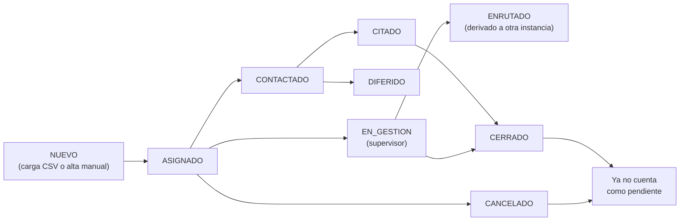
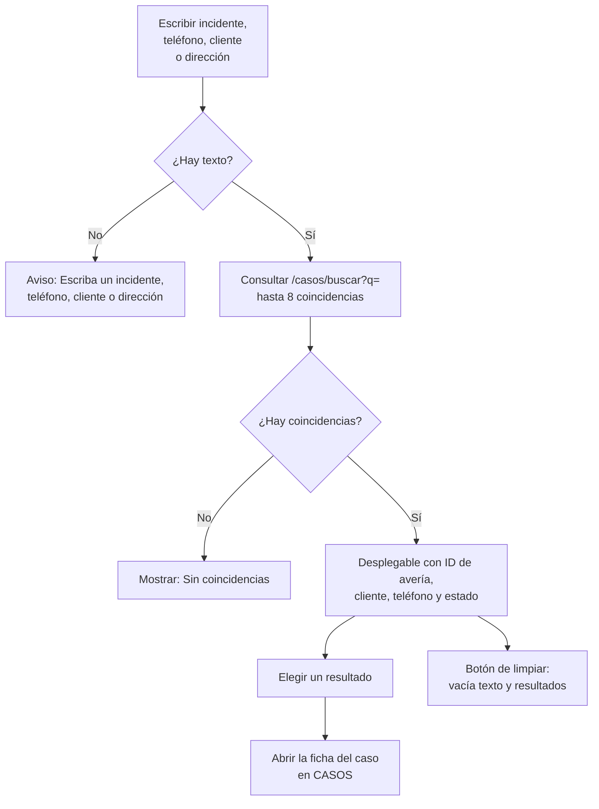

# Manual técnico — Panel y gestión de casos

> Manual para todo público. Explica, en lenguaje sencillo, cómo funcionan el **PANEL** y el
> módulo **CASOS** de GGTO, el *Sistema de administración de reportes de avería y construcción
> de puntos ópticos* de **CANTV C.A., Central Francisco Salias (Área 4)**. Este manual no
> promete funciones que todavía no existen: cuando algo está pendiente, lo dice con claridad.

## Empezar en 5 minutos

Si es tu primer día con el PANEL y CASOS, con estos cinco pasos ya puedes ubicarte.

1. **Entra al sistema.** Inicia sesión con tu **P00** (tu código de personal, por ejemplo
   `P00123`) y tu clave. Al entrar verás el **PANEL**, que es la pantalla raíz.
2. **Mira la barra superior.** Ahí están el **buscador global**, el botón **«Agregar caso»** y
   el menú de usuario. Ya no existe menú lateral: las secciones viven en esa barra.
3. **Busca un caso.** Escribe en el buscador global un número de incidente (`id_averia`), un
   teléfono, un nombre de cliente o una dirección. También puedes usar la «Búsqueda rápida de
   casos» del PANEL por `id_averia` o teléfono.
4. **Abre la ficha y revisa los estados.** Al elegir un resultado se abre la ficha del caso en
   CASOS. Los estados posibles son nueve: `NUEVO`, `ASIGNADO`, `CONTACTADO`, `CITADO`,
   `DIFERIDO`, `EN_GESTION`, `ENRUTADO`, `CERRADO` y `CANCELADO`.
5. **Cambia el estado y deja el motivo.** Si tu rol lo permite (`ADMIN` o `SUPERVISOR`),
   edita el caso, escribe el motivo y guarda. Cada cambio queda registrado en la bitácora
   (el historial), con tu P00 y la fecha y hora.

## Visión general (PANEL y CASOS, RF-30..RF-33)

PANEL y CASOS son la cara operativa del universo de averías: por aquí se busca, se lee, se crea
y se actualiza un caso.

- **PANEL** sirve para buscar un caso por `id_averia` (el número de incidente) o por
  `teléfono`, para actualizar casos y para dar de alta casos nuevos de forma manual.
- **CASOS** guarda la data principal de los casos y su resolución. Distingue el tipo de trabajo
  (Construcción o Reparación) y la categoría del cliente (Residencial, Empresa o Referidos).

Los requisitos que cubre este módulo son:

| Requisito | Descripción en palabras sencillas |
|---|---|
| RF-30 | Buscar un caso por `id_averia` o por `teléfono` y mostrar su ficha completa. |
| RF-31 | Actualizar o editar un caso: contacto, dirección, clasificación, estado y campos de gestión. |
| RF-32 | Dar de alta un caso nuevo de forma manual. |
| RF-33 | Ver el listado con filtros (central, sector, estado, tipo y fechas), abrir el detalle y registrar la resolución. |
| RNF-12 | Dejar trazabilidad y auditoría de todos los cambios: quién cambió qué y cuándo. |

El conjunto de direcciones del módulo se publica bajo `/api/v1/casos` y responde a los
requisitos RF-30, RF-31, RF-32 y RF-33, además de la bitácora del RNF-12.

### Permisos

Para **escribir** (crear o editar) se necesita el rol **ADMIN** o **SUPERVISOR**. Para **leer**
(listar, buscar, ver la ficha y ver el historial) basta con estar autenticado.

En la práctica esto significa que:

- El rol **TECNICO** puede leer, pero no puede crear ni editar casos.
- El rol **SUPER** (Super Usuario) puede hacer todo, siempre.

Cuando alguien intenta escribir sin permiso, el sistema rechaza la operación. Este
comportamiento está fijado por una prueba automática que verifica justamente que un técnico
puede leer pero no escribir.

## Estados del caso (D-29) y ciclo de vida

### Catálogo de estados

La decisión **D-29** fijó nueve estados «fijos en el DDL» (el DDL es el archivo que define las
tablas de la base de datos). La lista es cerrada: no se pueden inventar estados nuevos.

| # | Estado | Qué significa en la operación |
|---|---|---|
| 1 | `NUEVO` | Estado inicial cuando se da de alta un caso manual. |
| 2 | `ASIGNADO` | El caso quedó marcado como asignado en el listado. |
| 3 | `CONTACTADO` | Ya se contactó al cliente. |
| 4 | `CITADO` | Tiene una cita propuesta o confirmada. |
| 5 | `DIFERIDO` | El caso quedó aplazado. |
| 6 | `EN_GESTION` | Está en gestión del supervisor. |
| 7 | `ENRUTADO` | Fue derivado a otra instancia o cola. |
| 8 | `CERRADO` | Cerrado. Deja de contar como «pendiente». |
| 9 | `CANCELADO` | Cancelado. También deja de contar como «pendiente». |

### Restricciones en base de datos

La base de datos valida exactamente la misma lista de nueve estados y, si no se indica otro,
asigna `NUEVO` por defecto. Es decir, hay tres capas que dicen lo mismo: la base de datos, el
modelo del backend y el esquema de validación de la API.

Consecuencia práctica: si alguien intenta enviar un estado que no está en la lista, el sistema
responde **422** (datos inválidos). Una prueba automática comprueba ese rechazo.

### Ciclo de vida observado

El recorrido normal de un caso es así:

1. El caso **nace** de dos maneras: por la carga del archivo CSV de averías (nace en estado
   `NUEVO`) o por alta manual desde el PANEL (también en `NUEVO`, y con la primera fila de
   bitácora escrita).
2. El caso se **edita** con una actualización parcial. En esa edición se puede cambiar el
   estado.
3. Cada **cambio real de estado** se apila en la tabla `caso_estado_hist` (la bitácora) y se
   puede consultar por el historial del caso.
4. Los estados `CERRADO` y `CANCELADO` son **terminales** a efectos del indicador «pendiente» y
   también del cálculo de fallas masivas: un caso cerrado o cancelado ya no se cuenta como
   trabajo pendiente.

<!-- GENERAR_IMAGEN: flujo-caso-estados.svg -->


## Endpoints

El módulo agrupa seis operaciones bajo `/api/v1/casos`. Un *endpoint* es una dirección del
sistema a la que la pantalla web le pide o le envía datos.

### `GET /api/v1/casos` (filtros y paginación)

Devuelve el **listado de casos en páginas**. La respuesta trae los elementos de la página
(`items`), el total de coincidencias (`total`), la página actual (`page`), el tamaño de página
(`page_size`) y cuántas páginas hay (`pages`).

#### Filtros aceptados

Estos son los filtros que el backend acepta. Todos son opcionales y se pueden combinar.

| Parámetro | Tipo | Cómo se comporta |
|---|---|---|
| `q` | texto | Busca por parecido en `id_averia`, `telefono`, `nombre_cliente` y `direccion`. |
| `id_averia` | texto | Busca por parecido parcial. |
| `telefono` | texto | Busca por parecido parcial. |
| `id_central` | entero | Coincidencia exacta. |
| `id_sector` | entero | Coincidencia exacta. |
| `id_causa` | entero | Coincidencia exacta. |
| `id_lote_ingesta` | entero | Coincidencia exacta. |
| `estado_actual` | texto | Coincidencia exacta con uno de los nueve estados. |
| `tipo_caso` | texto | Coincidencia exacta. |
| `categoria` | texto | Coincidencia exacta. |
| `origen` | texto | Coincidencia exacta. |
| `en_gestion_supervisor` | booleano (sí/no) | Coincidencia exacta. |
| `es_falla_masiva` | booleano (sí/no) | Coincidencia exacta. |
| `desde` / `hasta` | fecha y hora | Rango sobre la fecha del reporte. |

#### Paginación y orden

- La página 1 es la primera; no se admiten páginas menores que 1.
- El tamaño de página por defecto es **25**. El mínimo es 1 y el máximo es 200.
- El total de coincidencias se cuenta completo, y el número de páginas se obtiene dividiendo el
  total entre el tamaño de página.
- El orden es por **fecha de reporte descendente** (lo más reciente primero), con las fechas
  vacías al final. Si dos casos tienen la misma fecha, se desempata por `id_caso` descendente
  (el más nuevo primero).
- Una prueba automática verifica que el listado quede ordenado por fecha descendente.

#### Iconos de estado calculados

Además de los datos del caso, el sistema calcula cuatro marcas o «iconos» que la pantalla usa
para pintar el estado. No se guardan: se deducen al vuelo.

| Icono | Condición para que se encienda |
|---|---|
| `pendiente` | El estado no es `CERRADO` ni `CANCELADO`. |
| `asignado` | El caso ya está en un despacho, o su estado es `ASIGNADO`. |
| `citado` | Tiene una cita en estado `PROPUESTA` o `CONFIRMADA`. |
| `gestion` | Está marcado `en_gestion_supervisor`, su estado es `EN_GESTION` o su despacho dice `GESTIONADO`. |

### `GET /api/v1/casos/buscar`

Es la dirección que usan el **buscador global** de la barra superior y la búsqueda rápida del
PANEL. Exige enviar al menos uno de estos tres criterios: `q`, `id_averia` o `telefono`. Si no
se envía ninguno, responde **422** con el mensaje:

> «Indique `q`, `id_averia` o `telefono` para buscar»

Una prueba automática fija ese comportamiento.

| Parámetro | Cómo se comporta |
|---|---|
| `q` | Busca por parecido en avería, teléfono, cliente y dirección. |
| `id_averia` | Igualdad exacta, después de quitar espacios al principio y al final. |
| `telefono` | Igualdad, o búsqueda por parecido parcial. |
| `limite` | Cuántos resultados devolver: 20 por defecto, entre 1 y 100. |

Cuando se combinan varios criterios, se aplica «alguno de ellos» (una condición **O**). Con un
solo criterio, se usa directamente. El orden es por fecha de reporte descendente, con las
fechas vacías al final.

### `POST /api/v1/casos` (alta manual `REF-...`)

Da de alta un caso nuevo de forma manual. Responde **201 Created** (creado) y exige rol de
escritura (`ADMIN` o `SUPERVISOR`). La secuencia del alta es:

1. Se resuelve la central indicada o, si no se indica, la central configurada.
2. Si el cuerpo no trae `id_averia`, el sistema lo **genera** con la función de base de datos
   `generar_id_averia_ref`.
3. Si el `id_averia` ya existe, se rechaza con **409** (conflicto): no se permiten duplicados.
4. Se respeta el `id_sector` enviado, validando que exista (si no existe, **404**). Si no se
   envía sector, el sistema lo deduce automáticamente a partir de la dirección.
5. Si `fecha_reporte` viene vacía, se completa con la hora actual. El campo de ayudantes queda
   como lista vacía.
6. Se crea el caso con `origen="MANUAL"`, `estado_actual="NUEVO"`, el código y el nombre de la
   central y el P00 del usuario que lo creó.
7. Se escribe la primera fila de la bitácora con el motivo «Alta manual desde PANEL».

#### Verificación

Dos pruebas automáticas respaldan este comportamiento. La primera comprueba que el identificador
generado empieza por `REF-2324X-`, que el origen es `MANUAL`, que el estado es `NUEVO` y que
`en_gestion_supervisor` es falso. La segunda cubre el caso en que el usuario sí envía un
identificador explícito y el rechazo **409** por identificador duplicado.

### `GET /api/v1/casos/{id_caso}`

Devuelve la **ficha completa** de un caso, con el nombre del sector y los cuatro iconos de
estado. Si el caso no existe, responde **404** con el mensaje «Caso no encontrado». Una prueba
automática cubre la ficha y el 404.

### `PATCH /api/v1/casos/{id_caso}` (historial de estado)

Es una **edición parcial**: solo se aplican los campos que vienen en el cuerpo de la petición.
Los campos que no se envían quedan como estaban.

#### Campos con tratamiento especial

| Campo | Qué hace el sistema |
|---|---|
| `motivo_estado` | Se toma para escribir el motivo en la bitácora; no se guarda como columna del caso. |
| `estado_actual` | Se procesa con una rutina especial que registra el cambio en la bitácora. |
| `id_sector` | Se valida contra la tabla de sectores (**404** si no existe) y se asigna. |
| `direccion` | Si no se envió `id_sector`, dispara la re-sectorización automática. |

El resto de los campos se aplica tal cual, uno por uno.

> **Observación de mantenimiento.** El esquema de edición admite un campo `sector_nombre` que no
> existe como columna de la tabla de casos. Como se aplica de forma genérica, ese valor no se
> guarda. La pantalla web no lo envía, así que hoy no causa daño; conviene evitarlo en
> integraciones futuras.

#### Verificación

Una prueba automática comprueba que un cambio a `CONTACTADO` con motivo queda en la bitácora con
el P00 del usuario, y que **repetir el mismo estado no añade una segunda fila** (la bitácora es
idempotente).

### `GET /api/v1/casos/{id_caso}/historial`

Primero verifica que el caso exista (si no, **404**). Luego devuelve la bitácora de cambios de
estado ordenada por `id_hist` descendente, es decir, **del movimiento más reciente al más
antiguo**. Cada fila trae el estado anterior, el estado nuevo, el motivo, el usuario y la fecha
y hora.

## Reglas de negocio

### Generación `generar_id_averia_ref`

Los casos que no vienen de una incidencia de origen (referidos, empresas, gobiernos y altas
manuales) reciben un identificador sintético con la forma:

```
REF-<CÓDIGO_CENTRAL>-<NNNNNN>
```

Esto lo fija la decisión **D-23**. La función que lo genera está en la base de datos y funciona
así:

- Usa una secuencia llamada `seq_caso_ref` para no repetir números.
- Toma el `codigo_central` de la tabla de centrales y falla con una excepción si esa central no
  existe.
- Compone el identificador en mayúsculas y con relleno de seis ceros.

El backend la invoca con una consulta directa. El formato observado en las pruebas es
`REF-2324X-`.

### Re-sectorización automática al editar dirección

Cuando una edición incluye `direccion` y **no** incluye `id_sector`, el backend vuelve a
calcular el sector. El cálculo se apoya en los patrones configurados para la central del caso:

- Los patrones se ordenan del más largo al más corto.
- Se admite coincidencia de tres tipos: `CONTIENE` (el texto contiene el patrón), `EXACTO`
  (coincidencia exacta) y `REGEX` (expresión regular).
- Si ningún patrón coincide, el sector queda vacío (`None`).

Una prueba automática parte de un caso sin sector y, al corregir la dirección, obtiene el sector
esperado.

### Registro en `caso_estado_hist`

La bitácora aplica una regla de idempotencia (es decir, no duplica registros):

1. Si el estado nuevo es **igual** al actual, no escribe nada y termina.
2. Si es distinto, inserta una fila con el estado anterior, el estado nuevo, el motivo y el
   usuario que hizo el cambio.
3. Actualiza el estado actual del caso.

La tabla de bitácora guarda la fecha y hora automáticamente y borra sus filas si se elimina el
caso (borrado en cascada). El alta manual es la excepción: escribe la primera fila directamente,
porque el caso todavía no tiene estado previo.

## Esquemas y modelo

### Esquemas Pydantic (`app/schemas/casos.py`)

Los *esquemas* son las reglas de validación que usa la API para leer y escribir datos.

| Esquema | Para qué sirve |
|---|---|
| `ESTADOS_CASO` / `EstadoCaso` | El catálogo de los nueve estados y su restricción. |
| `TIPO_CASO` | Los tipos de trabajo: `AVERIA`, `REPARACION`, `CONSTRUCCION`. |
| `CATEGORIA` | Las categorías: `RESIDENCIAL`, `EMPRESA`, `REFERIDO`, `GOBIERNO`. |
| `ORIGEN` | Los orígenes: `INGESTA_CSV`, `MANUAL`, `TELEGRAM`, `MCP_IA`. |
| `CasoOut` | La ficha del caso y cada elemento del listado. |
| `PaginaCasos` | La respuesta paginada del listado. |
| `CasoManualCreate` | El cuerpo del alta manual. |
| `CasoUpdate` | El cuerpo de la edición parcial. |
| `CasoEstadoHistOut` | Una fila de la bitácora. |

El esquema de salida `CasoOut` se arma desde el modelo de base de datos y **omite a propósito**
columnas geográficas y técnicas que no se muestran en la ficha, como `capital_estado`,
`distrito`, `estado_operativo`, `extra`, `dias_area_resolutoria`, `ups` y
`codigos_gestionados_venapp`. Esa reducción es una decisión de presentación, no una restricción
de la tabla: los datos siguen guardados.

### Modelo `Caso` (`app/models/caso_entities.py`)

Es la **tabla central de casos**, con 63 columnas. Es el mapeo depurado del CSV, según la
decisión **D-27**. Sus campos se agrupan en cinco bloques:

| Bloque | Ejemplos |
|---|---|
| Clasificación del sistema | `id_averia`, `origen`, `tipo_caso`, `categoria`, `estado_actual`, `id_sector`, `id_lote_ingesta` |
| Geografía (filtro de central) | `region`, `municipio`, `parroquia`, `codigo_central`, `nombre_central` |
| Contacto y administración | `telefono`, `fecha_reporte`, `direccion`, `nombre_cliente` |
| Datos técnicos / lógicos | `olt`, `plan`, `slot`, `puerto`, `fat`, `serial` |
| Asignación de origen | `reparador_principal`, `ayudantes` (lista en formato JSONB), `flota_can` |

Detalles importantes:

- `id_averia` es **único y no puede quedar vacío**.
- `ayudantes` es una lista JSONB que, si no se indica otra cosa, arranca vacía.
- La base de datos reproduce la misma estructura con validaciones para `origen`, `tipo_caso`,
  `categoria` y `estado_actual`.

### Modelo `CasoEstadoHist`

Es la **bitácora de cambios de estado** de un caso (RNF-12). Contiene:

- `id_hist`: identificador de la fila.
- `id_caso`: el caso al que pertenece.
- `estado_anterior` y `estado_nuevo`.
- `motivo`.
- `usuario`.
- `fecha_hora`.

La fecha y hora se completa sola con el momento del registro y, si se elimina el caso, la
bitácora se borra en cascada.

## Página web CASOS y Panel

### CASOS (`app/web/src/pages/Casos.tsx`)

Es la página más extensa del módulo (964 líneas). Se organiza en tres bloques: filtros y
listado, ficha con edición y cambio de estado, e historial.

#### Filtros mostrados

La interfaz ofrece estos filtros: texto libre, estado, clase, tipo, origen, «Cuadrilla 0
(supervisor)» y rango de fechas de reporte. Los catálogos de estados, categorías, tipos y
orígenes están declarados en la propia pantalla.

> **Ojo:** la interfaz **no** muestra los filtros `id_central`, `id_sector`, `id_causa` ni
> `id_lote_ingesta`, aunque el backend sí los acepta. Si necesitas filtrar por esos campos, hoy
> hay que hacerlo por API.

#### Paginación

Los tamaños de página disponibles son 10, 25, 50 y 100, y el valor inicial es 25. La barra
inferior muestra el total y la página actual, y ofrece los botones «Anterior» y «Siguiente».
Cuando estás en el primer o el último límite, el botón correspondiente queda deshabilitado.

#### Ficha

La ficha se abre al seleccionar cualquier parte del renglón y reparte la información en
pestañas: **Resumen, Contacto, Datos técnicos, Clasificación, Textos, Resolución e Histórico**.
Los campos vacíos se muestran como «—». La antigua pestaña **Gestión** ya no existe.

#### Editar el sector, la cita y la información

- En la pestaña **Clasificación**, el botón **Editar** del título habilita el formulario con el
  **Sector** (incluye la opción «Sin sector»), la **Fecha de cita** y la **Información** (hasta
  200 caracteres). El **Supervisor**, el Administrador y el Super Usuario pueden así **asignar o
  cambiar el sector** de un caso.
- Al guardar, el sistema envía únicamente esos campos; si se corrige la dirección sin enviar
  sector, el sector se recalcula solo.
- El botón **Editar** vuelve a abrir el formulario las veces que haga falta, incluso después de
  guardar.

#### Cambio de estado

- Desde D-76 la ficha web **no** permite cambiar el estado: el formulario se retiró junto con la
  pestaña Gestión.
- El movimiento de estado sigue disponible en la operación del API para otros clientes (la APK).

#### Historial

Se muestra en una tabla con estado anterior, estado nuevo, motivo, usuario y fecha y hora, bajo
la ficha. Se carga con la operación de historial del cliente de API.

### PANEL (`app/web/src/pages/Panel.tsx`)

El PANEL es la **página raíz**. Muestra un resumen con seis tarjetas:

1. Tablas.
2. Centrales.
3. Roles.
4. Cuadrillas.
5. Causas.
6. Parámetros.

Además, identifica la sesión con el nombre completo del usuario y su rol.

Incluye una «Búsqueda rápida de casos» por ID de avería o teléfono. Al enviarla, la pantalla
navega a CASOS llevando el término de búsqueda; CASOS lo recoge y lo usa como filtro inicial.

### Modal «Agregar caso» (`app/web/src/components/ModalCaso.tsx`)

El botón «Agregar caso» de la barra superior abre este **modal flotante** (una ventana que se
superpone a la página). Sus rasgos son:

| Rasgo | Comportamiento |
|---|---|
| Foco inicial | Al abrirse, enfoca el primer control del modal. |
| Cierre con `Escape` | La tecla `Escape` cierra el modal. |
| Trampa de foco | La tecla `Tab` va ciclando dentro del modal, sin escaparse al fondo. |
| Cierre por fondo | Hacer clic en el fondo oscuro cierra el modal; hacer clic dentro de la caja, no. |
| Alta normal | Exige al menos uno de estos datos: nombre, teléfono, dirección o problema. |
| Alta especial | Cambia a la operación de caso especial e incluye el solicitante. |

El caso normal se crea con la operación habitual y, cuando corresponde, el resultado destaca en
color el identificador `REF-…`.

> Aunque compartan el modal, los **casos especiales** pertenecen a otro módulo
> (`/api/v1/casos-especiales`). Este manual solo describe el punto de entrada; el detalle está en
> el manual de casos especiales.

## Buscador global de la barra superior (D-57)

La decisión **D-57** eliminó el menú lateral y dejó **una sola barra superior** con:

- Un buscador global de un solo campo.
- El botón «Agregar caso» con modal flotante.
- El menú de usuario.
- Enlaces con iconos en móvil.
- CONFIGURACIÓN como submenú restringido.

### Comportamiento

El buscador se monta en la barra superior. Es un único cuadro que consulta `/casos/buscar?q=` y
muestra **hasta 8 coincidencias** en un desplegable.

- Exige texto no vacío. Si está vacío, muestra el aviso «Escriba un incidente, teléfono, cliente
  o dirección».
- Llama a la búsqueda de casos con un límite de 8.
- El desplegable muestra el ID de avería, el cliente, el teléfono y el estado de cada
  coincidencia, o bien el texto «Sin coincidencias».
- El botón de limpiar vacía el texto y borra los resultados.

<!-- GENERAR_IMAGEN: buscador-global.svg -->


### Navegación a la ficha

Al elegir un resultado, la pantalla navega a CASOS pasando el `id_caso`. CASOS interpreta ese
dato y **abre la ficha automáticamente**, sin que el usuario tenga que buscarla otra vez.

### Accesibilidad

El buscador está construido para que también funcione con lectores de pantalla y teclado:

- El formulario se anuncia como región de búsqueda.
- El desplegable se anuncia como lista de opciones y cada resultado como una opción.
- Los botones llevan etiquetas de accesibilidad.
- El desplegable se cierra al hacer clic fuera.
- La prueba de extremo a extremo (E2E) cubre las secciones, el menú CONFIGURACIÓN, el control de
  acceso por rol en el menú, la barra móvil y el buscador.

## Pruebas (`app/tests/test_casos_api.py`, 17 pruebas)

El informe de la Fase 4 registra este archivo con **17 pruebas de integración**. Su ámbito es:
búsqueda, filtros, ficha, edición, alta `REF-…` y bitácora.

### Cobertura por área

| Área | Qué se prueba |
|---|---|
| Acceso y control por rol | Sin token y el caso del técnico que puede leer pero no escribir. |
| Alta manual | Generación de `REF-…`, identificador explícito, duplicado con 409, sectorización e historial inicial. |
| Búsqueda (RF-30) | Por avería, por teléfono y sin parámetros (responde 422). |
| Ficha (RF-31) | Ficha completa y caso inexistente (404). |
| Edición y bitácora | Historial de estado, re-sectorización y estado inválido. |
| Listado (RF-33) | Filtros, paginación, casos ingeridos, orden y no duplicación del modelo. |

### Trazabilidad

| Requisito | Nivel de prueba |
|---|---|
| RF-30…RF-33 (panel y casos) | Integración, contratos y pruebas E2E-01/03. |
| RF-30…RF-33 (E2E) | `03-casos.spec.js` (6 pruebas). |
| RNF-12 (bitácora) | Prueba de historial de estado en la edición. |
| D-57 (rediseño de navegación) | 32/32 pruebas de regresión. |

Una prueba conecta este manual con el de ingesta: carga el CSV de muestra, verifica que el
listado con origen `INGESTA_CSV` devuelve **51 casos** y que la búsqueda por `DEMO-0001` los
encuentra con su lote y su central.

**Resultado global de la Fase 4:** la suite de pruebas de backend cerró en **169/169** y la de
navegador en **46/46** con Playwright. Las herramientas de calidad (ruff, mypy y tsc en modo
estricto) no arrojaron hallazgos.

**Modo de pruebas:** para no mezclar datos, las pruebas usan la variable `DB_SCHEMA` con
esquemas aislados: `ggto_test` para las pruebas de backend con `pytest` y `ggto_e2e` para las
pruebas de navegador con Playwright.
