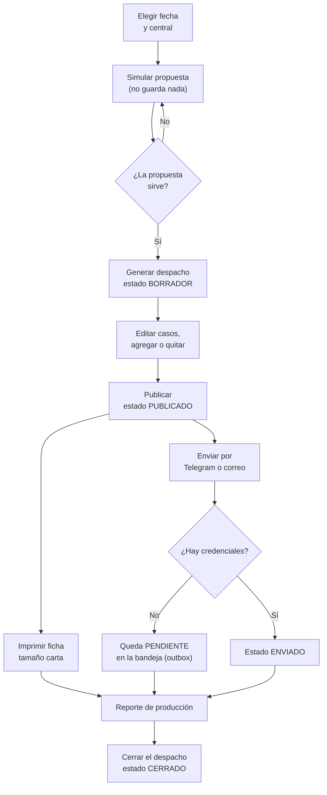
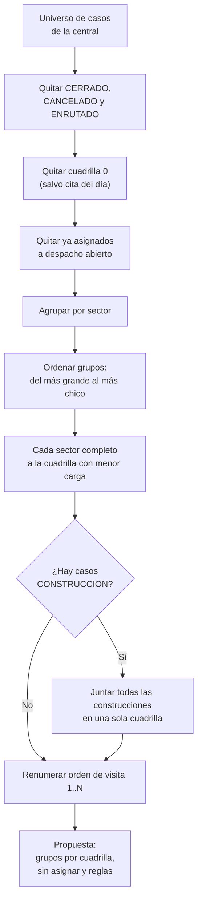

# 05 — Despacho diario (módulo DESPACHO)

> Manual para todo público. Explica, en lenguaje sencillo, cómo funciona el **DESPACHO** diario
> de GGTO, el *Sistema de administración de reportes de avería y construcción de puntos
> ópticos* de **CANTV C.A., Central Francisco Salias (Área 4)**. Este manual no promete
> funciones que todavía no existen: cuando algo está pendiente, lo dice con claridad.

## Empezar en 5 minutos

Si es tu primer día con el DESPACHO, con estos cinco pasos ya puedes armar el día.

1. **Elige la fecha y la central.** Entra a **DESPACHO** desde la barra superior y selecciona la
   jornada. La central de esta versión es **FRANCISCO SALIAS** (código `2324X`).
2. **Simula la propuesta.** Pulsa «Simular propuesta». El sistema reparte los casos entre las
   cuadrillas activas y te muestra el resultado **sin guardar nada**. Revisa los chips de
   reglas: citados del día, referidos, empresas y construcción en una sola cuadrilla.
3. **Genera el despacho.** Si la propuesta te convence, pulsa «Generar despacho». El sistema
   guarda un despacho en estado `BORRADOR` por cada cuadrilla con casos.
4. **Publica o cierra.** Cuando el despacho esté listo, publícalo (`PUBLICADO`). Si el día
   termina, ciérralo (`CERRADO`). También puedes imprimir la ficha de la cuadrilla en tamaño
   carta o enviarla por mensajería.
5. **Reporta el resultado.** Consulta el **reporte de producción**: asignados, cerrados,
   citados, diferidos, gestionados, referidos y empresas. Si hubo una avería de muchos clientes,
   registra una **falla masiva**.

## Visión general (RF-08/RF-24/RF-25/RF-27, D-52)

El módulo **DESPACHO** arma, publica, imprime, envía y reporta el despacho diario de las
cuadrillas de la Central **FRANCISCO SALIAS** (`2324X`). Es el **Ciclo 5** del proyecto.

La decisión **D-52** da el módulo por completado con **96/96 pruebas**, el despliegue
`ggto-web-00007-vsr` (imagen `v7`) y verificación en vivo.

> **Aviso de seguridad importante.** El servicio en la nube (Cloud Run) llamado `ggto-web` es
> **público** y contiene datos personales reales (PII). Debe restringirse el acceso cuanto antes.
> Además, sigue vigente el riesgo aceptado **D-26**: todavía **no hay respaldos ni recuperación a
> un punto en el tiempo (PITR)** hasta que se migre de instancia.

<!-- GENERAR_IMAGEN: flujo-despacho.svg -->

### Alcance funcional

| Requisito | Descripción en palabras sencillas |
|---|---|
| **RF-08** | Distribuir el universo de averías entre las cuadrillas activas del día, agrupando por sector. |
| **RF-24** | Proponer la distribución de casos antes de guardarla. |
| **RF-25** | Excluir del despacho de calle los casos de la cuadrilla 0 (los que gestiona el supervisor). |
| **RF-27** | Generar el reporte de producción: asignados, cerrados, citados, referidos, etc. |
| **RT-08** | Imprimir en tamaño carta la ficha de la cuadrilla. |
| **RF-09** | Registrar y listar fallas masivas desde el módulo de despacho. |
| **RF-10** | Enviar la ficha de la cuadrilla por Telegram o por correo. |

### Archivos de referencia

Esta tabla es para quien necesite ubicar el código. El resto del manual no la necesita para
operar el sistema.

| Capa | Archivo |
|---|---|
| Direcciones de la API | `app/api/routes_despachos.py` |
| Servicio de propuesta y balanceo | `app/services/despacho.py` |
| Esquemas de validación | `app/schemas/despacho.py` |
| Modelos de base de datos | `app/models/despacho_entities.py` |
| Notificaciones y bandeja de salida | `app/services/notificaciones.py`, `app/services/outbox.py` |
| Página web | `app/web/src/pages/Despacho.tsx` |
| Pruebas de integración | `app/tests/test_despacho_api.py` |

El módulo se monta en la aplicación principal y publica sus operaciones bajo
`/api/v1/despachos`. Las operaciones de **escritura** exigen los roles `ADMIN` o `SUPERVISOR`; las
de **lectura** piden solo estar autenticado.

---

## Modelo de despacho

El modelo guarda una **cabecera** por cuadrilla y un **detalle** con los casos asignados. Dicho
simple: la cabecera dice «esta cuadrilla, este día»; el detalle dice «estos casos, en este
orden».

### despacho

Es la tabla **cabecera**: una fila por central, fecha y cuadrilla.

| Campo | Tipo | Qué significa |
|---|---|---|
| `id_despacho` | número entero grande, clave | Identificador del despacho. |
| `id_central` | entero, referencia a central | Central del despacho. |
| `fecha` | fecha | Día de la jornada. |
| `id_cuadrilla` | entero, referencia a cuadrilla | Cuadrilla destino. |
| `estado` | texto corto | `BORRADOR` / `PUBLICADO` / `CERRADO`. |
| `generado_auto` | sí/no | Verdadero si lo propuso el sistema (RF-24). |
| `enviado_canal` | texto corto | `TELEGRAM` / `CORREO`. |
| `enviado_en` | fecha y hora | Marca del envío o de la publicación. |
| `reporte_produccion_en` | fecha y hora | Cierre previsto a las 04:00 p.m. |
| `usuario_crea` | texto, referencia a usuario | Usuario que generó el despacho. |
| `creado_en` / `actualizado_en` | fecha y hora | Auditoría temporal. |

Una regla clave: **no pueden existir dos despachos de la misma cuadrilla en la misma fecha**. Eso
lo garantiza una restricción de unicidad sobre la combinación de fecha y cuadrilla.

La relación con el detalle borra los casos en cascada si se elimina la cabecera, y los carga
junto con ella para mostrarlos de una sola vez.

### despacho_caso

Es la tabla de **detalle**: cada caso asignado dentro de un despacho.

| Campo | Tipo | Qué significa |
|---|---|---|
| `id_despacho_caso` | número entero grande, clave | Identificador de la fila. |
| `id_despacho` | entero grande, referencia a despacho | Cabecera a la que pertenece. |
| `id_caso` | entero grande, referencia a caso | Caso asignado. |
| `id_sector` | entero, referencia a sector | Sector del caso al momento de asignarlo. |
| `orden_visita` | entero pequeño | Secuencia de visita dentro de la cuadrilla. |
| `tipo_asignacion` | texto corto | `REPARACION` / `CONSTRUCCION` / `REFERIDO` / `EMPRESA` / `FALLA_MASIVA`. |
| `estado` | texto corto | `ASIGNADO` / `GESTIONADO` / `CERRADO` / `CITADO` / `DIFERIDO`. |
| `observacion` | texto largo | Nota del supervisor para ese caso. |

Otra regla clave: **el mismo caso no puede aparecer dos veces en el mismo despacho**. Lo impide
una restricción de unicidad sobre la combinación de despacho y caso.

### estados

Los estados válidos son los mismos en la base de datos, en el modelo, en la validación de la API
y en la pantalla web. No hay listas distintas que puedan desincronizarse.

| Entidad | Estados permitidos |
|---|---|
| Despacho | `BORRADOR`, `PUBLICADO`, `CERRADO` |
| Caso del despacho | `ASIGNADO`, `GESTIONADO`, `CERRADO`, `CITADO`, `DIFERIDO` |
| Tipo de asignación | `REPARACION`, `CONSTRUCCION`, `REFERIDO`, `EMPRESA`, `FALLA_MASIVA` |
| Canal de envío | `TELEGRAM`, `CORREO` |

Al guardar una propuesta, cada caso nace en estado `ASIGNADO`.

---

## Propuesta automática

El motor de la propuesta reparte el trabajo solo. Estas son las reglas que aplica, explicadas una
por una.

### agrupación por sector

Primero se arma el **universo de casos** que se puede repartir. Se aplican estos filtros, en
este orden:

1. Solo casos de la **central solicitada**.
2. Se dejan **fuera** los estados `CERRADO`, `CANCELADO` y `ENRUTADO`: esos ya no son trabajo de
   calle.
3. Se excluye la **cuadrilla 0** (los casos que gestiona el supervisor), **salvo** que el caso
   tenga una **cita del día**: en ese caso sí entra.
4. Se excluyen los casos **ya asignados** a un despacho que no esté cerrado, para no repetir
   trabajo.
5. El orden de la lista es: primero por sector, luego por fecha de reporte y por último por
   número de caso.

Después, los casos se agrupan en un diccionario por sector. Los grupos se recorren **del más
grande al más pequeño** y, en caso de empate, se prefiere el sector distinto de nulo. Las
cuadrillas elegibles son las **activas** y **no supervisoras** de la central.

### balanceo greedy

El reparto es *greedy*, es decir, «voraz»: se va resolviendo lo más conveniente en cada paso sin
recalcular todo.

- Cada **sector completo** se entrega a la cuadrilla con **menor carga** acumulada. Si hay
  empate, gana la de menor código.
- Después de asignar el sector, se suma su carga a esa cuadrilla.

Luego entra la regla de **construcción**: todos los casos de tipo `CONSTRUCCION` deben quedar en
**una sola cuadrilla**. Para lograrlo:

1. Se elige la candidata con más casos que **no** son de construcción en los sectores de
   construcción y, como desempate, la de mayor carga.
2. Se mueven las construcciones de las demás cuadrillas a la elegida.
3. Se ajustan las cargas.

Por último, cada cuadrilla **renumera su orden de visita** de 1 a N, ordenando por sector y por
número de caso.

Si **no hay cuadrillas activas de calle**, la propuesta se devuelve vacía con el motivo
«No hay cuadrillas activas de calle» y todos los casos quedan en la lista de «sin asignar».

<!-- GENERAR_IMAGEN: propuesta-automatica.svg -->

### reglas (citados del día, ≥2 referidos, ≥1 empresa, frases de exclusión)

La propuesta trae un resumen con el cumplimiento de las reglas del brief (el documento de
requisitos del proyecto):

| Clave | Qué significa |
|---|---|
| `citados_incluidos` | Casos que entraron por tener cita del día. |
| `referidos_asignados` / `referidos_disponibles` / `min_referidos` | Referidos asignados frente al mínimo 2. |
| `cumple_min_referidos` | Se cumple si los referidos asignados llegan al mínimo permitido. |
| `empresas_asignadas` / `empresas_disponibles` / `min_empresas` | Empresas (y gobierno) frente al mínimo 1. |
| `cumple_min_empresas` | Se cumple si las empresas asignadas llegan al mínimo permitido. |
| `construccion_cuadrilla` / `construccion_en_una_sola` | Cuadrilla única de construcción y si se logró. |
| `cuadrillas_activas` | Cuántas cuadrillas de calle se consideraron. |

Los mínimos son constantes del módulo: **2 referidos** y **1 empresa**. Sus equivalentes
configurables viven en la tabla de configuración como `despacho.min_referidos` y
`despacho.min_empresas`.

El **tipo de asignación** de cada caso se deduce así:

- Es **construcción** si el tipo de caso es `CONSTRUCCION`.
- Es **referido** si la categoría es `REFERIDO`.
- Es **empresa** si la categoría es `EMPRESA` o `GOBIERNO`.
- En cualquier otro caso, es **reparación**.

Las **frases de exclusión** no se evalúan en el motor de despacho, sino durante la clasificación
de la **cuadrilla 0**. Las listas salen de la tabla de configuración:

| Clave | Valor semilla |
|---|---|
| `despacho.frases_campo` | `["LOSS ROJO","FALLA FIBRA","Fibra Dañada"]` |
| `despacho.frases_supervisor` | `["NAVEGACION LENTA","PON INTERMITENTE","SIN TONO"]` |
| `despacho.columnas_evaluar` | `["problema_reporte","ultimo_comentario","informacion"]` |
| `despacho.criterio_cuadrilla0` | `"SUPERVISOR"` (decisión **D-59**) |

El servicio normaliza el texto de esas columnas y decide si el caso pasa al supervisor. El
despacho de calle simplemente **respeta** la marca `en_gestion_supervisor` que ese criterio dejó
en el caso.

La persistencia la hace la rutina de guardado: crea un despacho en estado `BORRADOR` con
`generado_auto=True` por cada cuadrilla **con casos**, y sus filas de detalle en estado
`ASIGNADO`.

---

## Endpoints (app/api/routes_despachos.py:63,76,117,135,166,174,181,204,249,271,299,407,420,432,486)

Todas las rutas cuelgan de `/api/v1/despachos`. En la columna «Rol», **Escritura** significa
`ADMIN` o `SUPERVISOR`; **Lectura** significa estar autenticado.

| Método y ruta | Rol | Resumen |
|---|---|---|
| `POST /propuesta` | Escritura | Simula el despacho del día. |
| `POST ""` | Escritura | Genera y guarda los despachos. |
| `GET ""` | Lectura | Lista despachos por fecha y/o central. |
| `POST /fallas-masivas` | Escritura | Reporta una falla masiva. |
| `GET /fallas-masivas` | Lectura | Lista fallas masivas. |
| `GET /{id_despacho}` | Lectura | Detalle del despacho. |
| `PATCH /{id_despacho}` | Escritura | Publica o cierra el despacho. |
| `POST /{id_despacho}/casos` | Escritura | Agrega un caso al despacho. |
| `DELETE /{id_despacho}/casos/{id_caso}` | Escritura | Quita un caso del despacho. |
| `PATCH /{id_despacho}/casos/{id_caso}` | Escritura | Cambia el estado del caso. |
| `GET /{id_despacho}/imprimible` | Lectura | Ficha de la cuadrilla en HTML tamaño carta. |
| `GET /reporte/produccion` | Lectura | Reporte de producción del día. |
| `GET /{id_despacho}/reporte` | Lectura | Reporte de producción del despacho. |
| `POST /{id_despacho}/enviar` | Escritura | Envía la ficha por mensajería. |
| `GET /{id_despacho}/notificaciones` | Lectura | Notificaciones asociadas. |

### Propuesta y generación

- **`POST /propuesta`** acepta `fecha` e `id_central` opcionales. Si no se envían, resuelve la
  central configurada. Llama al servicio que construye la propuesta y **no guarda nada**.
  Devuelve el objeto de propuesta.
- **`POST ""`** genera y guarda. Si se envía `reemplazar=true`, primero borra los despachos en
  estado `BORRADOR` de esa central y fecha. Si ya existe algún despacho para la fecha y no se
  pidió reemplazar, responde **409** con el mensaje:

  > «Ya existe un despacho para esa fecha (use reemplazar=true o edite el existente)»

  Si todo va bien, persiste la propuesta y confirma la transacción. El código de respuesta es
  **201** (creado).

### Consulta y edición del despacho

- **`GET ""`** ordena por fecha descendente y por cuadrilla, y filtra por fecha y por central
  cuando se envían. El detalle añade el código y el nombre de la cuadrilla.
- **`GET /{id_despacho}`** responde **404** con «Despacho no encontrado» si el despacho no
  existe.
- **`PATCH /{id_despacho}`** aplica solo los campos enviados y **descarta** `observacion`,
  porque la observación es por caso y no del despacho. Si el nuevo estado es `PUBLICADO` y
  todavía no había marca de envío, la sella con la hora actual.

### Casos del despacho

- **`POST /{id_despacho}/casos`** rechaza con **409** los casos de la cuadrilla 0 (mensaje: «El
  caso pertenece a la cuadrilla 0 (supervisor)») y los repetidos (mensaje: «El caso ya está en el
  despacho»). Si el caso no existe, responde **404**. El `orden_visita` es el indicado o, si no
  se indica, el máximo más uno. El sector se copia del propio caso.
- **`DELETE /{id_despacho}/casos/{id_caso}`** responde **404** si el caso no está en el
  despacho; si está, elimina la fila.
- **`PATCH /{id_despacho}/casos/{id_caso}`** cambia el estado y, si se envía, la observación.

### Impresión, reportes, envío y notificaciones

Estas rutas se explican más abajo, en las secciones «Impresión tamaño carta», «Publicación y
notificación» y «Fallas masivas en despacho» de este mismo manual.

---

## Edición de casos del despacho y conflictos

La edición manual se apoya en las tres operaciones de casos y en la validación de conflictos del
backend.

### Conflictos y códigos de respuesta

| Situación | Código | Mensaje |
|---|---|---|
| Despacho inexistente | 404 | `Despacho no encontrado` |
| Caso inexistente al agregar | 404 | `Caso no encontrado` |
| Caso de cuadrilla 0 | 409 | `El caso pertenece a la cuadrilla 0 (supervisor)` |
| Caso ya presente | 409 | `El caso ya está en el despacho` |
| Caso ausente al quitar o editar | 404 | `El caso no está en el despacho` |
| Fecha ya despachada | 409 | `Ya existe un despacho para esa fecha...` |

### Flujo de edición en la interfaz

La página DESPACHO ofrece un detalle editable por despacho:

- **Cambiar el estado** de cada caso con un selector: `ASIGNADO`, `GESTIONADO`, `CERRADO`,
  `CITADO` o `DIFERIDO`.
- **Quitar** casos del despacho.
- **Agregar** un caso por su ID, con tipo de asignación y observación opcionales.

Al agregar, la pantalla valida que el ID sea un entero positivo antes de llamar a la API.

Cuando el usuario intenta generar sin pedir reemplazo y la API responde **409**, la pantalla
pregunta si desea reemplazar los borradores y relanza la operación con `reemplazar=true`.

---

## Impresión tamaño carta

El requisito **RT-08** se resuelve con HTML que sirve la propia API, sin motor de plantillas
externo.

### GET /api/v1/despachos/{id}/imprimible

Devuelve una página HTML con:

- Una **cabecera** con central, fecha, cuadrilla, estado y número de casos.
- Una **tabla ordenada por orden de visita** con las columnas: `#`, `ID avería`, `Sector`,
  `Dirección`, `Cliente`, `Teléfono`, `Tipo`, `Problema` y `Firma / resultado`.
- Una **hoja configurada en tamaño carta** con margen de 1 cm.
- Un **botón «Imprimir»** que llama a la impresión del navegador y se oculta al imprimir.

La pantalla abre ese HTML en una **pestaña nueva** y avisa si el navegador bloqueó la ventana
emergente. La prueba de integración verifica que el contenido sea HTML, que indique el tamaño
carta y que aparezcan los textos «Despacho de cuadrilla» e «ID avería».

### GET /api/v1/despachos/reporte/produccion

Devuelve el **reporte de producción**. El cálculo recorre las filas que unen despacho, cuadrilla,
detalle y caso de la central y fecha indicadas, y acumula por cuadrilla y en totales:

| Total | Regla |
|---|---|
| `asignados` | Toda fila del despacho. |
| `cerrados` | El caso está `CERRADO` o la fila del despacho está `CERRADO`. |
| `citados` | El caso está `CITADO` o la fila del despacho está `CITADO`. |
| `diferidos` | El caso está `DIFERIDO` o la fila del despacho está `DIFERIDO`. |
| `gestionados` | La fila del despacho está `GESTIONADO`. |
| `referidos` | El tipo de asignación es `REFERIDO`. |
| `empresas` | El tipo de asignación es `EMPRESA`. |

El reporte global acepta fecha y central; el reporte por despacho reutiliza el mismo cálculo con
la central y la fecha del despacho seleccionado. La pantalla pinta los siete totales como
tarjetas y una tabla por cuadrilla.

---

## Publicación y notificación

### POST /api/v1/despachos/{id}/enviar

Envía la ficha del despacho por el canal indicado.

- El **canal** es un parámetro de la dirección web que solo admite `TELEGRAM` o `CORREO`. Por
  defecto es `TELEGRAM`.
- El **destinatario** es opcional. Si no se envía, se toma de la configuración
  `despacho.destino_telegram` o `despacho.destino_correo` según el canal. Esos valores vienen
  vacíos de fábrica.
- El **cuerpo del mensaje** resume la fecha, la cuadrilla, el número de casos, los referidos
  frente al mínimo y las empresas frente al mínimo. Luego agrega una línea por caso con el orden,
  el tipo de asignación, el ID de avería, la dirección y el teléfono.
- El **envío real** se hace con el servicio de notificaciones. Con Telegram usa el token del bot
  y la operación `sendMessage`; con correo usa los datos del servidor SMTP.
- La operación **siempre** registra una fila en la tabla de notificaciones con el estado
  devuelto: `ENVIADO`, `PENDIENTE` o `FALLIDO`. Solo si el estado es `ENVIADO` marca el canal y
  la fecha de envío del despacho. Devuelve el objeto de envío.

> **Estado real de los canales.** En esta primera versión los canales previstos son **Telegram,
> correo (SMTP) y MCP**. Telegram y correo **aún no tienen credenciales en producción**. Por eso,
> si falta el token o el servidor de correo, el envío queda **PENDIENTE** con el motivo, y **no
> se puede decir que ya notifique**. La prueba de integración confirma que, sin el token de
> Telegram, el estado es `PENDIENTE` y el error lo menciona. El envío real se completará en el
> **Ciclo 9**.
>
> **WhatsApp no existe en esta versión.** No hay que buscarlo ni documentarlo como disponible.
>
> **La aplicación móvil Flutter tampoco está desarrollada.** Estaba prevista para el Ciclo 8 y
> ese ciclo quedó pospuesto: no hay aplicación para instalar en teléfonos.

### notificaciones del despacho

`GET /{id_despacho}/notificaciones` reconstruye el asunto con la forma
`"Despacho {fecha} — Cuadrilla {codigo}"` y lista las notificaciones cuyo asunto coincide, en
orden descendente por número de notificación.

La pantalla muestra una tabla con: ID, canal, destinatario, estado, error, fecha de envío y fecha
de creación.

El patrón *outbox* (bandeja de salida, RNF-20) funciona así:

- Toda notificación se guarda primero en estado `PENDIENTE`.
- Un proceso la reintenta con **espera exponencial**: 1, 2, 4, 8… minutos, con tope de 60.
- Cuando el canal no tiene credenciales, **no se consumen intentos**: la notificación permanece
  `PENDIENTE` y se reprograma.

El envío directo de la ficha **no** usa la bandeja de salida: llama al servicio de envío en línea
y guarda el resultado de inmediato.

---

## Fallas masivas en despacho

### POST/GET /api/v1/despachos/fallas-masivas

- **`POST /fallas-masivas`** recibe la descripción, un sector opcional y el origen. El origen
  puede ser `AUTOMATICA`, `REPORTE_TECNICO` o `MCP`, y por defecto es `REPORTE_TECNICO`.
  Resuelve la central y, si viene el sector, busca la cuadrilla del despacho más reciente que
  tuvo casos en ese sector. Crea la falla en estado `DETECTADA` y responde **201**.
- **`GET /fallas-masivas`** lista todas las fallas ordenadas por número de falla descendente.

El modelo de falla masiva incluye la clave de concentración, el estado
(`DETECTADA` / `PLANIFICADA` / `ATENDIDA` / `CERRADA`) y la planificación.

La **detección automática por concentración** agrupa por el campo configurado
(`olt`, `fat` o `id_sector`), con un umbral de casos y una ventana de horas configurables. Es
**idempotente** por clave de concentración mientras la falla siga en `DETECTADA` o
`PLANIFICADA`: no se duplica.

La detección bajo demanda, el cambio de estado, la planificación (RF-17) y la solicitud de
material (RF-18) viven en el módulo de **ALERTAS**, no en el de despachos. Allí están las
operaciones para detectar fallas, actualizar una falla, planificarla y pedir material.

La página DESPACHO incluye un formulario para reportar la falla (descripción, sector opcional y
origen) y una tabla con las registradas. La prueba de integración comprueba el alta en estado
`DETECTADA` y el listado.

---

## Esquemas (app/schemas/despacho.py) y modelos (app/models/despacho_entities.py)

### Esquemas Pydantic

Los esquemas definen los literales de estado y canal, y estos modelos de entrada y salida:

| Esquema | Para qué sirve |
|---|---|
| `CasoAsignadoOut` | Un caso dentro de una propuesta. |
| `GrupoCuadrillaOut` | Un grupo de casos por cuadrilla. |
| `PropuestaOut` | Respuesta de la simulación de propuesta. |
| `DespachoCasoOut` | Una fila del detalle en el despacho. |
| `DespachoOut` | La cabecera del despacho. |
| `DespachoDetalleOut` | Cabecera + cuadrilla + casos. |
| `DespachoUpdate` | Cuerpo de la publicación o cierre. |
| `CasoAgregar` | Cuerpo para agregar un caso. |
| `CasoEstadoUpdate` | Cuerpo para cambiar el estado de un caso. |
| `NotificacionOut` | Una notificación de la bandeja de salida. |
| `EnvioOut` | Respuesta del envío. |
| `ReporteProduccionOut` | El reporte de producción. |
| `FallaMasivaCreate` / `FallaMasivaOut` | Alta y lectura de fallas masivas. |

Los esquemas de lectura se arman directamente desde las entidades de base de datos. El esquema
de detalle amplía al de cabecera con el código de la cuadrilla, su nombre y la lista de casos.

### Modelos SQLAlchemy

El archivo de modelos declara cuatro entidades:

| Modelo | Tabla |
|---|---|
| `Despacho` | `despacho` |
| `DespachoCasos` | `despacho_caso` |
| `Notificacion` | `notificacion` |
| `FallaMasiva` | `falla_masiva` |

La relación de casos se borra en cascada y se carga junto con la cabecera; la relación inversa
también está declarada. La tabla de notificaciones guarda los **intentos** y el **próximo
intento**, que son las claves del patrón de bandeja de salida.

---

## Página web DESPACHO (app/web/src/pages/Despacho.tsx)

La página se monta en la ruta protegida `/despacho` y usa el cliente de API compartido.

### Estructura de la página

| Bloque | Contenido |
|---|---|
| Jornada | Selector de fecha, «Simular propuesta» y «Generar despacho». |
| Propuesta | Resumen, chips de reglas y tablas por cuadrilla, más «Sin asignar». |
| Despachos del día | Tabla con estado, casos, canal, origen y acciones. |
| Detalle | Ficha, publicar o cerrar, casos editables, envío y notificaciones. |
| Reporte de producción | Global del día y del despacho seleccionado. |
| Fallas masivas | Alta y tabla de registradas. |

### Acciones y control por rol

- El modo **solo lectura** para el rol `TECNICO` se anuncia con un aviso y oculta simular,
  generar, editar y enviar.
- Las reglas incumplidas (mínimo de referidos, mínimo de empresas y construcción en una sola
  cuadrilla) se resaltan con chips de alerta.
- «Publicar» y «Cerrar» llaman a la actualización del despacho. «Imprimir» pide el HTML y lo abre
  en otra pestaña.
- El formulario de envío usa el canal `TELEGRAM` o `CORREO` y un destinatario opcional cuya ayuda
  dice «Vacío = destino configurado». El resultado del envío se muestra con su estado y su error.

---

## Pruebas (app/tests/test_despacho_api.py 17)

La tabla de pruebas de la Fase 4 registra este archivo con **17 pruebas de integración** para:
propuesta, balanceo, generación, publicación y fallas masivas. Todo dentro del total **169/169**
en verde. El plan de pruebas asigna a la prueba E2E-06 la cobertura de propuesta, generación del
despacho y falla masiva manual para RF-08, RF-09 y RF-24.

### Escenarios cubiertos por la suite de integración

| Escenario | Qué se verifica |
|---|---|
| Sin token | Responde 401. |
| TECNICO no puede proponer | Responde 403. |
| Reparto por sector | 10 casos, 2 grupos, cada caso una sola vez y reglas del brief. |
| Construcción en una sola cuadrilla | Un único grupo contiene las construcciones. |
| Orden de visita por cuadrilla | Secuencia 1..N. |
| Exclusión de cuadrilla 0 | El caso marcado no aparece. |
| Exclusión de cerrados | El caso `CERRADO` no aparece. |
| Citados del día | Un caso de cuadrilla 0 con cita entra y marca `es_cita`. |
| Sin cuadrillas | Propuesta vacía y cero cuadrillas activas. |
| Generar y no duplicar | 201; 409 sin reemplazar; 201 con `reemplazar=true`. |
| Agregar y quitar caso | 200; 409 al duplicar; cambio de estado. |
| Publicar | Estado `PUBLICADO` y fecha de envío no vacía. |
| Caso de cuadrilla 0 al agregar | Responde 409. |
| Imprimible | HTML con tamaño carta, título e «ID avería». |
| Reporte de producción | Totales correctos y el reporte global es mayor o igual al del despacho. |
| Envío sin credenciales | Estado `PENDIENTE` y error que menciona el token de Telegram. |
| Fallas masivas | Alta en `DETECTADA` y listado. |

El entorno de pruebas prepara dos sectores, dos cuadrillas y un universo de diez casos que
incluye dos referidos, una empresa y una construcción. Así se validan las reglas del brief de
forma determinista.

**Modo de pruebas:** para no mezclar datos, las pruebas usan la variable `DB_SCHEMA` con
esquemas aislados: `ggto_test` para las pruebas de backend con `pytest` y `ggto_e2e` para las
pruebas de navegador con Playwright. La suite de navegador cerró en **46/46**, y las herramientas
de calidad (ruff, mypy y tsc en modo estricto) no arrojaron hallazgos.
