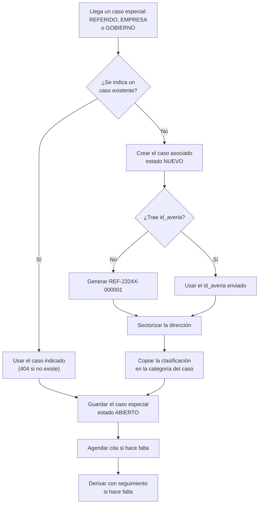
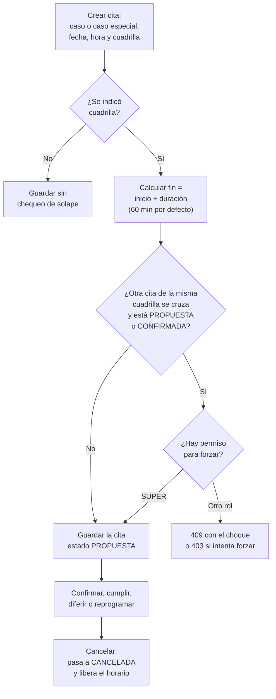

# 06 — Seguimiento, casos especiales y agenda

> Manual para todo público. Explica, en lenguaje sencillo, cómo funcionan en GGTO los **casos
> especiales** (referidos, empresas y gobiernos), la **agenda de citas** y el **seguimiento** de
> casos derivados a otras instancias. GGTO es el *Sistema de administración de reportes de
> avería y construcción de puntos ópticos* de **CANTV C.A., Central Francisco Salias (Área 4)**.
> Este manual no promete funciones que todavía no existen: cuando algo está pendiente, lo dice
> con claridad.

## Empezar en 5 minutos

Si es tu primer día con ESPECIALES, AGENDA y seguimiento, con estos cinco pasos ya puedes
ubicarte.

1. **Entra por la barra superior.** Busca las secciones **ESPECIALES** y **AGENDA**. En
   ESPECIALES verás los casos `REFERIDO`, `EMPRESA` y `GOBIERNO`; en AGENDA, las citas.
2. **Registra el caso especial.** El sistema pide la **clasificación** (referido, empresa o
   gobierno), el **tipo de actividad** (reparación o construcción) y los datos del
   **solicitante** (la persona externa que reporta). Si el caso no existía, el sistema lo crea
   con un identificador `REF-…`.
3. **Agenda la cita.** Entra a AGENDA, crea la cita con fecha y hora, y elige la cuadrilla. Si la
   cuadrilla ya tiene una cita a esa hora, el sistema avisa con un conflicto **409** y no la
   guarda. Solo el Super Usuario puede forzar el solape.
4. **Deriva el caso si hace falta.** Con **seguimiento** envías el caso a otra instancia o cola.
   Al hacerlo, el caso pasa a `ENRUTADO` y sale del despacho de calle.
5. **Consulta el resultado.** Cuando la otra instancia devuelve el caso, el seguimiento pasa a
   `DEVUELTO` y el caso vuelve a `NUEVO`, listo para entrar otra vez al despacho.

## Visión general (RF-12, RF-34..RF-36, D-30/D-53)

Este manual cubre el **Ciclo 6** del proyecto GGTO:

- Los **casos especiales** (`REFERIDO`, `EMPRESA` y `GOBIERNO`) con su **solicitante**.
- La **agenda de citas**, con control de solapamiento por cuadrilla.
- El **seguimiento** de casos derivados a otras instancias.

Las tres capacidades comparten el mismo conjunto de direcciones del sistema y atienden los
requisitos RF-06, RF-12, RF-34, RF-35, RF-36 y RNF-04.

La decisión **D-30** fijó la ficha de casos especiales: solicitante con unidad, nombre, contacto
y canal, más prioridad y clasificación. La decisión **D-53** da por completado el Ciclo 6, con:

- Casos especiales funcionando.
- Agenda sin solapamiento por cuadrilla, con duración configurable, respuesta **409** con el
  choque y permiso de forzar solo para `SUPER`.
- Seguimiento que enruta el caso y lo saca del despacho.
- Las páginas **ESPECIALES** y **AGENDA**.
- **111/111 pruebas** y el despliegue `ggto-web-00008-vr5` (imagen `v8`).

### Alcance funcional

| Requisito | Descripción en palabras sencillas |
|---|---|
| **RF-12** | Contactar y acordar hora con el cliente, y gestionar la agenda interna. |
| **RF-34** | Gestionar el seguimiento de casos derivados a otras instancias o colas. |
| **RF-35** | Gestionar casos de **EMPRESA** (reparación o construcción) y su cita. |
| **RF-36** | Gestionar casos **REFERIDO** sin `id_averia`, priorizados, con identificador `REF-…`. |
| **RNF-04** | Agenda sin solapamiento por cuadrilla. |

### Archivos de referencia

Esta tabla es para quien necesite ubicar el código. El resto del manual no la necesita para
operar el sistema.

| Capa | Archivo |
|---|---|
| Direcciones de la API | `app/api/routes_especiales.py` |
| Esquemas de validación | `app/schemas/especiales.py` |
| Modelos de base de datos | `app/models/especiales_entities.py` |
| Definición de tablas y función `REF-…` | `RepoTecnico/db/schema.sql` |
| Páginas web | `app/web/src/pages/Especiales.tsx`, `app/web/src/pages/Agenda.tsx` |
| Pruebas de integración | `app/tests/test_especiales_api.py` |

El módulo se monta con el prefijo general `/api/v1`. Las **escrituras** exigen `ADMIN` o
`SUPERVISOR`; el rol `SUPER` tiene permiso total.

---

## Casos especiales

Un **caso especial** es un subtipo de caso: `REFERIDO`, `EMPRESA` o `GOBIERNO`. Se registra con
un caso asociado o sin él; cuando no existe el caso, el sistema lo crea automáticamente.

<!-- GENERAR_IMAGEN: flujo-caso-especial.svg -->

### clasificación REFERIDO/EMPRESA/GOBIERNO

El campo `clasificacion` es **obligatorio** y solo admite tres valores: `REFERIDO`, `EMPRESA` y
`GOBIERNO`. Se valida en la base de datos y también en la validación de la API, así que no se
puede escribir otro valor.

Al crear el caso asociado, la clasificación se copia en la categoría del caso. Gracias a eso, el
motor de despacho puede deducir el **tipo de asignación** y repartir el trabajo correctamente.

### prioridad ALTA/MEDIA/BAJA

El campo `prioridad` **no puede quedar vacío** y vale `MEDIA` por defecto. Solo admite tres
niveles: `ALTA`, `MEDIA` y `BAJA`.

- El listado permite filtrar por prioridad.
- La pantalla de ESPECIALES la muestra con un color distinto según el nivel.

### solicitante (unidad+nombre+contacto+canal)

El **solicitante** es el personal externo que reporta el caso. La tabla exige tres datos:
**unidad**, **nombre** y **contacto**. El canal solo admite `TELEGRAM`, `MCP_IA`, `MANUAL` o
`CORREO`.

Los topes de longitud son 120 caracteres para la unidad, 120 para el nombre y 60 para el
contacto. Si no se indica canal, queda `MANUAL`.

Al crear el caso especial hay **dos vías mutuamente excluyentes**:

1. **`id_solicitante`**: usar un solicitante que ya existe.
2. **`crear_solicitante`**: crear el solicitante en la misma operación.

Si se envían las dos, la API responde **422** con el mensaje:

> «Indique `id_solicitante` o `crear_solicitante`, no ambos»

Si se crea en línea, el sistema guarda el solicitante y obtiene su identificador. Si se
referencia un identificador que no existe, responde **404**.

### creación automática del caso REF-...

Cuando la petición no trae `id_caso`, el sistema crea el caso asociado. Sus pasos son:

1. Resolver la central configurada.
2. Obtener el `id_averia`: el que envió el cliente o, si falta, uno generado por la función de
   base de datos `generar_id_averia_ref`. Esa función construye identificadores con la forma
   `REF-<CÓDIGO_CENTRAL>-<NNNNNN>`. Para la Central Francisco Salias produce valores como
   `REF-2324X-000001`.
3. Rechazar duplicados con **409** y el mensaje «Ya existe un caso con id_averia …».
4. Sectorizar la dirección con los patrones de la central.
5. Crear el caso con:
   - `origen="MANUAL"`.
   - `estado_actual="NUEVO"`.
   - `tipo_caso` igual a `CONSTRUCCION` si el tipo de actividad es construcción, y `REPARACION`
     en caso contrario.
   - `categoria` igual a la clasificación del caso especial.

El caso especial se guarda en estado `ABIERTO` y con `tiene_id_averia=True` cuando el caso
asociado existe.

La prueba de integración verifica que un referido sin `id_averia` recibe uno que empieza por
`REF-2324X-` y que el caso asociado queda con categoría `REFERIDO`.

---

## Endpoints de solicitantes y casos especiales (app/api/routes_especiales.py:50,57,103,124,173,183)

| Método y ruta | Rol | Resumen |
|---|---|---|
| `GET /api/v1/solicitantes` | Lectura | Lista solicitantes por unidad y nombre. |
| `POST /api/v1/solicitantes` | Escritura | Crea un solicitante. |
| `GET /api/v1/casos-especiales` | Lectura | Lista con filtros y resumen. |
| `POST /api/v1/casos-especiales` | Escritura | Ingresa un caso especial. |
| `GET /api/v1/casos-especiales/{id}` | Lectura | Ficha del caso especial. |
| `PATCH /api/v1/casos-especiales/{id}` | Escritura | Actualiza el caso especial. |

### Solicitantes

- **`GET /solicitantes`** devuelve el padrón ordenado por unidad y nombre.
- **`POST /solicitantes`** crea el solicitante, confirma el guardado y responde **201**.

### Casos especiales

- **`GET /casos-especiales`** acepta cuatro filtros: `clasificacion`, `estado`, `prioridad` y
  `solo_pendientes`. El filtro «solo pendientes» deja únicamente los estados `ABIERTO` y
  `EN_PROCESO`. El listado se enriquece con los campos calculados que se explican abajo.
- **`POST /casos-especiales`** exige al menos la clasificación y el tipo de actividad. Con
  `id_caso` usa un caso existente (responde **404** si no existe) y sin él lo crea con la rutina
  ya descrita.
- **`GET /casos-especiales/{id}`** responde **404** con «Caso especial no encontrado» si el
  identificador no existe.
- **`PATCH /casos-especiales/{id}`** aplica solo los campos enviados: `estado`, `prioridad`,
  `descripcion`, `requiere_informe`, `clasificacion`, `tipo_actividad` e `id_solicitante`.

### Resumen de estado calculado

El sistema agrega a cada fila del listado unos campos de contexto que la pantalla usa para
pintar los iconos. No se guardan: se deducen al vuelo.

| Campo | Regla |
|---|---|
| `sector_nombre` | Nombre del sector del caso asociado. |
| `solicitante_nombre` / `solicitante_unidad` | Datos del solicitante referenciado. |
| `pendiente` | El estado es `ABIERTO` o `EN_PROCESO`. |
| `asignado` | El caso está en un despacho. |
| `citado` | Tiene una cita en estado `PROPUESTA` o `CONFIRMADA`, por caso o por caso especial. |
| `gestion` | Está en gestión del supervisor, su estado es `EN_GESTION` o su despacho dice `GESTIONADO`. |

Estas marcas se calculan con consultas agregadas y se vuelcan sobre cada fila. En la pantalla se
pintan con el componente de chips de estado.

---

## Agenda de citas

La agenda gestiona el compromiso de **contacto** o de **atención** con el cliente. Dicho simple:
es el calendario del equipo, con la regla de que una cuadrilla no puede estar en dos citas a la
misma hora.

### modelo cita

| Campo | Tipo | Qué significa |
|---|---|---|
| `id_cita` | número entero grande, clave | Identificador de la cita. |
| `id_caso` | entero grande, referencia a caso, opcional | Cita asociada a un caso. |
| `id_caso_especial` | entero, referencia a caso especial, opcional | Cita asociada a un caso especial. |
| `id_cuadrilla` | entero, referencia a cuadrilla, opcional | Cuadrilla responsable. |
| `fecha_hora` | fecha y hora | Fecha y hora de la cita. |
| `tipo` | texto corto | `CONTACTO` o `ATENCION`. |
| `estado` | texto corto | Estado de la cita. |
| `observacion` | texto largo | Nota libre. |
| `creado_por` | texto, referencia a usuario | Usuario que la agendó. |

Una regla garantiza que **toda cita apunte a un caso**: o tiene `id_caso`, o tiene
`id_caso_especial`; no puede tener los dos vacíos.

### validación de solapamiento (409)

- La **duración por defecto** de una cita es de **60 minutos**.
- Los estados que **bloquean** la agenda son `PROPUESTA` y `CONFIRMADA`.
- Esa duración y esos estados se leen de la configuración `agenda.duracion_minutos` y
  `agenda.estados_bloqueantes`, y si no están definidos se usan los valores por defecto.

> **Pendiente de confirmar:** todavía no se ha confirmado si esas dos claves de configuración
> están sembradas en la base de datos. No aparecen en el archivo que define las tablas, así que
> hoy rigen los valores por defecto.

La validación de solapamiento **solo actúa si hay cuadrilla asignada**:

1. Calcula el fin de la cita como la hora de inicio más la duración.
2. Busca otra cita de la **misma cuadrilla** que esté en un estado bloqueante y cuyo intervalo se
   cruce con el de la nueva cita.
3. Si hay choque, responde **409** con el detalle «La cuadrilla ya tiene una cita a las
   <fecha> (duración <n> min)».

El solapamiento se puede **forzar** con `permitir_solape`, pero **solo el rol `SUPER`**. Si otro
rol lo intenta, la API responde **403** con el mensaje:

> «Solo el Super Usuario puede forzar solapamientos»

### estados

Los estados válidos de una cita son seis:

`PROPUESTA`, `CONFIRMADA`, `CUMPLIDA`, `REPROGRAMADA`, `DIFERIDA` y `CANCELADA`.

La pantalla ofrece acciones directas para **confirmar**, **cumplir**, **diferir** y
**cancelar** una cita.

El borrado es **lógico**: no se elimina la fila. Al pedir eliminar, la cita pasa a `CANCELADA`.
Como ese estado no está entre los bloqueantes, la cita deja de ocupar la agenda. Así, después de
cancelar, se puede agendar otra cita en el mismo horario; la prueba de integración lo confirma.

### endpoints (routes_especiales.py:280,301,329,355)

| Método y ruta | Rol | Resumen |
|---|---|---|
| `GET /api/v1/citas` | Lectura | Agenda filtrada por rango, cuadrilla y estado. |
| `POST /api/v1/citas` | Escritura | Agenda una cita sin solapamiento. |
| `PATCH /api/v1/citas/{id_cita}` | Escritura | Reprograma o cambia el estado. |
| `DELETE /api/v1/citas/{id_cita}` | Escritura | Cancela la cita (responde **204**). |

- **`GET /citas`** ordena por fecha y hora, y filtra por rango (`desde` y `hasta`), por cuadrilla
  y por estado.
- **`POST /citas`** exige `id_caso` o `id_caso_especial`; si faltan los dos, responde **422**.
  Valida que existan el caso, el caso especial y la cuadrilla (**404** si alguno no existe). Al
  guardar, excluye el campo auxiliar `permitir_solape` y registra quién la creó.
- **`PATCH /citas/{id_cita}`** valida el solapamiento **solo si cambian** la fecha y hora o la
  cuadrilla, y excluye la propia cita del chequeo (para que no choque consigo misma).
- **`DELETE /citas/{id_cita}`** responde **404** si no existe y **204** al cancelarla.

<!-- GENERAR_IMAGEN: agenda-citas.svg -->

---

## Seguimiento

El seguimiento registra la **derivación** de un caso a otra instancia o cola (RF-34). Dicho
simple: es la libreta de traspasos, con la fecha de envío, la fecha de retorno y el estado.

### tabla seguimiento

| Campo | Tipo | Qué significa |
|---|---|---|
| `id_seguimiento` | número entero grande, clave | Identificador de la derivación. |
| `id_caso` | entero grande, referencia a caso | Caso derivado. Se borra en cascada con el caso. |
| `instancia_destino` | texto corto | Cola o área destino. |
| `motivo` | texto largo | Razón de la derivación. |
| `fecha_envio` | fecha y hora | Fecha de envío (por defecto, el momento actual). |
| `fecha_retorno` | fecha y hora | Fecha de retorno, si ocurrió. |
| `estado` | texto corto | `EN_COLA` / `RESUELTO` / `DEVUELTO`. |
| `observacion` | texto largo | Nota libre. |
| `usuario` | texto, referencia a usuario | Usuario que derivó. |

### exclusión del despacho

Al crear un seguimiento en estado `EN_COLA`, el caso pasa a `estado_actual = "ENRUTADO"`. Como el
motor de despacho excluye explícitamente los estados `CERRADO`, `CANCELADO` y `ENRUTADO`, el caso
**sale del despacho de calle** hasta que se devuelva. La prueba de integración comprueba que un
caso enrutado no aparece en la propuesta.

Cuando el seguimiento pasa a `DEVUELTO`:

- El caso vuelve a `NUEVO`.
- El caso vuelve a `en_gestion_supervisor=False`.
- Se sella la fecha de retorno.

Con eso, el caso queda otra vez disponible para el despacho. La prueba de integración también
cubre este regreso.

### endpoints (routes_especiales.py:369,387,409,433)

| Método y ruta | Rol | Resumen |
|---|---|---|
| `GET /api/v1/seguimiento` | Lectura | Lista derivaciones con filtros. |
| `POST /api/v1/seguimiento` | Escritura | Deriva un caso a otra instancia. |
| `PATCH /api/v1/seguimiento/{id}` | Escritura | Actualiza estado o datos. |
| `GET /api/v1/seguimiento/{id}` | Lectura | Ficha de la derivación. |

- **`GET /seguimiento`** ordena por número de seguimiento descendente y filtra por caso, estado e
  instancia destino (búsqueda por parecido en el destino).
- **`POST /seguimiento`** responde **404** si el caso no existe y registra al usuario que deriva.
- **`PATCH /seguimiento/{id}`** aplica solo los campos enviados. Si el nuevo estado es
  `DEVUELTO`, restituye el caso.
- **`GET /seguimiento/{id}`** responde **404** con «Seguimiento no encontrado» si no existe.

---

## Esquemas (app/schemas/especiales.py) y modelos (app/models/especiales_entities.py)

### Esquemas Pydantic

El archivo define los literales compartidos y estos modelos:

| Esquema | Para qué sirve |
|---|---|
| `SolicitanteCreate` / `SolicitanteOut` | Alta y lectura de solicitantes. |
| `CasoEspecialCreate` | Alta, incluido `crear_solicitante` y los datos del caso. |
| `CasoEspecialUpdate` | Edición parcial. |
| `CasoEspecialOut` | Ficha más los campos de resumen calculados. |
| `CitaCreate` / `CitaUpdate` | Alta y edición de citas, incluido `permitir_solape`. |
| `CitaOut` | Lectura de citas. |
| `SeguimientoCreate` / `SeguimientoUpdate` | Alta y edición de derivaciones. |
| `SeguimientoOut` | Lectura de derivaciones. |

El campo `crear_solicitante` se documenta como «Crea el solicitante en la misma operación». Los
esquemas de lectura se arman directamente desde las entidades de base de datos.

### Modelos SQLAlchemy

El archivo de modelos declara cuatro entidades:

| Modelo | Tabla |
|---|---|
| `Solicitante` | `solicitante` |
| `CasoEspecial` | `caso_especial` |
| `Cita` | `cita` |
| `Seguimiento` | `seguimiento` |

Los comentarios del módulo identifican al `Solicitante` como «personal externo que reporta casos
especiales» y a la `Cita` como la agenda que «no admite solapamientos por cuadrilla».

---

## Páginas web ESPECIALES y AGENDA (app/web/src/pages/Especiales.tsx, Agenda.tsx)

Ambas páginas están dentro de la ruta protegida y se montan en `/especiales` y `/agenda`.

### ESPECIALES

La página ofrece:

- Filtros por **clasificación**, **estado** y **prioridad**.
- La casilla «Solo pendientes (ABIERTO / EN_PROCESO)».
- Una tabla de resultados con tipo de actividad, sector, prioridad, solicitante, estado y acción.

Cada fila es **clicable**:

- Si el caso especial tiene `id_caso`, navega a **CASOS** y abre esa ficha.
- Si no lo tiene, abre la **ficha especial**.

La ficha muestra: ID de caso especial, caso asociado, solicitante, clasificación, tipo de
actividad, sector, prioridad, estado, `tiene_id_averia`, `requiere_informe`, descripción y marcas
de tiempo.

La edición solo está disponible fuera del modo lectura y permite cambiar prioridad, estado,
`requiere_informe` y descripción. Al guardar, se envían **únicamente los campos que cambiaron**.

### AGENDA

La agenda es un **calendario** con tres vistas: **Día**, **Semana** y **Mes**.

- El rango visible se calcula según la vista: un día, la semana de lunes a domingo, o la rejilla
  mensual completa.
- La carga pide las citas del rango, desde las `T00:00:00` hasta las `T23:59:59`, con filtros
  opcionales de cuadrilla y estado.

La ficha de una cita permite:

- **Confirmar**, **cumplir**, **diferir** y **cancelar**.
- **Reprogramar** la fecha.
- **Eliminar** la cita (lo que en realidad la cancela).

La casilla «Forzar solape» solo se habilita si el rol del usuario es `SUPER`. Los errores **409**
y **403** se traducen a mensajes que empiezan por «Solapamiento: …» y «Sin permiso: …».

La ayuda que aparece bajo el formulario recuerda dos cosas: que se exige al menos un ID de caso o
de caso especial, y que solo el Super Usuario puede forzar el solape.

---

## Pruebas (app/tests/test_especiales_api.py 15)

La Fase 4 registra este archivo con **15 pruebas de integración** para referidos, empresas y
gobierno, solicitante y seguimiento, dentro del total **169/169** en verde. El plan de pruebas
asigna a las pruebas E2E-04 y E2E-05 la cobertura de especiales y agenda para RF-12 y
RF-35/RF-36.

### Escenarios cubiertos por la suite de integración

| Escenario | Qué se verifica |
|---|---|
| EMPRESA crea caso y solicitante | Responde 201; el caso y el solicitante quedan creados con identificador; `tiene_id_averia`. |
| REFERIDO sin `id_averia` | El sistema genera `REF-2324X-…` y la categoría queda `REFERIDO`. |
| Filtros y actualización | Filtra por clasificación y prioridad; la edición a `ATENDIDO` funciona; el filtro de pendientes. |
| Crear cita | Responde 201 y la cita nace en estado `PROPUESTA`. |
| Cita requiere referencia | Sin caso ni caso especial, responde 422. |
| No solapamiento | A 30 minutos responde 409; a 90 minutos responde 201. |
| Cita cancelada no bloquea | La cancelación responde 204 y una nueva cita a 15 minutos se acepta. |
| Actualizar cita valida solape | Una edición en conflicto responde 409; fuera de la ventana responde 200. |
| Listado por rango | El rango devuelve al menos una cita. |
| Derivar y devolver | Pasa a `ENRUTADO` y sale del despacho; al volver a `DEVUELTO` regresa a `NUEVO`. |
| Seguimiento inexistente | Responde 404. |
| Filtros de seguimiento | Por instancia destino y por estado `EN_COLA`. |
| TECNICO solo lectura | La lectura responde 200; crear especiales y seguimiento responde 403. |
| Sin token | Responde 401. |
| SUPER fuerza solape | `SUPER` obtiene 201; `ADMIN` obtiene 403. |

El entorno de pruebas prepara un sector, una cuadrilla y un caso base, y expone sus
identificadores para las pruebas. Así se cubren las tres verticales del módulo —especiales,
agenda y seguimiento— además del control de acceso por rol.

**Modo de pruebas:** para no mezclar datos, las pruebas usan la variable `DB_SCHEMA` con
esquemas aislados: `ggto_test` para las pruebas de backend con `pytest` y `ggto_e2e` para las
pruebas de navegador con Playwright. La suite de navegador cerró en **46/46**, y las herramientas
de calidad (ruff, mypy y tsc en modo estricto) no arrojaron hallazgos.
