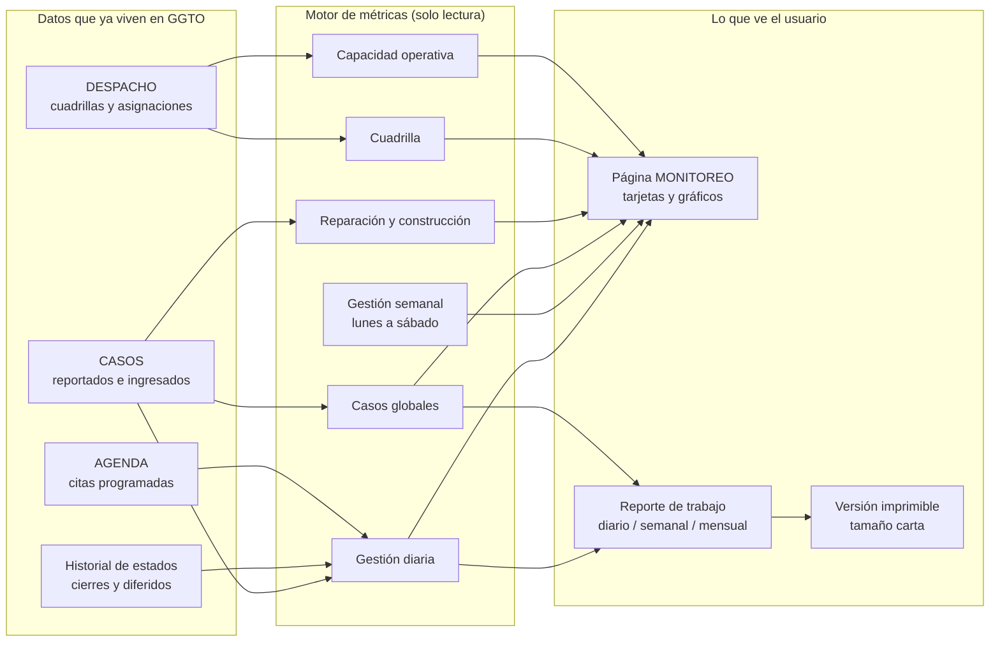

# Manual técnico — Monitoreo y reportes (GGTO, Ciclo 7)

> Manual para todo público. Explica, en lenguaje sencillo, **cómo GGTO cuenta el trabajo diario y semanal**
> y **cómo muestra esas cifras** en la página MONITOREO, en sus gráficos y en el reporte de trabajo que se
> puede imprimir. Está dirigido a técnicos de campo, supervisores y administradores de la Central Francisco
> Salias (Área 4) de CANTV. Todo lo que aquí se describe corresponde al Ciclo 7 del proyecto. Cuando algo
> todavía no está cerrado, se indica con la frase **«pendiente de confirmar»**.

## Empezar en 5 minutos

1. **MONITOREO es de solo lectura.** Cualquier usuario con sesión válida —incluido el rol Técnico— puede
   consultar las cifras, pero **no puede modificarlas** desde aquí. La página **MONITOREO** del sistema
   muestra los tableros; no cambia datos.
2. **Las cifras nacen de una regla escrita.** Todas las fórmulas provienen del documento normativo de
   métricas del proyecto (versión 1.0), que **sigue pendiente de validación formal con CANTV**. El sistema
   ya calcula con esas reglas; lo que falta es la conformidad de CANTV.
3. **Se cuenta en hora de Venezuela.** El día va de 00:00 a 23:59:59 y la semana operativa es de **lunes a
   sábado**. El domingo es día no operativo. Los conteos son números enteros: en la versión 1 no hay
   promedios.
4. **Reparación y construcción nunca se mezclan.** Un caso de construcción jamás aparece en el total de
   reparación, y viceversa. Esa separación está probada automáticamente.
5. **Existen 9 operaciones de consulta y un reporte imprimible.** Siete alimentan los tableros, una entrega
   el reporte diario, semanal o mensual, y otra entrega ese mismo reporte como página lista para imprimir.

<!-- GENERAR_IMAGEN: infografia-monitoreo.svg -->

## Visión general

### Alcance y requerimientos

El módulo de **MONITOREO y REPORTES** corresponde al **Ciclo 7** del plan de desarrollo. Su objetivo es
alimentar los tableros y gráficos con las métricas de gestión diaria y semanal, de casos globales, de
reparación, de construcción y de cuadrilla (requerimiento funcional **RF-26**). Además, genera el reporte de
trabajo diario, semanal y mensual (requerimiento funcional **RF-28**). El catálogo funcional agrupa este
módulo bajo las zonas **MONITOREO**, **GRÁFICOS** y **REPORTES**.

En la traza de decisiones del proyecto, el cierre de las métricas se registra en la decisión **D-56**. Esa
decisión da por completado el Ciclo 7 con las métricas cerradas en el documento normativo de métricas
versión 1.0 —lo que a su vez cierra los puntos **S-08** y **D-17**—, con siete operaciones de monitoreo, el
reporte diario, semanal y mensual con versión imprimible, y una página web con gráficos propios en formato
SVG (dibujo vectorial que el navegador muestra nítido a cualquier tamaño). La definición de las métricas
había quedado **explícitamente diferida a la Fase 3** por la decisión **D-17**.

| Aspecto | Valor verificado |
|---|---|
| Ciclo | Ciclo 7 — MONITOREO y REPORTES |
| Requerimientos | RF-26 (tableros) y RF-28 (reporte de trabajo) |
| Documento normativo | Documento de métricas del proyecto, versión 1.0 — **pendiente de validación con CANTV** |
| Router (archivo de rutas) | `app/api/routes_monitoreo.py`, con prefijo `/api/v1` |
| Servicio (lógica de cálculo) | `app/services/monitoreo.py` |
| Página web | `app/web/src/pages/Monitoreo.tsx` |
| Gráficos | SVG propios en `app/web/src/components/graficos.tsx` |
| Montaje del router | Se registra en el arranque de la aplicación (`app/main.py`) |

### Fuente normativa de las métricas

Todas las fórmulas implementadas provienen del **documento normativo de métricas** del proyecto. La
cabecera de ese documento advierte que cada métrica define su **fórmula**, la **entidad** que consulta, la
**ventana** de tiempo y el **redondeo**. También fija tres reglas generales:

1. Todo se calcula en **hora de Venezuela** (`America/Caracas`).
2. «Día» significa el día natural completo, de **00:00 a 23:59:59**.
3. La **semana operativa es de lunes a sábado**, y el **domingo es día no operativo**.

El módulo de servicio declara esa dependencia en su descripción interna: «Cálculo de las métricas de
MONITOREO y REPORTES (ver el documento normativo de métricas)». El archivo de rutas hace lo propio e incluye
además el requerimiento **RF-07**.

### Ubicación en el código

| Capa | Archivo | Responsabilidad |
|---|---|---|
| API (puerta de entrada) | `app/api/routes_monitoreo.py` | 9 operaciones HTTP, validación de parámetros y plantilla HTML imprimible |
| Servicio (cálculo) | `app/services/monitoreo.py` | Consultas a la base de datos y armado de cada indicador |
| Esquemas (contratos de datos) | No hay un módulo de contratos dedicado: las operaciones devuelven diccionarios simples | Las funciones se anotan como `-> dict` |
| Tipos del frontend | `app/web/src/api/types.ts` | Interfaces `MonitoreoDiario`…`ReporteTrabajo`, importadas por la página |
| Cliente web | `app/web/src/api/client.ts` | Funciones `monitoreoDiario`…`obtenerReporteTrabajoImprimible` |
| Página web | `app/web/src/pages/Monitoreo.tsx` | Tablero de solo lectura y formulario de reportes |
| Gráficos | `app/web/src/components/graficos.tsx` | Barras, barras agrupadas, curva y torta, todo en SVG |

El archivo de rutas **no define ningún rol de escritura**: todas sus operaciones exigen únicamente un
usuario autenticado. Por eso el módulo es de **solo lectura** para cualquier rol con sesión válida. Las
pruebas de acceso confirman que el rol **TECNICO** puede consultar las siete rutas de monitoreo y el
reporte.

## Métricas

### Gestión diaria

La función de gestión diaria devuelve el bloque correspondiente al día indicado. El sistema la expone en
`GET /api/v1/monitoreo/diario` y, si no se envía una fecha, usa el día de hoy.

| Indicador | Qué cuenta, en palabras |
|---|---|
| `ingresos_nuevos` | Casos creados en el sistema ese día |
| `resueltos_residencial` | Casos que pasaron al estado CERRADO ese día, de categoría RESIDENCIAL |
| `resueltos_empresarial` | Igual, pero de categoría EMPRESA o GOBIERNO |
| `resueltos_referidos` | Igual, pero de categoría REFERIDO |
| `citados` | Casos distintos que tuvieron una cita (AGENDA) ese día |
| `diferidos` | Casos que pasaron al estado DIFERIDO ese día |
| `gestionados` | Casos distintos con una gestión registrada en un despacho del día |
| `pendientes_total` | Casos cuyo estado actual no es CERRADO ni CANCELADO |

El criterio de **«pendiente»** está centralizado: se excluyen siempre los estados **CERRADO** y
**CANCELADO**. La categoría **empresarial** agrupa **EMPRESA** y **GOBIERNO**. La prueba de integración
verifica el bloque con 5 ingresos, 1 resuelto residencial y 4 pendientes.

#### Nota sobre «gestionado»

El documento normativo define **«Gestionado»** como el caso que tiene al menos una gestión registrada. Al
mismo tiempo, aclara que, **mientras no exista la app móvil (Ciclo 8), ese valor se aproxima** usando el
estado `GESTIONADO` del despacho. La implementación real usa exactamente esa aproximación.

> **Importante:** la **app móvil Flutter no está desarrollada** en la versión 1 y su ciclo está pospuesto.
> No debe documentarse como si estuviera disponible.

### Gestión semanal (lunes → sábado)

El cálculo de la semana obtiene el **lunes** a partir del día de la semana de la fecha y luego suma cinco
días para llegar al **sábado**. La constante de días de la semana es **6**. La función de gestión semanal
recorre esos seis días y arma la curva.

| Indicador por día | Qué cuenta, en palabras |
|---|---|
| `asignados` | Casos incluidos en los despachos de ese día |
| `cerrados` | Casos resueltos (pasaron a CERRADO) en ese día |
| `gestionados` | Casos con gestión registrada en un despacho de ese día |

La respuesta devuelve **desde** (el lunes) y **hasta** (el sábado) junto con la lista de días. Una prueba
verifica que siempre se devuelven **exactamente seis puntos** y que cada día trae sus cuatro claves. Otra
prueba documenta un caso de borde: **si hoy es domingo, el cierre queda fuera de la ventana** de la semana.

### Casos globales

La función de casos globales **combina los pendientes a la fecha con los resueltos dentro del rango** y
agrega desgloses por estado y por categoría.

| Campo | Qué muestra, en palabras |
|---|---|
| `pendientes` | Casos abiertos (excluye CERRADO y CANCELADO) |
| `resueltos` | Casos cerrados dentro del rango consultado |
| `total` | Suma de pendientes más resueltos |
| `por_estado` | Conteo agrupado por estado actual del caso |
| `por_categoria` | Conteo agrupado por categoría del caso |

En la API, el rango por defecto va **del día 1 del mes en curso hasta hoy**.

### Reparación

La métrica de reparación cuenta los **casos pendientes que no son de construcción**, separados por
categoría:

| Campo | Qué cuenta, en palabras |
|---|---|
| `residenciales_comunes` | Pendientes de categoría RESIDENCIAL que no son construcción |
| `residenciales_referidos` | Pendientes de categoría REFERIDO que no son construcción |
| `empresariales` | Pendientes de categoría EMPRESA o GOBIERNO que no son construcción |
| `total` | Suma de los tres grupos anteriores |

### Construcción

La métrica de construcción cuenta los **casos pendientes que sí son de construcción**:

| Campo | Qué cuenta, en palabras |
|---|---|
| `residenciales` | Pendientes de construcción de categoría RESIDENCIAL |
| `empresariales` | Pendientes de construcción de categoría EMPRESA o GOBIERNO |
| `total` | Suma de ambos grupos |

Una prueba verifica que un caso de categoría EMPRESA y tipo CONSTRUCCION **no se cuenta en reparación** y
**sí se cuenta en construcción** (total 1).

### Cuadrilla

El cálculo por cuadrilla recorre las **cuadrillas de calle** (las que no son de supervisor), ordenadas por
código, y calcula por día y por cuadrilla tres valores: **asignados**, **cerrados** y **gestionados**.
Luego acumula los totales. La respuesta incluye la fecha de inicio y los días considerados.

#### Cálculo de «cerrados» por cuadrilla

Para contar los cerrados de una cuadrilla, el sistema cruza el historial de estados del caso con el caso,
con los casos del despacho y con el despacho. Exige que el despacho sea **de esa cuadrilla y de ese día** y
que el historial registre el paso a **CERRADO con fecha del mismo día**. Una prueba genera el despacho del
lunes, marca un caso como gestionado y comprueba 4 asignados y 1 gestionado.

### Capacidad operativa

La métrica de capacidad lista las **cuadrillas activas** ordenadas por código y arma el detalle de cada una:
**integrantes vigentes** (los que siguen en la cuadrilla, sin fecha de salida), la **flota asociada**
formateada como «cantidad (estado)» y una marca que indica si la cuadrilla está **completa**.

| Campo agregado | Qué cuenta, en palabras |
|---|---|
| `cuadrillas_activas` | Cuadrillas del detalle que no son de supervisor |
| `tecnicos_activos` | Técnicos de la central con estado ACTIVO |
| `flota_disponible` | Vehículos de la central con estado DISPONIBLE |
| `herramientas_disponibles` | Herramientas con estado DISPONIBLE |
| `sectores_activos` | Sectores de la central marcados como activos |

Una prueba confirma 2 cuadrillas activas, 3 en el detalle (incluye la cuadrilla 0, que es la del
supervisor) y que, cuando no hay integrantes ni flota, las cuadrillas de calle quedan marcadas como
**incompletas**.

## Endpoints

### Superficie de la API

El archivo de rutas se declara con el prefijo `/api/v1` y la etiqueta de documentación
«monitoreo y reportes». Expone **9 operaciones**:

| Método y ruta | Para qué sirve |
|---|---|
| `GET /api/v1/monitoreo/diario` | Gestión diaria |
| `GET /api/v1/monitoreo/semanal` | Gestión semanal (curva de lunes a sábado) |
| `GET /api/v1/monitoreo/globales` | Casos globales: pendientes frente a resueltos |
| `GET /api/v1/monitoreo/reparacion` | Pendientes de reparación por tipo |
| `GET /api/v1/monitoreo/construccion` | Pendientes de construcción por tipo |
| `GET /api/v1/monitoreo/cuadrilla` | Asignados, cerrados y gestionados por cuadrilla |
| `GET /api/v1/monitoreo/capacidad` | Capacidad operativa |
| `GET /api/v1/reportes/trabajo` | Reporte de trabajo (diario, semanal o mensual) |
| `GET /api/v1/reportes/trabajo/imprimible` | El mismo reporte, en HTML listo para imprimir |

### Parámetros y resolución de la central

Todas las operaciones aceptan el **identificador de central** como dato opcional. Cuando no se envía, el
sistema **resuelve la central activa** usando la configuración guardada. La sesión de base de datos y el
usuario autenticado se inyectan automáticamente en cada operación.

| Endpoint | Parámetros propios | Validación |
|---|---|---|
| `/monitoreo/diario` | `fecha`, `id_central` | Si no hay fecha, se usa el día de hoy |
| `/monitoreo/semanal` | `desde`, `id_central` | Si no hay fecha, se usa el día de hoy |
| `/monitoreo/globales` | `desde`, `hasta`, `id_central` | Por defecto: del día 1 del mes en curso hasta hoy |
| `/monitoreo/reparacion` | `id_central` | — |
| `/monitoreo/construccion` | `id_central` | — |
| `/monitoreo/cuadrilla` | `desde`, `dias`, `id_central` | `dias` entre 1 y 31; por defecto 6 |
| `/monitoreo/capacidad` | `id_central` | — |
| `/reportes/trabajo` | `periodo`, `fecha`, `id_central` | `periodo` solo admite diario, semanal o mensual |
| `/reportes/trabajo/imprimible` | `periodo`, `fecha`, `id_central` | La misma restricción de `periodo` |

El parámetro `dias` de `/monitoreo/cuadrilla` se usa para construir el rango de fechas. En la página web
siempre se solicita con **6 días** (una semana completa, de lunes a sábado).

#### Cliente web

El cliente web del frontend implementa **una función por cada operación** (`monitoreoDiario`…,
`monitoreoCapacidad`, `reporteTrabajo` y `obtenerReporteTrabajoImprimible`). El reporte imprimible se pide
**con la credencial de sesión** y se abre en una **pestaña nueva**, porque una dirección escrita
directamente en el navegador no puede llevar la cabecera de autorización.

## Reporte de trabajo

### GET /api/v1/reportes/trabajo

La función del reporte de trabajo calcula el rango según el **periodo** y compone un objeto con varios
bloques: `periodo`, `desde`, `hasta`, `diario`, `semanal`, `globales`, `reparacion`, `construccion`,
`cuadrilla` y `capacidad`.

| Periodo | Rango que cubre |
|---|---|
| `diario` | El día indicado |
| `semanal` | De lunes a sábado de la semana del día indicado |
| `mensual` | Del día 1 al último día del mes |

El rango mensual se calcula tomando el primer día del mes siguiente y restándole un día. El bloque semanal
**siempre** se calcula desde el lunes de la fecha, aunque el periodo sea diario o mensual. Si el `periodo`
no es válido, la API responde con un error de validación (HTTP 422).

Una prueba recorre los **tres periodos** y comprueba que estén las siete claves, que el reporte mensual
empiece en el día 1 y que el semanal traiga **seis días**.

### Versión imprimible

La versión imprimible se declara como respuesta **HTML**. Vuelve a calcular el reporte de trabajo y usa los
bloques diario, globales, reparación y construcción. Con esos datos arma filas HTML para el detalle diario,
la semana, las cuadrillas y los pendientes por estado, y renderiza un documento completo con **tamaño
carta** y estilos de impresión.

| Elemento del HTML | De dónde sale |
|---|---|
| Tarjetas: pendientes, resueltos, reparación, construcción y cuadrillas activas | Casos globales, reparación, construcción y capacidad |
| Tabla «Gestión del día» | Bloque diario |
| Tabla «Gestión semanal (lunes a sábado)» | Días del bloque semanal |
| Tabla «Producción por cuadrilla (semana)» | Cuadrillas del bloque por cuadrilla |
| Tabla «Pendientes por estado» | Desglose por estado de los casos globales |
| Botón «Imprimir» | Solo en pantalla; no se imprime |

Una prueba verifica que la respuesta sea HTML, que incluya el tamaño carta, «Reporte de trabajo» y
«Gestión semanal». En la interfaz, el botón **«Imprimir / PDF»** obtiene el HTML y lo escribe en una ventana
nueva. Si el navegador bloquea la ventana emergente, se muestra un **aviso explícito** al usuario.

## Reglas de cálculo

### Reparación y construcción excluyentes

Reparación y construcción son **conjuntos separados**: reparación exige que el caso **no** sea de
construcción, y construcción exige que el caso **sí** sea de construcción. La regla está documentada en el
documento normativo de métricas y confirmada por una prueba automática. **Un caso nunca puede aparecer en
los dos totales.**

### Redondeo y zona horaria America/Caracas

El documento normativo fija las reglas transversales:

| Regla | Qué dice |
|---|---|
| Redondeo | Todos los conteos son números enteros; en la versión 1 no hay promedios |
| Zona horaria | Las fechas se interpretan en hora de Venezuela (`America/Caracas`); la interfaz muestra el formato día/mes/año |
| Tipos de fecha | La fecha del despacho es solo fecha; la fecha de creación del caso y la del historial incluyen hora y zona, y se recortan al día para comparar |

La implementación recorta las fechas al día en todas las comparaciones y **nunca calcula promedios**: todos
los indicadores son conteos o sumas de conteos. El único porcentaje existe en la **presentación de la torta**,
calculado en el navegador para mostrar cada porción, no en el servidor.

#### Matiz verificado sobre la zona horaria

El documento normativo afirma que el cálculo se hace en hora de Venezuela y que el recorte de fecha es «en
la zona del servidor». El código recorta las fechas con la zona horaria configurada en la sesión de
PostgreSQL. La **fijación explícita de esa zona a `America/Caracas` a nivel de conexión queda pendiente de
confirmar**.

## Página web MONITOREO y gráficos SVG propios

### Estructura de la página

La página **MONITOREO** es un **tablero de solo lectura**. Al abrirse, consulta **en paralelo** las siete
operaciones de monitoreo y **un fallo parcial no anula el resto**: cada bloque se guarda solo si su consulta
se completó bien, y se reporta el primer error encontrado.

| Zona de la interfaz | Contenido |
|---|---|
| Parámetros de consulta | Fecha (para diario y semana) y rango de casos globales |
| Reportes | Selector de periodo, «Ver reporte» e «Imprimir / PDF» |
| Zona gestión diaria | Tarjetas y gráfico de barras |
| Zona casos globales | Tarjetas, barras de pendientes y resueltos, y tablas por estado y categoría |
| Zona gestión semanal | Curva de asignados, cerrados y gestionados, más el detalle diario |
| Zona reparación | Gráfico de torta con el total en el centro |
| Zona construcción | Tarjetas y barras |
| Zona cuadrilla | Barras agrupadas y totales por cuadrilla |
| Zona capacidad operativa | Tarjetas y detalle de cuadrillas |

El resumen del reporte muestra el periodo y el rango, y luego los bloques de gestión diaria, casos globales,
reparación, construcción y capacidad operativa. Dos utilidades destacan: una calcula el **lunes** de la
semana tratando el domingo como si fuera el día 6 hacia atrás, y otra etiqueta la curva con el **día
abreviado más el número**.

### Componentes de gráficos

El módulo de gráficos implementa todo **sin dependencias externas**: no se usa ninguna librería de gráficos
comercial; **todo se dibuja con SVG y las clases de estilo del proyecto**. Esto **contradice la previsión
D-38**, que mencionaba una librería llamada Recharts. La realidad verificada es el SVG propio.

| Componente | Uso |
|---|---|
| `GraficoBarras` | Barras verticales con el valor encima y la etiqueta debajo |
| `GraficoBarrasAgrupadas` | Una serie por color dentro de cada grupo, con leyenda |
| `GraficoLineas` | Línea quebrada con un punto por observación y leyenda |
| `GraficoTorta` | Torta dibujada sobre un círculo, con leyenda y porcentajes |

Constantes de dibujo: un ancho lógico de 640, con 20 de margen superior y 60 de margen inferior. La paleta
de series usa seis colores corporativos. Todos los gráficos muestran el texto **«Sin datos para graficar.»**
cuando no hay información que representar.

#### Accesibilidad y detalle

Cada gráfico se declara con el rol de **imagen**, para que los lectores de pantalla lo reconozcan. Los
puntos de la curva llevan un texto emergente con la serie, la etiqueta y el valor; las porciones de la torta
hacen lo mismo. La torta además rotula **el total en el centro**.

## Pruebas

### Cobertura del ciclo 7

El archivo de pruebas `app/tests/test_monitoreo_api.py` contiene **16 pruebas** de integración y cubre
gestión diaria y semanal, casos globales, capacidad y reportes. La **Fase 4 cerró con 169 de 169 pruebas
automáticas de `pytest` en verde** y con **46 de 46 pruebas E2E de Playwright** aprobadas; además, las
revisiones de estilo con **ruff**, de tipos con **mypy** y de tipos del frontend con **tsc en modo
estricto** terminaron **sin hallazgos**.

| Prueba | Qué valida |
|---|---|
| Gestión diaria | Ingresos, resueltos y pendientes del día |
| Gestión diaria sin datos | Un día sin registros devuelve ceros |
| Casos globales | Pendientes, resueltos, total y desgloses |
| Reparación y construcción | Que ambos conjuntos sean excluyentes |
| Capacidad operativa | Cuadrillas activas, detalle y marca de incompleta |
| Gestión semanal | Que se devuelvan seis días, de lunes a sábado |
| Monitoreo por cuadrilla | Asignados y gestionados por cuadrilla |
| Semanal y cierres | El caso de borde del domingo, fuera de la ventana |
| Reporte de trabajo | Los tres periodos y sus bloques |
| Reporte imprimible | HTML con tamaño carta y sus secciones |
| Periodo inválido | Error HTTP 422 con un periodo inválido |
| Sin token | Error HTTP 401 sin autenticación |
| Técnico puede consultar | El rol Técnico sí puede leer |
| Cita del día | Una cita incrementa el conteo de citados |

**Modo de pruebas aislado.** Las pruebas no tocan los datos reales: usan la variable de entorno
**`DB_SCHEMA`** para trabajar sobre esquemas separados. Las pruebas de `pytest` usan el esquema
**`ggto_test`** y las pruebas E2E de Playwright usan el esquema **`ggto_e2e`**. Así se evita mezclar datos de
prueba con datos de producción.

### Aprendizajes de la Fase 4

El informe de la Fase 4 documenta el defecto **F4-03**: el archivo de pruebas capturaba la fecha en el
momento de cargar el módulo, de modo que una corrida que cruzaba la medianoche fallaba. Se corrigió pasando
a una función que evalúa la fecha **dentro de cada prueba**. El defecto **F4-06** fue una regresión de esa
misma corrección: una variable local llamada igual que la función la tapaba y producía un error de tipo. El
archivo conserva un comentario que explica ese diseño, para que no vuelva a ocurrir.

En las pruebas E2E, el guion `08-monitoreo.spec.js` aportó **3 pruebas** para las zonas del tablero, los
gráficos SVG y el reporte de trabajo.

## Pendiente de validación con CANTV

El documento normativo de métricas enumera **tres preguntas abiertas** que afectan directamente a este
módulo y que **no deben darse por cerradas**:

| # | Pregunta abierta |
|---|---|
| 1 | ¿«Ingreso nuevo» debe contar por la fecha de creación en el sistema o por la fecha del reporte en el sistema de origen? |
| 2 | ¿La semana operativa es de lunes a sábado o de lunes a domingo? |
| 3 | Confirmar la aproximación de **Gestionado** mientras la app móvil no exista (Ciclo 8) |

Estado de cada punto en el código, explicado en palabras:

1. La implementación actual usa la **fecha de creación en el sistema**.
2. La implementación actual usa **lunes a sábado**, con la constante de seis días.
3. La implementación actual aproxima **Gestionado** con el estado `GESTIONADO` del despacho.

Cualquier cambio en estas respuestas obligará a ajustar el servicio de cálculo, la plantilla imprimible y
las pruebas del ciclo. Adicionalmente, quedan como **pendiente de confirmar** dos aspectos: la fijación
explícita de la zona horaria de cálculo y el nombre exacto del módulo de esquemas de monitoreo (hoy no
existe un módulo de contratos dedicado).
