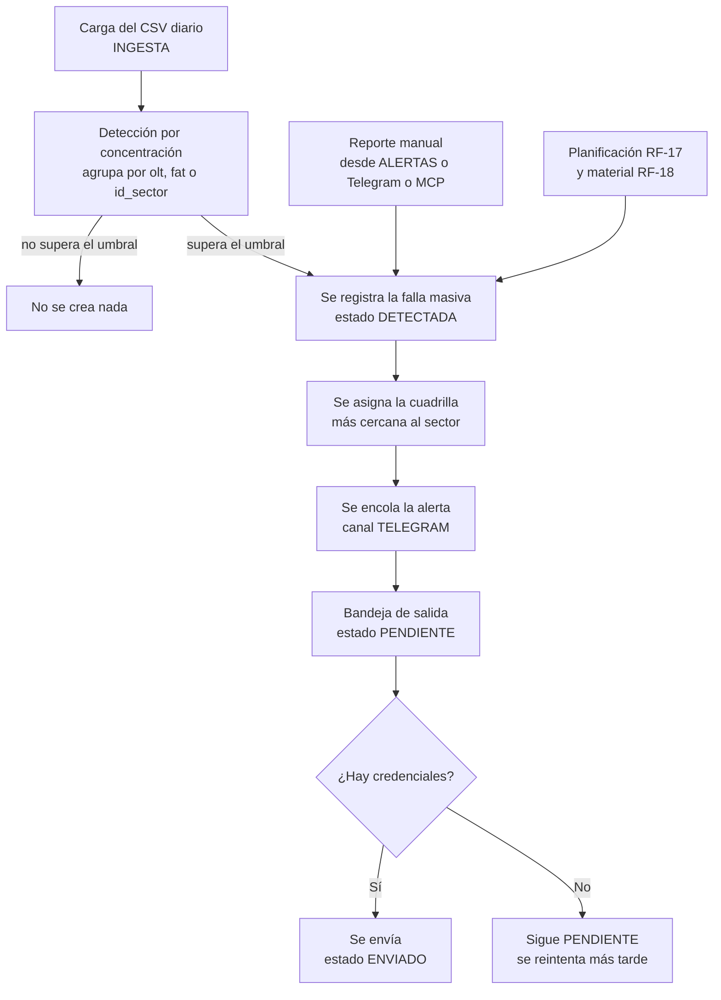
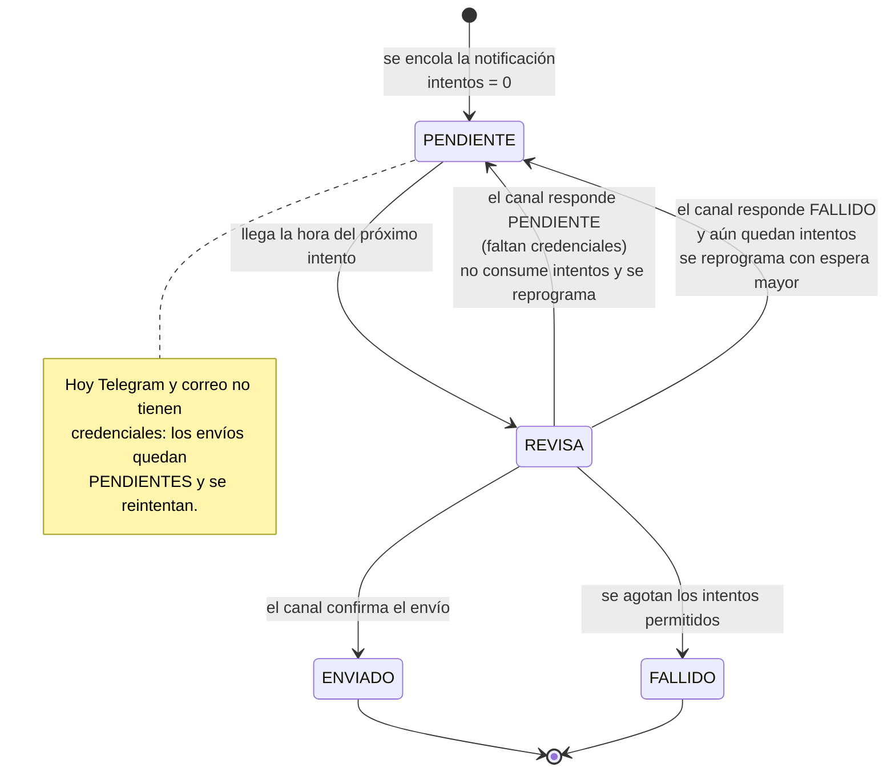

# Manual técnico — Alertas, Telegram y MCP (GGTO, Ciclo 9)

> Manual para todo público. Explica, en lenguaje sencillo, **cómo GGTO detecta fallas masivas**, **cómo se
> avisa al personal** y **cómo se atienden las consultas por Telegram y por MCP** (un canal automático para
> programas). Está dirigido a técnicos de campo, supervisores y administradores de la Central Francisco
> Salias (Área 4) de CANTV. Corresponde al Ciclo 9 del proyecto.

> **Aviso central de este manual:** las credenciales de **Telegram** y de **correo** **no están configuradas
> en producción**. Por eso, **hoy el sistema NO envía notificaciones**: cada aviso queda **PENDIENTE** en la
> bandeja de salida (bandeja interna del sistema) y se conserva sin perderse, a la espera de que existan las
> credenciales. El canal **WhatsApp no existe** en la versión 1. Los canales previstos son **Telegram,
> correo y MCP**.

## Empezar en 5 minutos

1. **Una falla masiva se detecta sola por concentración.** Si varios casos se agrupan en el mismo equipo
   óptico, en la misma caja o en el mismo sector, el sistema lo detecta al terminar una carga CSV y crea una
   alerta. También se puede forzar la detección a mano.
2. **La detección no duplica.** Mientras una falla siga activa, una nueva detección sobre el mismo punto
   **no la vuelve a crear**. A esto se le llama detección idempotente.
3. **Todo aviso pasa primero por la bandeja de salida.** El sistema guarda cada notificación antes de
   intentar enviarla. Si el envío falla, se reintenta con esperas cada vez mayores; esto se llama **patrón
   de bandeja de salida** (*outbox*).
4. **Hoy todo queda PENDIENTE.** Sin las credenciales de **Telegram** y de **correo**, los envíos **no se
   completan**: quedan marcados como **PENDIENTES** en la bandeja y **el usuario no recibe nada**. No debe
   afirmarse que el sistema ya notifica.
5. **El bot y el canal MCP responden igual por la bandeja.** Las respuestas del bot de Telegram y las
   acciones del canal MCP también pasan por la bandeja de salida; por lo tanto, **también quedan pendientes**
   mientras no haya credenciales. MCP es un canal automático para que otros programas consulten GGTO.

<!-- GENERAR_IMAGEN: flujo-alertas.svg -->

## Visión general

### Alcance funcional y requerimientos

El **Ciclo 9** agrupa tres cosas: las **alertas**, el **bot de Telegram** y el **servidor MCP**. El archivo
de rutas enumera su alcance así: «ALERTAS, Telegram y MCP — RF-06, RF-09, RF-16, RF-17, RF-18 / RNF-19,
RNF-20».

| Requerimiento | Contenido resumido |
|---|---|
| RF-06 | Gestionar la ingesta y asignación de casos especiales por Telegram o por inteligencia artificial (canal MCP) |
| RF-09 | Gestionar fallas masivas: detección automática por concentración después de la ingesta, más reporte manual; asignación por proximidad de sector |
| RF-16 | Alertar los casos de falla masiva por Telegram o por el canal MCP |
| RF-17 | Documentar la planificación de atención (reporte simple más evidencias fotográficas) |
| RF-18 | Preparar la solicitud de material según el caso |
| RNF-19 | Observabilidad: métricas de negocio, notificaciones fallidas y rutas de salud y disponibilidad |
| RNF-20 | Fiabilidad: patrón de bandeja de salida con reintentos con espera creciente y estado final; el correo como respaldo de Telegram |

La decisión **D-19** fijó la **detección automática por concentración** más el **reporte manual** por MCP o
Telegram, con asignación **por proximidad de sector**. El umbral quedó como un parámetro configurable, que
se definió en la Fase 3 junto con las métricas (decisión **D-31**). El cierre del ciclo se registra en la
decisión **D-60**, que lo da por completado con detección idempotente, reporte manual, planificación,
material, bandeja de salida con espera creciente, bot de Telegram con los comandos `/ayuda`, `/estado`,
`/caso` y `/falla`, servidor MCP con protocolo JSON-RPC y la ruta de métricas.

### Componentes implicados

| Capa | Archivo | Responsabilidad |
|---|---|---|
| API (puerta de entrada) | `app/api/routes_alertas.py` | 11 operaciones: fallas, bandeja de salida, webhook de Telegram, MCP y métricas |
| Servicio de fallas | `app/services/fallas.py` | Detección por concentración, cuadrilla cercana y alerta |
| Bandeja de salida | `app/services/outbox.py` | Encolado, procesamiento con espera creciente y métricas de la bandeja |
| Canales | `app/services/notificaciones.py` | Envío por Telegram y por correo (SMTP) |
| Esquemas | `app/schemas/alertas.py` | Contratos de datos del ciclo |
| Modelos | `app/models/despacho_entities.py` | Tablas `notificacion` y `falla_masiva` |
| Cliente web | `app/web/src/api/client.ts` | Funciones de fallas, bandeja y métricas |
| Página web | `app/web/src/pages/Alertas.tsx` | Página **ALERTAS**, en la ruta `/alertas` |

El archivo de rutas se registra con el prefijo `/api/v1` y la etiqueta «alertas, telegram y mcp». El rol de
escritura se define **una sola vez**: solo **ADMIN** y **SUPERVISOR** pueden escribir. La versión que anuncia
el servidor MCP es **0.1.0**.

## Fallas masivas

### Detección por concentración (agrupador olt/fat/id_sector)

El servicio de fallas documenta su propósito como «detección automática por concentración (RF-09 / D-31)» y
solo admite **tres campos agrupadores**: **olt**, **fat** y **id_sector**. En palabras simples: el sistema
mira si muchos casos pendientes comparten el mismo equipo óptico (OLT), la misma caja de distribución (FAT)
o el mismo sector.

El proceso de detección funciona así:

| Paso | Comportamiento |
|---|---|
| Interruptor | Si la detección está desactivada en la configuración, devuelve una lista vacía |
| Umbral | Cantidad mínima de casos por grupo; por defecto **5** |
| Ventana | Cuántas horas hacia atrás se miran; por defecto **24** |
| Campo | Cuál de los tres campos se usa para agrupar; si el valor configurado no es válido, se usa **olt** |
| Filtro | Casos de la central, que no estén CERRADOS ni CANCELADOS, creados dentro de la ventana y con el campo de agrupación cargado |
| Agrupación | Se agrupa por ese campo y se conservan solo los grupos que alcanzan el umbral |

Para cada grupo, la descripción generada es del tipo «Concentración de N casos en (campo) (valor) (últimas N
h)». El origen de la falla es **AUTOMATICA** y el estado inicial es **DETECTADA**. Si el campo de agrupación
es el sector, el sector de la falla se toma del propio valor; en los demás casos, se busca un caso del grupo
que tenga sector cargado.

#### Cuadrilla asignada por proximidad

Para asignar cuadrilla, el sistema primero lista las **cuadrillas activas de calle** (las que no son de
supervisor). Si se indicó un sector, cuenta cuántos casos ha atendido cada cuadrilla en ese sector y elige
**la de mayor conteo**. Si no hay datos del sector, elige la cuadrilla de **código menor**. Una prueba de
contrato funcional se apoya en esta asignación.

#### Cuándo se ejecuta

La detección se dispara **automáticamente al terminar una carga CSV**: el módulo de ingesta llama al
servicio de fallas después de confirmar el lote y agrega el conteo de fallas masivas al resumen de la carga.
También puede forzarse **bajo demanda** con la operación `POST /api/v1/fallas-masivas/detectar`.

### Idempotencia por clave_concentracion

Para no duplicar fallas, el sistema construye una **clave** con la forma `campo:valor` (por ejemplo
`olt:pde-olt-99`), recortada a 120 caracteres. Antes de crear una falla, busca otra de la misma central, con
la misma clave y en estado **DETECTADA** o **PLANIFICADA**. Si ya existe, **la omite**.

Esto garantiza que, mientras la falla siga activa, una nueva detección **no la duplique**. Una prueba
verifica la clave y que una segunda detección devuelve una lista vacía. El documento de entornos globales
registra la misma regla con un ejemplo.

### Umbral (configuración)

Los parámetros viven en la **tabla de configuración** (como datos estructurados), **no** en variables de
entorno. Si una clave está vacía o ausente, el sistema usa su valor por defecto.

| Clave | Valor inicial | Para qué sirve |
|---|---|---|
| `fallas.activo` | Activado | Habilita la detección automática |
| `fallas.umbral_casos` | 5 | Casos mínimos que debe tener el grupo |
| `fallas.ventana_horas` | 24 | Ventana de tiempo hacia atrás |
| `fallas.campo_concentracion` | `olt` | Campo de agrupación: `olt`, `fat` o `id_sector` |
| `despacho.destino_telegram` | Vacío | Destino del aviso en Telegram; si está vacío, la notificación queda **PENDIENTE** |

Una prueba apaga la detección, comprueba que devuelve una lista vacía y luego restaura el valor.

### Endpoints

| Método y ruta | Para qué sirve | Rol exigido |
|---|---|---|
| `GET /api/v1/fallas-masivas` | Listar las fallas registradas | Autenticado |
| `POST /api/v1/fallas-masivas` | Reportar una falla manual (responde 201) | ADMIN o SUPERVISOR |
| `POST /api/v1/fallas-masivas/detectar` | Detectar fallas por concentración | ADMIN o SUPERVISOR |
| `PATCH /api/v1/fallas-masivas/{id_falla}` | Actualizar el estado o la cuadrilla | ADMIN o SUPERVISOR |
| `POST /api/v1/fallas-masivas/{id_falla}/planificacion` | Documentar la planificación (RF-17) | ADMIN o SUPERVISOR |
| `POST /api/v1/fallas-masivas/{id_falla}/material` | Solicitar material (RF-18), responde 201 | ADMIN o SUPERVISOR |

El listado acepta filtros por **estado**, **central** y **solo activas**; este último deja a la vista solo
las fallas **DETECTADA** y **PLANIFICADA**. El reporte manual exige una descripción de **5 a 500 caracteres**
y registra el origen **REPORTE_TECNICO**. Si no se indica cuadrilla, se resuelve la **cercana al sector**
informado; después de crear la falla, **se encola la alerta**. La actualización valida que el estado sea uno
de **DETECTADA, PLANIFICADA, ATENDIDA o CERRADA**. Un identificador de falla inexistente produce el error
**404**.

Dos pruebas confirman el filtro de «solo activas» y que el rol **TECNICO** puede **listar** pero recibe
**403 al crear**.

## Planificación (RF-17) y material (RF-18) sobre la falla

### Planificación

La solicitud de planificación exige un texto de **planificación** de 5 a 2000 caracteres. Además admite un
**reporte simple** (máximo 2000 caracteres), una lista de **evidencias** (números de serie o rutas de
archivos) y una **cuadrilla** opcional. La operación sigue estos pasos:

1. Recupera la falla; si no existe, responde 404.
2. Guarda el texto de planificación.
3. Copia el reporte simple si viene informado.
4. **Concatena las evidencias** al reporte simple con el prefijo «Evidencias: ».
5. Reasigna la cuadrilla si se indicó una.
6. Fija el estado en **PLANIFICADA** y registra la fecha y hora de planificación.

Una prueba comprueba el estado PLANIFICADA, que la fecha de planificación no esté vacía y que un número de
serie de ejemplo quede guardado en el reporte simple.

### Material

La solicitud de material exige una **descripción** de 3 a 500 caracteres y admite una cuadrilla. La operación
responde **201** y crea una orden de material con estos datos:

| Campo | Valor |
|---|---|
| Cuadrilla | La recibida o, si no viene, la de la falla |
| Solicitante | El P00 del usuario autenticado |
| Estado | **SOLICITADA** |
| Observación | `[Falla N]` seguido de la descripción |

La respuesta incluye el identificador de la orden, el estado, la observación y el identificador de la falla.
Una prueba valida el estado SOLICITADA y el prefijo «[Falla N]».

## Outbox

### Tabla notificacion

**Toda notificación se guarda primero** en la tabla `notificacion`. Esto es lo que se llama **patrón de
bandeja de salida**: el sistema nunca intenta enviar algo sin haberlo registrado antes. Sus columnas
relevantes son:

| Columna | Qué guarda |
|---|---|
| `canal` | Por dónde se envía (Telegram o correo) |
| `destinatario` | A quién va dirigido |
| `asunto` | Título del mensaje (se recorta a 200 caracteres) |
| `cuerpo` | Texto del mensaje |
| `id_caso` | Caso relacionado, si lo hay; si se borra el caso, queda vacío |
| `estado` | Situación del envío |
| `error` | Motivo del fallo, si lo hubo |
| `enviado_en` | Fecha y hora del envío efectivo |
| `intentos` | Cuántas veces se intentó |
| `proximo_intento` | Cuándo corresponde el próximo intento |

Al **encolar**, la fila se crea con estado **PENDIENTE**, cero intentos y próximo intento **ahora mismo**.

<!-- GENERAR_IMAGEN: outbox-notificaciones.svg -->

### Estados

| Estado | Significado |
|---|---|
| `PENDIENTE` | Encolada o diferida; puede reintentarse |
| `ENVIADO` | El canal confirmó el envío |
| `FALLIDO` | Se agotaron los intentos permitidos |

Los canales devuelven uno de estos tres estados: **ENVIADO**, **PENDIENTE** o **FALLIDO**. La página
**ALERTAS** ofrece el filtro de la bandeja por estado **PENDIENTE**, **ENVIADO** y **FALLIDO**.

#### Diferencia entre «diferida» y «fallida»

- Si el canal responde **PENDIENTE** (por ejemplo, porque **faltan credenciales**), el sistema **resta el
  intento que acababa de sumar**, reprograma el envío con una espera mayor y contabiliza la notificación como
  **«diferida»**. Así **no se consumen intentos**.
- Si el canal responde **FALLIDO** y ya se alcanzó el máximo de intentos, la notificación pasa a **FALLIDO**
  y se limpia la fecha del próximo intento. Si todavía quedan intentos, se reprograma.

El documento normativo de métricas formaliza que **«diferida» = intentadas − enviadas − fallidas**.

### Backoff y max_intentos (app/services/outbox.py)

La espera entre reintentos sigue una **pauta creciente** (a esto se le llama *backoff*): 1 minuto, 2, 4, 8 y
así sucesivamente, con un **tope de 60 minutos**. El número máximo de intentos se lee de la configuración y
su valor por defecto es **5**.

El procesamiento selecciona las notificaciones **PENDIENTES** cuya hora de próximo intento ya llegó, las
ordena por número de notificación y respeta un **límite** de cuántas procesar. Devuelve un resumen con
cuántas se intentaron, cuántas se enviaron, cuántas quedaron diferidas, cuántas fallaron y el detalle de cada
notificación.

#### Disparadores del procesamiento

| Disparador | Límite |
|---|---|
| `POST /api/v1/notificaciones/procesar` | Entre 1 y 200; por defecto 50 |
| Respuesta del bot de Telegram | 5 |
| Herramienta MCP `procesar_notificaciones` | 20 |

### Canales (app/services/notificaciones.py)

El módulo declara una regla de oro: **si el canal no tiene credenciales, la notificación queda PENDIENTE con
el motivo, en lugar de perderse**.

| Canal | Variable de entorno | Sin credenciales |
|---|---|---|
| `TELEGRAM` | `TELEGRAM_BOT_TOKEN` | Queda **PENDIENTE** con el motivo |
| `CORREO` | `SMTP_HOST` (junto con `SMTP_PORT`, `SMTP_USER`, `SMTP_PASSWORD` y `MAIL_FROM`) | Queda **PENDIENTE** con el motivo |

El envío por **Telegram** usa una llamada HTTP al servicio de Telegram con formato Markdown y recorta el
texto a 4000 caracteres. Devuelve **FALLIDO** ante errores de red, de tiempo de espera o del sistema. El
envío por **correo** usa el protocolo SMTP con conexión segura y autenticación si hay usuario. Cualquier
otro canal devuelve **FALLIDO** con el mensaje «Canal no soportado».

> **Recordatorio:** **no se reproducen valores de secretos** en este manual; solo se nombran las variables
> y las claves de configuración.

#### Nota sobre nombre de canal del correo

El envío reconoce el canal **CORREO**. **Queda pendiente de confirmar** si algún flujo de la versión 1
encola notificaciones por ese canal: en el código revisado, **tanto las alertas de falla como las respuestas
del bot encolan siempre TELEGRAM**.

## Telegram

### Webhook POST /api/v1/telegram/webhook

El **webhook** (la puerta por la que Telegram entrega los mensajes) lee el contenido enviado y acepta tanto
mensajes nuevos como mensajes editados. Extrae el identificador de la conversación y el texto. Si falta
cualquiera de los dos, responde que **ignoró** el mensaje sin procesar nada. En caso contrario, resuelve el
comando, **encola la respuesta** y devuelve el texto que corresponde.

La respuesta al usuario se encola por el **canal Telegram** y luego se procesan hasta 5 notificaciones. Esto
significa que **la respuesta al usuario también depende de la bandeja de salida**: sin credenciales del bot,
**la respuesta queda PENDIENTE y el usuario no recibe nada en Telegram**.

### Comandos /ayuda /estado /caso /falla

El sistema separa el comando del argumento, normaliza el comando a minúsculas y le quita la barra inicial.

| Comando | Alias | Comportamiento |
|---|---|---|
| `/ayuda` | `start`, `help` | Devuelve la lista de comandos disponibles |
| `/estado` | — | Cuenta los casos pendientes y las fallas activas de la central |
| `/caso <id_averia>` | — | Busca el caso por identificador de avería y devuelve estado, cliente, teléfono, dirección y problema |
| `/falla <descripción>` | — | Crea una falla masiva con origen **REPORTE_TECNICO** |

Detalles verificados: `/caso` sin argumento responde «Uso: /caso <id_averia>» y, si no encuentra el caso,
«No encontré el caso …». `/falla` sin argumento responde «Uso: /falla <descripción de la falla>»; la
descripción se prefija con «[Telegram (identificador de la conversación)]». Un comando desconocido responde
«Comando no reconocido. Use /ayuda.». Las pruebas del webhook cubren la ayuda, el estado, la consulta de un
caso (incluido el caso no encontrado), el reporte de falla, un mensaje sin texto y el secreto.

#### Comando no implementado

El comando `/falla` **crea la falla**, pero **no llama a la función que alerta al supervisor**, a diferencia
del reporte manual y de la herramienta MCP, que **sí** lo hacen. Sin embargo, el mensaje de respuesta
**afirma** «Se notificó al supervisor». Este es el comportamiento **real** del código y se documenta tal
cual; **queda pendiente de confirmar** si es intencional.

### Cabecera X-Telegram-Bot-Api-Secret-Token

El webhook recibe de forma **opcional** la cabecera `X-Telegram-Bot-Api-Secret-Token`. El valor esperado se
lee de la clave `telegram.webhook_secret` de la tabla de configuración:

- Si la clave **tiene valor** y la cabecera **no coincide**, el sistema responde **error 403** con el detalle
  «Secreto del webhook inválido».
- Si la clave está **vacía**, la cabecera **no se exige**.

Una prueba valida ambos caminos.

## MCP

### POST /api/v1/mcp JSON-RPC

El **servidor MCP** se expone en `POST /api/v1/mcp` con la descripción «Servidor MCP (JSON-RPC 2.0)». MCP es
un canal automático pensado para que **otros programas** (asistentes o herramientas) consulten GGTO. El
protocolo **JSON-RPC** es una forma estándar de pedir acciones y recibir respuestas en formato JSON. La
operación es asíncrona, lee el contenido enviado y extrae el método, el identificador de la petición y los
parámetros. **No exige sesión de usuario**: su control de acceso es la **clave MCP**.

| Método JSON-RPC | Resultado |
|---|---|
| `initialize` | Devuelve la versión de protocolo `2024-11-05`, las capacidades de herramientas y la información del servidor `ggto-mcp` versión 0.1.0 |
| `tools/list` | Devuelve la lista de herramientas disponibles |
| `tools/call` | Ejecuta la herramienta indicada en los parámetros |
| Cualquier otro método | Error **-32601**, «Método no soportado» |

La respuesta exitosa tiene la forma `{"jsonrpc": "2.0", "id": …, "result": …}`. Las herramientas devuelven
tanto un **texto** legible como un **objeto de datos** estructurado.

### Cabecera X-MCP-Key

La operación recibe de forma **opcional** la cabecera `X-MCP-Key`. El valor esperado se lee de la clave
`mcp.api_key` de la tabla de configuración:

- Si la clave está **configurada** y **no coincide**, se devuelve un **error JSON-RPC con código -32001** y el
  mensaje «Clave MCP inválida».
- Si la clave está **vacía**, la cabecera **no se exige**.

Una prueba cubre el rechazo y el acceso con la cabecera correcta.

### Métodos expuestos según el código

Solo están implementados **los tres métodos anteriores**. La consulta de recursos y cualquier otro método
caen en el error **-32601**. **Queda pendiente de confirmar** cualquier ampliación de métodos o de
herramientas más allá de las declaradas en la lista oficial.

### Herramientas de la lista TOOLS

La lista oficial declara **cuatro herramientas**:

| Herramienta | Descripción | Argumentos |
|---|---|---|
| `estado_central` | Resumen de casos pendientes y fallas activas | Ninguno |
| `consultar_caso` | Busca un caso por identificador de avería o por teléfono | `id_averia`, `telefono` |
| `reportar_falla` | Registra una falla masiva | `descripcion` (obligatorio) |
| `procesar_notificaciones` | Procesa la bandeja de salida | Ninguno |

`consultar_caso` exige **al menos uno** de los dos argumentos; si faltan, el sistema responde con el error
**-32602**. Si no encuentra el caso, devuelve `{"encontrado": false}`. `reportar_falla` exige una descripción
de al menos 5 caracteres, prefija el texto con «[MCP]», asigna la cuadrilla cercana, crea la falla y **sí
llama a la función que alerta**.

## Métricas

### GET /api/v1/metricas

La ruta de observabilidad responde con el contrato de métricas y la descripción «Métricas de negocio y estado
de los canales». Exige usuario autenticado y calcula:

| Campo | Qué muestra |
|---|---|
| `casos_total` | Suma de los conteos por estado |
| `casos_por_estado` | Conteo agrupado por estado actual |
| `casos_por_categoria` | Conteo agrupado por categoría |
| `lotes_ingesta` | Cantidad de cargas CSV registradas |
| `casos_ingeridos` | Casos que entraron por ingesta CSV |
| `fallas_activas` | Fallas en estado DETECTADA o PLANIFICADA |
| `notificaciones_pendientes` / `enviadas` / `fallidas` | Provistas por el servicio de bandeja de salida |
| `canales_configurados` | Indica si existe la credencial de Telegram y si existe la de correo |

La bandeja de salida agrupa la tabla de notificaciones por estado y expone **PENDIENTE**, **ENVIADO** y
**FALLIDO**. Una prueba comprueba el total de casos, que no hay casos ingeridos y que **ambos canales figuran
como no configurados**.

## ESTADO REAL de los canales

### Telegram y correo sin credenciales ⇒ envíos PENDIENTES

En el entorno real, **las credenciales de los canales NO están configuradas**. Por diseño, el sistema
responde **PENDIENTE** con el motivo «Sin `TELEGRAM_BOT_TOKEN` configurado» y **PENDIENTE** con el motivo
«Sin `SMTP_HOST` configurado». En consecuencia:

- El indicador de canales configurados informa **falso** para Telegram y para correo.
- Las alertas **quedan en la bandeja con estado PENDIENTE y no se pierden**.
- Una prueba verifica que la alerta es del canal **TELEGRAM**, que su asunto contiene «Falla masiva» y que su
  estado es **PENDIENTE**.
- Otra prueba verifica que, sin credenciales, **las enviadas son 0 y las diferidas son al menos 1**.

Por lo tanto, **no debe afirmarse que el sistema ya notifica**: los envíos permanecen **PENDIENTES** hasta
que existan las credenciales (`TELEGRAM_BOT_TOKEN` y `SMTP_HOST`). La propia página **ALERTAS** se lo indica
al usuario en pantalla.

### WhatsApp NO existe

El canal de **WhatsApp no está implementado** en la versión 1: el envío solo reconoce **TELEGRAM** y
**CORREO**, el indicador de canales configurados solo expone **telegram** y **correo**, y la prueba de
esquema exige exactamente esas dos claves. WhatsApp está diferido y **no debe documentarse como disponible**.

#### Canales mencionados en dependencias

Las variables `MCP_SERVER_URL` y `MCP_API_KEY` aparecen en el documento de entornos globales del proyecto,
pero **el servidor MCP implementado no las consume**: su control de acceso es la clave `mcp.api_key` de la
tabla de configuración. **Queda pendiente de confirmar** el uso previsto de esas variables de entorno.

## Endpoints de bandeja y página web ALERTAS

### Endpoints de bandeja

| Método y ruta | Para qué sirve | Parámetros | Rol |
|---|---|---|---|
| `GET /api/v1/notificaciones` | Bandeja de salida | `estado`, `canal`, `limite` (1 a 500; por defecto 100) | Autenticado |
| `POST /api/v1/notificaciones/procesar` | Procesar los reintentos | `limite` (1 a 200; por defecto 50) | ADMIN o SUPERVISOR |

El listado ordena de la notificación más reciente a la más antigua y aplica los filtros. El procesamiento
delega en el servicio de bandeja de salida y confirma la operación en la base de datos. Una prueba confirma
que el rol **TECNICO** recibe **403 al procesar**.

### Página web ALERTAS

La página **ALERTAS** cubre los requerimientos RF-09, RF-16, RF-17 y RF-18, y los requisitos RNF-19 y
RNF-20. Está registrada en la ruta `/alertas` y al abrirse carga **en paralelo** las métricas, las fallas y
la bandeja.

| Zona | Contenido |
|---|---|
| Estado de las alertas | Tarjetas de fallas activas, notificaciones (pendientes, enviadas, fallidas) y casos totales; estado de los canales |
| Fallas masivas | Tabla con origen, concentración, descripción, sector, cuadrilla, estado y fecha; filtro «solo activas» |
| Acciones por falla | Botones «Planificar», «Material» y un selector de estado |
| Bandeja de notificaciones | Tabla con canal, destinatario, asunto, estado, intentos, próximo intento y error |
| Botones superiores | «Detectar fallas» y «Reportar falla» |
| Ventanas emergentes | Reporte manual, planificación y solicitud de material |

Los estados de falla que ofrece la interfaz son **DETECTADA, PLANIFICADA, ATENDIDA y CERRADA**, coherentes
con la validación del servidor. La detección bajo demanda informa **cuántas fallas nuevas se crearon** o que
**no hubo concentraciones sobre el umbral**. El procesamiento de la bandeja muestra el resumen de enviadas,
diferidas y fallidas. Las funciones de escritura se **deshabilitan** cuando la sesión es de solo lectura.

## Pruebas

### Cobertura del ciclo 9

El archivo `app/tests/test_alertas_api.py` contiene **23 pruebas** de integración que cubren la detección
RF-09, la planificación RF-17, el material RF-18, la bandeja de salida y los canales. El proyecto **cerró la
Fase 4 con 169 de 169 pruebas de `pytest`** en verde y **215 pruebas sumando las 46 E2E de Playwright**;
además, las revisiones con **ruff**, **mypy** y **tsc en modo estricto** terminaron **sin hallazgos**. El
guion E2E `09-alertas.spec.js` aportó **4 pruebas** sobre métricas, RF-09, RF-17, RF-18 y la bandeja.

| Bloque | Pruebas |
|---|---|
| Detección automática | Detección por concentración, encolado de la alerta y detección desactivada |
| Reporte, planificación y material | Reporte manual con planificación, solicitud de material, actualización de estado y filtros |
| Bandeja de salida | Procesamiento sin credenciales |
| Telegram | Ayuda, estado, caso, reporte de falla, mensaje sin texto y secreto |
| MCP | Inicialización, lista de herramientas, ejecución, método no soportado y clave |
| Métricas y control de acceso | Métricas, permisos por rol y petición sin token |

**Modo de pruebas aislado.** Las pruebas usan la variable de entorno **`DB_SCHEMA`** para trabajar sobre
esquemas separados: **`ggto_test`** para `pytest` y **`ggto_e2e`** para Playwright. Así no se mezclan datos
de prueba con datos reales.

### Pruebas de contrato y RBAC

Además del archivo específico, las pruebas de contrato verifican que la ruta de fallas masivas forma parte
del inventario publicado y que los roles autorizados pueden crear fallas. El escenario base de las pruebas
crea **seis casos pendientes en el mismo OLT** para superar el umbral de 5, fijando el campo `olt`
directamente porque la vía manual no lo carga.

### Verificación en vivo

La decisión **D-60** registra la verificación en vivo del ciclo con **42 casos, 0 fallas, bandeja vacía, 73
endpoints y respuesta 200 de la aplicación web** en la ruta `/alertas`. Esta verificación corresponde a un
entorno de pruebas; **no demuestra envíos reales**, porque las credenciales de los canales siguen sin
configurarse.

## Pendiente de confirmar

| Tema | Motivo |
|---|---|
| Canal **CORREO** sin un flujo que lo encole en la versión 1 | El envío lo soporta, pero los flujos revisados encolan **TELEGRAM** |
| El comando `/falla` de Telegram no llama a la función que alerta, aunque el mensaje lo afirme | Es el comportamiento real del código; falta confirmar si es intencional |
| Uso de las variables `MCP_SERVER_URL` y `MCP_API_KEY` del entorno | El código usa la clave `mcp.api_key` de la tabla de configuración |
| Ampliación de métodos MCP o de la lista de herramientas | No es verificable en el repositorio actual |
| Fecha de habilitación de las credenciales de Telegram y correo | Depende de la operación, no del código |
