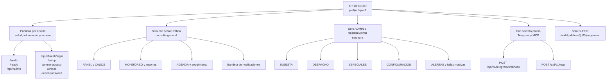

# API de GGTO — Inventario de Endpoints

> Manual para todo público. Explica, en lenguaje sencillo, **qué puertas de entrada (endpoints) ofrece el
> sistema GGTO**, quién puede usar cada una y qué códigos de respuesta entrega. Un **endpoint** es una
> dirección concreta que un programa o una página puede llamar para pedir o enviar información. Está
> dirigido a técnicos de campo, supervisores y administradores de la Central Francisco Salias (Área 4) de
> CANTV.

## Empezar en 5 minutos

1. **Casi todo exige una credencial de sesión.** El sistema entrega un **pase de sesión** (token) al iniciar
   sesión, y ese pase debe acompañar cada llamada. Sin él, la respuesta es **401** (no autorizado).
2. **La gran mayoría de las direcciones son solo de consulta.** Salvo las de ingesta, casos, despacho,
   especiales, configuración y alertas, el resto solo **lee** información. Para **escribir** casi siempre se
   necesita rol **ADMIN** o **SUPERVISOR**; el rol **SUPER** puede hacer cualquier cosa.
3. **El sistema publicado tiene 95 direcciones y 126 operaciones.** La diferencia se explica porque 26
   direcciones admiten **más de un método** (por ejemplo, consultar y crear en la misma dirección).
4. **La documentación interactiva está en `/docs`.** Ahí se puede ver y probar cada operación. Una copia en
   formato legible está en `/redoc` y el esquema crudo en `/openapi.json`.
5. **Los códigos de respuesta cuentan la historia.** 200 o 201 indican éxito; 401, falta de sesión; 403, sin
   permiso; 404, no existe; 409, conflicto; 422, datos inválidos; 423, cuenta bloqueada; 429, demasiados
   intentos.

<!-- GENERAR_IMAGEN: mapa-api-endpoints.svg -->


## Visión general

La API (la interfaz que atiende las peticiones de otros programas) es una aplicación **FastAPI** construida
en `app/main.py`. La aplicación se declara con título, versión y descripción tomados de la configuración, y
monta **nueve grupos de rutas** en un orden explícito: salud, autenticación, configuración, ingesta, casos,
despachos, especiales, monitoreo y alertas. Al final se monta la aplicación web, para no tapar las rutas de
la API.

El middleware de observabilidad asigna un **identificador de petición** a cada llamada y registra su
duración; el acceso desde otros dominios (CORS) se configura desde la lista de orígenes permitidos.

### Prefijo /api/v1

Todas las rutas de negocio se publican bajo el prefijo de versión **`/api/v1`**. El prefijo se declara de dos
maneras según el archivo:

| Archivo de rutas | Prefijo declarado |
|---|---|
| `app/api/routes_health.py` | Sin prefijo (rutas absolutas) |
| `app/api/routes_auth.py` | `/api/v1/auth` |
| `app/api/routes_config.py` | `/api/v1` |
| `app/api/routes_ingesta.py` | `/api/v1/ingesta` |
| `app/api/routes_casos.py` | `/api/v1/casos` |
| `app/api/routes_despachos.py` | `/api/v1/despachos` |
| `app/api/routes_especiales.py` | `/api/v1` |
| `app/api/routes_monitoreo.py` | `/api/v1` |
| `app/api/routes_alertas.py` | `/api/v1` |

El archivo de salud es la **única excepción**: declara rutas absolutas porque expone `/health` y `/ready`
fuera del espacio versionado. Una prueba de contrato exige que **ninguna ruta que empiece por `/api/` quede
sin versión**.

### Convención de autenticación Bearer

La autenticación se resuelve con el esquema **HTTP Bearer** de FastAPI, declarado como dependencia
reutilizable. El cliente debe enviar la cabecera:

```
Authorization: Bearer <token>
```

El token es un **JWT** (un pase firmado digitalmente) con algoritmo HS256, que incluye el P00 del usuario,
su rol, la fecha de expiración, la fecha de emisión y un identificador único. La vigencia por defecto es de
**480 minutos (8 horas)**. Al decodificarlo se valida la firma y la expiración.

La dependencia de usuario autenticado realiza esta secuencia:

1. Si **no hay credencial**, responde **401**.
2. Si el **token es inválido o expiró**, responde **401**.
3. Si el **P00 no existe** o el **usuario está inactivo**, responde **401**.
4. Si el **usuario está bloqueado**, responde **423**.

La respuesta 401 incluye la cabecera `WWW-Authenticate: Bearer`. La aplicación web consume la API con el
mismo esquema: guarda el token en el almacenamiento local del navegador y lo adjunta en cada llamada.

### Relación 79 paths / 109 operaciones

El esquema publicado reporta **79 rutas** (*paths*, es decir, direcciones) y **109 operaciones** (la
combinación de método más dirección). La diferencia se explica porque **26 direcciones comparten varios
métodos**; cada dirección adicional con varios métodos aporta operaciones extra, en total **30
operaciones extra** (79 + 30 = 109).

Las direcciones compartidas verificadas son 26. Algunos ejemplos:

| Dirección | Métodos | Dirección | Métodos |
|---|---|---|---|
| `/api/v1/casos` | GET, POST | `/api/v1/central` | GET, POST |
| `/api/v1/casos/{id_caso}` | GET, PATCH | `/api/v1/central/{id_central}` | GET, PATCH, DELETE |
| `/api/v1/despachos` | GET, POST | `/api/v1/sectores` | GET, POST |
| `/api/v1/despachos/fallas-masivas` | GET, POST | `/api/v1/sectores/{id_sector}` | GET, PATCH, DELETE |
| `/api/v1/fallas-masivas` | GET, POST | `/api/v1/tecnicos` | GET, POST |
| `/api/v1/citas` | GET, POST | `/api/v1/tecnicos/{id_tecnico}` | GET, PATCH, DELETE |
| `/api/v1/citas/{id_cita}` | PATCH, DELETE | `/api/v1/flota` | GET, POST |
| `/api/v1/casos-especiales` | GET, POST | `/api/v1/cuadrillas` | GET, POST |
| `/api/v1/casos-especiales/{id_caso_especial}` | GET, PATCH | `/api/v1/seguimiento` | GET, POST |
| `/api/v1/solicitantes` | GET, POST | `/api/v1/catalogos/causas` | GET, POST |
| `/api/v1/catalogos/metodos` | GET, POST | `/api/v1/despachos/{id_despacho}` | GET, PATCH |
| `/api/v1/cuadrillas/{id_cuadrilla}` | GET, PATCH | `/api/v1/despachos/{id_despacho}/casos/{id_caso}` | DELETE, PATCH |

Por eso los documentos del proyecto y las pruebas hablan de **«79 endpoints»** cuando en realidad se
refieren a *79 direcciones*. En el código hay **109 decoradores de ruta**, uno por operación publicada.

La cifra de **98 operaciones** que aparece en notas previas del proyecto **no coincide** con el código
verificado. La diferencia corresponde a **cinco operaciones que sí existen** y que aquel inventario no
listaba:

1. `POST /api/v1/auth/setup`
2. `POST /api/v1/sectores/{id_sector}/direcciones`
3. `DELETE /api/v1/sectores/{id_sector}/direcciones/{id_direccion}`
4. `POST /api/v1/cuadrillas/{id_cuadrilla}/integrantes`
5. `DELETE /api/v1/cuadrillas/{id_cuadrilla}/integrantes/{id_tecnico}`

La cifra vigente y comprobable es **109 operaciones y 79 direcciones**: el ciclo D-66 sumó cuatro
operaciones y cuatro direcciones (`GET /despachos/proceso`, `PUT /despachos/asignacion`,
`POST /despachos/procesar` y `POST /ingesta/sectorizar-pendientes`), y el ciclo D-67 sumó dos más
(`GET /api/v1/auth/primer-acceso` y `POST /api/v1/auth/palabras/{p00}/regenerar`). El origen exacto del
conteo de 98 **queda pendiente de confirmar**.

### Documentación OpenAPI en /docs

FastAPI publica por defecto la documentación interactiva en **`/docs`** (la interfaz Swagger), la alternativa
ReDoc en **`/redoc`** y el esquema crudo en **`/openapi.json`**. La ruta de metadatos del servicio devuelve
explícitamente esa dirección en el campo «documentacion». El título y la versión del esquema provienen de la
configuración, con versión por defecto **0.9.0**.

Cada grupo de rutas se agrupa en el esquema mediante **etiquetas** (*tags*): «salud», «autenticación»,
«configuración», «ingesta», «casos», «despacho», «seguimiento y especiales», «monitoreo y reportes» y
«alertas, telegram y mcp».

Las pruebas de contrato validan cuatro cosas: que **toda operación tenga resumen**, que toda respuesta
declarada tenga descripción, que los listados declaren su contrato de salida y que exista el esquema de
seguridad Bearer.

## Inventario por módulo

A continuación está el inventario completo de las **109 operaciones**, agrupado por archivo de rutas. La
columna «roles» se interpreta así:

- **Público**: no requiere token.
- **Autenticado**: cualquier usuario con token válido.
- **ADMIN/SUPERVISOR**: requiere alguno de esos dos roles; el rol **SUPER** tiene **acceso total** sin
  necesidad de enumerarse.

### Salud y metadatos (app/api/routes_health.py)

Cuatro operaciones; tres son públicas y una exige token.

| Método | Ruta | Para qué sirve | Roles |
|---|---|---|---|
| GET | `/api/v1/info` | Metadatos del servicio (nombre, versión, entorno y ruta de la documentación) | Público |
| GET | `/health` | Comprobación de que el servicio está vivo; **no toca la base de datos** | Público |
| GET | `/ready` | Comprobación de disponibilidad: versión de PostgreSQL, base, usuario y número de tablas del esquema | Público |
| GET | `/api/v1/resumen` | Conteo de entidades principales (centrales, roles, cuadrillas, causas y parámetros) | Autenticado |

`/ready` devuelve **503** si la base de datos no responde y consulta el catálogo de tablas del esquema
`public`. La ruta de resumen es la evidencia del esquema desplegado.

### Autenticación (app/api/routes_auth.py)

Siete operaciones. Cinco son públicas por diseño (inicio de sesión, primer acceso y recuperación); la de
datos propios exige token y la de regenerar palabras es **exclusiva del rol SUPER**. La decisión de usar
**P00 más clave, con bloqueo a los 3 intentos y 12 palabras de seguridad**, está registrada en los
requerimientos.

| Método | Ruta | Para qué sirve | Roles |
|---|---|---|---|
| POST | `/api/v1/auth/login` | Iniciar sesión con P00 y clave; entrega el pase de sesión | Público |
| GET | `/api/v1/auth/me` | Datos del usuario autenticado (P00, correo, rol, central y nombre) | Autenticado |
| POST | `/api/v1/auth/setup` | Primer acceso: fija correo y clave, y genera 12 palabras de seguridad | Público |
| GET | `/api/v1/auth/primer-acceso` | Consultar si un P00 está dado de alta y si puede activar su cuenta (D-67) | Público |
| POST | `/api/v1/auth/unlock` | Desbloquear la cuenta con 3 de las 12 palabras | Público |
| POST | `/api/v1/auth/reset-password` | Restablecer la clave con 3 de las 12 palabras | Público |
| POST | `/api/v1/auth/palabras/{p00}/regenerar` | Generar 12 palabras nuevas para un P00 (D-67) | **Solo SUPER** |

Detalles verificados del inicio de sesión:

- El límite de intentos se aplica por **P00 más dirección IP**.
- Si el P00 **no existe**, se devuelve un mensaje genérico para no revelar su existencia.
- Un usuario **inactivo** recibe **403** y uno **bloqueado**, **423**.
- Cada fallo incrementa el contador de intentos fallidos y devuelve la cabecera `X-Intentos-Restantes`.
- Un inicio de sesión correcto **reinicia el contador** y emite el token.
- La operación de primer acceso exige que la clave y su confirmación coincidan (si no, 422) y que el P00 ya
  exista (si no, 404). Si la cuenta **ya está activada**, responde **409** (debe usar la recuperación).
- Desbloqueo y restablecimiento validan **3 palabras por posición**.

Detalles verificados del primer acceso y de la regeneración (D-67):

- `GET /api/v1/auth/primer-acceso` recibe el P00 y responde uno de cinco estados: `INEXISTENTE`,
  `PENDIENTE` (puede registrarse), `ACTIVO`, `BLOQUEADO` o `INACTIVO`. Incluye una marca
  `puede_registrarse` que solo es verdadera en `PENDIENTE`. Tiene su propio límite de **30 consultas por
  minuto** por dirección IP.
- `POST /api/v1/auth/setup` crea la cuenta del técnico si el supervisor ya registró su P00, o actualiza la
  clave y el correo si la cuenta existe pero todavía no tiene palabras. Devuelve las **12 palabras** en
  claro **una sola vez**.
- `POST /api/v1/auth/palabras/{p00}/regenerar` exige rol **SUPER**: cualquier otro rol recibe **403**.
  Reemplaza las palabras anteriores (que dejan de funcionar), desbloquea la cuenta, reinicia los intentos
  fallidos y devuelve las 12 nuevas **una sola vez**. Si el P00 no tiene cuenta, responde **404**.
- Tanto el alta como la regeneración dejan registro en la tabla `auditoria`.

### Configuración y catálogos (app/api/routes_config.py)

Es el módulo más extenso: **35 operaciones**. La lectura queda abierta a cualquier usuario autenticado y la
escritura se reserva a **ADMIN** y **SUPERVISOR**. Los borrados son **desactivaciones lógicas** (el registro
no se elimina, solo se marca como inactivo), salvo en direcciones de sector e integrantes de cuadrilla.

#### Central

| Método | Ruta | Para qué sirve | Roles |
|---|---|---|---|
| GET | `/api/v1/central` | Listar centrales; filtro de solo activas | Autenticado |
| POST | `/api/v1/central` | Crear una central | ADMIN/SUPERVISOR |
| GET | `/api/v1/central/{id_central}` | Obtener una central | Autenticado |
| PATCH | `/api/v1/central/{id_central}` | Actualizar una central | ADMIN/SUPERVISOR |
| DELETE | `/api/v1/central/{id_central}` | Desactivar (marca la central como inactiva) | ADMIN/SUPERVISOR |

#### Sectores

| Método | Ruta | Para qué sirve | Roles |
|---|---|---|---|
| GET | `/api/v1/sectores` | Listar sectores; filtros por central y solo activos | Autenticado |
| POST | `/api/v1/sectores` | Crear un sector con sus direcciones y patrones | ADMIN/SUPERVISOR |
| GET | `/api/v1/sectores/{id_sector}` | Obtener un sector | Autenticado |
| PATCH | `/api/v1/sectores/{id_sector}` | Actualizar un sector | ADMIN/SUPERVISOR |
| DELETE | `/api/v1/sectores/{id_sector}` | Desactivar (marca el sector como inactivo) | ADMIN/SUPERVISOR |
| POST | `/api/v1/sectores/{id_sector}/direcciones` | Agregar un patrón de dirección al sector | ADMIN/SUPERVISOR |
| DELETE | `/api/v1/sectores/{id_sector}/direcciones/{id_direccion}` | Eliminar un patrón (borrado físico) | ADMIN/SUPERVISOR |

#### Técnicos

| Método | Ruta | Para qué sirve | Roles |
|---|---|---|---|
| GET | `/api/v1/tecnicos` | Listar técnicos; filtros por central y estado | Autenticado |
| POST | `/api/v1/tecnicos` | Crear un técnico | ADMIN/SUPERVISOR |
| GET | `/api/v1/tecnicos/{id_tecnico}` | Obtener un técnico | Autenticado |
| PATCH | `/api/v1/tecnicos/{id_tecnico}` | Actualizar un técnico | ADMIN/SUPERVISOR |
| DELETE | `/api/v1/tecnicos/{id_tecnico}` | Desactivar (marca al técnico como inactivo) | ADMIN/SUPERVISOR |

El listado y la ficha de cada técnico agregan un campo calculado, `estado_cuenta`, que resume el ciclo de
vida de su acceso (D-67): `SIN_ALTA`, `ACTIVO`, `BLOQUEADO`, `REQUIERE_CAMBIO` o `INACTIVO`. Es el dato que
alimenta la columna **Cuenta** de la pantalla.

#### Flota

| Método | Ruta | Para qué sirve | Roles |
|---|---|---|---|
| GET | `/api/v1/flota` | Listar la flota; filtro por central | Autenticado |
| POST | `/api/v1/flota` | Registrar un vehículo | ADMIN/SUPERVISOR |
| GET | `/api/v1/flota/{id_flota}` | Obtener un vehículo | Autenticado |
| PATCH | `/api/v1/flota/{id_flota}` | Actualizar un vehículo | ADMIN/SUPERVISOR |
| DELETE | `/api/v1/flota/{id_flota}` | Retirar (marca el vehículo fuera de servicio) | ADMIN/SUPERVISOR |

#### Cuadrillas

| Método | Ruta | Para qué sirve | Roles |
|---|---|---|---|
| GET | `/api/v1/cuadrillas` | Listar cuadrillas; filtros por central y solo activas | Autenticado |
| POST | `/api/v1/cuadrillas` | Crear una cuadrilla con integrantes y herramientas | ADMIN/SUPERVISOR |
| GET | `/api/v1/cuadrillas/{id_cuadrilla}` | Obtener una cuadrilla | Autenticado |
| PATCH | `/api/v1/cuadrillas/{id_cuadrilla}` | Actualizar una cuadrilla | ADMIN/SUPERVISOR |
| POST | `/api/v1/cuadrillas/{id_cuadrilla}/integrantes` | Agregar un integrante a la cuadrilla | ADMIN/SUPERVISOR |
| DELETE | `/api/v1/cuadrillas/{id_cuadrilla}/integrantes/{id_tecnico}` | Retirar un integrante (fija la fecha de salida) | ADMIN/SUPERVISOR |

#### Catálogos y parámetros

| Método | Ruta | Para qué sirve | Roles |
|---|---|---|---|
| GET | `/api/v1/catalogos/causas` | Listar causas; por defecto solo activas | Autenticado |
| POST | `/api/v1/catalogos/causas` | Crear una causa | ADMIN/SUPERVISOR |
| DELETE | `/api/v1/catalogos/causas/{id_causa}` | Desactivar (marca la causa como inactiva) | ADMIN/SUPERVISOR |
| GET | `/api/v1/catalogos/metodos` | Listar métodos; filtro por dominio | Autenticado |
| POST | `/api/v1/catalogos/metodos` | Crear un método | ADMIN/SUPERVISOR |
| GET | `/api/v1/configuracion` | Listar los parámetros de configuración | Autenticado |
| PUT | `/api/v1/configuracion/{clave}` | Actualizar el valor (y la descripción) de un parámetro | ADMIN/SUPERVISOR |

Las creaciones y actualizaciones traducen el error de duplicado de la base de datos a **409** con un mensaje
de conflicto. Las creaciones devuelven **201** y los borrados **204**.

### Ingesta (app/api/routes_ingesta.py)

Cinco operaciones. Las de escritura reciben el archivo por formulario (multipart) y la central como dato
opcional.

| Método | Ruta | Para qué sirve | Roles |
|---|---|---|---|
| POST | `/api/v1/ingesta/preview` | Simular la ingesta del CSV sin guardar nada | ADMIN/SUPERVISOR |
| POST | `/api/v1/ingesta` | Cargar el archivo diario e insertar los casos nuevos | ADMIN/SUPERVISOR |
| POST | `/api/v1/ingesta/sectorizar-pendientes` | Volver a sectorizar los casos sin sector (D-66) | ADMIN/SUPERVISOR |
| GET | `/api/v1/ingesta/lotes` | Historial de cargas (límite entre 1 y 200; por defecto 50) | Autenticado |
| GET | `/api/v1/ingesta/lotes/{id_lote}` | Detalle de una carga | Autenticado |

La carga real crea un lote de ingesta y luego los casos, dejando el lote en estado **OK** y los avisos en el
detalle de errores. Después de insertar, **dispara la detección automática de fallas masivas por
concentración**. El resumen incluye filas leídas, filas de la central, casos nuevos, duplicados,
descartados, sectorizados, sin sector, casos de cuadrilla 0 y hasta 50 **direcciones sin sector** con su
total de casos (D-66).

### Casos y PANEL (app/api/routes_casos.py)

Seis operaciones. La escritura es para ADMIN y SUPERVISOR; la lectura, para cualquier usuario autenticado.

| Método | Ruta | Para qué sirve | Roles |
|---|---|---|---|
| GET | `/api/v1/casos` | Listado paginado con filtros | Autenticado |
| GET | `/api/v1/casos/buscar` | Búsqueda rápida del **PANEL** por texto, identificador de avería o teléfono | Autenticado |
| POST | `/api/v1/casos` | Alta manual (genera un identificador `REF-…` si no se informa uno) | ADMIN/SUPERVISOR |
| GET | `/api/v1/casos/{id_caso}` | Ficha completa del caso | Autenticado |
| PATCH | `/api/v1/casos/{id_caso}` | Actualizar campos, sector o estado | ADMIN/SUPERVISOR |
| GET | `/api/v1/casos/{id_caso}/historial` | Bitácora de estados del caso | Autenticado |

El listado admite filtros por texto, identificador de avería, teléfono, central, sector, causa, lote de
ingesta, estado actual, tipo de caso, categoría, origen, si está en gestión del supervisor, si es falla
masiva y rango de fechas. Ordena por fecha de reporte descendente y luego por identificador descendente. Cada
caso del listado agrega el nombre del sector y los indicadores **pendiente, asignado, citado y gestión**. El
alta manual usa una función de base de datos para generar el identificador de avería, **rechaza duplicados
con 409** y registra el estado inicial **NUEVO** en el historial. Al corregir la dirección, **el sector se
recalcula**.

### Despacho (app/api/routes_despachos.py)

Dieciocho operaciones. La escritura es para ADMIN y SUPERVISOR.

| Método | Ruta | Para qué sirve | Roles |
|---|---|---|---|
| POST | `/api/v1/despachos/propuesta` | Simular el despacho del día (sin guardar) | ADMIN/SUPERVISOR |
| GET | `/api/v1/despachos/proceso` | Universo de casos, sectores y asignación del día (D-66) | Autenticado |
| PUT | `/api/v1/despachos/asignacion` | Guardar los sectores de cada cuadrilla del día (D-66) | ADMIN/SUPERVISOR |
| POST | `/api/v1/despachos/procesar` | Procesar y guardar el despacho con esa asignación (D-66) | ADMIN/SUPERVISOR |
| POST | `/api/v1/despachos` | Generar y guardar el despacho del día (admite reemplazar) | ADMIN/SUPERVISOR |
| GET | `/api/v1/despachos` | Listar despachos por fecha y central | Autenticado |
| POST | `/api/v1/despachos/fallas-masivas` | Reportar una falla masiva asociada al sector | ADMIN/SUPERVISOR |
| GET | `/api/v1/despachos/fallas-masivas` | Listar las fallas masivas registradas | Autenticado |
| GET | `/api/v1/despachos/{id_despacho}` | Detalle del despacho | Autenticado |
| PATCH | `/api/v1/despachos/{id_despacho}` | Publicar o cerrar el despacho | ADMIN/SUPERVISOR |
| POST | `/api/v1/despachos/{id_despacho}/casos` | Agregar un caso al despacho | ADMIN/SUPERVISOR |
| DELETE | `/api/v1/despachos/{id_despacho}/casos/{id_caso}` | Quitar un caso del despacho | ADMIN/SUPERVISOR |
| PATCH | `/api/v1/despachos/{id_despacho}/casos/{id_caso}` | Actualizar el estado del caso dentro del despacho | ADMIN/SUPERVISOR |
| GET | `/api/v1/despachos/{id_despacho}/imprimible` | Ficha de la cuadrilla lista para imprimir (HTML tamaño carta) | Autenticado |
| GET | `/api/v1/despachos/reporte/produccion` | Reporte de producción del día | Autenticado |
| GET | `/api/v1/despachos/{id_despacho}/reporte` | Reporte de producción del despacho | Autenticado |
| POST | `/api/v1/despachos/{id_despacho}/enviar` | Enviar la ficha por **Telegram** o **correo** | ADMIN/SUPERVISOR |
| GET | `/api/v1/despachos/{id_despacho}/notificaciones` | Notificaciones asociadas al despacho | Autenticado |

Reglas verificadas:

- Generar un despacho sin pedir reemplazo, cuando ya existe uno para la fecha, devuelve **409**.
- Procesar el despacho cuando ya hay uno **publicado o cerrado** para la fecha devuelve **409**; con
  `reemplazar=true` se reemplazan los borradores.
- Agregar un caso de **cuadrilla 0** o un caso repetido también devuelve **409**.
- Publicar un despacho fija la fecha de envío si no estaba enviado.
- La ficha imprimible es HTML con **tamaño carta**.
- El envío lee el destino desde la configuración (`despacho.destino_<canal>`) y **registra siempre una
  notificación**. Si el canal **no tiene credenciales, la notificación queda PENDIENTE** en la bandeja de
  salida: **hoy no se envía nada**.

### Especiales, agenda y seguimiento (app/api/routes_especiales.py)

Catorce operaciones (empresas, referidos y gobiernos; solicitantes; **AGENDA**; y seguimiento). La escritura
es para ADMIN y SUPERVISOR.

| Método | Ruta | Para qué sirve | Roles |
|---|---|---|---|
| GET | `/api/v1/solicitantes` | Listar el personal externo solicitante | Autenticado |
| POST | `/api/v1/solicitantes` | Crear un solicitante | ADMIN/SUPERVISOR |
| GET | `/api/v1/casos-especiales` | Listar casos especiales; filtros por clasificación, estado, prioridad y solo pendientes | Autenticado |
| POST | `/api/v1/casos-especiales` | Ingresar un caso especial (puede crear el caso y el solicitante) | ADMIN/SUPERVISOR |
| GET | `/api/v1/casos-especiales/{id_caso_especial}` | Obtener un caso especial | Autenticado |
| PATCH | `/api/v1/casos-especiales/{id_caso_especial}` | Actualizar un caso especial | ADMIN/SUPERVISOR |
| GET | `/api/v1/citas` | **AGENDA** de citas; filtros por rango, cuadrilla y estado | Autenticado |
| POST | `/api/v1/citas` | Agendar una cita (valida solapamiento) | ADMIN/SUPERVISOR |
| PATCH | `/api/v1/citas/{id_cita}` | Reprogramar o actualizar una cita | ADMIN/SUPERVISOR |
| DELETE | `/api/v1/citas/{id_cita}` | Cancelar la cita (marca el estado como CANCELADA) | ADMIN/SUPERVISOR |
| GET | `/api/v1/seguimiento` | Casos derivados a otras colas | Autenticado |
| POST | `/api/v1/seguimiento` | Derivar un caso a otra instancia | ADMIN/SUPERVISOR |
| PATCH | `/api/v1/seguimiento/{id_seguimiento}` | Actualizar el seguimiento (por ejemplo, devuelto) | ADMIN/SUPERVISOR |
| GET | `/api/v1/seguimiento/{id_seguimiento}` | Obtener un seguimiento | Autenticado |

Reglas destacadas:

- Un caso especial **no puede** indicar a la vez un solicitante existente y la creación de uno nuevo
  (responde **422**).
- Si no se indica un caso, se **crea un caso asociado** con origen MANUAL.
- La agenda usa una **duración configurable** (por defecto 60 minutos) y estados que bloquean el horario; el
  solapamiento devuelve **409**.
- **Forzar un solapamiento está reservado al rol SUPER**: cualquier otro rol recibe **403**.
- Al derivar con estado EN_COLA, el caso pasa a **ENRUTADO**; al registrarlo como devuelto, vuelve a
  **NUEVO**.

### Monitoreo y reportes (app/api/routes_monitoreo.py)

Nueve operaciones, todas de **lectura** para cualquier usuario autenticado. Las fórmulas están definidas en
el documento normativo de métricas y el encabezado del archivo lo referencia.

| Método | Ruta | Para qué sirve | Roles |
|---|---|---|---|
| GET | `/api/v1/monitoreo/diario` | Gestión diaria (parámetro de fecha) | Autenticado |
| GET | `/api/v1/monitoreo/semanal` | Curva semanal de lunes a sábado | Autenticado |
| GET | `/api/v1/monitoreo/globales` | Pendientes frente a resueltos, por rango de fechas | Autenticado |
| GET | `/api/v1/monitoreo/reparacion` | Pendientes de reparación por tipo | Autenticado |
| GET | `/api/v1/monitoreo/construccion` | Pendientes de construcción por tipo | Autenticado |
| GET | `/api/v1/monitoreo/cuadrilla` | Asignados, cerrados y gestionados por cuadrilla | Autenticado |
| GET | `/api/v1/monitoreo/capacidad` | Capacidad operativa | Autenticado |
| GET | `/api/v1/reportes/trabajo` | Reporte de trabajo (periodo diario, semanal o mensual) | Autenticado |
| GET | `/api/v1/reportes/trabajo/imprimible` | Reporte de trabajo en HTML imprimible | Autenticado |

Todas aceptan la central como dato opcional y **resuelven la central activa** cuando se omite. El parámetro
de periodo está restringido a **diario, semanal o mensual**; cualquier otro valor produce **422**. El reporte
imprimible compone una plantilla HTML con **tamaño carta**.

### Alertas, Telegram y MCP (app/api/routes_alertas.py)

Once operaciones: fallas masivas, bandeja de notificaciones (bandeja de salida o *outbox*), bot de Telegram,
servidor MCP y métricas. La escritura es para ADMIN y SUPERVISOR.

| Método | Ruta | Para qué sirve | Roles |
|---|---|---|---|
| GET | `/api/v1/fallas-masivas` | Listar fallas masivas; filtros por estado, central y solo activas | Autenticado |
| POST | `/api/v1/fallas-masivas` | Reportar una falla masiva manual y alertar | ADMIN/SUPERVISOR |
| POST | `/api/v1/fallas-masivas/detectar` | Detectar fallas por concentración (sin duplicar) | ADMIN/SUPERVISOR |
| PATCH | `/api/v1/fallas-masivas/{id_falla}` | Actualizar estado o cuadrilla de la falla | ADMIN/SUPERVISOR |
| POST | `/api/v1/fallas-masivas/{id_falla}/planificacion` | Documentar la planificación de atención (RF-17) | ADMIN/SUPERVISOR |
| POST | `/api/v1/fallas-masivas/{id_falla}/material` | Solicitar material para la falla (RF-18) | ADMIN/SUPERVISOR |
| GET | `/api/v1/notificaciones` | Bandeja de notificaciones; filtros por estado, canal y límite | Autenticado |
| POST | `/api/v1/notificaciones/procesar` | Procesar la bandeja de salida (reintentos con espera creciente) | ADMIN/SUPERVISOR |
| POST | `/api/v1/telegram/webhook` | Webhook del bot de Telegram | Público (con secreto propio) |
| POST | `/api/v1/mcp` | Servidor MCP en JSON-RPC 2.0 | Público (con clave propia) |
| GET | `/api/v1/metricas` | Métricas de negocio y estado de los canales | Autenticado |

Detalles verificados:

- El webhook de Telegram exige la cabecera `X-Telegram-Bot-Api-Secret-Token` **cuando** la clave
  `telegram.webhook_secret` está configurada; si no coincide, devuelve **403**.
- El bot soporta los comandos `/start`, `/ayuda`, `/help`, `/estado`, `/caso` y `/falla`, y **responde
  encolando en la bandeja de salida**; por eso, **sin credenciales, la respuesta queda PENDIENTE**.
- El servidor MCP valida la cabecera `X-MCP-Key` contra `mcp.api_key` y, si no coincide, responde **HTTP 200
  con error JSON-RPC -32001**.
- MCP implementa `initialize` (versión de protocolo `2024-11-05`), `tools/list` y `tools/call`, con cuatro
  herramientas: `estado_central`, `consultar_caso`, `reportar_falla` y `procesar_notificaciones`.
- Los errores de herramienta se devuelven como **-32602** y un método desconocido como **-32601**.
- La versión anunciada del servidor MCP es **0.1.0**.
- El modo de prueba de contrato confirma que **ambos webhooks son públicos** y no exigen token de sesión.

> **Recordatorio importante:** **Telegram y el correo no tienen credenciales en producción**. Los envíos
> quedan **PENDIENTES** en la bandeja (patrón de bandeja de salida) y **no se completan**. El canal
> **WhatsApp no existe** en la versión 1. En este manual solo se **nombran** los secretos y las claves; **no
> se transcriben valores**.

## Sincronización de la aplicación móvil (APK)

Desde octubre de 2026 el sistema ofrece **cuatro puertas nuevas** pensadas para el
trabajo del técnico en la calle, donde muchas veces no hay señal. El técnico ya no
necesita exportar ningún archivo comprimido: la aplicación conversa directamente con
el servidor cuando puede.

| Puerta | Para qué sirve | Quién la usa |
|---|---|---|
| `GET /api/v1/sync/cuadrilla` | Preguntar a qué cuadrilla pertenece el usuario conectado | Cualquier usuario con sesión |
| `GET /api/v1/sync/descarga` | Traer **solo los casos asignados a la cuadrilla** del técnico | Técnico (y supervisores con alcance amplio) |
| `POST /api/v1/evidencias/upload` | Subir una fotografía de evidencia (máximo 3 MB, formatos JPEG/PNG/WebP) | Técnico |
| `POST /api/v1/sync/carga` | Enviar el trabajo del día: actividades, cambios de estado y sus fotos | Técnico |

### Cómo funciona la DESCARGA

El servidor identifica primero la **cuadrilla vigente** del técnico (la asignación
activa en la tabla de integrantes; si el técnico no tiene cuadrilla, la respuesta es
una lista vacía, nunca un error). Sobre esa cuadrilla devuelve únicamente los casos
que aún admiten trabajo en campo —asignados, contactados, citados, diferidos o en
gestión— cerrando el paso a casos ajenos o ya terminados. La aplicación informa qué
casos ya tiene guardados, de modo que por la red solo viajan los **nuevos o
cambiados**. Junto con los casos llegan las listas de causas y métodos necesarias
para trabajar sin conexión.

### Cómo funciona la CARGA

Primero suben las **fotografías pendientes**, una por una, cada una con su número de
identificación (serial). Una foto repetida no se duplica: el servidor reconoce el
serial y responde con la evidencia ya existente. Después viaja en un solo paquete el
registro del día: cierres, contactos, citas, diferidos y enrutados con su ubicación
y hora. Por cada actividad el servidor crea el movimiento correspondiente, cambia el
estado del caso y deja constancia en la bitácora. Si algún caso ya no pertenece a la
cuadrilla del técnico, ese ítem se rechaza con su explicación, pero **el resto del
paquete se procesa**: nada se pierde. Las fotografías se almacenan en el depósito de
objetos de Google Cloud (o en una carpeta local mientras no se configure el
depósito), con nombres imposibles de adivinar.

Cada sesión de sincronización queda registrada en la tabla nueva **`sync_log`**:
quién sincronizó, desde qué dispositivo, cuántos casos o actividades se movieron y
si terminó bien o hubo errores. Con eso el supervisor puede auditar jornadas que no
han subido su trabajo.

## Códigos de respuesta

### 200/201

- **200** es el código por defecto de las operaciones de lectura y de las actualizaciones que devuelven
  cuerpo.
- **201** se declara explícitamente en las creaciones, por ejemplo en el alta manual de casos, en la
  generación de despachos y en la carga de ingesta.
- **204** se usa en los borrados y desactivaciones, por ejemplo al desactivar una central o al cancelar una
  cita.

### 401

Credenciales inválidas o token expirado. La respuesta se produce cuando falta la credencial, cuando el token
no se puede decodificar, cuando falta el P00 o cuando el usuario no existe o está inactivo. En el inicio de
sesión, un P00 inexistente o una clave incorrecta también devuelven **401**, y las operaciones de desbloqueo
y restablecimiento devuelven **401** si las palabras no coinciden. Una prueba de contrato lo verifica.

### 403

Operación no permitida para el rol. La validación de roles devuelve **403** cuando el usuario no tiene rol
asociado o su rol no está en la lista permitida. Otros casos: usuario inactivo en el inicio de sesión,
intento de **forzar un solapamiento de citas sin ser SUPER**, **regeneración de palabras sin ser SUPER**
(D-67) y **secreto inválido del webhook de Telegram**.
Existen una prueba negativa de escritura con rol TECNICO y una matriz de permisos por rol.

### 404

Recurso inexistente. Se centraliza en auxiliares de cada módulo: casos, configuración, despachos y fallas
masivas. También se devuelve 404 en las operaciones de desbloqueo, restablecimiento, primer acceso y
regeneración de palabras cuando el P00 no existe, y en las validaciones de referencias de casos especiales.
Una prueba de contrato lo verifica.

### 409

Conflicto de unicidad o de estado. Casos verificados:

- Error de duplicado traducido en configuración.
- Identificador de avería duplicado en el alta manual.
- Alta de primer acceso sobre una cuenta que **ya está activada** (debe usar la recuperación).
- Despacho ya existente para la fecha.
- Caso ya asignado o perteneciente a la cuadrilla 0.
- Caso especial con identificador de avería repetido.
- Solapamiento de citas.

### 422

Error de validación. FastAPI devuelve **422** automáticamente cuando el cuerpo enviado no cumple el contrato
de datos; una prueba de contrato comprueba que el detalle sea una lista. Además hay 422 explícitos en varios
casos:

- Búsqueda sin ningún criterio.
- Clave y confirmación distintas.
- Indicar a la vez un solicitante existente y la creación de uno nuevo.
- Agendar una cita sin caso ni caso especial.
- Periodo inválido en los reportes.

### 423

Cuenta bloqueada. El sistema devuelve **423** si el usuario está bloqueado. En el inicio de sesión, un
usuario bloqueado recibe 423 y **un fallo que alcanza el máximo de 3 intentos bloquea la cuenta** y responde
423 con el saldo de intentos en la cabecera `X-Intentos-Restantes`.

### 429

Demasiados intentos. El limitador en memoria cuenta por la clave **P00 más dirección IP** dentro de una
ventana y lanza **429** con el detalle «Demasiados intentos. Espere un momento.». Los valores por defecto son
**10 intentos en 60 segundos**, aplicados en el inicio de sesión con la IP del cliente.

## Convenciones

### Paginación

Solo el listado de casos implementa **paginación completa**, con los parámetros de página (mayor o igual a
1) y tamaño de página (entre 1 y 200; por defecto 25). La respuesta incluye los elementos, el total, la
página, el tamaño de página y el número total de páginas. Una prueba de contrato exige esas cinco claves.

Los demás listados **no usan paginación**: emplean un tope de cantidad (por ejemplo, el historial de ingesta
con máximo 200 y valor por defecto 50, o las notificaciones con máximo 500 y valor por defecto 100) o
devuelven la colección completa ordenada. La búsqueda del **PANEL** acota con un límite entre 1 y 100, por
defecto 20.

### Filtros

Los filtros se declaran como parámetros de consulta tipados. Los más relevantes:

| Endpoint | Filtros |
|---|---|
| `GET /api/v1/casos` | Texto, identificador de avería, teléfono, central, sector, causa, lote de ingesta, estado actual, tipo de caso, categoría, origen, en gestión del supervisor, es falla masiva, desde y hasta |
| `GET /api/v1/casos/buscar` | Texto, identificador de avería, teléfono y límite |
| `GET /api/v1/central` | Solo activas |
| `GET /api/v1/sectores` | Central y solo activos |
| `GET /api/v1/tecnicos` | Central y estado |
| `GET /api/v1/cuadrillas` | Central y solo activas |
| `GET /api/v1/catalogos/metodos` | Dominio |
| `GET /api/v1/despachos` | Fecha y central |
| `GET /api/v1/citas` | Desde, hasta, cuadrilla y estado |
| `GET /api/v1/seguimiento` | Caso, estado e instancia destino |
| `GET /api/v1/fallas-masivas` | Estado, central y solo activas |
| `GET /api/v1/notificaciones` | Estado, canal y límite |
| `GET /api/v1/monitoreo/*` y reportes | Fecha, desde, hasta, días, central y periodo |

Los rangos de fecha se aplican sobre la **fecha de reporte** del caso.

### RBAC por endpoint

El control de acceso se implementa en `app/api/deps.py`. La función de roles devuelve una dependencia que
exige uno de los roles indicados; el rol **SUPER concede cualquier operación** sin necesidad de enumerarse.
Esto es consistente con los requerimientos del proyecto.

En la práctica, cada archivo de rutas define **una única dependencia de escritura**: ADMIN o SUPERVISOR. La
aplican configuración, ingesta, casos, despachos, especiales y alertas.

Consecuencia verificada: **en la versión 1 ninguna operación de escritura acepta el rol TECNICO**. La matriz
de requerimientos prevé que el técnico tenga su propio CRUD para la «gestión técnica» desde la **app móvil**,
que corresponde al Ciclo 8 y **no está desarrollada**; por lo tanto, **esa capacidad no existe en la API
actual**. La única excepción al esquema es el **forzado de solapamiento de citas**, reservado exclusivamente
al rol **SUPER**.

### Request-id

El middleware de observabilidad toma el valor de la cabecera `X-Request-ID` entrante o genera uno de 12
caracteres hexadecimales, mide la duración de la petición y **devuelve siempre** el `X-Request-ID` en la
respuesta. Cada petición se registra con método, ruta, código y milisegundos; si se produce una excepción, se
registra el fallo con el mismo identificador y se vuelve a lanzar. Esto soporta el requisito de
observabilidad, cuya verificación se apoya además en la ruta de métricas.

## Endpoints públicos (/health, /ready, /api/v1/info) y el resto autenticado

### Superficie pública por diseño

| Endpoint | Motivo |
|---|---|
| `GET /health` | Comprobación de vida para el orquestador; no toca la base de datos |
| `GET /ready` | Comprobación de disponibilidad; consulta PostgreSQL y responde 503 si falla |
| `GET /api/v1/info` | Metadatos del servicio (nombre, versión, entorno y ruta de la documentación) |
| `POST /api/v1/auth/login` | Emisión inicial del pase de sesión |
| `POST /api/v1/auth/setup` | Primer acceso del usuario; el P00 lo crea antes el supervisor |
| `GET /api/v1/auth/primer-acceso` | Consulta previa del primer acceso: informa si el P00 está dado de alta |
| `POST /api/v1/auth/unlock` | Recuperación de una cuenta bloqueada con 3 de 12 palabras |
| `POST /api/v1/auth/reset-password` | Restablecimiento de la clave con 3 de 12 palabras |

### Rutas sin JWT pero con secreto propio

Dos operaciones son públicas desde la perspectiva del esquema publicado, porque no dependen de la credencial
de sesión, pero **se protegen con un secreto de canal**:

- `POST /api/v1/telegram/webhook`: valida la cabecera `X-Telegram-Bot-Api-Secret-Token` contra
  `telegram.webhook_secret`; si la clave está vacía, no se exige.
- `POST /api/v1/mcp`: valida la cabecera `X-MCP-Key` contra `mcp.api_key`; si la clave está vacía, no se
  exige.

Los nombres de esos secretos y parámetros están documentados en la tabla de configuración. **No se
reproducen valores ni credenciales en este manual.**

### Resto de la superficie

Descontadas las **ocho rutas públicas** por diseño y las **dos rutas con secreto propio**, las **99
operaciones restantes** exigen el pase de sesión Bearer: o bien con la dependencia de usuario autenticado
(lectura) o con la validación de rol ADMIN o SUPERVISOR (escritura). Una prueba de contrato enumera la lista
exacta de rutas públicas y comprueba que el resto declare seguridad en el esquema publicado.

> **Nota sobre la regeneración de palabras (D-67):** esa operación exige el pase de sesión y, además, el
> rol **SUPER**; por eso no aparece en la lista de rutas públicas.

### Códigos adicionales de infraestructura

- **503**: en `/ready` cuando la base de datos no responde, y en `/api/v1/resumen` en la misma situación.
- **500**: cualquier excepción no controlada; el middleware la registra con su identificador de petición y
  la vuelve a lanzar.
- **Errores JSON-RPC dentro de HTTP 200** en `/api/v1/mcp` (códigos -32001, -32602 y -32601), por el formato
  propio del protocolo.

> **Nota final sobre el entorno real:** el servicio **Cloud Run `ggto-web` es PÚBLICO** y contiene **datos
> personales reales (PII)**. Debe **restringirse el acceso**. Además, existe un **riesgo aceptado (D-26)**:
> **no hay copias de seguridad ni recuperación a un punto en el tiempo** hasta migrar de instancia. Ambos
> puntos son de operación y deben resolverse antes de exponer el sistema.
