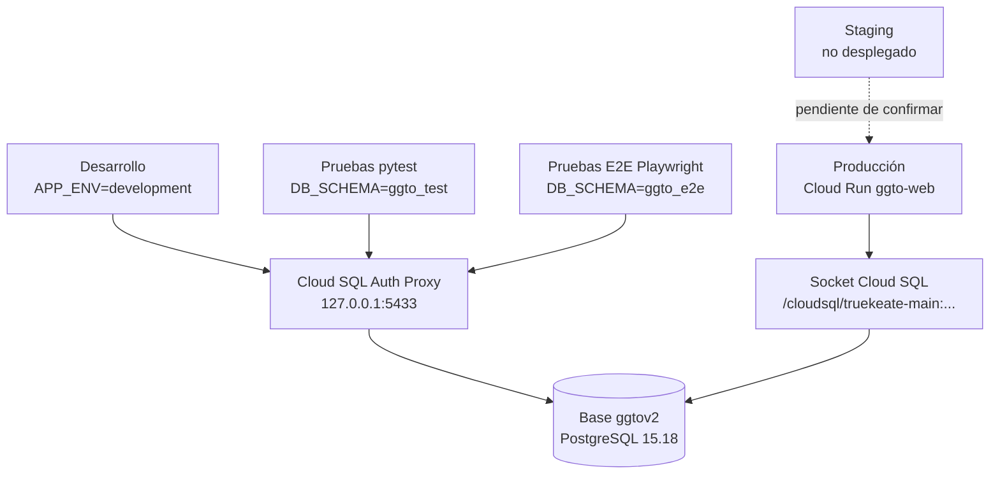

# Manual de Entornos y Variables — GGTO (CANTV, Central Francisco Salias / Área 4)

> Manual para todo público. Explica, en lenguaje sencillo, **dónde se ejecuta la plataforma GGTO**,
> **qué variables de configuración usa** y **cómo se cuidan los secretos** (claves y contraseñas).
> Está dirigido a operadores, supervisores y administradores. Cuando un dato no pudo comprobarse, se
> indica como «pendiente de confirmar». Este manual **nunca escribe valores de secretos**: solo los
> nombra.

## Empezar en 5 minutos

1. **Averigüe dónde está corriendo el sistema.** Abra en el navegador la dirección del servicio
   seguida de `/api/v1/info`. La respuesta trae la clave `entorno`. Si dice `production`, está en
   producción; si dice `development`, está en el ambiente de trabajo.
2. **Entienda de dónde salen los valores.** La aplicación lee un archivo llamado `.env` en su
   carpeta de trabajo. Si una variable ya existe en el sistema operativo, esa manda; si la variable
   no está declarada, se ignora sin romper el arranque.
3. **Nunca escriba un secreto en un archivo, en un chat ni en la línea de comandos.** Los secretos
   viven en **Secret Manager** y solo se usan **por su nombre**: `SECRET_KEY`, `DB_PASSWORD`,
   `TELEGRAM_BOT_TOKEN`, `SMTP_HOST`, `SMTP_PASSWORD` y `MCP_API_KEY`.
4. **No cargue datos reales todavía.** La base actual (`truekeate-db-dev`) no tiene respaldos ni
   recuperación a un punto en el tiempo, y el servicio es público. El riesgo **D-26** prohíbe cargar
   datos reales hasta migrar a la instancia `ggtov2-pg` con backups, PITR y SSL.
5. **Para probar, use un esquema aislado.** `pytest` trabaja en el esquema `ggto_test` y las pruebas
   de navegador Playwright en `ggto_e2e`. Así ninguna prueba toca los datos de producción.

## Entornos

La aplicación lee su entorno desde la variable `app_env` (en el sistema operativo, `APP_ENV`). Si
nadie la define, el valor por defecto es `development`. Ese valor se publica tal cual en el endpoint
de metadatos `GET /api/v1/info` bajo la clave `entorno`. Gracias a eso, cualquier persona puede
averiguar en qué entorno corre el proceso consultando ese endpoint, sin abrir la consola de Google
Cloud.

La configuración se resuelve con la librería `pydantic-settings`. La clase `Settings` está
configurada para leer un archivo `.env` del directorio de trabajo, ignorar las variables que no
declara (sin romper el arranque) y no distinguir mayúsculas de minúsculas en los nombres. Las
variables del sistema tienen prioridad sobre el archivo. La configuración se guarda en memoria una
sola vez por proceso (mediante `@lru_cache` sobre `get_settings()`), para que sea única y rápida.

<!-- GENERAR_IMAGEN: entornos-ggto.svg -->

### development

Es el entorno de trabajo dentro de la instancia de Google Compute Engine del *workspace*
(`/home/dsh/workspace`), con el usuario `dsh`. En esa máquina están disponibles `python3`, `node`,
`npm`, `gcloud` y `git`. En este entorno:

- El valor documentado para el archivo de entorno es `APP_ENV=development`.
- La base de datos se alcanza por TCP a través del proxy local: `DB_HOST=127.0.0.1`,
  `DB_PORT=5433`, `DB_NAME=ggtov2`, `DB_USER=ggtov2_app`.
- La aplicación se levanta a mano con Uvicorn, igual que hace la rutina de pruebas E2E:
  `python3 -m uvicorn app.main:app --host 127.0.0.1 --port 8090`.
- **No hay `docker` ni cliente `psql`** instalados de forma nativa. El cliente `psql` se busca en
  `$HOME/bin/psql` y, si no está, se usa el `psql` del `PATH`.

### staging

No existe un entorno de *staging* (preproducción) desplegado y verificado en la infraestructura
actual. El requerimiento **RNF-24** exige «entornos separados `dev`/`staging`/`prod`» y el
requerimiento **RNF-25** exige paridad de versiones entre desarrollo y producción. Sin embargo, el
estado real del despliegue solo registra el servicio de producción en `truekeate-main`.

El valor que deba usarse en `APP_ENV` para *staging* y el proceso concreto de promoción entre
entornos están **pendientes de confirmar**.

### production

Es el entorno donde corre el servicio **Cloud Run `ggto-web`**, desplegado temporalmente en el
proyecto `truekeate-main` y en la región `europe-west1`. En producción:

- El servicio se conecta a la base mediante el socket de Cloud SQL:
  `DB_HOST=/cloudsql/truekeate-main:southamerica-east1:truekeate-db-dev`.
- El valor de `APP_ENV` en la revisión desplegada está **pendiente de confirmar**. El guion de
  despliegue del repositorio solo declara `DB_USER`, `DB_NAME`, `DB_HOST` y `SECRET_KEY`; no incluye
  `APP_ENV`. La documentación del servicio desplegado indica que `GET /api/v1/info` respondía
  `"entorno":"production"`, por lo que el valor debió fijarse fuera del guion o quedar por defecto en
  la revisión; la fuente exacta está **pendiente de confirmar**.
- El servicio tiene acceso **público** (para `allUsers`) y contiene PII real (datos personales de
  suscriptores): 42 casos cargados.

### test/preview (DB_SCHEMA)

El aislamiento de las pruebas se logra con el parámetro `DB_SCHEMA`. Este parámetro añade
`options=-csearch_path=<esquema>,public` a la dirección de conexión, de modo que la aplicación mira
primero el esquema indicado y luego el esquema público. Se usan dos esquemas aislados:

| Esquema | Herramienta | Para qué sirve |
|---|---|---|
| `ggto_test` | `pytest` (pruebas unitarias, de integración y de contratos) | Comprobar el backend contra PostgreSQL sin tocar producción |
| `ggto_e2e` | Playwright/Chromium (pruebas de navegador) | Recorrer la interfaz completa en un navegador real |

En las pruebas E2E, el esquema se fija en el guion `run_e2e.sh` con la instrucción
`ESQUEMA="${DB_SCHEMA:-ggto_e2e}"` y luego se exporta como `DB_SCHEMA`. En el lado de `pytest`, el
esquema se selecciona con la variable `GGTO_TEST_SCHEMA`, cuyo valor por defecto es `public`. Las
pruebas de integración se omiten si `GGTO_TEST_DB_URL` no está definida.

La razón de conservar `public` dentro del `search_path` es que allí viven las extensiones
`pgcrypto` (cifrado) y `pg_trgm` (búsqueda aproximada de texto).

### variables globales del workspace (.env.global, gcp-env.sh)

El *workspace* dispone de un cargador global reutilizable que **no** pertenece al proyecto GGTO:

- `source /home/dsh/workspace/gcp-env.sh` carga variables y, en su modo diagnóstico, informa
  **solo nombres, nunca valores**.
- El archivo `/home/dsh/workspace/.env.global` contiene variables sin secretos y apunta al proyecto
  **`mcc-ecommerce`** (TrueKeate/MCC), no a GGTO.
- El proxy de Cloud SQL vive en `/home/dsh/tools/cloud-sql-proxy`, con registros (logs) en
  `/home/dsh/tools/cloudsql/proxy.log`.

Variables relevantes de `.env.global` (verificadas como nombres en el archivo del *workspace*):

| Variable | Valor documentado | Observación |
|---|---|---|
| `GCP_PROJECT_ID` | `mcc-ecommerce` | Proyecto de MCC, no de GGTO |
| `GCP_REGION` | `us-central1` | Región base |
| `GCP_REGION_RUN` | `europe-west1` | Región de Cloud Run |
| `MCC_POSTGRES_URL` | `https://mcc-postgres-slzlptbcla-ew.a.run.app` | Servicio de MCC |
| `MCC_PGADMIN_URL` | `https://mcc-pgadmin-slzlptbcla-ew.a.run.app` | Administración de MCC |
| `MCC_ANVIL_RPC_URL` | `https://mcc-foundry-anvil-…run.app` | RPC de Anvil de MCC |

Además, `.env.global` declara nombres de secretos bajo los prefijos `GCP_SECRET_*` y `MCC_SECRET_*`
(por ejemplo `GCP_SECRET_DB_URL` y `MCC_SECRET_POSTGRES_PASSWORD`). Esos nombres pertenecen a MCC y
**no** deben reutilizarse para GGTO: la recomendación documentada es crear un archivo `.env.ggto`
propio del proyecto.

## Variables de la aplicacion (app/core/config.py:8-47)

La clase `Settings` declara 19 campos agrupados en cuatro temas: aplicación, base de datos,
seguridad y CORS (reglas de origen cruzado). La tabla siguiente reproduce el tipo, el valor por
defecto y el uso de cada variable. El valor por defecto es el que rige cuando la variable no está ni
en el sistema operativo ni en el archivo `.env`.

| Variable | Tipo | Valor por defecto | Uso |
|---|---|---|---|
| `APP_NAME` | texto | `GGTO API` | Título de la aplicación FastAPI y campo `servicio` de `/api/v1/info` |
| `APP_ENV` | texto | `development` | Entorno lógico; se publica en `/api/v1/info` |
| `APP_VERSION` | texto | `0.9.0` | Versión declarada en OpenAPI y en `/api/v1/info` |
| `APP_TIMEZONE` | texto | `America/Caracas` | Zona horaria operativa |
| `DB_HOST` | texto | `localhost` | Servidor de PostgreSQL; si empieza por `/` se trata como socket de Cloud SQL |
| `DB_PORT` | número | `5432` | Puerto TCP cuando no se usa socket |
| `DB_NAME` | texto | `ggtov2` | Nombre de la base de datos |
| `DB_USER` | texto | `ggtov2_app` | Usuario de la aplicación |
| `DB_PASSWORD` | texto | vacío | Contraseña; en producción proviene de Secret Manager |
| `DB_SSLMODE` | texto | `prefer` | Modo de cifrado SSL de la conexión TCP |
| `DB_SCHEMA` | texto | vacío | Esquema alternativo vía `search_path`; vacío = comportamiento por defecto |
| `SECRET_KEY` | texto | `cambiar-esta-clave-en-produccion` | Clave de firma de los JWT (tokens de sesión) |
| `JWT_ALGORITHM` | texto | `HS256` | Algoritmo de firma del token |
| `ACCESS_TOKEN_MINUTES` | número | `480` | Vigencia del token: 8 horas, una jornada |
| `MAX_INTENTOS` | número | `3` | Intentos fallidos antes del bloqueo (RF-20) |
| `PALABRAS_SEGURIDAD` | número | `12` | Cantidad de palabras de recuperación (RF-20) |
| `PALABRAS_REQUERIDAS` | número | `3` | Palabras exigidas para recuperar la cuenta (RF-20) |
| `RATE_LIMIT_INTENTOS` | número | `10` | Intentos de inicio de sesión permitidos por ventana (RNF-22) |
| `RATE_LIMIT_VENTANA_SEG` | número | `60` | Duración de la ventana de limitación, en segundos |
| `CORS_ORIGINS` | texto | `*` | Orígenes permitidos, separados por coma |

La propiedad derivada `cors_origin_list` divide `CORS_ORIGINS` por comas, recorta los espacios y
descarta los elementos vacíos. Su resultado se entrega directamente al `CORSMiddleware` de la
aplicación. Esto implica que, con el valor por defecto `*`, la API acepta cualquier origen y además
permite credenciales. Esa situación es coherente con el acceso público actual del servicio, pero
**no es recomendable en producción**.

## Variables de despliegue previstas (RepoTecnico/entornos_globales.md:129-206)

El bloque `dotenv` del documento de entornos enumera las variables previstas para el despliegue. Es
un documento de **previsión**: algunas todavía no están implementadas en la configuración de la
aplicación y otras se gobiernan desde la tabla `configuracion` (ver la sección siguiente). Se
organizan por dominio.

### aplicacion

| Variable | Valor previsto | Estado real |
|---|---|---|
| `APP_ENV` | `development \| staging \| production` | Implementada |
| `APP_NAME` | `GGTO` | Implementada, pero el valor real en el código es `GGTO API` |
| `APP_TIMEZONE` | `America/Caracas` | Implementada |
| `SECRET_KEY` | Secret Manager `ggtov2-app-secret-key` | Implementada; el despliegue real usa el secreto `ggto-secret-key` |

### base de datos

| Variable | Valor previsto | Observación |
|---|---|---|
| `DB_HOST` | `/cloudsql/truekeate-main:southamerica-east1:truekeate-db-dev` | Socket en Cloud Run; proxy local en desarrollo |
| `DB_PORT` | `5432` | Coincide con el valor de la aplicación |
| `DB_NAME` | `ggtov2` | Coincide con el valor de la aplicación |
| `DB_USER` | `ggtov2_app` | Coincide con el valor de la aplicación |
| `DB_PASSWORD` | Secret Manager `ggtov2-db-password` | Nunca se escribe en claro |
| `DB_SSLMODE` | `require` | Previsto `require`; en las pruebas E2E se usa `disable` contra el proxy local |
| `DB_SCHEMA` | vacío en producción; `ggto_test`/`ggto_e2e` en pruebas | Aísla las pruebas de producción |

### ingesta

| Variable | Valor previsto | Observación |
|---|---|---|
| `INGESTA_CSV_DELIMITER` | `;` | El archivo trae 80 columnas por posición |
| `INGESTA_CSV_ENCODING` | `iso-8859-1` | El CSV real está en ISO-8859-1, no en UTF-8 |
| `INGESTA_CSV_ENCODING_DESTINO` | `utf-8` | Decodificación en la frontera del sistema |
| `INGESTA_CSV_FECHA_FORMATO` | `%d/%m/%Y %I:%M:%S %p` | Fechas con a.m./p.m. |
| `INGESTA_CSV_TIMEZONE` | `America/Caracas` | Zona horaria de la ingesta |
| `INGESTA_CSV_MAPEO` | `por_posicion` | Las columnas se leen por su posición |
| `INGESTA_CENTRAL_CODIGO` | `2324X` | Código de la central |
| `INGESTA_CENTRAL_NOMBRE` | `FRANCISCO SALIAS` | Nombre de la central |
| `INGESTA_ESTADO_OPERATIVO` | `MIRANDA-2` | Estado operativo |
| `INGESTA_AREA` | `AREA 4` | Área a la que pertenece la central |

Estos parámetros no están declarados en la clase `Settings`. En la implementación real se leen desde
la tabla `configuracion`, con las claves `ingesta.central_codigo`, `ingesta.delimitador`,
`ingesta.encoding` y `ingesta.fecha_formato`. La convivencia entre ambas fuentes está **pendiente de
confirmar**.

### despacho

| Variable | Valor previsto | Observación |
|---|---|---|
| `DESPACHO_HORA_REPORTE` | `16:00` | Clave real en la tabla: `despacho.hora_reporte` |
| `DESPACHO_MIN_REFERIDOS` | `2` | Clave real: `despacho.min_referidos` |
| `DESPACHO_MIN_EMPRESAS` | `1` | Clave real: `despacho.min_empresas` |
| `DESPACHO_FRASES_EXCLUIR` | `LOSS ROJO;FALLA FIBRA;Fibra Dañada` | En la tabla se modela como lista JSON: `despacho.frases_campo` |

### mensajeria

| Variable | Valor previsto | Observación |
|---|---|---|
| `TELEGRAM_BOT_TOKEN` | Secret Manager | El nombre del secreto está **pendiente de confirmar** |
| `TELEGRAM_CHAT_ID_CENTRAL` | vacío | Destino de las alertas |
| `SMTP_HOST` | `smtp.sendgrid.net` (alternativa `smtp.gmail.com`) | Servidor de correo saliente |
| `SMTP_PORT` | `587` | Puerto de correo |
| `SMTP_USER` | `apikey` (alternativa Gmail `txbarlovento@gmail.com`) | Usuario de correo |
| `SMTP_PASSWORD` | Secret Manager | El nombre del secreto está **pendiente de confirmar** |
| `MAIL_FROM` | `txbarlovento@gmail.com` | Remitente de los correos |
| `WHATSAPP_API_URL` | reservado para la 3.ª versión | **WhatsApp no existe en la v1** |

En la v1 los canales de mensajería son **Telegram, correo (SMTP) y MCP**; WhatsApp está diferido a
la tercera versión. A la fecha del levantamiento, **Telegram y el correo no tienen credenciales en
producción**. Por eso las notificaciones no se pierden ni se envían: quedan guardadas en la bandeja
de salida (patrón *outbox*) con estado `PENDIENTE`, a la espera de que se configuren las
credenciales.

### MCP

| Variable | Valor previsto | Observación |
|---|---|---|
| `MCP_SERVER_URL` | vacío | Dirección del servidor MCP |
| `MCP_API_KEY` | Secret Manager | Clave que se contrasta contra la cabecera del servidor MCP |

### almacenamiento

| Variable | Valor previsto | Observación |
|---|---|---|
| `STORAGE_BUCKET` | `ggtov2-assets-905974355709` | Depósito (bucket) de activos y evidencias |

> Recordatorio: `STORAGE_BUCKET` apunta a un depósito del proyecto `ggtov2`, que **no** tiene
> facturación habilitada. Su uso efectivo por parte de la aplicación en la revisión desplegada está
> **pendiente de confirmar**.

## Parametros gobernados por la tabla configuracion (JSONB) (entornos_globales.md:187-206)

Buena parte de los parámetros operativos no vive en variables de entorno, sino en la tabla
`configuracion`. Esta tabla se define con una clave de texto (`clave varchar(80)`) como llave
primaria, un valor en formato JSONB (`valor jsonb NOT NULL`), una descripción de texto
(`descripcion text`) y la fecha de última actualización (`actualizado_en timestamptz`). La decisión
documentada es que «los canales y la detección de fallas se gobiernan desde la tabla `configuracion`,
no desde el entorno».

La tabla se siembra con las claves que se enumeran a continuación:

| Clave | Valor inicial | Uso |
|---|---|---|
| `ingesta.central_codigo` | `"2324X"` | Filtro de central en la ingesta |
| `ingesta.delimitador` | `";"` | Delimitador del archivo diario |
| `ingesta.encoding` | `"iso-8859-1"` | Codificación real del CSV (hallazgo H-02) |
| `ingesta.fecha_formato` | `"%d/%m/%Y %I:%M:%S %p"` | Formato de fecha con zona `America/Caracas` |
| `despacho.hora_reporte` | `"16:00"` | Hora del reporte de producción |
| `despacho.min_referidos` | `2` | Mínimo de reparaciones de referidos por despacho |
| `despacho.min_empresas` | `1` | Mínimo de reparaciones de empresas por despacho |
| `despacho.criterio_cuadrilla0` | `"SUPERVISOR"` | Criterio de cuadrilla 0: `CAMPO`, `SUPERVISOR` o `UNION` (decisiones D-22 y D-59) |
| `despacho.destino_telegram` | `""` | Chat o canal de Telegram que recibe las fichas; vacío significa que quedan `PENDIENTE` |
| `despacho.destino_correo` | `""` | Correo que recibe las fichas de despacho |
| `despacho.frases_campo` | `["LOSS ROJO","FALLA FIBRA","Fibra Dañada"]` | Frases que indican maniobra de campo |
| `despacho.frases_supervisor` | `["NAVEGACION LENTA","PON INTERMITENTE","SIN TONO"]` | Frases que no ameritan maniobra en casa |
| `despacho.columnas_evaluar` | `["problema_reporte","ultimo_comentario","informacion"]` | Columnas donde se buscan las frases |
| `fallas.activo` | `true` | Detección automática de fallas tras la ingesta (RF-09) |
| `fallas.umbral_casos` | `5` | Casos mínimos del grupo para declarar falla masiva |
| `fallas.ventana_horas` | `24` | Ventana temporal de la concentración |
| `fallas.campo_concentracion` | `"olt"` | Campo agrupador: `olt`, `fat` o `id_sector` |
| `outbox.max_intentos` | `5` | Reintentos antes de marcar el envío como `FALLIDO` (RNF-20) |
| `telegram.webhook_secret` | `""` | Cabecera `X-Telegram-Bot-Api-Secret-Token`; vacío significa que no se exige |
| `mcp.api_key` | `""` | Cabecera `X-MCP-Key` del servidor MCP; vacío significa que no se exige |
| `seguridad.max_intentos` | `3` | Intentos de inicio de sesión antes del bloqueo |
| `seguridad.palabras_seguridad` | `12` | Cantidad de palabras de recuperación |

> Nota de conteo: el documento de entornos reporta que el conteo de parámetros sembrados está
> verificado en 13, mientras que la enumeración completa del esquema es más extensa. Conviene
> contrastar el total real contra la base de datos al aplicar el esquema.

Cómo consume el código estas claves:

- El servicio de detección de fallas lee `fallas.activo`, `fallas.umbral_casos`,
  `fallas.ventana_horas` y `fallas.campo_concentracion`, y usa valores internos por defecto
  (`UMBRAL_POR_DEFECTO`, `VENTANA_POR_DEFECTO` y el campo `"olt"`) cuando la clave no existe.
- El mismo servicio obtiene `despacho.destino_telegram` y encola la notificación correspondiente.
- El servicio de bandeja de salida (*outbox*) lee `outbox.max_intentos` y, si no existe, usa
  `MAX_INTENTOS_POR_DEFECTO = 5`. El reintento es exponencial: 1, 2, 4, 8… minutos, con un tope de
  60 minutos.
- El módulo de alertas compara la cabecera del webhook de Telegram contra `telegram.webhook_secret`
  y la cabecera del servidor MCP contra `mcp.api_key`.
- El módulo de despachos resuelve el destino de forma genérica con el patrón
  `despacho.destino_<canal>`.
- La administración se expone por API: `GET /api/v1/configuracion` lista las claves y
  `PUT /api/v1/configuracion/{clave}` actualiza el valor. Esta última operación exige perfil de
  escritura.
- La detección de fallas es **idempotente** por la clave de concentración de la falla masiva (por
  ejemplo `olt:pde-olt-00`): mientras la falla siga activa, no se duplica el registro.

> Nota de coherencia: `seguridad.max_intentos` y `seguridad.palabras_seguridad` existen en la tabla,
> pero la autenticación vigente usa `MAX_INTENTOS` y `PALABRAS_SEGURIDAD` de la configuración de la
> aplicación. Cuál de las dos fuentes prevalece está **pendiente de confirmar**.

## Secretos

El proyecto sigue la regla explícita de **no escribir secretos**: los documentos «nunca escriben
secretos, solo se referencian por nombre en Secret Manager». Este manual respeta esa regla: solo se
nombran los secretos, jamás sus valores.

### Secret Manager (ggtov2-db-password, ggto-secret-key, ggtov2-app-secret-key)

| Secreto | Proyecto | Función |
|---|---|---|
| `ggtov2-db-password` | `truekeate-main` | Contraseña del usuario `ggtov2_app` |
| `ggtov2-db-connection` | `truekeate-main` | Nombre de conexión de la instancia |
| `ggto-secret-key` | `truekeate-main` | Clave de firma de los JWT que usa el servicio desplegado |
| `ggtov2-app-secret-key` | `ggtov2` (previsto) | Clave de firma prevista para el proyecto GGTOv2 |

El guion de secretos planificado crea, además, `ggtov2-db-root-password` y
`ggtov2-django-secret-key`, y otorga el rol `roles/secretmanager.secretAccessor` a las cuentas de
servicio. El inventario de pendientes del proyecto los lista como tareas del aprovisionamiento de
`ggtov2`.

La cuenta de servicio de ejecución del servicio real,
`ggto-web-sa@truekeate-main.iam.gserviceaccount.com`, tiene los roles `roles/cloudsql.client` y
`roles/secretmanager.secretAccessor` sobre los secretos `ggtov2-db-password` y `ggto-secret-key`. El
acceso a los secretos se concede de forma explícita **por nombre**: el guion que usa la instancia
compartida recorre `ggtov2-db-password` y `ggtov2-db-connection` y fija la política con las cuentas
autorizadas.

### nunca en git

El archivo `.gitignore` del repositorio protege la configuración sensible desde su primera sección,
titulada «Entornos y secretos». Ignora `.env`, `.env.*`, `*.pem`, `*.key`, `credentials*.json` y
`*-sa.json`. La única excepción que sí se versiona es `.env.example`, que sirve de plantilla y no
contiene valores reales.

Además, el repositorio ignora explícitamente los datos de ingesta reales con PII de suscriptores de
CANTV: `detalle_averias_gpon*.csv`, las carpetas `RepoTecnico/entrada/`, `RepoTecnico/salida/` y
`RepoTecnico/evidencias/`, y los archivos `*.zip`. La salvedad es que las muestras pseudonimizadas
de `RepoTecnico/muestras/*.csv` **sí** se versionan con fines de prueba. También se ignoran la
carpeta `RepoTecnico/credenciales/` y los archivos `*credenciales*.md`.

Esta política responde al hallazgo **H-01**: un archivo CSV real con PII (nombre, teléfono,
dirección, serial e IP) llegó a estar versionado en git y quedó fuera del `.gitignore`. Se corrigió
retirando el archivo del índice, purgando el historial y pseudonimizando la muestra. La decisión se
registró como **QW-1**.

### rotacion

Existe un precedente documentado de rotación de credenciales. Durante una verificación, un mensaje
de error de Node imprimió la contraseña del usuario `app` de TrueKeate, contenida en el secreto
`DATABASE_URL`. La respuesta fue:

#### Procedimiento observado

1. Cambiar la contraseña con `ALTER ROLE app PASSWORD '<nueva>'`, usando 32 caracteres aleatorios.
2. Publicar una nueva versión del secreto (la versión `versions/3`) en `truekeate-main`.
3. Crear una nueva revisión de Cloud Run (`truekeate-api-00034-hvk`) para que tomara el valor
   `latest`. La revisión quedó `Ready`, con el 100 % del tráfico y sin errores de autenticación en
   los registros.

El procedimiento reutilizable que se desprende es: generar la credencial, publicar una versión nueva
del secreto, volver a desplegar para que la referencia `latest` se materialice y verificar en los
registros. Para el caso de GGTO, la contraseña la genera el guion con 32 caracteres aleatorios y
nunca la imprime en pantalla.

#### Periodicidad y gobierno

Están **pendientes de confirmar**: la periodicidad formal de rotación para los secretos de GGTO, el
responsable asignado y si Cloud KMS `ggtov2-secrets`, con rotación a 90 días —hoy descrito como
«guion listo» y no aplicado—, llegará a gobernar estos secretos.

## Modo de pruebas DB_SCHEMA (app/core/db.py:16-36)

La función `build_url()` construye la cadena de conexión y es el punto donde se materializa el
aislamiento de las pruebas. Sus pasos son:

1. Escapa el usuario y la contraseña con `quote_plus`, para tolerar caracteres especiales.
2. Si `DB_HOST` empieza por `/`, genera una dirección sin puerto y pasa el servidor como parámetro
   de consulta `host=`. Esa es la forma que espera el socket Unix de Cloud SQL.
3. En caso contrario, arma una dirección TCP con `host:puerto` y añade `sslmode` según `DB_SSLMODE`.
4. Si `DB_SCHEMA` tiene valor, añade `options=-csearch_path=<esquema>,public`. El propio comentario
   del código explica por qué se conserva `public`: para resolver las extensiones `pgcrypto` y
   `pg_trgm`.

El motor de base de datos se crea una sola vez al importar el módulo, con `pool_pre_ping=True`,
`pool_size=5` y `max_overflow=5`. La dependencia `get_db()` entrega una sesión por petición y la
cierra siempre en el bloque `finally`.

Uso operativo del modo de pruebas:

| Escenario | `DB_SCHEMA` | Efecto |
|---|---|---|
| Producción | vacío | Se usa el `search_path` por defecto del rol |
| `pytest` | `ggto_test` | Todo el esquema de `db/schema.sql` se crea en el esquema aislado |
| Playwright E2E | `ggto_e2e` | El guion exporta el esquema y siembra datos con `seed_e2e.py` |

El aislamiento fue una corrección formal de la Fase 4 (hallazgo **F4-01**): antes, las pruebas no
podían separarse de producción porque la conexión se construía sin `search_path`. Se añadió
`DB_SCHEMA` de forma retrocompatible y se cubrió con pruebas unitarias en `test_config_db.py`. La
suite resultante cerró con **169/169 pruebas pytest** y **46/46 pruebas E2E de Playwright**.

Para las pruebas E2E también se elevó `RATE_LIMIT_INTENTOS` a 10 000 y se fijó un `SECRET_KEY` de
prueba, evitando que el limitador de intentos de RNF-22 produjera respuestas `429` (hallazgo
**F4-05**).

## Pendientes de entorno (entornos_globales.md:272-282)

El documento de entornos enumera seis pendientes. Su estado se contrasta así:

| # | Pendiente | Estado y evidencia |
|---|---|---|
| 1 | Repositorios remotos publicados | ✅ Resuelto: GitHub y GitLab con la rama `GGTOv2-DSH-GCP` |
| 2 | Crear `.env.ggto` propio del proyecto | ⏳ Pendiente: hoy solo existe el `.env.global` de MCC |
| 3 | Cliente PostgreSQL `psql` y/o dependencias `psycopg2`/`asyncpg` | ⏳ Parcial: `psycopg2-binary` está declarado; el guion de E2E busca `psql` en `$HOME/bin/psql` con reserva al `PATH` |
| 4 | Liberar cupo de facturación GCP | ❌ Pendiente: la facturación está desactivada porque el cupo de 5 proyectos está agotado |
| 5 | Credenciales de mensajería (Telegram, correo, MCP) | ❌ Pendiente: sin ellas, la bandeja de salida deja las notificaciones en `PENDIENTE` |
| 6 | Backups/PITR/protección de borrado antes de datos reales | ❌ Pendiente: riesgo aceptado **D-26** |

Observaciones adicionales sobre el inventario:

- El conjunto tecnológico previsto menciona `asyncpg`, pero la implementación real usa
  `psycopg2-binary`. La adopción de `asyncpg` está **pendiente de confirmar**.
- El pendiente 6 es el más crítico: hay **datos reales en producción** (un lote con 42 casos y PII
  de suscriptores) sobre una instancia sin respaldo y con el servicio público. El riesgo **D-26**
  obliga a no seguir cargando datos reales hasta migrar a `ggtov2-pg` con backups, PITR y SSL.
- La rotación del `.env.global` hacia un `.env.ggto` no cambia los nombres de los secretos ya
  desplegados. Cualquier cambio de nombres debe coordinar Secret Manager, IAM (permisos) y la
  revisión de Cloud Run, para evitar cortes de servicio.
