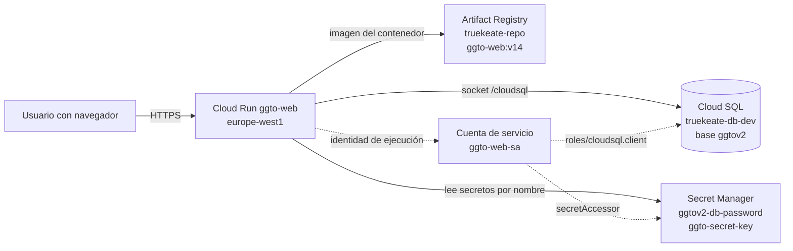

# Manual de Cloud Run y Cloud SQL — GGTO (CANTV, Central Francisco Salias / Área 4)

> Manual para todo público. Explica, en lenguaje sencillo, **dónde vive la plataforma GGTO en Google
> Cloud**: el servicio Cloud Run que atiende la aplicación, la base de datos Cloud SQL que guarda la
> información `ggtov2`, la imagen del contenedor, cómo se conecta todo y qué riesgos están vigentes.
> Cuando un dato no pudo comprobarse, se indica como «pendiente de confirmar». Este manual **nunca
> escribe valores de secretos**: solo los nombra.

## Empezar en 5 minutos

1. **Ubique el servicio.** GGTO corre en **Cloud Run** con el nombre `ggto-web`, en el proyecto
   `truekeate-main` y la región `europe-west1`. Cloud Run es el servicio de Google que ejecuta la
   aplicación en contenedores y la publica por internet.
2. **Abra la dirección de la aplicación.** La dirección principal es
   `https://ggto-web-593453426217.europe-west1.run.app`. La misma dirección sirve la pantalla
   (SPA en React) y la API: por eso `GET /`, los enlaces profundos del menú y todo `/api/v1/*`
   funcionan bajo la misma URL.
3. **Compruebe que está viva.** Agregue `/health` a la dirección. Debe responder `{"status":"ok"}`.
   Para saber si además alcanza la base de datos, use `/ready`.
4. **Sepa dónde están los datos.** La información vive en la base `ggtov2`, dentro de la instancia
   compartida `truekeate-main:southamerica-east1:truekeate-db-dev`, en PostgreSQL 15.18. El usuario
   de la aplicación es `ggtov2_app`.
5. **Recuerde las dos advertencias.** El servicio es **público** y ya contiene PII real (42 casos):
   debe restringirse. Además, la instancia **no tiene respaldos ni recuperación a un punto en el
   tiempo** (riesgo aceptado **D-26**): no cargue más datos reales hasta migrar.

## Estado real del despliegue

El despliegue definitivo **no** vive en el proyecto previsto `ggtov2`. La facturación de `ggtov2`
está **bloqueada** porque el cupo de cinco proyectos de la cuenta de facturación está agotado. Por
esa razón, el servicio se aloja temporalmente en el proyecto **`truekeate-main`**, que sí tiene
facturación activa, apuntando a la base `ggtov2` de la instancia compartida.

| Elemento | Valor verificado |
|---|---|
| Proyecto actual | `truekeate-main` |
| Servicio | Cloud Run `ggto-web` |
| Región | `europe-west1` |
| URL principal | `https://ggto-web-593453426217.europe-west1.run.app` |
| URL alternativa | `https://ggto-web-m33mjctj4a-ew.a.run.app` |
| Acceso | Público (`allUsers` con el rol `roles/run.invoker`) |
| Proyecto previsto a futuro | `ggtov2` (número de proyecto `905974355709`) |

El despliegue corresponde a la decisión **D-43** del registro de decisiones: «servicio Cloud Run
`ggto-web` en `truekeate-main`/`europe-west1`, con cuenta de servicio propia `ggto-web-sa`,
conectado a `ggtov2` por el conector de Cloud SQL». Esa decisión incluye la advertencia explícita de
que el acceso público es una prueba de humo (*smoke test*) que debe restringirse antes de
producción.

<!-- GENERAR_IMAGEN: arquitectura-cloud.svg -->


### Cloud Run ggto-web en truekeate-main/europe-west1

Cloud Run ejecuta el contenedor que contiene **dos cosas a la vez**: la API hecha en FastAPI y la
pantalla o SPA (aplicación de una sola página) compilada en React. El punto de entrada del
contenedor es `uvicorn app.main:app --host 0.0.0.0 --port 8080`. La aplicación monta la SPA al final
del enrutador para no tapar la API: el componente `SPAStaticFiles` sirve la carpeta `app/web/dist` y
responde `index.html` ante las rutas del cliente. Es decir, la misma URL sirve `GET /`, los enlaces
profundos de React Router y todo `/api/v1/*`.

La configuración de ejecución verificada en el servicio incluye:

- Cuenta de servicio de ejecución `ggto-web-sa@truekeate-main.iam.gserviceaccount.com`, con los roles
  `roles/cloudsql.client` y `roles/secretmanager.secretAccessor` sobre los secretos
  `ggtov2-db-password` y `ggto-secret-key`. Una cuenta de servicio es la «identidad» con la que el
  contenedor pide permisos a Google.
- La instancia Cloud SQL montada `truekeate-main:southamerica-east1:truekeate-db-dev`.
- El código desplegado es `app/` (FastAPI + SQLAlchemy + Argon2id + JWT) y `app/web/`
  (React + Vite + TypeScript).

### URL y revision (ggto-web-00014-zqx, imagen v14)

La última revisión documentada del servicio es la siguiente. Una «revisión» es cada versión
publicada del servicio; Cloud Run atiende una revisión a la vez.

| Dato | Valor |
|---|---|
| Revisión actual | `ggto-web-00014-zqx` |
| Imagen | `southamerica-east1-docker.pkg.dev/truekeate-main/truekeate-repo/ggto-web:v14` |
| Versión funcional | Ciclo 9 — ALERTAS, Telegram y MCP |
| Pruebas al cierre de esa revisión | 152/152 pruebas pytest |
| Verificación en vivo | 42 casos, 0 fallas, bandeja de salida vacía, 73 endpoints |

La revisión inmediatamente anterior documentada fue `ggto-web-00013-9pf` con la imagen `v13`. Existe
una secuencia completa de revisiones históricas por ciclo: `ggto-web-00002-rbl` (v2), `00003-6zb`
(v3), `00004-cj9` (v4), `00005-rxm` (v5), `00006-htl` (v6), `00007-vsr` (v7), `00008-vr5` (v8),
`00009-fvc` (v9), `00011-ksr` (v11), `00012-lbl` (v12), `00013-9pf` (v13) y `00014-zqx` (v14).

> La revisión activa en el momento de leer este manual debe confirmarse con el comando
> `gcloud run services describe ggto-web --region=europe-west1 --project=truekeate-main`. El dato
> aquí consignado es el último documentado en el repositorio, no una lectura en vivo.

### SA de ejecucion

La cuenta de servicio de ejecución es la identidad con la que el contenedor accede a Cloud SQL y a
Secret Manager. Además de `ggto-web-sa@truekeate-main.iam.gserviceaccount.com`, el proyecto mantiene
dos cuentas planificadas en el diseño original de `ggtov2`:

| Cuenta | Rol previsto |
|---|---|
| `ggtov2-app@ggtov2.iam.gserviceaccount.com` | Cuenta de ejecución (*runtime*) del proyecto GGTOv2 |
| `ggtov2-deploy@ggtov2.iam.gserviceaccount.com` | Cuenta de despliegue |
| `ggto-web-sa@truekeate-main.iam.gserviceaccount.com` | Cuenta de ejecución real del servicio |

La cuenta `ggtov2-app@ggtov2` conserva un permiso cruzado hacia `truekeate-main`: el rol
`roles/cloudsql.client`. Ese permiso se otorgó consultando la política de permisos
(`getIamPolicy`) y volviéndola a fijar (`setIamPolicy`) sobre `truekeate-main`, añadiendo el enlace
con la cuenta de GGTOv2.

## Cloud SQL

### instancia truekeate-db-dev (PostgreSQL 15.18)

La base de datos operativa de GGTO es una base dedicada **dentro de una instancia compartida** con
el proyecto TrueKeate. La separación es lógica (por base de datos), no física (por instancia). Este
aspecto está señalado como riesgo en la documentación de infraestructura.

| Dato | Valor |
|---|---|
| Instancia | `truekeate-main:southamerica-east1:truekeate-db-dev` |
| Motor | `POSTGRES_15` / versión `15.18` |
| Región de la instancia | `southamerica-east1` |
| Tipo y disco | `db-f1-micro`, 10 GB PD_SSD, ZONAL |
| IP pública | `34.39.180.101` (red autorizada `35.232.138.181/32`) |
| SSL | `ALLOW_UNENCRYPTED_AND_ENCRYPTED` (no obligatorio) |
| Backups / PITR / protección de borrado | ❌ / ❌ / ❌ |

El esquema completo de la base (`RepoTecnico/db/schema.sql`, 38 821 bytes) se aplicó el 2026-09-26
en una sola transacción y sin errores. La verificación posterior confirmó 35 tablas (el DDL vigente
define 36 desde el ciclo D-66), las extensiones
`pgcrypto 1.3` y `pg_trgm 1.6`, seguridad por fila (RLS) en las tablas `caso` y `despacho`, 14
disparadores `actualizado_en`, 2 índices trigram y los datos iniciales previstos. El ciclo **D-66**
agregó la tabla `cuadrilla_sector_dia` (asignación diaria de sectores a cuadrillas), por lo que el
**esquema vigente suma 36 tablas**; para verlas en la base hay que volver a aplicar el script, que
es idempotente.

### base ggtov2 y usuario ggtov2_app

| Recurso | Valor |
|---|---|
| Base de datos | `ggtov2` (juego de caracteres UTF8) |
| Usuario | `ggtov2_app` (contraseña aleatoria de 32 caracteres, host `%`) |
| Contraseña | Secret Manager `projects/truekeate-main/secrets/ggtov2-db-password` |
| Secreto de conexión | `projects/truekeate-main/secrets/ggtov2-db-connection` |

La base y el usuario se crearon con el guion `10_usar_instancia_truekeate.sh`, que es idempotente:
si la base ya existe no la vuelve a crear, y si el usuario ya existe **no le cambia la contraseña**.
El guion genera la contraseña con `openssl rand -base64 36`, la filtra a caracteres alfanuméricos y
la recorta a 32 caracteres sin imprimirla. En cada ejecución publica una versión nueva del secreto.

### socket /cloudsql/...

La aplicación reconoce el socket Unix de Cloud SQL por una convención simple: si `DB_HOST` comienza
con `/`, la dirección se construye sin puerto y el servidor viaja como parámetro de consulta `host=`,
que es la forma que espera el conector. El valor que se monta en el contenedor es:

```
DB_HOST=/cloudsql/truekeate-main:southamerica-east1:truekeate-db-dev
DB_PORT=5432
DB_NAME=ggtov2
DB_USER=ggtov2_app
DB_SSLMODE=require
```

En Cloud Run la instancia se monta con la opción
`--add-cloudsql-instances=truekeate-main:southamerica-east1:truekeate-db-dev`. La ventaja del socket
es que el conector usa TLS (cifrado) y **no requiere abrir redes**, dado que la cuenta de servicio ya
tiene `roles/cloudsql.client` en `truekeate-main`.

> Detalle a verificar: el guion `07_cloudrun_web.sh` del repositorio **no** incluye
> `--add-cloudsql-instances` ni el `DB_HOST` del socket. Su cuerpo declara
> `DB_HOST=/cloudsql/truekeate-main:southamerica-east1:ggtov2-pg`, apuntando a la instancia
> **planificada** de `ggtov2` y no a la instancia compartida que realmente se usa. El montaje
> efectivo de la instancia compartida se hizo por fuera de ese guion; el comando exacto empleado
> está **pendiente de confirmar**.

### SSL y roles endurecidos (entornos_globales.md:83-106)

El endurecimiento del rol `ggtov2_app` (es decir, quitarle permisos que no necesita) se aplicó el
2026-09-25 y está verificado:

| Cambio | Estado |
|---|---|
| `CREATEROLE` revocado | ✅ |
| `CREATEDB` revocado | ✅ |
| `NOINHERIT` aplicado (neutraliza `cloudsqlsuperuser`) | ✅ |
| Membresía `cloudsqlsuperuser` revocada | ⚠️ No fue posible por SQL: Cloud SQL no otorga `ADMIN OPTION`; la pertenencia persiste pero no se hereda |
| `CONNECT`/`TEMPORARY`/`CREATE` de `PUBLIC` revocados en `truekeate`, `postgres` y `template1` | ✅ (el usuario `ggtov2_app` recibe «permission denied for database» al intentar entrar a `truekeate`) |
| `CONNECT` re-otorgado a `app` y `postgres` | ✅ (TrueKeate sigue operando, con 39 tablas) |
| `CONNECT` + `CREATE` en la base `ggtov2` y el esquema `public` | ✅ (el esquema de prueba se aplica correctamente) |
| `truekeate-app-sa` sin acceso a los secretos de GGTO | ✅ (solo `ggtov2-app@ggtov2` figura en el IAM de ambos secretos) |

El estado original (antes del endurecimiento) estaba documentado con `createrole=True`,
`createdb=True`, `cloudsqlsuperuser=True` y `CREATE_on_public=True`, lo que confirma que la
corrección fue efectiva.

Sobre el SSL: la instancia permanece con `sslMode: ALLOW_UNENCRYPTED_AND_ENCRYPTED` porque cambiarla
a `ENCRYPTED_ONLY` afecta a la aplicación TrueKeate, que comparte la instancia. La recomendación
documentada es fijar `ENCRYPTED_ONLY`, dado que el conector de Cloud SQL siempre cifra y la
aplicación coexistente no debería romperse. Sin embargo, **no se cambió sin autorización**, por
tratarse de una instancia en uso.

## Imagen de contenedor

### multi-etapa Node+Python

La imagen se construye con el archivo `app/Dockerfile` y el contexto de construcción en el
directorio `app/`. Es una construcción de dos etapas:

| Etapa | Base | Acciones |
|---|---|---|
| 1 — `web` | `node:20-slim` | `npm ci` con `web/package*.json` y `npm run build` |
| 2 — ejecución (*runtime*) | `python:3.12-slim` | Instala `requirements.txt` y copia el código |

La segunda etapa fija `PYTHONDONTWRITEBYTECODE=1`, `PYTHONUNBUFFERED=1` y `PORT=8080`, instala las
dependencias sin caché, copia el código a `/srv/app` y superpone el resultado de la etapa Node en
`/srv/app/web/dist`. El comando final (`CMD`) arranca Uvicorn en el puerto 8080. El contexto de
construcción usa el archivo `app/.dockerignore`.

Esta arquitectura multi-etapa es la que se verificó en el despliegue del Ciclo 2: «build multi-etapa
Node+Python». El requisito **RNF-25** exige precisamente una «imagen Docker reproducible» y
configuración solo por variables de entorno.

### Artifact Registry truekeate-repo

Las imágenes se publican en el repositorio:

```
southamerica-east1-docker.pkg.dev/truekeate-main/truekeate-repo/ggto-web:v14
```

El nombre de la imagen sigue el patrón
`<región>-docker.pkg.dev/<proyecto>/<repositorio>/<servicio>:<etiqueta>`. En el diseño original de
`ggtov2` el repositorio sería `europe-west1-docker.pkg.dev/ggtov2/ggtov2-web`, y el guion de
despliegue usa por defecto `$REGION-docker.pkg.dev/$PROJECT_ID/ggtov2-web/app:latest`. El
repositorio realmente empleado es `truekeate-repo` en la región `southamerica-east1`, coherente con
la ubicación de la instancia Cloud SQL.

> El procedimiento de `docker build`/`docker push` y el proyecto de Cloud Build asociado para las
> imágenes `v1`…`v14` están **pendientes de confirmar**: la máquina de desarrollo no tiene `docker`
> instalado y no hay un archivo `cloudbuild.yaml` en el repositorio.

## Conexion de la aplicacion

### socket vs proxy local 127.0.0.1:5433

GGTO se conecta a PostgreSQL de dos maneras según el entorno, y ambas convergen en la misma función
`build_url()`:

| Entorno | `DB_HOST` | `DB_PORT` | `DB_SSLMODE` |
|---|---|---|---|
| Cloud Run (producción) | `/cloudsql/truekeate-main:southamerica-east1:truekeate-db-dev` | `5432` | `require` |
| Desarrollo / E2E local | `127.0.0.1` (proxy) | `5433` | `disable` |

El proxy local se levanta con:

```bash
nohup /home/dsh/tools/cloud-sql-proxy \
  --project truekeate-main --address 127.0.0.1 --port 5433 \
  truekeate-main:southamerica-east1:truekeate-db-dev &
```

El puerto `5433` evita el choque con un PostgreSQL local en el puerto `5432`. La conectividad desde
la máquina de desarrollo también admite conexión directa por la IP pública `34.39.180.101:5432` con
SSL y la red autorizada `35.232.138.181/32`.

### app/core/db.py:26-36

La lógica de conexión es la siguiente: si el servidor empieza por `/` se emite la dirección sin
puerto y se añade el parámetro `host=`; en caso contrario se construye una dirección TCP con
`host:puerto` y se añade `sslmode`; finalmente, si `DB_SCHEMA` tiene valor, se agrega
`options=-csearch_path=<esquema>,public`.

El motor se crea con `pool_pre_ping=True`, `pool_size=5` y `max_overflow=5`. La opción
`pool_pre_ping` hace que las conexiones muertas se detecten antes de usarse, algo importante en
Cloud Run, donde la instancia puede reciclarse. La sesión por petición se entrega con `get_db()` y
se cierra siempre.

> `DB_PASSWORD` no aparece en el bloque de variables de Cloud Run de este manual por política de
> secretos. Se inyecta desde Secret Manager y su nombre (`ggtov2-db-password`) sí está documentado.

## Despliegue a ggto-web

El despliegue real se ejecuta con pasos equivalentes a los que describe el guion
`07_cloudrun_web.sh`. Ese guion escribe el cuerpo JSON del servicio y lo crea o reemplaza mediante
la API regional de Cloud Run, usando el ayudante `api()`, que obtiene un token de acceso por
`$GOOGLE_ACCESS_TOKEN`, por `gcloud`, por credenciales de usuario o por el servidor de metadatos.

Los elementos del despliegue que el guion fija son:

| Elemento | Valor |
|---|---|
| Servicio | `ggtov2-web` (variable `SERVICE`) |
| Imagen | `$IMAGE` o `$REGION-docker.pkg.dev/$PROJECT_ID/ggtov2-web/app:latest` |
| Puerto del contenedor | `8080` |
| Variables de entorno | `DB_USER`, `DB_NAME`, `DB_HOST`, `SECRET_KEY` |
| Recursos | CPU `1`, memoria `512Mi` |
| Escalado | mínimo `0`, máximo `10` |
| Tiempo de espera | `300s` |
| Acceso | `roles/run.invoker` para `allUsers` |

`SECRET_KEY` no se escribe en claro: se inyecta por referencia al secreto `ggtov2-app-secret-key`
con versión `latest`. El nombre del secreto efectivamente usado por el servicio desplegado es
`ggto-secret-key`.

### Pasos operativos

Los pasos siguientes reflejan el patrón del guion y la configuración verificada del servicio real.
El servicio desplegado se llama **`ggto-web`** en **`truekeate-main`**; los marcadores entre ángulos
deben sustituirse por valores reales sin escribir secretos en la línea de comandos.

1. **Autenticarse y fijar el proyecto destino.**

   ```bash
   gcloud auth login
   gcloud config set project truekeate-main
   gcloud config set run/region europe-west1
   ```

   El guion equivalente obtiene el token con el ayudante `gcp_token()`.

2. **Construir y publicar la imagen** en Artifact Registry
   (`southamerica-east1-docker.pkg.dev/truekeate-main/truekeate-repo/ggto-web:<etiqueta>`),
   siguiendo la construcción multi-etapa de `app/Dockerfile`.

3. **Crear o actualizar el servicio** montando Cloud SQL y declarando los secretos. La forma
   canónica en `gcloud` es:

   ```bash
   gcloud run deploy ggto-web \
     --project truekeate-main \
     --region europe-west1 \
     --image southamerica-east1-docker.pkg.dev/truekeate-main/truekeate-repo/ggto-web:<tag> \
     --port 8080 \
     --cpu 1 --memory 512Mi \
     --min-instances 0 --max-instances 10 \
     --timeout 300 \
     --add-cloudsql-instances truekeate-main:southamerica-east1:truekeate-db-dev \
     --set-env-vars DB_HOST=/cloudsql/truekeate-main:southamerica-east1:truekeate-db-dev,DB_PORT=5432,DB_NAME=ggtov2,DB_USER=ggtov2_app,DB_SSLMODE=require \
     --set-secrets SECRET_KEY=ggto-secret-key:latest,DB_PASSWORD=ggtov2-db-password:latest \
     --service-account ggto-web-sa@truekeate-main.iam.gserviceaccount.com
   ```

   Las variables y los recursos de este comando reproducen el guion del repositorio (puerto, CPU,
   memoria, escalado y tiempo de espera) y el montaje del socket documentado. La opción
   `--add-cloudsql-instances` con la instancia compartida es el paso que **no** está en el guion del
   repositorio y que debe ejecutarse de forma explícita (ver la observación de la sección
   *socket /cloudsql/...*).

4. **Permitir la invocación.** El guion publica el servicio para `allUsers`. Esto es una prueba de
   humo y **debe restringirse antes de producción**. La alternativa recomendada es IAP (Identity
   Aware Proxy, que exige iniciar sesión) o la invocación autenticada.

5. **Verificar** la revisión, la URL y los endpoints de salud (ver la sección *Verificacion*).

### Alternativa por API REST

El guion del repositorio no usa `gcloud run deploy`, sino la API v2 directamente: construye el
cuerpo JSON con `python3` y hace
`POST https://run.googleapis.com/v2/projects/$PROJECT_ID/locations/$REGION/services?serviceId=$SERVICE`.
El IAM se fija después con `services/$SERVICE:setIamPolicy`. Una ventaja de esta vía es que el
cuerpo JSON admite el bloque `vpcAccess` con la red `ggtov2-vpc` y la subred `ggtov2-subnet`,
pensado para la salida VPC directa del diseño original.

## Bloqueo de ggtov2 y plan de migracion (entornos_globales.md:360-369)

El proyecto `ggtov2` no puede alojar todavía el servicio. El estado del bloqueo es:

| Requisito | Estado |
|---|---|
| Facturación en `ggtov2` | ❌ Desactivada (cupo de 5 proyectos agotado) |
| APIs de despliegue en `ggtov2` | ❌ `run`, `artifactregistry`, `cloudbuild` y `secretmanager` no se pueden habilitar sin facturación |
| Cloud Run / Artifact Registry en `ggtov2` | ❌ No existen |

El plan de migración, cuando se desbloquee la facturación, es:

1. Ejecutar el guion `07_cloudrun_web.sh` para crear el servicio en `ggtov2` con su propia imagen en
   `europe-west1-docker.pkg.dev/ggtov2/ggtov2-web`.
2. Crear y migrar a un Cloud SQL propio `ggtov2-pg` (PostgreSQL 16) con el tipo `db-custom-2-7680`,
   alta disponibilidad `REGIONAL`, SSL `ENCRYPTED_ONLY`, respaldos y PITR (recuperación a un punto en
   el tiempo).
3. Migrar los datos de `ggtov2` (instancia compartida) al Cloud SQL propio y reapuntar `DB_HOST` al
   nuevo socket.

La migración cierra el riesgo aceptado **D-26** y cumple **RNF-16** (respaldo con RPO ≤ 24 h y
RTO ≤ 4 h) y **RNF-17** (disponibilidad ≥ 99 %). Hay un requisito previo de negocio: **liberar cupo
o solicitar aumento de cuota** para habilitar `compute`, `run`, `secretmanager`, `cloudkms`,
`storage`, `artifactregistry` y un Cloud SQL propio.

> El plan de corte (ventana, herramienta de volcado y restauración, y validación de integridad) está
> **pendiente de confirmar**. La máquina de desarrollo no tiene `psql` ni `docker`, por lo que la
> ejecución del traslado requiere habilitar herramientas adicionales.

## Riesgos

### D-26 sin backups/PITR

El riesgo **D-26** está registrado y aceptado formalmente: no se modifican los respaldos, el PITR ni
el SSL de `truekeate-db-dev`, por ser una instancia compartida de TrueKeate. El dueño es la Dirección
del proyecto, la fecha de registro es 2026-09-25 y el cierre previsto es migrar a `ggtov2-pg` con
respaldos, PITR y SSL al desbloquear la facturación. Incluye la instrucción explícita de **no cargar
datos reales hasta entonces**.

El estado técnico que sustenta el riesgo es: respaldos ❌, PITR ❌, protección de borrado ❌ y SSL no
obligatorio. Los requisitos **RNF-16** y **RNF-17** definen el objetivo a cumplir, y el documento de
requerimientos advierte que la base provisional **no** cumple RNF-16 ni SSL.

**Consecuencia operativa:** ante una pérdida o corrupción de la base `ggtov2`, no existe
restauración a un punto en el tiempo. Cualquier dato de producción cargado en esta instancia queda
sin respaldo.

### servicio publico con PII real (debe restringirse)

El servicio `ggto-web` es accesible por `allUsers` (es decir, por cualquiera que tenga la dirección)
y contiene **PII de suscriptores**: 42 casos reales cargados desde el archivo
`detalle_averias_gpon 15_09_2026.csv` por el Super Usuario. La propia documentación advierte que
«conviene restringir el acceso y evaluar el traslado a una instancia con respaldo (RNF-16) antes de
seguir cargando información».

Este riesgo figura como pendiente externo de primer orden en el estado del proyecto: «Restringir el
acceso público (ya hay PII real)». La mitigación recomendada es IAP o invocación autenticada.
Adicionalmente, `CORS_ORIGINS` por defecto es `*`, lo que refuerza la necesidad de endurecer el
acceso.

### roles de BD (NOINHERIT, riesgo residual)

El rol `ggtov2_app` conserva la membresía `cloudsqlsuperuser` porque Cloud SQL no otorga
`ADMIN OPTION` y no es posible revocarla por SQL. Con `NOINHERIT`, la pertenencia **no se hereda**,
pero un `SET ROLE cloudsqlsuperuser` explícito podría recuperar privilegios. La corrección definitiva
exige **recrear el rol**, algo inviable con los privilegios actuales: `DROP ROLE` exige ser miembro o
superusuario, y el usuario `postgres` no es `rolsuper`. La decisión adoptada fue aceptar el riesgo
residual con `NOINHERIT` y documentarlo.

El estado verificado del rol es: `CREATEROLE` revocado, `CREATEDB` revocado, `NOINHERIT` aplicado y
sin acceso a las bases `truekeate`, `postgres` y `template1`.

## Verificacion

La verificación de un despliegue se apoya en tres endpoints de diagnóstico más el de metadatos.
Todos están definidos en `app/api/routes_health.py`:

| Endpoint | Tipo | Autenticación |
|---|---|---|
| `GET /health` | Liveness — no toca la base | Público |
| `GET /ready` | Readiness — consulta la base | Público |
| `GET /api/v1/info` | Metadatos del servicio | Público |
| `GET /api/v1/resumen` | Conteos del esquema | Requiere token |

`/health` devuelve `{"status":"ok"}` sin acceso a datos. `/ready` ejecuta una consulta que devuelve
la versión de PostgreSQL, la base actual, el usuario y el número de tablas de `public`; si falla,
responde **503** con el tipo de excepción. `/api/v1/info` devuelve `servicio`, `version`, `entorno` y
la ruta de la documentación. `/api/v1/resumen` cuenta tablas, centrales, roles, cuadrillas, causas y
parámetros, y también responde 503 si la base no está disponible.

Comandos de verificación posteriores a un despliegue:

```bash
# Revisión y URL del servicio
gcloud run services describe ggto-web \
  --project truekeate-main --region europe-west1 \
  --format='value(status.latestReadyRevisionName,status.url)'

# Salud (públicos)
curl -sf https://ggto-web-593453426217.europe-west1.run.app/health
curl -sf https://ggto-web-593453426217.europe-west1.run.app/ready
curl -sf https://ggto-web-593453426217.europe-west1.run.app/api/v1/info
```

Respuestas verificadas en producción al cierre del despliegue:

| Endpoint | Respuesta documentada |
|---|---|
| `GET /` | SPA React (`index.html` + `/assets/*`); enlaces profundos vía `SPAStaticFiles` |
| `GET /api/v1/info` | `{"servicio":"GGTO API","version":"0.2.0","entorno":"production",...}` |
| `GET /health` | `{"status":"ok"}` |
| `GET /ready` | `{"status":"ready","base":"ggtov2","postgres":"PostgreSQL 15.18","tablas":36}` |
| `GET /api/v1/resumen` | 🔒 requiere token |

> Discrepancia entre documentos: la respuesta de `/api/v1/info` consignada en el documento de
> entornos muestra `"version":"0.2.0"`, mientras que `APP_VERSION` por defecto en el código es
> `0.9.0` y el informe de Fase 4 evalúa `app/` como v0.9.0. El valor real en la revisión desplegada
> está **pendiente de confirmar**, leyendo el endpoint o la variable `APP_VERSION` del servicio.

Comprobaciones adicionales recomendadas tras cualquier despliegue:

#### Lista de comprobacion posterior al despliegue

1. **Registros sin errores de autenticación** contra Cloud SQL: la aplicación registra cada petición
   con `request_id`, método, ruta, código y duración mediante `ObservabilidadMiddleware`, y el
   formato de registro incluye marca de tiempo, nivel y nombre del registrador.
2. **Estado de los datos:** que `/ready` reporte `tablas: 36` y PostgreSQL `15.18`, coherentes con el
   esquema desplegado (36 tablas desde la incorporación de `cuadrilla_sector_dia` en D-66).
3. **Prueba de escritura:** un alta manual de caso debe generar un identificador
   `REF-<CENTRAL>-<NNNNNN>` mediante la función `generar_id_averia_ref`.
4. **Revisión de estado** con `gcloud run revisions list`, para confirmar que la nueva revisión
   recibe el 100 % del tráfico. Ese fue el procedimiento empleado al rotar la contraseña de
   TrueKeate.

Finalmente, el endpoint `ready` público no expone secretos, pero **sí revela** el nombre de la base,
el usuario y la versión del motor. En un servicio con PII y acceso abierto, esa exposición es un
argumento adicional para restringir el invocador y evaluar la restricción de `/ready` en producción;
el endurecimiento concreto está **pendiente de confirmar**.
