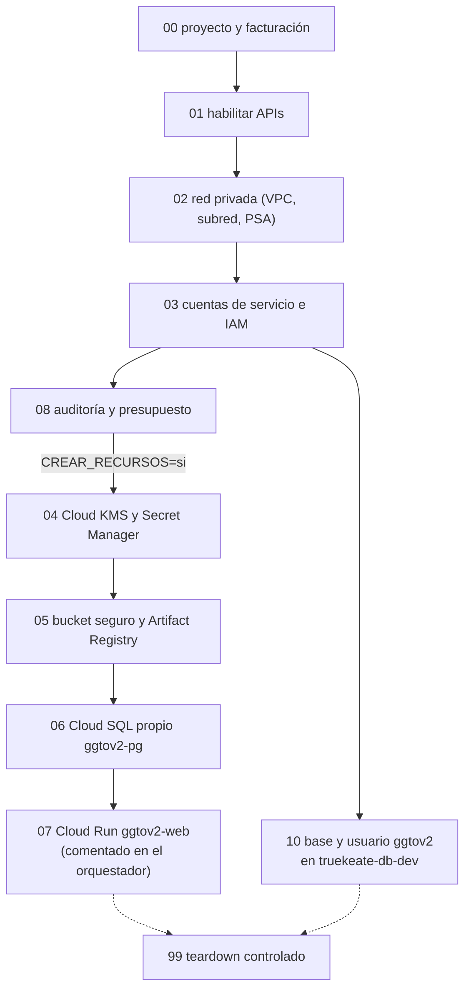

# Manual de scripts de aprovisionamiento GCP — GGTO (CANTV, Central Francisco Salias / Área 4)

> Manual para todo público. Explica, en lenguaje sencillo, los **guiones (scripts) que preparan la
> infraestructura de Google Cloud** para la plataforma GGTO: quién hace qué, en qué orden y con qué
> precauciones. Un «script» es un archivo con órdenes que la computadora ejecuta una tras otra.
> Cuando un dato no pudo comprobarse, se indica como «pendiente de confirmar». Este manual **nunca
> escribe valores de secretos**: solo los nombra.

## Empezar en 5 minutos

1. **Sepa qué son estos guiones y qué no son.** Están en la carpeta `RepoTecnico/scripts/`. Preparan
   la infraestructura en Google Cloud; **no** son la aplicación ni incluyen las variables de la
   aplicación (esas están en el manual de *Entornos y Variables*).
2. **Orden mínima de ejecución.** Primero `00` (proyecto y facturación), luego `01` (habilitar APIs),
   `02` (red privada) y `03` (cuentas de servicio). Después, si hay facturación, `04` (claves y
   secretos), `05` (depósito y registro de imágenes) y `06` (base de datos Cloud SQL).
3. **Entienda el orquestador.** `provision_all.sh` corre solo los pasos que no generan costo. Para
   incluir los que sí cuestan dinero, se ejecuta con `CREAR_RECURSOS=si ./provision_all.sh`.
4. **Recuerde lo que realmente está desplegado.** Por el bloqueo de facturación de `ggtov2`, la
   operación real usa la instancia compartida de `truekeate-main` con el guion `10`, no la instancia
   propia `ggtov2-pg` del guion `06`.
5. **Nunca borre a la ligera.** El guion `99_eliminar_todo.sh` solo funciona si se escribe
   exactamente `CONFIRM_DESTROY=ELIMINAR`; además, el depósito y las claves de cifrado deben borrarse
   a mano.

## Visión general

Los guiones son la forma reproducible de preparar la infraestructura descrita en el documento de
infraestructura del proyecto. El estado del proyecto los registra como trece archivos `.sh`, y la
auditoría confirma ese mismo conteo, aclarando que `lib_gcp.sh` es una **biblioteca** (se reutiliza)
y no un paso de aprovisionamiento. Todos están escritos en `bash`, declaran `set -euo pipefail`
(detenerse ante cualquier error) y se apoyan en la API REST de Google Cloud mediante `curl`, con
`python3` como ayudante para leer y construir JSON.

<!-- GENERAR_IMAGEN: orden-scripts-aprovisionamiento.svg -->


### La carpeta RepoTecnico/scripts

La carpeta `RepoTecnico/scripts/` contiene trece archivos:

| Archivo | Rol |
|---|---|
| `lib_gcp.sh` | Biblioteca común: token y ayudante `api` |
| `provision_all.sh` | Orquestador del aprovisionamiento completo |
| `00_crear_proyecto.sh` | Proyecto y facturación |
| `01_habilitar_apis.sh` | Habilitación de APIs |
| `02_red_privada.sh` | VPC, subred y *Private Service Access* |
| `03_iam_cuentas_servicio.sh` | Cuentas de servicio e IAM de mínimo privilegio |
| `04_secretos_kms.sh` | Cloud KMS (claves de cifrado) y Secret Manager |
| `05_storage_registry.sh` | Depósito (bucket) seguro y Artifact Registry |
| `06_cloudsql_postgres.sh` | Instancia Cloud SQL PostgreSQL |
| `07_cloudrun_web.sh` | Servicio Cloud Run |
| `08_auditoria_presupuesto.sh` | Auditoría de acceso a datos y presupuesto |
| `10_usar_instancia_truekeate.sh` | Base y usuario `ggtov2` en la instancia compartida `truekeate-db-dev` |
| `99_eliminar_todo.sh` | *Teardown* controlado (borrado ordenado) |

La tabla funcional coincide con la que mantiene el documento de entornos. El documento de referencia
de infraestructura también lista los guiones entregados.

### Convenciones (idempotencia, token gcloud, variables)

**Idempotencia.** Un guion idempotente puede ejecutarse varias veces sin duplicar ni dañar nada.
Cada guion consulta el recurso antes de crearlo y omite la creación si ya existe: `00_crear_proyecto.sh`
comprueba el proyecto con una consulta y busca `"projectId"`; `02_red_privada.sh` define una función
`existe_net` y repite el patrón para la subred y el rango PSA; `03_iam_cuentas_servicio.sh` comprueba
la cuenta de servicio antes de crearla; `04_secretos_kms.sh` no sobreescribe secretos existentes;
`05_storage_registry.sh` verifica el depósito y el repositorio; `06_cloudsql_postgres.sh` comprueba la
instancia; y `10_usar_instancia_truekeate.sh` comprueba base y usuario antes de crearlos. La conexión
de *peering* de `02_red_privada.sh` es la única operación que se ejecuta siempre con `force=true`,
porque un reintento devuelve un error benigno.

**Token de `gcloud`.** Ningún guion llama a `gcloud` para crear recursos: usan `curl` contra las API
REST. La única dependencia opcional de `gcloud` está en la función `gcp_token`. Esto permite ejecutar
los guiones incluso cuando la herramienta de línea de comandos `gcloud` no está operativa, gracias
al respaldo de credenciales de usuario y al servidor de metadatos.

**Variables.** Las variables globales tienen valores por defecto y pueden sobreescribirse por
entorno. Se definen al final de `lib_gcp.sh`: `PROJECT_ID` (por defecto `ggtov2`), `REGION` (por
defecto `europe-west1`), `BILLING_ACCOUNT` y `ORG_ID`. Las variables particulares de cada guion
(`TIER`, `HA`, `BUDGET_USD`, `IMAGE`, `CREAR_RECURSOS`, `CONFIRM_DESTROY`) se documentan en su
sección correspondiente. El manual `01-entornos-y-variables.md` de esta misma colección describe las
variables de la aplicación; aquí solo se tratan las del aprovisionamiento.

## Biblioteca común (scripts/lib_gcp.sh)

`lib_gcp.sh` se carga con `source` desde todos los guiones y aporta tres cosas: la obtención del
token, el ayudante de llamadas REST y las variables globales.

### Obtención del token (gcp_token)

La función `gcp_token` consigue un *access token* (una credencial temporal) probando cuatro fuentes
en orden estricto:

| Orden | Fuente | Condición |
|---|---|---|
| 1 | `$GOOGLE_ACCESS_TOKEN` | Si la variable está definida |
| 2 | `gcloud auth print-access-token` | Si `gcloud` existe y responde |
| 3 | Credenciales de usuario (`refresh_token`) | Si existe `~/.config/gcloud/credentials.db` |
| 4 | Servidor de metadatos de GCE | Si responde `metadata.google.internal` |

Si ninguna fuente funciona, imprime `ERROR: no se pudo obtener token` y termina con un código
distinto de cero. La tercera vía usa `sqlite3` para leer `credentials.db`, intercambia el
`refresh_token` en `https://oauth2.googleapis.com/token` y toma la cuenta indicada por
`GCP_USER_ACCOUNT`. El valor por defecto de esa variable de cuenta aparece en el propio archivo;
**no se reproduce aquí por tratarse de un identificador personal**.

### Helper api y variables globales

El ayudante `api` recibe el método, la dirección (URL) y, opcionalmente, un cuerpo JSON. Cuando hay
cuerpo, envía `curl -s -X "$method"` con las cabeceras `Authorization: Bearer` y
`Content-Type: application/json`; cuando no lo hay, omite el cuerpo. Todos los guiones construyen las
direcciones con `$PROJECT_ID`, `$REGION`, `$BILLING_ACCOUNT` u `$ORG_ID`, y procesan la respuesta con
`python3 -c` para extraer campos o detectar `"error"`. Las variables globales se fijan con el patrón
`${VARIABLE:-valor}`, de modo que el operador puede apuntar a otro proyecto o región sin editar el
archivo.

## Orquestador (scripts/provision_all.sh) y variable CREAR_RECURSOS

`provision_all.sh` ejecuta el aprovisionamiento en orden y separa los pasos **no facturables** de los
**facturables**. Primero se sitúa en su propio directorio con `cd "$(dirname "$0")"`, de forma que las
llamadas relativas `./00_...` funcionan desde cualquier directorio de invocación.

| Ejecución | Pasos que corre | Efecto |
|---|---|---|
| `./provision_all.sh` | `00`, `01`, `02`, `03`, `08` | No genera costo |
| `CREAR_RECURSOS=si ./provision_all.sh` | Los anteriores + `04`, `05`, `06` | Genera costo recurrente |

El bloque condicional comprueba `[[ "${CREAR_RECURSOS:-no}" == "si" ]]` y, si no se activa, imprime
que los recursos facturables quedan omitidos y recomienda ejecutarlo cuando la facturación esté
activa. El paso `07_cloudrun_web.sh` está **comentado** en el orquestador, con la nota de que debe
descomentarse cuando exista una imagen en Artifact Registry. Esto explica por qué el despliegue de
Cloud Run se hace por separado en la práctica.

## Script por script

Cada subsección describe el guion, los recursos que crea, las variables que consume y las notas
operativas verificadas.

### 00_crear_proyecto.sh

Crea el proyecto `GGTOv2` dentro de la organización y vincula la cuenta de facturación. Variables que
usa: `$PROJECT_ID`, `$ORG_ID` y `$BILLING_ACCOUNT`.

- **Consulta previa:** hace `GET .../v1/projects/$PROJECT_ID`; si la respuesta contiene
  `"projectId"`, informa que el proyecto ya existe con su número y su estado.
- **Creación:** hace `POST .../v1/projects` con `name: "GGTOv2"` y `parent` de tipo `organization`.
- **Espera:** sondea la operación hasta 30 veces, con pausas de 6 segundos, hasta ver `"done": true`.
- **Facturación:** hace `PUT .../billingInfo` con `billingAccounts/$BILLING_ACCOUNT` y luego un `GET`
  para imprimir `billingEnabled`.
- **Nota:** advierte que el mensaje `Cloud billing quota exceeded` significa que la cuenta alcanzó el
  máximo de cinco proyectos. Ese cupo agotado es exactamente el bloqueo que obligó a usar
  `truekeate-main`.

### 01_habilitar_apis.sh

Habilita las APIs de Google Cloud que requiere la plataforma. Primero obtiene el número de proyecto
(`projectNumber`) y luego recorre dos listas:

| Grupo | APIs | Facturación |
|---|---|---|
| `SIN_BILLING` | `cloudresourcemanager`, `serviceusage`, `iam`, `iamcredentials`, `cloudbilling`, `sqladmin`, `sql-component`, `servicenetworking`, `storage`, `logging`, `monitoring`, `networkconnectivity`, `cloudkms`, `cloudtrace`, `cloudprofiler`, `clouderrorreporting`, `servicecontrol` | No requiere |
| `CON_BILLING` | `compute`, `vpcaccess`, `secretmanager`, `dlp`, `run`, `artifactregistry`, `cloudbuild`, `containerregistry`, `certificatemanager`, `billingbudgets` | Requiere |

Para cada servicio hace `POST .../services/$s:enable` e imprime `OK` o `PENDIENTE` según la
respuesta. Cierra recordando que las APIs marcadas `PENDIENTE` requieren vincular facturación.

### 02_red_privada.sh

Crea la red privada dedicada: la VPC (red virtual), la subred y el rango de *Private Service Access*
para Cloud SQL. Variables locales: `VPC=ggtov2-vpc`, `SUBNET=ggtov2-subnet`,
`PSA_RANGE=ggtov2-psa-range` y `PSA_PREFIX=20`.

| Recurso | Configuración |
|---|---|
| VPC `ggtov2-vpc` | `autoCreateSubnetworks:false`, enrutamiento `GLOBAL` |
| Subred `ggtov2-subnet` | `10.10.0.0/24`, con `privateIpGoogleAccess:true` |
| Rango PSA | `INTERNAL`, `VPC_PEERING`, prefijo `/20` |
| Conexión de *peering* | `servicenetworking` con `force=true` |

Cierra indicando que Cloud SQL usará IP privada dentro de la VPC. Es la base de red que consumiría
`06_cloudsql_postgres.sh`.

### 03_iam_cuentas_servicio.sh

Crea dos cuentas de servicio y aplica enlaces IAM de mínimo privilegio (es decir, solo los permisos
necesarios). Las cuentas son `ggtov2-app` (ejecución de Cloud Run) y `ggtov2-deploy` (CI/CD).

| Cuenta | Roles asignados |
|---|---|
| `ggtov2-app` | `cloudsql.client`, `secretmanager.secretAccessor`, `logging.logWriter`, `monitoring.metricWriter`, `cloudtrace.agent`, `cloudprofiler.agent`, `serviceusage.serviceUsageConsumer`, `cloudkms.cryptoKeyDecrypter` |
| `ggtov2-deploy` | `run.admin`, `artifactregistry.writer`, `iam.serviceAccountUser`, `cloudbuild.builds.editor`, `storage.objectAdmin`, `cloudsql.client` |

La aplicación de los enlaces es idempotente: obtiene la política con `getIamPolicy`, añade el miembro
solo si no está presente con una función `add` y la vuelve a fijar con `setIamPolicy`.

### 04_secretos_kms.sh

Crea el llavero y las claves de Cloud KMS (CMEK, claves de cifrado gestionadas por el cliente) y los
secretos de la plataforma. Variables: `KR=ggtov2`, `KEY_SEC=ggtov2-secrets`, `KEY_STO=ggtov2-storage`.

- **Rotación:** las claves se crean con propósito `ENCRYPT_DECRYPT` y una `rotationPeriod` de
  `7776000s`, es decir, 90 días.
- **Generación de valores:** la función `gcp_gen` produce una cadena aleatoria de 32 caracteres con
  `openssl rand`; los valores **no se imprimen**.
- **Secretos creados:** `ggtov2-db-password`, `ggtov2-db-root-password`, `ggtov2-app-secret-key` y
  `ggtov2-django-secret-key`. El cuarto conserva un nombre heredado de Django; su uso real en el
  código actual está **pendiente de confirmar**.
- **CMEK:** cada secreto usa replicación `userManaged` en la región con `customerManagedEncryption`.
- **Permisos:** concede `roles/secretmanager.secretAccessor` a `ggtov2-app` sobre
  `ggtov2-db-password`, `ggtov2-app-secret-key` y `ggtov2-django-secret-key`.

### 05_storage_registry.sh

Crea el depósito seguro de evidencias y el repositorio de imágenes. El nombre del depósito es
`ggtov2-assets-<projectNumber>` y la clave CMEK es `ggtov2-storage`.

| Ajuste del depósito | Valor |
|---|---|
| Ubicación y clase | `EUROPE-WEST1`, `STANDARD` |
| Clave por defecto | `ggtov2-storage` (CMEK) |
| Acceso | `uniformBucketLevelAccess` y `publicAccessPrevention: enforced` |
| Versionado | `enabled: true` |
| Ciclo de vida | Borra las versiones no vigentes a los 365 días |
| Retención | 30 días (`2592000` segundos), sin bloquear |

El repositorio `ggtov2-web` de Artifact Registry se crea con formato `DOCKER` y etiqueta
`proyecto=ggtov2`.

### 06_cloudsql_postgres.sh

Crea la instancia Cloud SQL propia `ggtov2-pg` con IP privada, SSL y respaldos. Variables:
`INSTANCE=ggtov2-pg`, `DB_NAME=ggtov2`, `DB_USER=ggtov2_app`, `TIER` (por defecto `db-f1-micro`) y
`HA` (por defecto `ZONAL`). El perfil por defecto es de desarrollo y el propio encabezado advierte
cambiarlo para producción.

| Ajuste | Valor |
|---|---|
| Motor | `POSTGRES_16` |
| Disco | `PD_SSD`, 10 GB, autoescalado hasta 50 GB |
| Respaldos | Activados, PITR 7 días, inicio 03:00 |
| Red | `ipv4Enabled:false`, red `ggtov2-vpc`, `sslMode: ENCRYPTED_ONLY` |
| Protección | `deletionProtectionEnabled:true` |
| Contraseñas | Mínimo 12 caracteres, complejidad por defecto, sin reutilizar en 5 |
| Banderas | `cloudsql.iam_authentication=on`, `log_min_duration_statement=500`, `log_connections=on` |
| Mantenimiento | Domingo a las 03:00, pista `stable` |

La contraseña de la base y la de `root` se leen de Secret Manager. Tras crear la instancia (con
sondeo de hasta 60 iteraciones de 15 segundos), crea la base `ggtov2` con `charset UTF8` y el usuario
`ggtov2_app` con host `%`. Cierra mostrando la forma de la cadena de conexión, sin revelar la
contraseña.

> **Nota de fidelidad:** lo realmente desplegado **no** es esta instancia, sino la base `ggtov2`
> dentro de la instancia compartida `truekeate-db-dev` (PostgreSQL 15.18). Este guion es el camino
> previsto al desbloquear la facturación.

### 07_cloudrun_web.sh

Despliega la plataforma en Cloud Run con salida VPC directa. Variables: `SERVICE=ggtov2-web` e
`IMAGE` (por defecto `$REGION-docker.pkg.dev/$PROJECT_ID/ggtov2-web/app:latest`).

El cuerpo del servicio define: puerto `8080`; variables `DB_USER`, `DB_NAME`, `DB_HOST` con el socket
`/cloudsql/<proyecto>:<región>:ggtov2-pg` y `SECRET_KEY` desde el secreto `ggtov2-app-secret-key`;
límites de 1 CPU y 512 MiB; acceso VPC por `ggtov2-vpc`/`ggtov2-subnet`; escalado de 0 a 10
instancias y un `timeout` de 300 segundos. Después de crear el servicio, aplica un enlace IAM que
concede `roles/run.invoker` a `allUsers`.

> **Riesgo documentado:** ese enlace hace el servicio **público**. El estado del proyecto pide
> restringir el acceso porque el servicio ya contiene PII real. En el despliegue real la URL pública
> también quedó expuesta.

### 08_auditoria_presupuesto.sh

Activa la auditoría de acceso a datos y crea el presupuesto con alertas.

- **Auditoría:** construye `auditConfigs` para `secretmanager`, `cloudkms`, `cloudsql` y `storage`
  con los tipos `ADMIN_READ`, `DATA_READ` y/o `DATA_WRITE`, y los fija con `setIamPolicy`. Si la
  respuesta no trae `auditConfigs`, avisa que no se persistió.
- **Presupuesto:** hace `POST .../billingAccounts/$BILLING_ACCOUNT/budgets` con el nombre
  `GGTOv2 mensual`, un importe de `${BUDGET_USD:-50}` USD y umbrales al 50 %, 90 % y 100 %. La
  variable del importe es `BUDGET_USD`.

### 10_usar_instancia_truekeate.sh

Es el guion que permitió operar **sin** facturación propia. Da de alta una base y un usuario
dedicados a GGTO dentro de la instancia Cloud SQL existente en `truekeate-main`, y habilita el
acceso de la ejecución.

| Dato | Valor |
|---|---|
| Proyecto origen | `truekeate-main` |
| Instancia | `truekeate-db-dev` |
| Base / usuario | `ggtov2` / `ggtov2_app` |
| `connectionName` | `truekeate-main:southamerica-east1:truekeate-db-dev` |
| Cuenta de servicio de la app | `ggtov2-app@ggtov2.iam.gserviceaccount.com` |
| Cuenta de servicio de TrueKeate | `truekeate-app-sa@truekeate-main.iam.gserviceaccount.com` |

Pasos: genera una contraseña aleatoria de 32 caracteres sin imprimirla; crea o versiona los secretos
`ggtov2-db-password` y `ggtov2-db-connection` en `truekeate-main`; concede
`secretmanager.secretAccessor` sobre ambos a las dos cuentas de servicio; crea la base y el usuario
solo si no existen, sin cambiar la contraseña del usuario ya creado; y añade `roles/cloudsql.client`
para la cuenta de servicio de GGTO en la política de `truekeate-main`. El resumen final indica que la
contraseña vive solo en Secret Manager y muestra la ruta del socket para Cloud Run.

### 99_eliminar_todo.sh

*Teardown* controlado (borrado ordenado) de los recursos de GGTO. Antes de tocar nada exige
`CONFIRM_DESTROY=ELIMINAR`; si no coincide, aborta con un mensaje. El orden de borrado es: desactivar
`deletionProtectionEnabled` de la instancia y borrarla, borrar el servicio Cloud Run `ggtov2-web`,
el repositorio `ggtov2-web`, la VPC y los cuatro secretos. El cierre advierte que **el depósito y las
claves KMS deben borrarse manualmente** por su política de retención.

## Scripts auxiliares del proyecto

Además de los guiones de infraestructura, el repositorio incluye utilidades de operación y de
pruebas. No forman parte de `provision_all.sh` y se ejecutan de forma explícita.

### scripts/inyectar_super_usuario.py

Inyecta el **Super Usuario** de la plataforma con rol `SUPER`. Es idempotente: si el `P00` ya existe,
actualiza sus datos y su clave. Sus garantías de seguridad son relevantes para la operación:

- La clave **no** se escribe en el archivo ni en la línea de comandos: se lee de la variable de
  entorno indicada por `--clave-env` (por defecto `GGTO_SUPER_CLAVE`) o se pide de forma oculta.
- Exige confirmación interactiva salvo que se use `--si`, y exige un mínimo de 8 caracteres.
- Registra cada ejecución en `RepoTecnico/BaseOperaciones/inyeccion_super_usuario.log`.
- Reutiliza el mismo *hash* y el mismo diccionario de palabras que la aplicación.
- Opcionalmente genera y guarda las **12 palabras de seguridad** en `dispositivo_seguridad` y las
  muestra una sola vez.

Parámetros principales: `--p00`, `--correo`, `--nombre`, `--apellido`, `--rol`, `--id-central`,
`--con-palabras`, `--dry-run` y `--si`. Las credenciales de base se toman de `DB_HOST`, `DB_PORT`,
`DB_NAME`, `DB_USER`, `DB_PASSWORD` y `DB_SSLMODE`, o bien del parámetro `--dsn`.

### scripts/recalcular_cuadrilla0.py

Recalcula la marca de **cuadrilla 0** (el campo `caso.en_gestion_supervisor`) de los casos existentes,
usando la configuración vigente. Sirve para aplicar un cambio de criterio sin volver a ingerir el
archivo CSV.

- Por defecto es **simulación**: informa qué cambiaría sin escribir nada. Para escribir hay que pasar
  `--aplicar` y confirmar (o usar `--si`).
- Lee las claves `despacho.criterio_cuadrilla0`, `despacho.frases_campo`,
  `despacho.frases_supervisor` y `despacho.columnas_evaluar` de la tabla `configuracion`, y evalúa
  con la función `app.services.cuadrilla0.evaluar`.
- Limita a 20 los cambios impresos y resume el resto.
- Registra la ejecución en `RepoTecnico/BaseOperaciones/recalculo_cuadrilla0.log`.

Su uso real está documentado en la decisión **D-59**: se recalcularon los 42 casos reales pasando
`despacho.criterio_cuadrilla0` a `SUPERVISOR`.

### RepoTecnico/pruebas/run_e2e.sh

Orquesta las pruebas E2E de navegador contra un esquema aislado. El manual `04-pruebas-y-ci.md` de
esta colección lo detalla en profundidad; aquí se resume su relación con el aprovisionamiento:
reutiliza la base compartida a través del **Cloud SQL Auth Proxy** en `127.0.0.1:5433`, levanta
`uvicorn app.main:app` en `http://127.0.0.1:8090` y usa `DB_SCHEMA=ggto_e2e`. Exporta
`LD_LIBRARY_PATH` y `FONTCONFIG_FILE` para Chromium, y termina el *backend* con un `trap`/`kill` al
salir.

### RepoTecnico/pruebas/seed_e2e.py

Siembra los datos deterministas de las pruebas E2E. Crea o reinicia el esquema aislado (por defecto
`ggto_e2e`) a partir de `RepoTecnico/db/schema.sql`, y siembra los usuarios `E2EADM`, `E2ESUP` y
`E2ETEC`, el sector `E2E-S1`, la cuadrilla `E2E-C1` y **8 casos** `E2E-…`. Aborta si el esquema es
`public`, para no tocar producción. En su ejecución real genera `RepoTecnico/pruebas/logs/seed.json`.

## Teardown y confirmación (CONFIRM_DESTROY=ELIMINAR)

El borrado de recursos es destructivo e irreversible, y el diseño lo protege con una confirmación
explícita. `99_eliminar_todo.sh` compara `CONFIRM_DESTROY` con la cadena literal `ELIMINAR` y aborta
si no coincide. Para ejecutarlo:

```bash
cd RepoTecnico/scripts
CONFIRM_DESTROY=ELIMINAR ./99_eliminar_todo.sh
```

Puntos que conviene tener presentes antes de usarlo:

- El guion apunta a `$PROJECT_ID`, que por defecto es `ggtov2`. **No** borra la base `ggtov2` ni el
  usuario `ggtov2_app` de la instancia `truekeate-db-dev`, ni los secretos creados en
  `truekeate-main` por `10_usar_instancia_truekeate.sh`. Ese borrado está **pendiente de confirmar**
  como procedimiento documentado y debe hacerse de forma manual y coordinada con TrueKeate.
- Los borrados de la instancia, el servicio, el repositorio, la VPC y los secretos usan
  `>/dev/null 2>&1 || true`, de modo que un recurso inexistente no aborta el *teardown*.
- El depósito y las claves KMS **no** se borran automáticamente por su política de retención.
- El servicio Cloud Run realmente desplegado se llama `ggto-web` en `truekeate-main`, mientras que el
  guion intenta borrar `ggtov2-web` en `$PROJECT_ID`; por tanto, el `ggto-web` real **no** queda
  cubierto por este guion.

## Diferencia entre lo previsto (ggtov2) y lo realmente desplegado (truekeate-main)

La infraestructura prevista y la realmente operativa divergen por un bloqueo administrativo, no por
un cambio de diseño. La cuenta de facturación tiene agotado el cupo de cinco proyectos, de modo que
`ggtov2` quedó sin facturación y sin APIs de despliegue. Para no detener el proyecto, se reutilizó la
instancia Cloud SQL de `truekeate-main`.

| Aspecto | Previsto (`ggtov2`) | Real (`truekeate-main`) |
|---|---|---|
| Proyecto | `ggtov2` | `truekeate-main` |
| Servicio Cloud Run | `ggtov2-web` | `ggto-web` |
| Imagen | `.../ggtov2/ggtov2-web/app:latest` | `southamerica-east1-docker.pkg.dev/truekeate-main/truekeate-repo/ggto-web:v14` |
| Instancia de datos | `ggtov2-pg` (PostgreSQL 16, privada) | `truekeate-db-dev` (PostgreSQL 15.18, compartida) |
| Base / usuario | `ggtov2` / `ggtov2_app` | `ggtov2` / `ggtov2_app` (mismos nombres) |
| Buena parte de 04, 05 y 06 | Ejecutables con `CREAR_RECURSOS=si` | **No ejecutados** por falta de facturación |
| Cuenta de servicio de ejecución | `ggtov2-app@ggtov2…` | `ggto-web-sa@truekeate-main…` |

Consecuencias operativas verificadas:

- La base propia no se creó: por eso existe `10_usar_instancia_truekeate.sh`, que da base, usuario,
  secretos y permiso cruzado dentro de `truekeate-main`.
- La instancia compartida **no** tiene los respaldos, el PITR ni el SSL obligatorio que sí definiría
  `06_cloudsql_postgres.sh`; ese riesgo quedó aceptado como **D-26** hasta migrar.
- El paso `07_cloudrun_web.sh` no se ejecutó en `ggtov2`; el despliegue real usa el proyecto
  `truekeate-main` con una cuenta de servicio distinta.
- La ruta de convergencia está definida: al desbloquear la facturación, migrar el servicio a
  `ggtov2` con `07_cloudrun_web.sh` y su propio Cloud SQL `ggtov2-pg`.
- El importe y la fecha exactos para esa migración están **pendientes de confirmar**; el estado del
  proyecto solo registra «desbloquear la facturación GCP y migrar».
