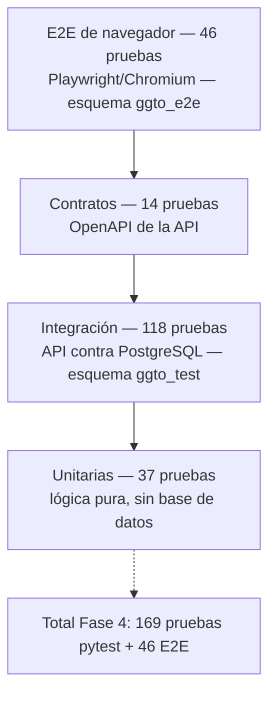

# Manual de pruebas y CI — GGTO (CANTV, Central Francisco Salias / Área 4)

> Manual para todo público. Explica, en lenguaje sencillo, **cómo se comprueba que la plataforma
> GGTO funciona bien antes de entregarla**: qué tipos de prueba existen, en qué entornos aislados
> corren, cuántas pruebas se ejecutaron, qué revisores automáticos de calidad se usan y cómo funciona
> la integración continua (CI, la revisión automática en cada cambio de código). Cuando algo no está
> implementado, se dice con claridad. Este manual **nunca escribe valores de credenciales**: solo las
> menciona.

## Empezar en 5 minutos

1. **Entienda la idea general.** Hay cuatro niveles de prueba que se complementan: unitarias (lógica
   suelta), integración (API contra la base), contratos (que la API publicada sea coherente) y E2E
   (recorridos en un navegador real).
2. **Recuerde la regla de oro.** **Ninguna prueba toca producción.** Los datos de prueba viven en
   esquemas aislados: `ggto_test` para `pytest` y `ggto_e2e` para Playwright/Chromium.
3. **Conozca el resultado de la Fase 4.** Cerró con **169 de 169** pruebas `pytest` en verde y
   **46 de 46** pruebas E2E en verde. Además, los tres revisores de calidad (`ruff`, `mypy` y
   `tsc` en modo estricto) no dejaron hallazgos.
4. **Sepa qué corre solo.** En cada `push` o `pull_request` sobre las ramas `GGTOv2-DSH-GCP` y
   `main`, GitHub Actions levanta un PostgreSQL 15 y ejecuta `ruff`, `mypy` y `pytest`.
5. **Sepa qué falta.** La cobertura mínima de 70 %, las migraciones con Alembic, la construcción de
   la imagen y el despliegue automático, el espejo en GitLab CI y el análisis del frontend (`tsc`)
   **no** están automatizados todavía.

## Estrategia de pruebas

La Fase 4 se planificó con el objetivo de validar el sistema entregado en la Fase 3 con **100 % de
pruebas en verde**. La estrategia se apoya en cuatro niveles complementarios y en un principio
rector: **ninguna prueba toca producción**, sino esquemas aislados.

<!-- GENERAR_IMAGEN: piramide-pruebas.svg -->


### Los cuatro niveles de prueba

El plan de pruebas enumera los niveles con su alcance:

#### Unitarias

Prueban lógica pura, sin base de datos: la construcción de la dirección de conexión, el reintento
progresivo (*backoff*) y las palabras de seguridad. No dependen de PostgreSQL y por eso siguen
corriendo aunque no haya base disponible.

#### Integración

Ejercitan la API contra PostgreSQL, con el esquema recreado desde `RepoTecnico/db/schema.sql` en el
esquema `ggto_test`. El esquema lo levanta el archivo `conftest.py` de la batería de pruebas.

#### Contratos

Verifican que el contrato OpenAPI publicado (79 endpoints desde el ciclo D-67) sea coherente, esté versionado, esté
documentado y proteja las rutas privadas. La prueba construye el esquema con `app.openapi()` y
comprueba, entre otras cosas, que todas las rutas `/api/` estén bajo `/api/v1/`.

#### E2E de navegador

Recorren los flujos reales de la SPA (aplicación de una sola página) con Playwright/Chromium contra
la aplicación completa y el esquema `ggto_e2e`.

Quedan **fuera de alcance** las pruebas de carga, las pruebas de penetración (seguridad ofensiva) y
la aplicación móvil Flutter (Ciclo 8, no desarrollado).

## Entornos de prueba

La batería distingue el esquema de `pytest` del esquema de Playwright y comparte una única vía de
acceso a la base mediante el proxy de Cloud SQL.

### ggto_test (pytest)

Es el esquema que usa la integración y los contratos. Su nombre se toma de la variable
`GGTO_TEST_SCHEMA`, con valor por defecto `public`. Con el valor de trabajo `ggto_test`, el archivo
`conftest.py` añade el `search_path` para que `public` siga resolviendo las extensiones `pgcrypto` y
`pg_trgm`. Si el esquema no es `public`, lo crea con `CREATE SCHEMA IF NOT EXISTS` antes de aplicar
`schema.sql`. La lógica del `search_path` proviene del parámetro `DB_SCHEMA` de la aplicación,
corregido durante la Fase 4 (hallazgo **F4-01**).

### ggto_e2e (Playwright)

Es el esquema aislado de las pruebas de navegador. El guion `run_e2e.sh` lo fija con
`ESQUEMA="${DB_SCHEMA:-ggto_e2e}"` y lo exporta como `DB_SCHEMA`. El guion `seed_e2e.py` lo reinicia
y siembra los datos desde `schema.sql`. La aplicación bajo prueba se levanta con ese esquema y la
dirección `http://127.0.0.1:8090`.

### Cloud SQL Auth Proxy

Ambos entornos usan la instancia compartida `truekeate-db-dev` a través del **Cloud SQL Auth Proxy**,
un programa que abre un canal seguro desde la máquina local hacia la base gestionada. El plan de
pruebas lo describe escuchando en `127.0.0.1:5433` y da el comando de arranque. El guion
`run_e2e.sh` usa ese puerto por defecto y comprueba la conectividad con `psql`. El proxy es
necesario porque la aplicación se ejecuta en local y la instancia es gestionada por Google. El
manual `02-cloud-run-y-cloud-sql.md` de esta colección detalla la conexión.

### Chromium y LD_LIBRARY_PATH/FONTCONFIG_FILE

Chromium en modo *headless* (sin ventana visible) exige librerías del sistema y fuentes tipográficas.
El guion `run_e2e.sh` exporta `LD_LIBRARY_PATH` con `~/tools/libs` y `/tmp/playwright-libs`, y
`FONTCONFIG_FILE` con la configuración de fuentes del usuario. El plan advierte que, sin fuentes,
«el navegador no emite eventos de texto y los encabezados quedan con tamaño cero (falsos
negativos)». El hallazgo **F4-04** documenta el mismo problema y su mitigación. El comentario del
archivo `helpers.js` repite la advertencia.

## Pruebas backend

La batería de backend reúne pruebas unitarias, de integración y de contratos bajo el mismo `pytest`.

### Estructura de app/tests

El directorio `app/tests/` contiene el paquete (`__init__.py`), el archivo `conftest.py` y trece
archivos `test_*.py`. Los niveles se distinguen por lo que cada archivo necesita:

| Archivo | Nivel | ¿Depende de la base? |
|---|---|---|
| `test_security.py` | Unitaria | No |
| `test_config_db.py` | Unitaria | No |
| `test_sectorizacion_cuadrilla0.py` | Unitaria | No |
| `test_ingesta_parser.py` | Unitaria | No |
| `test_contratos.py` | Contratos | No (usa `app.openapi()`) |
| `test_auth.py` | Integración | Sí |
| `test_config.py` | Integración | Sí |
| `test_casos_api.py` | Integración | Sí |
| `test_despacho_api.py` | Integración | Sí |
| `test_especiales_api.py` | Integración | Sí |
| `test_monitoreo_api.py` | Integración | Sí |
| `test_alertas_api.py` | Integración | Sí |
| `test_ingesta_api.py` | Integración | Sí |

### conftest.py

El archivo `app/tests/conftest.py` concentra la preparación del entorno de pruebas:

- **Dirección y esquema de prueba:** lee `GGTO_TEST_DB_URL` y `GGTO_TEST_SCHEMA`. Si no hay dirección,
  las pruebas de integración se omiten con `pytest.skip` y las unitarias continúan.
- **Recreación del esquema:** la *fixture* de sesión `engine` aplica `RepoTecnico/db/schema.sql`
  sobre la base. Una *fixture* es un bloque de preparación que `pytest` ejecuta automáticamente
  antes de las pruebas.
- **Aislamiento del limitador:** una *fixture* `autouse` limpia el contador de intentos de inicio de
  sesión antes y después de cada prueba, para que el limitador de RNF-22 no contamine la batería.
- **Cliente HTTP:** la *fixture* `client` sustituye `get_db` por una fábrica de sesiones y envuelve
  la aplicación en `TestClient`.
- **Usuarios de prueba:** `TESTADM`, `TESTTEC` y `TESTSUP`, con una clave sintética definida en el
  propio `conftest.py`, creados por la *fixture* `admin_token`, que además devuelve las cabeceras
  `Bearer` de cada rol. El valor de la clave no se reproduce aquí por ser una credencial.
- **Limpieza:** el guion `SQL_LIMPIEZA` borra los registros de prueba en orden de claves foráneas. La
  muestra de ingesta pseudonimizada está en
  `RepoTecnico/muestras/detalle_averias_gpon_EJEMPLO.csv`.

### Inventario por archivo

El informe de la Fase 4 desglosa las **169** pruebas ejecutadas:

| Archivo | Pruebas | Nivel |
|---|---|---|
| `test_alertas_api.py` | 23 | Integración |
| `test_despacho_api.py` | 17 | Integración |
| `test_casos_api.py` | 17 | Integración |
| `test_sectorizacion_cuadrilla0.py` | 16 | Unitaria |
| `test_monitoreo_api.py` | 16 | Integración |
| `test_especiales_api.py` | 15 | Integración |
| `test_contratos.py` | 14 | Contratos |
| `test_config.py` | 13 | Integración |
| `test_ingesta_parser.py` | 12 | Unitaria |
| `test_auth.py` | 11 | Integración |
| `test_security.py` | 6 | Unitaria |
| `test_ingesta_api.py` | 6 | Integración |
| `test_config_db.py` | 3 | Unitaria |
| **Total** | **169** | — |

Algunos archivos declaran menos funciones que pruebas ejecutadas porque usan parametrización de
`pytest`: `test_sectorizacion_cuadrilla0.py` emplea `@pytest.mark.parametrize` y
`test_monitoreo_api.py` parametriza los periodos `diario`, `semanal` y `mensual`. Por eso el número
de casos ejecutados (169) coincide con el informe aunque el conteo de funciones `def test_` sea
menor.

### Cómo ejecutarlas

El plan describe el procedimiento. El modo directo es:

```bash
# Proxy (una vez)
~/tools/cloud-sql-proxy --gcloud-auth --port 5433 \
  truekeate-main:southamerica-east1:truekeate-db-dev &

# Integración + contratos
export GGTO_TEST_DB_URL="postgresql+psycopg2://ggtov2_app:<clave>@127.0.0.1:5433/ggtov2"
export GGTO_TEST_SCHEMA=ggto_test
python3 -m pytest app/tests -q
```

La cadena `<clave>` se obtiene del secreto `ggtov2-db-password`; **no se escribe en este manual**.
Sin `GGTO_TEST_DB_URL`, las pruebas de integración se omiten y las unitarias siguen corriendo.

## Pruebas E2E

Las pruebas E2E validan la SPA completa en un navegador real contra un *backend* local.

### RepoTecnico/pruebas/e2e

El directorio `RepoTecnico/pruebas/e2e/` contiene el proyecto de Playwright: `package.json`,
`playwright.config.js`, `helpers.js`, `inventario.js` (utilidad de inspección) y la carpeta `tests/`
con once archivos `.spec.js`. La configuración fija `testDir: ./tests`, un `timeout` de 90 segundos,
`expect` de 20 segundos, `workers: 1`, `fullyParallel: false` y `retries: 0`, con `baseURL` tomada de
`GGTO_E2E_URL`. El proyecto es solo `chromium`, en modo `headless`, con *viewport* de 1440×900,
idioma `es-VE` y zona horaria `America/Caracas`. Genera reporte de lista, JSON en
`../logs/e2e-resultados.json` y HTML en `../logs/e2e-reporte`. La versión declarada de
`@playwright/test` es `1.63.0`.

### 11 archivos y 46 pruebas

El informe desglosa los once archivos y sus 46 pruebas:

| Archivo | Pruebas | Ámbito |
|---|---|---|
| `01-login.spec.js` | 6 | Login válido e inválido, ruta protegida, cierre de sesión, menú de usuario |
| `02-navegacion.spec.js` | 7 | Secciones, menú CONFIGURACIÓN, permisos de menú por rol, barra móvil, buscador |
| `03-casos.spec.js` | 6 | Listado, filtros, búsqueda global, ficha, alta manual `REF-…` |
| `04-especiales.spec.js` | 2 | Alta de caso especial y filtros |
| `05-agenda.spec.js` | 5 | Vistas de día, semana y mes, navegación, alta de cita |
| `06-despacho.spec.js` | 3 | Propuesta, generación, falla masiva manual |
| `07-ingesta.spec.js` | 2 | Previsualización del CSV e historial de lotes |
| `08-monitoreo.spec.js` | 3 | Zonas del tablero, gráficos SVG, reporte de trabajo |
| `09-alertas.spec.js` | 4 | Métricas, RF-09, RF-17, RF-18, bandeja de salida |
| `10-configuracion.spec.js` | 4 | Alta de sector, técnico, causa y parámetros |
| `11-rbac.spec.js` | 4 | TECNICO solo lectura y ADMIN operativo |
| **Total** | **46** | — |

La utilidad `helpers.js` centraliza el inicio y cierre de sesión, el relleno de campos y la búsqueda
global; los usuarios de prueba son `E2EADM` (ADMIN), `E2ESUP` (SUPERVISOR) y `E2ETEC` (TECNICO).
El archivo `inventario.js` no es una prueba, sino un recorrido de rutas que vuelca encabezados,
botones y tablas para inspección manual.

### run_e2e.sh

El guion `run_e2e.sh` encadena comprobación de base, siembra, arranque de la aplicación y Playwright:

1. **Variables y puertos:** `GGTO_E2E_PORT` (por defecto `8090`), `DB_HOST` `127.0.0.1`, `DB_PORT`
   `5433`, `DB_NAME` `ggtov2`, `DB_USER` `ggtov2_app` y `DB_SSLMODE` `disable`.
2. **Limitador relajado:** eleva `RATE_LIMIT_INTENTOS` a 10 000 para no recibir respuestas `429` por
   inicios de sesión repetidos, y fija `SECRET_KEY=e2e-secret-key`. El hallazgo **F4-05** documenta
   este ajuste.
3. **Comprobación de PostgreSQL:** usa `psql` y exige `DB_PASSWORD`.
4. **Siembra:** ejecuta `seed_e2e.py` y guarda la salida en `logs/seed.json`.
5. **Arranque:** levanta `uvicorn app.main:app` en segundo plano y espera a `/health`.
6. **Ejecución:** lanza `npx playwright test "$@"` desde el directorio E2E.
7. **Limpieza:** termina el *backend* y propaga el código de salida de Playwright.

Permite ejecutar un solo archivo pasando la ruta como argumento.

### seed_e2e.py

El guion `seed_e2e.py` prepara el esquema y los datos deterministas. Crea el esquema y vacía sus
tablas con `RESTART IDENTITY CASCADE` si ya existen, y luego aplica `schema.sql`. Siembra:

- Tres usuarios con su ficha de técnico: `E2EADM` (ADMIN), `E2ESUP` (SUPERVISOR) y `E2ETEC`
  (TECNICO), con una clave sintética común definida en el propio guion. El valor no se reproduce aquí
  por ser una credencial.
- El sector `E2E-S1` con el patrón `CALLE E2E`.
- La flota `E2ECAN01` y la cuadrilla `E2E-C1` con el técnico `E2ETEC`.
- La causa `E2E`/`01`.
- **Ocho casos** `E2E-0001`…`E2E-0008`, seis de ellos concentrados en `e2e-olt-00` para disparar la
  detección de fallas con umbral 5.

El resumen que imprime incluye esquema, central, usuarios, sector, cuadrilla y número de casos; la
ejecución real dejó ese resumen en `RepoTecnico/pruebas/logs/seed.json`. El guion **aborta** si
`DB_SCHEMA` es `public` o está vacío, para no tocar producción.

## Calidad estática

Además de las pruebas, la Fase 4 exige `ruff`, `mypy` y `tsc` en modo estricto sin hallazgos. Estos
programas no ejecutan la aplicación: leen el código y avisan de errores de estilo, de tipos o de
construcción.

### ruff

La configuración vive en `pyproject.toml`: longitud de línea 110, objetivo `py312`, exclusión de
`app/web` y selección de reglas `E`, `F`, `I`, `B`, `UP`, `RUF`, con `B008` ignorada porque FastAPI
usa `Depends(...)` como valor por defecto. El comando de CI es `ruff check app`.

### mypy

La configuración declara `python_version = "3.12"`, `ignore_missing_imports = true`,
`warn_unused_ignores = true` y excluye `app/web/`. El comando de CI es
`mypy app --ignore-missing-imports`.

### tsc strict

El frontend se compila con TypeScript estricto: `strict: true` y `noFallthroughCasesInSwitch: true`
en `app/web/tsconfig.json`, y el guion de construcción es `tsc && vite build`. El informe registra
`tsc` estricto sin hallazgos. **Pendiente de confirmar** si `tsc` se ejecuta en algún flujo
automatizado: el único flujo del repositorio solo corre el trabajo de backend.

## Resultado Fase 4

La Fase 4 cerró con 215 pruebas en verde (169 de `pytest` más 46 E2E) y los tres analizadores
estáticos sin hallazgos.

### 169/169 pytest

La corrida real registró `169 passed, 1 warning` en 2251,20 segundos (37 minutos y 31 segundos)
contra PostgreSQL 15.18 y el esquema aislado `ggto_test`. El único aviso es una
`StarletteDeprecationWarning` por el uso de `httpx` con `starlette.testclient`. El informe resume
`169 passed (37.5m)`.

### 46/46 E2E

La corrida de Playwright registró `46 expected, 0 unexpected, 0 flaky` en 441 461 milisegundos (unos
7,4 minutos). El informe lo resume como `46 passed (7.4m)` y deja el HTML en `logs/e2e-reporte/` y el
JSON en `logs/e2e-resultados.json`. La cobertura funcional incluye autenticación, navegación y
permisos por rol, casos, especiales, agenda, despacho, ingesta CSV, monitoreo y reportes, alertas y
configuración.

### Hallazgos F4-01 a F4-06

El informe documenta seis hallazgos:

| ID | Hallazgo | Severidad | Estado |
|---|---|---|---|
| F4-01 | Las pruebas no podían aislarse de producción: faltaba fijar el esquema; se añadió `DB_SCHEMA` con `search_path` | Media | Corregido |
| F4-02 | 56 etiquetas `<label>` de CONFIGURACIÓN sin asociar a su control; se añadió `htmlFor`+`id` | Media (accesibilidad) | Corregido |
| F4-03 | `test_monitoreo_api.py` capturaba la fecha al importar; una corrida que cruzaba medianoche fallaba | Alta (falso negativo en CI nocturno) | Corregido |
| F4-04 | Chromium *headless* no emitía eventos de texto; faltaban fuentes y librerías | Baja (solo entorno de pruebas) | Mitigado |
| F4-05 | El limitador de intentos producía `429` durante la batería E2E | Baja (solo entorno de pruebas) | Mitigado |
| F4-06 | `test_cita_cuenta_en_el_dia` fallaba por una variable local `hoy` que tapaba la función introducida por F4-03 | Media (regresión de F4-03) | Corregido |

F4-01, F4-02, F4-03 y F4-06 son correcciones aplicadas al código; F4-04 y F4-05 son
particularidades del entorno de pruebas, no del producto. La Fase 4 no deja defectos funcionales
abiertos.

## CI

La integración continua (CI) se materializa en un único flujo de trabajo (*workflow*) de GitHub
Actions.

### .github/workflows/ci.yml

El archivo se llama `CI` y se dispara en `push` y `pull_request` sobre las ramas `GGTOv2-DSH-GCP` y
`main`. Tiene un solo trabajo, `backend`, que corre en `ubuntu-latest` y declara un servicio
PostgreSQL:

| Aspecto | Valor |
|---|---|
| Imagen | `postgres:15` |
| Usuario / clave / base | `postgres` / `postgres` / `ggto_test` |
| Puerto | `5432:5432` |
| Comprobación de salud | `pg_isready -U postgres`, cada 10 s, 5 reintentos |
| `GGTO_TEST_DB_URL` | Dirección de la base de servicio de CI (`postgres` en `localhost:5432/ggto_test`; la clave es la del servicio efímero) |
| `GGTO_TEST_SCHEMA` | `public` |
| `SECRET_KEY` / `APP_ENV` | Valor de prueba / `test` |

Los pasos del trabajo son: `actions/checkout@v4`; `actions/setup-python@v5` con Python 3.12 y caché
de `pip` sobre `app/requirements-dev.txt`; instalación de las dependencias de desarrollo;
`ruff check app`; `mypy app --ignore-missing-imports`; y `pytest app/tests -q`. Las dependencias de
desarrollo son `-r requirements.txt` más `pytest`, `httpx`, `ruff` y `mypy`.

### Comparación con lo previsto

La decisión **D-38** y los requisitos técnicos preveían un CI/CD más amplio que el implementado. CI
significa integración continua (revisar cada cambio); CD significa despliegue continuo (publicar
automáticamente).

| Elemento previsto | Requisito / decisión | Estado real |
|---|---|---|
| Cobertura mínima 70 % | RNF-24, D-38 | **No implementado** en el CI: no hay `pytest-cov` en `app/requirements-dev.txt` ni configuración de cobertura en `pyproject.toml` |
| Migraciones versionadas con Alembic | RT-13 | **No implementado**: no existe `alembic.ini` ni carpeta `db/migrations/`; el esquema se aplica desde `db/schema.sql` |
| Construcción de imagen y despliegue a Cloud Run | RT-14 | **No implementado** en el CI: el flujo no compila ni publica la imagen; el despliegue se hizo manualmente |
| Espejo en GitLab CI | D-38 | **Pendiente de confirmar**: no existe `.gitlab-ci.yml` en el repositorio |
| Análisis estático del frontend (`tsc`) | Plan de pruebas | **No automatizado**: `tsc` se ejecuta en la construcción local de la SPA, pero no hay trabajo de frontend en el CI |

El CI implementado cubre, por tanto, el análisis de estilo, los tipos y las pruebas de backend sobre
PostgreSQL 15. La cobertura, las migraciones versionadas, la construcción de la imagen, el espejo en
GitLab y el análisis estático del frontend quedan como brechas frente a lo previsto, y se registran
aquí como pendientes de confirmar en cuanto a su planificación.
