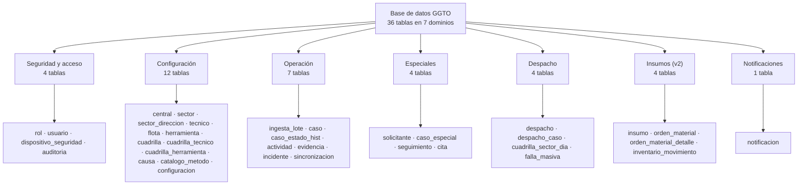
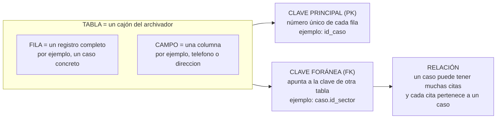

# Diccionario de Datos — Entidades de la base GGTO

> Este manual explica, con palabras sencillas, qué información guarda la base de
> datos del sistema GGTO y cómo se organiza. Es la versión literal del manual
> técnico: conserva el mismo orden de secciones, las mismas tablas y los mismos
> datos, pero sin tecnicismos. Cuando el código no permite confirmar algo, se
> indica como **pendiente de confirmar**.

## Empezar en 5 minutos

1. **Entiende la idea general.** La base de datos es como un archivador gigante.
   Dentro tiene 36 «cajones» llamados **tablas** (por ejemplo, `caso`, `despacho`
   o `cuadrilla`). Cada tabla guarda un tipo de información distinto. La tabla
   número 36, `cuadrilla_sector_dia`, es la que guarda qué sectores atiende cada
   cuadrilla cada día (ciclo D-66).
2. **Ubica el centro del sistema.** Casi todo gira alrededor de la tabla `caso`:
   allí se registra cada avería o solicitud de trabajo, con su dirección,
   teléfono y estado. Empieza por ahí para entender el resto.
3. **Sigue el recorrido diario.** El archivo CSV del día entra por
   `ingesta_lote`, se convierte en casos (`caso`); el supervisor arma el despacho
   (`despacho` y `despacho_caso`) y la cuadrilla gestiona el trabajo
   (`actividad`, `cita`, `seguimiento`).
4. **Revisa los catálogos.** `rol`, `central`, `sector`, `tecnico`, `flota`,
   `herramienta`, `cuadrilla`, `causa`, `catalogo_metodo` y `configuracion` son
   listas maestras: se configuran una vez y se consultan siempre.
5. **Cuida los datos personales.** La base guarda teléfonos, nombres, cédulas,
   direcciones y ubicaciones (datos personales o PII). Hay datos reales cargados
   (42 casos con datos personales) y el servicio es público: **el acceso debe
   restringirse**. Recuerda además que Telegram y correo todavía no tienen
   credenciales, así que los envíos quedan PENDIENTES; WhatsApp no existe en la
   v1; y la app móvil Flutter no está desarrollada (Ciclo 8 pospuesto).

## Visión general

Ficha de identificación del sistema y de la base que describe este manual:

| Dato | Valor |
|---|---|
| Proyecto | **GGTO** — Sistema de administración de reportes de avería y construcción de puntos ópticos |
| Cliente | CANTV C.A. — Central Francisco Salias (Área 4) |
| Motor de base de datos | PostgreSQL 15 (instancia compartida `truekeate-main:southamerica-east1:truekeate-db-dev`) |
| Base | `ggtov2` · usuario de aplicación `ggtov2_app` |
| Script de creación (DDL) | `RepoTecnico/db/schema.sql` — 820 líneas y **36 tablas** |
| Mapeo a objetos de Python (ORM) | `app/models/*.py` (SQLAlchemy 2.x declarativo) |
| Diccionario de origen | `RepoTecnico/diccionario_datos.md` (Borrador v0.2, «sujeto a validación») |
| Esquema de pruebas | La variable `DB_SCHEMA` agrega `options=-csearch_path=<esquema>,public` (en `app/core/db.py`) |

Antes de entrar en detalle, conviene fijar cuatro palabras que se repiten en todo
el manual:

- **Tabla**: un cajón del archivador. Agrupa un mismo tipo de información, por
  ejemplo todos los casos (`caso`).
- **Campo**: una columna de la tabla. Describe un dato concreto de cada registro,
  por ejemplo `direccion` o `telefono`.
- **Clave**: una marca que identifica o conecta registros. La **clave principal**
  (PK) es el número único de cada fila; la **clave foránea** (FK) es un número
  que apunta a la clave principal de otra tabla y crea un enlace entre ambas.
- **Relación**: la conexión entre dos tablas. Por ejemplo, un caso puede tener
  muchas citas (`caso` → `cita`), y cada cita pertenece a un solo caso.

Las entidades se describen **tal como están implementadas** en el script de
creación de la base y en los modelos de Python. Cuando el diccionario de origen
y el script real difieren, la diferencia se señala en la sección **Fuentes →
Divergencias detectadas**. Lo que no se pudo verificar se marca como
«pendiente de confirmar».

### Las 36 tablas del esquema

El script de creación contiene **36 sentencias `CREATE TABLE`** (conteo directo
sobre `RepoTecnico/db/schema.sql`). Se agrupan en siete dominios funcionales:

| Dominio | Tablas | Nº |
|---|---|---|
| Seguridad y acceso | `rol`, `usuario`, `dispositivo_seguridad`, `auditoria` | 4 |
| Configuración | `central`, `sector`, `sector_direccion`, `tecnico`, `flota`, `herramienta`, `cuadrilla`, `cuadrilla_tecnico`, `cuadrilla_herramienta`, `causa`, `catalogo_metodo`, `configuracion` | 12 |
| Operación | `ingesta_lote`, `caso`, `caso_estado_hist`, `actividad`, `evidencia`, `incidente`, `sincronizacion` | 7 |
| Especiales | `solicitante`, `caso_especial`, `seguimiento`, `cita` | 4 |
| Despacho | `despacho`, `despacho_caso`, `cuadrilla_sector_dia`, `falla_masiva` | 4 |
| Insumos (v2) | `insumo`, `orden_material`, `orden_material_detalle`, `inventario_movimiento` | 4 |
| Notificaciones | `notificacion` | 1 |
| **Total** | | **36** |

<!-- GENERAR_IMAGEN: dominios-datos.svg -->

Tablas de catálogo que se cargan con datos iniciales y que pueden ejecutarse
varias veces sin duplicar información (carga idempotente): `rol` (4 filas:
SUPER, ADMIN, SUPERVISOR, TECNICO), `catalogo_metodo` (9 filas), `central`
(1 fila: `2324X` FRANCISCO SALIAS), `cuadrilla` (1 fila: `C-00`) y
`configuracion` (22 parámetros). El catálogo `causa` **no** se carga desde el
CSV: es administrable y su mantenimiento corresponde al administrador de
catálogos.

### Convenciones de nombres y tipos

Para leer las tablas de campos de este manual, usa esta clave:

| Marca | Significado en palabras sencillas |
|---|---|
| `PK` | Clave principal: identifica de forma única cada fila. |
| `FK` | Clave foránea: enlaza con la clave principal de otra tabla. |
| `UQ` | Único: no puede repetirse el valor. |
| `NN` | Obligatorio («no nulo»): el campo no puede quedar vacío. |
| `—` | Campo opcional o sin marca especial. |

Convenciones observadas en el script de la base:

| Convención | Regla | Ejemplo |
|---|---|---|
| Nombre de tabla | singular, en minúsculas y con guion bajo, sin prefijos | `caso`, `sector_direccion` |
| Clave principal | `id_<entidad>` | `id_caso`, `id_sector` |
| Clave foránea | `id_<entidad_referenciada>` | `id_central`, `id_cuadrilla` |
| Marcas de tiempo | sufijo `_en` o nombre explícito | `creado_en`, `asignada_en`, `fecha_hora` |
| Banderas (sí/no) | tipo `boolean` con nombre afirmativo | `activo`, `activa`, `bloqueado`, `es_supervisor` |
| Constantes de dominio | `varchar(20)` con lista cerrada `CHECK`, no `ENUM` | `estado_actual`, `tipo_caso` |
| JSON | `jsonb` con valor inicial `'{}'` o `'[]'` | `rol.permisos`, `caso.ayudantes` |

Correspondencia de tipos entre el script de la base, los modelos de Python y la
notación de los diagramas Mermaid:

| PostgreSQL (script) | SQLAlchemy (modelos `app/models/`) | Mermaid (diagramas) |
|---|---|---|
| `serial` | `Integer, primary_key=True` | `serial` |
| `bigserial` | `BigInteger, primary_key=True` | `bigserial` |
| `varchar(n)` | `String(n)` | `varchar` |
| `text` | `Text` | (no se dibuja) |
| `timestamptz` | `DateTime(timezone=True)` | `timestamp` |
| `boolean` | `Boolean` | `bool` |
| `jsonb` | `JSONB` (dialecto PostgreSQL) | `json` |
| `numeric(12,2)` | (no usado en los modelos) | `numeric` |
| `inet` | (no usado en los modelos) | (no se dibuja) |

<!-- GENERAR_IMAGEN: glosario-visual.svg -->

Notas de tipado verificadas:

- Los identificadores de tablas grandes (`caso`, `ingesta_lote`, `despacho`, …)
  usan `bigserial` (números largos). Los catálogos pequeños (`central`,
  `tecnico`, `sector`) usan `serial`.
- `actividad.latitud/longitud` y `evidencia.latitud/longitud` usan
  `numeric(10,7)`: precisión GPS de unos 1 cm.
- `auditoria.ip` es del tipo PostgreSQL `inet` (dirección de red), no
  `varchar`.
- `dispositivo_seguridad.palabras_hash` es `jsonb` con valor inicial `'[]'`;
  el modelo de Python lo expone como una lista.
- Los modelos de Python mapean **29 de las 36 tablas**. Las siete tablas
  restantes (`actividad`, `evidencia`, `incidente`, `sincronizacion`, `insumo`,
  `orden_material_detalle`, `inventario_movimiento`) no tienen clase propia y
  solo existen en el script de la base (ver **Fuentes → Cobertura del ORM**).
  La tabla `auditoria` **sí** tiene modelo desde el ciclo D-67.

### Campos de auditoría (creado_en, actualizado_en)

Todas las tablas relevantes registran su creación con
`creado_en timestamptz NOT NULL DEFAULT now()` (fecha y hora automática).
Quince tablas añaden además `actualizado_en`:

| Tabla | Tiene `actualizado_en` | Disparador automático |
|---|---|---|
| `central` | Sí | Sí |
| `sector` | Sí | Sí |
| `tecnico` | Sí | Sí |
| `usuario` | Sí | Sí |
| `flota` | Sí | Sí |
| `herramienta` | Sí | Sí |
| `cuadrilla` | Sí | Sí |
| `caso` | Sí | Sí |
| `caso_especial` | Sí | Sí |
| `despacho` | Sí | Sí |
| `falla_masiva` | Sí | Sí |
| `insumo` | Sí | Sí |
| `orden_material` | Sí | Sí |
| `configuracion` | Sí | Sí |
| `dispositivo_seguridad` | Sí | **No** (no está en la lista de disparadores) |

La función `set_actualizado_en()` pone `NEW.actualizado_en := now()` en cada
`UPDATE`. Luego, un bloque `DO` crea un disparador
`BEFORE UPDATE ... FOR EACH ROW` sobre las 14 tablas editables. La tabla
`dispositivo_seguridad` declara la columna `actualizado_en` pero **no** aparece
en esa lista, por lo que su marca de actualización **no se refresca
automáticamente**: se recomienda confirmar si es intencional o añadirla a la
lista. Las tablas transaccionales (`caso_estado_hist`, `actividad`, `evidencia`,
`cita`, `seguimiento`, `notificacion`, `auditoria`) solo reciben inserciones y
no llevan `actualizado_en`.

### Extensiones pgcrypto/pg_trgm

El script de la base crea dos extensiones al inicio de la transacción:

| Extensión | Para qué se usa | Versión |
|---|---|---|
| `pgcrypto` | Generar identificadores aleatorios (`gen_random_uuid()`) y huellas digitales (`digest()`) | 1.3 (verificado en la instancia) |
| `pg_trgm` | Búsqueda difusa por dirección para asignar el sector (RF-23 / D-33), con índices GIN `gin_trgm_ops` | 1.6 (verificado en la instancia) |

Como las extensiones viven en el esquema `public`, la cadena de conexión
conserva ese esquema en el `search_path` cuando se usa `DB_SCHEMA`:
`options=-csearch_path=<esquema>,public`. Esto permite que los esquemas
aislados de prueba encuentren `gin_trgm_ops` y las funciones de `pgcrypto` sin
reinstalar las extensiones. Las versiones exactas de las extensiones no están
fijadas en el repositorio: **pendiente de confirmar** en cada entorno si se
requiere una coincidencia estricta.

## Entidades por dominio

### Seguridad y acceso

#### `rol` — catálogo de roles

Para qué sirve: es la lista de roles del sistema, con su bolsa de permisos
guardada en formato JSON (`jsonb`).

| Campo | Tipo | Clave / Nulo | Para qué sirve |
|---|---|---|---|
| `id_rol` | `serial` | PK, NN | Identificador del rol. |
| `codigo` | `varchar(30)` | UQ, NN | `SUPER`, `ADMIN`, `SUPERVISOR`, `TECNICO`. |
| `nombre` | `varchar(80)` | NN | Nombre visible. |
| `descripcion` | `text` | — | Alcance funcional resumido. |
| `permisos` | `jsonb` | NN, `'{}'` | Permisos adicionales. El rol `SUPER` no depende de esta bolsa, porque el sistema le concede permiso total. |
| `activo` | `boolean` | NN, `true` | Rol habilitado. |
| `creado_en` | `timestamptz` | NN, `now()` | Fecha y hora de creación. |

#### `usuario` — credenciales de acceso

Para qué sirve: guarda las cuentas de acceso, con login por `P00`, clave
cifrada (hash) y alcance por central.

| Campo | Tipo | Clave / Nulo | Para qué sirve |
|---|---|---|---|
| `id_usuario` | `serial` | PK, NN | Identificador. |
| `p00` | `varchar(20)` | UQ, NN | Identificador laboral; se usa como login y como identidad dentro del token de sesión (JWT). |
| `correo` | `varchar(120)` | UQ | Correo del usuario. |
| `clave_hash` | `varchar(255)` | NN | Clave cifrada con **Argon2id**. |
| `id_rol` | `integer` | FK→`rol`, NN | Rol asignado. |
| `id_tecnico` | `integer` | FK→`tecnico` | Vínculo con el trabajador (opcional). |
| `id_central` | `integer` | FK→`central` | **Alcance por central (D-36)**; refuerza el aislamiento de datos. |
| `intentos_fallidos` | `smallint` | NN, `0` | Bloqueo a los 3 intentos. |
| `bloqueado` | `boolean` | NN, `false` | Cuenta bloqueada por intentos fallidos. |
| `bloqueo_cliente` | `boolean` | NN, `false` | Bandera prevista para ocultar datos del cliente (RNF-05). |
| `requiere_cambio_clave` | `boolean` | NN, `false` | Fuerza el cambio de clave. |
| `activo` | `boolean` | NN, `true` | Cuenta habilitada. |
| `ultimo_acceso` | `timestamptz` | — | Último ingreso exitoso. |
| `creado_en` / `actualizado_en` | `timestamptz` | NN | Fechas de creación y actualización. |

#### `dispositivo_seguridad` — recuperación y documento cifrado

Para qué sirve: guarda las 12 palabras de recuperación y el documento cifrado
de cada usuario.

| Campo | Tipo | Clave / Nulo | Para qué sirve |
|---|---|---|---|
| `id_dispositivo` | `bigserial` | PK, NN | Identificador. |
| `p00` | `varchar(20)` | UQ, NN, FK→`usuario.p00` con borrado en cascada | Usuario propietario. |
| `palabras_hash` | `jsonb` | NN, `'[]'` | Huellas (hashes) de las 12 palabras. |
| `clave_privada_ref` | `varchar(255)` | — | Referencia al secreto de la clave privada (no la clave). |
| `documento_cifrado` | `text` | — | Documento de recuperación cifrado. |
| `bloqueado` | `boolean` | NN, `false` | Dispositivo bloqueado. |
| `version` | `integer` | NN, `1` | Versión del documento. |
| `actualizado_en` | `timestamptz` | NN | Sin disparador automático (ver hallazgo anterior). |

#### `auditoria` — bitácora de acciones

Para qué sirve: es el libro de acciones del sistema, con el estado anterior y
posterior de cada cambio, guardado en formato JSON (`jsonb`). Desde el ciclo
D-67 sí tiene modelo de Python (`Auditoria`, en `app/models/entities.py`).

| Campo | Tipo | Clave / Nulo | Para qué sirve |
|---|---|---|---|
| `id_auditoria` | `bigserial` | PK, NN | Identificador. |
| `usuario` | `varchar(20)` | — | P00 que ejecutó la acción. |
| `accion` | `varchar(60)` | NN | Acción registrada. |
| `entidad` | `varchar(60)` | — | Tabla o entidad afectada. |
| `id_entidad` | `varchar(40)` | — | Identificador del registro afectado. |
| `datos_antes` | `jsonb` | — | Estado previo. |
| `datos_despues` | `jsonb` | — | Estado posterior. |
| `ip` | `inet` | — | Dirección de origen. |
| `fecha_hora` | `timestamptz` | NN, `now()` | Momento del evento. |

Índice de apoyo: `ix_auditoria_fecha` sobre `auditoria (fecha_hora)`.

**Quién escribe en esta tabla (D-67).** El ciclo D-67 conectó la bitácora con
dos acciones del alta y la recuperación de técnicos:

| Acción registrada | Cuándo ocurre | Qué guarda |
|---|---|---|
| `ALTA_PRIMER_ACCESO` | El técnico crea su cuenta desde «Primer acceso (obtener clave)» | El P00, el correo y la versión de las palabras |
| `REGENERAR_PALABRAS` | El Super Usuario genera un juego nuevo desde el botón «Palabras» | Quién lo pidió, para qué P00, la versión anterior y la nueva |

> Nota de fidelidad: el modelo `Auditoria` del programa no mapea la columna
> `ip`. En la regeneración, la dirección de origen se guarda dentro de
> `datos_antes` (con el nombre `ip_solicitante`), no en la columna `ip`. Que la
> columna física quede sin usar queda **pendiente de confirmar** como decisión
> de diseño.

### Configuración

#### `central` — dirección operativa

Para qué sirve: es la base del filtro de ingesta. La central cargada es `2324X`
FRANCISCO SALIAS.

| Campo | Tipo | Clave / Nulo | Para qué sirve |
|---|---|---|---|
| `id_central` | `serial` | PK, NN | Identificador. |
| `region` | `varchar(80)` | NN | Ejemplo: `CAPITAL`. |
| `estado_geografico` | `varchar(80)` | NN | Ejemplo: `BOLIVARIANO MIRANDA`. |
| `capital_estado` | `varchar(80)` | — | Ejemplo: `LOS TEQUES`. |
| `municipio` | `varchar(80)` | NN | Ejemplo: `BARUTA`. |
| `parroquia` | `varchar(80)` | NN | Ejemplo: `BARUTA`. |
| `estado_operativo` | `varchar(80)` | — | Ejemplo: `MIRANDA-2`. |
| `distrito` | `varchar(40)` | — | Ejemplo: `10204`. |
| `area` | `varchar(20)` | NN | Ejemplo: `AREA 4`. |
| `codigo_central` | `varchar(20)` | UQ, NN | Ejemplo: `2324X`; base para generar identificadores de avería. |
| `nombre_central` | `varchar(120)` | NN | Ejemplo: `FRANCISCO SALIAS`. |
| `activa` | `boolean` | NN, `true` | Central operativa. |
| `creado_en` / `actualizado_en` | `timestamptz` | NN | Fechas de creación y actualización. |

#### `sector` — agrupación geográfica de trabajo

Para qué sirve: son los sectores que define el supervisor (Norte 1, Sur 2…) para
armar rutas y despachos.

| Campo | Tipo | Clave / Nulo | Para qué sirve |
|---|---|---|---|
| `id_sector` | `serial` | PK, NN | Identificador. |
| `id_central` | `integer` | FK→`central` con borrado en cascada, NN | Central propietaria. |
| `nombre` | `varchar(120)` | NN | Nombre visible. |
| `codigo` | `varchar(20)` | NN | Código corto. |
| `descripcion` | `text` | — | Notas del supervisor. |
| `prioridad` | `smallint` | NN, `100` | Orden de atención. |
| `activo` | `boolean` | NN, `true` | Sector vigente. |
| `creado_en` / `actualizado_en` | `timestamptz` | NN | Fechas de creación y actualización. |

Restricción única compuesta: `UNIQUE (id_central, codigo)` (el código no se
repite dentro de la misma central).

#### `sector_direccion` — patrones de dirección del sector

Para qué sirve: guarda alias o patrones de dirección que pertenecen a un sector.
Es la base para asignar el sector comparando texto.

| Campo | Tipo | Clave / Nulo | Para qué sirve |
|---|---|---|---|
| `id_sector_direccion` | `serial` | PK, NN | Identificador. |
| `id_sector` | `integer` | FK→`sector` con borrado en cascada, NN | Sector destino. |
| `patron` | `varchar(160)` | NN | Texto que se busca dentro de la dirección del caso. |
| `tipo_coincidencia` | `varchar(20)` | NN, `CONTIENE` | `CONTIENE`, `EXACTO` o `REGEX`. |
| `normalizar` | `boolean` | NN, `true` | Quita acentos y mayúsculas antes de comparar. |
| `activo` | `boolean` | NN, `true` | Patrón vigente. |
| `creado_en` | `timestamptz` | NN | Fecha de creación. |

Restricción `UNIQUE (id_sector, patron)` e índice trigram
`ix_sector_patron_trgm`.

#### `tecnico` — trabajador de la central

Para qué sirve: guarda los datos del personal técnico.

| Campo | Tipo | Clave / Nulo | Para qué sirve |
|---|---|---|---|
| `id_tecnico` | `serial` | PK, NN | Identificador. |
| `id_central` | `integer` | FK→`central`, NN | Central que lo emplea. |
| `nombre` | `varchar(80)` | NN | Nombre. |
| `apellido` | `varchar(80)` | — | Apellido. |
| `cedula` | `varchar(20)` | UQ | Cédula. |
| `p00` | `varchar(20)` | UQ, NN | Identificador laboral. |
| `telefono` | `varchar(30)` | — | Contacto (dato personal). |
| `correo` | `varchar(120)` | — | Correo (dato personal). |
| `especialidad` | `varchar(80)` | — | Especialidad. |
| `status` | `varchar(20)` | NN, `ACTIVO` | `ACTIVO`, `INACTIVO`, `VACACIONES` o `SUSPENDIDO`. |
| `creado_en` / `actualizado_en` | `timestamptz` | NN | Fechas de creación y actualización. |

#### `flota` — vehículos de la central

Para qué sirve: es el parque automotor que puede asignarse a las cuadrillas.

| Campo | Tipo | Clave / Nulo | Para qué sirve |
|---|---|---|---|
| `id_flota` | `serial` | PK, NN | Identificador. |
| `id_central` | `integer` | FK→`central`, NN | Central propietaria. |
| `can` | `varchar(20)` | UQ, NN | Código CAN. |
| `tipo` / `marca` / `modelo` | `varchar(40)` | — | Características del vehículo. |
| `placa` | `varchar(20)` | UQ | Placa. |
| `combustible` | `varchar(20)` | — | Tipo de combustible. |
| `status` | `varchar(20)` | NN, `DISPONIBLE` | `DISPONIBLE`, `EN_RUTA`, `MANTENIMIENTO` o `FUERA_SERVICIO`. |
| `estado_cauchos` / `estado_fluidos` / `estado_general` | `varchar(30)` | — | Chequeo operativo. |
| `creado_en` / `actualizado_en` | `timestamptz` | NN | Fechas de creación y actualización. |

#### `herramienta` — inventario de herramientas

Para qué sirve: lista las herramientas que pueden asignarse a las cuadrillas.

| Campo | Tipo | Clave / Nulo | Para qué sirve |
|---|---|---|---|
| `id_herramienta` | `serial` | PK, NN | Identificador. |
| `id_central` | `integer` | FK→`central`, NN | Central propietaria. |
| `nombre` | `varchar(120)` | NN | Nombre. |
| `codigo` | `varchar(40)` | UQ, NN | Código de inventario. |
| `estado` | `varchar(20)` | NN, `DISPONIBLE` | `DISPONIBLE`, `ASIGNADA`, `AVERIADA` o `PERDIDA`. |
| `observacion` | `text` | — | Notas. |
| `creado_en` / `actualizado_en` | `timestamptz` | NN | Fechas de creación y actualización. |

#### `cuadrilla` — equipo de trabajo

Para qué sirve: una cuadrilla es el equipo formado por técnicos, flota y
herramientas. La cuadrilla del supervisor es la «cuadrilla 0».

| Campo | Tipo | Clave / Nulo | Para qué sirve |
|---|---|---|---|
| `id_cuadrilla` | `serial` | PK, NN | Identificador. |
| `id_central` | `integer` | FK→`central`, NN | Central que la organiza. |
| `codigo` | `varchar(20)` | NN | Código corto (ejemplo: `C-00`). |
| `nombre` | `varchar(80)` | NN | Nombre. |
| `id_flota` | `integer` | FK→`flota` | Vehículo asignado. |
| `es_supervisor` | `boolean` | NN, `false` | Marca la cuadrilla 0. |
| `activa` | `boolean` | NN, `true` | Cuadrilla vigente. |
| `creado_en` / `actualizado_en` | `timestamptz` | NN | Fechas de creación y actualización. |

Restricciones: `UNIQUE (id_central, codigo)` e índice único parcial
`ux_cuadrilla_supervisor` sobre `cuadrilla (id_central) WHERE es_supervisor`,
que garantiza **una sola cuadrilla 0 por central**.

#### `cuadrilla_tecnico` — pertenencia N:M con vigencia

Para qué sirve: registra qué técnicos integran cada cuadrilla, con su rol y el
rango de fechas en que pertenecieron.

| Campo | Tipo | Clave / Nulo | Para qué sirve |
|---|---|---|---|
| `id_cuadrilla` | `integer` | PK, FK→`cuadrilla` con borrado en cascada, NN | Cuadrilla. |
| `id_tecnico` | `integer` | PK, FK→`tecnico` con borrado en cascada, NN | Técnico. |
| `desde` | `date` | PK, NN, `CURRENT_DATE` | Inicio de la pertenencia. |
| `rol_cuadrilla` | `varchar(30)` | NN, `REPARADOR_PRINCIPAL` | `REPARADOR_PRINCIPAL`, `AYUDANTE` o `SUPERVISOR`. |
| `hasta` | `date` | — | Fin de la pertenencia (vacío = vigente). |

Clave principal compuesta: `(id_cuadrilla, id_tecnico, desde)`.

#### `cuadrilla_herramienta` — asignación de herramientas

Para qué sirve: lleva el historial de entrega y devolución de herramientas a
cada cuadrilla.

| Campo | Tipo | Clave / Nulo | Para qué sirve |
|---|---|---|---|
| `id_cuadrilla` | `integer` | PK, FK→`cuadrilla` con borrado en cascada, NN | Cuadrilla. |
| `id_herramienta` | `integer` | PK, FK→`herramienta` con borrado en cascada, NN | Herramienta. |
| `asignada_en` | `timestamptz` | PK, NN, `now()` | Momento de la asignación. |
| `devuelta_en` | `timestamptz` | — | Momento de la devolución. |

Clave principal compuesta: `(id_cuadrilla, id_herramienta, asignada_en)`.

#### `causa` — catálogo de causas

Para qué sirve: es el catálogo administrable de causas (código y subcódigo), que
usan los casos y las actividades.

| Campo | Tipo | Clave / Nulo | Para qué sirve |
|---|---|---|---|
| `id_causa` | `serial` | PK, NN | Identificador. |
| `codigo_causa` | `varchar(20)` | NN | Código principal. |
| `subcodigo_causa` | `varchar(20)` | NN, `''` | Subcódigo (vacío si no aplica). |
| `descripcion` | `varchar(255)` | — | Descripción del código. |
| `descripcion_subcodigo` | `varchar(255)` | — | Descripción del subcódigo. |
| `tipo` | `varchar(20)` | — | Clasificación libre. |
| `activo` | `boolean` | NN, `true` | Causa vigente. |
| `creado_en` | `timestamptz` | NN | Fecha de creación. |

Restricción `UNIQUE (codigo_causa, subcodigo_causa)`. Semilla actual: **0
causas** (el catálogo se administra, no se carga del CSV).

#### `catalogo_metodo` — métodos de cierre/enrutado/contacto

Para qué sirve: normaliza los métodos que usan las actividades.

| Campo | Tipo | Clave / Nulo | Para qué sirve |
|---|---|---|---|
| `id_metodo` | `serial` | PK, NN | Identificador. |
| `dominio` | `varchar(20)` | NN | `CIERRE`, `ENRUTE`, `DIFERIDO` o `CONTACTO`. |
| `codigo` | `varchar(30)` | NN | Código (ejemplo: `IVR`, `COS`, `SACAS`). |
| `nombre` | `varchar(120)` | NN | Nombre visible. |
| `activo` | `boolean` | NN, `true` | Método vigente. |

Restricción `UNIQUE (dominio, codigo)`; semilla de 9 métodos.

#### `configuracion` — parámetros del sistema

Para qué sirve: guarda los parámetros configurables del sistema en formato JSON.

| Campo | Tipo | Clave / Nulo | Para qué sirve |
|---|---|---|---|
| `clave` | `varchar(80)` | PK, NN | Nombre del parámetro (ejemplo: `fallas.umbral_casos`). |
| `valor` | `jsonb` | NN | Valor guardado en JSON. |
| `descripcion` | `text` | — | Explicación del parámetro. |
| `actualizado_en` | `timestamptz` | NN, `now()` | Se refresca por disparador. |

Los parámetros relacionados con secretos solo se nombran, nunca se transcriben:
`telegram.webhook_secret` y `mcp.api_key` se cargan vacíos. El resto de claves
(`ingesta.*`, `despacho.*`, `fallas.*`, `outbox.max_intentos`, `seguridad.*`)
está en el script de la base.

### Operación

#### `ingesta_lote` — carga del CSV diario

Para qué sirve: guarda la cabecera y las métricas de cada carga del archivo
`detalle_averias_gpon_*.csv`.

| Campo | Tipo | Clave / Nulo | Para qué sirve |
|---|---|---|---|
| `id_lote` | `bigserial` | PK, NN | Identificador del lote. |
| `archivo` | `varchar(255)` | NN | Nombre del archivo cargado. |
| `fecha_archivo` | `date` | — | Fecha declarada del archivo (en los modelos de Python se mapea como fecha y hora; ver divergencias). |
| `id_central` | `integer` | FK→`central` | Central del lote. |
| `filas_leidas` / `filas_central` | `integer` | NN, `0` | Filas totales y filas de la central. |
| `casos_nuevos` / `casos_duplicados` / `casos_descartados` | `integer` | NN, `0` | Resultado de descartar repetidos por `id_averia`. |
| `estado` | `varchar(20)` | NN, `PROCESANDO` | `PROCESANDO`, `OK` o `ERROR`. |
| `detalle_error` | `text` | — | Mensaje de error del lote. |
| `usuario` | `varchar(20)` | — | P00 que ejecutó la carga. |
| `creado_en` | `timestamptz` | NN | Fecha de creación. |

#### `caso` — entidad central de averías

Para qué sirve: es la tabla central del sistema. Guarda cada avería del archivo
CSV (80 columnas depuradas) más los campos propios del sistema. La detección de
duplicados se apoya en `id_averia`.

| Grupo | Campos (tipo) | Nulo | Para qué sirve |
|---|---|---|---|
| Identidad | `id_caso` (`bigserial` PK), `id_central` (FK, NN) | — | Identificador interno y central propietaria. |
| Clasificación | `id_averia` `varchar(30)` UQ NN; `origen` NN `INGESTA_CSV`; `tipo_caso` NN `AVERIA`; `categoria` NN `RESIDENCIAL` | Solo `id_averia`, `origen`, `tipo_caso` y `categoria` son obligatorios | Listas cerradas: origen `INGESTA_CSV`/`MANUAL`/`TELEGRAM`/`MCP_IA`; tipo `AVERIA`/`REPARACION`/`CONSTRUCCION`; categoría `RESIDENCIAL`/`EMPRESA`/`REFERIDO`/`GOBIERNO`. |
| Estado | `estado_actual` `varchar(20)` NN `NUEVO` | NN | `NUEVO`, `ASIGNADO`, `CONTACTADO`, `CITADO`, `DIFERIDO`, `EN_GESTION`, `ENRUTADO`, `CERRADO` o `CANCELADO`. |
| Enlaces | `id_sector` FK, `id_causa` FK, `id_lote_ingesta` FK | Sí | Sector, causa y lote de origen. |
| Banderas | `en_gestion_supervisor` NN `false`, `es_falla_masiva` NN `false`, `creado_por` FK→`usuario.p00` | `creado_por` sí | Gestión por cuadrilla 0 y agrupación en falla masiva. |
| Geografía | `region`, `estado_geografico`, `capital_estado`, `municipio`, `parroquia`, `estado_operativo`, `distrito`, `area`, `codigo_central`, `nombre_central` (`varchar`) | Sí | Copia de datos de la central usada como filtro. |
| Contacto | `telefono` `varchar(30)`, `fecha_reporte`, `persona_reporta` `varchar(120)`, `contacto_cliente` `varchar(60)`, `fecha_compromiso`, `fecha_cita`, `ultimo_comentario` `text`, `results` `text`, `asignado_a` `varchar(60)`, `cuadrilla_externa` `varchar(40)`, `estatus_origen` `varchar(20)`, `problema_reporte` `text`, `informacion` `text`, `nombre_cliente` `varchar(160)`, `direccion` `text` | Sí | `informacion` unifica las columnas 31, 32 y 52 del CSV (D-27); `direccion` es la base para asignar el sector. |
| Técnico/lógico | `olt` `varchar(40)`, `plan` `varchar(60)`, `slot` `varchar(10)`, `puerto` `varchar(10)`, `fat` `varchar(80)`, `serial` `varchar(60)`, `extra`, `area_trabajo`, `tipo_servicio`, `tipo_problema`, `dias_area_resolutoria` `integer`, `unidad_negocio`, `ups`, `codigos_gestionados_venapp`, `codigos_sin_gestion_venapp` | Sí | Datos de red y gestión VENAPP. |
| Asignación origen | `reparador_principal` `varchar(20)`, `ayudantes` `jsonb` NN `'[]'`, `flota_can`, `despacho_nombre`, `despacho_apellido`, `telefono_oficina`, `telefono_movil`, `fecha_hora_asignacion` | `ayudantes` es obligatorio; el resto no | Hasta 9 ayudantes en el arreglo JSON. |
| Auditoría | `creado_en` NN, `actualizado_en` NN | NN | Fechas; `actualizado_en` se refresca por disparador. |

El comentario del modelo indica **63 columnas** y el conteo sobre el script
confirma 63 definiciones de columna. El diccionario de origen habla de **49
campos destino** del CSV: eso corresponde al mapeo de columnas del archivo, no
al total físico de la tabla (ver **Divergencias detectadas**).

#### `caso_estado_hist` — bitácora de estados

Para qué sirve: guarda el historial de cambios de estado de cada caso.

| Campo | Tipo | Clave / Nulo | Para qué sirve |
|---|---|---|---|
| `id_hist` | `bigserial` | PK, NN | Identificador. |
| `id_caso` | `bigint` | FK→`caso` con borrado en cascada, NN | Caso afectado. |
| `estado_anterior` | `varchar(20)` | — | Estado previo (vacío en el alta). |
| `estado_nuevo` | `varchar(20)` | NN | Estado nuevo. |
| `motivo` | `text` | — | Justificación del cambio. |
| `usuario` | `varchar(20)` | FK→`usuario.p00` | Autor del cambio. |
| `fecha_hora` | `timestamptz` | NN, `now()` | Momento del cambio. |

#### `actividad` — reporte corto de gestión

Para qué sirve: registra contacto, cierre, enrute, diferido, incidente o falla
masiva sobre un caso, con ubicación GPS y marca de sincronización. No tiene
modelo de Python.

| Campo | Tipo | Clave / Nulo | Para qué sirve |
|---|---|---|---|
| `id_actividad` | `bigserial` | PK, NN | Identificador. |
| `id_caso` | `bigint` | FK→`caso` con borrado en cascada, NN | Caso gestionado. |
| `id_usuario` | `integer` | FK→`usuario` | Técnico que reporta. |
| `id_cuadrilla` | `integer` | FK→`cuadrilla` | Cuadrilla ejecutora. |
| `tipo` | `varchar(20)` | NN | `CONTACTO`, `CIERRE`, `ENRUTE`, `DIFERIDO`, `INCIDENTE` o `FALLA_MASIVA`. |
| `resultado` | `varchar(20)` | — | `CONTACTADO`, `CERRADO`, `ENRUTADO` o `DIFERIDO`. |
| `reporte_corto` | `text` | — | Descripción o justificación. |
| `id_metodo` | `integer` | FK→`catalogo_metodo` | Método de cierre, enrutado o contacto. |
| `id_causa` | `integer` | FK→`causa` | Causa para enrute o diferido. |
| `fecha_hora` | `timestamptz` | NN, `now()` | Momento reportado por el dispositivo. |
| `latitud` / `longitud` | `numeric(10,7)` | — | Coordenadas GPS. |
| `sincronizado` | `boolean` | NN, `false` | Origen sin conexión, pendiente de subida. |
| `creado_en` | `timestamptz` | NN | Fecha de creación. |

Índices: `ix_actividad_caso` e `ix_actividad_usuario`. Ninguna ruta de la API ni
servicio referencia esta tabla: **pendiente de confirmar** dónde se guardan las
actividades en la v1.

#### `evidencia` — registro fotográfico

Para qué sirve: respalda con fotos una actividad, con ubicación GPS y marca de
tiempo. No tiene modelo de Python.

| Campo | Tipo | Clave / Nulo | Para qué sirve |
|---|---|---|---|
| `id_evidencia` | `bigserial` | PK, NN | Identificador. |
| `id_actividad` | `bigint` | FK→`actividad` con borrado en cascada, NN | Actividad respaldada. |
| `tipo` | `varchar(20)` | NN | `POTENCIA`, `NAVEGACION` o `DEMO`. |
| `serial_imagen` | `varchar(160)` | UQ, NN | Clave lógica: caso + avería + tipo + fecha y hora. |
| `ruta_local` / `ruta_remota` | `varchar(255)` | — | Ruta en el dispositivo y en el almacenamiento remoto. |
| `latitud` / `longitud` | `numeric(10,7)` | — | Coordenadas de la captura. |
| `fecha_hora` | `timestamptz` | NN | Marca de la captura. |
| `origen_camara` | `boolean` | NN, `true` | `false` significa que vino de la galería y se considera inválida. |
| `creado_en` | `timestamptz` | NN | Fecha de creación. |

Índice `ix_evidencia_actividad`. La única mención en el código es un comentario
en `app/api/routes_health.py` que cita la «evidencia del esquema desplegado»:
**pendiente de confirmar** el flujo de carga de imágenes.

#### `incidente` — novedades de flota o herramienta

Para qué sirve: reporta incidentes de un vehículo o de una herramienta,
asociados a una actividad. No tiene modelo de Python.

| Campo | Tipo | Clave / Nulo | Para qué sirve |
|---|---|---|---|
| `id_incidente` | `bigserial` | PK, NN | Identificador. |
| `tipo` | `varchar(20)` | NN | `FLOTA` o `HERRAMIENTA`. |
| `id_flota` | `integer` | FK→`flota` | Vehículo afectado. |
| `id_herramienta` | `integer` | FK→`herramienta` | Herramienta afectada. |
| `descripcion` | `text` | — | Detalle del incidente. |
| `id_actividad` | `bigint` | FK→`actividad` con borrado que deja el campo vacío | Actividad que lo reporta. |
| `estado` | `varchar(20)` | NN, `REPORTADO` | `REPORTADO`, `EN_REVISION` o `RESUELTO`. |
| `creado_en` | `timestamptz` | NN | Fecha de creación. |

Restricción `ck_incidente_referencia`: debe existir `id_flota` o
`id_herramienta`.

#### `sincronizacion` — paquetes ZIP del dispositivo

Para qué sirve: guarda el historial de sincronizaciones con sus conteos y el
archivo ZIP. No tiene modelo de Python.

| Campo | Tipo | Clave / Nulo | Para qué sirve |
|---|---|---|---|
| `id_sync` | `bigserial` | PK, NN | Identificador. |
| `id_dispositivo` | `bigint` | FK→`dispositivo_seguridad` con borrado que deja el campo vacío | Dispositivo. |
| `id_tecnico` | `integer` | FK→`tecnico` | Técnico. |
| `inicio` / `fin` | `timestamptz` | `inicio` es obligatorio | Ventana de sincronización. |
| `casos_descargados` / `actividades_subidas` / `evidencias_subidas` | `integer` | NN, `0` | Conteos del intercambio. |
| `archivo_zip` | `varchar(160)` | — | Nombre con central + cuadrilla + fecha. |
| `estado` | `varchar(20)` | NN, `EN_PROCESO` | `EN_PROCESO`, `OK` o `ERROR`. |
| `detalle_json` | `jsonb` | — | Detalle por caso. |

### Especiales

#### `solicitante` — personal externo

Para qué sirve: guarda la unidad, el nombre y el contacto de quien reporta un
caso especial.

| Campo | Tipo | Clave / Nulo | Para qué sirve |
|---|---|---|---|
| `id_solicitante` | `serial` | PK, NN | Identificador. |
| `unidad` | `varchar(120)` | NN | Unidad o área de la empresa. |
| `nombre` | `varchar(120)` | NN | Nombre del contacto (dato personal). |
| `contacto` | `varchar(60)` | NN | Teléfono o correo (dato personal). |
| `canal` | `varchar(20)` | — | `TELEGRAM`, `MCP_IA`, `MANUAL` o `CORREO`. |
| `creado_en` | `timestamptz` | NN | Fecha de creación. |

#### `caso_especial` — referidos, empresas y gobiernos

Para qué sirve: registra un subtipo de caso que no tiene `id_averia` de origen
(referidos, empresas y gobiernos).

| Campo | Tipo | Clave / Nulo | Para qué sirve |
|---|---|---|---|
| `id_caso_especial` | `serial` | PK, NN | Identificador. |
| `id_caso` | `bigint` | FK→`caso` con borrado en cascada | Caso vinculado, si existe. |
| `id_solicitante` | `integer` | FK→`solicitante` | Quién lo reporta. |
| `clasificacion` | `varchar(20)` | NN | `REFERIDO`, `EMPRESA` o `GOBIERNO`. |
| `tipo_actividad` | `varchar(20)` | NN | `REPARACION` o `CONSTRUCCION`. |
| `prioridad` | `varchar(20)` | NN, `MEDIA` | `ALTA`, `MEDIA` o `BAJA`. |
| `tiene_id_averia` | `boolean` | NN, `false` | Indica si dispone de avería de origen. |
| `descripcion` | `text` | — | Detalle de la solicitud. |
| `requiere_informe` | `boolean` | NN, `true` | Exige informe de atención. |
| `estado` | `varchar(20)` | NN, `ABIERTO` | `ABIERTO`, `EN_PROCESO`, `ATENDIDO` o `CERRADO`. |
| `creado_en` / `actualizado_en` | `timestamptz` | NN | Fechas de creación y actualización. |

#### `seguimiento` — derivación a otras instancias

Para qué sirve: registra el paso de un caso a otra cola o instancia y su
retorno.

| Campo | Tipo | Clave / Nulo | Para qué sirve |
|---|---|---|---|
| `id_seguimiento` | `bigserial` | PK, NN | Identificador. |
| `id_caso` | `bigint` | FK→`caso` con borrado en cascada, NN | Caso derivado. |
| `instancia_destino` | `varchar(120)` | NN | Cola o área destino. |
| `motivo` | `text` | — | Motivo de la derivación. |
| `fecha_envio` | `timestamptz` | NN, `now()` | Fecha de envío. |
| `fecha_retorno` | `timestamptz` | — | Fecha de retorno. |
| `estado` | `varchar(20)` | NN, `EN_COLA` | `EN_COLA`, `RESUELTO` o `DEVUELTO`. |
| `observacion` | `text` | — | Notas. |
| `usuario` | `varchar(20)` | FK→`usuario.p00` | Autor. |

Índice `ix_seguimiento_caso`.

#### `cita` — agenda de contacto/atención

Para qué sirve: agenda citas por caso o caso especial, **sin solapamiento** por
cuadrilla (RF-12).

| Campo | Tipo | Clave / Nulo | Para qué sirve |
|---|---|---|---|
| `id_cita` | `bigserial` | PK, NN | Identificador. |
| `id_caso` | `bigint` | FK→`caso` con borrado en cascada | Caso citado. |
| `id_caso_especial` | `integer` | FK→`caso_especial` con borrado en cascada | Caso especial citado. |
| `id_cuadrilla` | `integer` | FK→`cuadrilla` | Cuadrilla que atiende. |
| `fecha_hora` | `timestamptz` | NN | Fecha y hora de la cita. |
| `tipo` | `varchar(20)` | NN, `CONTACTO` | `CONTACTO` o `ATENCION`. |
| `estado` | `varchar(20)` | NN, `PROPUESTA` | `PROPUESTA`, `CONFIRMADA`, `CUMPLIDA`, `REPROGRAMADA`, `DIFERIDA` o `CANCELADA`. |
| `observacion` | `text` | — | Notas. |
| `creado_por` | `varchar(20)` | FK→`usuario.p00` | Autor. |
| `creado_en` | `timestamptz` | NN | Fecha de creación. |

Restricción `ck_cita_referencia`: debe existir `id_caso` o `id_caso_especial`.
Índice `ix_cita_cuadrilla_fecha` sobre `cita (id_cuadrilla, fecha_hora)`.

### Despacho

#### `despacho` — cabecera diaria por cuadrilla

Para qué sirve: es el despacho de un día para una cuadrilla, con el canal y la
hora de reporte.

| Campo | Tipo | Clave / Nulo | Para qué sirve |
|---|---|---|---|
| `id_despacho` | `bigserial` | PK, NN | Identificador. |
| `id_central` | `integer` | FK→`central`, NN | Central que lo genera. |
| `fecha` | `date` | NN | Día del despacho. |
| `id_cuadrilla` | `integer` | FK→`cuadrilla`, NN | Cuadrilla destino. |
| `estado` | `varchar(20)` | NN, `BORRADOR` | `BORRADOR`, `PUBLICADO` o `CERRADO`. |
| `generado_auto` | `boolean` | NN, `false` | Propuesto automáticamente. |
| `enviado_canal` | `varchar(20)` | — | `TELEGRAM` o `CORREO`. |
| `enviado_en` | `timestamptz` | — | Momento del envío. |
| `reporte_produccion_en` | `timestamptz` | — | Cierre 04:00 p.m. (RF-27). |
| `usuario_crea` | `varchar(20)` | FK→`usuario.p00` | Autor. |
| `creado_en` / `actualizado_en` | `timestamptz` | NN | Fechas de creación y actualización. |

Restricción `UNIQUE (fecha, id_cuadrilla)`: un despacho por cuadrilla y día. La
tabla está sujeta a RLS (seguridad por filas).

#### `despacho_caso` — detalle de casos asignados

Para qué sirve: guarda los casos incluidos en un despacho, con el orden de
visita y el tipo de asignación.

| Campo | Tipo | Clave / Nulo | Para qué sirve |
|---|---|---|---|
| `id_despacho_caso` | `bigserial` | PK, NN | Identificador. |
| `id_despacho` | `bigint` | FK→`despacho` con borrado en cascada, NN | Despacho. |
| `id_caso` | `bigint` | FK→`caso` con borrado en cascada, NN | Caso asignado. |
| `id_sector` | `integer` | FK→`sector` | Sector que agrupa la visita. |
| `orden_visita` | `smallint` | — | Orden de recorrido. |
| `tipo_asignacion` | `varchar(20)` | — | `REPARACION`, `CONSTRUCCION`, `REFERIDO`, `EMPRESA` o `FALLA_MASIVA`. |
| `estado` | `varchar(20)` | NN, `ASIGNADO` | `ASIGNADO`, `GESTIONADO`, `CERRADO`, `CITADO` o `DIFERIDO`. |
| `observacion` | `text` | — | Notas. |

Restricción `UNIQUE (id_despacho, id_caso)`: un caso aparece una sola vez por
despacho. Índices `ix_despacho_caso_caso` e `ix_despacho_caso_despacho`.

#### `cuadrilla_sector_dia` — asignación diaria de sectores

Para qué sirve: guarda **qué sectores atiende cada cuadrilla cada día**. Es la
tabla nueva del ciclo **D-66**; el supervisor puede cambiarla cuando quiera y el
despacho reparte los casos según ella. No tiene modelo de relación con
`despacho`: es una lista de trabajo previa al reparto.

| Campo | Tipo | Clave / Nulo | Para qué sirve |
|---|---|---|---|
| `id_asignacion` | `bigserial` | PK, NN | Identificador de la fila. |
| `id_central` | `integer` | FK→`central`, NN | Central de la jornada. |
| `fecha` | `date` | NN | Día al que corresponde la asignación. |
| `id_cuadrilla` | `integer` | FK→`cuadrilla` con borrado en cascada, NN | Cuadrilla que atiende. |
| `id_sector` | `integer` | FK→`sector` con borrado en cascada, NN | Sector asignado. |
| `usuario` | `varchar(20)` | FK→`usuario.p00` | Quién guardó la asignación. |
| `creado_en` | `timestamptz` | NN, `now()` | Cuándo se guardó. |

Restricción `UNIQUE (fecha, id_sector)`: **un sector pertenece como máximo a una
cuadrilla por día**. Índice `ix_cuadrilla_sector_dia_fecha` sobre `(fecha,
id_cuadrilla)`. Si no hay ninguna fila para la fecha, el sistema propone una
asignación equilibrada sin guardarla hasta que el usuario procese el despacho.

#### `falla_masiva` — evento de falla por concentración

Para qué sirve: agrupa casos concentrados y documenta su planificación.

| Campo | Tipo | Clave / Nulo | Para qué sirve |
|---|---|---|---|
| `id_falla` | `bigserial` | PK, NN | Identificador. |
| `id_central` | `integer` | FK→`central`, NN | Central que la registra. |
| `clave_concentracion` | `varchar(120)` | — | Clave del grupo (ejemplo: `olt:pde-olt-00`) para detectar sin duplicar. |
| `descripcion` | `text` | NN | Descripción del evento. |
| `fecha_deteccion` | `timestamptz` | NN, `now()` | Momento de la detección. |
| `origen` | `varchar(20)` | NN, `AUTOMATICA` | `AUTOMATICA`, `REPORTE_TECNICO` o `MCP`. |
| `id_sector` | `integer` | FK→`sector` | Sector afectado. |
| `id_cuadrilla` | `integer` | FK→`cuadrilla` | Cuadrilla asignada. |
| `estado` | `varchar(20)` | NN, `DETECTADA` | `DETECTADA`, `PLANIFICADA`, `ATENDIDA` o `CERRADA`. |
| `planificacion` | `text` | — | Plan de atención. |
| `reporte_simple` | `text` | — | Reporte resumido. |
| `planificada_en` | `timestamptz` | — | Cuándo se documentó la planificación (RF-17). |
| `creado_en` / `actualizado_en` | `timestamptz` | NN | Fechas de creación y actualización. |

Parámetros asociados en `configuracion`: `fallas.activo`, `fallas.umbral_casos`,
`fallas.ventana_horas` y `fallas.campo_concentracion`.

### Insumos (v2)

#### `insumo` — catálogo de materiales

Para qué sirve: es el catálogo de insumos por central (v2, RF-05). No tiene
modelo de Python.

| Campo | Tipo | Clave / Nulo | Para qué sirve |
|---|---|---|---|
| `id_insumo` | `serial` | PK, NN | Identificador. |
| `id_central` | `integer` | FK→`central` | Central que lo cataloga. |
| `codigo` | `varchar(40)` | UQ, NN | Código del insumo. |
| `nombre` | `varchar(120)` | NN | Nombre. |
| `unidad_medida` | `varchar(20)` | NN, `UNIDAD` | Unidad de medida. |
| `stock_minimo` | `numeric(12,2)` | NN, `0` | Umbral de reposición. |
| `activo` | `boolean` | NN, `true` | Insumo vigente. |
| `creado_en` / `actualizado_en` | `timestamptz` | NN | Fechas de creación y actualización. |

#### `orden_material` — solicitud de material

Para qué sirve: es la cabecera de una orden de material (RF-18). Tiene un modelo
mínimo en Python.

| Campo | Tipo | Clave / Nulo | Para qué sirve |
|---|---|---|---|
| `id_orden` | `bigserial` | PK, NN | Identificador. |
| `id_caso` | `bigint` | FK→`caso` | Caso que la origina. |
| `id_cuadrilla` | `integer` | FK→`cuadrilla` | Cuadrilla solicitante. |
| `solicitante_usuario` | `varchar(20)` | FK→`usuario.p00` | Usuario solicitante. |
| `estado` | `varchar(20)` | NN, `SOLICITADA` | `SOLICITADA`, `APROBADA`, `ENTREGADA` o `RECHAZADA`. |
| `fecha` | `timestamptz` | NN, `now()` | Fecha de la solicitud. |
| `observacion` | `text` | — | Notas. |
| `creado_en` / `actualizado_en` | `timestamptz` | NN | Fechas de creación y actualización. |

#### `orden_material_detalle` — renglones de la orden

Para qué sirve: detalla los insumos y las cantidades de cada orden. No tiene
modelo de Python.

| Campo | Tipo | Clave / Nulo | Para qué sirve |
|---|---|---|---|
| `id_orden_detalle` | `bigserial` | PK, NN | Identificador. |
| `id_orden` | `bigint` | FK→`orden_material` con borrado en cascada, NN | Orden padre. |
| `id_insumo` | `integer` | FK→`insumo`, NN | Insumo. |
| `cantidad_solicitada` | `numeric(12,2)` | NN, `CHECK > 0` | Cantidad pedida. |
| `cantidad_entregada` | `numeric(12,2)` | NN, `0` | Cantidad entregada. |

Restricción `UNIQUE (id_orden, id_insumo)`.

#### `inventario_movimiento` — ingresos, egresos y ajustes

Para qué sirve: es el kardex de movimientos del inventario. No tiene modelo de
Python.

| Campo | Tipo | Clave / Nulo | Para qué sirve |
|---|---|---|---|
| `id_mov` | `bigserial` | PK, NN | Identificador. |
| `id_insumo` | `integer` | FK→`insumo`, NN | Insumo movido. |
| `tipo` | `varchar(20)` | NN | `INGRESO`, `EGRESO` o `AJUSTE`. |
| `cantidad` | `numeric(12,2)` | NN, `CHECK > 0` | Cantidad del movimiento. |
| `id_orden` | `bigint` | FK→`orden_material` | Orden que lo genera. |
| `id_tecnico` | `integer` | FK→`tecnico` | Técnico que recibe. |
| `fecha` | `timestamptz` | NN, `now()` | Fecha del movimiento. |
| `usuario` | `varchar(20)` | FK→`usuario.p00` | Usuario que registra. |
| `observacion` | `text` | — | Notas. |

El módulo de insumos corresponde a la **v2**: no se encontraron rutas ni
servicios que operen estas cuatro tablas en la v1.

### Notificaciones

#### `notificacion` — bandeja de salida (outbox)

Para qué sirve: es la bandeja de mensajes por Telegram, correo o MCP, con
reintentos y espera creciente entre intentos (patrón *outbox*, RNF-20).

| Campo | Tipo | Clave / Nulo | Para qué sirve |
|---|---|---|---|
| `id_notificacion` | `bigserial` | PK, NN | Identificador. |
| `canal` | `varchar(20)` | NN | `TELEGRAM`, `CORREO` o `MCP_IA`. |
| `destinatario` | `varchar(160)` | — | Destino (dato personal cuando es correo). |
| `asunto` | `varchar(200)` | — | Asunto. |
| `cuerpo` | `text` | — | Cuerpo del mensaje. |
| `id_caso` | `bigint` | FK→`caso` con borrado que deja el campo vacío | Caso notificado. |
| `estado` | `varchar(20)` | NN, `PENDIENTE` | `PENDIENTE`, `ENVIADO` o `FALLIDO`. |
| `error` | `text` | — | Último error de envío. |
| `enviado_en` | `timestamptz` | — | Momento del envío efectivo. |
| `intentos` | `smallint` | NN, `0` | Reintentos consumidos. |
| `proximo_intento` | `timestamptz` | — | Próximo intento (espera creciente). |
| `creado_en` | `timestamptz` | NN | Fecha de creación. |

Índice `ix_notificacion_caso`. El procesamiento de la bandeja se apoya en
`app/services/outbox.py` y el límite de reintentos está en el parámetro
`outbox.max_intentos`. **En producción, Telegram y correo aún no tienen
credenciales**: las notificaciones quedan en estado `PENDIENTE`. WhatsApp no
existe en la v1.

## Campos PII

### inventario y clasificación (RNF-18)

RNF-18 exige «inventario y clasificación de datos personales (PII);
minimización; retención por entidad; enmascaramiento de teléfono, dirección y
serial para roles no autorizados». El inventario verificado sobre el script de
la base es:

| Tabla | Campos con datos personales | Clasificación propuesta |
|---|---|---|
| `caso` | `telefono`, `nombre_cliente`, `direccion`, `persona_reporta`, `contacto_cliente`, `telefono_oficina`, `telefono_movil`, `serial`, `informacion` (texto libre) | Confidencial |
| `tecnico` | `cedula`, `telefono`, `correo`, `nombre`, `apellido` | Confidencial (personal interno) |
| `usuario` | `correo`, `clave_hash` (secreto de autenticación) | Restringido |
| `solicitante` | `nombre`, `contacto` | Confidencial |
| `actividad` | `reporte_corto` (texto libre), `latitud`, `longitud` | Confidencial (geolocalización) |
| `evidencia` | `ruta_local`, `ruta_remota`, `latitud`, `longitud`, `fecha_hora`, `serial_imagen` | Confidencial (imagen + ubicación) |
| `notificacion` | `destinatario`, `cuerpo` | Confidencial |
| `auditoria` | `datos_antes`, `datos_despues`, `ip`, `usuario` | Restringido |
| `dispositivo_seguridad` | `palabras_hash`, `clave_privada_ref`, `documento_cifrado` | Secreto (sin datos personales en claro) |
| `falla_masiva` | `descripcion`, `planificacion`, `reporte_simple` (pueden citar direcciones) | Interno |

Estado de la minimización y el enmascaramiento: el script de la base no cifra
columnas a nivel de base (el cifrado en reposo depende de CMEK, pendiente según
D-26). La bandera `usuario.bloqueo_cliente` está prevista para «ocultar datos del
cliente», pero **no se encontró código de enmascaramiento** en `app/`:
**pendiente de confirmar** su implementación. El diccionario de origen describe
`clave_hash` como «bcrypt/argon2», pero el algoritmo real es **Argon2id**.

Datos reales y exposición: la base ya tiene datos reales (42 casos con datos
personales) y el servicio es público. Por eso **debe restringirse el acceso**.
El riesgo aceptado D-26 indica que la instancia compartida no cumple RNF-16/SSL
obligatorio y que no hay respaldos/PITR hasta migrar de instancia.

### retención por entidad (requerimientos.md:212-225)

| Entidad | ¿Contiene datos personales? | Retención propuesta | Acción al vencer |
|---|---|---|---|
| `caso` | Sí | 5 años | Anonimizar y archivar |
| `actividad` | Sí | 5 años | Anonimizar |
| `evidencia` | Sí | 2 años | Eliminar imagen y metadatos |
| `auditoria` | Sí | 3 años | Archivar sin datos personales |
| `notificacion` | Sí | 1 año | Eliminar |
| `solicitante` | Sí | 5 años | Anonimizar |
| `dispositivo_seguridad` | No (solo huellas) | Mientras la cuenta esté activa | Eliminar con la cuenta |
| `inventario_movimiento` / `orden_material` (v2) | No | 5 años | Archivar |

Los plazos son **propuesta** y deben validarse con CANTV y asesoría legal. Para
la v1, el riesgo aceptado D-26 indica que la instancia compartida no cumple
RNF-16/SSL obligatorio y que no hay respaldos/PITR hasta migrar de instancia.

## Fuentes

### `RepoTecnico/diccionario_datos.md`

Documento de Fase 1 (Borrador v0.2, «sujeto a validación») con 33 entidades
listadas en su inventario y el mapeo posicional del CSV de 80 columnas a 49
campos destino. Aporta la justificación funcional de cada entidad, los códigos
de requerimiento asociados y las cinco dudas abiertas.

### `RepoTecnico/db/schema.sql`

Fuente normativa de la estructura física: 36 tablas, 2 extensiones, 2 funciones
(`set_actualizado_en` y `generar_id_averia_ref`), 1 secuencia (`seq_caso_ref`),
22 objetos de índice, 2 políticas RLS, 14 disparadores y las semillas
idempotentes. Es el archivo que se aplica con
`psql "$DATABASE_URL" -v ON_ERROR_STOP=1 -f RepoTecnico/db/schema.sql`.

### Cobertura del ORM (`app/models/`)

Los modelos de Python mapean 29 tablas mediante 6 módulos:

- `entities.py`: `rol`, `central`, `tecnico`, `usuario`, `dispositivo_seguridad`,
  `auditoria`.
- `caso_entities.py`: `ingesta_lote`, `caso`, `caso_estado_hist`.
- `config_entities.py`: `sector`, `sector_direccion`, `flota`, `herramienta`,
  `cuadrilla`, `cuadrilla_tecnico`, `cuadrilla_herramienta`, `causa`,
  `catalogo_metodo`, `configuracion`.
- `despacho_entities.py`: `despacho`, `despacho_caso`, `cuadrilla_sector_dia`,
  `notificacion`, `falla_masiva`.
- `especiales_entities.py`: `solicitante`, `caso_especial`, `cita`,
  `seguimiento`.
- `insumos_entities.py`: `orden_material`.

Las siete tablas sin modelo son `actividad`, `evidencia`, `incidente`,
`sincronizacion`, `insumo`, `orden_material_detalle` e `inventario_movimiento`;
una búsqueda en el código Python confirma que tampoco se consultan
con SQL directo. Es decir, en la v1 esas tablas existen en la base pero ningún
flujo de la aplicación las escribe: **pendiente de confirmar** si corresponden
a módulos diferidos (app móvil y v2 de insumos) o a trabajo aún no implementado.
Recuerda que la app móvil Flutter no está desarrollada (Ciclo 8 pospuesto).

La tabla `auditoria` era una de esas tablas sin modelo, pero dejó de serlo en el
ciclo D-67: ahora tiene la clase `Auditoria` y la aplicación la escribe al dar de
alta una cuenta y al regenerar las palabras de seguridad.

### Divergencias detectadas

| # | Tema | Dice el diccionario de origen | Implementación real |
|---|---|---|---|
| 1 | Tipo de `despacho.id_despacho` | `serial` | `bigserial` |
| 2 | Tipo de `cita.id_cita` | `serial` | `bigserial` |
| 3 | Cifrado de la clave | «bcrypt/argon2» | Argon2id |
| 4 | Dominios de `catalogo_metodo` | `CIERRE`/`ENRUTE`/`DIFERIDO` | Incluye `CONTACTO` |
| 5 | Códigos de `rol` | `SUPERVISOR`, `TECNICO`, `ADMIN` | Además `SUPER` (permiso total) |
| 6 | Columna `actividad.metodo` | Listada como `varchar(20)` | No existe; el método se referencia con `id_metodo` (FK) |
| 7 | `cita.estado` | Sin `CANCELADA` | Incluye `CANCELADA` |
| 8 | `caso_especial.estado` | Sin lista cerrada | `CHECK` con 4 estados |
| 9 | Nº de columnas de `caso` | «49 campos destino» (mapeo del CSV) | 63 columnas físicas |
| 10 | Tipo de `ingesta_lote.fecha_archivo` | No precisado | `date` en el script; fecha y hora en el ORM |
| 11 | Longitud de `caso.extra` | No precisada | `varchar(120)` en el script; `String(40)` en el ORM |
| 12 | Disparador de `dispositivo_seguridad` | No aplica | Tiene `actualizado_en` pero sin disparador |

Las divergencias 10 y 11 son de **mapeo del ORM**, no del script de la base: al
no usar migraciones Alembic en el estado actual, una fecha y hora sobre una
columna `date` puede producir conversiones implícitas de zona horaria. Se
recomienda alinear el modelo con el script o versionar la migración
correspondiente; queda **pendiente de confirmar** cuál de los dos es la
intención definitiva.
