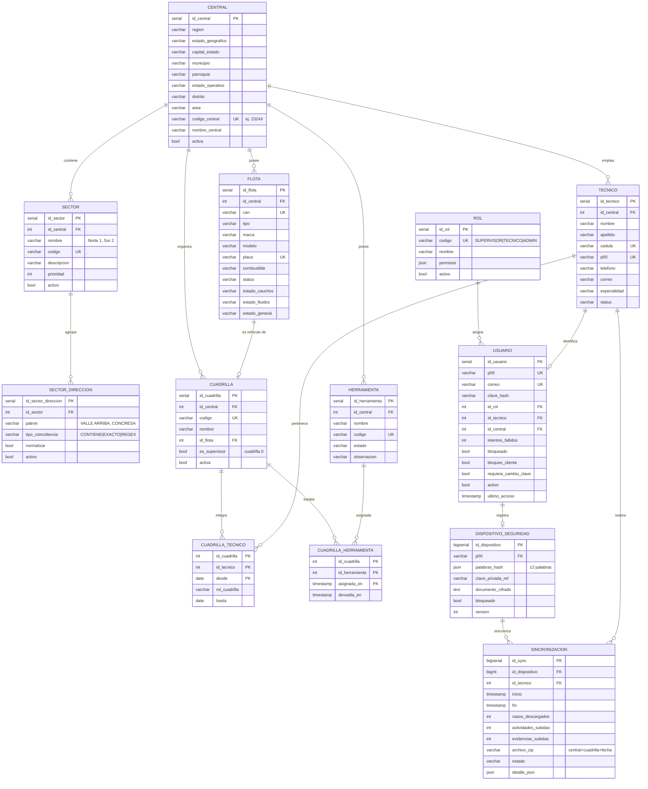
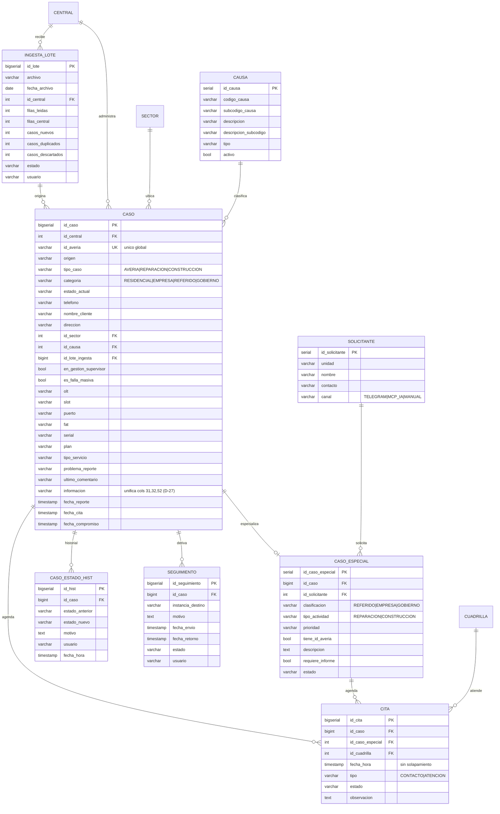
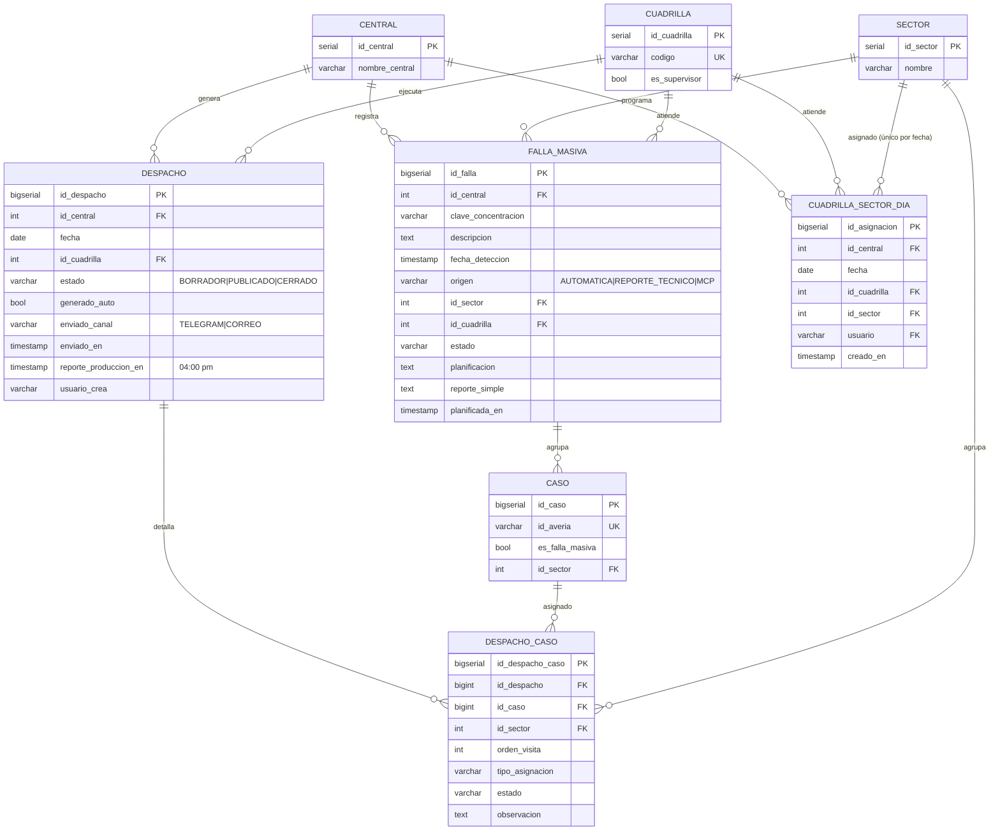
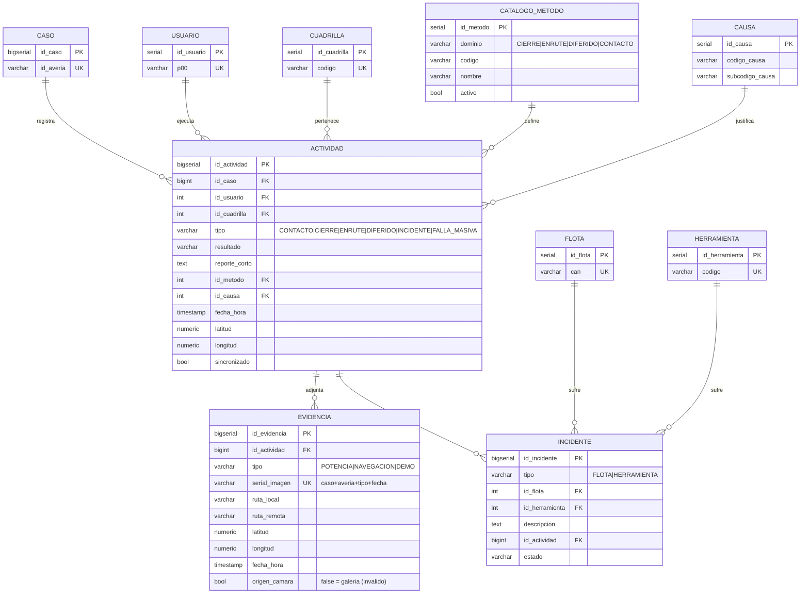
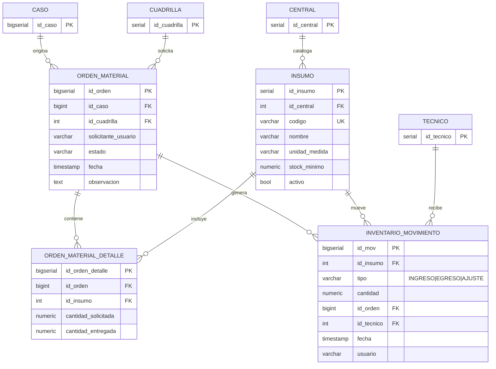
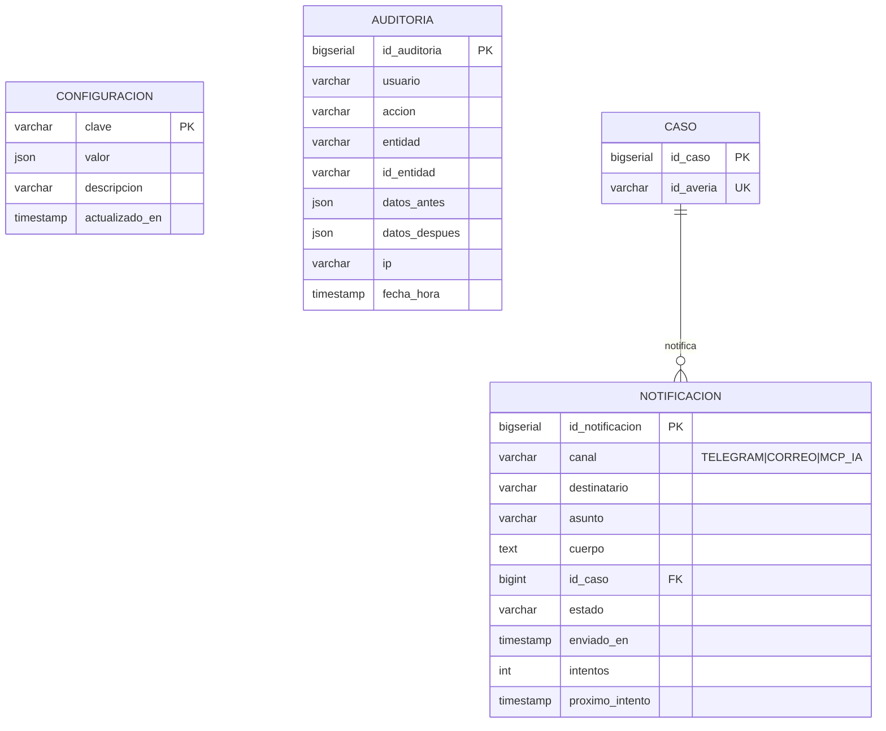

# Diagrama Entidad-Relación — Modelo de datos GGTO

> Este manual explica, con palabras sencillas, cómo se conectan las 36 tablas de
> la base GGTO. Es la versión literal del manual técnico: conserva las mismas
> secciones y todos los diagramas por dominio, pero los presenta con un lenguaje
> claro y con los vínculos simplificados para que se lean fácil. Si algo no se
> pudo verificar, se indica como **pendiente de confirmar**.

## Empezar en 5 minutos

1. **Piensa en un grafo, no en una lista.** Cada tabla es un punto y cada
   relación es una flecha. Leer el modelo es seguir esas flechas: de una central
   salen sus sectores, técnicos y casos.
2. **Aprende a leer las flechas.** `||--o{` significa «uno a muchos»: un caso
   puede tener muchas citas. `||--o|` significa «uno a cero o uno»: un técnico
   puede tener una cuenta de usuario, o ninguna.
3. **Empieza por el centro.** La tabla `caso` es el corazón. Se conecta con
   `central`, `sector`, `causa`, `ingesta_lote`, `despacho_caso`, `cita`,
   `actividad`, `seguimiento` y `notificacion`.
4. **Revisa los tres puentes.** Tres relaciones de muchos a muchos se resuelven
   con tablas puente: `cuadrilla_tecnico`, `cuadrilla_herramienta` y
   `despacho_caso`.
5. **Recuerda las reglas del sistema.** La base tiene 36 tablas y ya contiene
   datos reales (42 casos con datos personales) en un servicio público: el
   acceso debe restringirse. La tabla número 36, `cuadrilla_sector_dia`, guarda
   qué sectores atiende cada cuadrilla cada día (ciclo D-66). Telegram y correo
   no tienen credenciales, así que los envíos quedan PENDIENTES; WhatsApp no
   existe en la v1; la app móvil Flutter no está desarrollada (Ciclo 8
   pospuesto); y el riesgo aceptado D-26 indica que no hay respaldos/PITR hasta
   migrar de instancia.

## Visión general del modelo

### 36 tablas y 7 dominios

El esquema físico contiene 36 sentencias `CREATE TABLE` y el modelo de origen
las representa en siete bloques temáticos:

| # | Dominio | Entidades del diagrama | Nº |
|---|---|---|---|
| 1 | Vista general de relaciones | Relaciones entre todas las entidades | — |
| 2 | Núcleo organizacional y seguridad | ROL, CENTRAL, SECTOR, SECTOR_DIRECCION, TECNICO, USUARIO, FLOTA, HERRAMIENTA, CUADRILLA, CUADRILLA_TECNICO, CUADRILLA_HERRAMIENTA, DISPOSITIVO_SEGURIDAD, SINCRONIZACION | 13 |
| 3 | Casos: averías y solicitudes | INGESTA_LOTE, CAUSA, CASO, CASO_ESPECIAL, SOLICITANTE, CASO_ESTADO_HIST, SEGUIMIENTO, CITA | 8 |
| 4 | Despacho y fallas masivas | DESPACHO, DESPACHO_CASO, CUADRILLA_SECTOR_DIA, FALLA_MASIVA (más CASO, CUADRILLA, SECTOR y CENTRAL como referencia) | 4 propias |
| 5 | Gestión técnica | ACTIVIDAD, EVIDENCIA, INCIDENTE, CATALOGO_METODO (más CAUSA, CASO, USUARIO, CUADRILLA, FLOTA y HERRAMIENTA) | 4 propias |
| 6 | Insumos v2 | INSUMO, ORDEN_MATERIAL, ORDEN_MATERIAL_DETALLE, INVENTARIO_MOVIMIENTO | 4 |
| 7 | Soporte y auditoría | CONFIGURACION, AUDITORIA, NOTIFICACION | 3 |

Las entidades definidas con atributos propios en los dominios 2 a 7 suman
13 + 8 + 4 + 4 + 4 + 3 = 36. Además, cada bloque repite entidades de otros
dominios como referencia para dibujar la relación (por ejemplo, `CASO` aparece
en los dominios 4, 5 y 7). En total, **36 tablas** distintas.

### Convención de diagramas (Mermaid erDiagram)

El modelo fija las convenciones de tipos, porque **Mermaid no admite
paréntesis** en la definición de atributos:

| Mermaid | PostgreSQL real |
|---|---|
| `serial` / `bigserial` | `serial` / `bigserial` |
| `varchar` | `varchar(n)` según el diccionario |
| `timestamp` | `timestamptz` |
| `numeric` | `numeric(12,2)` / `numeric(10,7)` para GPS |
| `json` | `jsonb` |
| `bool` | `boolean` |

Claves: `PK` es clave principal, `FK` clave foránea y `UK` valor único. Las
cardinalidades usadas son `||--o{` (uno a muchos, lado opcional) y `||--o|`
(uno a cero o uno). Los comentarios entre comillas de los diagramas (por ejemplo
`"unico global"` o `"sin solapamiento"`) provienen del modelo y se conservan
textualmente; algunos describen reglas que en el script de la base se
implementan con `CHECK`, `UNIQUE` o directamente en el servicio.

## Diagramas Mermaid por dominio

### Vista general de relaciones

Muestra el grafo completo de dependencias entre las 36 tablas. La imagen
siguiente es la versión simplificada y legible: solo nombres de tablas y
relaciones.

```mermaid
erDiagram
    CENTRAL      ||--o{ SECTOR : contiene
    CENTRAL      ||--o{ TECNICO : emplea
    CENTRAL      ||--o{ FLOTA : posee
    CENTRAL      ||--o{ HERRAMIENTA : posee
    CENTRAL      ||--o{ CUADRILLA : organiza
    CENTRAL      ||--o{ CASO : administra
    CENTRAL      ||--o{ INGESTA_LOTE : recibe
    CENTRAL      ||--o{ DESPACHO : genera
    CENTRAL      ||--o{ CUADRILLA_SECTOR_DIA : programa
    CENTRAL      ||--o{ FALLA_MASIVA : registra
    CENTRAL      ||--o{ INSUMO : cataloga
    SECTOR       ||--o{ SECTOR_DIRECCION : agrupa
    SECTOR       ||--o{ CASO : ubica
    SECTOR       ||--o{ CUADRILLA_SECTOR_DIA : "asignado (único por fecha)"
    TECNICO      ||--o| USUARIO : "da identidad a"
    ROL          ||--o{ USUARIO : asigna
    FLOTA        ||--o| CUADRILLA : "es vehiculo de"
    CUADRILLA    ||--o{ CUADRILLA_TECNICO : integra
    CUADRILLA    ||--o{ CUADRILLA_HERRAMIENTA : equipa
    CUADRILLA    ||--o{ DESPACHO : ejecuta
    CUADRILLA    ||--o{ CUADRILLA_SECTOR_DIA : atiende
    CUADRILLA    ||--o{ CITA : atiende
    USUARIO      ||--o| DISPOSITIVO_SEGURIDAD : registra
    USUARIO      ||--o{ CUADRILLA_SECTOR_DIA : define
    DISPOSITIVO_SEGURIDAD ||--o{ SINCRONIZACION : sincroniza
    TECNICO      ||--o{ SINCRONIZACION : realiza
    INGESTA_LOTE ||--o{ CASO : origina
    CAUSA        ||--o{ CASO : clasifica
    CASO         ||--o{ CASO_ESTADO_HIST : historial
    CASO         ||--o{ CASO_ESPECIAL : especializa
    SOLICITANTE  ||--o{ CASO_ESPECIAL : solicita
    CASO         ||--o{ ACTIVIDAD : registra
    ACTIVIDAD    ||--o{ EVIDENCIA : adjunta
    CASO         ||--o{ DESPACHO_CASO : despacha
    DESPACHO     ||--o{ DESPACHO_CASO : detalla
    CASO         ||--o{ SEGUIMIENTO : deriva
    CASO         ||--o{ CITA : agenda
    USUARIO      ||--o{ ACTIVIDAD : ejecuta
    CATALOGO_METODO ||--o{ ACTIVIDAD : define
    ACTIVIDAD    ||--o{ INCIDENTE : reporta
    FLOTA        ||--o{ INCIDENTE : sufre
    HERRAMIENTA  ||--o{ INCIDENTE : sufre
    FALLA_MASIVA ||--o{ CASO : agrupa
    ORDEN_MATERIAL ||--o{ ORDEN_MATERIAL_DETALLE : contiene
    ORDEN_MATERIAL ||--o{ INVENTARIO_MOVIMIENTO : genera
    INSUMO       ||--o{ ORDEN_MATERIAL_DETALLE : incluye
    INSUMO       ||--o{ INVENTARIO_MOVIMIENTO : mueve
    CASO         ||--o{ NOTIFICACION : notifica
```

<!-- GENERAR_IMAGEN: modelo-relacional-general.svg -->


Observaciones verificadas sobre este grafo:

- La relación «CASO `||--o{` EVIDENCIA» del diagrama **no** es directa en el
  script de la base: `evidencia` referencia a `actividad` y llega al caso a
  través de ella. El bloque del dominio 5 sí modela la ruta correcta
  (`ACTIVIDAD ||--o{ EVIDENCIA`).
- «CENTRAL `||--o{` INSUMO» se cumple solo si `id_central` está informado; en el
  script de la base la columna admite valores vacíos.
- «FALLA_MASIVA `||--o{` CASO» no tiene clave foránea: la pertenencia se marca
  con `caso.es_falla_masiva` y la agrupación por concentración se calcula en
  `app/services/fallas.py`.
- «CUADRILLA_SECTOR_DIA» es la **tabla nueva del ciclo D-66**: guarda qué
  sectores atiende cada cuadrilla cada día. La combinación `(fecha, id_sector)`
  es **única**, de modo que un sector pertenece como máximo a una cuadrilla por
  día. El servicio de despacho la usa para repartir los casos y propone una
  asignación equilibrada cuando no hay ninguna guardada.

### Núcleo organizacional y seguridad

Cubre los catálogos y los recursos de la central, incluidos los de la app de
campo (dispositivo y sincronización).



El comentario `"SUPERVISOR|TECNICO|ADMIN"` del atributo `ROL.codigo` quedó
desactualizado respecto del script de la base: la semilla real inserta **cuatro**
roles (`SUPER`, `ADMIN`, `SUPERVISOR`, `TECNICO`). Además, `sector.codigo` y
`cuadrilla.codigo` son únicos **por central** (`UNIQUE (id_central, codigo)`), no
globales, y `ux_cuadrilla_supervisor` garantiza una sola cuadrilla 0 por central.
Los campos `telefono`, `correo`, `cedula`, `nombre` y `apellido` son datos
personales: trátalos con cuidado.

### Casos (averías y solicitudes)

Es el núcleo transaccional del sistema.



Notas verificadas: el diagrama declara `CITA.id_cita` como `bigserial`, que es
el tipo real; el diccionario de origen lo describía como `serial` (divergencia
señalada en el manual del diccionario). La regla «sin solapamiento» del atributo
`fecha_hora` se apoya en el índice `ix_cita_cuadrilla_fecha`; en el script de la
base **no** existe una restricción `EXCLUDE` (el propio modelo la considera
«opcional»). La tabla `caso` guarda teléfono, nombre del cliente y dirección
(datos personales).

### Despacho y fallas masivas



El diagrama ya marca `id_despacho` como `bigserial`, que es el tipo real, a
diferencia del diccionario de origen. La relación `FALLA_MASIVA ||--o{ CASO` no
tiene clave foránea en el script: se materializa con la bandera
`caso.es_falla_masiva` y con la detección por concentración de
`app/services/fallas.py`, cuyos parámetros viven en `configuracion`
(`fallas.activo`, `fallas.umbral_casos`, `fallas.ventana_horas` y
`fallas.campo_concentracion`). El canal `enviado_canal` admite Telegram y correo,
pero en producción **aún no hay credenciales**: los envíos quedan PENDIENTES.

La entidad `CUADRILLA_SECTOR_DIA` es la incorporación del ciclo **D-66**. Une tres
catálogos (`central`, `cuadrilla` y `sector`) y al usuario que guarda la
asignación. Su restricción `UNIQUE (fecha, id_sector)` impide que un mismo sector
quede en dos cuadrillas el mismo día. No se conecta con `DESPACHO`: es una lista
de trabajo previa que el motor de reparto consulta.

### Gestión técnica (offline)

El título original del documento es «Gestión técnica (app móvil)». Debe
precisarse que **la aplicación móvil Flutter no está desarrollada** (Ciclo 8
pospuesto): este bloque describe el modelo previsto para la operación en campo y
las tablas existen en el script de la base, pero en la v1 ningún flujo de la API
las escribe. WhatsApp tampoco existe en la v1.



El bloque del dominio 5 sí incluye `CATALOGO_METODO.dominio = CONTACTO`, que
coincide con la regla real y corrige la omisión del diccionario. La regla
«`origen_camara` debe ser `true`» se expresa como valor inicial `true` más la
validación en el servicio: el script de la base no impone una regla que lo
fuerce.

### Insumos (v2)

Corresponde al alcance de la v2 (RF-05); las tablas existen pero no tienen flujo
de aplicación en la v1.



Detalle verificado: `inventario_movimiento` tiene además la columna
`observacion` que el diagrama no lista, y `orden_material_detalle` restringe
cada insumo a una sola aparición por orden (`UNIQUE (id_orden, id_insumo)`).

### Soporte y auditoría



Detalle verificado: `auditoria.ip` es de tipo `inet`, no `varchar`; tanto
`auditoria` como `configuracion` carecen de clave foránea; y `notificacion`
incorpora la columna `error` que el diagrama no lista. En producción, los canales
Telegram y correo aún no tienen credenciales: las notificaciones quedan en estado
`PENDIENTE` (patrón *outbox*, `app/services/outbox.py`).

## Relaciones principales

### Relaciones 1:N

Relaciones uno-a-muchos verificadas contra las claves foráneas del script de la
base:

| Padre | Hijo | Clave foránea | Cardinalidad |
|---|---|---|---|
| `central` | `sector` | `sector.id_central` | 1:N obligatoria |
| `central` | `tecnico` | `tecnico.id_central` | 1:N obligatoria |
| `central` | `flota` | `flota.id_central` | 1:N obligatoria |
| `central` | `herramienta` | `herramienta.id_central` | 1:N obligatoria |
| `central` | `cuadrilla` | `cuadrilla.id_central` | 1:N obligatoria |
| `central` | `caso` | `caso.id_central` | 1:N obligatoria |
| `central` | `ingesta_lote` | `ingesta_lote.id_central` | 1:N opcional |
| `central` | `despacho` | `despacho.id_central` | 1:N obligatoria |
| `central` | `falla_masiva` | `falla_masiva.id_central` | 1:N obligatoria |
| `central` | `insumo` | `insumo.id_central` | 1:N opcional |
| `central` | `cuadrilla_sector_dia` | `cuadrilla_sector_dia.id_central` | 1:N obligatoria |
| `sector` | `sector_direccion` | `sector_direccion.id_sector` | 1:N con borrado en cascada |
| `sector` | `caso` | `caso.id_sector` | 1:N opcional |
| `sector` | `despacho_caso` | `despacho_caso.id_sector` | 1:N opcional |
| `sector` | `cuadrilla_sector_dia` | `cuadrilla_sector_dia.id_sector` | 1:N con borrado en cascada |
| `ingesta_lote` | `caso` | `caso.id_lote_ingesta` | 1:N opcional |
| `causa` | `caso` | `caso.id_causa` | 1:N opcional |
| `causa` | `actividad` | `actividad.id_causa` | 1:N opcional |
| `catalogo_metodo` | `actividad` | `actividad.id_metodo` | 1:N opcional |
| `flota` | `cuadrilla` | `cuadrilla.id_flota` | 1:N opcional |
| `cuadrilla` | `despacho` | `despacho.id_cuadrilla` | 1:N obligatoria |
| `cuadrilla` | `cita` | `cita.id_cuadrilla` | 1:N opcional |
| `cuadrilla` | `actividad` | `actividad.id_cuadrilla` | 1:N opcional |
| `cuadrilla` | `falla_masiva` | `falla_masiva.id_cuadrilla` | 1:N opcional |
| `cuadrilla` | `orden_material` | `orden_material.id_cuadrilla` | 1:N opcional |
| `cuadrilla` | `cuadrilla_sector_dia` | `cuadrilla_sector_dia.id_cuadrilla` | 1:N con borrado en cascada |
| `caso` | `caso_estado_hist` | `caso_estado_hist.id_caso` | 1:N con borrado en cascada |
| `caso` | `seguimiento` | `seguimiento.id_caso` | 1:N con borrado en cascada |
| `caso` | `cita` | `cita.id_caso` | 1:N con borrado en cascada |
| `caso` | `despacho_caso` | `despacho_caso.id_caso` | 1:N con borrado en cascada |
| `caso` | `actividad` | `actividad.id_caso` | 1:N con borrado en cascada |
| `caso` | `notificacion` | `notificacion.id_caso` | 1:N con borrado que deja el campo vacío |
| `caso` | `orden_material` | `orden_material.id_caso` | 1:N opcional |
| `caso_especial` | `cita` | `cita.id_caso_especial` | 1:N con borrado en cascada |
| `solicitante` | `caso_especial` | `caso_especial.id_solicitante` | 1:N opcional |
| `despacho` | `despacho_caso` | `despacho_caso.id_despacho` | 1:N con borrado en cascada |
| `actividad` | `evidencia` | `evidencia.id_actividad` | 1:N con borrado en cascada |
| `actividad` | `incidente` | `incidente.id_actividad` | 1:N con borrado que deja el campo vacío |
| `usuario` | `actividad` | `actividad.id_usuario` | 1:N opcional |
| `usuario` | `orden_material` | `orden_material.solicitante_usuario` (apunta a `p00`) | 1:N opcional |
| `usuario` | `cuadrilla_sector_dia` | `cuadrilla_sector_dia.usuario` (apunta a `p00`) | 1:N opcional |
| `flota` | `incidente` | `incidente.id_flota` | 1:N opcional |
| `herramienta` | `incidente` | `incidente.id_herramienta` | 1:N opcional |
| `dispositivo_seguridad` | `sincronizacion` | `sincronizacion.id_dispositivo` | 1:N con borrado que deja el campo vacío |
| `tecnico` | `sincronizacion` | `sincronizacion.id_tecnico` | 1:N opcional |
| `tecnico` | `inventario_movimiento` | `inventario_movimiento.id_tecnico` | 1:N opcional |
| `insumo` | `orden_material_detalle` | `orden_material_detalle.id_insumo` | 1:N obligatoria |
| `insumo` | `inventario_movimiento` | `inventario_movimiento.id_insumo` | 1:N obligatoria |
| `orden_material` | `orden_material_detalle` | `orden_material_detalle.id_orden` | 1:N con borrado en cascada |
| `orden_material` | `inventario_movimiento` | `inventario_movimiento.id_orden` | 1:N opcional |

### Relaciones N:M

Las tres relaciones muchos-a-muchos se resuelven con **tablas puente** que
tienen clave principal compuesta:

| Tabla puente | Extremos | Clave principal compuesta | Atributos propios |
|---|---|---|---|
| `cuadrilla_tecnico` | `cuadrilla` ↔ `tecnico` | `(id_cuadrilla, id_tecnico, desde)` | `rol_cuadrilla`, `hasta` |
| `cuadrilla_herramienta` | `cuadrilla` ↔ `herramienta` | `(id_cuadrilla, id_herramienta, asignada_en)` | `devuelta_en` |
| `despacho_caso` | `despacho` ↔ `caso` | `id_despacho_caso` (subrogada) + `UNIQUE (id_despacho, id_caso)` | `id_sector`, `orden_visita`, `tipo_asignacion`, `estado`, `observacion` |

La pertenencia a cuadrilla es **histórica y con vigencia** (`desde`/`hasta`), de
modo que un técnico puede cambiar de cuadrilla sin perder el registro anterior.
La asignación de herramientas usa la marca temporal como parte de la clave para
permitir múltiples asignaciones sucesivas de la misma herramienta a la misma
cuadrilla.

### Dependencias de catálogo

Catálogos y su consumo:

| Catálogo | Consumido por | Clave foránea | Notas |
|---|---|---|---|
| `rol` | `usuario.id_rol` | Sí, obligatoria | 4 roles cargados, incluido `SUPER` con permiso total. |
| `central` | 11 tablas (`sector`, `tecnico`, `flota`, `herramienta`, `cuadrilla`, `caso`, `ingesta_lote`, `despacho`, `cuadrilla_sector_dia`, `falla_masiva`, `insumo`) | Sí | Base del filtro de ingesta y del alcance multi-central. |
| `sector` | `caso`, `sector_direccion`, `despacho_caso`, `cuadrilla_sector_dia`, `falla_masiva` | Sí | Asignación de sector por coincidencia de dirección; `cuadrilla_sector_dia` guarda qué cuadrilla lo atiende cada día. |
| `causa` | `caso.id_causa`, `actividad.id_causa` | Sí | Catálogo administrable; hoy tiene 0 filas. |
| `catalogo_metodo` | `actividad.id_metodo` | Sí | 9 métodos cargados. |
| `configuracion` | Ninguna clave foránea; la leen los servicios | No | Parámetros en JSON; se actualiza por `PUT /api/v1/configuracion/{clave}`. |
| `usuario` | `creado_por`, `usuario`, `creado_por` de `cita`, `solicitante_usuario`, `usuario_crea` | Parcial | `caso.creado_por` referencia `usuario(p00)`; otras columnas con el mismo nombre son `varchar(20)` sin clave foránea. |

## Claves y restricciones

### Claves primarias

| Tipo | Tablas | Observación |
|---|---|---|
| PK simple `serial` | `rol`, `causa`, `catalogo_metodo`, `central`, `sector`, `sector_direccion`, `tecnico`, `usuario`, `flota`, `herramienta`, `cuadrilla`, `solicitante`, `caso_especial`, `insumo` | Catálogos y entidades maestras. |
| PK simple `bigserial` | `ingesta_lote`, `caso`, `caso_estado_hist`, `seguimiento`, `cita`, `despacho`, `despacho_caso`, `cuadrilla_sector_dia`, `falla_masiva`, `actividad`, `evidencia`, `incidente`, `dispositivo_seguridad`, `sincronizacion`, `orden_material`, `orden_material_detalle`, `inventario_movimiento`, `notificacion`, `auditoria` | Tablas transaccionales de alto volumen. |
| PK compuesta | `cuadrilla_tecnico` `(id_cuadrilla, id_tecnico, desde)`, `cuadrilla_herramienta` `(id_cuadrilla, id_herramienta, asignada_en)` | Dos tablas puente. |
| PK natural `varchar` | `configuracion.clave` | La clave es el nombre del parámetro. |

### Claves foráneas

Políticas de borrado observadas en el script de la base:

| Política | Ejemplos |
|---|---|
| Borrado en cascada (al borrar el padre se borran los hijos) | `sector_direccion.id_sector`, `caso_estado_hist.id_caso`, `seguimiento.id_caso`, `cita.id_caso`, `despacho_caso.id_despacho` e `id_caso`, `actividad.id_caso`, `evidencia.id_actividad`, `caso_especial.id_caso`, `orden_material_detalle.id_orden`, `dispositivo_seguridad.p00`, `cuadrilla_sector_dia.id_cuadrilla` e `id_sector` |
| Borrado que deja el campo vacío (el hijo sobrevive) | `incidente.id_actividad`, `sincronizacion.id_dispositivo`, `notificacion.id_caso` |
| Sin política de borrado (restrictiva por defecto) | La mayoría de las claves foráneas hacia catálogos (`central`, `rol`, `sector`, `causa`, `catalogo_metodo`, `tecnico`, `flota`, `herramienta`, `cuadrilla`) |

Consecuencia operativa: no se puede eliminar una `central` que aún tenga
sectores, técnicos, casos o despachos (la clave foránea lo impide); en cambio,
borrar un `caso` arrastra en cascada su historial de estados, seguimientos, citas
y asignaciones de despacho.

### UNIQUE (id_averia)

La unicidad **global** de `caso.id_averia` es la clave para no duplicar casos
(RF-22):

- Definición: `id_averia varchar(30) NOT NULL UNIQUE`.
- Formato sintético para casos sin incidencia de origen:
  `REF-<CÓDIGO_CENTRAL>-<NNNNNN>` (decisión D-23).
- Generación: función `generar_id_averia_ref(p_id_central integer)`, que lee
  `central.codigo_central`, lanza un error si la central no existe, pasa el
  código a mayúsculas y rellena con ceros a la izquierda hasta 6 dígitos.
- Secuencia de apoyo: `seq_caso_ref`.
- Ejemplo documentado: `REF-2324X-000001`.

Otras restricciones únicas destacadas: `rol.codigo`, `central.codigo_central`,
`tecnico.p00`, `tecnico.cedula`, `usuario.p00`, `usuario.correo`, `flota.can`,
`flota.placa`, `herramienta.codigo`, `insumo.codigo`, `evidencia.serial_imagen`;
compuestas `sector(id_central, codigo)`, `cuadrilla(id_central, codigo)`,
`sector_direccion(id_sector, patron)`, `causa(codigo_causa, subcodigo_causa)`,
`catalogo_metodo(dominio, codigo)`, `despacho(fecha, id_cuadrilla)`,
`despacho_caso(id_despacho, id_caso)`, `cuadrilla_sector_dia(fecha, id_sector)`,
`orden_material_detalle(id_orden,
id_insumo)`. El índice único parcial `ux_cuadrilla_supervisor` implementa «una
sola cuadrilla 0 por central».

### CHECK de estados

Los enumerados se modelan con listas cerradas `CHECK` (no con el tipo `ENUM`).
La columna «Valores» reproduce el orden del script:

| Tabla.columna | Valores permitidos |
|---|---|
| `catalogo_metodo.dominio` | `CIERRE`, `ENRUTE`, `DIFERIDO`, `CONTACTO` |
| `sector_direccion.tipo_coincidencia` | `CONTIENE`, `EXACTO`, `REGEX` |
| `tecnico.status` | `ACTIVO`, `INACTIVO`, `VACACIONES`, `SUSPENDIDO` |
| `flota.status` | `DISPONIBLE`, `EN_RUTA`, `MANTENIMIENTO`, `FUERA_SERVICIO` |
| `herramienta.estado` | `DISPONIBLE`, `ASIGNADA`, `AVERIADA`, `PERDIDA` |
| `cuadrilla_tecnico.rol_cuadrilla` | `REPARADOR_PRINCIPAL`, `AYUDANTE`, `SUPERVISOR` |
| `ingesta_lote.estado` | `PROCESANDO`, `OK`, `ERROR` |
| `caso.origen` | `INGESTA_CSV`, `MANUAL`, `TELEGRAM`, `MCP_IA` |
| `caso.tipo_caso` | `AVERIA`, `REPARACION`, `CONSTRUCCION` |
| `caso.categoria` | `RESIDENCIAL`, `EMPRESA`, `REFERIDO`, `GOBIERNO` |
| `caso.estado_actual` | `NUEVO`, `ASIGNADO`, `CONTACTADO`, `CITADO`, `DIFERIDO`, `EN_GESTION`, `ENRUTADO`, `CERRADO`, `CANCELADO` |
| `solicitante.canal` | `TELEGRAM`, `MCP_IA`, `MANUAL`, `CORREO` |
| `caso_especial.clasificacion` | `REFERIDO`, `EMPRESA`, `GOBIERNO` |
| `caso_especial.tipo_actividad` | `REPARACION`, `CONSTRUCCION` |
| `caso_especial.prioridad` | `ALTA`, `MEDIA`, `BAJA` |
| `caso_especial.estado` | `ABIERTO`, `EN_PROCESO`, `ATENDIDO`, `CERRADO` |
| `seguimiento.estado` | `EN_COLA`, `RESUELTO`, `DEVUELTO` |
| `cita.tipo` | `CONTACTO`, `ATENCION` |
| `cita.estado` | `PROPUESTA`, `CONFIRMADA`, `CUMPLIDA`, `REPROGRAMADA`, `DIFERIDA`, `CANCELADA` |
| `despacho.estado` | `BORRADOR`, `PUBLICADO`, `CERRADO` |
| `despacho.enviado_canal` | `TELEGRAM`, `CORREO` |
| `despacho_caso.tipo_asignacion` | `REPARACION`, `CONSTRUCCION`, `REFERIDO`, `EMPRESA`, `FALLA_MASIVA` |
| `despacho_caso.estado` | `ASIGNADO`, `GESTIONADO`, `CERRADO`, `CITADO`, `DIFERIDO` |
| `falla_masiva.origen` | `AUTOMATICA`, `REPORTE_TECNICO`, `MCP` |
| `falla_masiva.estado` | `DETECTADA`, `PLANIFICADA`, `ATENDIDA`, `CERRADA` |
| `actividad.tipo` | `CONTACTO`, `CIERRE`, `ENRUTE`, `DIFERIDO`, `INCIDENTE`, `FALLA_MASIVA` |
| `actividad.resultado` | `CONTACTADO`, `CERRADO`, `ENRUTADO`, `DIFERIDO` |
| `evidencia.tipo` | `POTENCIA`, `NAVEGACION`, `DEMO` |
| `incidente.tipo` | `FLOTA`, `HERRAMIENTA` |
| `incidente.estado` | `REPORTADO`, `EN_REVISION`, `RESUELTO` |
| `sincronizacion.estado` | `EN_PROCESO`, `OK`, `ERROR` |
| `orden_material.estado` | `SOLICITADA`, `APROBADA`, `ENTREGADA`, `RECHAZADA` |
| `inventario_movimiento.tipo` | `INGRESO`, `EGRESO`, `AJUSTE` |
| `notificacion.canal` | `TELEGRAM`, `CORREO`, `MCP_IA` |
| `notificacion.estado` | `PENDIENTE`, `ENVIADO`, `FALLIDO` |

Restricciones de comprobación que no son listas de estados:

| Regla | En palabras |
|---|---|
| `cita`: `id_caso IS NOT NULL OR id_caso_especial IS NOT NULL` | Una cita debe apuntar a un caso o a un caso especial. |
| `incidente`: `id_flota IS NOT NULL OR id_herramienta IS NOT NULL` | Un incidente debe referirse a un vehículo o a una herramienta. |
| `orden_material_detalle.cantidad_solicitada > 0` | La cantidad pedida debe ser positiva. |
| `inventario_movimiento.cantidad > 0` | La cantidad del movimiento debe ser positiva. |

### Funciones (generar_id_averia_ref, triggers actualizado_en)

Funciones definidas en el esquema:

| Función | Tipo | Propósito |
|---|---|---|
| `set_actualizado_en()` | `plpgsql`, disparador | Asigna la fecha y hora actual a `actualizado_en` en cada `UPDATE`. |
| `generar_id_averia_ref(p_id_central integer)` | `plpgsql` | Devuelve `REF-<CÓDIGO>-<NNNNNN>` para casos sin incidencia. |
| `app_central_actual()` | `sql STABLE` | Lee el parámetro de sesión `app.id_central` y lo convierte a entero. |

Disparadores `actualizado_en`: un bloque `DO` recorre la lista de 14 tablas
(`central`, `sector`, `tecnico`, `usuario`, `flota`, `herramienta`, `cuadrilla`,
`caso`, `caso_especial`, `despacho`, `falla_masiva`, `insumo`, `orden_material`,
`configuracion`) y crea `trg_<tabla>_actualizado BEFORE UPDATE ... FOR EACH ROW`.
Hallazgo verificado: `dispositivo_seguridad` declara la columna
`actualizado_en` pero **no** figura en la lista, por lo que su marca no se
refresca automáticamente. La secuencia `seq_caso_ref` alimenta la numeración de
los identificadores `REF-`.

## RLS

### caso y despacho

El script habilita Row Level Security (RLS, seguridad por filas) con forzado de
política en dos tablas:

```sql
ALTER TABLE caso     ENABLE ROW LEVEL SECURITY;
ALTER TABLE caso     FORCE  ROW LEVEL SECURITY;
ALTER TABLE despacho ENABLE ROW LEVEL SECURITY;
ALTER TABLE despacho FORCE  ROW LEVEL SECURITY;
```

`FORCE ROW LEVEL SECURITY` hace que las políticas se apliquen también al
propietario de la tabla, de modo que no basta con ser dueño del objeto para
saltarlas.

### políticas

Se definen dos políticas, una por tabla, con la misma expresión:

| Política | Tabla | Expresión |
|---|---|---|
| `p_caso_central` | `caso` | `app_central_actual() IS NULL OR id_central = app_central_actual()` |
| `p_despacho_central` | `despacho` | Expresión idéntica |

La función auxiliar `app_central_actual()` devuelve `null` cuando el parámetro
de sesión `app.id_central` no está definido. En ese caso la política **permite
todo** (modo compatibilidad declarado explícitamente en el script). El propio
comentario advierte que, antes de producción, debe eliminarse la cláusula
`app_central_actual() IS NULL` para pasar a un comportamiento de «denegar por
defecto».

Estado real de la aplicación: una búsqueda en el código Python **no encuentra
ninguna sentencia `SET LOCAL app.id_central`** ni una escritura equivalente. Es
decir, en la v1 el backend no fija el alcance de central en la conexión y, por
tanto, las políticas RLS no restringen filas: el aislamiento multi-central
depende hoy de `usuario.id_central` en la capa de servicio, no de la base. Debe
considerarse **pendiente de confirmar** el punto donde se fijará ese parámetro
(sesión por petición) o la eliminación de la cláusula permisiva.

### implicación multi-central (RNF-21)

RNF-21 exige «matriz rol × módulo × acción», alcance por `usuario.id_central`,
RLS como defensa en profundidad y **pruebas negativas** (la central A no accede
a datos de la central B). La situación verificada es:

| Elemento de RNF-21 | Estado verificado |
|---|---|
| Alcance por `usuario.id_central` | La columna existe y está mapeada en los modelos de Python. |
| RLS en PostgreSQL | Definida en `caso` y `despacho`, pero **no activada por la aplicación** (sin `SET LOCAL app.id_central`). |
| Defensa en profundidad | Parcial: la extensión al resto de tablas con `id_central` (`sector`, `tecnico`, `flota`, `cuadrilla`, `insumo`) está prevista para la Fase 3. |
| Pruebas negativas entre centrales | **pendiente de confirmar**; no se localizaron pruebas de acceso denegado cruzado. |

Implicación práctica: mientras exista una sola central cargada (`2324X`
FRANCISCO SALIAS), el comportamiento funcional es correcto; al incorporar una
segunda central, la ausencia de `app.id_central` en la conexión convierte las
políticas en no restrictivas y el aislamiento recae por completo en la capa de
servicio. Recuerda que la base ya contiene datos reales (42 casos con datos
personales) y el servicio es público: **el acceso debe restringirse**.

## Índices

### trigram (caso.direccion, sector_direccion.patron)

La asignación de sector por coincidencia de texto (RF-23/D-33) se apoya en la
extensión `pg_trgm` y dos índices GIN con la clase de operadores `gin_trgm_ops`:

| Índice | Tabla.columna | Definición |
|---|---|---|
| `ix_caso_direccion_trgm` | `caso.direccion` | `USING gin (direccion gin_trgm_ops)` |
| `ix_sector_patron_trgm` | `sector_direccion.patron` | `USING gin (patron gin_trgm_ops)` |

Estos índices habilitan búsquedas difusas o similares (`%`, `similarity`) sobre
direcciones normalizadas y permiten que la asignación de sector escale con el
volumen de casos. El campo `sector_direccion.normalizar` indica que la
comparación se hace sin acentos ni mayúsculas, y `tipo_coincidencia` admite
`CONTIENE`, `EXACTO` o `REGEX`.

### índices de apoyo

| Índice | Tabla (columnas) | Propósito |
|---|---|---|
| `ux_cuadrilla_supervisor` | `cuadrilla (id_central) WHERE es_supervisor` | Único parcial: una cuadrilla 0 por central |
| `ix_caso_central` | `caso (id_central)` | Filtro por central (RLS y consultas) |
| `ix_caso_sector` | `caso (id_sector)` | Casos por sector |
| `ix_caso_telefono` | `caso (telefono)` | Búsqueda en el panel |
| `ix_caso_estado` | `caso (estado_actual)` | Filtro por estado |
| `ix_caso_fecha_reporte` | `caso (fecha_reporte)` | Monitoreo por fecha |
| `ix_caso_gestion_supervisor` | `caso (en_gestion_supervisor)` | Cola de gestión (cuadrilla 0) |
| `ix_caso_falla_masiva` | `caso (es_falla_masiva)` | Casos agrupados en fallas |
| `ix_caso_lote` | `caso (id_lote_ingesta)` | Trazabilidad de la ingesta |
| `ix_despacho_caso_caso` | `despacho_caso (id_caso)` | Casos de un despacho |
| `ix_despacho_caso_despacho` | `despacho_caso (id_despacho)` | Detalle por despacho |
| `ix_cuadrilla_sector_dia_fecha` | `cuadrilla_sector_dia (fecha, id_cuadrilla)` | Asignación de sectores del día (D-66) |
| `ix_actividad_caso` | `actividad (id_caso)` | Actividades de un caso |
| `ix_actividad_usuario` | `actividad (id_usuario)` | Actividades por técnico |
| `ix_evidencia_actividad` | `evidencia (id_actividad)` | Evidencias de una actividad |
| `ix_cita_cuadrilla_fecha` | `cita (id_cuadrilla, fecha_hora)` | Soporte de la regla «sin solapamiento» (RF-12) |
| `ix_seguimiento_caso` | `seguimiento (id_caso)` | Seguimientos de un caso |
| `ix_sector_direccion_sector` | `sector_direccion (id_sector)` | Patrones de un sector |
| `ix_notificacion_caso` | `notificacion (id_caso)` | Notificaciones de un caso (outbox) |
| `ix_auditoria_fecha` | `auditoria (fecha_hora)` | Consulta de bitácora por fecha |

Total de objetos de índice: **22** (21 `CREATE INDEX` más
`ux_cuadrilla_supervisor`), de los cuales 2 son trigram y 1 es único parcial.
Observación: varias claves foráneas de catálogos pequeños (`causa`, `rol`,
`catalogo_metodo`) no tienen índice dedicado; su volumen es bajo y el
planificador puede resolverlas con exploraciones secuenciales. Los índices que
cubren las consultas de mayor volumen (`caso`, `despacho_caso`, `actividad`,
`notificacion`) sí están presentes. Es **pendiente de confirmar**, con
`EXPLAIN ANALYZE` sobre datos reales, si falta algún índice compuesto para los
reportes de monitoreo (`app/services/monitoreo.py`).
