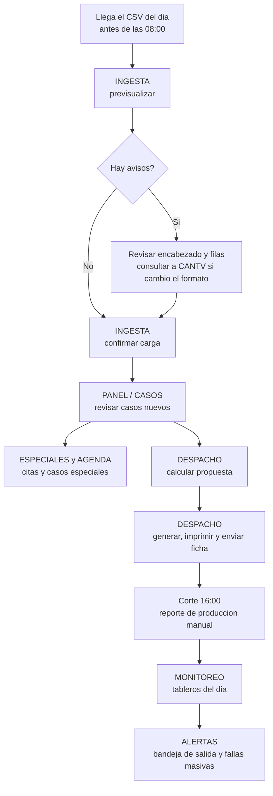

# Manual de Operación y Mantenimiento — GGTO

> Guía sencilla para el trabajo diario con GGTO en la Central Francisco Salias (Área 4).
> Aquí se explica cómo se opera el sistema, qué rutinas existen, cómo se respalda la
> información, cómo se mantiene, qué hacer ante un incidente y cómo se sostiene el servicio.
> Cuando una capacidad está prevista pero todavía no existe, se dice con claridad
> **«pendiente de confirmar»**. Así ninguna persona espera una función que aún no está lista.

## Empezar en 5 minutos

1. **Entra al sistema.** Abre la plataforma e inicia sesión con tu **P00** y tu clave. Si es tu
   primer día, pide al ADMIN que cree tu cuenta.
2. **Prepara la ingesta del día.** Abre **INGESTA**, ejecuta primero la **previsualización** del
   archivo CSV y revisa los avisos que aparezcan antes de cargar nada.
3. **Confirma la carga.** Ejecuta la carga real, anota el número de **lote** que devuelve el
   sistema y comprueba que el lote quedó en estado **OK**.
4. **Revisa los casos.** Abre **PANEL** o **CASOS**, usa el **buscador global** y confirma que los
   casos nuevos del día aparecen correctamente.
5. **Cierra el despacho.** Antes de las **16:00**, calcula la propuesta, genera el despacho,
   imprime o envía la ficha y revisa la **bandeja de salida** para ver el estado de los envíos.

| Dato | Valor |
|---|---|
| Proyecto | GGTO — Sistema de administración de reportes de avería y construcción de puntos ópticos |
| Cliente | CANTV C.A. — Central Francisco Salias (Área 4) |
| Alcance | Operación diaria, rutinas programadas, respaldo, mantenimiento, incidentes y continuidad |
| Versión de la aplicación | 0.9.0 |
| Base de datos operativa | PostgreSQL 15.18, base `ggtov2`, usuario de aplicación `ggtov2_app` |
| Despliegue | Cloud Run `ggto-web`, región `europe-west1` |

---

## Operación diaria

La jornada de la Central Francisco Salias gira alrededor de la ingesta del archivo diario de
averías, la gestión de casos, el despacho de cuadrillas con corte a las 16:00, la agenda de citas y
el monitoreo. Es importante saber que **la plataforma no tiene un planificador de tareas propio**:
varias de estas actividades son manuales y dependen del operador (ver «Rutinas programadas»).

<!-- GENERAR_IMAGEN: rutina-diaria.svg -->

### Ingesta del CSV diario

#### Ventana de entrega y horario

El archivo matriz de averías lo entrega el sistema origen de CANTV con periodicidad **diaria, en
días hábiles, y antes de las 08:00**, hora de Venezuela.

- El nombre del archivo es `detalle_averias_gpon_<fecha>.csv`.
- El delimitador es el punto y coma (`;`).
- La codificación es **ISO-8859-1**.
- Tiene **80 columnas**, que se leen por posición.

El canal de entrega definitivo (una carpeta o depósito auditado, o SFTP) está **por definir con
CANTV**: es un punto **pendiente de confirmar**. El repositorio Git está prohibido como canal,
porque el archivo contiene datos personales (PII).

#### Procedimiento paso a paso

1. Verifica que el archivo del día llegó y que su nombre corresponde a la fecha operativa.
2. Abre la sección **INGESTA** de la aplicación.
3. Ejecuta primero la **previsualización** (`POST /api/v1/ingesta/preview`). Esta llamada lee y
   clasifica el archivo **sin guardar nada**. Te informa: filas leídas, filas de la central, casos
   nuevos, duplicados, descartados, sectorizados, sin sector y cuadrilla 0.
4. Revisa los **avisos** del resumen. El sistema agrega un aviso si el encabezado no tiene 80
   columnas y si hay filas malformadas o sin identificador de avería.
5. Confirma la carga real (`POST /api/v1/ingesta`).
6. Anota el **número de lote** (`id_lote`) que devuelve el sistema y el conteo de fallas masivas
   detectadas.

La escritura de la ingesta exige rol **ADMIN** o **SUPERVISOR**. El rol **SUPER** tiene permiso
total y pasa siempre.

#### Verificación del resultado

| Verificación | Dónde se comprueba |
|---|---|
| El lote quedó en estado `OK` y sin error | El estado del lote y su campo de detalle de error |
| Conteos del lote (leídas, central, nuevos, duplicados, descartados) | `GET /api/v1/ingesta/lotes` |
| Detalle de un lote concreto | `GET /api/v1/ingesta/lotes/{id_lote}` |
| Casos cargados visibles en PANEL | `GET /api/v1/casos?id_lote_ingesta=<id>` |
| Fallas masivas generadas por la carga | `GET /api/v1/fallas-masivas` |

La ingesta es **idempotente por identificador de avería**: antes de insertar, el sistema consulta
los identificadores que ya existen, en grupos de 1000, y solo crea los nuevos. Esto quiere decir
que **repetir la carga del mismo archivo reporta los casos como duplicados y no genera filas
nuevas**.

### Gestión de casos

El **PANEL** y **CASOS** permiten listar, filtrar, buscar, abrir la ficha, editar y dar de alta
casos manualmente.

| Operación | Endpoint |
|---|---|
| Listado con filtros y paginación | `GET /api/v1/casos` |
| Búsqueda por avería, teléfono, cliente o dirección | `GET /api/v1/casos/buscar` |
| Alta manual (genera una referencia `REF-…` si no das identificador de avería) | `POST /api/v1/casos` |
| Ficha completa | `GET /api/v1/casos/{id_caso}` |
| Edición y cambio de estado | `PATCH /api/v1/casos/{id_caso}` |
| Bitácora de estados | `GET /api/v1/casos/{id_caso}/historial` |

Los estados válidos de un caso son exactamente estos nueve: **NUEVO, ASIGNADO, CONTACTADO, CITADO,
DIFERIDO, EN_GESTION, ENRUTADO, CERRADO y CANCELADO**.

Cada cambio de estado deja una fila en la bitácora `caso_estado_hist`, con el estado anterior, el
estado nuevo, el motivo y el P00 del usuario que hizo el cambio. El alta manual usa una función que
genera un identificador de avería con formato `REF-…` cuando no se informa uno.

### Despacho y reporte de las 16:00

El despacho diario se arma con una **propuesta** automática y después se genera, se edita, se
imprime, se envía y se reporta. El corte operativo está fijado en la configuración
`despacho.hora_reporte = "16:00"` y en la variable prevista `DESPACHO_HORA_REPORTE=16:00`.

| Paso | Endpoint |
|---|---|
| Calcular propuesta de reparto | `POST /api/v1/despachos/propuesta` |
| Generar el despacho | `POST /api/v1/despachos` |
| Consultar despachos | `GET /api/v1/despachos` |
| Añadir, quitar o editar casos | `POST`, `DELETE` y `PATCH /api/v1/despachos/{id}/casos...` |
| Ficha imprimible tamaño carta | `GET /api/v1/despachos/{id}/imprimible` |
| Reporte de producción del día | `GET /api/v1/despachos/reporte/produccion` |
| Enviar la ficha por Telegram o correo | `POST /api/v1/despachos/{id}/enviar` |
| Notificaciones del despacho | `GET /api/v1/despachos/{id}/notificaciones` |

El reporte de producción agrupa por cuadrilla e informa: asignados, cerrados, citados, diferidos,
gestionados, referidos y empresas. La ficha imprimible es HTML con tamaño de página carta e
incluye una columna de firma por caso.

El envío usa el canal **TELEGRAM** o **CORREO** y toma el destino desde el parámetro del envío o
desde la configuración `despacho.destino_<canal>`.

> ⚠️ **El corte de las 16:00 no se dispara solo.** No existe en el sistema ningún planificador que
> a las 16:00 genere o envíe el reporte, ni una alerta automática si el reporte no se confirma.
> Esas conductas están exigidas por el requerimiento RNF-20, pero su implementación automática está
> **pendiente de confirmar**. Mientras tanto, **el operador debe generar el reporte y enviar la
> ficha a mano antes del corte**.

### Agenda y especiales

Las citas y los casos especiales de tipo **EMPRESA**, **REFERIDO** o **GOBIERNO** se gestionan en
las secciones **ESPECIALES** y **AGENDA** de la aplicación.

| Operación | Endpoint |
|---|---|
| Solicitantes | `GET` y `POST /api/v1/solicitantes` |
| Casos especiales | `GET`, `POST` y `PATCH /api/v1/casos-especiales...` |
| Citas (agenda) | `GET`, `POST`, `PATCH` y `DELETE /api/v1/citas...` |
| Seguimiento (derivación a otras colas) | `GET`, `POST` y `PATCH /api/v1/seguimiento...` |

La agenda **controla el solapamiento de citas**: si intentas agendar una cita que se cruza con
otra, el sistema responde con el código `409` y no la registra. Los casos con seguimiento se
**excluyen del despacho**, según el flujo de casos especiales. La escritura en estos módulos exige
rol **ADMIN** o **SUPERVISOR**.

### Monitoreo

El módulo **MONITOREO** ofrece tableros y reportes de **solo lectura** para cualquier usuario
autenticado.

| Tablero | Endpoint |
|---|---|
| Gestión diaria | `GET /api/v1/monitoreo/diario` |
| Curva semanal (lunes a sábado) | `GET /api/v1/monitoreo/semanal` |
| Casos globales | `GET /api/v1/monitoreo/globales` |
| Reparación (gráfico de torta) | `GET /api/v1/monitoreo/reparacion` |
| Construcción | `GET /api/v1/monitoreo/construccion` |
| Cuadrilla | `GET /api/v1/monitoreo/cuadrilla` |
| Capacidad operativa | `GET /api/v1/monitoreo/capacidad` |
| Reporte de trabajo (JSON) | `GET /api/v1/reportes/trabajo` |
| Reporte de trabajo imprimible | `GET /api/v1/reportes/trabajo/imprimible` |

Las fórmulas, las ventanas de tiempo y las convenciones de cada indicador están fijadas en el
documento de métricas del proyecto. La semana operativa es de **lunes a sábado**: el domingo no
cuenta. Los gráficos de la aplicación son SVG propios, no se usa la librería Recharts.

---

## Rutinas programadas

### Detección de fallas tras la ingesta

La única rutina que se ejecuta **de forma automática** es la detección de fallas masivas por
concentración, y ocurre **inmediatamente después de cada carga** del CSV: la carga invoca la
detección antes de devolver el resumen.

El algoritmo agrupa los casos no cerrados por el campo configurado (**olt**, **fat** o
**id_sector**), dentro de la ventana de horas configurada, y crea una falla cuando el grupo alcanza
el umbral. La detección es **idempotente** por la clave de concentración: mientras la falla siga en
estado **DETECTADA** o **PLANIFICADA**, no se duplica. Cada falla nueva encola una alerta de
Telegram en la **bandeja de salida** (patrón outbox).

La detección también puede lanzarse **a demanda** con `POST /api/v1/fallas-masivas/detectar`.

Los parámetros vigentes son:

- `fallas.activo`
- `fallas.umbral_casos = 5`
- `fallas.ventana_horas = 24`
- `fallas.campo_concentracion = "olt"`

### Procesamiento del outbox

El patrón **outbox** (bandeja de salida) guarda primero la notificación en estado **PENDIENTE** y
la envía después. El procesamiento **no es automático**: se dispara con
`POST /api/v1/notificaciones/procesar`, o como efecto de una llamada al webhook de Telegram o a la
herramienta MCP `procesar_notificaciones`.

| Regla del outbox | Comportamiento |
|---|---|
| Reintentos | Hasta `outbox.max_intentos` (por defecto 5) |
| Espera entre reintentos (backoff) | `min(2^(n-1), 60)` minutos |
| Canal sin credenciales | Queda `PENDIENTE` y **no consume intento** |
| Canal sin destinatario | Queda `PENDIENTE` |
| Estado terminal | `FALLIDO` al agotar los intentos |

Telegram devuelve `PENDIENTE` mientras no exista la variable `TELEGRAM_BOT_TOKEN`, y el correo
mientras no exista `SMTP_HOST`. En producción **ninguno de los dos canales tiene credenciales
todavía**, por lo que **las notificaciones permanecen pendientes** con su motivo registrado. No
debemos decir que ya notifican: los envíos quedan esperando en la bandeja. La bandeja se consulta
en `GET /api/v1/notificaciones`.

### Qué es automático y qué es manual según el código

| Actividad | ¿Automática? | Explicación |
|---|---|---|
| Detección de fallas masivas | **Sí** | Se ejecuta tras cada ingesta y también a demanda |
| Encolado de alertas de falla | **Sí** | Al detectar, planificar o reportar una falla |
| Envío efectivo de notificaciones | **No** | Requiere procesar la bandeja de salida |
| Ingesta del CSV | **No** | La sube el operador |
| Cálculo y generación del despacho | **No** | El operador invoca la propuesta y la generación |
| Reporte de producción de las 16:00 | **No** | No hay disparo automático por horario |
| Respaldo de la base de datos | **No** | No existe (riesgo aceptado D-26) |
| Migraciones de esquema | **No** | No están implementadas (Alembic no está incorporado) |

> La plataforma **no incluye** `APScheduler`, `Celery`, tareas en segundo plano ni trabajos
> programados al arranque. Toda rutina periódica que se necesite debe ejecutarse manualmente o
> resolverse con un servicio externo, que está **pendiente de confirmar**.

---

## Respaldo y recuperación

### RNF-16 (RPO ≤ 24 h, RTO ≤ 4 h)

El requerimiento RNF-16 exige «respaldos automáticos diarios, recuperación a un punto en el tiempo
(*point-in-time recovery*) y protección contra borrado; **RPO ≤ 24 h** y **RTO ≤ 4 h**; y una
prueba de restauración documentada al menos cada trimestre».

La instancia propia planificada, llamada `ggtov2-pg`, se definiría con respaldos habilitados,
recuperación a un punto en el tiempo habilitada y protección de borrado habilitada, junto con SSL
en modo `ENCRYPTED_ONLY`.

### Estado real (D-26: sin backups/PITR)

La base operativa **no es** `ggtov2-pg`, sino una instancia compartida llamada
`truekeate-main:southamerica-east1:truekeate-db-dev`, que **no tiene respaldos, ni recuperación a un
punto en el tiempo, ni SSL obligatorio, ni protección de borrado**.

El **riesgo D-26 fue aceptado** por la Dirección del proyecto el 2026-09-25, con dueño asignado y
condición de cierre: «migrar a `ggtov2-pg` propio al desbloquear la facturación».

| Elemento | Estado real |
|---|---|
| Respaldos automáticos | ❌ No existen en la instancia compartida |
| Recuperación a un punto en el tiempo (PITR) | ❌ No existe |
| Protección de borrado | ❌ No existe |
| SSL obligatorio | ❌ No; la aplicación pide `DB_SSLMODE=require`, pero la instancia no lo obliga |
| Datos reales cargados | ⚠️ Sí: 42 casos con datos personales |

> La condición de cierre de D-26 incluye **no cargar datos reales de producción** en la instancia
> compartida hasta que exista respaldo. Ese límite ya fue superado por la carga operativa
> documentada, por lo que **la migración es una prioridad operativa**.

### Procedimiento deseado y pendiente

1. Desbloquear la facturación de GCP y aprovisionar `ggtov2-pg` con el script de Cloud SQL
   (instancia regional con alta disponibilidad, respaldos, PITR y SSL `ENCRYPTED_ONLY`).
2. Migrar la base `ggtov2` con una ventana de mantenimiento y verificar los 36 objetos.
3. Reapuntar Cloud Run a la instancia propia y dejar de usar la instancia compartida
   `truekeate-db-dev`.
4. Ejecutar y **documentar** una prueba de restauración trimestral (RNF-16).
5. Designar un responsable del respaldo y registrar el resultado en la documentación del proyecto.

Mientras no exista respaldo, el plan de contingencia es **conservar los CSV de origen** (el sistema
origen de CANTV mantiene el histórico) y poder reconstruir la base volviendo a ingerir los
archivos. Este procedimiento está **pendiente de confirmar y de documentar formalmente**.

---

## Mantenimiento

### Esquema (db/schema.sql) y recarga de catálogos

El esquema completo está en el archivo `db/schema.sql` y define **36 tablas**, las extensiones
`pgcrypto` y `pg_trgm`, seguridad por filas (RLS) en `caso` y `despacho`, y **14 disparadores**
(*triggers*) de marca `actualizado_en`. La tabla número 36 (`cuadrilla_sector_dia`, ciclo D-66)
guarda qué sectores atiende cada cuadrilla cada día.

El script es **idempotente**: usa `CREATE TABLE IF NOT EXISTS` y `CREATE INDEX IF NOT EXISTS`, así
que puede volver a ejecutarse sin duplicar objetos. Una aplicación inicial carga las semillas:
3 roles, 1 central (`2324X`), 1 cuadrilla (`C-00`), 9 métodos, 13 parámetros y 0 causas.

Los catálogos se mantienen **desde la aplicación**, no reeditando el esquema:

| Catálogo | Endpoints |
|---|---|
| Causas | `GET`, `POST` y `DELETE /api/v1/catalogos/causas` |
| Métodos | `GET` y `POST /api/v1/catalogos/metodos` |
| Parámetros | `GET /api/v1/configuracion` y `PUT /api/v1/configuracion/{clave}` |
| Central, sectores, técnicos, flota y cuadrillas | Operaciones de alta, consulta, cambio y baja en `/api/v1/...` |

La escritura de configuración exige rol **ADMIN** o **SUPERVISOR**. Los parámetros del sistema
viven en la tabla `configuracion` como JSONB, por lo que **cambiar un parámetro no requiere
desplegar código nuevo** (requerimiento RNF-10).

#### Reaplicación del esquema

Volver a aplicar `db/schema.sql` sobre una base con datos recrea las políticas de seguridad por
filas (con `DROP POLICY IF EXISTS` y `CREATE POLICY`) y recrea los disparadores. Es una operación
**de mantenimiento mayor** que debe ejecutarse con respaldo previo y ventana acordada. Hoy no hay
respaldo (D-26), por lo que se recomienda **no reaplicarla** sin antes migrar a la instancia con
PITR.

### recalcular_cuadrilla0.py

Cuando cambia el criterio de **cuadrilla 0**, los casos ya cargados no se recalculan solos: hay que
reevaluar la marca de gestión del supervisor en cada caso. Para eso existe el script
`scripts/recalcular_cuadrilla0.py`.

| Aspecto | Comportamiento |
|---|---|
| Modo por defecto | **Simulación** (`--dry-run`): solo informa qué cambiaría |
| Escritura | Requiere `--aplicar` y confirmación, o bien `--si` |
| Alcance | Todas las centrales, o una sola con `--id-central` |
| Bitácora | `RepoTecnico/BaseOperaciones/recalculo_cuadrilla0.log` |
| Ejecución autónoma | **Nunca**; hay que invocarlo explícitamente |

El script lee el criterio vigente (criterio de cuadrilla 0, columnas a evaluar, frases de campo y
frases de supervisor) y lo aplica con la misma función que usa la ingesta. El cambio de criterio
**UNION → SUPERVISOR** (decisión D-59) se aplicó así sobre los 42 casos reales: 36 volvieron a
**Pendiente** y 6 permanecieron en **Gestión**.

### Migraciones Alembic (previstas, no implementadas → "pendiente de confirmar")

Los requerimientos RNF-24 y RT-13 prevén **migraciones versionadas con Alembic**, tomando
`db/schema.sql` como línea base, con las versiones guardadas en `db/migrations/`.

Sin embargo, **el repositorio no contiene `alembic.ini`, ni la carpeta `db/migrations/`, ni la
dependencia de Alembic** en los archivos de requisitos de la aplicación. El único artefacto de
esquema es `RepoTecnico/db/schema.sql`. Por lo tanto, **el uso de Alembic está pendiente de
confirmar y no está implementado**: en la versión 1 los cambios de esquema deberán aplicarse con
sentencias DDL manuales y controladas hasta que se incorpore.

### Logs y /health /ready

La aplicación registra sus mensajes en nivel INFO, con formato de fecha, nivel, nombre y mensaje.
El middleware de observabilidad asigna un **`request_id`** (tomado de la cabecera `X-Request-ID` o
generado nuevo), lo devuelve en la respuesta y registra el método, la ruta, el código de respuesta
y la duración en milisegundos. Si ocurre una excepción, registra el fallo junto con el
`request_id`.

| Sonda | Ruta | Comportamiento |
|---|---|---|
| Metadatos | `GET /api/v1/info` | Servicio, versión, entorno y `/docs` (pública) |
| Liveness | `GET /health` | Responde `{"status":"ok"}` y **no toca la base de datos** (pública) |
| Readiness | `GET /ready` | Verifica la conexión y reporta base, usuario, versión y número de tablas; responde `503` si falla (pública) |
| Resumen | `GET /api/v1/resumen` | Conteos de entidades (**requiere token**) |

> El requerimiento RNF-19 pide registros con `request-id` **y usuario** en todas las operaciones,
> métricas de negocio, alertas cuando la ingesta no se ejecuta o falla una notificación, y
> retención de al menos 30 días. El código sí cumple con el `request-id` y con las métricas
> (`GET /api/v1/metricas`), pero **no registra el usuario en el log, ni incluye alertas
> automáticas, ni tiene una política de retención propia**: esos puntos están **pendientes de
> confirmar** con la configuración de Cloud Logging.

---

## Incidentes

### Tipos (ingesta fallida, dependencia externa caída, bloqueo de usuario, fallo de notificación)

| Tipo | Síntoma observable | Causa típica |
|---|---|---|
| Ingesta fallida | Aviso de columnas distintas de 80 o de filas malformadas; lote con detalle de error | Cambio de formato en el sistema origen |
| Ingesta vacía o tardía | No hay lote del día | El archivo no llegó antes de las 08:00 |
| Dependencia externa caída | Notificaciones en `PENDIENTE` o `FALLIDO` | Telegram o SMTP sin credenciales, o servicio caído |
| Bloqueo de usuario | Respuesta `423` al iniciar sesión | 3 intentos fallidos |
| Fallo de notificación | Métrica `notificaciones_fallidas` mayor que 0 | Se agotó el máximo de intentos del outbox |
| Base de datos no disponible | `/ready` devuelve `503` | Instancia inaccesible |

### Detección

1. **Readiness**: consulta `GET /ready`. Un `503` indica que la base de datos no está disponible.
2. **Historial de lotes**: `GET /api/v1/ingesta/lotes`, revisando el estado y el detalle de error.
3. **Bandeja de notificaciones**: `GET /api/v1/notificaciones?estado=PENDIENTE` o
   `?estado=FALLIDO`.
4. **Métricas**: `GET /api/v1/metricas` devuelve lotes de ingesta, casos ingeridos, fallas activas,
   notificaciones pendientes, enviadas y fallidas, y si cada canal está configurado.
5. **Alertas de falla masiva**: `GET /api/v1/fallas-masivas?solo_activas=true`.

### Contención

- **Ingesta fallida por formato**: no volver a ingerir a ciegas. Compara el encabezado contra las
  80 posiciones esperadas y solicita a CANTV una nueva versión del contrato de interfaz.
- **Dependencia externa caída**: la bandeja de salida **no pierde** la notificación. Queda en
  `PENDIENTE` sin consumir intentos mientras falte la credencial, y se reintenta con espera
  progresiva cuando se configure el canal.
- **Usuario bloqueado**: desbloquéalo con 3 de las 12 palabras (`POST /api/v1/auth/unlock`) o
  restablece la clave (`POST /api/v1/auth/reset-password`).
- **Fallo de notificación crítica**: revisa el error registrado en la notificación y, si el canal
  está caído, usa el otro canal como respaldo (por ejemplo, envía el despacho con `canal=CORREO`).
- **Falla masiva**: planifícala (`POST /api/v1/fallas-masivas/{id}/planificacion`) y solicita
  material si aplica.

### Escalamiento

| Nivel | Responsable | Cuándo | Acción |
|---|---|---|---|
| N1 | Operador de turno (SUPERVISOR) | Ingesta tardía, avisos del lector, cita solapada | Reprocesar o reintentar y registrar |
| N2 | ADMIN | Bloqueo de usuario, fallo persistente de notificación | Desbloquear, cambiar de canal |
| N3 | Dirección del proyecto | Base de datos no disponible, pérdida de datos, acceso indebido | Coordinar con GCP y CANTV |
| N4 | CANTV (protección de datos) | Incidente con datos personales | Notificación formal **pendiente de confirmar** |

Los responsables de protección de datos y del sistema origen **están pendientes de designar** del
lado de CANTV.

---

## Continuidad

### Disponibilidad 99 % en 06:00–20:00 (RNF-17)

El requerimiento RNF-17 exige una disponibilidad del backend y de la web **mayor o igual al 99 %**
en el horario operativo de **06:00 a 20:00**, con reintentos y degradación controlada ante la caída
de dependencias externas (Telegram, correo, MCP).

El despliegue real es Cloud Run `ggto-web` en `europe-west1`, con acceso público y escalado de 0 a
10 instancias para el servicio planificado.

| Riesgo de continuidad | Efecto | Estado |
|---|---|---|
| Instancia compartida sin alta disponibilidad declarada | La indisponibilidad de la base afecta a GGTO y a TrueKeate | Riesgo aceptado D-26 |
| Mínimo de instancias en 0 | Arranque en frío tras un periodo de inactividad | Configuración del servicio |
| Sin respaldo | Pérdida irreversible ante borrado o corrupción | D-26 |
| Un solo canal con credenciales | Sin Telegram, las alertas quedan pendientes | Configuración de notificaciones |

No existe un **acuerdo de nivel de servicio monitorizado** ni una página de estado: el cumplimiento
del 99 % está **pendiente de confirmar** con métricas de tiempo activo (RNF-19).

### Degradación controlada

El diseño permite operar con dependencias degradadas sin bloquear el flujo principal:

- Las notificaciones se **encolan** y no interrumpen la ingesta ni el despacho.
- Un canal sin credenciales **difiere** la notificación en lugar de perderla.
- El servidor MCP responde con un error JSON-RPC y **no bloquea** la API principal.
- Si la sectorización no encuentra patrón, el caso se crea **sin sector** y queda reportado en el
  conteo de casos sin sector.
- El lector **recorta** los valores que exceden la longitud de su campo en lugar de abortar la
  carga, y lo informa en los avisos.

---

## Pendientes operativos

Resumen de los puntos abiertos que afectan a la operación y al mantenimiento:

| # | Pendiente |
|---|---|
| 1 | Crear el archivo de entorno `.env.ggto` del proyecto, separado del entorno de MCC |
| 2 | Disponer de cliente `psql` y/o de la dependencia de pruebas |
| 3 | Desbloquear la facturación de GCP para `compute`, `run`, `secretmanager` y Cloud SQL propio |
| 4 | Configurar las credenciales reales de Telegram, correo y MCP |
| 5 | Habilitar respaldos, PITR y protección de borrado **antes de cargar datos reales** |
| 6 | Restringir el acceso público del servicio, que hoy contiene datos personales reales |
| 7 | Firmar el contrato de interfaz del CSV con CANTV |
| 8 | Desarrollar la app móvil Flutter (Ciclo 8, fuera del alcance de la versión 1) |

> **Nota final de fidelidad:** todo lo descrito en este manual se apoya en archivos existentes del
> repositorio. Las capacidades de automatización, migraciones, respaldo y alertas programadas que
> aparecen en los requerimientos pero no en el código se han marcado como **«pendiente de
> confirmar»**.
