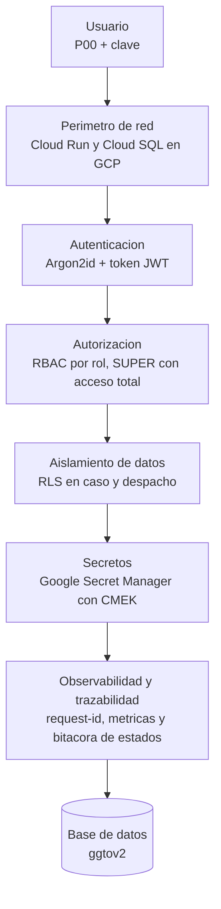

# Manual de Seguridad y Privacidad — GGTO

> Este manual explica, en lenguaje sencillo, cómo protege GGTO la información y los accesos.
> Describe **lo que el sistema hace hoy** y separa con claridad lo que está **previsto pero
> todavía no está implementado**. Todo dato que no se pudo verificar se marca como
> **«pendiente de confirmar»**. Aquí **no se incluye ningún secreto ni contraseña**: solo se citan
> los **nombres** de los secretos.

## Empezar en 5 minutos

1. **Cuida tu acceso.** Tu usuario es tu **P00** y tu clave se guarda cifrada con Argon2id. Nadie
   del equipo debe conocer tu clave.
2. **Guarda tus 12 palabras.** Al configurar tu dispositivo recibes 12 palabras de seguridad. Se
   piden **3** de ellas para desbloquear la cuenta o restablecer la clave.
3. **Respeta tu rol.** Tu rol (SUPER, ADMIN, SUPERVISOR o TECNICO) define qué puedes ver y qué
   puedes escribir. Si el menú **CONFIGURACIÓN** no aparece, es porque tu rol no lo permite.
4. **No compartas datos personales.** Teléfonos, direcciones, nombres y seriales son datos
   personales (PII). Muéstralos solo a quien los necesita para su trabajo.
5. **Reporta de inmediato** cualquier sospecha de acceso indebido, clave expuesta o envío de datos
   a un destinatario equivocado.

| Dato | Valor |
|---|---|
| Proyecto | GGTO — Sistema de administración de reportes de avería y construcción de puntos ópticos |
| Cliente | CANTV C.A. — Central Francisco Salias (Área 4) |
| Alcance | Modelo de seguridad, RBAC, RLS, secretos, PII, superficie de exposición y endurecimiento |
| Requerimientos aplicables | RNF-01 a RNF-05, RNF-18, RNF-21 y RNF-22 |
| Riesgo aceptado vigente | **D-26** — instancia compartida sin respaldos, sin PITR y sin SSL obligatorio |

---

## Modelo de seguridad

### Defensa en capas

La seguridad de GGTO se apoya en varias capas independientes: si una falla, las demás siguen
protegiendo el sistema.

| Capa | Mecanismo | Cómo está implementado |
|---|---|---|
| Perímetro de red | Servicio Cloud Run y Cloud SQL en GCP | Infraestructura en Google Cloud |
| Autenticación | `P00` + clave con hash Argon2id y token JWT | Módulo de seguridad de la aplicación |
| Autorización | RBAC por rol, con permiso total para `SUPER` | Dependencia de roles en la API |
| Aislamiento de datos | RLS en PostgreSQL sobre `caso` y `despacho` | Políticas en el esquema de la base |
| Secretos | Google Secret Manager con cifrado CMEK | Script de aprovisionamiento de KMS |
| Observabilidad | `request-id` y métricas de negocio | Middleware y endpoints de métricas |
| Trazabilidad | Bitácora de estados del caso | Tabla `caso_estado_hist` |

<!-- GENERAR_IMAGEN: defensa-en-capas.svg -->

### Autenticación

El ingreso a la plataforma se realiza con **`P00` (identificador laboral) y clave**. La clave se
almacena como hash **Argon2id**, con los parámetros por defecto de la librería `argon2-cffi`.

El perfil del dispositivo guarda **12 palabras de seguridad**. De esas 12 palabras se exigen
**3** para desbloquear la cuenta o para restablecer la clave. El diccionario de palabras está
definido en el código y se genera de forma aleatoria y segura.

| Control | Valor real |
|---|---|
| Hash de la clave | Argon2id, con parámetros por defecto |
| Algoritmo del token | HS256 |
| Vigencia del token | 480 minutos (8 horas) |
| Contenido del token | `sub` (el P00), `rol`, `exp`, `iat` y `jti` |
| Intentos antes del bloqueo | 3 |
| Límite de intentos | 10 intentos cada 60 segundos, por `P00` e IP |
| Normalización de palabras | Se pasan a minúsculas y se quitan los acentos |
| Mensaje ante un `P00` inexistente | Genérico: no revela si el usuario existe |
| Bloqueo | Se marca el usuario como bloqueado al tercer fallo y la API responde `423` |
| Desbloqueo | Con 3 de las 12 palabras |
| Restablecer la clave | Con 3 de las 12 palabras |

El token se valida en cada petición. Si falta, es inválido o está expirado, la API responde `401`.
Si el usuario está bloqueado, responde `423`.

> **Punto de atención:** la clave de firma de la aplicación (`secret_key`) tiene un **valor por
> defecto de desarrollo**. En producción ese valor debe venir de Secret Manager, con el nombre
> `SECRET_KEY`. Si no se sobrescribe, cualquiera podría forjar un token. **Verificar este valor en
> cada despliegue es una tarea operativa crítica.**

### Autorización

La autorización se resuelve con una fábrica de guardias de roles. Cada módulo declara los roles que
pueden **escribir**; la lectura se concede a cualquier usuario autenticado.

| Módulo | Permiso de escritura |
|---|---|
| Ingesta | `ADMIN` y `SUPERVISOR` |
| PANEL / CASOS | `ADMIN` y `SUPERVISOR` |
| DESPACHO | `ADMIN` y `SUPERVISOR` |
| ESPECIALES / AGENDA | `ADMIN` y `SUPERVISOR` |
| CONFIGURACIÓN | `ADMIN` y `SUPERVISOR` |
| ALERTAS / OUTBOX | `ADMIN` y `SUPERVISOR` |
| MONITOREO / REPORTES | Solo lectura (cualquier usuario autenticado) |

En la aplicación web, el menú **CONFIGURACIÓN** solo se muestra a los roles `SUPER`, `ADMIN` y
`SUPERVISOR`. El rol `TECNICO` ve los formularios en **modo solo lectura**.

> Ocultar el menú es una ayuda de usabilidad, **no** un control de seguridad. La autorización real
> ocurre en el backend: aunque alguien intente llamar a un endpoint directamente, el servidor
> valida el rol.

### Auditoría

La tabla `auditoria` está definida en el esquema con los campos: `usuario`, `accion`, `entidad`,
`id_entidad`, `datos_antes`, `datos_despues`, `ip` y `fecha_hora`.

> ⚠️ **La aplicación no escribe en `auditoria`.** No existe ninguna referencia a esa tabla en el
> código de la aplicación. La trazabilidad efectiva en la versión 1 se limita a:
>
> - la **bitácora de estados** `caso_estado_hist`, que registra estado anterior, estado nuevo,
>   motivo y usuario, y se consulta por caso;
> - el campo `caso.creado_por`;
> - el registro del middleware, que **no incluye el usuario**.

Los requerimientos RNF-12 y RNF-19 exigen registrar usuario, fecha y hora y los cambios sobre cada
caso, además de incluir el usuario en los registros. **El registro general en `auditoria` y el
usuario en los registros están pendientes de confirmar y no están implementados.**

---

## RBAC

### 4 roles y bypass SUPER

Los roles de la versión 1 son **SUPER, ADMIN, SUPERVISOR y TECNICO**. Cada usuario pertenece a
**una central**.

El rol **`SUPER`** (Super Usuario) tiene **acceso total**: la guardia de roles le concede cualquier
operación sin necesidad de enumerarlo en cada endpoint. Es una decisión explícita (**D-50**) que
cubre también las secciones y funciones futuras.

La cuenta se crea con el script `scripts/inyectar_super_usuario.py`, que es idempotente, pide
confirmación y **no escribe la clave en el archivo ni en la línea de comandos**: la lee de la
variable de entorno `GGTO_SUPER_CLAVE` o la solicita de forma oculta.

| Aspecto de `SUPER` | Comportamiento |
|---|---|
| Permiso de autorización | Cualquier operación permitida |
| Creación de la cuenta | Script con confirmación y bitácora |
| Hash de la clave | Reutiliza el mismo Argon2id de la aplicación |
| Palabras de seguridad | Opcionales, con la opción `--con-palabras` |

### Matriz rol × módulo (requerimientos.md:227-256)

| Módulo / acción | SUPER | ADMIN | SUPERVISOR | TECNICO |
|---|---|---|---|---|
| CONFIGURACIÓN (central, sectores, catálogos, usuarios, flota, cuadrillas) | CRUD | CRUD | Lectura + edición operativa | — |
| INGESTA (cargar y procesar CSV) | CRUD | CRUD | CRUD | — |
| PANEL (buscar, editar, alta manual) | CRUD | CRUD | CRUD | Lectura de sus casos |
| CASOS / SEGUIMIENTO / EMPRESAS / REFERIDOS | CRUD | CRUD | CRUD | Lectura + gestión de su cuadrilla |
| DESPACHO (armar, publicar, reporte 16:00) | CRUD | CRUD | CRUD | Lectura de su despacho |
| GESTIÓN (cuadrilla 0) | CRUD | CRUD | CRUD | — |
| MONITOREO / GRÁFICOS | Lectura | Lectura | Lectura | — |
| GESTIÓN TÉCNICA (contactar, atender, cerrar, enrutar, diferir, evidencias) | CRUD | — | Lectura | CRUD (solo sus casos y en modo sin conexión) |
| ALERTAS (falla masiva, incidentes, solicitud de material) | CRUD | Lectura | Lectura | CRUD |
| INSUMOS (versión 2) | CRUD | CRUD | CRUD | Solicitud |
| AUDITORÍA | Lectura | Lectura | — | — |
| USUARIOS y accesos | CRUD | CRUD | Alta y baja de técnicos | — |

El rol `SUPER` no se enumera en los endpoints porque la guardia de roles le concede todo.

> **Brechas verificadas entre la matriz y el código:**
>
> 1. La matriz prevé la gestión de **USUARIOS y accesos**, pero el inventario de endpoints **no
>    incluye `/api/v1/usuarios`** ni existe una pantalla dedicada: hoy la creación y actualización
>    de usuarios se hace con el script `scripts/inyectar_super_usuario.py`. Está **pendiente de
>    confirmar**.
> 2. La matriz limita al TECNICO a «sus casos», pero el listado de casos solo filtra por central
>    si el cliente envía ese parámetro. **No hay acotación automática** por la central del usuario.
>    Está **pendiente de confirmar** (ver «RLS»).
> 3. Toda la escritura por encima de TECNICO exige ADMIN o SUPERVISOR. **No existe** un rol con
>    permiso de escritura exclusivo de MONITOREO.

### Pruebas negativas

Las pruebas de autorización y de interfaz están documentadas en el informe de Fase 4:

| Prueba | Ámbito | Resultado |
|---|---|---|
| `test_config.py` (13) | RBAC de escritura en CONFIGURACIÓN | 13/13 |
| `11-rbac.spec.js` (4) | TECNICO solo lectura, ADMIN operativo | 4/4 |
| `02-navegacion.spec.js` (7) | RBAC del menú y de las secciones | 7/7 |
| `test_auth.py` (11) | Inicio de sesión, bloqueo, desbloqueo y 12 palabras | 11/11 |

El total de la Fase 4 fue **169/169 pruebas `pytest` + 46/46 pruebas E2E = 215 pruebas en verde**.
Además, las herramientas `ruff`, `mypy` y `tsc` en modo estricto no reportaron hallazgos.

Las pruebas negativas **entre centrales** (que la central A no pueda acceder a datos de la central
B), que exige RNF-21, **no se documentan** en el informe y están **pendientes de confirmar**.

---

## RLS en PostgreSQL

### Caso y despacho

La **seguridad por filas** (*Row Level Security*, RLS) se aplica como **defensa en profundidad**
sobre dos tablas: `caso` y `despacho`. Ambas tienen habilitada y forzada la seguridad por filas.

La función `app_central_actual()` lee el parámetro de sesión `app.id_central` y lo convierte a un
número entero.

### Políticas

| Tabla | Política | Regla |
|---|---|---|
| `caso` | `p_caso_central` | La central actual es nula, o la central de la fila es igual a la central actual |
| `despacho` | `p_despacho_central` | La misma regla |

Ambas políticas usan la misma expresión para la lectura y para la escritura, de modo que limitan
tanto consultar como modificar datos.

> ⚠️ **La cláusula que permite el valor nulo es un modo de compatibilidad.** El propio esquema
> advierte que la aplicación debe fijar el alcance con `SET LOCAL app.id_central = '<id_central>'`
> en cada conexión, y que **antes de producción debe eliminarse esa cláusula** para que la política
> sea de «denegar por defecto».
>
> **Estado real:** ninguna parte de la aplicación ejecuta `SET LOCAL app.id_central`. En
> consecuencia, el parámetro siempre es nulo y las políticas **permiten todas las filas**. La capa
> RLS está desplegada, pero **inactiva de hecho**: es un control **pendiente de confirmar y de
> conectar** desde la capa de datos.

### Alcance por central (RNF-21)

RNF-21 exige que la central del usuario acote su alcance y que RLS refuerce la autorización. Hoy:

| Control | Estado |
|---|---|
| El campo `usuario.id_central` existe en el modelo | ✅ |
| El token incorpora la central del usuario | ✅ |
| Las consultas acotan por la central del usuario | ❌ No; solo si el cliente lo pide como parámetro |
| RLS activa con `app.id_central` fijado por la aplicación | ❌ No se fija |
| Pruebas negativas entre centrales | ❌ No documentadas |

> **Consecuencia de seguridad:** mientras no se conecte RLS y no se acoten las consultas, un
> usuario autenticado de cualquier rol (incluido TECNICO) puede leer casos de **cualquier central**,
> pase o no el filtro. Es una brecha de aislamiento entre centrales que está **pendiente de
> confirmar y corregir**.

---

## Gestión de secretos

### Secret Manager

Los secretos se almacenan en Google Secret Manager con cifrado gestionado por **Cloud KMS (CMEK)**.
El script de aprovisionamiento define el llavero `ggtov2`, las claves `ggtov2-secrets` y
`ggtov2-storage`, y una **rotación de 90 días** (`rotationPeriod: 7776000s`).

| Secreto (solo el nombre) | Contenido |
|---|---|
| `ggtov2-db-password` | Contraseña del usuario de base de datos |
| `ggtov2-db-root-password` | Contraseña root de la instancia planificada |
| `ggtov2-app-secret-key` | Clave de firma de la aplicación (`SECRET_KEY`) |
| `ggtov2-db-connection` | Cadena de conexión de la instancia compartida |
| `ggto-secret-key` | Clave usada por el servicio `ggto-web` |
| `ggtov2-django-secret-key` | Reservado en el aprovisionamiento |
| `ggtov2-store-password` y tokens de mensajería | **No creados**: Telegram, SMTP y MCP siguen sin credenciales |

El acceso se limita por IAM con el rol `roles/secretmanager.secretAccessor` a la cuenta de servicio
del runtime `ggtov2-app@ggtov2.iam.gserviceaccount.com`.

El script de la instancia compartida otorga además lectura a `ggtov2-app@ggtov2` y a
`truekeate-app-sa@truekeate-main`. Se verificó que `truekeate-app-sa` **no** tiene acceso a los
secretos de GGTO.

### Variables de entorno

La aplicación se configura **solo por variables de entorno** (RNF-25). La configuración se declara
con `pydantic-settings` y lee un archivo `.env`. Las variables que referencian secretos **nunca
llevan el valor en el repositorio**: solo el nombre del secreto.

| Variable | Origen del valor |
|---|---|
| `SECRET_KEY` | Secret Manager (`ggtov2-app-secret-key` o `ggto-secret-key`) |
| `DB_PASSWORD` | Secret Manager (`ggtov2-db-password`) |
| `TELEGRAM_BOT_TOKEN` | Secret Manager (**no configurado**) |
| `SMTP_PASSWORD` | Secret Manager (**no configurado**) |
| `MCP_API_KEY` | Secret Manager (**no configurado**) |
| `telegram.webhook_secret` | Tabla `configuracion` (vacío: no se exige) |
| `mcp.api_key` | Tabla `configuracion` (vacío: no se exige) |

El archivo `.gitignore` excluye los CSV con datos personales (`detalle_averias_gpon*.csv`), por el
hallazgo H-01, y la carpeta `RepoTecnico/credenciales/` también está ignorada por Git.

### Rotación

| Elemento | Periodicidad o procedimiento |
|---|---|
| Claves de Cloud KMS | Rotación automática cada 90 días |
| Contraseña de base de datos | Nueva versión del secreto y nueva revisión de Cloud Run |
| `SECRET_KEY` de la aplicación | **Pendiente de confirmar**: no hay procedimiento documentado |
| Token JWT | Sin revocación: es *stateless*; el `jti` se emite, pero no hay lista de revocación |

### Incidente de exposición resuelto (entornos_globales.md:100-106)

Durante la verificación del entorno, un mensaje de error de Node **imprimió la contraseña** del
usuario `app` de TrueKeate, que estaba contenida en el secreto `DATABASE_URL`. La respuesta fue:

1. Rotar la contraseña con `ALTER ROLE app PASSWORD '<nueva>'`, usando 32 caracteres aleatorios.
2. Publicar una **nueva versión del secreto** `DATABASE_URL` (versión 3) en `truekeate-main`.
3. Desplegar una **nueva revisión** de Cloud Run `truekeate-api-00034-hvk` para tomar el valor
   `latest`, con estado `Ready`, el 100 % del tráfico y sin errores de autenticación en los
   registros.
4. Confirmar que `truekeate-web` no consume `DATABASE_URL`, por lo que no necesitó una revisión
   nueva.

**Lecciones operativas aplicables a GGTO:** no imprimir valores de secretos en registros ni en
mensajes de error; rotar ante cualquier sospecha; y consumir siempre la versión `latest` de forma
controlada, con una nueva revisión del servicio. Las credenciales de mensajería no deben
registrarse en el repositorio.

---

## PII y privacidad (RNF-18/D-34)

### Inventario de PII

El sistema trata datos personales de suscriptores y de trabajadores. RNF-18 exige un inventario y
una clasificación de datos personales, y la decisión D-34 lo aprueba como decisión de diseño.

| Entidad | Datos personales que contiene |
|---|---|
| `caso` | Nombre, teléfono, dirección y serial |
| `actividad` | Reporte libre y GPS |
| `evidencia` | Imagen, GPS y hora |
| `auditoria` | Datos antes y después |
| `notificacion` | Destinatario y cuerpo del mensaje |
| `solicitante` | Nombre y contacto |
| Archivo CSV de origen | Nombre, teléfono, dirección, serial y datos personales de trabajadores |

En producción hay **1 lote de ingesta con 42 casos reales** que contienen datos personales de
suscriptores.

### Base legal y finalidad

RNF-18 exige declarar la base legal y la finalidad del tratamiento. La decisión D-34 registra que
la base legal, la finalidad, el inventario, la minimización, el enmascaramiento, los derechos del
titular y el acuerdo de tratamiento de datos **quedan definidos** como decisión.

Queda la salvedad expresa de que la **validación legal con CANTV está pendiente**. El responsable
de protección de datos es **CANTV (externo)** y está **pendiente de designar**.

### Minimización

La minimización se aplica en la frontera de datos: el lector **descarta 21 columnas** del CSV y
mapea las restantes a **49 campos destino**, unificando tres columnas de información en una.

El archivo de origen **no se transforma** más allá de esa depuración. Los campos de texto tienen
longitudes máximas para evitar volcados inesperados.

### Enmascaramiento por rol

RNF-18 exige **enmascarar teléfono, dirección y serial** para los roles no autorizados.

> ❌ **No implementado.** No existe en el código ninguna referencia a enmascarar, ocultar o tratar
> datos personales. Los endpoints devuelven los datos en claro a cualquier usuario autenticado: el
> listado y la búsqueda de casos incluyen teléfono, nombre del cliente y dirección, y la ficha
> imprimible de la cuadrilla incluye teléfono y nombre del cliente. El **enmascaramiento por rol
> está pendiente de confirmar y no está implementado**.

### Retención por entidad (requerimientos.md:212-225)

| Entidad | ¿Contiene PII? | Retención propuesta | Acción al vencer |
|---|---|---|---|
| `caso` | Sí (nombre, teléfono, dirección, serial) | 5 años | Anonimizar y archivar |
| `actividad` | Sí (reporte libre, GPS) | 5 años | Anonimizar |
| `evidencia` | Sí (imagen, GPS y hora) | 2 años | Eliminar imagen y metadatos |
| `auditoria` | Sí (datos antes y después) | 3 años | Archivar sin datos personales |
| `notificacion` | Sí (destinatario y cuerpo) | 1 año | Eliminar |
| `solicitante` | Sí (nombre y contacto) | 5 años | Anonimizar |
| `dispositivo_seguridad` | No (solo hashes) | Mientras la cuenta esté activa | Eliminar con la cuenta |
| `inventario_movimiento` / `orden_material` (versión 2) | No | 5 años | Archivar |

Los plazos son una **propuesta** y deben validarse con CANTV y asesoría legal. **No existe** una
tarea ni rutina de purga o anonimización implementada en el código: la retención es hoy una
**política pendiente de confirmar y de automatizar**.

### Derechos del titular

RNF-18 exige atender los derechos de **acceso, rectificación y supresión**. No existe en la
versión 1 un endpoint ni una pantalla específica para ejercerlos. Las vías disponibles son
operativas (consultar y editar la ficha del caso) y no cubren la supresión ni la anonimización.
Este punto está **pendiente de confirmar** con CANTV.

### DPA con proveedores

RNF-18 exige **acuerdos de tratamiento de datos (DPA)** con los proveedores. Los proveedores que
pueden tratar datos son:

| Proveedor | Uso | Estado del DPA |
|---|---|---|
| SendGrid (o Gmail SMTP) | Envío de correo | Pendiente de confirmar |
| Telegram | Envío de alertas y bot | Pendiente de confirmar |
| Google Cloud (Cloud Run, Cloud SQL, Secret Manager) | Infraestructura | Pendiente de confirmar |
| Servidor MCP / IA | Ingesta conversacional de casos especiales | Pendiente de confirmar |

### Transferencia internacional

El tratamiento implica transferencia fuera de Venezuela: el servicio Cloud Run corre en
`europe-west1` y la base operativa en `southamerica-east1`. Además, Telegram opera en el exterior
y el correo puede usar SendGrid.

RNF-18 exige **evaluar la transferencia internacional**. La evaluación y las garantías
contractuales están **pendientes de confirmar** con CANTV y asesoría legal.

---

## Superficie de exposición actual

### Servicio Cloud Run público con PII real: DEBE restringirse

El servicio `ggto-web` está desplegado con acceso **público**: el script concede el rol
`roles/run.invoker` a `allUsers`, y el documento de entorno lo confirma como «Público (`allUsers`)
— prueba de humo; endurecer antes de producción».

La dirección del servicio es `https://ggto-web-593453426217.europe-west1.run.app`.

Ese servicio opera hoy con **datos personales reales** (42 casos) y la recomendación es explícita:
**restringir el acceso** (con IAP o invocación autenticada), porque hoy `allUsers` alcanza la API y
la aplicación web. El informe de Fase 4 lo lista como pendiente que **no bloquea** las pruebas,
pero **sí debe resolverse antes de operar en producción**, y los próximos pasos insisten en
restringir el acceso público antes de seguir cargando datos.

Precisión técnica sobre esa afirmación:

- La mayoría de los endpoints `/api/v1/*` **sí exigen token JWT**.
- Son **públicos** (sin token): `/api/v1/info`, `/health` y `/ready`; el inicio de sesión
  (`login`); la configuración inicial (`setup`); y `unlock` y `reset-password`.
- `/api/v1/telegram/webhook` y `/api/v1/mcp` se protegen con **cabecera secreta** solo si está
  configurada. Si la clave está vacía, **no se exige**.

El riesgo real es de **exposición de perímetro**: cualquier persona alcanza el servicio, la
aplicación web, el inicio de sesión y las sondas. Además, `GET /ready` publica el nombre de la
base, el usuario y el número de tablas. **Debe restringirse con IAP o con invocación
autenticada.**

### Riesgo aceptado D-26

El riesgo **D-26** fue aceptado el 2026-09-25 por la Dirección del proyecto: **no** se modifican
los respaldos, la recuperación a un punto en el tiempo (PITR) ni el SSL de la instancia compartida
`truekeate-db-dev`. Su condición de cierre es «migrar a `ggtov2-pg` propio (regional, con SSL
`ENCRYPTED_ONLY`, respaldos, PITR y protección de borrado) cuando se resuelva la cuota de
facturación».

La misma decisión indica que **no se deben cargar datos reales de producción** en la instancia
compartida hasta que exista respaldo.

| Riesgo aceptado | Impacto |
|---|---|
| Sin respaldos ni PITR | Pérdida irreversible de datos |
| Sin SSL obligatorio en la instancia | Interceptación del tráfico |
| Sin protección de borrado | Borrado accidental o malicioso sin retorno |
| Datos compartidos por base | Coexistencia con TrueKeate en la misma instancia |

### Rol de BD con NOINHERIT y riesgo residual

El rol de base de datos `ggtov2_app` fue endurecido el 2026-09-25:

| Cambio | Estado |
|---|---|
| `CREATEROLE` revocado | ✅ |
| `CREATEDB` revocado | ✅ |
| `NOINHERIT` aplicado | ✅ |
| Membresía `cloudsqlsuperuser` revocada | ⚠️ No fue posible por SQL: la pertenencia persiste, pero **no se hereda** |
| `CONNECT`, `TEMPORARY` y `CREATE` de `PUBLIC` revocados en bases ajenas | ✅ |
| `CONNECT` re-otorgado a `app` y `postgres` | ✅ (TrueKeate sigue operando) |
| `CONNECT` y `CREATE` en `ggtov2` y `public` | ✅ (el DDL de prueba funciona) |
| `truekeate-app-sa` sin acceso a secretos de GGTO | ✅ (solo `ggtov2-app@ggtov2`) |

**Riesgo residual (D-25):** al seguir siendo miembro de `cloudsqlsuperuser`, `ggtov2_app` podría
recuperar privilegios con un `SET ROLE cloudsqlsuperuser` explícito. La corrección definitiva
requiere **recrear el rol**, cosa que no es posible con los privilegios actuales. Se decidió
**aceptar el riesgo residual con `NOINHERIT`** y documentarlo.

---

## Endurecimiento recomendado

### IAP o invocación autenticada

Acción prioritaria: retirar `allUsers` del permiso de invocación de Cloud Run y exponer el servicio
mediante **Identity-Aware Proxy (IAP)** o **invocación autenticada**. Es la recomendación explícita
de la documentación del proyecto. Debe hacerse **antes de seguir cargando datos personales
reales**.

### SSL ENCRYPTED_ONLY

La instancia propia planificada fija SSL en modo `ENCRYPTED_ONLY` e IPv4 deshabilitado, con red
privada. La aplicación ya solicita TLS con `DB_SSLMODE=require`, pero la instancia compartida **no
lo obliga**.

Al migrar a `ggtov2-pg`, verifica que la conexión use socket privado y TLS estricto.

### Backups/PITR

Habilita en la instancia propia los respaldos (`backupConfiguration.enabled`), la recuperación a un
punto en el tiempo (`pointInTimeRecoveryEnabled`) y la protección de borrado
(`deletionProtectionEnabled`). Esto cierra D-26 y satisface RNF-16 (RPO ≤ 24 h y RTO ≤ 4 h).

Debe acompañarse de una **prueba de restauración documentada** al menos cada trimestre (RNF-16).

### MFA (RNF-22, previsto)

RNF-22 exige **MFA obligatorio para ADMIN y SUPERVISOR**, además de política de complejidad,
caducidad e historial de claves; expiración, rotación y revocación de sesión; protección CSRF y
CORS; y registro de los eventos de inicio de sesión. La matriz RBAC insiste en el MFA para ADMIN y
SUPERVISOR.

| Control de RNF-22 | Estado real |
|---|---|
| Hash Argon2id | ✅ Implementado |
| Bloqueo y límite de intentos | ✅ Implementado |
| Expiración del token | ✅ 480 minutos |
| MFA | ❌ No implementado (no hay TOTP ni OTP en el código) |
| Complejidad, caducidad e historial de claves | ❌ No implementado |
| Revocación de sesión o token | ❌ No implementado (JWT sin lista de revocación) |
| Protección CSRF | ❌ No implementado (no hay referencias a CSRF) |
| CORS restringido | ⚠️ Por defecto `cors_origins = "*"` |
| Registro de eventos de inicio de sesión | ⚠️ Solo el registro general, sin usuario |
| Autenticación de canales externos | ⚠️ Por cabecera, solo si la clave está configurada |

> El **MFA, la política de claves, la revocación de tokens, la protección CSRF y un CORS
> restringido** están exigidos por RNF-22 pero **no están implementados**: son los principales
> puntos de endurecimiento **pendientes de confirmar**. Mientras tanto, `cors_origins` debe
> fijarse a los orígenes reales en producción, y las claves `telegram.webhook_secret` y
> `mcp.api_key` deben establecerse (hoy están vacías, por lo que no se exigen).

---

## Cumplimiento y pendientes

| Tema | Responsable | Estado |
|---|---|---|
| Administración de catálogos, flota y almacén | SUPERVISOR | Cubierto en la versión 1 |
| Auditoría interna de la bitácora | ADMIN (solo lectura de `auditoria`) | **Sin datos**: la aplicación no escribe en `auditoria` |
| Soporte y mesa de ayuda de la plataforma | SUPERVISOR (registro por correo) | Informal en la versión 1 |
| Responsable de protección de datos | **CANTV (externo)** | **Pendiente de designar** |
| Dueño del sistema origen (CSV) | **CANTV (externo)** | **Pendiente de formalizar** |
| Validación legal de base legal y retención | CANTV y asesoría legal | **Pendiente** |
| Firma del contrato de interfaz del CSV | CANTV | **Pendiente** |

Gobierno de datos en la versión 1 (D-39): la administración de catálogos, la flota y el almacén
recaen en el SUPERVISOR; la auditoría interna, en el ADMIN en modo lectura. **No existe el rol
AUDITOR en la versión 1.**

### Lista de acciones recomendadas

1. Restringir el acceso público de `ggto-web` con IAP o invocación autenticada.
2. Migrar a `ggtov2-pg` con respaldos, PITR, SSL `ENCRYPTED_ONLY` y protección de borrado.
3. Implementar el **enmascaramiento por rol** de teléfono, dirección y serial.
4. Implementar el registro de **auditoría** y añadir el usuario a los registros.
5. Conectar **RLS** fijando `app.id_central` por sesión y acotar las consultas por la central del
   usuario.
6. Habilitar **MFA** para ADMIN y SUPERVISOR y la política de claves de RNF-22.
7. Fijar `cors_origins` a los orígenes reales y establecer `telegram.webhook_secret` y
   `mcp.api_key`.
8. Definir con CANTV la base legal, la retención definitiva y los DPA de los proveedores.
9. Establecer el procedimiento de rotación de `SECRET_KEY` y verificar que no use el valor por
   defecto.

> **Nota final de fidelidad:** los controles marcados como ✅ están implementados y localizados en
> el código; los marcados como ❌ o «pendiente de confirmar» se declaran así porque **no existen**
> en el repositorio, pese a figurar en los requerimientos. No se ha documentado ningún control que
> no se haya podido verificar.
